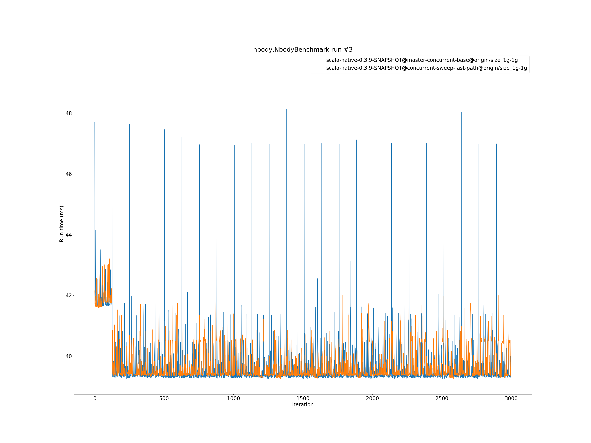

# Summary
## Benchmark run time (ms) at 50 percentile 

|name | scala-native-0.3.9-SNAPSHOT@master-concurrent-base@origin/size_1g-1g | scala-native-0.3.9-SNAPSHOT@concurrent-sweep-fast-path@origin/size_1g-1g | |
| -- | -- | -- | -- |
|[bounce.BounceBenchmark](#bouncebouncebenchmark)|0.0608|0.0616|+1.23%|
|[brainfuck.BrainfuckBenchmark](#brainfuckbrainfuckbenchmark)|3.2888|3.2294|__-1.81%__|
|[cd.CDBenchmark](#cdcdbenchmark)|31.5097|31.5601|+0.16%|
|[deltablue.DeltaBlueBenchmark](#deltabluedeltabluebenchmark)|0.2325|0.2321|__-0.18%__|
|[gcbench.GCBenchBenchmark](#gcbenchgcbenchbenchmark)|105.8854|105.3209|__-0.53%__|
|[json.JsonBenchmark](#jsonjsonbenchmark)|1.6301|1.6465|+1.00%|
|[kmeans.KmeansBenchmark](#kmeanskmeansbenchmark)|51.9209|51.0435|__-1.69%__|
|[list.ListBenchmark](#listlistbenchmark)|0.0548|0.0678|+23.74%|
|[mandelbrot.MandelbrotBenchmark](#mandelbrotmandelbrotbenchmark)|126.1105|126.0269|__-0.07%__|
|[nbody.NbodyBenchmark](#nbodynbodybenchmark)|39.3838|39.4259|+0.11%|
|[permute.PermuteBenchmark](#permutepermutebenchmark)|0.2762|0.2754|__-0.30%__|
|[queens.QueensBenchmark](#queensqueensbenchmark)|0.1204|0.1222|+1.49%|
|[richards.RichardsBenchmark](#richardsrichardsbenchmark)|0.0949|0.0861|__-9.29%__|
|[sudoku.SudokuBenchmark](#sudokusudokubenchmark)|2.4403|2.3854|__-2.25%__|
|[tracer.TracerBenchmark](#tracertracerbenchmark)|0.8200|0.8279|+0.97%|
| __Geometrical mean:__|| |+0.64%|
## Benchmark run time (ms) at 90 percentile 

|name | scala-native-0.3.9-SNAPSHOT@master-concurrent-base@origin/size_1g-1g | scala-native-0.3.9-SNAPSHOT@concurrent-sweep-fast-path@origin/size_1g-1g | |
| -- | -- | -- | -- |
|[bounce.BounceBenchmark](#bouncebouncebenchmark)|0.0623|0.0629|+0.93%|
|[brainfuck.BrainfuckBenchmark](#brainfuckbrainfuckbenchmark)|3.3789|3.3300|__-1.45%__|
|[cd.CDBenchmark](#cdcdbenchmark)|32.7606|32.3635|__-1.21%__|
|[deltablue.DeltaBlueBenchmark](#deltabluedeltabluebenchmark)|0.2382|0.2370|__-0.52%__|
|[gcbench.GCBenchBenchmark](#gcbenchgcbenchbenchmark)|113.6988|111.5215|__-1.91%__|
|[json.JsonBenchmark](#jsonjsonbenchmark)|1.6732|1.6912|+1.07%|
|[kmeans.KmeansBenchmark](#kmeanskmeansbenchmark)|53.0932|52.3448|__-1.41%__|
|[list.ListBenchmark](#listlistbenchmark)|0.0562|0.0696|+23.88%|
|[mandelbrot.MandelbrotBenchmark](#mandelbrotmandelbrotbenchmark)|126.8113|126.8059|__-0.00%__|
|[nbody.NbodyBenchmark](#nbodynbodybenchmark)|40.2875|40.5098|+0.55%|
|[permute.PermuteBenchmark](#permutepermutebenchmark)|0.2827|0.2824|__-0.11%__|
|[queens.QueensBenchmark](#queensqueensbenchmark)|0.1228|0.1253|+2.01%|
|[richards.RichardsBenchmark](#richardsrichardsbenchmark)|0.0978|0.0888|__-9.27%__|
|[sudoku.SudokuBenchmark](#sudokusudokubenchmark)|2.5145|2.5014|__-0.52%__|
|[tracer.TracerBenchmark](#tracertracerbenchmark)|0.8439|0.8512|+0.87%|
| __Geometrical mean:__|| |+0.66%|
## Benchmark run time (ms) at 99 percentile 

|name | scala-native-0.3.9-SNAPSHOT@master-concurrent-base@origin/size_1g-1g | scala-native-0.3.9-SNAPSHOT@concurrent-sweep-fast-path@origin/size_1g-1g | |
| -- | -- | -- | -- |
|[bounce.BounceBenchmark](#bouncebouncebenchmark)|0.0646|0.0648|+0.27%|
|[brainfuck.BrainfuckBenchmark](#brainfuckbrainfuckbenchmark)|3.4959|3.5061|+0.29%|
|[cd.CDBenchmark](#cdcdbenchmark)|39.6485|34.6343|__-12.65%__|
|[deltablue.DeltaBlueBenchmark](#deltabluedeltabluebenchmark)|0.2498|0.2446|__-2.08%__|
|[gcbench.GCBenchBenchmark](#gcbenchgcbenchbenchmark)|114.9839|112.8933|__-1.82%__|
|[json.JsonBenchmark](#jsonjsonbenchmark)|1.7300|1.8098|+4.62%|
|[kmeans.KmeansBenchmark](#kmeanskmeansbenchmark)|61.7564|55.2434|__-10.55%__|
|[list.ListBenchmark](#listlistbenchmark)|0.0580|0.0715|+23.36%|
|[mandelbrot.MandelbrotBenchmark](#mandelbrotmandelbrotbenchmark)|128.8678|129.6112|+0.58%|
|[nbody.NbodyBenchmark](#nbodynbodybenchmark)|41.8785|41.6887|__-0.45%__|
|[permute.PermuteBenchmark](#permutepermutebenchmark)|0.2978|0.2934|__-1.50%__|
|[queens.QueensBenchmark](#queensqueensbenchmark)|0.1272|0.1303|+2.43%|
|[richards.RichardsBenchmark](#richardsrichardsbenchmark)|0.1031|0.0941|__-8.71%__|
|[sudoku.SudokuBenchmark](#sudokusudokubenchmark)|2.6030|2.5670|__-1.38%__|
|[tracer.TracerBenchmark](#tracertracerbenchmark)|0.8840|1.5575|+76.19%|
| __Geometrical mean:__|| |+3.02%|
## Benchmark total run time (ms) 

|name | scala-native-0.3.9-SNAPSHOT@master-concurrent-base@origin/size_1g-1g | scala-native-0.3.9-SNAPSHOT@concurrent-sweep-fast-path@origin/size_1g-1g | |
| -- | -- | -- | -- |
|[bounce.BounceBenchmark](#bouncebouncebenchmark)|1220.6745|1234.5599|+1.14%|
|[brainfuck.BrainfuckBenchmark](#brainfuckbrainfuckbenchmark)|66786.5276|65255.8956|__-2.29%__|
|[cd.CDBenchmark](#cdcdbenchmark)|644172.7054|637024.1209|__-1.11%__|
|[deltablue.DeltaBlueBenchmark](#deltabluedeltabluebenchmark)|4678.7621|4659.9946|__-0.40%__|
|[gcbench.GCBenchBenchmark](#gcbenchgcbenchbenchmark)|2098783.9745|2061994.8449|__-1.75%__|
|[json.JsonBenchmark](#jsonjsonbenchmark)|33089.1696|33164.1192|+0.23%|
|[kmeans.KmeansBenchmark](#kmeanskmeansbenchmark)|1046185.1819|1026851.2859|__-1.85%__|
|[list.ListBenchmark](#listlistbenchmark)|1105.2728|1362.1356|+23.24%|
|[mandelbrot.MandelbrotBenchmark](#mandelbrotmandelbrotbenchmark)|2526501.5316|2526458.3116|__-0.00%__|
|[nbody.NbodyBenchmark](#nbodynbodybenchmark)|793053.0000|794195.3176|+0.14%|
|[permute.PermuteBenchmark](#permutepermutebenchmark)|5553.1130|5537.2752|__-0.29%__|
|[queens.QueensBenchmark](#queensqueensbenchmark)|2409.7053|2454.9644|+1.88%|
|[richards.RichardsBenchmark](#richardsrichardsbenchmark)|1910.2981|1732.0852|__-9.33%__|
|[sudoku.SudokuBenchmark](#sudokusudokubenchmark)|49323.4374|48271.2491|__-2.13%__|
|[tracer.TracerBenchmark](#tracertracerbenchmark)|16944.2481|16816.5909|__-0.75%__|
| __Geometrical mean:__|| |+0.25%|
# Individual benchmarks
## bounce.BounceBenchmark

## brainfuck.BrainfuckBenchmark

## cd.CDBenchmark

## deltablue.DeltaBlueBenchmark

## gcbench.GCBenchBenchmark

## json.JsonBenchmark

## kmeans.KmeansBenchmark

## list.ListBenchmark

## mandelbrot.MandelbrotBenchmark

## nbody.NbodyBenchmark

## permute.PermuteBenchmark

## queens.QueensBenchmark

## richards.RichardsBenchmark

## sudoku.SudokuBenchmark

## tracer.TracerBenchmark

