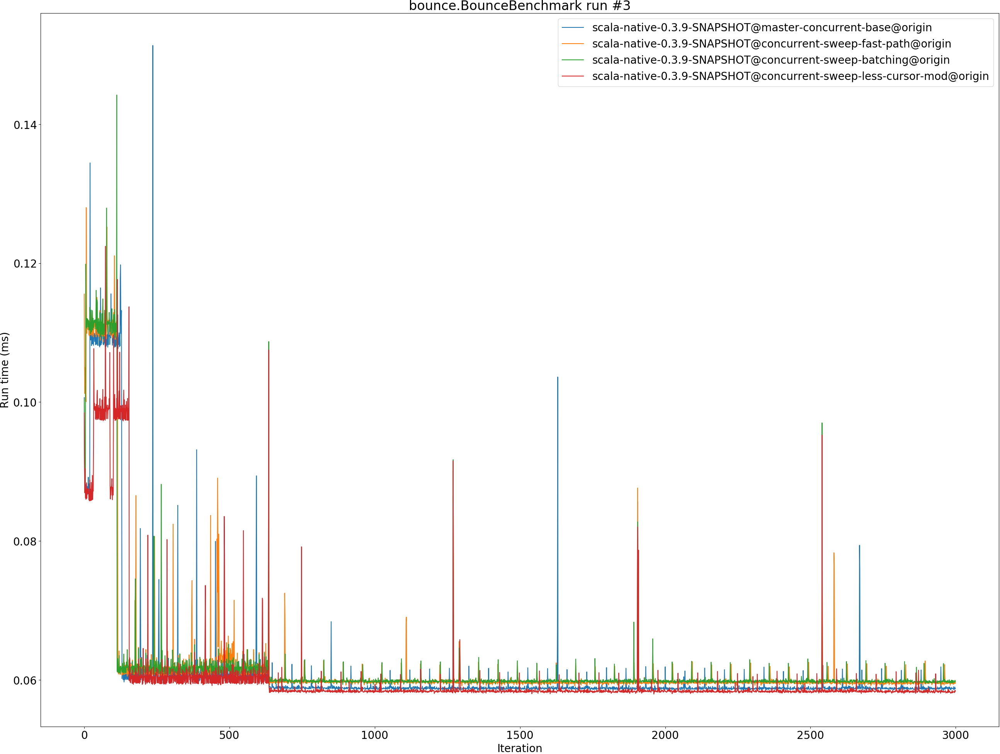
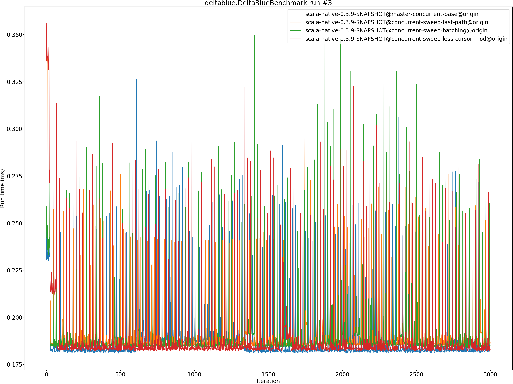
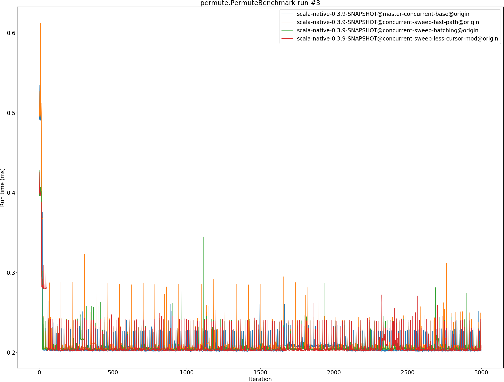

# Summary
## Benchmark run time (ms) at 50 percentile 

|name | scala-native-0.3.9-SNAPSHOT@master-concurrent-base@origin | scala-native-0.3.9-SNAPSHOT@concurrent-sweep-fast-path@origin |  | scala-native-0.3.9-SNAPSHOT@concurrent-sweep-batching@origin |  | scala-native-0.3.9-SNAPSHOT@concurrent-sweep-less-cursor-mod@origin | |
| -- | -- | -- | -- | -- | -- | -- | -- |
|[bounce.BounceBenchmark](#bouncebouncebenchmark)|0.0588|0.0596|+1.39%|0.0598|+1.64%|0.0584|__-0.77%__|
|[brainfuck.BrainfuckBenchmark](#brainfuckbrainfuckbenchmark)|3.3759|3.3610|__-0.44%__|3.4674|+2.71%|3.3335|__-1.26%__|
|[cd.CDBenchmark](#cdcdbenchmark)|32.7898|32.3729|__-1.27%__|32.5097|__-0.85%__|32.7749|__-0.05%__|
|[deltablue.DeltaBlueBenchmark](#deltabluedeltabluebenchmark)|0.1823|0.1860|+1.98%|0.1849|+1.41%|0.1832|+0.48%|
|[gcbench.GCBenchBenchmark](#gcbenchgcbenchbenchmark)|132.9232|132.6001|__-0.24%__|132.9007|__-0.02%__|132.6955|__-0.17%__|
|[json.JsonBenchmark](#jsonjsonbenchmark)|1.6521|1.6810|+1.74%|1.6409|__-0.68%__|1.6714|+1.17%|
|[kmeans.KmeansBenchmark](#kmeanskmeansbenchmark)|53.9548|55.0496|+2.03%|52.7373|__-2.26%__|53.4044|__-1.02%__|
|[mandelbrot.MandelbrotBenchmark](#mandelbrotmandelbrotbenchmark)|126.0747|126.0126|__-0.05%__|126.0511|__-0.02%__|126.0381|__-0.03%__|
|[nbody.NbodyBenchmark](#nbodynbodybenchmark)|39.4352|39.5023|+0.17%|39.4545|+0.05%|39.4838|+0.12%|
|[permute.PermuteBenchmark](#permutepermutebenchmark)|0.2027|0.2051|+1.17%|0.2042|+0.70%|0.2026|__-0.08%__|
|[queens.QueensBenchmark](#queensqueensbenchmark)|0.1155|0.1191|+3.07%|0.1181|+2.25%|0.1155|__-0.05%__|
|[richards.RichardsBenchmark](#richardsrichardsbenchmark)|0.0769|0.0769|__-0.02%__|0.0894|+16.29%|0.0894|+16.28%|
|[sudoku.SudokuBenchmark](#sudokusudokubenchmark)|2.4286|2.4329|+0.17%|2.4240|__-0.19%__|2.4658|+1.53%|
|[tracer.TracerBenchmark](#tracertracerbenchmark)|0.7508|0.7634|+1.68%|0.7625|+1.55%|0.7646|+1.84%|
| __Geometrical mean:__|| |+0.81%| |+1.53%| |+1.20%|
## Benchmark run time (ms) at 90 percentile 

|name | scala-native-0.3.9-SNAPSHOT@master-concurrent-base@origin | scala-native-0.3.9-SNAPSHOT@concurrent-sweep-fast-path@origin |  | scala-native-0.3.9-SNAPSHOT@concurrent-sweep-batching@origin |  | scala-native-0.3.9-SNAPSHOT@concurrent-sweep-less-cursor-mod@origin | |
| -- | -- | -- | -- | -- | -- | -- | -- |
|[bounce.BounceBenchmark](#bouncebouncebenchmark)|0.0605|0.0600|__-0.75%__|0.0601|__-0.61%__|0.0588|__-2.85%__|
|[brainfuck.BrainfuckBenchmark](#brainfuckbrainfuckbenchmark)|3.4634|3.4640|+0.02%|3.5544|+2.63%|3.4282|__-1.02%__|
|[cd.CDBenchmark](#cdcdbenchmark)|33.3898|32.6076|__-2.34%__|32.7788|__-1.83%__|33.0223|__-1.10%__|
|[deltablue.DeltaBlueBenchmark](#deltabluedeltabluebenchmark)|0.1924|0.1914|__-0.53%__|0.1905|__-0.96%__|0.1887|__-1.92%__|
|[gcbench.GCBenchBenchmark](#gcbenchgcbenchbenchmark)|135.6477|135.3878|__-0.19%__|137.2482|+1.18%|135.7503|+0.08%|
|[json.JsonBenchmark](#jsonjsonbenchmark)|1.6739|1.7049|+1.85%|1.6703|__-0.22%__|1.6944|+1.22%|
|[kmeans.KmeansBenchmark](#kmeanskmeansbenchmark)|56.3564|56.8751|+0.92%|54.7551|__-2.84%__|55.5521|__-1.43%__|
|[mandelbrot.MandelbrotBenchmark](#mandelbrotmandelbrotbenchmark)|126.7456|126.5493|__-0.15%__|126.6876|__-0.05%__|126.7299|__-0.01%__|
|[nbody.NbodyBenchmark](#nbodynbodybenchmark)|40.2439|39.8913|__-0.88%__|39.9061|__-0.84%__|39.9533|__-0.72%__|
|[permute.PermuteBenchmark](#permutepermutebenchmark)|0.2269|0.2125|__-6.36%__|0.2422|+6.72%|0.2094|__-7.72%__|
|[queens.QueensBenchmark](#queensqueensbenchmark)|0.1188|0.1225|+3.07%|0.1204|+1.32%|0.1188|+0.01%|
|[richards.RichardsBenchmark](#richardsrichardsbenchmark)|0.0799|0.0787|__-1.56%__|0.0917|+14.75%|0.0918|+14.90%|
|[sudoku.SudokuBenchmark](#sudokusudokubenchmark)|2.6249|2.4977|__-4.85%__|2.5088|__-4.42%__|2.6094|__-0.59%__|
|[tracer.TracerBenchmark](#tracertracerbenchmark)|0.7768|0.7776|+0.10%|0.7802|+0.43%|0.7864|+1.22%|
| __Geometrical mean:__|| |__-0.86%__| |+0.99%| |__-0.10%__|
## Benchmark run time (ms) at 99 percentile 

|name | scala-native-0.3.9-SNAPSHOT@master-concurrent-base@origin | scala-native-0.3.9-SNAPSHOT@concurrent-sweep-fast-path@origin |  | scala-native-0.3.9-SNAPSHOT@concurrent-sweep-batching@origin |  | scala-native-0.3.9-SNAPSHOT@concurrent-sweep-less-cursor-mod@origin | |
| -- | -- | -- | -- | -- | -- | -- | -- |
|[bounce.BounceBenchmark](#bouncebouncebenchmark)|0.0626|0.0626|+0.03%|0.0631|+0.77%|0.0613|__-2.08%__|
|[brainfuck.BrainfuckBenchmark](#brainfuckbrainfuckbenchmark)|3.5840|3.5653|__-0.52%__|3.6561|+2.01%|3.5298|__-1.51%__|
|[cd.CDBenchmark](#cdcdbenchmark)|34.2258|33.1528|__-3.14%__|33.2745|__-2.78%__|33.5428|__-2.00%__|
|[deltablue.DeltaBlueBenchmark](#deltabluedeltabluebenchmark)|0.2633|0.2694|+2.34%|0.2856|+8.47%|0.2869|+8.97%|
|[gcbench.GCBenchBenchmark](#gcbenchgcbenchbenchmark)|136.9762|137.5641|+0.43%|138.1303|+0.84%|136.4792|__-0.36%__|
|[json.JsonBenchmark](#jsonjsonbenchmark)|1.7575|1.7450|__-0.71%__|1.7263|__-1.78%__|1.7573|__-0.01%__|
|[kmeans.KmeansBenchmark](#kmeanskmeansbenchmark)|58.3701|58.6494|+0.48%|56.1478|__-3.81%__|57.2405|__-1.94%__|
|[mandelbrot.MandelbrotBenchmark](#mandelbrotmandelbrotbenchmark)|128.7248|129.5780|+0.66%|129.6241|+0.70%|129.6137|+0.69%|
|[nbody.NbodyBenchmark](#nbodynbodybenchmark)|41.6190|41.2365|__-0.92%__|41.3591|__-0.62%__|41.5654|__-0.13%__|
|[permute.PermuteBenchmark](#permutepermutebenchmark)|0.2392|0.2467|+3.11%|0.2600|+8.68%|0.2556|+6.84%|
|[queens.QueensBenchmark](#queensqueensbenchmark)|0.1262|0.1275|+0.99%|0.1250|__-0.98%__|0.1250|__-0.96%__|
|[richards.RichardsBenchmark](#richardsrichardsbenchmark)|0.0877|0.0872|__-0.56%__|0.1003|+14.37%|0.1025|+16.78%|
|[sudoku.SudokuBenchmark](#sudokusudokubenchmark)|2.7182|2.5822|__-5.01%__|2.6112|__-3.94%__|2.6707|__-1.75%__|
|[tracer.TracerBenchmark](#tracertracerbenchmark)|0.8415|0.8047|__-4.37%__|0.8027|__-4.60%__|0.8299|__-1.37%__|
| __Geometrical mean:__|| |__-0.54%__| |+1.10%| |+1.38%|
## Benchmark total run time (ms) 

|name | scala-native-0.3.9-SNAPSHOT@master-concurrent-base@origin | scala-native-0.3.9-SNAPSHOT@concurrent-sweep-fast-path@origin |  | scala-native-0.3.9-SNAPSHOT@concurrent-sweep-batching@origin |  | scala-native-0.3.9-SNAPSHOT@concurrent-sweep-less-cursor-mod@origin | |
| -- | -- | -- | -- | -- | -- | -- | -- |
|[bounce.BounceBenchmark](#bouncebouncebenchmark)|1185.2632|1197.0104|+0.99%|1199.8667|+1.23%|1172.1881|__-1.10%__|
|[brainfuck.BrainfuckBenchmark](#brainfuckbrainfuckbenchmark)|67047.1111|67459.3400|+0.61%|69708.0506|+3.97%|67056.0405|+0.01%|
|[cd.CDBenchmark](#cdcdbenchmark)|657757.9143|648119.5282|__-1.47%__|650916.4971|__-1.04%__|656127.4530|__-0.25%__|
|[deltablue.DeltaBlueBenchmark](#deltabluedeltabluebenchmark)|3744.6118|3802.8546|+1.56%|3800.9489|+1.50%|3764.2202|+0.52%|
|[gcbench.GCBenchBenchmark](#gcbenchgcbenchbenchmark)|2622185.5744|2592816.5906|__-1.12%__|2628060.8582|+0.22%|2597221.7163|__-0.95%__|
|[json.JsonBenchmark](#jsonjsonbenchmark)|32669.6568|33028.6968|+1.10%|32379.0734|__-0.89%__|32785.5923|+0.35%|
|[kmeans.KmeansBenchmark](#kmeanskmeansbenchmark)|1077865.6741|1099298.6559|+1.99%|1054952.2619|__-2.13%__|1068802.2998|__-0.84%__|
|[mandelbrot.MandelbrotBenchmark](#mandelbrotmandelbrotbenchmark)|2525585.6944|2524977.5877|__-0.02%__|2526167.3424|+0.02%|2526181.2099|+0.02%|
|[nbody.NbodyBenchmark](#nbodynbodybenchmark)|792356.6569|792107.8635|__-0.03%__|791378.2895|__-0.12%__|791928.5567|__-0.05%__|
|[permute.PermuteBenchmark](#permutepermutebenchmark)|4141.0957|4162.0266|+0.51%|4220.3826|+1.91%|4117.0500|__-0.58%__|
|[queens.QueensBenchmark](#queensqueensbenchmark)|2329.7301|2392.9261|+2.71%|2369.8766|+1.72%|2326.8212|__-0.12%__|
|[richards.RichardsBenchmark](#richardsrichardsbenchmark)|1555.5275|1548.4728|__-0.45%__|1802.1316|+15.85%|1802.6761|+15.89%|
|[sudoku.SudokuBenchmark](#sudokusudokubenchmark)|49168.7215|48906.5380|__-0.53%__|48800.8750|__-0.75%__|49720.3476|+1.12%|
|[tracer.TracerBenchmark](#tracertracerbenchmark)|15044.7692|15124.9325|+0.53%|15116.1023|+0.47%|15201.7252|+1.04%|
| __Geometrical mean:__|| |+0.45%| |+1.49%| |+1.00%|
# Individual benchmarks
## bounce.BounceBenchmark

## brainfuck.BrainfuckBenchmark

## cd.CDBenchmark

## deltablue.DeltaBlueBenchmark

## gcbench.GCBenchBenchmark

## json.JsonBenchmark

## kmeans.KmeansBenchmark

## mandelbrot.MandelbrotBenchmark

## nbody.NbodyBenchmark

## permute.PermuteBenchmark

## queens.QueensBenchmark

## richards.RichardsBenchmark

## sudoku.SudokuBenchmark

## tracer.TracerBenchmark

