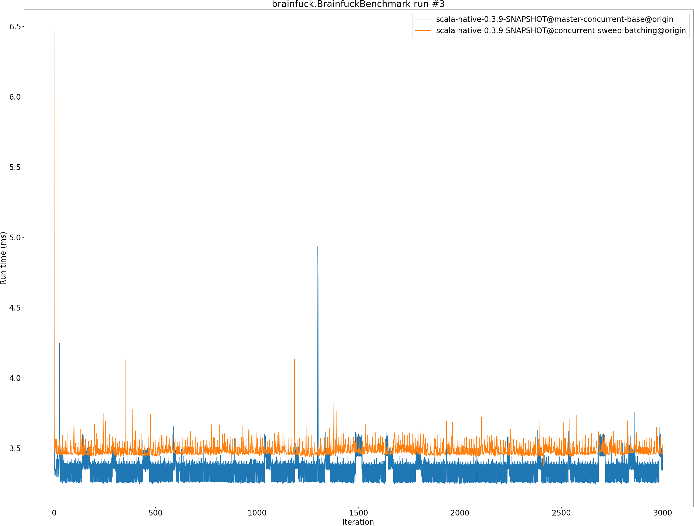
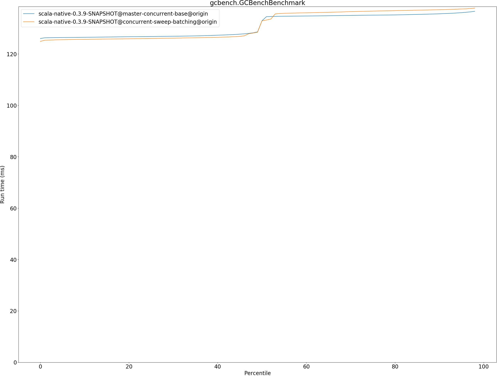
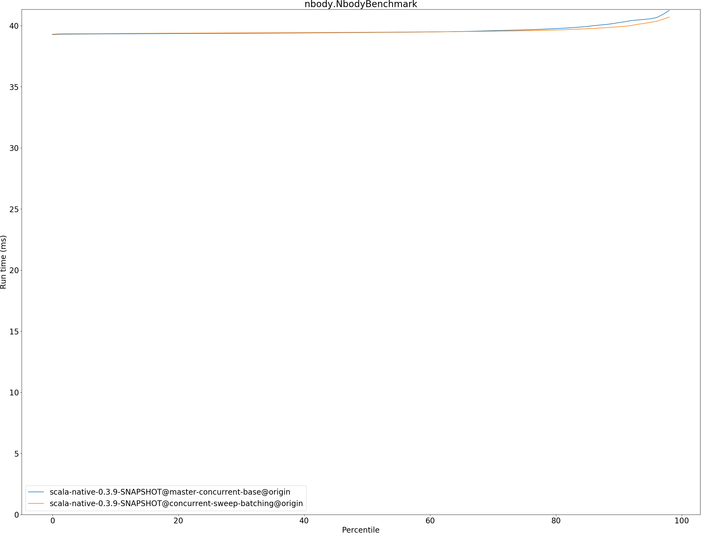

# Summary
## Benchmark run time (ms) at 50 percentile 

|name | scala-native-0.3.9-SNAPSHOT@master-concurrent-base@origin | scala-native-0.3.9-SNAPSHOT@concurrent-sweep-batching@origin | |
| -- | -- | -- | -- |
|[bounce.BounceBenchmark](#bouncebouncebenchmark)|0.0588|0.0598|+1.64%|
|[brainfuck.BrainfuckBenchmark](#brainfuckbrainfuckbenchmark)|3.3759|3.4674|+2.71%|
|[cd.CDBenchmark](#cdcdbenchmark)|32.7898|32.5097|__-0.85%__|
|[deltablue.DeltaBlueBenchmark](#deltabluedeltabluebenchmark)|0.1823|0.1849|+1.41%|
|[gcbench.GCBenchBenchmark](#gcbenchgcbenchbenchmark)|132.9232|132.9007|__-0.02%__|
|[json.JsonBenchmark](#jsonjsonbenchmark)|1.6521|1.6409|__-0.68%__|
|[kmeans.KmeansBenchmark](#kmeanskmeansbenchmark)|53.9548|52.7373|__-2.26%__|
|[mandelbrot.MandelbrotBenchmark](#mandelbrotmandelbrotbenchmark)|126.0747|126.0511|__-0.02%__|
|[nbody.NbodyBenchmark](#nbodynbodybenchmark)|39.4352|39.4545|+0.05%|
|[permute.PermuteBenchmark](#permutepermutebenchmark)|0.2027|0.2042|+0.70%|
|[queens.QueensBenchmark](#queensqueensbenchmark)|0.1155|0.1181|+2.25%|
|[richards.RichardsBenchmark](#richardsrichardsbenchmark)|0.0769|0.0894|+16.29%|
|[sudoku.SudokuBenchmark](#sudokusudokubenchmark)|2.4286|2.4240|__-0.19%__|
|[tracer.TracerBenchmark](#tracertracerbenchmark)|0.7508|0.7625|+1.55%|
| __Geometrical mean:__|| |+1.53%|
## Benchmark run time (ms) at 90 percentile 

|name | scala-native-0.3.9-SNAPSHOT@master-concurrent-base@origin | scala-native-0.3.9-SNAPSHOT@concurrent-sweep-batching@origin | |
| -- | -- | -- | -- |
|[bounce.BounceBenchmark](#bouncebouncebenchmark)|0.0605|0.0601|__-0.61%__|
|[brainfuck.BrainfuckBenchmark](#brainfuckbrainfuckbenchmark)|3.4634|3.5544|+2.63%|
|[cd.CDBenchmark](#cdcdbenchmark)|33.3898|32.7788|__-1.83%__|
|[deltablue.DeltaBlueBenchmark](#deltabluedeltabluebenchmark)|0.1924|0.1905|__-0.96%__|
|[gcbench.GCBenchBenchmark](#gcbenchgcbenchbenchmark)|135.6477|137.2482|+1.18%|
|[json.JsonBenchmark](#jsonjsonbenchmark)|1.6739|1.6703|__-0.22%__|
|[kmeans.KmeansBenchmark](#kmeanskmeansbenchmark)|56.3564|54.7551|__-2.84%__|
|[mandelbrot.MandelbrotBenchmark](#mandelbrotmandelbrotbenchmark)|126.7456|126.6876|__-0.05%__|
|[nbody.NbodyBenchmark](#nbodynbodybenchmark)|40.2439|39.9061|__-0.84%__|
|[permute.PermuteBenchmark](#permutepermutebenchmark)|0.2269|0.2422|+6.72%|
|[queens.QueensBenchmark](#queensqueensbenchmark)|0.1188|0.1204|+1.32%|
|[richards.RichardsBenchmark](#richardsrichardsbenchmark)|0.0799|0.0917|+14.75%|
|[sudoku.SudokuBenchmark](#sudokusudokubenchmark)|2.6249|2.5088|__-4.42%__|
|[tracer.TracerBenchmark](#tracertracerbenchmark)|0.7768|0.7802|+0.43%|
| __Geometrical mean:__|| |+0.99%|
## Benchmark run time (ms) at 99 percentile 

|name | scala-native-0.3.9-SNAPSHOT@master-concurrent-base@origin | scala-native-0.3.9-SNAPSHOT@concurrent-sweep-batching@origin | |
| -- | -- | -- | -- |
|[bounce.BounceBenchmark](#bouncebouncebenchmark)|0.0626|0.0631|+0.77%|
|[brainfuck.BrainfuckBenchmark](#brainfuckbrainfuckbenchmark)|3.5840|3.6561|+2.01%|
|[cd.CDBenchmark](#cdcdbenchmark)|34.2258|33.2745|__-2.78%__|
|[deltablue.DeltaBlueBenchmark](#deltabluedeltabluebenchmark)|0.2633|0.2856|+8.47%|
|[gcbench.GCBenchBenchmark](#gcbenchgcbenchbenchmark)|136.9762|138.1303|+0.84%|
|[json.JsonBenchmark](#jsonjsonbenchmark)|1.7575|1.7263|__-1.78%__|
|[kmeans.KmeansBenchmark](#kmeanskmeansbenchmark)|58.3701|56.1478|__-3.81%__|
|[mandelbrot.MandelbrotBenchmark](#mandelbrotmandelbrotbenchmark)|128.7248|129.6241|+0.70%|
|[nbody.NbodyBenchmark](#nbodynbodybenchmark)|41.6190|41.3591|__-0.62%__|
|[permute.PermuteBenchmark](#permutepermutebenchmark)|0.2392|0.2600|+8.68%|
|[queens.QueensBenchmark](#queensqueensbenchmark)|0.1262|0.1250|__-0.98%__|
|[richards.RichardsBenchmark](#richardsrichardsbenchmark)|0.0877|0.1003|+14.37%|
|[sudoku.SudokuBenchmark](#sudokusudokubenchmark)|2.7182|2.6112|__-3.94%__|
|[tracer.TracerBenchmark](#tracertracerbenchmark)|0.8415|0.8027|__-4.60%__|
| __Geometrical mean:__|| |+1.10%|
## Benchmark total run time (ms) 

|name | scala-native-0.3.9-SNAPSHOT@master-concurrent-base@origin | scala-native-0.3.9-SNAPSHOT@concurrent-sweep-batching@origin | |
| -- | -- | -- | -- |
|[bounce.BounceBenchmark](#bouncebouncebenchmark)|1185.2632|1199.8667|+1.23%|
|[brainfuck.BrainfuckBenchmark](#brainfuckbrainfuckbenchmark)|67047.1111|69708.0506|+3.97%|
|[cd.CDBenchmark](#cdcdbenchmark)|657757.9143|650916.4971|__-1.04%__|
|[deltablue.DeltaBlueBenchmark](#deltabluedeltabluebenchmark)|3744.6118|3800.9489|+1.50%|
|[gcbench.GCBenchBenchmark](#gcbenchgcbenchbenchmark)|2622185.5744|2628060.8582|+0.22%|
|[json.JsonBenchmark](#jsonjsonbenchmark)|32669.6568|32379.0734|__-0.89%__|
|[kmeans.KmeansBenchmark](#kmeanskmeansbenchmark)|1077865.6741|1054952.2619|__-2.13%__|
|[mandelbrot.MandelbrotBenchmark](#mandelbrotmandelbrotbenchmark)|2525585.6944|2526167.3424|+0.02%|
|[nbody.NbodyBenchmark](#nbodynbodybenchmark)|792356.6569|791378.2895|__-0.12%__|
|[permute.PermuteBenchmark](#permutepermutebenchmark)|4141.0957|4220.3826|+1.91%|
|[queens.QueensBenchmark](#queensqueensbenchmark)|2329.7301|2369.8766|+1.72%|
|[richards.RichardsBenchmark](#richardsrichardsbenchmark)|1555.5275|1802.1316|+15.85%|
|[sudoku.SudokuBenchmark](#sudokusudokubenchmark)|49168.7215|48800.8750|__-0.75%__|
|[tracer.TracerBenchmark](#tracertracerbenchmark)|15044.7692|15116.1023|+0.47%|
| __Geometrical mean:__|| |+1.49%|
# Individual benchmarks
## bounce.BounceBenchmark

## brainfuck.BrainfuckBenchmark

## cd.CDBenchmark

## deltablue.DeltaBlueBenchmark

## gcbench.GCBenchBenchmark

## json.JsonBenchmark

## kmeans.KmeansBenchmark

## mandelbrot.MandelbrotBenchmark

## nbody.NbodyBenchmark

## permute.PermuteBenchmark

## queens.QueensBenchmark

## richards.RichardsBenchmark

## sudoku.SudokuBenchmark

## tracer.TracerBenchmark

