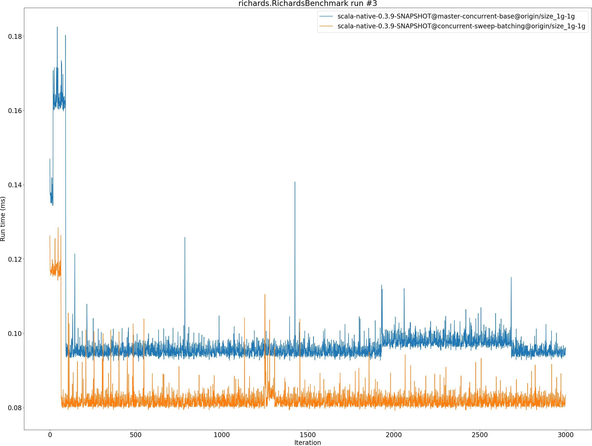
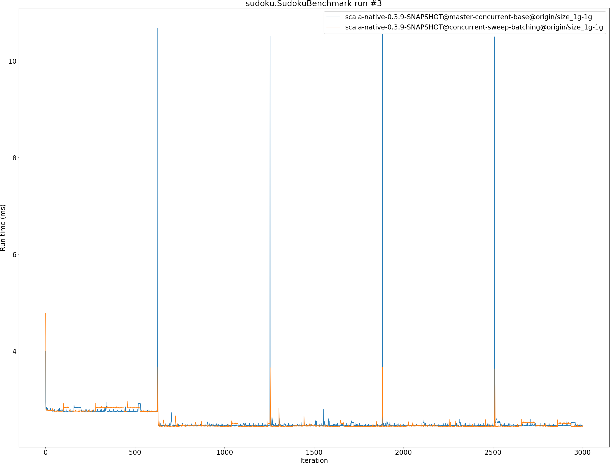

# Summary
## Benchmark run time (ms) at 50 percentile 

|name | scala-native-0.3.9-SNAPSHOT@master-concurrent-base@origin/size_1g-1g | scala-native-0.3.9-SNAPSHOT@concurrent-sweep-batching@origin/size_1g-1g | |
| -- | -- | -- | -- |
|[bounce.BounceBenchmark](#bouncebouncebenchmark)|0.0608|0.0616|+1.27%|
|[brainfuck.BrainfuckBenchmark](#brainfuckbrainfuckbenchmark)|3.2888|3.2673|__-0.65%__|
|[cd.CDBenchmark](#cdcdbenchmark)|31.5097|31.7805|+0.86%|
|[deltablue.DeltaBlueBenchmark](#deltabluedeltabluebenchmark)|0.2325|0.2336|+0.46%|
|[gcbench.GCBenchBenchmark](#gcbenchgcbenchbenchmark)|105.8854|104.7514|__-1.07%__|
|[json.JsonBenchmark](#jsonjsonbenchmark)|1.6301|1.6345|+0.27%|
|[kmeans.KmeansBenchmark](#kmeanskmeansbenchmark)|51.9209|52.2625|+0.66%|
|[mandelbrot.MandelbrotBenchmark](#mandelbrotmandelbrotbenchmark)|126.1105|126.0109|__-0.08%__|
|[nbody.NbodyBenchmark](#nbodynbodybenchmark)|39.3838|39.4673|+0.21%|
|[permute.PermuteBenchmark](#permutepermutebenchmark)|0.2762|0.2757|__-0.19%__|
|[queens.QueensBenchmark](#queensqueensbenchmark)|0.1204|0.1223|+1.62%|
|[richards.RichardsBenchmark](#richardsrichardsbenchmark)|0.0949|0.0818|__-13.82%__|
|[sudoku.SudokuBenchmark](#sudokusudokubenchmark)|2.4403|2.4595|+0.79%|
|[tracer.TracerBenchmark](#tracertracerbenchmark)|0.8200|0.8161|__-0.47%__|
| __Geometrical mean:__|| |__-0.80%__|
## Benchmark run time (ms) at 90 percentile 

|name | scala-native-0.3.9-SNAPSHOT@master-concurrent-base@origin/size_1g-1g | scala-native-0.3.9-SNAPSHOT@concurrent-sweep-batching@origin/size_1g-1g | |
| -- | -- | -- | -- |
|[bounce.BounceBenchmark](#bouncebouncebenchmark)|0.0623|0.0633|+1.66%|
|[brainfuck.BrainfuckBenchmark](#brainfuckbrainfuckbenchmark)|3.3789|3.3708|__-0.24%__|
|[cd.CDBenchmark](#cdcdbenchmark)|32.7606|33.2039|+1.35%|
|[deltablue.DeltaBlueBenchmark](#deltabluedeltabluebenchmark)|0.2382|0.2426|+1.87%|
|[gcbench.GCBenchBenchmark](#gcbenchgcbenchbenchmark)|113.6988|110.1398|__-3.13%__|
|[json.JsonBenchmark](#jsonjsonbenchmark)|1.6732|1.6783|+0.30%|
|[kmeans.KmeansBenchmark](#kmeanskmeansbenchmark)|53.0932|53.5803|+0.92%|
|[mandelbrot.MandelbrotBenchmark](#mandelbrotmandelbrotbenchmark)|126.8113|126.7720|__-0.03%__|
|[nbody.NbodyBenchmark](#nbodynbodybenchmark)|40.2875|40.5712|+0.70%|
|[permute.PermuteBenchmark](#permutepermutebenchmark)|0.2827|0.2843|+0.58%|
|[queens.QueensBenchmark](#queensqueensbenchmark)|0.1228|0.1263|+2.87%|
|[richards.RichardsBenchmark](#richardsrichardsbenchmark)|0.0978|0.0848|__-13.33%__|
|[sudoku.SudokuBenchmark](#sudokusudokubenchmark)|2.5145|2.5269|+0.49%|
|[tracer.TracerBenchmark](#tracertracerbenchmark)|0.8439|0.8399|__-0.47%__|
| __Geometrical mean:__|| |__-0.54%__|
## Benchmark run time (ms) at 99 percentile 

|name | scala-native-0.3.9-SNAPSHOT@master-concurrent-base@origin/size_1g-1g | scala-native-0.3.9-SNAPSHOT@concurrent-sweep-batching@origin/size_1g-1g | |
| -- | -- | -- | -- |
|[bounce.BounceBenchmark](#bouncebouncebenchmark)|0.0646|0.0657|+1.64%|
|[brainfuck.BrainfuckBenchmark](#brainfuckbrainfuckbenchmark)|3.4959|3.5471|+1.47%|
|[cd.CDBenchmark](#cdcdbenchmark)|39.6485|34.6857|__-12.52%__|
|[deltablue.DeltaBlueBenchmark](#deltabluedeltabluebenchmark)|0.2498|0.2588|+3.60%|
|[gcbench.GCBenchBenchmark](#gcbenchgcbenchbenchmark)|114.9839|111.4694|__-3.06%__|
|[json.JsonBenchmark](#jsonjsonbenchmark)|1.7300|1.8102|+4.64%|
|[kmeans.KmeansBenchmark](#kmeanskmeansbenchmark)|61.7564|56.2300|__-8.95%__|
|[mandelbrot.MandelbrotBenchmark](#mandelbrotmandelbrotbenchmark)|128.8678|129.5891|+0.56%|
|[nbody.NbodyBenchmark](#nbodynbodybenchmark)|41.8785|41.7619|__-0.28%__|
|[permute.PermuteBenchmark](#permutepermutebenchmark)|0.2978|0.3257|+9.35%|
|[queens.QueensBenchmark](#queensqueensbenchmark)|0.1272|0.1332|+4.70%|
|[richards.RichardsBenchmark](#richardsrichardsbenchmark)|0.1031|0.0902|__-12.46%__|
|[sudoku.SudokuBenchmark](#sudokusudokubenchmark)|2.6030|2.6064|+0.13%|
|[tracer.TracerBenchmark](#tracertracerbenchmark)|0.8840|1.5263|+72.66%|
| __Geometrical mean:__|| |+2.94%|
## Benchmark total run time (ms) 

|name | scala-native-0.3.9-SNAPSHOT@master-concurrent-base@origin/size_1g-1g | scala-native-0.3.9-SNAPSHOT@concurrent-sweep-batching@origin/size_1g-1g | |
| -- | -- | -- | -- |
|[bounce.BounceBenchmark](#bouncebouncebenchmark)|1220.6745|1237.6310|+1.39%|
|[brainfuck.BrainfuckBenchmark](#brainfuckbrainfuckbenchmark)|66786.5276|66098.3415|__-1.03%__|
|[cd.CDBenchmark](#cdcdbenchmark)|644172.7054|644072.6247|__-0.02%__|
|[deltablue.DeltaBlueBenchmark](#deltabluedeltabluebenchmark)|4678.7621|4719.0712|+0.86%|
|[gcbench.GCBenchBenchmark](#gcbenchgcbenchbenchmark)|2098783.9745|2067164.3508|__-1.51%__|
|[json.JsonBenchmark](#jsonjsonbenchmark)|33089.1696|32877.9192|__-0.64%__|
|[kmeans.KmeansBenchmark](#kmeanskmeansbenchmark)|1046185.1819|1050662.5124|+0.43%|
|[mandelbrot.MandelbrotBenchmark](#mandelbrotmandelbrotbenchmark)|2526501.5316|2526048.2647|__-0.02%__|
|[nbody.NbodyBenchmark](#nbodynbodybenchmark)|793053.0000|795579.5811|+0.32%|
|[permute.PermuteBenchmark](#permutepermutebenchmark)|5553.1130|5587.3716|+0.62%|
|[queens.QueensBenchmark](#queensqueensbenchmark)|2409.7053|2462.9644|+2.21%|
|[richards.RichardsBenchmark](#richardsrichardsbenchmark)|1910.2981|1647.1557|__-13.77%__|
|[sudoku.SudokuBenchmark](#sudokusudokubenchmark)|49323.4374|49549.0781|+0.46%|
|[tracer.TracerBenchmark](#tracertracerbenchmark)|16944.2481|16635.9605|__-1.82%__|
| __Geometrical mean:__|| |__-0.97%__|
# Individual benchmarks
## bounce.BounceBenchmark

## brainfuck.BrainfuckBenchmark

## cd.CDBenchmark

## deltablue.DeltaBlueBenchmark

## gcbench.GCBenchBenchmark

## json.JsonBenchmark

## kmeans.KmeansBenchmark

## mandelbrot.MandelbrotBenchmark

## nbody.NbodyBenchmark

## permute.PermuteBenchmark

## queens.QueensBenchmark

## richards.RichardsBenchmark

## sudoku.SudokuBenchmark

## tracer.TracerBenchmark

