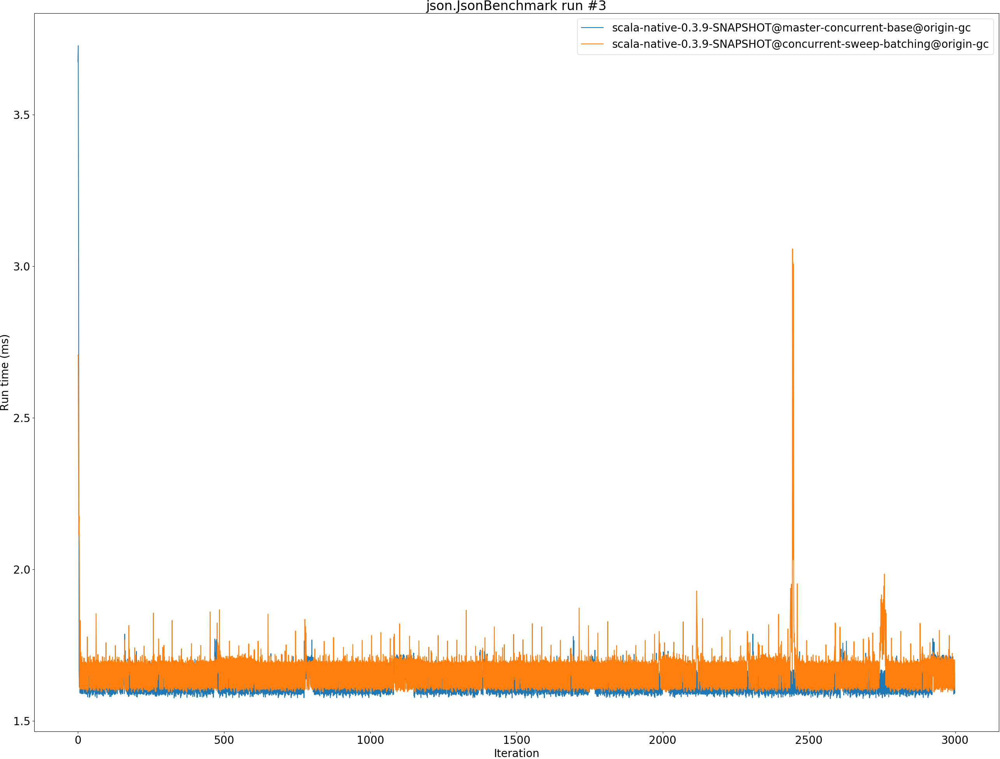
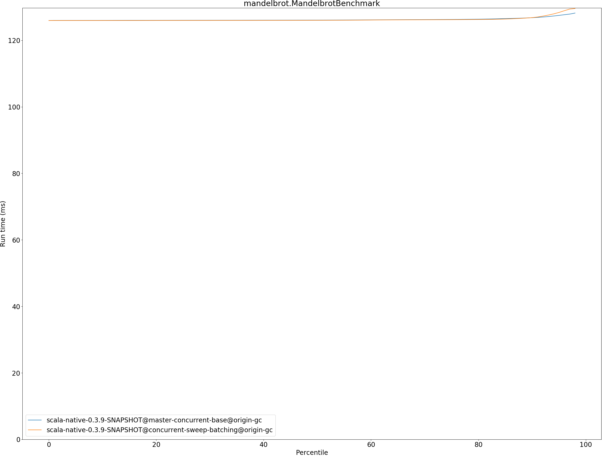
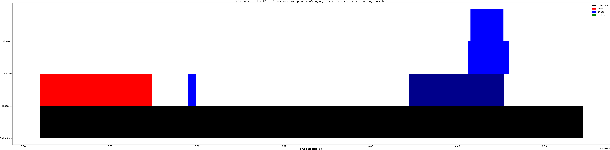

# Summary
## Benchmark run time (ms) at 50 percentile 

|name | scala-native-0.3.9-SNAPSHOT@master-concurrent-base@origin-gc | scala-native-0.3.9-SNAPSHOT@concurrent-sweep-batching@origin-gc | |
| -- | -- | -- | -- |
|[bounce.BounceBenchmark](#bouncebouncebenchmark)|0.0532|0.0596|+11.91%|
|[brainfuck.BrainfuckBenchmark](#brainfuckbrainfuckbenchmark)|3.4564|3.3634|__-2.69%__|
|[cd.CDBenchmark](#cdcdbenchmark)|32.0159|32.0533|+0.12%|
|[deltablue.DeltaBlueBenchmark](#deltabluedeltabluebenchmark)|0.1881|0.1858|__-1.24%__|
|[gcbench.GCBenchBenchmark](#gcbenchgcbenchbenchmark)|133.3344|124.6920|__-6.48%__|
|[json.JsonBenchmark](#jsonjsonbenchmark)|1.6509|1.6886|+2.28%|
|[kmeans.KmeansBenchmark](#kmeanskmeansbenchmark)|54.6604|54.3170|__-0.63%__|
|[mandelbrot.MandelbrotBenchmark](#mandelbrotmandelbrotbenchmark)|126.0898|126.0343|__-0.04%__|
|[nbody.NbodyBenchmark](#nbodynbodybenchmark)|39.4732|39.4077|__-0.17%__|
|[permute.PermuteBenchmark](#permutepermutebenchmark)|0.2028|0.2190|+7.98%|
|[queens.QueensBenchmark](#queensqueensbenchmark)|0.1140|0.1179|+3.49%|
|[richards.RichardsBenchmark](#richardsrichardsbenchmark)|0.0787|0.0763|__-3.09%__|
|[sudoku.SudokuBenchmark](#sudokusudokubenchmark)|2.4173|2.4666|+2.04%|
|[tracer.TracerBenchmark](#tracertracerbenchmark)|0.7499|0.7710|+2.81%|
| __Geometrical mean:__|| |+1.07%|
## Benchmark run time (ms) at 90 percentile 

|name | scala-native-0.3.9-SNAPSHOT@master-concurrent-base@origin-gc | scala-native-0.3.9-SNAPSHOT@concurrent-sweep-batching@origin-gc | |
| -- | -- | -- | -- |
|[bounce.BounceBenchmark](#bouncebouncebenchmark)|0.0536|0.0611|+13.97%|
|[brainfuck.BrainfuckBenchmark](#brainfuckbrainfuckbenchmark)|3.5168|3.4495|__-1.92%__|
|[cd.CDBenchmark](#cdcdbenchmark)|32.6043|32.3079|__-0.91%__|
|[deltablue.DeltaBlueBenchmark](#deltabluedeltabluebenchmark)|0.1955|0.1914|__-2.10%__|
|[gcbench.GCBenchBenchmark](#gcbenchgcbenchbenchmark)|136.9870|135.5221|__-1.07%__|
|[json.JsonBenchmark](#jsonjsonbenchmark)|1.6779|1.7150|+2.22%|
|[kmeans.KmeansBenchmark](#kmeanskmeansbenchmark)|56.8927|56.4473|__-0.78%__|
|[mandelbrot.MandelbrotBenchmark](#mandelbrotmandelbrotbenchmark)|126.8120|126.8360|+0.02%|
|[nbody.NbodyBenchmark](#nbodynbodybenchmark)|40.1658|39.9468|__-0.55%__|
|[permute.PermuteBenchmark](#permutepermutebenchmark)|0.2143|0.2253|+5.11%|
|[queens.QueensBenchmark](#queensqueensbenchmark)|0.1176|0.1196|+1.68%|
|[richards.RichardsBenchmark](#richardsrichardsbenchmark)|0.0818|0.0788|__-3.71%__|
|[sudoku.SudokuBenchmark](#sudokusudokubenchmark)|2.6220|2.6092|__-0.49%__|
|[tracer.TracerBenchmark](#tracertracerbenchmark)|0.7716|0.7958|+3.14%|
| __Geometrical mean:__|| |+0.96%|
## Benchmark run time (ms) at 99 percentile 

|name | scala-native-0.3.9-SNAPSHOT@master-concurrent-base@origin-gc | scala-native-0.3.9-SNAPSHOT@concurrent-sweep-batching@origin-gc | |
| -- | -- | -- | -- |
|[bounce.BounceBenchmark](#bouncebouncebenchmark)|0.0565|0.0632|+12.00%|
|[brainfuck.BrainfuckBenchmark](#brainfuckbrainfuckbenchmark)|3.6743|3.5692|__-2.86%__|
|[cd.CDBenchmark](#cdcdbenchmark)|33.4444|32.8350|__-1.82%__|
|[deltablue.DeltaBlueBenchmark](#deltabluedeltabluebenchmark)|0.2577|0.2683|+4.09%|
|[gcbench.GCBenchBenchmark](#gcbenchgcbenchbenchmark)|138.7733|136.4362|__-1.68%__|
|[json.JsonBenchmark](#jsonjsonbenchmark)|1.7612|1.8105|+2.80%|
|[kmeans.KmeansBenchmark](#kmeanskmeansbenchmark)|58.8480|57.8503|__-1.70%__|
|[mandelbrot.MandelbrotBenchmark](#mandelbrotmandelbrotbenchmark)|128.7928|129.6296|+0.65%|
|[nbody.NbodyBenchmark](#nbodynbodybenchmark)|41.6149|41.4695|__-0.35%__|
|[permute.PermuteBenchmark](#permutepermutebenchmark)|0.2348|0.2711|+15.43%|
|[queens.QueensBenchmark](#queensqueensbenchmark)|0.1243|0.1246|+0.30%|
|[richards.RichardsBenchmark](#richardsrichardsbenchmark)|0.0918|0.0881|__-4.07%__|
|[sudoku.SudokuBenchmark](#sudokusudokubenchmark)|2.7546|2.7089|__-1.66%__|
|[tracer.TracerBenchmark](#tracertracerbenchmark)|0.8103|0.8795|+8.54%|
| __Geometrical mean:__|| |+1.97%|
## Benchmark total run time (ms) 

|name | scala-native-0.3.9-SNAPSHOT@master-concurrent-base@origin-gc | scala-native-0.3.9-SNAPSHOT@concurrent-sweep-batching@origin-gc | |
| -- | -- | -- | -- |
|[bounce.BounceBenchmark](#bouncebouncebenchmark)|1069.1015|1197.8125|+12.04%|
|[brainfuck.BrainfuckBenchmark](#brainfuckbrainfuckbenchmark)|68535.7002|67649.0446|__-1.29%__|
|[cd.CDBenchmark](#cdcdbenchmark)|642517.3699|641782.2373|__-0.11%__|
|[deltablue.DeltaBlueBenchmark](#deltabluedeltabluebenchmark)|3846.9008|3803.7437|__-1.12%__|
|[gcbench.GCBenchBenchmark](#gcbenchgcbenchbenchmark)|2651021.9654|2566140.1662|__-3.20%__|
|[json.JsonBenchmark](#jsonjsonbenchmark)|32691.6019|33213.7310|+1.60%|
|[kmeans.KmeansBenchmark](#kmeanskmeansbenchmark)|1090491.7006|1085859.1530|__-0.42%__|
|[mandelbrot.MandelbrotBenchmark](#mandelbrotmandelbrotbenchmark)|2526043.9684|2526674.4281|+0.02%|
|[nbody.NbodyBenchmark](#nbodynbodybenchmark)|792535.4011|790924.2966|__-0.20%__|
|[permute.PermuteBenchmark](#permutepermutebenchmark)|4122.0768|4444.3364|+7.82%|
|[queens.QueensBenchmark](#queensqueensbenchmark)|2298.9204|2366.3878|+2.93%|
|[richards.RichardsBenchmark](#richardsrichardsbenchmark)|1587.8358|1542.6946|__-2.84%__|
|[sudoku.SudokuBenchmark](#sudokusudokubenchmark)|49181.5634|49784.5290|+1.23%|
|[tracer.TracerBenchmark](#tracertracerbenchmark)|14983.9113|15336.5640|+2.35%|
| __Geometrical mean:__|| |+1.27%|
## Total GC time on Application thread (ms) 

|name |  | scala-native-0.3.9-SNAPSHOT@master-concurrent-base@origin-gc | scala-native-0.3.9-SNAPSHOT@concurrent-sweep-batching@origin-gc | |
| -- | -- | -- | -- | -- |
|[bounce.BounceBenchmark](#bouncebouncebenchmark)|mark|1.7394|1.6527|__-4.98%__|
||sweep|1.4444|0.1312|__-90.92%__|
||total|3.1838|1.7839|__-43.97%__|
|[brainfuck.BrainfuckBenchmark](#brainfuckbrainfuckbenchmark)|mark|2981.8161|3573.0439|+19.83%|
||sweep|938.6748|138.6982|__-85.22%__|
||total|3920.4908|3711.7422|__-5.32%__|
|[cd.CDBenchmark](#cdcdbenchmark)|mark|18841.2678|18359.0898|__-2.56%__|
||sweep|26441.0059|921.8242|__-96.51%__|
||total|45282.2737|19280.9140|__-57.42%__|
|[deltablue.DeltaBlueBenchmark](#deltabluedeltabluebenchmark)|mark|111.6066|109.9687|__-1.47%__|
||sweep|38.9022|4.1148|__-89.42%__|
||total|150.5088|114.0835|__-24.20%__|
|[gcbench.GCBenchBenchmark](#gcbenchgcbenchbenchmark)|mark|1856817.6615|1907908.6203|+2.75%|
||sweep|228657.5814|14111.1101|__-93.83%__|
||total|2085475.2429|1922019.7304|__-7.84%__|
|[json.JsonBenchmark](#jsonjsonbenchmark)|mark|1483.9046|1491.5846|+0.52%|
||sweep|522.5402|162.0224|__-68.99%__|
||total|2006.4448|1653.6070|__-17.59%__|
|[kmeans.KmeansBenchmark](#kmeanskmeansbenchmark)|mark|78461.8126|86752.1752|+10.57%|
||sweep|13903.4853|780.0228|__-94.39%__|
||total|92365.2980|87532.1980|__-5.23%__|
|[mandelbrot.MandelbrotBenchmark](#mandelbrotmandelbrotbenchmark)|mark|0.0000|0.0000|N/A|
||sweep|0.0000|0.0000|N/A|
||total|0.0000|0.0000|N/A|
|[nbody.NbodyBenchmark](#nbodynbodybenchmark)|mark|1028.6022|1099.9479|+6.94%|
||sweep|1625.2079|135.2684|__-91.68%__|
||total|2653.8101|1235.2163|__-53.45%__|
|[permute.PermuteBenchmark](#permutepermutebenchmark)|mark|44.9398|42.6831|__-5.02%__|
||sweep|54.0087|3.8570|__-92.86%__|
||total|98.9485|46.5401|__-52.97%__|
|[queens.QueensBenchmark](#queensqueensbenchmark)|mark|2.9422|2.8774|__-2.20%__|
||sweep|2.5301|0.2371|__-90.63%__|
||total|5.4723|3.1145|__-43.09%__|
|[richards.RichardsBenchmark](#richardsrichardsbenchmark)|mark|4.2147|4.1556|__-1.40%__|
||sweep|4.1873|0.3548|__-91.53%__|
||total|8.4020|4.5104|__-46.32%__|
|[sudoku.SudokuBenchmark](#sudokusudokubenchmark)|mark|740.8834|764.2040|+3.15%|
||sweep|493.1625|202.5135|__-58.94%__|
||total|1234.0459|966.7175|__-21.66%__|
|[tracer.TracerBenchmark](#tracertracerbenchmark)|mark|505.2561|547.7312|+8.41%|
||sweep|578.4200|313.9405|__-45.72%__|
||total|1083.6761|861.6717|__-20.49%__|
|__Geometrical mean:__|mark|| |+2.43%|
||sweep|| |__-88.59%__|
||total|| |__-33.34%__|
## GC pause time (ms) at 50 percentile 

|name | scala-native-0.3.9-SNAPSHOT@master-concurrent-base@origin-gc | scala-native-0.3.9-SNAPSHOT@concurrent-sweep-batching@origin-gc | |
| -- | -- | -- | -- |
|[bounce.BounceBenchmark](#bouncebouncebenchmark)|0.0307|0.0010|__-96.62%__|
|[brainfuck.BrainfuckBenchmark](#brainfuckbrainfuckbenchmark)|0.1284|0.0010|__-99.25%__|
|[cd.CDBenchmark](#cdcdbenchmark)|0.1847|0.0015|__-99.21%__|
|[deltablue.DeltaBlueBenchmark](#deltabluedeltabluebenchmark)|0.0557|0.0010|__-98.20%__|
|[gcbench.GCBenchBenchmark](#gcbenchgcbenchbenchmark)|3.6894|0.0108|__-99.71%__|
|[json.JsonBenchmark](#jsonjsonbenchmark)|0.0666|0.0010|__-98.48%__|
|[kmeans.KmeansBenchmark](#kmeanskmeansbenchmark)|2.6665|0.0058|__-99.78%__|
|[mandelbrot.MandelbrotBenchmark](#mandelbrotmandelbrotbenchmark)|0.0000|0.0000|N/A|
|[nbody.NbodyBenchmark](#nbodynbodybenchmark)|0.0222|0.0009|__-96.14%__|
|[permute.PermuteBenchmark](#permutepermutebenchmark)|0.0246|0.0009|__-96.40%__|
|[queens.QueensBenchmark](#queensqueensbenchmark)|0.0292|0.0011|__-96.35%__|
|[richards.RichardsBenchmark](#richardsrichardsbenchmark)|0.0272|0.0010|__-96.21%__|
|[sudoku.SudokuBenchmark](#sudokusudokubenchmark)|0.1988|0.0104|__-94.79%__|
|[tracer.TracerBenchmark](#tracertracerbenchmark)|0.0258|0.0012|__-95.47%__|
| __Geometrical mean:__|| |__-98.23%__|
## GC pause time (ms) at 90 percentile 

|name | scala-native-0.3.9-SNAPSHOT@master-concurrent-base@origin-gc | scala-native-0.3.9-SNAPSHOT@concurrent-sweep-batching@origin-gc | |
| -- | -- | -- | -- |
|[bounce.BounceBenchmark](#bouncebouncebenchmark)|0.0374|0.0173|__-53.75%__|
|[brainfuck.BrainfuckBenchmark](#brainfuckbrainfuckbenchmark)|0.1330|0.0497|__-62.64%__|
|[cd.CDBenchmark](#cdcdbenchmark)|0.2352|0.0769|__-67.32%__|
|[deltablue.DeltaBlueBenchmark](#deltabluedeltabluebenchmark)|0.0706|0.0499|__-29.35%__|
|[gcbench.GCBenchBenchmark](#gcbenchgcbenchbenchmark)|4.9069|3.3655|__-31.41%__|
|[json.JsonBenchmark](#jsonjsonbenchmark)|0.0695|0.0503|__-27.65%__|
|[kmeans.KmeansBenchmark](#kmeanskmeansbenchmark)|4.2400|3.1504|__-25.70%__|
|[mandelbrot.MandelbrotBenchmark](#mandelbrotmandelbrotbenchmark)|0.0000|0.0000|N/A|
|[nbody.NbodyBenchmark](#nbodynbodybenchmark)|0.0247|0.0099|__-59.92%__|
|[permute.PermuteBenchmark](#permutepermutebenchmark)|0.0274|0.0113|__-58.83%__|
|[queens.QueensBenchmark](#queensqueensbenchmark)|0.0382|0.0160|__-58.03%__|
|[richards.RichardsBenchmark](#richardsrichardsbenchmark)|0.0308|0.0140|__-54.66%__|
|[sudoku.SudokuBenchmark](#sudokusudokubenchmark)|0.2180|0.1200|__-44.94%__|
|[tracer.TracerBenchmark](#tracertracerbenchmark)|0.0276|0.0135|__-51.29%__|
| __Geometrical mean:__|| |__-49.94%__|
## GC pause time (ms) at 99 percentile 

|name | scala-native-0.3.9-SNAPSHOT@master-concurrent-base@origin-gc | scala-native-0.3.9-SNAPSHOT@concurrent-sweep-batching@origin-gc | |
| -- | -- | -- | -- |
|[bounce.BounceBenchmark](#bouncebouncebenchmark)|0.0410|0.0245|__-40.20%__|
|[brainfuck.BrainfuckBenchmark](#brainfuckbrainfuckbenchmark)|0.1472|0.0882|__-40.08%__|
|[cd.CDBenchmark](#cdcdbenchmark)|0.3050|0.1423|__-53.32%__|
|[deltablue.DeltaBlueBenchmark](#deltabluedeltabluebenchmark)|0.0889|0.0656|__-26.25%__|
|[gcbench.GCBenchBenchmark](#gcbenchgcbenchbenchmark)|8.2953|7.4435|__-10.27%__|
|[json.JsonBenchmark](#jsonjsonbenchmark)|0.0753|0.0538|__-28.56%__|
|[kmeans.KmeansBenchmark](#kmeanskmeansbenchmark)|5.3671|3.8714|__-27.87%__|
|[mandelbrot.MandelbrotBenchmark](#mandelbrotmandelbrotbenchmark)|0.0000|0.0000|N/A|
|[nbody.NbodyBenchmark](#nbodynbodybenchmark)|0.0279|0.0129|__-53.79%__|
|[permute.PermuteBenchmark](#permutepermutebenchmark)|0.0358|0.0159|__-55.58%__|
|[queens.QueensBenchmark](#queensqueensbenchmark)|0.0431|0.0248|__-42.58%__|
|[richards.RichardsBenchmark](#richardsrichardsbenchmark)|0.0386|0.0230|__-40.55%__|
|[sudoku.SudokuBenchmark](#sudokusudokubenchmark)|0.2658|0.1343|__-49.48%__|
|[tracer.TracerBenchmark](#tracertracerbenchmark)|0.0313|0.0156|__-50.17%__|
| __Geometrical mean:__|| |__-41.19%__|
# Individual benchmarks
## bounce.BounceBenchmark

## brainfuck.BrainfuckBenchmark

## cd.CDBenchmark

## deltablue.DeltaBlueBenchmark

## gcbench.GCBenchBenchmark

## json.JsonBenchmark

## kmeans.KmeansBenchmark

## mandelbrot.MandelbrotBenchmark

## nbody.NbodyBenchmark

## permute.PermuteBenchmark

## queens.QueensBenchmark

## richards.RichardsBenchmark

## sudoku.SudokuBenchmark

## tracer.TracerBenchmark

