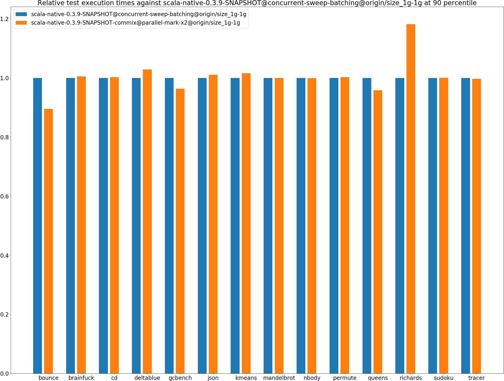
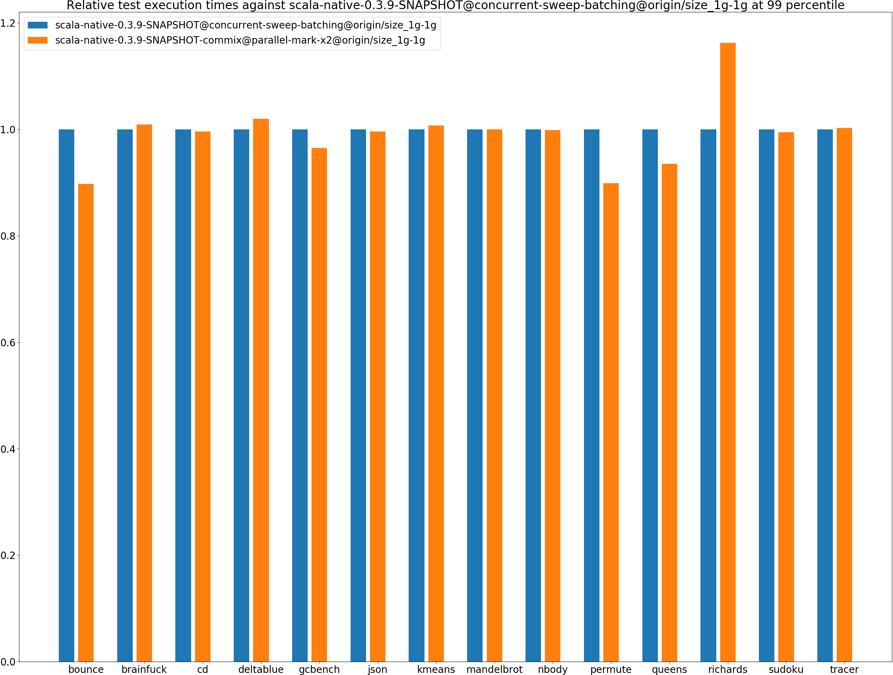
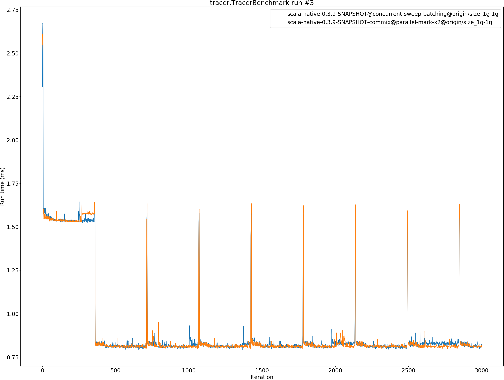

# Summary
## Benchmark run time (ms) at 50 percentile 

|name | scala-native-0.3.9-SNAPSHOT@concurrent-sweep-batching@origin/size_1g-1g | scala-native-0.3.9-SNAPSHOT-commix@parallel-mark-x2@origin/size_1g-1g | |
| -- | -- | -- | -- |
|[bounce.BounceBenchmark](#bouncebouncebenchmark)|0.0616|0.0553|__-10.17%__|
|[brainfuck.BrainfuckBenchmark](#brainfuckbrainfuckbenchmark)|3.2673|3.2737|+0.19%|
|[cd.CDBenchmark](#cdcdbenchmark)|31.7805|32.0652|+0.90%|
|[deltablue.DeltaBlueBenchmark](#deltabluedeltabluebenchmark)|0.2336|0.2403|+2.88%|
|[gcbench.GCBenchBenchmark](#gcbenchgcbenchbenchmark)|104.7514|103.2699|__-1.41%__|
|[json.JsonBenchmark](#jsonjsonbenchmark)|1.6345|1.6507|+0.99%|
|[kmeans.KmeansBenchmark](#kmeanskmeansbenchmark)|52.2625|53.1001|+1.60%|
|[mandelbrot.MandelbrotBenchmark](#mandelbrotmandelbrotbenchmark)|126.0109|126.0415|+0.02%|
|[nbody.NbodyBenchmark](#nbodynbodybenchmark)|39.4673|39.4379|__-0.07%__|
|[permute.PermuteBenchmark](#permutepermutebenchmark)|0.2757|0.2772|+0.55%|
|[queens.QueensBenchmark](#queensqueensbenchmark)|0.1223|0.1180|__-3.53%__|
|[richards.RichardsBenchmark](#richardsrichardsbenchmark)|0.0818|0.0974|+19.09%|
|[sudoku.SudokuBenchmark](#sudokusudokubenchmark)|2.4595|2.4646|+0.21%|
|[tracer.TracerBenchmark](#tracertracerbenchmark)|0.8161|0.8161|+0.00%|
| __Geometrical mean:__|| |+0.64%|
## Benchmark run time (ms) at 90 percentile 

|name | scala-native-0.3.9-SNAPSHOT@concurrent-sweep-batching@origin/size_1g-1g | scala-native-0.3.9-SNAPSHOT-commix@parallel-mark-x2@origin/size_1g-1g | |
| -- | -- | -- | -- |
|[bounce.BounceBenchmark](#bouncebouncebenchmark)|0.0633|0.0567|__-10.52%__|
|[brainfuck.BrainfuckBenchmark](#brainfuckbrainfuckbenchmark)|3.3708|3.3880|+0.51%|
|[cd.CDBenchmark](#cdcdbenchmark)|33.2039|33.2902|+0.26%|
|[deltablue.DeltaBlueBenchmark](#deltabluedeltabluebenchmark)|0.2426|0.2496|+2.88%|
|[gcbench.GCBenchBenchmark](#gcbenchgcbenchbenchmark)|110.1398|106.1453|__-3.63%__|
|[json.JsonBenchmark](#jsonjsonbenchmark)|1.6783|1.6957|+1.04%|
|[kmeans.KmeansBenchmark](#kmeanskmeansbenchmark)|53.5803|54.4449|+1.61%|
|[mandelbrot.MandelbrotBenchmark](#mandelbrotmandelbrotbenchmark)|126.7720|126.7652|__-0.01%__|
|[nbody.NbodyBenchmark](#nbodynbodybenchmark)|40.5712|40.5344|__-0.09%__|
|[permute.PermuteBenchmark](#permutepermutebenchmark)|0.2843|0.2851|+0.28%|
|[queens.QueensBenchmark](#queensqueensbenchmark)|0.1263|0.1210|__-4.21%__|
|[richards.RichardsBenchmark](#richardsrichardsbenchmark)|0.0848|0.1002|+18.16%|
|[sudoku.SudokuBenchmark](#sudokusudokubenchmark)|2.5269|2.5274|+0.02%|
|[tracer.TracerBenchmark](#tracertracerbenchmark)|0.8399|0.8374|__-0.30%__|
| __Geometrical mean:__|| |+0.27%|
## Benchmark run time (ms) at 99 percentile 

|name | scala-native-0.3.9-SNAPSHOT@concurrent-sweep-batching@origin/size_1g-1g | scala-native-0.3.9-SNAPSHOT-commix@parallel-mark-x2@origin/size_1g-1g | |
| -- | -- | -- | -- |
|[bounce.BounceBenchmark](#bouncebouncebenchmark)|0.0657|0.0590|__-10.22%__|
|[brainfuck.BrainfuckBenchmark](#brainfuckbrainfuckbenchmark)|3.5471|3.5788|+0.89%|
|[cd.CDBenchmark](#cdcdbenchmark)|34.6857|34.5480|__-0.40%__|
|[deltablue.DeltaBlueBenchmark](#deltabluedeltabluebenchmark)|0.2588|0.2639|+1.95%|
|[gcbench.GCBenchBenchmark](#gcbenchgcbenchbenchmark)|111.4694|107.5470|__-3.52%__|
|[json.JsonBenchmark](#jsonjsonbenchmark)|1.8102|1.8026|__-0.42%__|
|[kmeans.KmeansBenchmark](#kmeanskmeansbenchmark)|56.2300|56.6460|+0.74%|
|[mandelbrot.MandelbrotBenchmark](#mandelbrotmandelbrotbenchmark)|129.5891|129.6089|+0.02%|
|[nbody.NbodyBenchmark](#nbodynbodybenchmark)|41.7619|41.7050|__-0.14%__|
|[permute.PermuteBenchmark](#permutepermutebenchmark)|0.3257|0.2928|__-10.10%__|
|[queens.QueensBenchmark](#queensqueensbenchmark)|0.1332|0.1245|__-6.50%__|
|[richards.RichardsBenchmark](#richardsrichardsbenchmark)|0.0902|0.1048|+16.21%|
|[sudoku.SudokuBenchmark](#sudokusudokubenchmark)|2.6064|2.5927|__-0.52%__|
|[tracer.TracerBenchmark](#tracertracerbenchmark)|1.5263|1.5302|+0.25%|
| __Geometrical mean:__|| |__-1.02%__|
## Benchmark total run time (ms) 

|name | scala-native-0.3.9-SNAPSHOT@concurrent-sweep-batching@origin/size_1g-1g | scala-native-0.3.9-SNAPSHOT-commix@parallel-mark-x2@origin/size_1g-1g | |
| -- | -- | -- | -- |
|[bounce.BounceBenchmark](#bouncebouncebenchmark)|1237.6310|1108.9826|__-10.39%__|
|[brainfuck.BrainfuckBenchmark](#brainfuckbrainfuckbenchmark)|66098.3415|66125.2045|+0.04%|
|[cd.CDBenchmark](#cdcdbenchmark)|644072.6247|644622.8963|+0.09%|
|[deltablue.DeltaBlueBenchmark](#deltabluedeltabluebenchmark)|4719.0712|4852.1553|+2.82%|
|[gcbench.GCBenchBenchmark](#gcbenchgcbenchbenchmark)|2067164.3508|2027711.0204|__-1.91%__|
|[json.JsonBenchmark](#jsonjsonbenchmark)|32877.9192|33236.1074|+1.09%|
|[kmeans.KmeansBenchmark](#kmeanskmeansbenchmark)|1050662.5124|1067182.0044|+1.57%|
|[mandelbrot.MandelbrotBenchmark](#mandelbrotmandelbrotbenchmark)|2526048.2647|2526351.9550|+0.01%|
|[nbody.NbodyBenchmark](#nbodynbodybenchmark)|795579.5811|794738.5015|__-0.11%__|
|[permute.PermuteBenchmark](#permutepermutebenchmark)|5587.3716|5583.1392|__-0.08%__|
|[queens.QueensBenchmark](#queensqueensbenchmark)|2462.9644|2367.8757|__-3.86%__|
|[richards.RichardsBenchmark](#richardsrichardsbenchmark)|1647.1557|1958.2104|+18.88%|
|[sudoku.SudokuBenchmark](#sudokusudokubenchmark)|49549.0781|49586.6484|+0.08%|
|[tracer.TracerBenchmark](#tracertracerbenchmark)|16635.9605|16595.5566|__-0.24%__|
| __Geometrical mean:__|| |+0.41%|
# Individual benchmarks
## bounce.BounceBenchmark

## brainfuck.BrainfuckBenchmark

## cd.CDBenchmark

## deltablue.DeltaBlueBenchmark

## gcbench.GCBenchBenchmark

## json.JsonBenchmark

## kmeans.KmeansBenchmark

## mandelbrot.MandelbrotBenchmark

## nbody.NbodyBenchmark

## permute.PermuteBenchmark

## queens.QueensBenchmark

## richards.RichardsBenchmark

## sudoku.SudokuBenchmark

## tracer.TracerBenchmark

