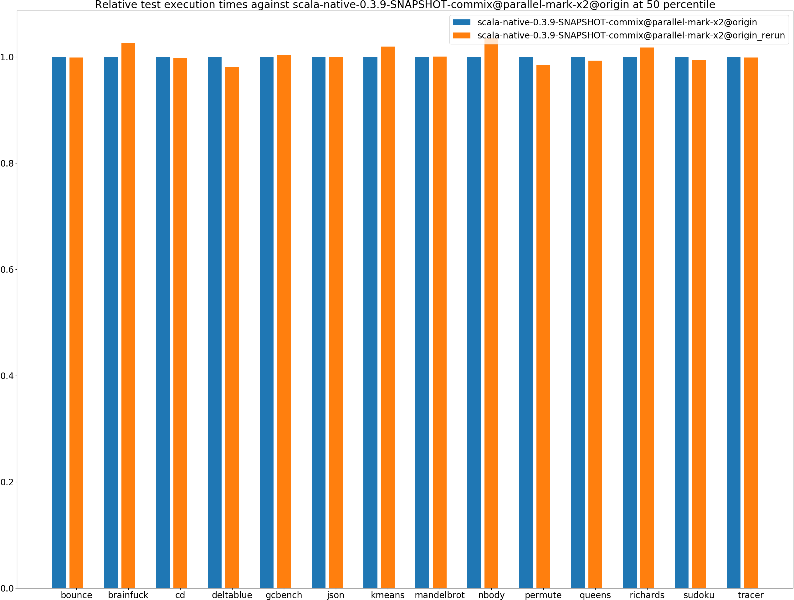
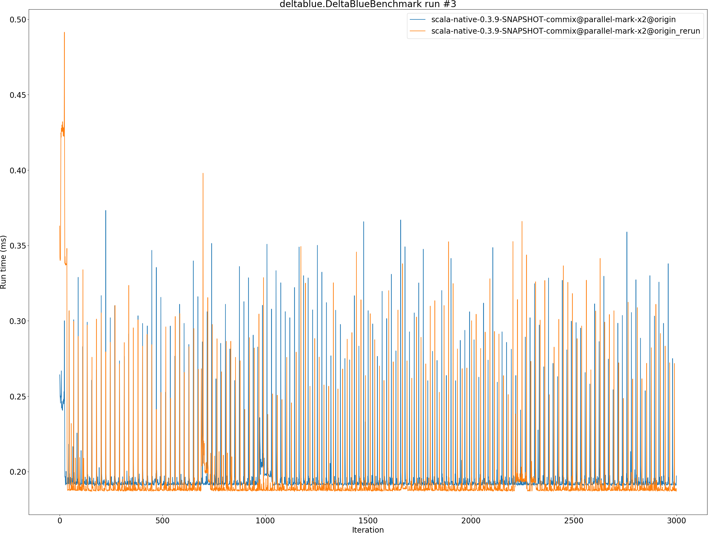

# Summary
## Benchmark run time (ms) at 50 percentile 

|name | scala-native-0.3.9-SNAPSHOT-commix@parallel-mark-x2@origin | scala-native-0.3.9-SNAPSHOT-commix@parallel-mark-x2@origin_rerun | |
| -- | -- | -- | -- |
|[bounce.BounceBenchmark](#bouncebouncebenchmark)|0.0547|0.0546|__-0.14%__|
|[brainfuck.BrainfuckBenchmark](#brainfuckbrainfuckbenchmark)|3.2837|3.3686|+2.59%|
|[cd.CDBenchmark](#cdcdbenchmark)|32.5158|32.4516|__-0.20%__|
|[deltablue.DeltaBlueBenchmark](#deltabluedeltabluebenchmark)|0.1916|0.1878|__-1.98%__|
|[gcbench.GCBenchBenchmark](#gcbenchgcbenchbenchmark)|116.2410|116.6417|+0.34%|
|[json.JsonBenchmark](#jsonjsonbenchmark)|1.6828|1.6809|__-0.11%__|
|[kmeans.KmeansBenchmark](#kmeanskmeansbenchmark)|52.6265|53.6427|+1.93%|
|[mandelbrot.MandelbrotBenchmark](#mandelbrotmandelbrotbenchmark)|126.0477|126.0580|+0.01%|
|[nbody.NbodyBenchmark](#nbodynbodybenchmark)|39.4345|40.8090|+3.49%|
|[permute.PermuteBenchmark](#permutepermutebenchmark)|0.2048|0.2018|__-1.47%__|
|[queens.QueensBenchmark](#queensqueensbenchmark)|0.1140|0.1132|__-0.72%__|
|[richards.RichardsBenchmark](#richardsrichardsbenchmark)|0.0791|0.0805|+1.73%|
|[sudoku.SudokuBenchmark](#sudokusudokubenchmark)|2.4497|2.4352|__-0.59%__|
|[tracer.TracerBenchmark](#tracertracerbenchmark)|0.7614|0.7601|__-0.16%__|
| __Geometrical mean:__|| |+0.33%|
## Benchmark run time (ms) at 90 percentile 

|name | scala-native-0.3.9-SNAPSHOT-commix@parallel-mark-x2@origin | scala-native-0.3.9-SNAPSHOT-commix@parallel-mark-x2@origin_rerun | |
| -- | -- | -- | -- |
|[bounce.BounceBenchmark](#bouncebouncebenchmark)|0.0553|0.0549|__-0.67%__|
|[brainfuck.BrainfuckBenchmark](#brainfuckbrainfuckbenchmark)|3.3660|3.4451|+2.35%|
|[cd.CDBenchmark](#cdcdbenchmark)|32.8274|32.7682|__-0.18%__|
|[deltablue.DeltaBlueBenchmark](#deltabluedeltabluebenchmark)|0.1970|0.1931|__-1.96%__|
|[gcbench.GCBenchBenchmark](#gcbenchgcbenchbenchmark)|124.5249|124.9260|+0.32%|
|[json.JsonBenchmark](#jsonjsonbenchmark)|1.7012|1.7053|+0.24%|
|[kmeans.KmeansBenchmark](#kmeanskmeansbenchmark)|53.9245|54.7991|+1.62%|
|[mandelbrot.MandelbrotBenchmark](#mandelbrotmandelbrotbenchmark)|127.0022|126.9685|__-0.03%__|
|[nbody.NbodyBenchmark](#nbodynbodybenchmark)|39.9313|41.3650|+3.59%|
|[permute.PermuteBenchmark](#permutepermutebenchmark)|0.2367|0.2077|__-12.25%__|
|[queens.QueensBenchmark](#queensqueensbenchmark)|0.1157|0.1167|+0.89%|
|[richards.RichardsBenchmark](#richardsrichardsbenchmark)|0.0816|0.0827|+1.40%|
|[sudoku.SudokuBenchmark](#sudokusudokubenchmark)|2.6003|2.5665|__-1.30%__|
|[tracer.TracerBenchmark](#tracertracerbenchmark)|0.7761|0.7759|__-0.02%__|
| __Geometrical mean:__|| |__-0.50%__|
## Benchmark run time (ms) at 99 percentile 

|name | scala-native-0.3.9-SNAPSHOT-commix@parallel-mark-x2@origin | scala-native-0.3.9-SNAPSHOT-commix@parallel-mark-x2@origin_rerun | |
| -- | -- | -- | -- |
|[bounce.BounceBenchmark](#bouncebouncebenchmark)|0.0636|0.0586|__-7.77%__|
|[brainfuck.BrainfuckBenchmark](#brainfuckbrainfuckbenchmark)|3.4699|3.5408|+2.04%|
|[cd.CDBenchmark](#cdcdbenchmark)|33.3426|33.2718|__-0.21%__|
|[deltablue.DeltaBlueBenchmark](#deltabluedeltabluebenchmark)|0.3246|0.3146|__-3.08%__|
|[gcbench.GCBenchBenchmark](#gcbenchgcbenchbenchmark)|126.5474|127.1191|+0.45%|
|[json.JsonBenchmark](#jsonjsonbenchmark)|1.7446|1.7574|+0.73%|
|[kmeans.KmeansBenchmark](#kmeanskmeansbenchmark)|55.2136|56.0703|+1.55%|
|[mandelbrot.MandelbrotBenchmark](#mandelbrotmandelbrotbenchmark)|129.6339|129.6624|+0.02%|
|[nbody.NbodyBenchmark](#nbodynbodybenchmark)|41.3154|42.4345|+2.71%|
|[permute.PermuteBenchmark](#permutepermutebenchmark)|0.2531|0.2423|__-4.25%__|
|[queens.QueensBenchmark](#queensqueensbenchmark)|0.1217|0.1211|__-0.48%__|
|[richards.RichardsBenchmark](#richardsrichardsbenchmark)|0.0915|0.0901|__-1.50%__|
|[sudoku.SudokuBenchmark](#sudokusudokubenchmark)|2.7997|2.6246|__-6.25%__|
|[tracer.TracerBenchmark](#tracertracerbenchmark)|0.8054|0.8126|+0.89%|
| __Geometrical mean:__|| |__-1.13%__|
## Benchmark total run time (ms) 

|name | scala-native-0.3.9-SNAPSHOT-commix@parallel-mark-x2@origin | scala-native-0.3.9-SNAPSHOT-commix@parallel-mark-x2@origin_rerun | |
| -- | -- | -- | -- |
|[bounce.BounceBenchmark](#bouncebouncebenchmark)|1101.6617|1097.7993|__-0.35%__|
|[brainfuck.BrainfuckBenchmark](#brainfuckbrainfuckbenchmark)|65573.0315|67178.1915|+2.45%|
|[cd.CDBenchmark](#cdcdbenchmark)|649574.9810|649055.1643|__-0.08%__|
|[deltablue.DeltaBlueBenchmark](#deltabluedeltabluebenchmark)|3953.2091|3873.1911|__-2.02%__|
|[gcbench.GCBenchBenchmark](#gcbenchgcbenchbenchmark)|2351284.7733|2359691.6481|+0.36%|
|[json.JsonBenchmark](#jsonjsonbenchmark)|32983.8399|33077.4842|+0.28%|
|[kmeans.KmeansBenchmark](#kmeanskmeansbenchmark)|1050296.5136|1069341.1184|+1.81%|
|[mandelbrot.MandelbrotBenchmark](#mandelbrotmandelbrotbenchmark)|2527452.5967|2527522.7370|+0.00%|
|[nbody.NbodyBenchmark](#nbodynbodybenchmark)|791029.2202|818857.2406|+3.52%|
|[permute.PermuteBenchmark](#permutepermutebenchmark)|4195.0677|4096.6405|__-2.35%__|
|[queens.QueensBenchmark](#queensqueensbenchmark)|2288.3768|2280.1234|__-0.36%__|
|[richards.RichardsBenchmark](#richardsrichardsbenchmark)|1596.6592|1622.3413|+1.61%|
|[sudoku.SudokuBenchmark](#sudokusudokubenchmark)|49783.0915|49120.5707|__-1.33%__|
|[tracer.TracerBenchmark](#tracertracerbenchmark)|15101.8563|15078.2213|__-0.16%__|
| __Geometrical mean:__|| |+0.23%|
# Individual benchmarks
## bounce.BounceBenchmark

## brainfuck.BrainfuckBenchmark

## cd.CDBenchmark

## deltablue.DeltaBlueBenchmark

## gcbench.GCBenchBenchmark

## json.JsonBenchmark

## kmeans.KmeansBenchmark

## mandelbrot.MandelbrotBenchmark

## nbody.NbodyBenchmark

## permute.PermuteBenchmark

## queens.QueensBenchmark

## richards.RichardsBenchmark

## sudoku.SudokuBenchmark

## tracer.TracerBenchmark

