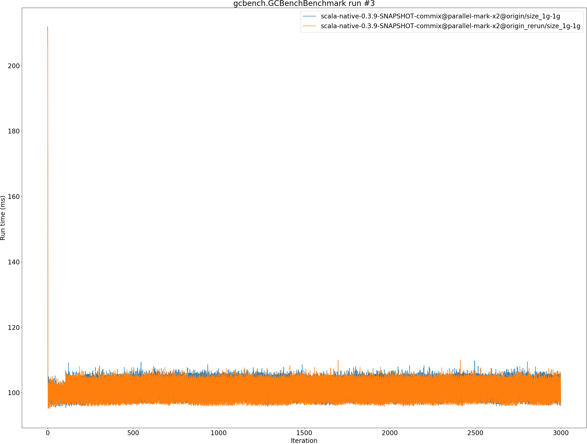
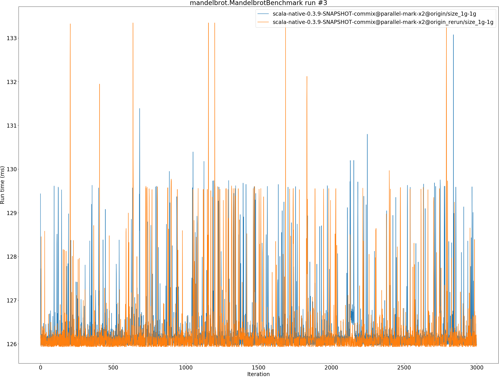
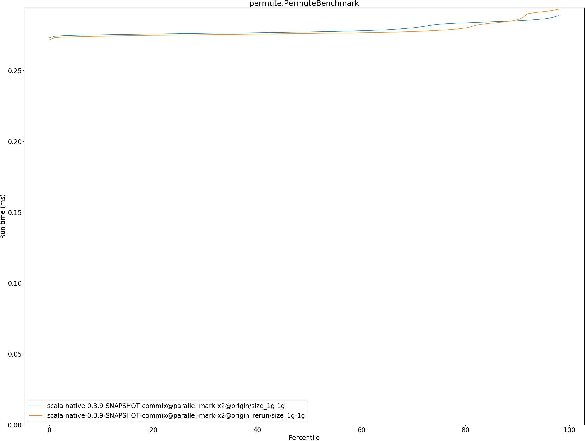

# Summary
## Benchmark run time (ms) at 50 percentile 

|name | scala-native-0.3.9-SNAPSHOT-commix@parallel-mark-x2@origin/size_1g-1g | scala-native-0.3.9-SNAPSHOT-commix@parallel-mark-x2@origin_rerun/size_1g-1g | |
| -- | -- | -- | -- |
|[bounce.BounceBenchmark](#bouncebouncebenchmark)|0.0553|0.0553|__-0.01%__|
|[brainfuck.BrainfuckBenchmark](#brainfuckbrainfuckbenchmark)|3.2737|3.4253|+4.63%|
|[cd.CDBenchmark](#cdcdbenchmark)|32.0652|31.6330|__-1.35%__|
|[deltablue.DeltaBlueBenchmark](#deltabluedeltabluebenchmark)|0.2403|0.2404|+0.01%|
|[gcbench.GCBenchBenchmark](#gcbenchgcbenchbenchmark)|103.2699|102.1724|__-1.06%__|
|[json.JsonBenchmark](#jsonjsonbenchmark)|1.6507|1.6441|__-0.40%__|
|[kmeans.KmeansBenchmark](#kmeanskmeansbenchmark)|53.1001|53.5080|+0.77%|
|[mandelbrot.MandelbrotBenchmark](#mandelbrotmandelbrotbenchmark)|126.0415|126.0059|__-0.03%__|
|[nbody.NbodyBenchmark](#nbodynbodybenchmark)|39.4379|39.4910|+0.13%|
|[permute.PermuteBenchmark](#permutepermutebenchmark)|0.2772|0.2761|__-0.40%__|
|[queens.QueensBenchmark](#queensqueensbenchmark)|0.1180|0.1189|+0.73%|
|[richards.RichardsBenchmark](#richardsrichardsbenchmark)|0.0974|0.0837|__-14.03%__|
|[sudoku.SudokuBenchmark](#sudokusudokubenchmark)|2.4646|2.4551|__-0.38%__|
|[tracer.TracerBenchmark](#tracertracerbenchmark)|0.8161|0.8138|__-0.29%__|
| __Geometrical mean:__|| |__-0.92%__|
## Benchmark run time (ms) at 90 percentile 

|name | scala-native-0.3.9-SNAPSHOT-commix@parallel-mark-x2@origin/size_1g-1g | scala-native-0.3.9-SNAPSHOT-commix@parallel-mark-x2@origin_rerun/size_1g-1g | |
| -- | -- | -- | -- |
|[bounce.BounceBenchmark](#bouncebouncebenchmark)|0.0567|0.0565|__-0.25%__|
|[brainfuck.BrainfuckBenchmark](#brainfuckbrainfuckbenchmark)|3.3880|3.5228|+3.98%|
|[cd.CDBenchmark](#cdcdbenchmark)|33.2902|32.9036|__-1.16%__|
|[deltablue.DeltaBlueBenchmark](#deltabluedeltabluebenchmark)|0.2496|0.2501|+0.17%|
|[gcbench.GCBenchBenchmark](#gcbenchgcbenchbenchmark)|106.1453|106.2155|+0.07%|
|[json.JsonBenchmark](#jsonjsonbenchmark)|1.6957|1.6899|__-0.34%__|
|[kmeans.KmeansBenchmark](#kmeanskmeansbenchmark)|54.4449|54.8721|+0.78%|
|[mandelbrot.MandelbrotBenchmark](#mandelbrotmandelbrotbenchmark)|126.7652|126.8448|+0.06%|
|[nbody.NbodyBenchmark](#nbodynbodybenchmark)|40.5344|40.6079|+0.18%|
|[permute.PermuteBenchmark](#permutepermutebenchmark)|0.2851|0.2858|+0.24%|
|[queens.QueensBenchmark](#queensqueensbenchmark)|0.1210|0.1218|+0.68%|
|[richards.RichardsBenchmark](#richardsrichardsbenchmark)|0.1002|0.0864|__-13.81%__|
|[sudoku.SudokuBenchmark](#sudokusudokubenchmark)|2.5274|2.5229|__-0.18%__|
|[tracer.TracerBenchmark](#tracertracerbenchmark)|0.8374|0.8321|__-0.64%__|
| __Geometrical mean:__|| |__-0.81%__|
## Benchmark run time (ms) at 99 percentile 

|name | scala-native-0.3.9-SNAPSHOT-commix@parallel-mark-x2@origin/size_1g-1g | scala-native-0.3.9-SNAPSHOT-commix@parallel-mark-x2@origin_rerun/size_1g-1g | |
| -- | -- | -- | -- |
|[bounce.BounceBenchmark](#bouncebouncebenchmark)|0.0590|0.0587|__-0.56%__|
|[brainfuck.BrainfuckBenchmark](#brainfuckbrainfuckbenchmark)|3.5788|3.6900|+3.11%|
|[cd.CDBenchmark](#cdcdbenchmark)|34.5480|34.5204|__-0.08%__|
|[deltablue.DeltaBlueBenchmark](#deltabluedeltabluebenchmark)|0.2639|0.2655|+0.60%|
|[gcbench.GCBenchBenchmark](#gcbenchgcbenchbenchmark)|107.5470|107.7634|+0.20%|
|[json.JsonBenchmark](#jsonjsonbenchmark)|1.8026|1.7949|__-0.43%__|
|[kmeans.KmeansBenchmark](#kmeanskmeansbenchmark)|56.6460|57.1550|+0.90%|
|[mandelbrot.MandelbrotBenchmark](#mandelbrotmandelbrotbenchmark)|129.6089|129.5780|__-0.02%__|
|[nbody.NbodyBenchmark](#nbodynbodybenchmark)|41.7050|41.8248|+0.29%|
|[permute.PermuteBenchmark](#permutepermutebenchmark)|0.2928|0.2952|+0.83%|
|[queens.QueensBenchmark](#queensqueensbenchmark)|0.1245|0.1253|+0.63%|
|[richards.RichardsBenchmark](#richardsrichardsbenchmark)|0.1048|0.0920|__-12.28%__|
|[sudoku.SudokuBenchmark](#sudokusudokubenchmark)|2.5927|2.6370|+1.71%|
|[tracer.TracerBenchmark](#tracertracerbenchmark)|1.5302|1.5252|__-0.33%__|
| __Geometrical mean:__|| |__-0.45%__|
## Benchmark total run time (ms) 

|name | scala-native-0.3.9-SNAPSHOT-commix@parallel-mark-x2@origin/size_1g-1g | scala-native-0.3.9-SNAPSHOT-commix@parallel-mark-x2@origin_rerun/size_1g-1g | |
| -- | -- | -- | -- |
|[bounce.BounceBenchmark](#bouncebouncebenchmark)|1108.9826|1108.4558|__-0.05%__|
|[brainfuck.BrainfuckBenchmark](#brainfuckbrainfuckbenchmark)|66125.2045|69118.7261|+4.53%|
|[cd.CDBenchmark](#cdcdbenchmark)|644622.8963|640464.4626|__-0.65%__|
|[deltablue.DeltaBlueBenchmark](#deltabluedeltabluebenchmark)|4852.1553|4846.0749|__-0.13%__|
|[gcbench.GCBenchBenchmark](#gcbenchgcbenchbenchmark)|2027711.0204|2025297.2369|__-0.12%__|
|[json.JsonBenchmark](#jsonjsonbenchmark)|33236.1074|33134.0973|__-0.31%__|
|[kmeans.KmeansBenchmark](#kmeanskmeansbenchmark)|1067182.0044|1073803.0328|+0.62%|
|[mandelbrot.MandelbrotBenchmark](#mandelbrotmandelbrotbenchmark)|2526351.9550|2526048.7410|__-0.01%__|
|[nbody.NbodyBenchmark](#nbodynbodybenchmark)|794738.5015|796124.3220|+0.17%|
|[permute.PermuteBenchmark](#permutepermutebenchmark)|5583.1392|5564.2462|__-0.34%__|
|[queens.QueensBenchmark](#queensqueensbenchmark)|2367.8757|2385.7787|+0.76%|
|[richards.RichardsBenchmark](#richardsrichardsbenchmark)|1958.2104|1684.6351|__-13.97%__|
|[sudoku.SudokuBenchmark](#sudokusudokubenchmark)|49586.6484|49532.2035|__-0.11%__|
|[tracer.TracerBenchmark](#tracertracerbenchmark)|16595.5566|16543.5469|__-0.31%__|
| __Geometrical mean:__|| |__-0.79%__|
# Individual benchmarks
## bounce.BounceBenchmark

## brainfuck.BrainfuckBenchmark

## cd.CDBenchmark

## deltablue.DeltaBlueBenchmark

## gcbench.GCBenchBenchmark

## json.JsonBenchmark

## kmeans.KmeansBenchmark

## mandelbrot.MandelbrotBenchmark

## nbody.NbodyBenchmark

## permute.PermuteBenchmark

## queens.QueensBenchmark

## richards.RichardsBenchmark

## sudoku.SudokuBenchmark

## tracer.TracerBenchmark

