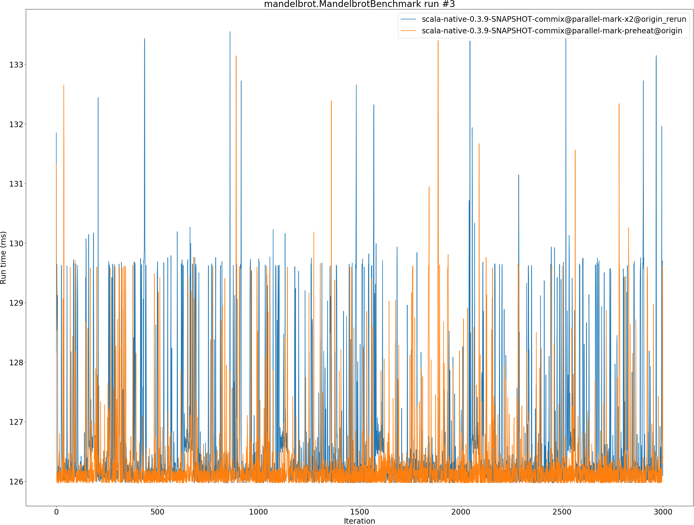
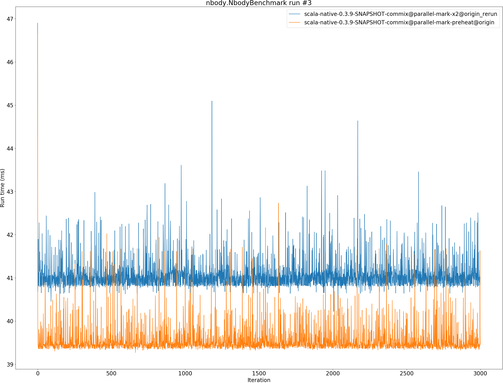

# Summary
## Benchmark run time (ms) at 50 percentile 

|name | scala-native-0.3.9-SNAPSHOT-commix@parallel-mark-x2@origin_rerun | scala-native-0.3.9-SNAPSHOT-commix@parallel-mark-preheat@origin | |
| -- | -- | -- | -- |
|[bounce.BounceBenchmark](#bouncebouncebenchmark)|0.0546|0.0590|+7.99%|
|[brainfuck.BrainfuckBenchmark](#brainfuckbrainfuckbenchmark)|3.3686|3.4720|+3.07%|
|[cd.CDBenchmark](#cdcdbenchmark)|32.4516|32.4889|+0.12%|
|[deltablue.DeltaBlueBenchmark](#deltabluedeltabluebenchmark)|0.1878|0.1823|__-2.91%__|
|[gcbench.GCBenchBenchmark](#gcbenchgcbenchbenchmark)|116.6417|113.6660|__-2.55%__|
|[json.JsonBenchmark](#jsonjsonbenchmark)|1.6809|1.6644|__-0.98%__|
|[kmeans.KmeansBenchmark](#kmeanskmeansbenchmark)|53.6427|53.0761|__-1.06%__|
|[mandelbrot.MandelbrotBenchmark](#mandelbrotmandelbrotbenchmark)|126.0580|126.0590|+0.00%|
|[nbody.NbodyBenchmark](#nbodynbodybenchmark)|40.8090|39.4844|__-3.25%__|
|[permute.PermuteBenchmark](#permutepermutebenchmark)|0.2018|0.2435|+20.68%|
|[queens.QueensBenchmark](#queensqueensbenchmark)|0.1132|0.1160|+2.51%|
|[richards.RichardsBenchmark](#richardsrichardsbenchmark)|0.0805|0.0763|__-5.15%__|
|[sudoku.SudokuBenchmark](#sudokusudokubenchmark)|2.4352|2.4558|+0.85%|
|[tracer.TracerBenchmark](#tracertracerbenchmark)|0.7601|0.7648|+0.61%|
| __Geometrical mean:__|| |+1.25%|
## Benchmark run time (ms) at 90 percentile 

|name | scala-native-0.3.9-SNAPSHOT-commix@parallel-mark-x2@origin_rerun | scala-native-0.3.9-SNAPSHOT-commix@parallel-mark-preheat@origin | |
| -- | -- | -- | -- |
|[bounce.BounceBenchmark](#bouncebouncebenchmark)|0.0549|0.0594|+8.09%|
|[brainfuck.BrainfuckBenchmark](#brainfuckbrainfuckbenchmark)|3.4451|3.5481|+2.99%|
|[cd.CDBenchmark](#cdcdbenchmark)|32.7682|32.7524|__-0.05%__|
|[deltablue.DeltaBlueBenchmark](#deltabluedeltabluebenchmark)|0.1931|0.1876|__-2.83%__|
|[gcbench.GCBenchBenchmark](#gcbenchgcbenchbenchmark)|124.9260|124.4739|__-0.36%__|
|[json.JsonBenchmark](#jsonjsonbenchmark)|1.7053|1.6857|__-1.15%__|
|[kmeans.KmeansBenchmark](#kmeanskmeansbenchmark)|54.7991|54.3012|__-0.91%__|
|[mandelbrot.MandelbrotBenchmark](#mandelbrotmandelbrotbenchmark)|126.9685|127.0486|+0.06%|
|[nbody.NbodyBenchmark](#nbodynbodybenchmark)|41.3650|39.9440|__-3.44%__|
|[permute.PermuteBenchmark](#permutepermutebenchmark)|0.2077|0.2752|+32.52%|
|[queens.QueensBenchmark](#queensqueensbenchmark)|0.1167|0.1195|+2.42%|
|[richards.RichardsBenchmark](#richardsrichardsbenchmark)|0.0827|0.0780|__-5.71%__|
|[sudoku.SudokuBenchmark](#sudokusudokubenchmark)|2.5665|2.6091|+1.66%|
|[tracer.TracerBenchmark](#tracertracerbenchmark)|0.7759|0.7791|+0.41%|
| __Geometrical mean:__|| |+2.07%|
## Benchmark run time (ms) at 99 percentile 

|name | scala-native-0.3.9-SNAPSHOT-commix@parallel-mark-x2@origin_rerun | scala-native-0.3.9-SNAPSHOT-commix@parallel-mark-preheat@origin | |
| -- | -- | -- | -- |
|[bounce.BounceBenchmark](#bouncebouncebenchmark)|0.0586|0.0621|+5.96%|
|[brainfuck.BrainfuckBenchmark](#brainfuckbrainfuckbenchmark)|3.5408|3.6369|+2.72%|
|[cd.CDBenchmark](#cdcdbenchmark)|33.2718|33.2856|+0.04%|
|[deltablue.DeltaBlueBenchmark](#deltabluedeltabluebenchmark)|0.3146|0.3046|__-3.16%__|
|[gcbench.GCBenchBenchmark](#gcbenchgcbenchbenchmark)|127.1191|126.8242|__-0.23%__|
|[json.JsonBenchmark](#jsonjsonbenchmark)|1.7574|1.7344|__-1.31%__|
|[kmeans.KmeansBenchmark](#kmeanskmeansbenchmark)|56.0703|55.6077|__-0.83%__|
|[mandelbrot.MandelbrotBenchmark](#mandelbrotmandelbrotbenchmark)|129.6624|129.6486|__-0.01%__|
|[nbody.NbodyBenchmark](#nbodynbodybenchmark)|42.4345|41.3762|__-2.49%__|
|[permute.PermuteBenchmark](#permutepermutebenchmark)|0.2423|0.2892|+19.35%|
|[queens.QueensBenchmark](#queensqueensbenchmark)|0.1211|0.1243|+2.65%|
|[richards.RichardsBenchmark](#richardsrichardsbenchmark)|0.0901|0.0864|__-4.10%__|
|[sudoku.SudokuBenchmark](#sudokusudokubenchmark)|2.6246|2.7489|+4.74%|
|[tracer.TracerBenchmark](#tracertracerbenchmark)|0.8126|0.8073|__-0.65%__|
| __Geometrical mean:__|| |+1.47%|
## Benchmark total run time (ms) 

|name | scala-native-0.3.9-SNAPSHOT-commix@parallel-mark-x2@origin_rerun | scala-native-0.3.9-SNAPSHOT-commix@parallel-mark-preheat@origin | |
| -- | -- | -- | -- |
|[bounce.BounceBenchmark](#bouncebouncebenchmark)|1097.7993|1184.6286|+7.91%|
|[brainfuck.BrainfuckBenchmark](#brainfuckbrainfuckbenchmark)|67178.1915|69243.5849|+3.07%|
|[cd.CDBenchmark](#cdcdbenchmark)|649055.1643|650519.0341|+0.23%|
|[deltablue.DeltaBlueBenchmark](#deltabluedeltabluebenchmark)|3873.1911|3757.4326|__-2.99%__|
|[gcbench.GCBenchBenchmark](#gcbenchgcbenchbenchmark)|2359691.6481|2283520.1205|__-3.23%__|
|[json.JsonBenchmark](#jsonjsonbenchmark)|33077.4842|32637.6348|__-1.33%__|
|[kmeans.KmeansBenchmark](#kmeanskmeansbenchmark)|1069341.1184|1058936.9475|__-0.97%__|
|[mandelbrot.MandelbrotBenchmark](#mandelbrotmandelbrotbenchmark)|2527522.7370|2527831.3551|+0.01%|
|[nbody.NbodyBenchmark](#nbodynbodybenchmark)|818857.2406|792031.2255|__-3.28%__|
|[permute.PermuteBenchmark](#permutepermutebenchmark)|4096.6405|4962.6222|+21.14%|
|[queens.QueensBenchmark](#queensqueensbenchmark)|2280.1234|2332.7758|+2.31%|
|[richards.RichardsBenchmark](#richardsrichardsbenchmark)|1622.3413|1539.3183|__-5.12%__|
|[sudoku.SudokuBenchmark](#sudokusudokubenchmark)|49120.5707|49983.3562|+1.76%|
|[tracer.TracerBenchmark](#tracertracerbenchmark)|15078.2213|15171.3338|+0.62%|
| __Geometrical mean:__|| |+1.26%|
# Individual benchmarks
## bounce.BounceBenchmark

## brainfuck.BrainfuckBenchmark

## cd.CDBenchmark

## deltablue.DeltaBlueBenchmark

## gcbench.GCBenchBenchmark

## json.JsonBenchmark

## kmeans.KmeansBenchmark

## mandelbrot.MandelbrotBenchmark

## nbody.NbodyBenchmark

## permute.PermuteBenchmark

## queens.QueensBenchmark

## richards.RichardsBenchmark

## sudoku.SudokuBenchmark

## tracer.TracerBenchmark

