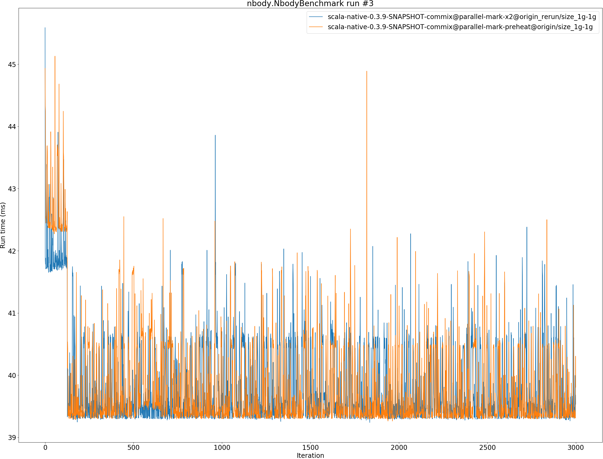
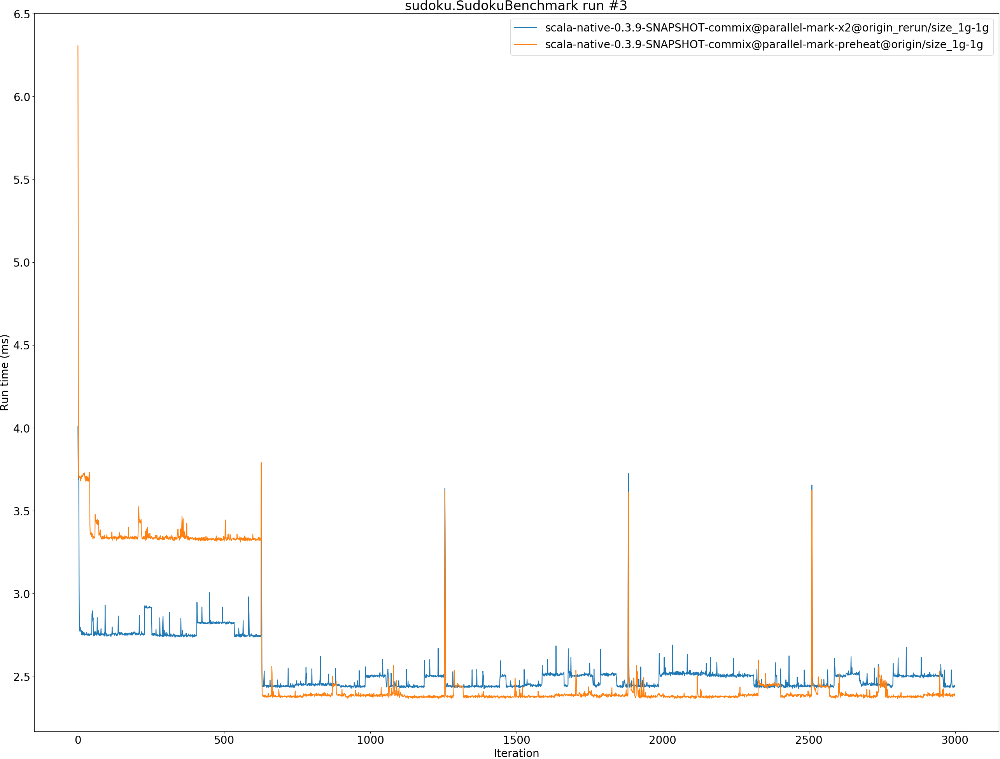

# Summary
## Benchmark run time (ms) at 50 percentile 

|name | scala-native-0.3.9-SNAPSHOT-commix@parallel-mark-x2@origin_rerun/size_1g-1g | scala-native-0.3.9-SNAPSHOT-commix@parallel-mark-preheat@origin/size_1g-1g | |
| -- | -- | -- | -- |
|[bounce.BounceBenchmark](#bouncebouncebenchmark)|0.0553|0.0623|+12.66%|
|[brainfuck.BrainfuckBenchmark](#brainfuckbrainfuckbenchmark)|3.4253|3.3080|__-3.42%__|
|[cd.CDBenchmark](#cdcdbenchmark)|31.6330|31.8186|+0.59%|
|[deltablue.DeltaBlueBenchmark](#deltabluedeltabluebenchmark)|0.2404|0.2655|+10.46%|
|[gcbench.GCBenchBenchmark](#gcbenchgcbenchbenchmark)|102.1724|102.4263|+0.25%|
|[json.JsonBenchmark](#jsonjsonbenchmark)|1.6441|1.6680|+1.45%|
|[kmeans.KmeansBenchmark](#kmeanskmeansbenchmark)|53.5080|51.8759|__-3.05%__|
|[mandelbrot.MandelbrotBenchmark](#mandelbrotmandelbrotbenchmark)|126.0059|126.0512|+0.04%|
|[nbody.NbodyBenchmark](#nbodynbodybenchmark)|39.4910|39.4142|__-0.19%__|
|[permute.PermuteBenchmark](#permutepermutebenchmark)|0.2761|0.3755|+35.97%|
|[queens.QueensBenchmark](#queensqueensbenchmark)|0.1189|0.1215|+2.19%|
|[richards.RichardsBenchmark](#richardsrichardsbenchmark)|0.0837|0.0882|+5.36%|
|[sudoku.SudokuBenchmark](#sudokusudokubenchmark)|2.4551|2.4228|__-1.32%__|
|[tracer.TracerBenchmark](#tracertracerbenchmark)|0.8138|0.8235|+1.20%|
| __Geometrical mean:__|| |+4.04%|
## Benchmark run time (ms) at 90 percentile 

|name | scala-native-0.3.9-SNAPSHOT-commix@parallel-mark-x2@origin_rerun/size_1g-1g | scala-native-0.3.9-SNAPSHOT-commix@parallel-mark-preheat@origin/size_1g-1g | |
| -- | -- | -- | -- |
|[bounce.BounceBenchmark](#bouncebouncebenchmark)|0.0565|0.0647|+14.43%|
|[brainfuck.BrainfuckBenchmark](#brainfuckbrainfuckbenchmark)|3.5228|3.4014|__-3.45%__|
|[cd.CDBenchmark](#cdcdbenchmark)|32.9036|33.0813|+0.54%|
|[deltablue.DeltaBlueBenchmark](#deltabluedeltabluebenchmark)|0.2501|0.2736|+9.41%|
|[gcbench.GCBenchBenchmark](#gcbenchgcbenchbenchmark)|106.2155|105.9577|__-0.24%__|
|[json.JsonBenchmark](#jsonjsonbenchmark)|1.6899|1.7175|+1.63%|
|[kmeans.KmeansBenchmark](#kmeanskmeansbenchmark)|54.8721|53.2000|__-3.05%__|
|[mandelbrot.MandelbrotBenchmark](#mandelbrotmandelbrotbenchmark)|126.8448|127.1756|+0.26%|
|[nbody.NbodyBenchmark](#nbodynbodybenchmark)|40.6079|40.5145|__-0.23%__|
|[permute.PermuteBenchmark](#permutepermutebenchmark)|0.2858|0.3867|+35.30%|
|[queens.QueensBenchmark](#queensqueensbenchmark)|0.1218|0.1242|+1.91%|
|[richards.RichardsBenchmark](#richardsrichardsbenchmark)|0.0864|0.0910|+5.33%|
|[sudoku.SudokuBenchmark](#sudokusudokubenchmark)|2.5229|3.5622|+41.20%|
|[tracer.TracerBenchmark](#tracertracerbenchmark)|0.8321|0.8434|+1.36%|
| __Geometrical mean:__|| |+6.71%|
## Benchmark run time (ms) at 99 percentile 

|name | scala-native-0.3.9-SNAPSHOT-commix@parallel-mark-x2@origin_rerun/size_1g-1g | scala-native-0.3.9-SNAPSHOT-commix@parallel-mark-preheat@origin/size_1g-1g | |
| -- | -- | -- | -- |
|[bounce.BounceBenchmark](#bouncebouncebenchmark)|0.0587|0.0681|+16.11%|
|[brainfuck.BrainfuckBenchmark](#brainfuckbrainfuckbenchmark)|3.6900|3.5952|__-2.57%__|
|[cd.CDBenchmark](#cdcdbenchmark)|34.5204|34.6212|+0.29%|
|[deltablue.DeltaBlueBenchmark](#deltabluedeltabluebenchmark)|0.2655|0.2868|+8.04%|
|[gcbench.GCBenchBenchmark](#gcbenchgcbenchbenchmark)|107.7634|107.3894|__-0.35%__|
|[json.JsonBenchmark](#jsonjsonbenchmark)|1.7949|1.8232|+1.57%|
|[kmeans.KmeansBenchmark](#kmeanskmeansbenchmark)|57.1550|55.6023|__-2.72%__|
|[mandelbrot.MandelbrotBenchmark](#mandelbrotmandelbrotbenchmark)|129.5780|129.6495|+0.06%|
|[nbody.NbodyBenchmark](#nbodynbodybenchmark)|41.8248|41.6928|__-0.32%__|
|[permute.PermuteBenchmark](#permutepermutebenchmark)|0.2952|0.3982|+34.90%|
|[queens.QueensBenchmark](#queensqueensbenchmark)|0.1253|0.1281|+2.25%|
|[richards.RichardsBenchmark](#richardsrichardsbenchmark)|0.0920|0.0964|+4.86%|
|[sudoku.SudokuBenchmark](#sudokusudokubenchmark)|2.6370|3.6941|+40.09%|
|[tracer.TracerBenchmark](#tracertracerbenchmark)|1.5252|1.5325|+0.48%|
| __Geometrical mean:__|| |+6.61%|
## Benchmark total run time (ms) 

|name | scala-native-0.3.9-SNAPSHOT-commix@parallel-mark-x2@origin_rerun/size_1g-1g | scala-native-0.3.9-SNAPSHOT-commix@parallel-mark-preheat@origin/size_1g-1g | |
| -- | -- | -- | -- |
|[bounce.BounceBenchmark](#bouncebouncebenchmark)|1108.4558|1254.3951|+13.17%|
|[brainfuck.BrainfuckBenchmark](#brainfuckbrainfuckbenchmark)|69118.7261|66788.4824|__-3.37%__|
|[cd.CDBenchmark](#cdcdbenchmark)|640464.4626|642950.4419|+0.39%|
|[deltablue.DeltaBlueBenchmark](#deltabluedeltabluebenchmark)|4846.0749|5350.8308|+10.42%|
|[gcbench.GCBenchBenchmark](#gcbenchgcbenchbenchmark)|2025297.2369|2023228.6956|__-0.10%__|
|[json.JsonBenchmark](#jsonjsonbenchmark)|33134.0973|33732.8642|+1.81%|
|[kmeans.KmeansBenchmark](#kmeanskmeansbenchmark)|1073803.0328|1043071.0148|__-2.86%__|
|[mandelbrot.MandelbrotBenchmark](#mandelbrotmandelbrotbenchmark)|2526048.7410|2527918.6383|+0.07%|
|[nbody.NbodyBenchmark](#nbodynbodybenchmark)|796124.3220|794376.0304|__-0.22%__|
|[permute.PermuteBenchmark](#permutepermutebenchmark)|5564.2462|7555.7486|+35.79%|
|[queens.QueensBenchmark](#queensqueensbenchmark)|2385.7787|2438.9497|+2.23%|
|[richards.RichardsBenchmark](#richardsrichardsbenchmark)|1684.6351|1772.7761|+5.23%|
|[sudoku.SudokuBenchmark](#sudokusudokubenchmark)|49532.2035|52060.7106|+5.10%|
|[tracer.TracerBenchmark](#tracertracerbenchmark)|16543.5469|16749.3926|+1.24%|
| __Geometrical mean:__|| |+4.53%|
# Individual benchmarks
## bounce.BounceBenchmark

## brainfuck.BrainfuckBenchmark

## cd.CDBenchmark

## deltablue.DeltaBlueBenchmark

## gcbench.GCBenchBenchmark

## json.JsonBenchmark

## kmeans.KmeansBenchmark

## mandelbrot.MandelbrotBenchmark

## nbody.NbodyBenchmark

## permute.PermuteBenchmark

## queens.QueensBenchmark

## richards.RichardsBenchmark

## sudoku.SudokuBenchmark

## tracer.TracerBenchmark

