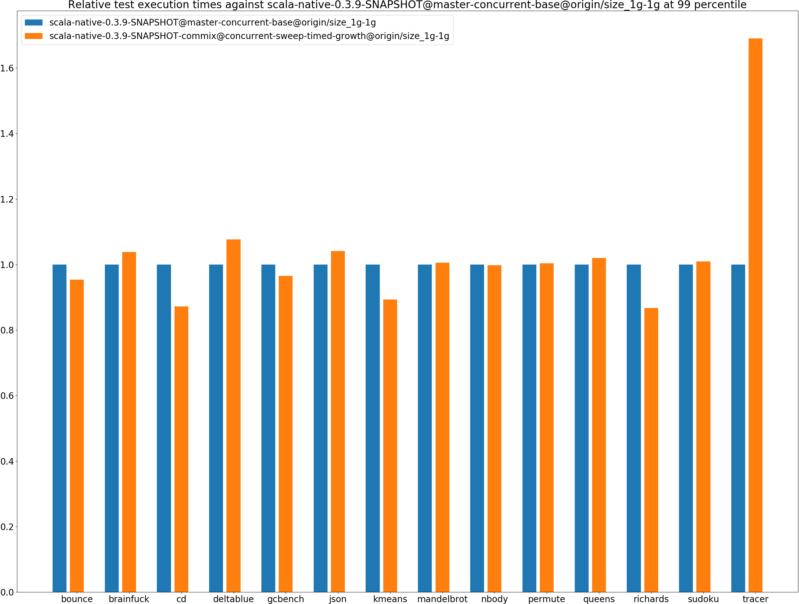
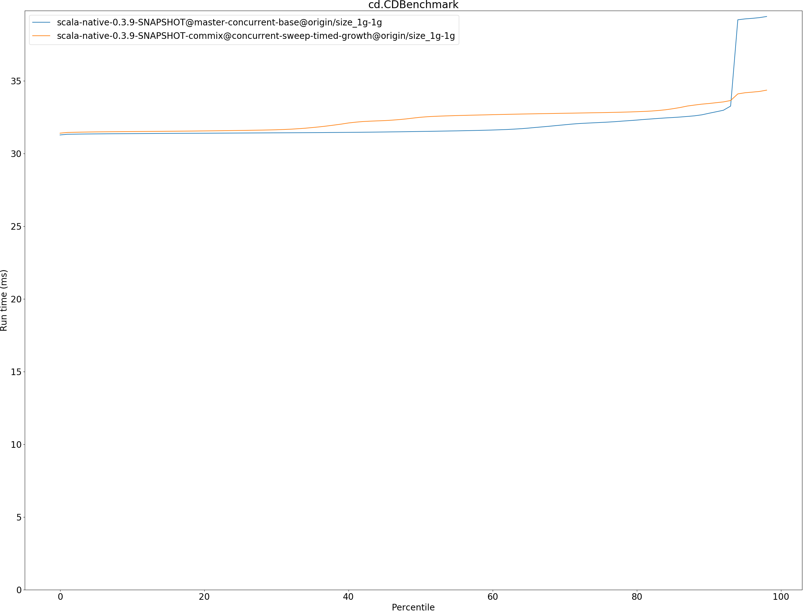
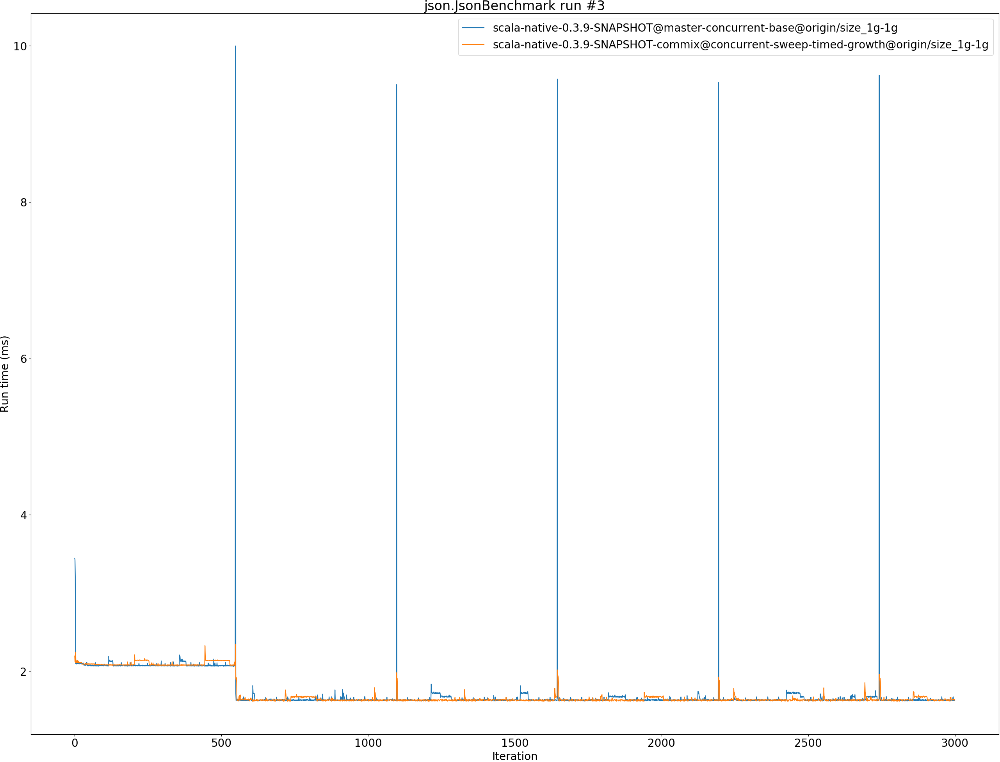

# Summary
## Benchmark run time (ms) at 50 percentile 

|name | scala-native-0.3.9-SNAPSHOT@master-concurrent-base@origin/size_1g-1g | scala-native-0.3.9-SNAPSHOT-commix@concurrent-sweep-timed-growth@origin/size_1g-1g | |
| -- | -- | -- | -- |
|[bounce.BounceBenchmark](#bouncebouncebenchmark)|0.0608|0.0576|__-5.30%__|
|[brainfuck.BrainfuckBenchmark](#brainfuckbrainfuckbenchmark)|3.2888|3.3510|+1.89%|
|[cd.CDBenchmark](#cdcdbenchmark)|31.5097|32.4867|+3.10%|
|[deltablue.DeltaBlueBenchmark](#deltabluedeltabluebenchmark)|0.2325|0.2429|+4.45%|
|[gcbench.GCBenchBenchmark](#gcbenchgcbenchbenchmark)|105.8854|104.7332|__-1.09%__|
|[json.JsonBenchmark](#jsonjsonbenchmark)|1.6301|1.6291|__-0.06%__|
|[kmeans.KmeansBenchmark](#kmeanskmeansbenchmark)|51.9209|51.0717|__-1.64%__|
|[mandelbrot.MandelbrotBenchmark](#mandelbrotmandelbrotbenchmark)|126.1105|126.0289|__-0.06%__|
|[nbody.NbodyBenchmark](#nbodynbodybenchmark)|39.3838|39.4684|+0.21%|
|[permute.PermuteBenchmark](#permutepermutebenchmark)|0.2762|0.2775|+0.44%|
|[queens.QueensBenchmark](#queensqueensbenchmark)|0.1204|0.1207|+0.30%|
|[richards.RichardsBenchmark](#richardsrichardsbenchmark)|0.0949|0.0809|__-14.71%__|
|[sudoku.SudokuBenchmark](#sudokusudokubenchmark)|2.4403|2.4574|+0.70%|
|[tracer.TracerBenchmark](#tracertracerbenchmark)|0.8200|0.8166|__-0.41%__|
| __Geometrical mean:__|| |__-0.97%__|
## Benchmark run time (ms) at 90 percentile 

|name | scala-native-0.3.9-SNAPSHOT@master-concurrent-base@origin/size_1g-1g | scala-native-0.3.9-SNAPSHOT-commix@concurrent-sweep-timed-growth@origin/size_1g-1g | |
| -- | -- | -- | -- |
|[bounce.BounceBenchmark](#bouncebouncebenchmark)|0.0623|0.0593|__-4.82%__|
|[brainfuck.BrainfuckBenchmark](#brainfuckbrainfuckbenchmark)|3.3789|3.4530|+2.19%|
|[cd.CDBenchmark](#cdcdbenchmark)|32.7606|33.4324|+2.05%|
|[deltablue.DeltaBlueBenchmark](#deltabluedeltabluebenchmark)|0.2382|0.2527|+6.11%|
|[gcbench.GCBenchBenchmark](#gcbenchgcbenchbenchmark)|113.6988|109.6078|__-3.60%__|
|[json.JsonBenchmark](#jsonjsonbenchmark)|1.6732|1.6744|+0.07%|
|[kmeans.KmeansBenchmark](#kmeanskmeansbenchmark)|53.0932|52.3585|__-1.38%__|
|[mandelbrot.MandelbrotBenchmark](#mandelbrotmandelbrotbenchmark)|126.8113|126.9621|+0.12%|
|[nbody.NbodyBenchmark](#nbodynbodybenchmark)|40.2875|40.5917|+0.76%|
|[permute.PermuteBenchmark](#permutepermutebenchmark)|0.2827|0.2849|+0.78%|
|[queens.QueensBenchmark](#queensqueensbenchmark)|0.1228|0.1244|+1.27%|
|[richards.RichardsBenchmark](#richardsrichardsbenchmark)|0.0978|0.0832|__-14.97%__|
|[sudoku.SudokuBenchmark](#sudokusudokubenchmark)|2.5145|2.5482|+1.34%|
|[tracer.TracerBenchmark](#tracertracerbenchmark)|0.8439|0.8326|__-1.34%__|
| __Geometrical mean:__|| |__-0.93%__|
## Benchmark run time (ms) at 99 percentile 

|name | scala-native-0.3.9-SNAPSHOT@master-concurrent-base@origin/size_1g-1g | scala-native-0.3.9-SNAPSHOT-commix@concurrent-sweep-timed-growth@origin/size_1g-1g | |
| -- | -- | -- | -- |
|[bounce.BounceBenchmark](#bouncebouncebenchmark)|0.0646|0.0617|__-4.61%__|
|[brainfuck.BrainfuckBenchmark](#brainfuckbrainfuckbenchmark)|3.4959|3.6303|+3.85%|
|[cd.CDBenchmark](#cdcdbenchmark)|39.6485|34.5872|__-12.77%__|
|[deltablue.DeltaBlueBenchmark](#deltabluedeltabluebenchmark)|0.2498|0.2689|+7.63%|
|[gcbench.GCBenchBenchmark](#gcbenchgcbenchbenchmark)|114.9839|110.9615|__-3.50%__|
|[json.JsonBenchmark](#jsonjsonbenchmark)|1.7300|1.8012|+4.12%|
|[kmeans.KmeansBenchmark](#kmeanskmeansbenchmark)|61.7564|55.1759|__-10.66%__|
|[mandelbrot.MandelbrotBenchmark](#mandelbrotmandelbrotbenchmark)|128.8678|129.6137|+0.58%|
|[nbody.NbodyBenchmark](#nbodynbodybenchmark)|41.8785|41.8089|__-0.17%__|
|[permute.PermuteBenchmark](#permutepermutebenchmark)|0.2978|0.2991|+0.41%|
|[queens.QueensBenchmark](#queensqueensbenchmark)|0.1272|0.1298|+2.04%|
|[richards.RichardsBenchmark](#richardsrichardsbenchmark)|0.1031|0.0894|__-13.23%__|
|[sudoku.SudokuBenchmark](#sudokusudokubenchmark)|2.6030|2.6271|+0.93%|
|[tracer.TracerBenchmark](#tracertracerbenchmark)|0.8840|1.4940|+69.00%|
| __Geometrical mean:__|| |+1.73%|
## Benchmark total run time (ms) 

|name | scala-native-0.3.9-SNAPSHOT@master-concurrent-base@origin/size_1g-1g | scala-native-0.3.9-SNAPSHOT-commix@concurrent-sweep-timed-growth@origin/size_1g-1g | |
| -- | -- | -- | -- |
|[bounce.BounceBenchmark](#bouncebouncebenchmark)|1220.6745|1155.8947|__-5.31%__|
|[brainfuck.BrainfuckBenchmark](#brainfuckbrainfuckbenchmark)|66786.5276|67329.0405|+0.81%|
|[cd.CDBenchmark](#cdcdbenchmark)|644172.7054|647906.4608|+0.58%|
|[deltablue.DeltaBlueBenchmark](#deltabluedeltabluebenchmark)|4678.7621|4902.4537|+4.78%|
|[gcbench.GCBenchBenchmark](#gcbenchgcbenchbenchmark)|2098783.9745|2053267.4840|__-2.17%__|
|[json.JsonBenchmark](#jsonjsonbenchmark)|33089.1696|32791.5029|__-0.90%__|
|[kmeans.KmeansBenchmark](#kmeanskmeansbenchmark)|1046185.1819|1026555.7751|__-1.88%__|
|[mandelbrot.MandelbrotBenchmark](#mandelbrotmandelbrotbenchmark)|2526501.5316|2526916.0733|+0.02%|
|[nbody.NbodyBenchmark](#nbodynbodybenchmark)|793053.0000|796556.9458|+0.44%|
|[permute.PermuteBenchmark](#permutepermutebenchmark)|5553.1130|5587.3570|+0.62%|
|[queens.QueensBenchmark](#queensqueensbenchmark)|2409.7053|2426.3060|+0.69%|
|[richards.RichardsBenchmark](#richardsrichardsbenchmark)|1910.2981|1627.4078|__-14.81%__|
|[sudoku.SudokuBenchmark](#sudokusudokubenchmark)|49323.4374|49587.8273|+0.54%|
|[tracer.TracerBenchmark](#tracertracerbenchmark)|16944.2481|16589.6988|__-2.09%__|
| __Geometrical mean:__|| |__-1.43%__|
# Individual benchmarks
## bounce.BounceBenchmark

## brainfuck.BrainfuckBenchmark

## cd.CDBenchmark

## deltablue.DeltaBlueBenchmark

## gcbench.GCBenchBenchmark

## json.JsonBenchmark

## kmeans.KmeansBenchmark

## mandelbrot.MandelbrotBenchmark

## nbody.NbodyBenchmark

## permute.PermuteBenchmark

## queens.QueensBenchmark

## richards.RichardsBenchmark

## sudoku.SudokuBenchmark

## tracer.TracerBenchmark

