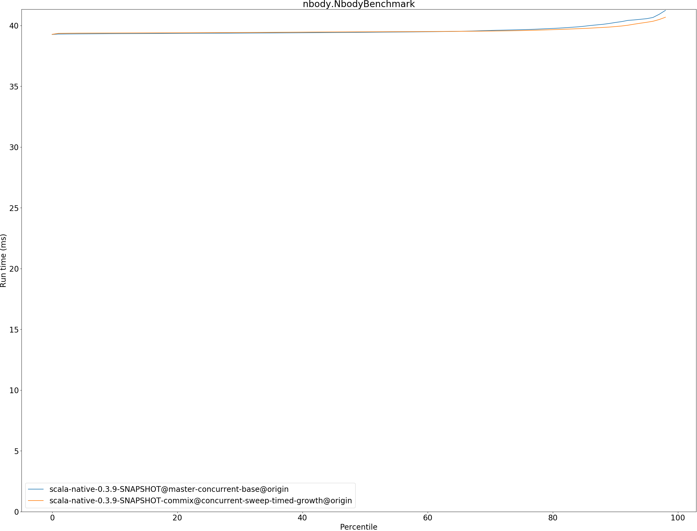
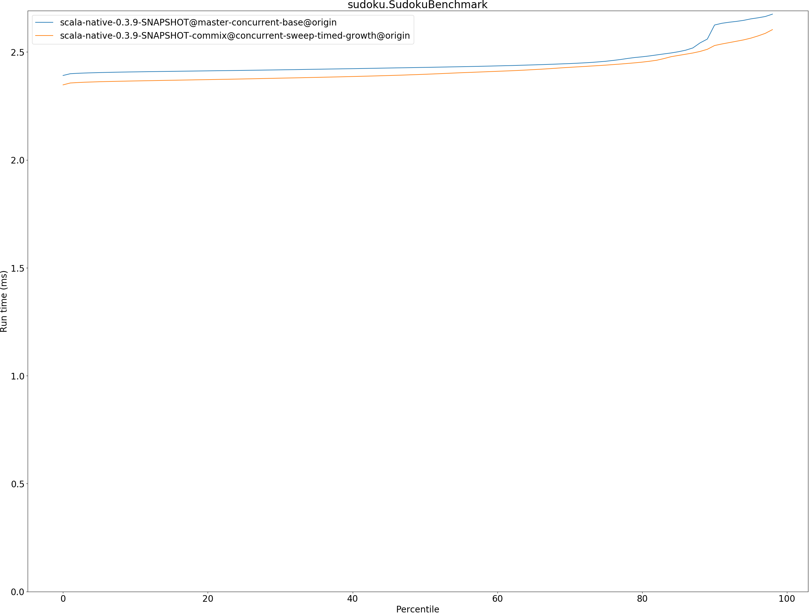
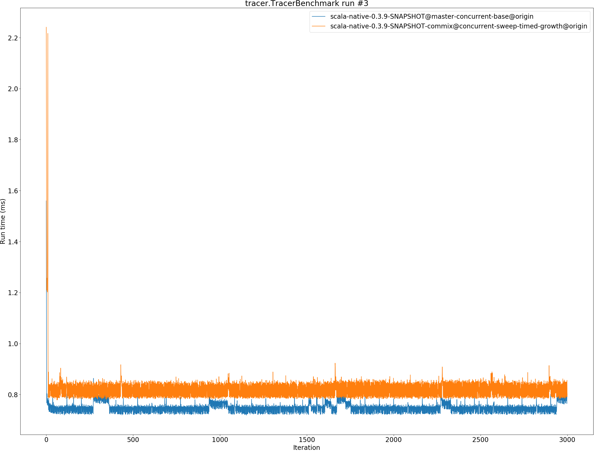

# Summary
## Benchmark run time (ms) at 50 percentile 

|name | scala-native-0.3.9-SNAPSHOT@master-concurrent-base@origin | scala-native-0.3.9-SNAPSHOT-commix@concurrent-sweep-timed-growth@origin | |
| -- | -- | -- | -- |
|[bounce.BounceBenchmark](#bouncebouncebenchmark)|0.0588|0.0556|__-5.49%__|
|[brainfuck.BrainfuckBenchmark](#brainfuckbrainfuckbenchmark)|3.3759|3.3691|__-0.20%__|
|[cd.CDBenchmark](#cdcdbenchmark)|32.7898|32.6623|__-0.39%__|
|[deltablue.DeltaBlueBenchmark](#deltabluedeltabluebenchmark)|0.1823|0.1885|+3.40%|
|[gcbench.GCBenchBenchmark](#gcbenchgcbenchbenchmark)|132.9232|103.0076|__-22.51%__|
|[json.JsonBenchmark](#jsonjsonbenchmark)|1.6521|1.6082|__-2.66%__|
|[kmeans.KmeansBenchmark](#kmeanskmeansbenchmark)|53.9548|52.4846|__-2.72%__|
|[mandelbrot.MandelbrotBenchmark](#mandelbrotmandelbrotbenchmark)|126.0747|126.0306|__-0.03%__|
|[nbody.NbodyBenchmark](#nbodynbodybenchmark)|39.4352|39.4740|+0.10%|
|[permute.PermuteBenchmark](#permutepermutebenchmark)|0.2027|0.2045|+0.85%|
|[queens.QueensBenchmark](#queensqueensbenchmark)|0.1155|0.1123|__-2.77%__|
|[richards.RichardsBenchmark](#richardsrichardsbenchmark)|0.0769|0.0756|__-1.69%__|
|[sudoku.SudokuBenchmark](#sudokusudokubenchmark)|2.4286|2.3967|__-1.31%__|
|[tracer.TracerBenchmark](#tracertracerbenchmark)|0.7508|0.8089|+7.73%|
| __Geometrical mean:__|| |__-2.21%__|
## Benchmark run time (ms) at 90 percentile 

|name | scala-native-0.3.9-SNAPSHOT@master-concurrent-base@origin | scala-native-0.3.9-SNAPSHOT-commix@concurrent-sweep-timed-growth@origin | |
| -- | -- | -- | -- |
|[bounce.BounceBenchmark](#bouncebouncebenchmark)|0.0605|0.0559|__-7.68%__|
|[brainfuck.BrainfuckBenchmark](#brainfuckbrainfuckbenchmark)|3.4634|3.4885|+0.72%|
|[cd.CDBenchmark](#cdcdbenchmark)|33.3898|32.9159|__-1.42%__|
|[deltablue.DeltaBlueBenchmark](#deltabluedeltabluebenchmark)|0.1924|0.1982|+3.01%|
|[gcbench.GCBenchBenchmark](#gcbenchgcbenchbenchmark)|135.6477|104.5749|__-22.91%__|
|[json.JsonBenchmark](#jsonjsonbenchmark)|1.6739|1.8312|+9.39%|
|[kmeans.KmeansBenchmark](#kmeanskmeansbenchmark)|56.3564|55.3345|__-1.81%__|
|[mandelbrot.MandelbrotBenchmark](#mandelbrotmandelbrotbenchmark)|126.7456|126.8410|+0.08%|
|[nbody.NbodyBenchmark](#nbodynbodybenchmark)|40.2439|39.9068|__-0.84%__|
|[permute.PermuteBenchmark](#permutepermutebenchmark)|0.2269|0.2393|+5.46%|
|[queens.QueensBenchmark](#queensqueensbenchmark)|0.1188|0.1149|__-3.28%__|
|[richards.RichardsBenchmark](#richardsrichardsbenchmark)|0.0799|0.0776|__-2.91%__|
|[sudoku.SudokuBenchmark](#sudokusudokubenchmark)|2.6249|2.5299|__-3.62%__|
|[tracer.TracerBenchmark](#tracertracerbenchmark)|0.7768|0.8545|+10.00%|
| __Geometrical mean:__|| |__-1.45%__|
## Benchmark run time (ms) at 99 percentile 

|name | scala-native-0.3.9-SNAPSHOT@master-concurrent-base@origin | scala-native-0.3.9-SNAPSHOT-commix@concurrent-sweep-timed-growth@origin | |
| -- | -- | -- | -- |
|[bounce.BounceBenchmark](#bouncebouncebenchmark)|0.0626|0.0590|__-5.65%__|
|[brainfuck.BrainfuckBenchmark](#brainfuckbrainfuckbenchmark)|3.5840|3.5707|__-0.37%__|
|[cd.CDBenchmark](#cdcdbenchmark)|34.2258|33.4590|__-2.24%__|
|[deltablue.DeltaBlueBenchmark](#deltabluedeltabluebenchmark)|0.2633|0.2763|+4.95%|
|[gcbench.GCBenchBenchmark](#gcbenchgcbenchbenchmark)|136.9762|106.7468|__-22.07%__|
|[json.JsonBenchmark](#jsonjsonbenchmark)|1.7575|1.8701|+6.41%|
|[kmeans.KmeansBenchmark](#kmeanskmeansbenchmark)|58.3701|56.9269|__-2.47%__|
|[mandelbrot.MandelbrotBenchmark](#mandelbrotmandelbrotbenchmark)|128.7248|129.6029|+0.68%|
|[nbody.NbodyBenchmark](#nbodynbodybenchmark)|41.6190|41.3030|__-0.76%__|
|[permute.PermuteBenchmark](#permutepermutebenchmark)|0.2392|0.2658|+11.11%|
|[queens.QueensBenchmark](#queensqueensbenchmark)|0.1262|0.1191|__-5.61%__|
|[richards.RichardsBenchmark](#richardsrichardsbenchmark)|0.0877|0.0861|__-1.86%__|
|[sudoku.SudokuBenchmark](#sudokusudokubenchmark)|2.7182|2.6274|__-3.34%__|
|[tracer.TracerBenchmark](#tracertracerbenchmark)|0.8415|0.8891|+5.66%|
| __Geometrical mean:__|| |__-1.42%__|
## Benchmark total run time (ms) 

|name | scala-native-0.3.9-SNAPSHOT@master-concurrent-base@origin | scala-native-0.3.9-SNAPSHOT-commix@concurrent-sweep-timed-growth@origin | |
| -- | -- | -- | -- |
|[bounce.BounceBenchmark](#bouncebouncebenchmark)|1185.2632|1116.0648|__-5.84%__|
|[brainfuck.BrainfuckBenchmark](#brainfuckbrainfuckbenchmark)|67047.1111|67746.7440|+1.04%|
|[cd.CDBenchmark](#cdcdbenchmark)|657757.9143|653922.1854|__-0.58%__|
|[deltablue.DeltaBlueBenchmark](#deltabluedeltabluebenchmark)|3744.6118|3859.1921|+3.06%|
|[gcbench.GCBenchBenchmark](#gcbenchgcbenchbenchmark)|2622185.5744|2044763.4481|__-22.02%__|
|[json.JsonBenchmark](#jsonjsonbenchmark)|32669.6568|33304.9580|+1.94%|
|[kmeans.KmeansBenchmark](#kmeanskmeansbenchmark)|1077865.6741|1062157.0644|__-1.46%__|
|[mandelbrot.MandelbrotBenchmark](#mandelbrotmandelbrotbenchmark)|2525585.6944|2526469.3881|+0.03%|
|[nbody.NbodyBenchmark](#nbodynbodybenchmark)|792356.6569|791652.3625|__-0.09%__|
|[permute.PermuteBenchmark](#permutepermutebenchmark)|4141.0957|4252.1814|+2.68%|
|[queens.QueensBenchmark](#queensqueensbenchmark)|2329.7301|2256.8683|__-3.13%__|
|[richards.RichardsBenchmark](#richardsrichardsbenchmark)|1555.5275|1525.1855|__-1.95%__|
|[sudoku.SudokuBenchmark](#sudokusudokubenchmark)|49168.7215|48404.3450|__-1.55%__|
|[tracer.TracerBenchmark](#tracertracerbenchmark)|15044.7692|16329.7090|+8.54%|
| __Geometrical mean:__|| |__-1.62%__|
# Individual benchmarks
## bounce.BounceBenchmark

## brainfuck.BrainfuckBenchmark

## cd.CDBenchmark

## deltablue.DeltaBlueBenchmark

## gcbench.GCBenchBenchmark

## json.JsonBenchmark

## kmeans.KmeansBenchmark

## mandelbrot.MandelbrotBenchmark

## nbody.NbodyBenchmark

## permute.PermuteBenchmark

## queens.QueensBenchmark

## richards.RichardsBenchmark

## sudoku.SudokuBenchmark

## tracer.TracerBenchmark

