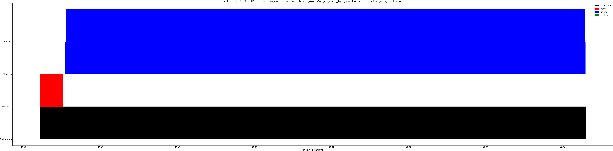

# Summary
## Benchmark run time (ms) at 50 percentile 

|name | scala-native-0.3.9-SNAPSHOT@master-concurrent-base@origin-gc/size_1g-1g | scala-native-0.3.9-SNAPSHOT-commix@concurrent-sweep-timed-growth@origin-gc/size_1g-1g | |
| -- | -- | -- | -- |
|[bounce.BounceBenchmark](#bouncebouncebenchmark)|0.0607|0.0616|+1.43%|
|[brainfuck.BrainfuckBenchmark](#brainfuckbrainfuckbenchmark)|3.3366|3.4137|+2.31%|
|[cd.CDBenchmark](#cdcdbenchmark)|31.1680|31.5603|+1.26%|
|[deltablue.DeltaBlueBenchmark](#deltabluedeltabluebenchmark)|0.2387|0.2318|__-2.90%__|
|[gcbench.GCBenchBenchmark](#gcbenchgcbenchbenchmark)|106.0927|105.1144|__-0.92%__|
|[json.JsonBenchmark](#jsonjsonbenchmark)|1.6549|1.6749|+1.21%|
|[kmeans.KmeansBenchmark](#kmeanskmeansbenchmark)|51.2308|52.8773|+3.21%|
|[mandelbrot.MandelbrotBenchmark](#mandelbrotmandelbrotbenchmark)|126.0834|126.0330|__-0.04%__|
|[nbody.NbodyBenchmark](#nbodynbodybenchmark)|39.3982|39.5109|+0.29%|
|[permute.PermuteBenchmark](#permutepermutebenchmark)|0.2737|0.3103|+13.40%|
|[queens.QueensBenchmark](#queensqueensbenchmark)|0.1181|0.1217|+3.06%|
|[richards.RichardsBenchmark](#richardsrichardsbenchmark)|0.0857|0.0828|__-3.44%__|
|[sudoku.SudokuBenchmark](#sudokusudokubenchmark)|2.3812|2.5625|+7.62%|
|[tracer.TracerBenchmark](#tracertracerbenchmark)|0.8138|0.8217|+0.98%|
| __Geometrical mean:__|| |+1.88%|
## Benchmark run time (ms) at 90 percentile 

|name | scala-native-0.3.9-SNAPSHOT@master-concurrent-base@origin-gc/size_1g-1g | scala-native-0.3.9-SNAPSHOT-commix@concurrent-sweep-timed-growth@origin-gc/size_1g-1g | |
| -- | -- | -- | -- |
|[bounce.BounceBenchmark](#bouncebouncebenchmark)|0.0619|0.0628|+1.42%|
|[brainfuck.BrainfuckBenchmark](#brainfuckbrainfuckbenchmark)|3.4304|3.5109|+2.35%|
|[cd.CDBenchmark](#cdcdbenchmark)|32.4300|32.3221|__-0.33%__|
|[deltablue.DeltaBlueBenchmark](#deltabluedeltabluebenchmark)|0.2447|0.2382|__-2.68%__|
|[gcbench.GCBenchBenchmark](#gcbenchgcbenchbenchmark)|112.4136|110.8537|__-1.39%__|
|[json.JsonBenchmark](#jsonjsonbenchmark)|1.6982|1.7207|+1.33%|
|[kmeans.KmeansBenchmark](#kmeanskmeansbenchmark)|52.3894|54.1668|+3.39%|
|[mandelbrot.MandelbrotBenchmark](#mandelbrotmandelbrotbenchmark)|126.8151|127.1677|+0.28%|
|[nbody.NbodyBenchmark](#nbodynbodybenchmark)|40.3439|40.5952|+0.62%|
|[permute.PermuteBenchmark](#permutepermutebenchmark)|0.2837|0.3290|+16.00%|
|[queens.QueensBenchmark](#queensqueensbenchmark)|0.1215|0.1244|+2.44%|
|[richards.RichardsBenchmark](#richardsrichardsbenchmark)|0.0882|0.0852|__-3.47%__|
|[sudoku.SudokuBenchmark](#sudokusudokubenchmark)|2.5444|2.6768|+5.20%|
|[tracer.TracerBenchmark](#tracertracerbenchmark)|0.8297|0.8426|+1.57%|
| __Geometrical mean:__|| |+1.82%|
## Benchmark run time (ms) at 99 percentile 

|name | scala-native-0.3.9-SNAPSHOT@master-concurrent-base@origin-gc/size_1g-1g | scala-native-0.3.9-SNAPSHOT-commix@concurrent-sweep-timed-growth@origin-gc/size_1g-1g | |
| -- | -- | -- | -- |
|[bounce.BounceBenchmark](#bouncebouncebenchmark)|0.0653|0.0650|__-0.45%__|
|[brainfuck.BrainfuckBenchmark](#brainfuckbrainfuckbenchmark)|3.5753|3.6968|+3.40%|
|[cd.CDBenchmark](#cdcdbenchmark)|39.6152|34.7045|__-12.40%__|
|[deltablue.DeltaBlueBenchmark](#deltabluedeltabluebenchmark)|0.2594|0.2489|__-4.05%__|
|[gcbench.GCBenchBenchmark](#gcbenchgcbenchbenchmark)|113.6214|112.1698|__-1.28%__|
|[json.JsonBenchmark](#jsonjsonbenchmark)|1.7511|1.8683|+6.69%|
|[kmeans.KmeansBenchmark](#kmeanskmeansbenchmark)|61.0173|57.4826|__-5.79%__|
|[mandelbrot.MandelbrotBenchmark](#mandelbrotmandelbrotbenchmark)|128.9258|129.6343|+0.55%|
|[nbody.NbodyBenchmark](#nbodynbodybenchmark)|42.1887|41.7863|__-0.95%__|
|[permute.PermuteBenchmark](#permutepermutebenchmark)|0.2947|0.3421|+16.08%|
|[queens.QueensBenchmark](#queensqueensbenchmark)|0.1274|0.1276|+0.19%|
|[richards.RichardsBenchmark](#richardsrichardsbenchmark)|0.0931|0.0920|__-1.22%__|
|[sudoku.SudokuBenchmark](#sudokusudokubenchmark)|2.6246|2.7555|+4.99%|
|[tracer.TracerBenchmark](#tracertracerbenchmark)|0.8920|1.5399|+72.63%|
| __Geometrical mean:__|| |+4.21%|
## Benchmark total run time (ms) 

|name | scala-native-0.3.9-SNAPSHOT@master-concurrent-base@origin-gc/size_1g-1g | scala-native-0.3.9-SNAPSHOT-commix@concurrent-sweep-timed-growth@origin-gc/size_1g-1g | |
| -- | -- | -- | -- |
|[bounce.BounceBenchmark](#bouncebouncebenchmark)|1218.2112|1234.2933|+1.32%|
|[brainfuck.BrainfuckBenchmark](#brainfuckbrainfuckbenchmark)|67859.6420|68882.4515|+1.51%|
|[cd.CDBenchmark](#cdcdbenchmark)|637863.8750|636993.2176|__-0.14%__|
|[deltablue.DeltaBlueBenchmark](#deltabluedeltabluebenchmark)|4799.6306|4672.5087|__-2.65%__|
|[gcbench.GCBenchBenchmark](#gcbenchgcbenchbenchmark)|2077357.9855|2076861.9236|__-0.02%__|
|[json.JsonBenchmark](#jsonjsonbenchmark)|33569.6345|33763.7397|+0.58%|
|[kmeans.KmeansBenchmark](#kmeanskmeansbenchmark)|1032673.7358|1063121.4722|+2.95%|
|[mandelbrot.MandelbrotBenchmark](#mandelbrotmandelbrotbenchmark)|2526033.2367|2527566.7608|+0.06%|
|[nbody.NbodyBenchmark](#nbodynbodybenchmark)|793496.0542|795440.9163|+0.25%|
|[permute.PermuteBenchmark](#permutepermutebenchmark)|5517.6672|6300.5578|+14.19%|
|[queens.QueensBenchmark](#queensqueensbenchmark)|2377.7046|2439.2546|+2.59%|
|[richards.RichardsBenchmark](#richardsrichardsbenchmark)|1724.5650|1666.2127|__-3.38%__|
|[sudoku.SudokuBenchmark](#sudokusudokubenchmark)|48376.6910|51879.9337|+7.24%|
|[tracer.TracerBenchmark](#tracertracerbenchmark)|16784.7206|16712.6832|__-0.43%__|
| __Geometrical mean:__|| |+1.63%|
## Total GC time on Application thread (ms) 

|name |  | scala-native-0.3.9-SNAPSHOT@master-concurrent-base@origin-gc/size_1g-1g | scala-native-0.3.9-SNAPSHOT-commix@concurrent-sweep-timed-growth@origin-gc/size_1g-1g | |
| -- | -- | -- | -- | -- |
|[bounce.BounceBenchmark](#bouncebouncebenchmark)|mark|0.0000|0.0000|N/A|
||sweep|0.0000|0.0000|N/A|
||total|0.0000|0.0000|N/A|
|[brainfuck.BrainfuckBenchmark](#brainfuckbrainfuckbenchmark)|mark|28.5883|23.6341|__-17.33%__|
||sweep|1643.4396|1.9667|__-99.88%__|
||total|1672.0279|25.6008|__-98.47%__|
|[cd.CDBenchmark](#cdcdbenchmark)|mark|366.7708|320.0363|__-12.74%__|
||sweep|29125.0553|28.7716|__-99.90%__|
||total|29491.8261|348.8078|__-98.82%__|
|[deltablue.DeltaBlueBenchmark](#deltabluedeltabluebenchmark)|mark|0.0000|0.0000|N/A|
||sweep|0.0000|0.0000|N/A|
||total|0.0000|0.0000|N/A|
|[gcbench.GCBenchBenchmark](#gcbenchgcbenchbenchmark)|mark|258588.5091|261257.8821|+1.03%|
||sweep|227807.7324|882.4523|__-99.61%__|
||total|486396.2415|262140.3343|__-46.11%__|
|[json.JsonBenchmark](#jsonjsonbenchmark)|mark|20.5492|16.0595|__-21.85%__|
||sweep|760.7685|0.5906|__-99.92%__|
||total|781.3177|16.6501|__-97.87%__|
|[kmeans.KmeansBenchmark](#kmeanskmeansbenchmark)|mark|4650.2330|4917.8821|+5.76%|
||sweep|11155.2533|35.6873|__-99.68%__|
||total|15805.4863|4953.5694|__-68.66%__|
|[mandelbrot.MandelbrotBenchmark](#mandelbrotmandelbrotbenchmark)|mark|0.0000|0.0000|N/A|
||sweep|0.0000|0.0000|N/A|
||total|0.0000|0.0000|N/A|
|[nbody.NbodyBenchmark](#nbodynbodybenchmark)|mark|13.6831|11.3239|__-17.24%__|
||sweep|3483.9482|2.4740|__-99.93%__|
||total|3497.6313|13.7980|__-99.61%__|
|[permute.PermuteBenchmark](#permutepermutebenchmark)|mark|0.0000|0.0000|N/A|
||sweep|0.0000|0.0000|N/A|
||total|0.0000|0.0000|N/A|
|[queens.QueensBenchmark](#queensqueensbenchmark)|mark|0.0000|0.0000|N/A|
||sweep|0.0000|0.0000|N/A|
||total|0.0000|0.0000|N/A|
|[richards.RichardsBenchmark](#richardsrichardsbenchmark)|mark|0.0000|0.0000|N/A|
||sweep|0.0000|0.0000|N/A|
||total|0.0000|0.0000|N/A|
|[sudoku.SudokuBenchmark](#sudokusudokubenchmark)|mark|13.4081|12.6775|__-5.45%__|
||sweep|617.5477|4.8271|__-99.22%__|
||total|630.9558|17.5046|__-97.23%__|
|[tracer.TracerBenchmark](#tracertracerbenchmark)|mark|5.6128|5.2545|__-6.38%__|
||sweep|1216.7861|4.9577|__-99.59%__|
||total|1222.3988|10.2122|__-99.16%__|
|__Geometrical mean:__|mark|| |__-9.72%__|
||sweep|| |__-99.80%__|
||total|| |__-97.04%__|
## GC pause time (ms) at 50 percentile 

|name | scala-native-0.3.9-SNAPSHOT@master-concurrent-base@origin-gc/size_1g-1g | scala-native-0.3.9-SNAPSHOT-commix@concurrent-sweep-timed-growth@origin-gc/size_1g-1g | |
| -- | -- | -- | -- |
|[bounce.BounceBenchmark](#bouncebouncebenchmark)|0.0000|0.0000|N/A|
|[brainfuck.BrainfuckBenchmark](#brainfuckbrainfuckbenchmark)|7.5889|0.0030|__-99.96%__|
|[cd.CDBenchmark](#cdcdbenchmark)|7.7479|0.0025|__-99.97%__|
|[deltablue.DeltaBlueBenchmark](#deltabluedeltabluebenchmark)|0.0000|0.0000|N/A|
|[gcbench.GCBenchBenchmark](#gcbenchgcbenchbenchmark)|16.3815|0.0111|__-99.93%__|
|[json.JsonBenchmark](#jsonjsonbenchmark)|7.8635|0.0026|__-99.97%__|
|[kmeans.KmeansBenchmark](#kmeanskmeansbenchmark)|8.8094|0.0114|__-99.87%__|
|[mandelbrot.MandelbrotBenchmark](#mandelbrotmandelbrotbenchmark)|0.0000|0.0000|N/A|
|[nbody.NbodyBenchmark](#nbodynbodybenchmark)|7.5817|0.0026|__-99.97%__|
|[permute.PermuteBenchmark](#permutepermutebenchmark)|0.0000|0.0000|N/A|
|[queens.QueensBenchmark](#queensqueensbenchmark)|0.0000|0.0000|N/A|
|[richards.RichardsBenchmark](#richardsrichardsbenchmark)|0.0000|0.0000|N/A|
|[sudoku.SudokuBenchmark](#sudokusudokubenchmark)|7.8798|0.0190|__-99.76%__|
|[tracer.TracerBenchmark](#tracertracerbenchmark)|7.6285|0.0087|__-99.89%__|
| __Geometrical mean:__|| |__-99.93%__|
## GC pause time (ms) at 90 percentile 

|name | scala-native-0.3.9-SNAPSHOT@master-concurrent-base@origin-gc/size_1g-1g | scala-native-0.3.9-SNAPSHOT-commix@concurrent-sweep-timed-growth@origin-gc/size_1g-1g | |
| -- | -- | -- | -- |
|[bounce.BounceBenchmark](#bouncebouncebenchmark)|0.0000|0.0000|N/A|
|[brainfuck.BrainfuckBenchmark](#brainfuckbrainfuckbenchmark)|7.7012|0.1520|__-98.03%__|
|[cd.CDBenchmark](#cdcdbenchmark)|7.8493|0.0809|__-98.97%__|
|[deltablue.DeltaBlueBenchmark](#deltabluedeltabluebenchmark)|0.0000|0.0000|N/A|
|[gcbench.GCBenchBenchmark](#gcbenchgcbenchbenchmark)|16.5451|8.9172|__-46.10%__|
|[json.JsonBenchmark](#jsonjsonbenchmark)|7.9630|0.1718|__-97.84%__|
|[kmeans.KmeansBenchmark](#kmeanskmeansbenchmark)|9.8266|3.0041|__-69.43%__|
|[mandelbrot.MandelbrotBenchmark](#mandelbrotmandelbrotbenchmark)|0.0000|0.0000|N/A|
|[nbody.NbodyBenchmark](#nbodynbodybenchmark)|7.6686|0.0281|__-99.63%__|
|[permute.PermuteBenchmark](#permutepermutebenchmark)|0.0000|0.0000|N/A|
|[queens.QueensBenchmark](#queensqueensbenchmark)|0.0000|0.0000|N/A|
|[richards.RichardsBenchmark](#richardsrichardsbenchmark)|0.0000|0.0000|N/A|
|[sudoku.SudokuBenchmark](#sudokusudokubenchmark)|7.9975|0.1586|__-98.02%__|
|[tracer.TracerBenchmark](#tracertracerbenchmark)|7.7196|0.0403|__-99.48%__|
| __Geometrical mean:__|| |__-97.31%__|
## GC pause time (ms) at 99 percentile 

|name | scala-native-0.3.9-SNAPSHOT@master-concurrent-base@origin-gc/size_1g-1g | scala-native-0.3.9-SNAPSHOT-commix@concurrent-sweep-timed-growth@origin-gc/size_1g-1g | |
| -- | -- | -- | -- |
|[bounce.BounceBenchmark](#bouncebouncebenchmark)|0.0000|0.0000|N/A|
|[brainfuck.BrainfuckBenchmark](#brainfuckbrainfuckbenchmark)|7.8156|0.1724|__-97.79%__|
|[cd.CDBenchmark](#cdcdbenchmark)|7.9812|0.1744|__-97.82%__|
|[deltablue.DeltaBlueBenchmark](#deltabluedeltabluebenchmark)|0.0000|0.0000|N/A|
|[gcbench.GCBenchBenchmark](#gcbenchgcbenchbenchmark)|16.7492|9.0810|__-45.78%__|
|[json.JsonBenchmark](#jsonjsonbenchmark)|8.0693|0.3186|__-96.05%__|
|[kmeans.KmeansBenchmark](#kmeanskmeansbenchmark)|11.8879|3.4194|__-71.24%__|
|[mandelbrot.MandelbrotBenchmark](#mandelbrotmandelbrotbenchmark)|0.0000|0.0000|N/A|
|[nbody.NbodyBenchmark](#nbodynbodybenchmark)|7.7897|0.0316|__-99.59%__|
|[permute.PermuteBenchmark](#permutepermutebenchmark)|0.0000|0.0000|N/A|
|[queens.QueensBenchmark](#queensqueensbenchmark)|0.0000|0.0000|N/A|
|[richards.RichardsBenchmark](#richardsrichardsbenchmark)|0.0000|0.0000|N/A|
|[sudoku.SudokuBenchmark](#sudokusudokubenchmark)|8.0633|0.1767|__-97.81%__|
|[tracer.TracerBenchmark](#tracertracerbenchmark)|7.8405|0.0531|__-99.32%__|
| __Geometrical mean:__|| |__-96.60%__|
# Individual benchmarks
## bounce.BounceBenchmark

## brainfuck.BrainfuckBenchmark

## cd.CDBenchmark

## deltablue.DeltaBlueBenchmark

## gcbench.GCBenchBenchmark

## json.JsonBenchmark

## kmeans.KmeansBenchmark

## mandelbrot.MandelbrotBenchmark

## nbody.NbodyBenchmark

## permute.PermuteBenchmark

## queens.QueensBenchmark

## richards.RichardsBenchmark

## sudoku.SudokuBenchmark

## tracer.TracerBenchmark

