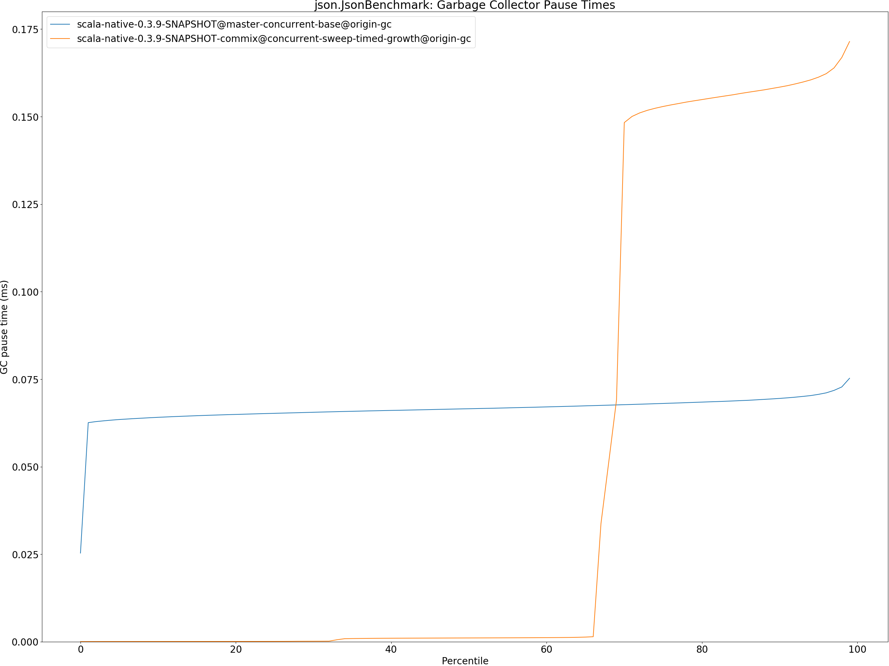

# Summary
## Benchmark run time (ms) at 50 percentile 

|name | scala-native-0.3.9-SNAPSHOT@master-concurrent-base@origin-gc | scala-native-0.3.9-SNAPSHOT-commix@concurrent-sweep-timed-growth@origin-gc | |
| -- | -- | -- | -- |
|[bounce.BounceBenchmark](#bouncebouncebenchmark)|0.0532|0.0596|+11.92%|
|[brainfuck.BrainfuckBenchmark](#brainfuckbrainfuckbenchmark)|3.4564|3.4645|+0.23%|
|[cd.CDBenchmark](#cdcdbenchmark)|32.0159|31.7463|__-0.84%__|
|[deltablue.DeltaBlueBenchmark](#deltabluedeltabluebenchmark)|0.1881|0.1869|__-0.66%__|
|[gcbench.GCBenchBenchmark](#gcbenchgcbenchbenchmark)|133.3344|103.0721|__-22.70%__|
|[json.JsonBenchmark](#jsonjsonbenchmark)|1.6509|1.6128|__-2.31%__|
|[kmeans.KmeansBenchmark](#kmeanskmeansbenchmark)|54.6604|50.9828|__-6.73%__|
|[mandelbrot.MandelbrotBenchmark](#mandelbrotmandelbrotbenchmark)|126.0898|126.0601|__-0.02%__|
|[nbody.NbodyBenchmark](#nbodynbodybenchmark)|39.4732|39.4331|__-0.10%__|
|[permute.PermuteBenchmark](#permutepermutebenchmark)|0.2028|0.2028|__-0.03%__|
|[queens.QueensBenchmark](#queensqueensbenchmark)|0.1140|0.1177|+3.25%|
|[richards.RichardsBenchmark](#richardsrichardsbenchmark)|0.0787|0.0759|__-3.57%__|
|[sudoku.SudokuBenchmark](#sudokusudokubenchmark)|2.4173|2.3873|__-1.24%__|
|[tracer.TracerBenchmark](#tracertracerbenchmark)|0.7499|0.8084|+7.80%|
| __Geometrical mean:__|| |__-1.37%__|
## Benchmark run time (ms) at 90 percentile 

|name | scala-native-0.3.9-SNAPSHOT@master-concurrent-base@origin-gc | scala-native-0.3.9-SNAPSHOT-commix@concurrent-sweep-timed-growth@origin-gc | |
| -- | -- | -- | -- |
|[bounce.BounceBenchmark](#bouncebouncebenchmark)|0.0536|0.0599|+11.72%|
|[brainfuck.BrainfuckBenchmark](#brainfuckbrainfuckbenchmark)|3.5168|3.5994|+2.35%|
|[cd.CDBenchmark](#cdcdbenchmark)|32.6043|32.0950|__-1.56%__|
|[deltablue.DeltaBlueBenchmark](#deltabluedeltabluebenchmark)|0.1955|0.1965|+0.53%|
|[gcbench.GCBenchBenchmark](#gcbenchgcbenchbenchmark)|136.9870|105.1673|__-23.23%__|
|[json.JsonBenchmark](#jsonjsonbenchmark)|1.6779|1.8386|+9.58%|
|[kmeans.KmeansBenchmark](#kmeanskmeansbenchmark)|56.8927|53.9168|__-5.23%__|
|[mandelbrot.MandelbrotBenchmark](#mandelbrotmandelbrotbenchmark)|126.8120|127.0171|+0.16%|
|[nbody.NbodyBenchmark](#nbodynbodybenchmark)|40.1658|39.8874|__-0.69%__|
|[permute.PermuteBenchmark](#permutepermutebenchmark)|0.2143|0.2096|__-2.21%__|
|[queens.QueensBenchmark](#queensqueensbenchmark)|0.1176|0.1205|+2.47%|
|[richards.RichardsBenchmark](#richardsrichardsbenchmark)|0.0818|0.0781|__-4.60%__|
|[sudoku.SudokuBenchmark](#sudokusudokubenchmark)|2.6220|2.5429|__-3.02%__|
|[tracer.TracerBenchmark](#tracertracerbenchmark)|0.7716|0.8592|+11.36%|
| __Geometrical mean:__|| |__-0.54%__|
## Benchmark run time (ms) at 99 percentile 

|name | scala-native-0.3.9-SNAPSHOT@master-concurrent-base@origin-gc | scala-native-0.3.9-SNAPSHOT-commix@concurrent-sweep-timed-growth@origin-gc | |
| -- | -- | -- | -- |
|[bounce.BounceBenchmark](#bouncebouncebenchmark)|0.0565|0.0631|+11.68%|
|[brainfuck.BrainfuckBenchmark](#brainfuckbrainfuckbenchmark)|3.6743|3.7184|+1.20%|
|[cd.CDBenchmark](#cdcdbenchmark)|33.4444|32.6150|__-2.48%__|
|[deltablue.DeltaBlueBenchmark](#deltabluedeltabluebenchmark)|0.2577|0.2690|+4.36%|
|[gcbench.GCBenchBenchmark](#gcbenchgcbenchbenchmark)|138.7733|107.5666|__-22.49%__|
|[json.JsonBenchmark](#jsonjsonbenchmark)|1.7612|1.9196|+9.00%|
|[kmeans.KmeansBenchmark](#kmeanskmeansbenchmark)|58.8480|55.8256|__-5.14%__|
|[mandelbrot.MandelbrotBenchmark](#mandelbrotmandelbrotbenchmark)|128.7928|129.6401|+0.66%|
|[nbody.NbodyBenchmark](#nbodynbodybenchmark)|41.6149|41.3468|__-0.64%__|
|[permute.PermuteBenchmark](#permutepermutebenchmark)|0.2348|0.2568|+9.36%|
|[queens.QueensBenchmark](#queensqueensbenchmark)|0.1243|0.1287|+3.59%|
|[richards.RichardsBenchmark](#richardsrichardsbenchmark)|0.0918|0.0929|+1.17%|
|[sudoku.SudokuBenchmark](#sudokusudokubenchmark)|2.7546|3.5360|+28.37%|
|[tracer.TracerBenchmark](#tracertracerbenchmark)|0.8103|0.9424|+16.30%|
| __Geometrical mean:__|| |+3.31%|
## Benchmark total run time (ms) 

|name | scala-native-0.3.9-SNAPSHOT@master-concurrent-base@origin-gc | scala-native-0.3.9-SNAPSHOT-commix@concurrent-sweep-timed-growth@origin-gc | |
| -- | -- | -- | -- |
|[bounce.BounceBenchmark](#bouncebouncebenchmark)|1069.1015|1195.8183|+11.85%|
|[brainfuck.BrainfuckBenchmark](#brainfuckbrainfuckbenchmark)|68535.7002|69817.7460|+1.87%|
|[cd.CDBenchmark](#cdcdbenchmark)|642517.3699|636315.2261|__-0.97%__|
|[deltablue.DeltaBlueBenchmark](#deltabluedeltabluebenchmark)|3846.9008|3829.1930|__-0.46%__|
|[gcbench.GCBenchBenchmark](#gcbenchgcbenchbenchmark)|2651021.9654|2044046.3810|__-22.90%__|
|[json.JsonBenchmark](#jsonjsonbenchmark)|32691.6019|33415.3939|+2.21%|
|[kmeans.KmeansBenchmark](#kmeanskmeansbenchmark)|1090491.7006|1031897.2860|__-5.37%__|
|[mandelbrot.MandelbrotBenchmark](#mandelbrotmandelbrotbenchmark)|2526043.9684|2527408.5783|+0.05%|
|[nbody.NbodyBenchmark](#nbodynbodybenchmark)|792535.4011|791072.2015|__-0.18%__|
|[permute.PermuteBenchmark](#permutepermutebenchmark)|4122.0768|4126.4530|+0.11%|
|[queens.QueensBenchmark](#queensqueensbenchmark)|2298.9204|2364.8212|+2.87%|
|[richards.RichardsBenchmark](#richardsrichardsbenchmark)|1587.8358|1532.8902|__-3.46%__|
|[sudoku.SudokuBenchmark](#sudokusudokubenchmark)|49181.5634|49179.4506|__-0.00%__|
|[tracer.TracerBenchmark](#tracertracerbenchmark)|14983.9113|16355.4441|+9.15%|
| __Geometrical mean:__|| |__-0.69%__|
## Total GC time on Application thread (ms) 

|name |  | scala-native-0.3.9-SNAPSHOT@master-concurrent-base@origin-gc | scala-native-0.3.9-SNAPSHOT-commix@concurrent-sweep-timed-growth@origin-gc | |
| -- | -- | -- | -- | -- |
|[bounce.BounceBenchmark](#bouncebouncebenchmark)|mark|1.7394|1.6618|__-4.46%__|
||sweep|1.4444|0.1547|__-89.29%__|
||total|3.1838|1.8166|__-42.94%__|
|[brainfuck.BrainfuckBenchmark](#brainfuckbrainfuckbenchmark)|mark|2981.8161|2746.6578|__-7.89%__|
||sweep|938.6748|94.1901|__-89.97%__|
||total|3920.4908|2840.8479|__-27.54%__|
|[cd.CDBenchmark](#cdcdbenchmark)|mark|18841.2678|17303.7873|__-8.16%__|
||sweep|26441.0059|1702.1056|__-93.56%__|
||total|45282.2737|19005.8929|__-58.03%__|
|[deltablue.DeltaBlueBenchmark](#deltabluedeltabluebenchmark)|mark|111.6066|101.8152|__-8.77%__|
||sweep|38.9022|3.5969|__-90.75%__|
||total|150.5088|105.4121|__-29.96%__|
|[gcbench.GCBenchBenchmark](#gcbenchgcbenchbenchmark)|mark|1856817.6615|168394.1606|__-90.93%__|
||sweep|228657.5814|1754.8418|__-99.23%__|
||total|2085475.2429|170149.0024|__-91.84%__|
|[json.JsonBenchmark](#jsonjsonbenchmark)|mark|1483.9046|2333.0168|+57.22%|
||sweep|522.5402|21.7210|__-95.84%__|
||total|2006.4448|2354.7378|+17.36%|
|[kmeans.KmeansBenchmark](#kmeanskmeansbenchmark)|mark|78461.8126|49687.8564|__-36.67%__|
||sweep|13903.4853|421.8654|__-96.97%__|
||total|92365.2980|50109.7218|__-45.75%__|
|[mandelbrot.MandelbrotBenchmark](#mandelbrotmandelbrotbenchmark)|mark|0.0000|0.0000|N/A|
||sweep|0.0000|0.0000|N/A|
||total|0.0000|0.0000|N/A|
|[nbody.NbodyBenchmark](#nbodynbodybenchmark)|mark|1028.6022|1135.8421|+10.43%|
||sweep|1625.2079|135.9056|__-91.64%__|
||total|2653.8101|1271.7477|__-52.08%__|
|[permute.PermuteBenchmark](#permutepermutebenchmark)|mark|44.9398|45.4324|+1.10%|
||sweep|54.0087|3.7949|__-92.97%__|
||total|98.9485|49.2273|__-50.25%__|
|[queens.QueensBenchmark](#queensqueensbenchmark)|mark|2.9422|2.9399|__-0.08%__|
||sweep|2.5301|0.2743|__-89.16%__|
||total|5.4723|3.2142|__-41.26%__|
|[richards.RichardsBenchmark](#richardsrichardsbenchmark)|mark|4.2147|4.2383|+0.56%|
||sweep|4.1873|0.3744|__-91.06%__|
||total|8.4020|4.6127|__-45.10%__|
|[sudoku.SudokuBenchmark](#sudokusudokubenchmark)|mark|740.8834|807.6416|+9.01%|
||sweep|493.1625|243.7894|__-50.57%__|
||total|1234.0459|1051.4310|__-14.80%__|
|[tracer.TracerBenchmark](#tracertracerbenchmark)|mark|505.2561|391.0373|__-22.61%__|
||sweep|578.4200|189.7796|__-67.19%__|
||total|1083.6761|580.8169|__-46.40%__|
|__Geometrical mean:__|mark|| |__-19.16%__|
||sweep|| |__-91.98%__|
||total|| |__-47.65%__|
## GC pause time (ms) at 50 percentile 

|name | scala-native-0.3.9-SNAPSHOT@master-concurrent-base@origin-gc | scala-native-0.3.9-SNAPSHOT-commix@concurrent-sweep-timed-growth@origin-gc | |
| -- | -- | -- | -- |
|[bounce.BounceBenchmark](#bouncebouncebenchmark)|0.0307|0.0010|__-96.67%__|
|[brainfuck.BrainfuckBenchmark](#brainfuckbrainfuckbenchmark)|0.1284|0.0015|__-98.83%__|
|[cd.CDBenchmark](#cdcdbenchmark)|0.1847|0.0023|__-98.74%__|
|[deltablue.DeltaBlueBenchmark](#deltabluedeltabluebenchmark)|0.0557|0.0010|__-98.26%__|
|[gcbench.GCBenchBenchmark](#gcbenchgcbenchbenchmark)|3.6894|0.0109|__-99.70%__|
|[json.JsonBenchmark](#jsonjsonbenchmark)|0.0666|0.0011|__-98.39%__|
|[kmeans.KmeansBenchmark](#kmeanskmeansbenchmark)|2.6665|0.0109|__-99.59%__|
|[mandelbrot.MandelbrotBenchmark](#mandelbrotmandelbrotbenchmark)|0.0000|0.0000|N/A|
|[nbody.NbodyBenchmark](#nbodynbodybenchmark)|0.0222|0.0009|__-96.09%__|
|[permute.PermuteBenchmark](#permutepermutebenchmark)|0.0246|0.0009|__-96.52%__|
|[queens.QueensBenchmark](#queensqueensbenchmark)|0.0292|0.0011|__-96.37%__|
|[richards.RichardsBenchmark](#richardsrichardsbenchmark)|0.0272|0.0010|__-96.28%__|
|[sudoku.SudokuBenchmark](#sudokusudokubenchmark)|0.1988|0.0109|__-94.54%__|
|[tracer.TracerBenchmark](#tracertracerbenchmark)|0.0258|0.0014|__-94.40%__|
| __Geometrical mean:__|| |__-97.98%__|
## GC pause time (ms) at 90 percentile 

|name | scala-native-0.3.9-SNAPSHOT@master-concurrent-base@origin-gc | scala-native-0.3.9-SNAPSHOT-commix@concurrent-sweep-timed-growth@origin-gc | |
| -- | -- | -- | -- |
|[bounce.BounceBenchmark](#bouncebouncebenchmark)|0.0374|0.0172|__-53.98%__|
|[brainfuck.BrainfuckBenchmark](#brainfuckbrainfuckbenchmark)|0.1330|0.0867|__-34.83%__|
|[cd.CDBenchmark](#cdcdbenchmark)|0.2352|0.0690|__-70.66%__|
|[deltablue.DeltaBlueBenchmark](#deltabluedeltabluebenchmark)|0.0706|0.0494|__-30.02%__|
|[gcbench.GCBenchBenchmark](#gcbenchgcbenchbenchmark)|4.9069|3.3516|__-31.70%__|
|[json.JsonBenchmark](#jsonjsonbenchmark)|0.0695|0.1584|+127.95%|
|[kmeans.KmeansBenchmark](#kmeanskmeansbenchmark)|4.2400|3.1726|__-25.18%__|
|[mandelbrot.MandelbrotBenchmark](#mandelbrotmandelbrotbenchmark)|0.0000|0.0000|N/A|
|[nbody.NbodyBenchmark](#nbodynbodybenchmark)|0.0247|0.0103|__-58.27%__|
|[permute.PermuteBenchmark](#permutepermutebenchmark)|0.0274|0.0119|__-56.58%__|
|[queens.QueensBenchmark](#queensqueensbenchmark)|0.0382|0.0164|__-57.18%__|
|[richards.RichardsBenchmark](#richardsrichardsbenchmark)|0.0308|0.0144|__-53.28%__|
|[sudoku.SudokuBenchmark](#sudokusudokubenchmark)|0.2180|0.1313|__-39.76%__|
|[tracer.TracerBenchmark](#tracertracerbenchmark)|0.0276|0.0202|__-27.01%__|
| __Geometrical mean:__|| |__-40.61%__|
## GC pause time (ms) at 99 percentile 

|name | scala-native-0.3.9-SNAPSHOT@master-concurrent-base@origin-gc | scala-native-0.3.9-SNAPSHOT-commix@concurrent-sweep-timed-growth@origin-gc | |
| -- | -- | -- | -- |
|[bounce.BounceBenchmark](#bouncebouncebenchmark)|0.0410|0.0248|__-39.47%__|
|[brainfuck.BrainfuckBenchmark](#brainfuckbrainfuckbenchmark)|0.1472|0.1376|__-6.54%__|
|[cd.CDBenchmark](#cdcdbenchmark)|0.3050|0.1479|__-51.50%__|
|[deltablue.DeltaBlueBenchmark](#deltabluedeltabluebenchmark)|0.0889|0.0708|__-20.41%__|
|[gcbench.GCBenchBenchmark](#gcbenchgcbenchbenchmark)|8.2953|5.3060|__-36.04%__|
|[json.JsonBenchmark](#jsonjsonbenchmark)|0.0753|0.1715|+127.82%|
|[kmeans.KmeansBenchmark](#kmeanskmeansbenchmark)|5.3671|3.8291|__-28.66%__|
|[mandelbrot.MandelbrotBenchmark](#mandelbrotmandelbrotbenchmark)|0.0000|0.0000|N/A|
|[nbody.NbodyBenchmark](#nbodynbodybenchmark)|0.0279|0.0137|__-51.13%__|
|[permute.PermuteBenchmark](#permutepermutebenchmark)|0.0358|0.0165|__-54.01%__|
|[queens.QueensBenchmark](#queensqueensbenchmark)|0.0431|0.0256|__-40.66%__|
|[richards.RichardsBenchmark](#richardsrichardsbenchmark)|0.0386|0.0233|__-39.78%__|
|[sudoku.SudokuBenchmark](#sudokusudokubenchmark)|0.2658|0.1500|__-43.59%__|
|[tracer.TracerBenchmark](#tracertracerbenchmark)|0.0313|0.0234|__-25.17%__|
| __Geometrical mean:__|| |__-31.23%__|
# Individual benchmarks
## bounce.BounceBenchmark

## brainfuck.BrainfuckBenchmark

## cd.CDBenchmark

## deltablue.DeltaBlueBenchmark

## gcbench.GCBenchBenchmark

## json.JsonBenchmark

## kmeans.KmeansBenchmark

## mandelbrot.MandelbrotBenchmark

## nbody.NbodyBenchmark

## permute.PermuteBenchmark

## queens.QueensBenchmark

## richards.RichardsBenchmark

## sudoku.SudokuBenchmark

## tracer.TracerBenchmark

