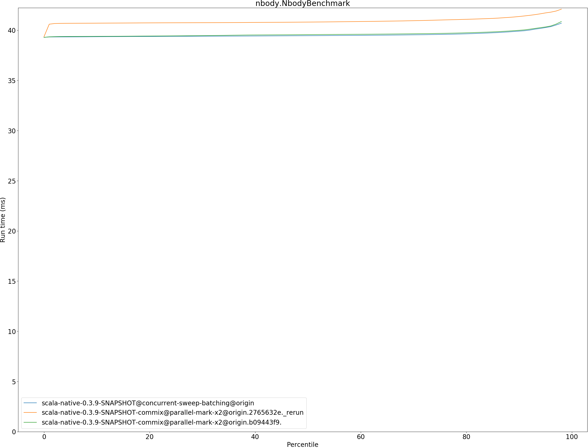
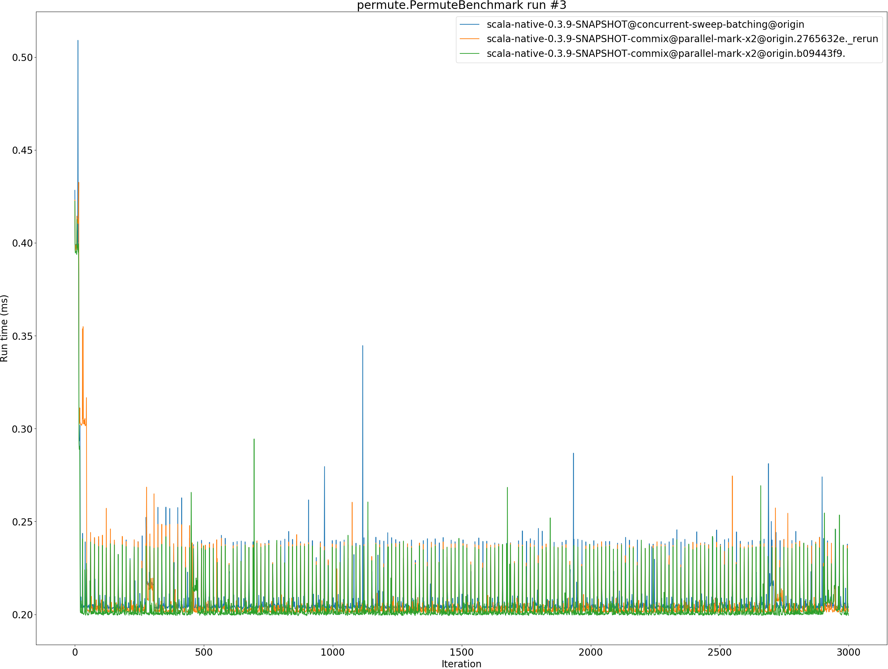
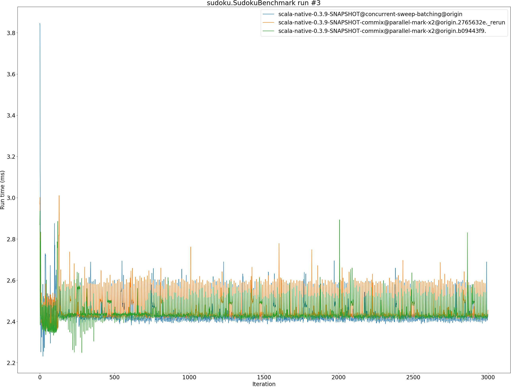

# Summary
## Benchmark run time (ms) at 50 percentile 

|name | scala-native-0.3.9-SNAPSHOT@concurrent-sweep-batching@origin | scala-native-0.3.9-SNAPSHOT-commix@parallel-mark-x2@origin.2765632e._rerun |  | scala-native-0.3.9-SNAPSHOT-commix@parallel-mark-x2@origin.b09443f9. | |
| -- | -- | -- | -- | -- | -- |
|[bounce.BounceBenchmark](#bouncebouncebenchmark)|0.0598|0.0546|__-8.62%__|0.0556|__-7.06%__|
|[brainfuck.BrainfuckBenchmark](#brainfuckbrainfuckbenchmark)|3.4674|3.3686|__-2.85%__|3.4737|+0.18%|
|[cd.CDBenchmark](#cdcdbenchmark)|32.5097|32.4516|__-0.18%__|32.5559|+0.14%|
|[deltablue.DeltaBlueBenchmark](#deltabluedeltabluebenchmark)|0.1849|0.1878|+1.56%|0.1825|__-1.31%__|
|[gcbench.GCBenchBenchmark](#gcbenchgcbenchbenchmark)|132.9007|116.6417|__-12.23%__|114.4855|__-13.86%__|
|[json.JsonBenchmark](#jsonjsonbenchmark)|1.6409|1.6809|+2.44%|1.6758|+2.13%|
|[kmeans.KmeansBenchmark](#kmeanskmeansbenchmark)|52.7373|53.6427|+1.72%|53.8458|+2.10%|
|[mandelbrot.MandelbrotBenchmark](#mandelbrotmandelbrotbenchmark)|126.0511|126.0580|+0.01%|126.0121|__-0.03%__|
|[nbody.NbodyBenchmark](#nbodynbodybenchmark)|39.4545|40.8090|+3.43%|39.5594|+0.27%|
|[permute.PermuteBenchmark](#permutepermutebenchmark)|0.2042|0.2018|__-1.15%__|0.2008|__-1.65%__|
|[queens.QueensBenchmark](#queensqueensbenchmark)|0.1181|0.1132|__-4.21%__|0.1152|__-2.46%__|
|[richards.RichardsBenchmark](#richardsrichardsbenchmark)|0.0894|0.0805|__-9.97%__|0.0764|__-14.58%__|
|[sudoku.SudokuBenchmark](#sudokusudokubenchmark)|2.4240|2.4352|+0.46%|2.4379|+0.57%|
|[tracer.TracerBenchmark](#tracertracerbenchmark)|0.7625|0.7601|__-0.31%__|0.7624|__-0.01%__|
| __Geometrical mean:__|| |__-2.25%__| |__-2.69%__|
## Benchmark run time (ms) at 90 percentile 

|name | scala-native-0.3.9-SNAPSHOT@concurrent-sweep-batching@origin | scala-native-0.3.9-SNAPSHOT-commix@parallel-mark-x2@origin.2765632e._rerun |  | scala-native-0.3.9-SNAPSHOT-commix@parallel-mark-x2@origin.b09443f9. | |
| -- | -- | -- | -- | -- | -- |
|[bounce.BounceBenchmark](#bouncebouncebenchmark)|0.0601|0.0549|__-8.66%__|0.0560|__-6.79%__|
|[brainfuck.BrainfuckBenchmark](#brainfuckbrainfuckbenchmark)|3.5544|3.4451|__-3.08%__|3.5580|+0.10%|
|[cd.CDBenchmark](#cdcdbenchmark)|32.7788|32.7682|__-0.03%__|32.7979|+0.06%|
|[deltablue.DeltaBlueBenchmark](#deltabluedeltabluebenchmark)|0.1905|0.1931|+1.35%|0.1878|__-1.45%__|
|[gcbench.GCBenchBenchmark](#gcbenchgcbenchbenchmark)|137.2482|124.9260|__-8.98%__|121.1942|__-11.70%__|
|[json.JsonBenchmark](#jsonjsonbenchmark)|1.6703|1.7053|+2.10%|1.6896|+1.16%|
|[kmeans.KmeansBenchmark](#kmeanskmeansbenchmark)|54.7551|54.7991|+0.08%|54.9933|+0.44%|
|[mandelbrot.MandelbrotBenchmark](#mandelbrotmandelbrotbenchmark)|126.6876|126.9685|+0.22%|127.0704|+0.30%|
|[nbody.NbodyBenchmark](#nbodynbodybenchmark)|39.9061|41.3650|+3.66%|39.9882|+0.21%|
|[permute.PermuteBenchmark](#permutepermutebenchmark)|0.2422|0.2077|__-14.25%__|0.2076|__-14.29%__|
|[queens.QueensBenchmark](#queensqueensbenchmark)|0.1204|0.1167|__-3.07%__|0.1188|__-1.31%__|
|[richards.RichardsBenchmark](#richardsrichardsbenchmark)|0.0917|0.0827|__-9.78%__|0.0780|__-14.99%__|
|[sudoku.SudokuBenchmark](#sudokusudokubenchmark)|2.5088|2.5665|+2.30%|2.4964|__-0.50%__|
|[tracer.TracerBenchmark](#tracertracerbenchmark)|0.7802|0.7759|__-0.55%__|0.7801|__-0.01%__|
| __Geometrical mean:__|| |__-2.91%__| |__-3.66%__|
## Benchmark run time (ms) at 99 percentile 

|name | scala-native-0.3.9-SNAPSHOT@concurrent-sweep-batching@origin | scala-native-0.3.9-SNAPSHOT-commix@parallel-mark-x2@origin.2765632e._rerun |  | scala-native-0.3.9-SNAPSHOT-commix@parallel-mark-x2@origin.b09443f9. | |
| -- | -- | -- | -- | -- | -- |
|[bounce.BounceBenchmark](#bouncebouncebenchmark)|0.0631|0.0586|__-7.00%__|0.0587|__-6.84%__|
|[brainfuck.BrainfuckBenchmark](#brainfuckbrainfuckbenchmark)|3.6561|3.5408|__-3.15%__|3.6635|+0.20%|
|[cd.CDBenchmark](#cdcdbenchmark)|33.2745|33.2718|__-0.01%__|33.3272|+0.16%|
|[deltablue.DeltaBlueBenchmark](#deltabluedeltabluebenchmark)|0.2856|0.3146|+10.16%|0.3051|+6.82%|
|[gcbench.GCBenchBenchmark](#gcbenchgcbenchbenchmark)|138.1303|127.1191|__-7.97%__|123.3597|__-10.69%__|
|[json.JsonBenchmark](#jsonjsonbenchmark)|1.7263|1.7574|+1.81%|1.7449|+1.08%|
|[kmeans.KmeansBenchmark](#kmeanskmeansbenchmark)|56.1478|56.0703|__-0.14%__|56.3346|+0.33%|
|[mandelbrot.MandelbrotBenchmark](#mandelbrotmandelbrotbenchmark)|129.6241|129.6624|+0.03%|129.6140|__-0.01%__|
|[nbody.NbodyBenchmark](#nbodynbodybenchmark)|41.3591|42.4345|+2.60%|41.4893|+0.31%|
|[permute.PermuteBenchmark](#permutepermutebenchmark)|0.2600|0.2423|__-6.79%__|0.2459|__-5.43%__|
|[queens.QueensBenchmark](#queensqueensbenchmark)|0.1250|0.1211|__-3.09%__|0.1242|__-0.62%__|
|[richards.RichardsBenchmark](#richardsrichardsbenchmark)|0.1003|0.0901|__-10.18%__|0.0859|__-14.37%__|
|[sudoku.SudokuBenchmark](#sudokusudokubenchmark)|2.6112|2.6246|+0.51%|2.5899|__-0.81%__|
|[tracer.TracerBenchmark](#tracertracerbenchmark)|0.8027|0.8126|+1.23%|0.8036|+0.10%|
| __Geometrical mean:__|| |__-1.70%__| |__-2.27%__|
## Benchmark total run time (ms) 

|name | scala-native-0.3.9-SNAPSHOT@concurrent-sweep-batching@origin | scala-native-0.3.9-SNAPSHOT-commix@parallel-mark-x2@origin.2765632e._rerun |  | scala-native-0.3.9-SNAPSHOT-commix@parallel-mark-x2@origin.b09443f9. | |
| -- | -- | -- | -- | -- | -- |
|[bounce.BounceBenchmark](#bouncebouncebenchmark)|1199.8667|1097.7993|__-8.51%__|1116.5448|__-6.94%__|
|[brainfuck.BrainfuckBenchmark](#brainfuckbrainfuckbenchmark)|69708.0506|67178.1915|__-3.63%__|69586.0137|__-0.18%__|
|[cd.CDBenchmark](#cdcdbenchmark)|650916.4971|649055.1643|__-0.29%__|651720.6211|+0.12%|
|[deltablue.DeltaBlueBenchmark](#deltabluedeltabluebenchmark)|3800.9489|3873.1911|+1.90%|3761.5821|__-1.04%__|
|[gcbench.GCBenchBenchmark](#gcbenchgcbenchbenchmark)|2628060.8582|2359691.6481|__-10.21%__|2309802.6328|__-12.11%__|
|[json.JsonBenchmark](#jsonjsonbenchmark)|32379.0734|33077.4842|+2.16%|32857.2557|+1.48%|
|[kmeans.KmeansBenchmark](#kmeanskmeansbenchmark)|1054952.2619|1069341.1184|+1.36%|1072247.6685|+1.64%|
|[mandelbrot.MandelbrotBenchmark](#mandelbrotmandelbrotbenchmark)|2526167.3424|2527522.7370|+0.05%|2526934.3608|+0.03%|
|[nbody.NbodyBenchmark](#nbodynbodybenchmark)|791378.2895|818857.2406|+3.47%|793016.0844|+0.21%|
|[permute.PermuteBenchmark](#permutepermutebenchmark)|4220.3826|4096.6405|__-2.93%__|4082.4625|__-3.27%__|
|[queens.QueensBenchmark](#queensqueensbenchmark)|2369.8766|2280.1234|__-3.79%__|2324.2153|__-1.93%__|
|[richards.RichardsBenchmark](#richardsrichardsbenchmark)|1802.1316|1622.3413|__-9.98%__|1538.7932|__-14.61%__|
|[sudoku.SudokuBenchmark](#sudokusudokubenchmark)|48800.8750|49120.5707|+0.66%|48950.2745|+0.31%|
|[tracer.TracerBenchmark](#tracertracerbenchmark)|15116.1023|15078.2213|__-0.25%__|15136.3880|+0.13%|
| __Geometrical mean:__|| |__-2.24%__| |__-2.71%__|
# Individual benchmarks
## bounce.BounceBenchmark

## brainfuck.BrainfuckBenchmark

## cd.CDBenchmark

## deltablue.DeltaBlueBenchmark

## gcbench.GCBenchBenchmark

## json.JsonBenchmark

## kmeans.KmeansBenchmark

## mandelbrot.MandelbrotBenchmark

## nbody.NbodyBenchmark

## permute.PermuteBenchmark

## queens.QueensBenchmark

## richards.RichardsBenchmark

## sudoku.SudokuBenchmark

## tracer.TracerBenchmark

