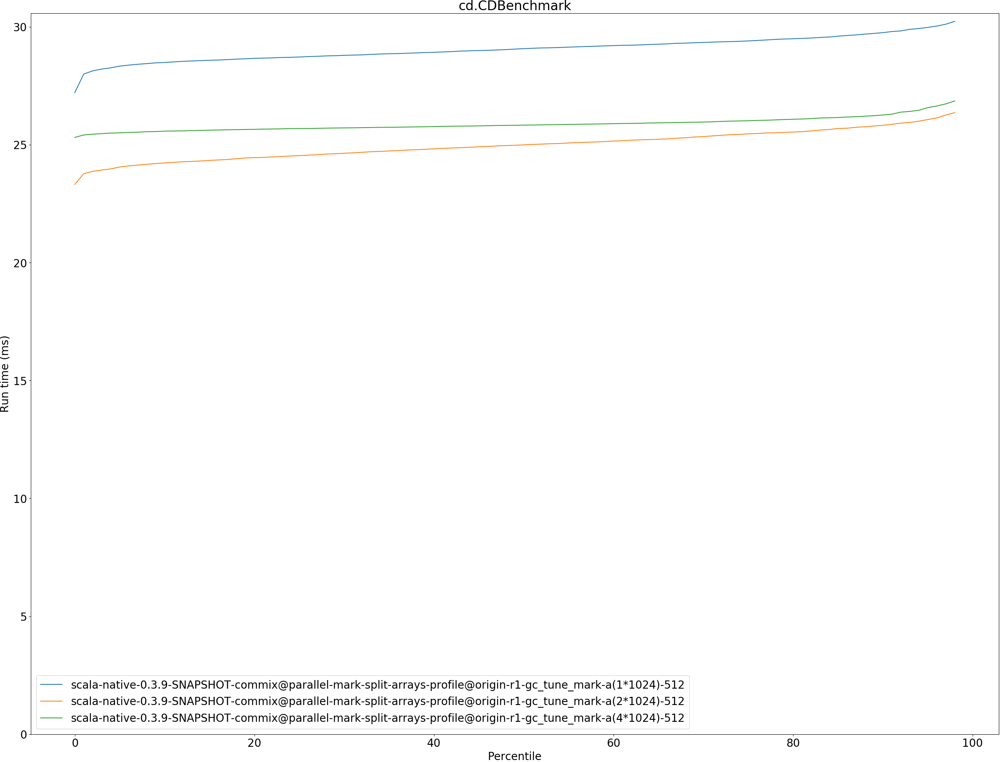
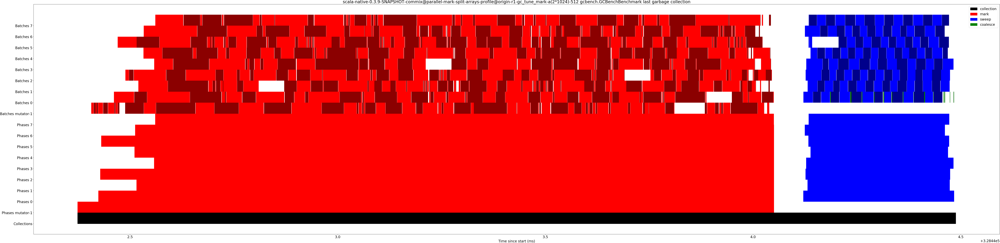

# Summary
## Benchmark run time (ms) at 50 percentile 

|name | scala-native-0.3.9-SNAPSHOT-commix@parallel-mark-split-arrays-profile@origin-r1-gc_tune_mark-a(1*1024)-512 | scala-native-0.3.9-SNAPSHOT-commix@parallel-mark-split-arrays-profile@origin-r1-gc_tune_mark-a(2*1024)-512 |  | scala-native-0.3.9-SNAPSHOT-commix@parallel-mark-split-arrays-profile@origin-r1-gc_tune_mark-a(4*1024)-512 | |
| -- | -- | -- | -- | -- | -- |
|[cd.CDBenchmark](#cdcdbenchmark)|29.0734|24.9928|__-14.04%__|25.8303|__-11.15%__|
|[gcbench.GCBenchBenchmark](#gcbenchgcbenchbenchmark)|110.5421|108.5311|__-1.82%__|107.2035|__-3.02%__|
|[kmeans.KmeansBenchmark](#kmeanskmeansbenchmark)|56.6594|55.5534|__-1.95%__|54.2972|__-4.17%__|
|[sudoku.SudokuBenchmark](#sudokusudokubenchmark)|2.6456|2.5255|__-4.54%__|2.5210|__-4.71%__|
| __Geometrical mean:__|| |__-5.72%__| |__-5.82%__|
## Benchmark run time (ms) at 90 percentile 

|name | scala-native-0.3.9-SNAPSHOT-commix@parallel-mark-split-arrays-profile@origin-r1-gc_tune_mark-a(1*1024)-512 | scala-native-0.3.9-SNAPSHOT-commix@parallel-mark-split-arrays-profile@origin-r1-gc_tune_mark-a(2*1024)-512 |  | scala-native-0.3.9-SNAPSHOT-commix@parallel-mark-split-arrays-profile@origin-r1-gc_tune_mark-a(4*1024)-512 | |
| -- | -- | -- | -- | -- | -- |
|[cd.CDBenchmark](#cdcdbenchmark)|29.7532|25.8222|__-13.21%__|26.2597|__-11.74%__|
|[gcbench.GCBenchBenchmark](#gcbenchgcbenchbenchmark)|119.6748|114.6098|__-4.23%__|112.5346|__-5.97%__|
|[kmeans.KmeansBenchmark](#kmeanskmeansbenchmark)|57.7423|56.9034|__-1.45%__|56.5065|__-2.14%__|
|[sudoku.SudokuBenchmark](#sudokusudokubenchmark)|3.0217|3.0322|+0.35%|2.9897|__-1.06%__|
| __Geometrical mean:__|| |__-4.78%__| |__-5.32%__|
## Benchmark run time (ms) at 99 percentile 

|name | scala-native-0.3.9-SNAPSHOT-commix@parallel-mark-split-arrays-profile@origin-r1-gc_tune_mark-a(1*1024)-512 | scala-native-0.3.9-SNAPSHOT-commix@parallel-mark-split-arrays-profile@origin-r1-gc_tune_mark-a(2*1024)-512 |  | scala-native-0.3.9-SNAPSHOT-commix@parallel-mark-split-arrays-profile@origin-r1-gc_tune_mark-a(4*1024)-512 | |
| -- | -- | -- | -- | -- | -- |
|[cd.CDBenchmark](#cdcdbenchmark)|30.4948|26.7734|__-12.20%__|27.0338|__-11.35%__|
|[gcbench.GCBenchBenchmark](#gcbenchgcbenchbenchmark)|123.6716|117.5471|__-4.95%__|115.2901|__-6.78%__|
|[kmeans.KmeansBenchmark](#kmeanskmeansbenchmark)|61.6504|59.0169|__-4.27%__|77.7822|+26.17%|
|[sudoku.SudokuBenchmark](#sudokusudokubenchmark)|3.2650|3.1448|__-3.68%__|3.1309|__-4.11%__|
| __Geometrical mean:__|| |__-6.34%__| |__-0.00%__|
## Benchmark total run time (ms) 

|name | scala-native-0.3.9-SNAPSHOT-commix@parallel-mark-split-arrays-profile@origin-r1-gc_tune_mark-a(1*1024)-512 | scala-native-0.3.9-SNAPSHOT-commix@parallel-mark-split-arrays-profile@origin-r1-gc_tune_mark-a(2*1024)-512 |  | scala-native-0.3.9-SNAPSHOT-commix@parallel-mark-split-arrays-profile@origin-r1-gc_tune_mark-a(4*1024)-512 | |
| -- | -- | -- | -- | -- | -- |
|[cd.CDBenchmark](#cdcdbenchmark)|29110.6862|25043.4456|__-13.97%__|25915.6156|__-10.98%__|
|[gcbench.GCBenchBenchmark](#gcbenchgcbenchbenchmark)|111413.0146|109004.1197|__-2.16%__|107469.1463|__-3.54%__|
|[kmeans.KmeansBenchmark](#kmeanskmeansbenchmark)|56727.1589|55357.5906|__-2.41%__|55048.2297|__-2.96%__|
|[sudoku.SudokuBenchmark](#sudokusudokubenchmark)|2661.4303|2641.0939|__-0.76%__|2620.8466|__-1.52%__|
| __Geometrical mean:__|| |__-4.98%__| |__-4.82%__|
## Total GC time on Application thread (ms) 

|name |  | scala-native-0.3.9-SNAPSHOT-commix@parallel-mark-split-arrays-profile@origin-r1-gc_tune_mark-a(1*1024)-512 | scala-native-0.3.9-SNAPSHOT-commix@parallel-mark-split-arrays-profile@origin-r1-gc_tune_mark-a(2*1024)-512 |  | scala-native-0.3.9-SNAPSHOT-commix@parallel-mark-split-arrays-profile@origin-r1-gc_tune_mark-a(4*1024)-512 | |
| -- | -- | -- | -- | -- | -- | -- |
|[cd.CDBenchmark](#cdcdbenchmark)|mark|3571.6076|3065.7206|__-14.16%__|2262.4046|__-36.66%__|
||sweep|61.8295|82.6233|+33.63%|121.0631|+95.80%|
||total|3633.4371|3148.3439|__-13.35%__|2383.4677|__-34.40%__|
|[gcbench.GCBenchBenchmark](#gcbenchgcbenchbenchmark)|mark|28683.6833|23495.8289|__-18.09%__|22425.7587|__-21.82%__|
||sweep|76.5456|74.9196|__-2.12%__|70.9783|__-7.27%__|
||total|28760.2289|23570.7484|__-18.04%__|22496.7371|__-21.78%__|
|[kmeans.KmeansBenchmark](#kmeanskmeansbenchmark)|mark|2351.4016|1989.8986|__-15.37%__|2567.4749|+9.19%|
||sweep|6.0597|7.7525|+27.93%|9.2763|+53.08%|
||total|2357.4613|1997.6512|__-15.26%__|2576.7511|+9.30%|
|[sudoku.SudokuBenchmark](#sudokusudokubenchmark)|mark|134.8411|147.6408|+9.49%|145.0311|+7.56%|
||sweep|8.8046|9.2019|+4.51%|8.2213|__-6.62%__|
||total|143.6457|156.8428|+9.19%|153.2524|+6.69%|
|__Geometrical mean:__|mark|| |__-10.16%__| |__-12.67%__|
||sweep|| |+15.00%| |+26.92%|
||total|| |__-9.97%__| |__-12.05%__|
## GC pause time (ms) at 50 percentile 

|name | scala-native-0.3.9-SNAPSHOT-commix@parallel-mark-split-arrays-profile@origin-r1-gc_tune_mark-a(1*1024)-512 | scala-native-0.3.9-SNAPSHOT-commix@parallel-mark-split-arrays-profile@origin-r1-gc_tune_mark-a(2*1024)-512 |  | scala-native-0.3.9-SNAPSHOT-commix@parallel-mark-split-arrays-profile@origin-r1-gc_tune_mark-a(4*1024)-512 | |
| -- | -- | -- | -- | -- | -- |
|[cd.CDBenchmark](#cdcdbenchmark)|0.0032|0.0032|+1.25%|0.0025|__-22.80%__|
|[gcbench.GCBenchBenchmark](#gcbenchgcbenchbenchmark)|0.0069|0.0064|__-7.16%__|0.0103|+48.54%|
|[kmeans.KmeansBenchmark](#kmeanskmeansbenchmark)|0.0047|0.0039|__-17.56%__|0.0044|__-5.96%__|
|[sudoku.SudokuBenchmark](#sudokusudokubenchmark)|0.0086|0.0098|+14.26%|0.0085|__-0.64%__|
| __Geometrical mean:__|| |__-3.00%__| |+1.74%|
## GC pause time (ms) at 90 percentile 

|name | scala-native-0.3.9-SNAPSHOT-commix@parallel-mark-split-arrays-profile@origin-r1-gc_tune_mark-a(1*1024)-512 | scala-native-0.3.9-SNAPSHOT-commix@parallel-mark-split-arrays-profile@origin-r1-gc_tune_mark-a(2*1024)-512 |  | scala-native-0.3.9-SNAPSHOT-commix@parallel-mark-split-arrays-profile@origin-r1-gc_tune_mark-a(4*1024)-512 | |
| -- | -- | -- | -- | -- | -- |
|[cd.CDBenchmark](#cdcdbenchmark)|0.1780|0.1529|__-14.11%__|0.0928|__-47.88%__|
|[gcbench.GCBenchBenchmark](#gcbenchgcbenchbenchmark)|2.3454|2.0287|__-13.50%__|1.9495|__-16.88%__|
|[kmeans.KmeansBenchmark](#kmeanskmeansbenchmark)|0.8165|0.6927|__-15.16%__|0.9537|+16.81%|
|[sudoku.SudokuBenchmark](#sudokusudokubenchmark)|0.2200|0.2281|+3.70%|0.2386|+8.45%|
| __Geometrical mean:__|| |__-10.09%__| |__-13.93%__|
## GC pause time (ms) at 99 percentile 

|name | scala-native-0.3.9-SNAPSHOT-commix@parallel-mark-split-arrays-profile@origin-r1-gc_tune_mark-a(1*1024)-512 | scala-native-0.3.9-SNAPSHOT-commix@parallel-mark-split-arrays-profile@origin-r1-gc_tune_mark-a(2*1024)-512 |  | scala-native-0.3.9-SNAPSHOT-commix@parallel-mark-split-arrays-profile@origin-r1-gc_tune_mark-a(4*1024)-512 | |
| -- | -- | -- | -- | -- | -- |
|[cd.CDBenchmark](#cdcdbenchmark)|0.2784|0.2820|+1.28%|0.1901|__-31.74%__|
|[gcbench.GCBenchBenchmark](#gcbenchgcbenchbenchmark)|4.7351|3.8911|__-17.82%__|3.7396|__-21.02%__|
|[kmeans.KmeansBenchmark](#kmeanskmeansbenchmark)|0.9212|0.8375|__-9.08%__|1.3018|+41.31%|
|[sudoku.SudokuBenchmark](#sudokusudokubenchmark)|0.2701|0.2918|+8.03%|0.3093|+14.50%|
| __Geometrical mean:__|| |__-4.91%__| |__-3.36%__|
# Individual benchmarks
## cd.CDBenchmark

## gcbench.GCBenchBenchmark

## kmeans.KmeansBenchmark

## sudoku.SudokuBenchmark

