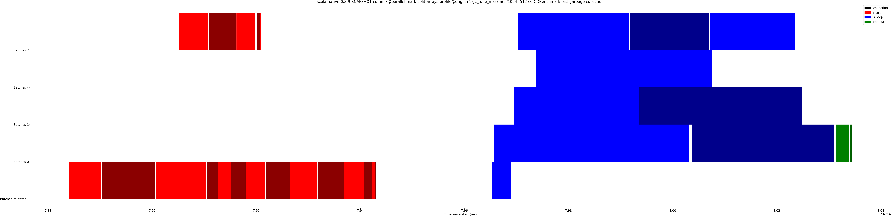

# Summary
## Benchmark run time (ms) at 50 percentile 

|name | scala-native-0.3.9-SNAPSHOT-commix@parallel-mark-split-arrays-profile@origin-r1-gc_tune_mark-a(1*1024)-512 | scala-native-0.3.9-SNAPSHOT-commix@parallel-mark-split-arrays-profile@origin-r1-gc_tune_mark-a(2*1024)-512 |  | scala-native-0.3.9-SNAPSHOT-commix@parallel-mark-split-arrays-profile@origin-r1-gc_tune_mark-a(4*1024)-512 | |
| -- | -- | -- | -- | -- | -- |
|[cd.CDBenchmark](#cdcdbenchmark)|26.8471|25.7436|__-4.11%__|25.9092|__-3.49%__|
|[gcbench.GCBenchBenchmark](#gcbenchgcbenchbenchmark)|114.8124|102.2644|__-10.93%__|107.8824|__-6.04%__|
|[kmeans.KmeansBenchmark](#kmeanskmeansbenchmark)|55.5374|55.2182|__-0.57%__|56.3759|+1.51%|
|[sudoku.SudokuBenchmark](#sudokusudokubenchmark)|2.8751|2.4578|__-14.51%__|2.5121|__-12.62%__|
| __Geometrical mean:__|| |__-7.69%__| |__-5.30%__|
## Benchmark run time (ms) at 90 percentile 

|name | scala-native-0.3.9-SNAPSHOT-commix@parallel-mark-split-arrays-profile@origin-r1-gc_tune_mark-a(1*1024)-512 | scala-native-0.3.9-SNAPSHOT-commix@parallel-mark-split-arrays-profile@origin-r1-gc_tune_mark-a(2*1024)-512 |  | scala-native-0.3.9-SNAPSHOT-commix@parallel-mark-split-arrays-profile@origin-r1-gc_tune_mark-a(4*1024)-512 | |
| -- | -- | -- | -- | -- | -- |
|[cd.CDBenchmark](#cdcdbenchmark)|27.6319|26.5110|__-4.06%__|26.2710|__-4.93%__|
|[gcbench.GCBenchBenchmark](#gcbenchgcbenchbenchmark)|119.4140|107.7246|__-9.79%__|113.4878|__-4.96%__|
|[kmeans.KmeansBenchmark](#kmeanskmeansbenchmark)|57.0726|55.9975|__-1.88%__|57.8713|+1.40%|
|[sudoku.SudokuBenchmark](#sudokusudokubenchmark)|3.2928|2.8941|__-12.11%__|2.9553|__-10.25%__|
| __Geometrical mean:__|| |__-7.05%__| |__-4.77%__|
## Benchmark run time (ms) at 99 percentile 

|name | scala-native-0.3.9-SNAPSHOT-commix@parallel-mark-split-arrays-profile@origin-r1-gc_tune_mark-a(1*1024)-512 | scala-native-0.3.9-SNAPSHOT-commix@parallel-mark-split-arrays-profile@origin-r1-gc_tune_mark-a(2*1024)-512 |  | scala-native-0.3.9-SNAPSHOT-commix@parallel-mark-split-arrays-profile@origin-r1-gc_tune_mark-a(4*1024)-512 | |
| -- | -- | -- | -- | -- | -- |
|[cd.CDBenchmark](#cdcdbenchmark)|28.3429|27.3168|__-3.62%__|26.6240|__-6.06%__|
|[gcbench.GCBenchBenchmark](#gcbenchgcbenchbenchmark)|123.4462|111.0234|__-10.06%__|116.9549|__-5.26%__|
|[kmeans.KmeansBenchmark](#kmeanskmeansbenchmark)|59.2779|58.5178|__-1.28%__|59.6897|+0.69%|
|[sudoku.SudokuBenchmark](#sudokusudokubenchmark)|3.6881|3.0473|__-17.37%__|3.0644|__-16.91%__|
| __Geometrical mean:__|| |__-8.30%__| |__-7.11%__|
## Benchmark total run time (ms) 

|name | scala-native-0.3.9-SNAPSHOT-commix@parallel-mark-split-arrays-profile@origin-r1-gc_tune_mark-a(1*1024)-512 | scala-native-0.3.9-SNAPSHOT-commix@parallel-mark-split-arrays-profile@origin-r1-gc_tune_mark-a(2*1024)-512 |  | scala-native-0.3.9-SNAPSHOT-commix@parallel-mark-split-arrays-profile@origin-r1-gc_tune_mark-a(4*1024)-512 | |
| -- | -- | -- | -- | -- | -- |
|[cd.CDBenchmark](#cdcdbenchmark)|26937.8755|25839.0752|__-4.08%__|25896.0047|__-3.87%__|
|[gcbench.GCBenchBenchmark](#gcbenchgcbenchbenchmark)|114668.9972|102863.6075|__-10.30%__|108422.7413|__-5.45%__|
|[kmeans.KmeansBenchmark](#kmeanskmeansbenchmark)|55334.2656|55121.0186|__-0.39%__|56454.7745|+2.02%|
|[sudoku.SudokuBenchmark](#sudokusudokubenchmark)|2901.9170|2549.4006|__-12.15%__|2605.7025|__-10.21%__|
| __Geometrical mean:__|| |__-6.85%__| |__-4.47%__|
## Total GC time on Application thread (ms) 

|name |  | scala-native-0.3.9-SNAPSHOT-commix@parallel-mark-split-arrays-profile@origin-r1-gc_tune_mark-a(1*1024)-512 | scala-native-0.3.9-SNAPSHOT-commix@parallel-mark-split-arrays-profile@origin-r1-gc_tune_mark-a(2*1024)-512 |  | scala-native-0.3.9-SNAPSHOT-commix@parallel-mark-split-arrays-profile@origin-r1-gc_tune_mark-a(4*1024)-512 | |
| -- | -- | -- | -- | -- | -- | -- |
|[cd.CDBenchmark](#cdcdbenchmark)|mark|3496.8551|2845.2039|__-18.64%__|1819.6505|__-47.96%__|
||sweep|47.6634|82.8969|+73.92%|111.8141|+134.59%|
||total|3544.5185|2928.1007|__-17.39%__|1931.4646|__-45.51%__|
|[gcbench.GCBenchBenchmark](#gcbenchgcbenchbenchmark)|mark|29417.4217|23280.8130|__-20.86%__|23081.8624|__-21.54%__|
||sweep|58.1256|52.6215|__-9.47%__|67.2413|+15.68%|
||total|29475.5474|23333.4346|__-20.84%__|23149.1037|__-21.46%__|
|[kmeans.KmeansBenchmark](#kmeanskmeansbenchmark)|mark|2365.2172|2065.9183|__-12.65%__|2560.1580|+8.24%|
||sweep|6.1793|11.4039|+84.55%|5.8520|__-5.30%__|
||total|2371.3965|2077.3221|__-12.40%__|2566.0100|+8.21%|
|[sudoku.SudokuBenchmark](#sudokusudokubenchmark)|mark|129.5869|124.0170|__-4.30%__|139.2202|+7.43%|
||sweep|9.5333|8.5922|__-9.87%__|10.2904|+7.94%|
||total|139.1202|132.6093|__-4.68%__|149.5106|+7.47%|
|__Geometrical mean:__|mark|| |__-14.35%__| |__-16.99%__|
||sweep|| |+27.21%| |+29.06%|
||total|| |__-14.04%__| |__-16.01%__|
## GC pause time (ms) at 50 percentile 

|name | scala-native-0.3.9-SNAPSHOT-commix@parallel-mark-split-arrays-profile@origin-r1-gc_tune_mark-a(1*1024)-512 | scala-native-0.3.9-SNAPSHOT-commix@parallel-mark-split-arrays-profile@origin-r1-gc_tune_mark-a(2*1024)-512 |  | scala-native-0.3.9-SNAPSHOT-commix@parallel-mark-split-arrays-profile@origin-r1-gc_tune_mark-a(4*1024)-512 | |
| -- | -- | -- | -- | -- | -- |
|[cd.CDBenchmark](#cdcdbenchmark)|0.0033|0.0033|+0.57%|0.0025|__-23.58%__|
|[gcbench.GCBenchBenchmark](#gcbenchgcbenchbenchmark)|0.0054|0.0052|__-2.62%__|0.0046|__-13.46%__|
|[kmeans.KmeansBenchmark](#kmeanskmeansbenchmark)|0.0044|0.0039|__-12.24%__|0.0030|__-33.23%__|
|[sudoku.SudokuBenchmark](#sudokusudokubenchmark)|0.0097|0.0076|__-21.60%__|0.0095|__-2.07%__|
| __Geometrical mean:__|| |__-9.40%__| |__-18.91%__|
## GC pause time (ms) at 90 percentile 

|name | scala-native-0.3.9-SNAPSHOT-commix@parallel-mark-split-arrays-profile@origin-r1-gc_tune_mark-a(1*1024)-512 | scala-native-0.3.9-SNAPSHOT-commix@parallel-mark-split-arrays-profile@origin-r1-gc_tune_mark-a(2*1024)-512 |  | scala-native-0.3.9-SNAPSHOT-commix@parallel-mark-split-arrays-profile@origin-r1-gc_tune_mark-a(4*1024)-512 | |
| -- | -- | -- | -- | -- | -- |
|[cd.CDBenchmark](#cdcdbenchmark)|0.1775|0.1427|__-19.58%__|0.0924|__-47.94%__|
|[gcbench.GCBenchBenchmark](#gcbenchgcbenchbenchmark)|2.3194|2.0576|__-11.29%__|1.9572|__-15.61%__|
|[kmeans.KmeansBenchmark](#kmeanskmeansbenchmark)|0.8147|0.7247|__-11.04%__|0.9523|+16.90%|
|[sudoku.SudokuBenchmark](#sudokusudokubenchmark)|0.2199|0.2091|__-4.94%__|0.2303|+4.73%|
| __Geometrical mean:__|| |__-11.87%__| |__-14.36%__|
## GC pause time (ms) at 99 percentile 

|name | scala-native-0.3.9-SNAPSHOT-commix@parallel-mark-split-arrays-profile@origin-r1-gc_tune_mark-a(1*1024)-512 | scala-native-0.3.9-SNAPSHOT-commix@parallel-mark-split-arrays-profile@origin-r1-gc_tune_mark-a(2*1024)-512 |  | scala-native-0.3.9-SNAPSHOT-commix@parallel-mark-split-arrays-profile@origin-r1-gc_tune_mark-a(4*1024)-512 | |
| -- | -- | -- | -- | -- | -- |
|[cd.CDBenchmark](#cdcdbenchmark)|0.2802|0.2778|__-0.89%__|0.1878|__-32.98%__|
|[gcbench.GCBenchBenchmark](#gcbenchgcbenchbenchmark)|4.5980|3.8386|__-16.52%__|3.7990|__-17.38%__|
|[kmeans.KmeansBenchmark](#kmeanskmeansbenchmark)|0.9000|0.8334|__-7.41%__|1.2099|+34.42%|
|[sudoku.SudokuBenchmark](#sudokusudokubenchmark)|0.2774|0.2795|+0.74%|0.2965|+6.88%|
| __Geometrical mean:__|| |__-6.27%__| |__-5.56%__|
# Individual benchmarks
## cd.CDBenchmark

## gcbench.GCBenchBenchmark

## kmeans.KmeansBenchmark

## sudoku.SudokuBenchmark

