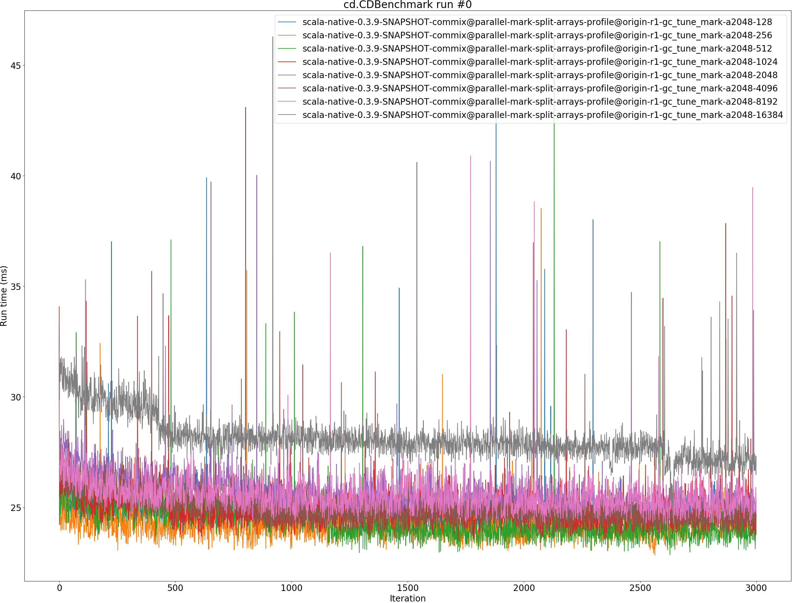
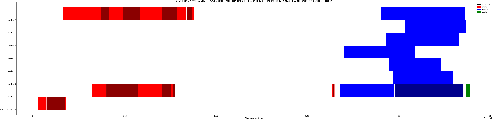

# Summary
## Benchmark run time (ms) at 50 percentile 

|name | scala-native-0.3.9-SNAPSHOT-commix@parallel-mark-split-arrays-profile@origin-r1-gc_tune_mark-a2048-128 | scala-native-0.3.9-SNAPSHOT-commix@parallel-mark-split-arrays-profile@origin-r1-gc_tune_mark-a2048-256 |  | scala-native-0.3.9-SNAPSHOT-commix@parallel-mark-split-arrays-profile@origin-r1-gc_tune_mark-a2048-512 |  | scala-native-0.3.9-SNAPSHOT-commix@parallel-mark-split-arrays-profile@origin-r1-gc_tune_mark-a2048-1024 |  | scala-native-0.3.9-SNAPSHOT-commix@parallel-mark-split-arrays-profile@origin-r1-gc_tune_mark-a2048-2048 |  | scala-native-0.3.9-SNAPSHOT-commix@parallel-mark-split-arrays-profile@origin-r1-gc_tune_mark-a2048-4096 |  | scala-native-0.3.9-SNAPSHOT-commix@parallel-mark-split-arrays-profile@origin-r1-gc_tune_mark-a2048-8192 |  | scala-native-0.3.9-SNAPSHOT-commix@parallel-mark-split-arrays-profile@origin-r1-gc_tune_mark-a2048-16384 | |
| -- | -- | -- | -- | -- | -- | -- | -- | -- | -- | -- | -- | -- | -- | -- | -- |
|[cd.CDBenchmark](#cdcdbenchmark)|24.5461|24.1586|__-1.58%__|23.9407|__-2.47%__|24.6958|+0.61%|25.1045|+2.27%|24.6475|+0.41%|25.1745|+2.56%|27.5235|+12.13%|
|[gcbench.GCBenchBenchmark](#gcbenchgcbenchbenchmark)|102.6055|106.3057|+3.61%|103.4641|+0.84%|108.2615|+5.51%|107.5500|+4.82%|105.5836|+2.90%|105.4642|+2.79%|106.8601|+4.15%|
|[kmeans.KmeansBenchmark](#kmeanskmeansbenchmark)|54.1653|53.8813|__-0.52%__|56.1038|+3.58%|54.1737|+0.02%|52.8423|__-2.44%__|54.4002|+0.43%|51.8300|__-4.31%__|50.6755|__-6.44%__|
|[sudoku.SudokuBenchmark](#sudokusudokubenchmark)|2.4339|2.3220|__-4.60%__|2.4885|+2.24%|2.5308|+3.98%|2.4404|+0.27%|2.6456|+8.70%|2.6041|+6.99%|2.4895|+2.29%|
| __Geometrical mean:__|| |__-0.82%__| |+1.02%| |+2.50%| |+1.19%| |+3.06%| |+1.93%| |+2.82%|
## Benchmark run time (ms) at 90 percentile 

|name | scala-native-0.3.9-SNAPSHOT-commix@parallel-mark-split-arrays-profile@origin-r1-gc_tune_mark-a2048-128 | scala-native-0.3.9-SNAPSHOT-commix@parallel-mark-split-arrays-profile@origin-r1-gc_tune_mark-a2048-256 |  | scala-native-0.3.9-SNAPSHOT-commix@parallel-mark-split-arrays-profile@origin-r1-gc_tune_mark-a2048-512 |  | scala-native-0.3.9-SNAPSHOT-commix@parallel-mark-split-arrays-profile@origin-r1-gc_tune_mark-a2048-1024 |  | scala-native-0.3.9-SNAPSHOT-commix@parallel-mark-split-arrays-profile@origin-r1-gc_tune_mark-a2048-2048 |  | scala-native-0.3.9-SNAPSHOT-commix@parallel-mark-split-arrays-profile@origin-r1-gc_tune_mark-a2048-4096 |  | scala-native-0.3.9-SNAPSHOT-commix@parallel-mark-split-arrays-profile@origin-r1-gc_tune_mark-a2048-8192 |  | scala-native-0.3.9-SNAPSHOT-commix@parallel-mark-split-arrays-profile@origin-r1-gc_tune_mark-a2048-16384 | |
| -- | -- | -- | -- | -- | -- | -- | -- | -- | -- | -- | -- | -- | -- | -- | -- |
|[cd.CDBenchmark](#cdcdbenchmark)|25.1282|24.9340|__-0.77%__|24.4947|__-2.52%__|25.5138|+1.53%|25.7892|+2.63%|25.2187|+0.36%|25.9926|+3.44%|28.1367|+11.97%|
|[gcbench.GCBenchBenchmark](#gcbenchgcbenchbenchmark)|108.9655|111.5478|+2.37%|107.9210|__-0.96%__|113.2880|+3.97%|112.4293|+3.18%|110.5635|+1.47%|111.7781|+2.58%|112.7326|+3.46%|
|[kmeans.KmeansBenchmark](#kmeanskmeansbenchmark)|55.9473|55.3256|__-1.11%__|57.8715|+3.44%|56.2311|+0.51%|55.6589|__-0.52%__|57.9141|+3.52%|58.1915|+4.01%|55.7765|__-0.31%__|
|[sudoku.SudokuBenchmark](#sudokusudokubenchmark)|2.9141|2.7981|__-3.98%__|2.9763|+2.13%|2.9831|+2.37%|2.9029|__-0.39%__|3.0472|+4.56%|2.9777|+2.18%|2.9600|+1.57%|
| __Geometrical mean:__|| |__-0.90%__| |+0.50%| |+2.09%| |+1.21%| |+2.46%| |+3.05%| |+4.07%|
## Benchmark run time (ms) at 99 percentile 

|name | scala-native-0.3.9-SNAPSHOT-commix@parallel-mark-split-arrays-profile@origin-r1-gc_tune_mark-a2048-128 | scala-native-0.3.9-SNAPSHOT-commix@parallel-mark-split-arrays-profile@origin-r1-gc_tune_mark-a2048-256 |  | scala-native-0.3.9-SNAPSHOT-commix@parallel-mark-split-arrays-profile@origin-r1-gc_tune_mark-a2048-512 |  | scala-native-0.3.9-SNAPSHOT-commix@parallel-mark-split-arrays-profile@origin-r1-gc_tune_mark-a2048-1024 |  | scala-native-0.3.9-SNAPSHOT-commix@parallel-mark-split-arrays-profile@origin-r1-gc_tune_mark-a2048-2048 |  | scala-native-0.3.9-SNAPSHOT-commix@parallel-mark-split-arrays-profile@origin-r1-gc_tune_mark-a2048-4096 |  | scala-native-0.3.9-SNAPSHOT-commix@parallel-mark-split-arrays-profile@origin-r1-gc_tune_mark-a2048-8192 |  | scala-native-0.3.9-SNAPSHOT-commix@parallel-mark-split-arrays-profile@origin-r1-gc_tune_mark-a2048-16384 | |
| -- | -- | -- | -- | -- | -- | -- | -- | -- | -- | -- | -- | -- | -- | -- | -- |
|[cd.CDBenchmark](#cdcdbenchmark)|25.8691|25.8791|+0.04%|25.0138|__-3.31%__|26.8731|+3.88%|26.4174|+2.12%|25.7734|__-0.37%__|26.7597|+3.44%|29.2118|+12.92%|
|[gcbench.GCBenchBenchmark](#gcbenchgcbenchbenchmark)|112.7175|114.5453|+1.62%|110.3838|__-2.07%__|117.2308|+4.00%|114.7397|+1.79%|115.1344|+2.14%|115.7058|+2.65%|116.2230|+3.11%|
|[kmeans.KmeansBenchmark](#kmeanskmeansbenchmark)|58.4602|57.4855|__-1.67%__|59.7431|+2.19%|59.3797|+1.57%|58.2883|__-0.29%__|60.0536|+2.73%|64.7190|+10.71%|61.6010|+5.37%|
|[sudoku.SudokuBenchmark](#sudokusudokubenchmark)|3.1312|2.9999|__-4.19%__|3.2234|+2.94%|3.2533|+3.90%|3.0789|__-1.67%__|3.2826|+4.84%|3.2068|+2.41%|3.1747|+1.39%|
| __Geometrical mean:__|| |__-1.07%__| |__-0.10%__| |+3.33%| |+0.47%| |+2.32%| |+4.75%| |+5.61%|
## Benchmark total run time (ms) 

|name | scala-native-0.3.9-SNAPSHOT-commix@parallel-mark-split-arrays-profile@origin-r1-gc_tune_mark-a2048-128 | scala-native-0.3.9-SNAPSHOT-commix@parallel-mark-split-arrays-profile@origin-r1-gc_tune_mark-a2048-256 |  | scala-native-0.3.9-SNAPSHOT-commix@parallel-mark-split-arrays-profile@origin-r1-gc_tune_mark-a2048-512 |  | scala-native-0.3.9-SNAPSHOT-commix@parallel-mark-split-arrays-profile@origin-r1-gc_tune_mark-a2048-1024 |  | scala-native-0.3.9-SNAPSHOT-commix@parallel-mark-split-arrays-profile@origin-r1-gc_tune_mark-a2048-2048 |  | scala-native-0.3.9-SNAPSHOT-commix@parallel-mark-split-arrays-profile@origin-r1-gc_tune_mark-a2048-4096 |  | scala-native-0.3.9-SNAPSHOT-commix@parallel-mark-split-arrays-profile@origin-r1-gc_tune_mark-a2048-8192 |  | scala-native-0.3.9-SNAPSHOT-commix@parallel-mark-split-arrays-profile@origin-r1-gc_tune_mark-a2048-16384 | |
| -- | -- | -- | -- | -- | -- | -- | -- | -- | -- | -- | -- | -- | -- | -- | -- |
|[cd.CDBenchmark](#cdcdbenchmark)|24630.0199|24235.8594|__-1.60%__|23999.2565|__-2.56%__|24777.8411|+0.60%|25209.9473|+2.35%|24703.8547|+0.30%|25284.3453|+2.66%|27518.1508|+11.73%|
|[gcbench.GCBenchBenchmark](#gcbenchgcbenchbenchmark)|103321.4851|106582.2837|+3.16%|103733.9543|+0.40%|108490.3103|+5.00%|107658.4568|+4.20%|105970.9862|+2.56%|106299.7632|+2.88%|107241.4994|+3.79%|
|[kmeans.KmeansBenchmark](#kmeanskmeansbenchmark)|53956.7727|53808.4929|__-0.27%__|55946.1550|+3.69%|54167.3542|+0.39%|52954.3362|__-1.86%__|54422.8597|+0.86%|52674.3254|__-2.38%__|51723.4261|__-4.14%__|
|[sudoku.SudokuBenchmark](#sudokusudokubenchmark)|2536.9044|2425.1001|__-4.41%__|2611.7133|+2.95%|2624.4106|+3.45%|2547.3395|+0.41%|2689.8405|+6.03%|2667.8085|+5.16%|2600.8346|+2.52%|
| __Geometrical mean:__|| |__-0.82%__| |+1.09%| |+2.34%| |+1.25%| |+2.41%| |+2.04%| |+3.32%|
## Total GC time on Application thread (ms) 

|name |  | scala-native-0.3.9-SNAPSHOT-commix@parallel-mark-split-arrays-profile@origin-r1-gc_tune_mark-a2048-128 | scala-native-0.3.9-SNAPSHOT-commix@parallel-mark-split-arrays-profile@origin-r1-gc_tune_mark-a2048-256 |  | scala-native-0.3.9-SNAPSHOT-commix@parallel-mark-split-arrays-profile@origin-r1-gc_tune_mark-a2048-512 |  | scala-native-0.3.9-SNAPSHOT-commix@parallel-mark-split-arrays-profile@origin-r1-gc_tune_mark-a2048-1024 |  | scala-native-0.3.9-SNAPSHOT-commix@parallel-mark-split-arrays-profile@origin-r1-gc_tune_mark-a2048-2048 |  | scala-native-0.3.9-SNAPSHOT-commix@parallel-mark-split-arrays-profile@origin-r1-gc_tune_mark-a2048-4096 |  | scala-native-0.3.9-SNAPSHOT-commix@parallel-mark-split-arrays-profile@origin-r1-gc_tune_mark-a2048-8192 |  | scala-native-0.3.9-SNAPSHOT-commix@parallel-mark-split-arrays-profile@origin-r1-gc_tune_mark-a2048-16384 | |
| -- | -- | -- | -- | -- | -- | -- | -- | -- | -- | -- | -- | -- | -- | -- | -- | -- |
|[cd.CDBenchmark](#cdcdbenchmark)|mark|3200.6190|2704.8670|__-15.49%__|2446.0933|__-23.57%__|2635.6653|__-17.65%__|2688.8238|__-15.99%__|2274.7097|__-28.93%__|2693.3870|__-15.85%__|2243.1298|__-29.92%__|
||sweep|59.0699|61.2096|+3.62%|60.7263|+2.80%|68.4139|+15.82%|56.1254|__-4.98%__|51.5662|__-12.70%__|104.1204|+76.27%|43.8483|__-25.77%__|
||total|3259.6890|2766.0766|__-15.14%__|2506.8196|__-23.10%__|2704.0792|__-17.04%__|2744.9492|__-15.79%__|2326.2759|__-28.64%__|2797.5074|__-14.18%__|2286.9781|__-29.84%__|
|[gcbench.GCBenchBenchmark](#gcbenchgcbenchbenchmark)|mark|23915.0903|23085.4792|__-3.47%__|23418.6955|__-2.08%__|23913.6417|__-0.01%__|23095.1882|__-3.43%__|23318.6191|__-2.49%__|23455.0313|__-1.92%__|23783.3724|__-0.55%__|
||sweep|100.3709|68.6082|__-31.65%__|66.6152|__-33.63%__|64.8998|__-35.34%__|57.2924|__-42.92%__|39.1629|__-60.98%__|74.1571|__-26.12%__|64.8567|__-35.38%__|
||total|24015.4612|23154.0873|__-3.59%__|23485.3107|__-2.21%__|23978.5415|__-0.15%__|23152.4806|__-3.59%__|23357.7819|__-2.74%__|23529.1884|__-2.02%__|23848.2290|__-0.70%__|
|[kmeans.KmeansBenchmark](#kmeanskmeansbenchmark)|mark|1952.6766|1947.2678|__-0.28%__|1994.6382|+2.15%|1925.6264|__-1.39%__|1947.9844|__-0.24%__|1535.6340|__-21.36%__|1602.1750|__-17.95%__|1383.1463|__-29.17%__|
||sweep|3.4371|2.5072|__-27.06%__|4.0979|+19.22%|2.5131|__-26.89%__|2.9265|__-14.86%__|44.6927|+1200.29%|25.1717|+632.35%|18.6966|+443.96%|
||total|1956.1138|1949.7750|__-0.32%__|1998.7361|+2.18%|1928.1395|__-1.43%__|1950.9109|__-0.27%__|1580.3267|__-19.21%__|1627.3467|__-16.81%__|1401.8430|__-28.34%__|
|[sudoku.SudokuBenchmark](#sudokusudokubenchmark)|mark|140.6327|130.9671|__-6.87%__|133.4538|__-5.10%__|137.7867|__-2.02%__|130.1417|__-7.46%__|129.4349|__-7.96%__|117.8565|__-16.20%__|135.4633|__-3.68%__|
||sweep|8.1266|10.8648|+33.69%|8.5118|+4.74%|10.0939|+24.21%|9.6964|+19.32%|7.5636|__-6.93%__|6.9963|__-13.91%__|9.1183|+12.20%|
||total|148.7593|141.8319|__-4.66%__|141.9656|__-4.57%__|147.8806|__-0.59%__|139.8381|__-6.00%__|136.9985|__-7.91%__|124.8529|__-16.07%__|144.5816|__-2.81%__|
|__Geometrical mean:__|mark|| |__-6.70%__| |__-7.71%__| |__-5.56%__| |__-6.97%__| |__-15.84%__| |__-13.21%__| |__-16.96%__|
||sweep|| |__-8.83%__| |__-3.92%__| |__-9.19%__| |__-13.84%__| |+42.49%| |+69.28%| |+30.81%|
||total|| |__-6.10%__| |__-7.46%__| |__-5.08%__| |__-6.60%__| |__-15.23%__| |__-12.47%__| |__-16.54%__|
## GC pause time (ms) at 50 percentile 

|name | scala-native-0.3.9-SNAPSHOT-commix@parallel-mark-split-arrays-profile@origin-r1-gc_tune_mark-a2048-128 | scala-native-0.3.9-SNAPSHOT-commix@parallel-mark-split-arrays-profile@origin-r1-gc_tune_mark-a2048-256 |  | scala-native-0.3.9-SNAPSHOT-commix@parallel-mark-split-arrays-profile@origin-r1-gc_tune_mark-a2048-512 |  | scala-native-0.3.9-SNAPSHOT-commix@parallel-mark-split-arrays-profile@origin-r1-gc_tune_mark-a2048-1024 |  | scala-native-0.3.9-SNAPSHOT-commix@parallel-mark-split-arrays-profile@origin-r1-gc_tune_mark-a2048-2048 |  | scala-native-0.3.9-SNAPSHOT-commix@parallel-mark-split-arrays-profile@origin-r1-gc_tune_mark-a2048-4096 |  | scala-native-0.3.9-SNAPSHOT-commix@parallel-mark-split-arrays-profile@origin-r1-gc_tune_mark-a2048-8192 |  | scala-native-0.3.9-SNAPSHOT-commix@parallel-mark-split-arrays-profile@origin-r1-gc_tune_mark-a2048-16384 | |
| -- | -- | -- | -- | -- | -- | -- | -- | -- | -- | -- | -- | -- | -- | -- | -- |
|[cd.CDBenchmark](#cdcdbenchmark)|0.0035|0.0032|__-9.36%__|0.0034|__-4.82%__|0.0030|__-13.61%__|0.0033|__-6.52%__|0.0037|+5.42%|0.0034|__-3.97%__|0.0038|+7.97%|
|[gcbench.GCBenchBenchmark](#gcbenchgcbenchbenchmark)|0.0077|0.0057|__-26.81%__|0.0054|__-29.79%__|0.0050|__-35.75%__|0.0048|__-38.47%__|0.0042|__-45.34%__|0.0053|__-31.67%__|0.0059|__-23.58%__|
|[kmeans.KmeansBenchmark](#kmeanskmeansbenchmark)|0.0031|0.0028|__-9.22%__|0.0030|__-2.75%__|0.0042|+36.40%|0.0029|__-6.82%__|0.0490|+1484.11%|0.0404|+1206.10%|0.0403|+1202.55%|
|[sudoku.SudokuBenchmark](#sudokusudokubenchmark)|0.0083|0.0095|+15.32%|0.0092|+11.07%|0.0086|+4.41%|0.0083|+0.29%|0.0070|__-15.63%__|0.0068|__-17.87%__|0.0075|__-9.45%__|
| __Geometrical mean:__|| |__-8.71%__| |__-7.82%__| |__-5.71%__| |__-14.38%__| |+66.59%| |+62.88%| |+76.62%|
## GC pause time (ms) at 90 percentile 

|name | scala-native-0.3.9-SNAPSHOT-commix@parallel-mark-split-arrays-profile@origin-r1-gc_tune_mark-a2048-128 | scala-native-0.3.9-SNAPSHOT-commix@parallel-mark-split-arrays-profile@origin-r1-gc_tune_mark-a2048-256 |  | scala-native-0.3.9-SNAPSHOT-commix@parallel-mark-split-arrays-profile@origin-r1-gc_tune_mark-a2048-512 |  | scala-native-0.3.9-SNAPSHOT-commix@parallel-mark-split-arrays-profile@origin-r1-gc_tune_mark-a2048-1024 |  | scala-native-0.3.9-SNAPSHOT-commix@parallel-mark-split-arrays-profile@origin-r1-gc_tune_mark-a2048-2048 |  | scala-native-0.3.9-SNAPSHOT-commix@parallel-mark-split-arrays-profile@origin-r1-gc_tune_mark-a2048-4096 |  | scala-native-0.3.9-SNAPSHOT-commix@parallel-mark-split-arrays-profile@origin-r1-gc_tune_mark-a2048-8192 |  | scala-native-0.3.9-SNAPSHOT-commix@parallel-mark-split-arrays-profile@origin-r1-gc_tune_mark-a2048-16384 | |
| -- | -- | -- | -- | -- | -- | -- | -- | -- | -- | -- | -- | -- | -- | -- | -- |
|[cd.CDBenchmark](#cdcdbenchmark)|0.1575|0.1380|__-12.36%__|0.1810|+14.95%|0.1356|__-13.90%__|0.1377|__-12.51%__|0.1880|+19.40%|0.1346|__-14.52%__|0.2063|+31.02%|
|[gcbench.GCBenchBenchmark](#gcbenchgcbenchbenchmark)|2.0016|2.0156|+0.70%|2.0305|+1.45%|2.0156|+0.70%|2.0398|+1.91%|2.0841|+4.12%|2.0682|+3.33%|1.9918|__-0.49%__|
|[kmeans.KmeansBenchmark](#kmeanskmeansbenchmark)|0.6717|0.6655|__-0.92%__|0.6806|+1.32%|0.6724|+0.11%|0.6858|+2.09%|1.0413|+55.02%|1.1011|+63.92%|1.1214|+66.94%|
|[sudoku.SudokuBenchmark](#sudokusudokubenchmark)|0.2379|0.2199|__-7.55%__|0.2289|__-3.79%__|0.2172|__-8.69%__|0.2161|__-9.15%__|0.2237|__-5.96%__|0.2005|__-15.74%__|0.2210|__-7.08%__|
| __Geometrical mean:__|| |__-5.18%__| |+3.25%| |__-5.65%__| |__-4.64%__| |+16.03%| |+5.10%| |+19.25%|
## GC pause time (ms) at 99 percentile 

|name | scala-native-0.3.9-SNAPSHOT-commix@parallel-mark-split-arrays-profile@origin-r1-gc_tune_mark-a2048-128 | scala-native-0.3.9-SNAPSHOT-commix@parallel-mark-split-arrays-profile@origin-r1-gc_tune_mark-a2048-256 |  | scala-native-0.3.9-SNAPSHOT-commix@parallel-mark-split-arrays-profile@origin-r1-gc_tune_mark-a2048-512 |  | scala-native-0.3.9-SNAPSHOT-commix@parallel-mark-split-arrays-profile@origin-r1-gc_tune_mark-a2048-1024 |  | scala-native-0.3.9-SNAPSHOT-commix@parallel-mark-split-arrays-profile@origin-r1-gc_tune_mark-a2048-2048 |  | scala-native-0.3.9-SNAPSHOT-commix@parallel-mark-split-arrays-profile@origin-r1-gc_tune_mark-a2048-4096 |  | scala-native-0.3.9-SNAPSHOT-commix@parallel-mark-split-arrays-profile@origin-r1-gc_tune_mark-a2048-8192 |  | scala-native-0.3.9-SNAPSHOT-commix@parallel-mark-split-arrays-profile@origin-r1-gc_tune_mark-a2048-16384 | |
| -- | -- | -- | -- | -- | -- | -- | -- | -- | -- | -- | -- | -- | -- | -- | -- |
|[cd.CDBenchmark](#cdcdbenchmark)|0.2709|0.2733|+0.90%|0.3209|+18.47%|0.2708|__-0.03%__|0.2615|__-3.48%__|0.3348|+23.60%|0.2793|+3.11%|0.3425|+26.44%|
|[gcbench.GCBenchBenchmark](#gcbenchgcbenchbenchmark)|3.8584|3.8017|__-1.47%__|3.8629|+0.12%|3.8834|+0.65%|3.8127|__-1.18%__|3.8229|__-0.92%__|3.8928|+0.89%|3.8257|__-0.85%__|
|[kmeans.KmeansBenchmark](#kmeanskmeansbenchmark)|0.8045|0.8066|+0.27%|0.8179|+1.67%|0.7983|__-0.76%__|0.8839|+9.87%|1.2092|+50.30%|1.2958|+61.07%|1.8604|+131.25%|
|[sudoku.SudokuBenchmark](#sudokusudokubenchmark)|0.3107|0.2774|__-10.69%__|0.2817|__-9.32%__|0.2838|__-8.65%__|0.2778|__-10.57%__|0.2986|__-3.89%__|0.2655|__-14.53%__|0.2857|__-8.03%__|
| __Geometrical mean:__|| |__-2.86%__| |+2.26%| |__-2.27%__| |__-1.61%__| |+15.33%| |+9.39%| |+27.78%|
# Individual benchmarks
## cd.CDBenchmark

## gcbench.GCBenchBenchmark

## kmeans.KmeansBenchmark

## sudoku.SudokuBenchmark

