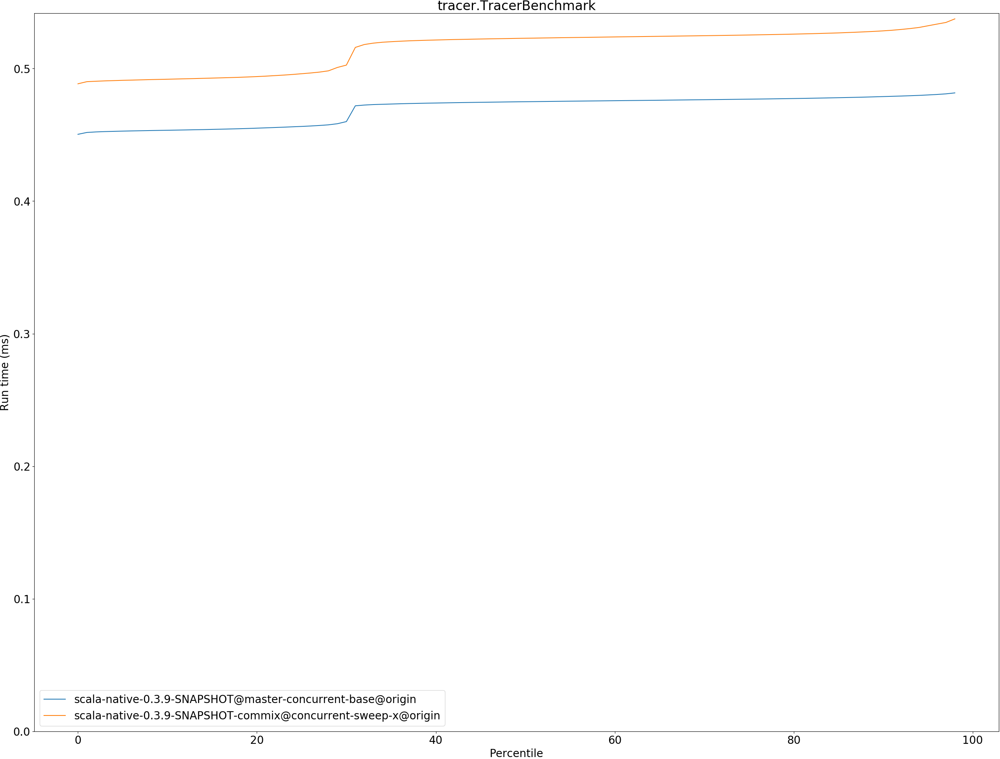

# Summary
## Benchmark run time (ms) at 50 percentile 

|name | scala-native-0.3.9-SNAPSHOT@master-concurrent-base@origin | scala-native-0.3.9-SNAPSHOT-commix@concurrent-sweep-x@origin | |
| -- | -- | -- | -- |
|[bounce.BounceBenchmark](#bouncebouncebenchmark)|0.0412|0.0383|__-7.18%__|
|[brainfuck.BrainfuckBenchmark](#brainfuckbrainfuckbenchmark)|2.3769|2.5552|+7.50%|
|[cd.CDBenchmark](#cdcdbenchmark)|17.0257|17.6193|+3.49%|
|[deltablue.DeltaBlueBenchmark](#deltabluedeltabluebenchmark)|0.1382|0.1403|+1.52%|
|[gcbench.GCBenchBenchmark](#gcbenchgcbenchbenchmark)|71.5424|59.5441|__-16.77%__|
|[json.JsonBenchmark](#jsonjsonbenchmark)|1.0340|1.0618|+2.69%|
|[kmeans.KmeansBenchmark](#kmeanskmeansbenchmark)|36.6283|36.6910|+0.17%|
|[mandelbrot.MandelbrotBenchmark](#mandelbrotmandelbrotbenchmark)|100.7056|100.7072|+0.00%|
|[nbody.NbodyBenchmark](#nbodynbodybenchmark)|25.5941|25.8005|+0.81%|
|[permute.PermuteBenchmark](#permutepermutebenchmark)|0.1438|0.1546|+7.50%|
|[queens.QueensBenchmark](#queensqueensbenchmark)|0.0486|0.0476|__-2.05%__|
|[richards.RichardsBenchmark](#richardsrichardsbenchmark)|0.0548|0.0550|+0.27%|
|[sudoku.SudokuBenchmark](#sudokusudokubenchmark)|1.6148|1.6130|__-0.11%__|
|[tracer.TracerBenchmark](#tracertracerbenchmark)|0.4750|0.5229|+10.08%|
| __Geometrical mean:__|| |+0.35%|
## Benchmark run time (ms) at 90 percentile 

|name | scala-native-0.3.9-SNAPSHOT@master-concurrent-base@origin | scala-native-0.3.9-SNAPSHOT-commix@concurrent-sweep-x@origin | |
| -- | -- | -- | -- |
|[bounce.BounceBenchmark](#bouncebouncebenchmark)|0.0441|0.0386|__-12.49%__|
|[brainfuck.BrainfuckBenchmark](#brainfuckbrainfuckbenchmark)|2.4827|2.6256|+5.75%|
|[cd.CDBenchmark](#cdcdbenchmark)|17.1497|17.7378|+3.43%|
|[deltablue.DeltaBlueBenchmark](#deltabluedeltabluebenchmark)|0.1587|0.1542|__-2.82%__|
|[gcbench.GCBenchBenchmark](#gcbenchgcbenchbenchmark)|74.3233|61.2913|__-17.53%__|
|[json.JsonBenchmark](#jsonjsonbenchmark)|1.0832|1.1877|+9.65%|
|[kmeans.KmeansBenchmark](#kmeanskmeansbenchmark)|38.4228|38.5762|+0.40%|
|[mandelbrot.MandelbrotBenchmark](#mandelbrotmandelbrotbenchmark)|100.7808|100.7936|+0.01%|
|[nbody.NbodyBenchmark](#nbodynbodybenchmark)|25.9036|26.1570|+0.98%|
|[permute.PermuteBenchmark](#permutepermutebenchmark)|0.1469|0.1650|+12.30%|
|[queens.QueensBenchmark](#queensqueensbenchmark)|0.0489|0.0485|__-0.88%__|
|[richards.RichardsBenchmark](#richardsrichardsbenchmark)|0.0570|0.0588|+3.18%|
|[sudoku.SudokuBenchmark](#sudokusudokubenchmark)|1.6875|1.8121|+7.38%|
|[tracer.TracerBenchmark](#tracertracerbenchmark)|0.4789|0.5284|+10.36%|
| __Geometrical mean:__|| |+1.07%|
## Benchmark run time (ms) at 99 percentile 

|name | scala-native-0.3.9-SNAPSHOT@master-concurrent-base@origin | scala-native-0.3.9-SNAPSHOT-commix@concurrent-sweep-x@origin | |
| -- | -- | -- | -- |
|[bounce.BounceBenchmark](#bouncebouncebenchmark)|0.0445|0.0415|__-6.82%__|
|[brainfuck.BrainfuckBenchmark](#brainfuckbrainfuckbenchmark)|2.5408|2.6946|+6.06%|
|[cd.CDBenchmark](#cdcdbenchmark)|19.1031|20.1733|+5.60%|
|[deltablue.DeltaBlueBenchmark](#deltabluedeltabluebenchmark)|0.1989|0.2086|+4.85%|
|[gcbench.GCBenchBenchmark](#gcbenchgcbenchbenchmark)|76.8841|62.6144|__-18.56%__|
|[json.JsonBenchmark](#jsonjsonbenchmark)|1.0881|1.2301|+13.04%|
|[kmeans.KmeansBenchmark](#kmeanskmeansbenchmark)|40.9655|39.5960|__-3.34%__|
|[mandelbrot.MandelbrotBenchmark](#mandelbrotmandelbrotbenchmark)|102.3627|101.0630|__-1.27%__|
|[nbody.NbodyBenchmark](#nbodynbodybenchmark)|27.5296|27.1543|__-1.36%__|
|[permute.PermuteBenchmark](#permutepermutebenchmark)|0.1648|0.2092|+26.97%|
|[queens.QueensBenchmark](#queensqueensbenchmark)|0.0512|0.0532|+3.81%|
|[richards.RichardsBenchmark](#richardsrichardsbenchmark)|0.0625|0.0680|+8.87%|
|[sudoku.SudokuBenchmark](#sudokusudokubenchmark)|1.7857|1.8900|+5.85%|
|[tracer.TracerBenchmark](#tracertracerbenchmark)|0.4835|0.6255|+29.38%|
| __Geometrical mean:__|| |+4.54%|
## Benchmark total run time (ms) 

|name | scala-native-0.3.9-SNAPSHOT@master-concurrent-base@origin | scala-native-0.3.9-SNAPSHOT-commix@concurrent-sweep-x@origin | |
| -- | -- | -- | -- |
|[bounce.BounceBenchmark](#bouncebouncebenchmark)|824.5545|769.3479|__-6.70%__|
|[brainfuck.BrainfuckBenchmark](#brainfuckbrainfuckbenchmark)|47543.4776|50392.7040|+5.99%|
|[cd.CDBenchmark](#cdcdbenchmark)|341662.7014|353450.9628|+3.45%|
|[deltablue.DeltaBlueBenchmark](#deltabluedeltabluebenchmark)|2888.5587|2916.0808|+0.95%|
|[gcbench.GCBenchBenchmark](#gcbenchgcbenchbenchmark)|1409214.8311|1194656.7698|__-15.23%__|
|[json.JsonBenchmark](#jsonjsonbenchmark)|21053.7293|21766.5232|+3.39%|
|[kmeans.KmeansBenchmark](#kmeanskmeansbenchmark)|736730.4543|744180.1280|+1.01%|
|[mandelbrot.MandelbrotBenchmark](#mandelbrotmandelbrotbenchmark)|2015802.6077|1971194.6012|__-2.21%__|
|[nbody.NbodyBenchmark](#nbodynbodybenchmark)|505068.3410|513766.4219|+1.72%|
|[permute.PermuteBenchmark](#permutepermutebenchmark)|2900.4835|3083.1518|+6.30%|
|[queens.QueensBenchmark](#queensqueensbenchmark)|968.5119|961.7134|__-0.70%__|
|[richards.RichardsBenchmark](#richardsrichardsbenchmark)|1092.9586|1117.6358|+2.26%|
|[sudoku.SudokuBenchmark](#sudokusudokubenchmark)|32525.8770|32707.9555|+0.56%|
|[tracer.TracerBenchmark](#tracertracerbenchmark)|9397.0352|10334.8381|+9.98%|
| __Geometrical mean:__|| |+0.59%|
# Individual benchmarks
## bounce.BounceBenchmark

## brainfuck.BrainfuckBenchmark

## cd.CDBenchmark

## deltablue.DeltaBlueBenchmark

## gcbench.GCBenchBenchmark

## json.JsonBenchmark

## kmeans.KmeansBenchmark

## mandelbrot.MandelbrotBenchmark

## nbody.NbodyBenchmark

## permute.PermuteBenchmark

## queens.QueensBenchmark

## richards.RichardsBenchmark

## sudoku.SudokuBenchmark

## tracer.TracerBenchmark

