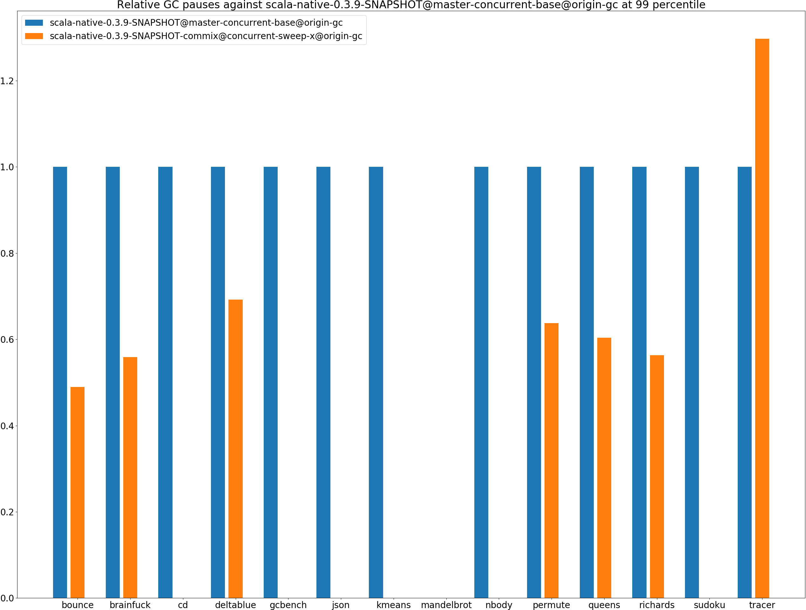
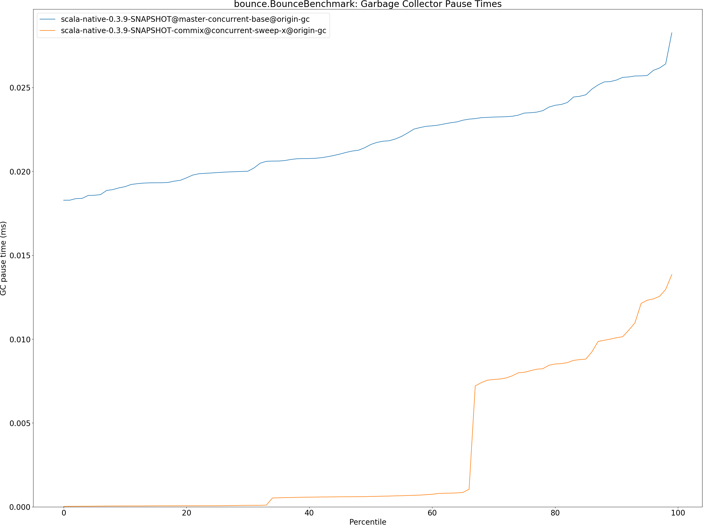
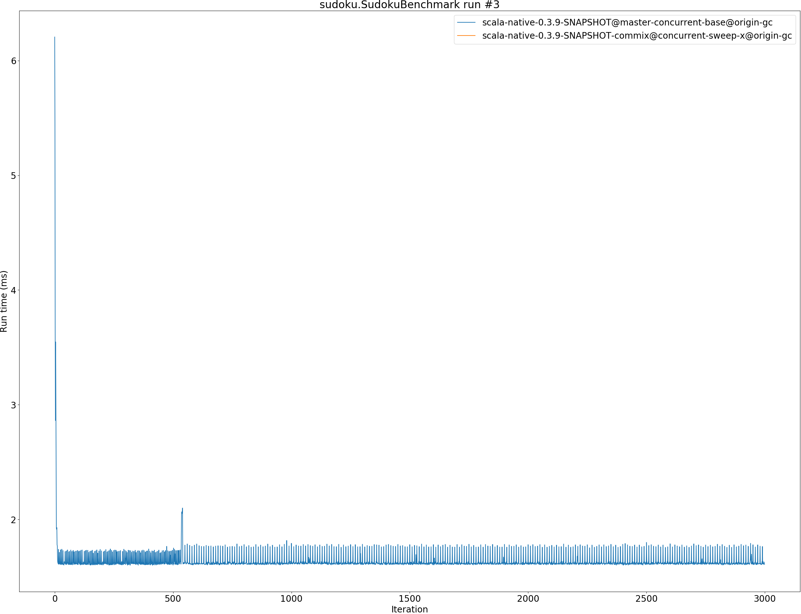
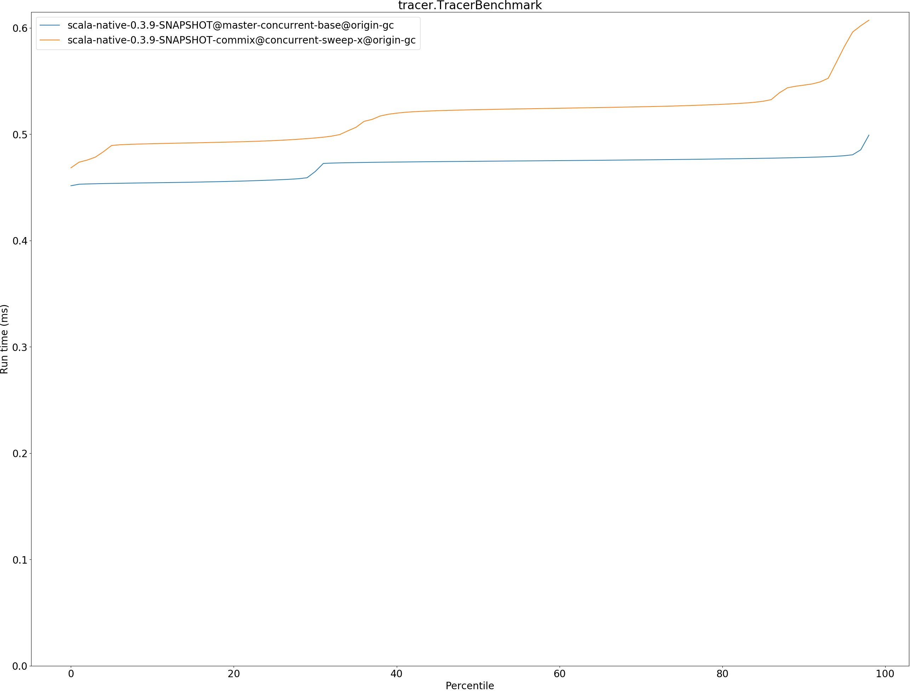
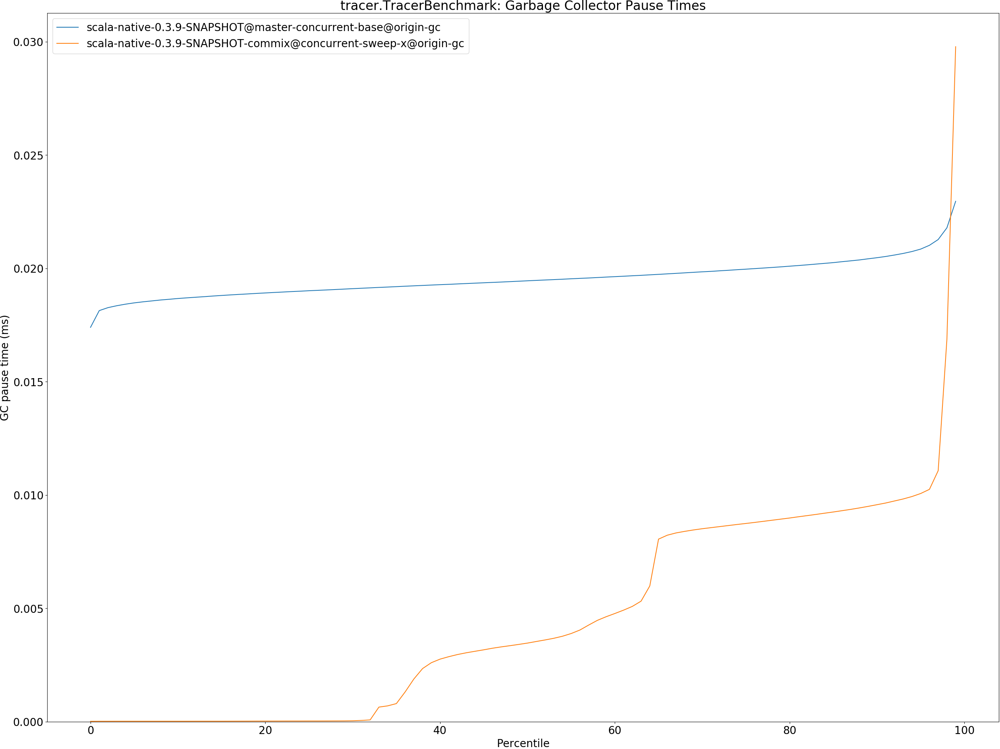
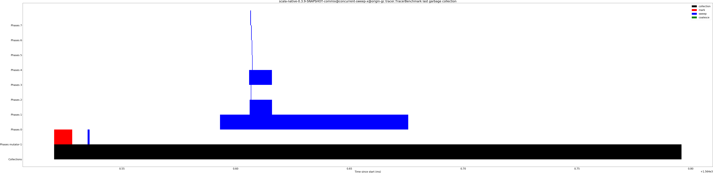

# Summary
## Benchmark run time (ms) at 50 percentile 

|name | scala-native-0.3.9-SNAPSHOT@master-concurrent-base@origin-gc | scala-native-0.3.9-SNAPSHOT-commix@concurrent-sweep-x@origin-gc | |
| -- | -- | -- | -- |
|[bounce.BounceBenchmark](#bouncebouncebenchmark)|0.0402|0.0368|__-8.48%__|
|[brainfuck.BrainfuckBenchmark](#brainfuckbrainfuckbenchmark)|2.3665|2.5676|+8.50%|
|[cd.CDBenchmark](#cdcdbenchmark)|16.7509|0.0000|__-100.00%__|
|[deltablue.DeltaBlueBenchmark](#deltabluedeltabluebenchmark)|0.1331|0.1398|+5.02%|
|[gcbench.GCBenchBenchmark](#gcbenchgcbenchbenchmark)|71.7975|0.0000|__-100.00%__|
|[json.JsonBenchmark](#jsonjsonbenchmark)|0.9828|0.0000|__-100.00%__|
|[kmeans.KmeansBenchmark](#kmeanskmeansbenchmark)|37.1132|0.0000|__-100.00%__|
|[mandelbrot.MandelbrotBenchmark](#mandelbrotmandelbrotbenchmark)|100.7291|0.0000|__-100.00%__|
|[nbody.NbodyBenchmark](#nbodynbodybenchmark)|25.6820|0.0000|__-100.00%__|
|[permute.PermuteBenchmark](#permutepermutebenchmark)|0.1440|0.1549|+7.54%|
|[queens.QueensBenchmark](#queensqueensbenchmark)|0.0478|0.0475|__-0.61%__|
|[richards.RichardsBenchmark](#richardsrichardsbenchmark)|0.0552|0.0550|__-0.41%__|
|[sudoku.SudokuBenchmark](#sudokusudokubenchmark)|1.6170|0.0000|__-100.00%__|
|[tracer.TracerBenchmark](#tracertracerbenchmark)|0.4745|0.5231|+10.23%|
| __Geometrical mean:__|| |+2.93%|
## Benchmark run time (ms) at 90 percentile 

|name | scala-native-0.3.9-SNAPSHOT@master-concurrent-base@origin-gc | scala-native-0.3.9-SNAPSHOT-commix@concurrent-sweep-x@origin-gc | |
| -- | -- | -- | -- |
|[bounce.BounceBenchmark](#bouncebouncebenchmark)|0.0471|0.0385|__-18.29%__|
|[brainfuck.BrainfuckBenchmark](#brainfuckbrainfuckbenchmark)|2.4800|2.6514|+6.91%|
|[cd.CDBenchmark](#cdcdbenchmark)|17.3845|0.0000|__-100.00%__|
|[deltablue.DeltaBlueBenchmark](#deltabluedeltabluebenchmark)|0.1490|0.1579|+5.96%|
|[gcbench.GCBenchBenchmark](#gcbenchgcbenchbenchmark)|74.9705|0.0000|__-100.00%__|
|[json.JsonBenchmark](#jsonjsonbenchmark)|0.9892|0.0000|__-100.00%__|
|[kmeans.KmeansBenchmark](#kmeanskmeansbenchmark)|38.8788|0.0000|__-100.00%__|
|[mandelbrot.MandelbrotBenchmark](#mandelbrotmandelbrotbenchmark)|100.8062|0.0000|__-100.00%__|
|[nbody.NbodyBenchmark](#nbodynbodybenchmark)|26.0527|0.0000|__-100.00%__|
|[permute.PermuteBenchmark](#permutepermutebenchmark)|0.1483|0.1875|+26.43%|
|[queens.QueensBenchmark](#queensqueensbenchmark)|0.0482|0.0480|__-0.43%__|
|[richards.RichardsBenchmark](#richardsrichardsbenchmark)|0.0568|0.0589|+3.78%|
|[sudoku.SudokuBenchmark](#sudokusudokubenchmark)|1.7692|0.0000|__-100.00%__|
|[tracer.TracerBenchmark](#tracertracerbenchmark)|0.4781|0.5462|+14.23%|
| __Geometrical mean:__|| |+4.72%|
## Benchmark run time (ms) at 99 percentile 

|name | scala-native-0.3.9-SNAPSHOT@master-concurrent-base@origin-gc | scala-native-0.3.9-SNAPSHOT-commix@concurrent-sweep-x@origin-gc | |
| -- | -- | -- | -- |
|[bounce.BounceBenchmark](#bouncebouncebenchmark)|0.0475|0.0414|__-12.91%__|
|[brainfuck.BrainfuckBenchmark](#brainfuckbrainfuckbenchmark)|3.0592|2.7391|__-10.46%__|
|[cd.CDBenchmark](#cdcdbenchmark)|22.5421|0.0000|__-100.00%__|
|[deltablue.DeltaBlueBenchmark](#deltabluedeltabluebenchmark)|0.1805|0.2150|+19.14%|
|[gcbench.GCBenchBenchmark](#gcbenchgcbenchbenchmark)|87.1983|0.0000|__-100.00%__|
|[json.JsonBenchmark](#jsonjsonbenchmark)|1.0034|0.0000|__-100.00%__|
|[kmeans.KmeansBenchmark](#kmeanskmeansbenchmark)|52.6890|0.0000|__-100.00%__|
|[mandelbrot.MandelbrotBenchmark](#mandelbrotmandelbrotbenchmark)|102.9398|0.0000|__-100.00%__|
|[nbody.NbodyBenchmark](#nbodynbodybenchmark)|27.1211|0.0000|__-100.00%__|
|[permute.PermuteBenchmark](#permutepermutebenchmark)|0.1656|0.2194|+32.51%|
|[queens.QueensBenchmark](#queensqueensbenchmark)|0.0584|0.0527|__-9.75%__|
|[richards.RichardsBenchmark](#richardsrichardsbenchmark)|0.0616|0.0675|+9.53%|
|[sudoku.SudokuBenchmark](#sudokusudokubenchmark)|1.9385|0.0000|__-100.00%__|
|[tracer.TracerBenchmark](#tracertracerbenchmark)|0.5700|0.6134|+7.63%|
| __Geometrical mean:__|| |+3.93%|
## Benchmark total run time (ms) 

|name | scala-native-0.3.9-SNAPSHOT@master-concurrent-base@origin-gc | scala-native-0.3.9-SNAPSHOT-commix@concurrent-sweep-x@origin-gc | |
| -- | -- | -- | -- |
|[bounce.BounceBenchmark](#bouncebouncebenchmark)|829.2763|750.8098|__-9.46%__|
|[brainfuck.BrainfuckBenchmark](#brainfuckbrainfuckbenchmark)|47844.5406|33302.5116|__-30.39%__|
|[cd.CDBenchmark](#cdcdbenchmark)|342914.6876|0.0000|__-100.00%__|
|[deltablue.DeltaBlueBenchmark](#deltabluedeltabluebenchmark)|2719.7515|2919.7013|+7.35%|
|[gcbench.GCBenchBenchmark](#gcbenchgcbenchbenchmark)|1443261.6366|0.0000|__-100.00%__|
|[json.JsonBenchmark](#jsonjsonbenchmark)|19206.2405|0.0000|__-100.00%__|
|[kmeans.KmeansBenchmark](#kmeanskmeansbenchmark)|754067.3902|0.0000|__-100.00%__|
|[mandelbrot.MandelbrotBenchmark](#mandelbrotmandelbrotbenchmark)|2016368.4292|0.0000|__-100.00%__|
|[nbody.NbodyBenchmark](#nbodynbodybenchmark)|515581.4996|0.0000|__-100.00%__|
|[permute.PermuteBenchmark](#permutepermutebenchmark)|2892.0101|3138.8631|+8.54%|
|[queens.QueensBenchmark](#queensqueensbenchmark)|967.0204|959.5496|__-0.77%__|
|[richards.RichardsBenchmark](#richardsrichardsbenchmark)|1113.4686|1121.7067|+0.74%|
|[sudoku.SudokuBenchmark](#sudokusudokubenchmark)|32831.3322|0.0000|__-100.00%__|
|[tracer.TracerBenchmark](#tracertracerbenchmark)|9426.2013|10385.7694|+10.18%|
| __Geometrical mean:__|| |__-2.99%__|
## Total GC time on Application thread (ms) 

|name |  | scala-native-0.3.9-SNAPSHOT@master-concurrent-base@origin-gc | scala-native-0.3.9-SNAPSHOT-commix@concurrent-sweep-x@origin-gc | |
| -- | -- | -- | -- | -- |
|[bounce.BounceBenchmark](#bouncebouncebenchmark)|mark|1.0781|0.9587|__-11.07%__|
||sweep|1.1174|0.0768|__-93.13%__|
||total|2.1954|1.0355|__-52.83%__|
|[brainfuck.BrainfuckBenchmark](#brainfuckbrainfuckbenchmark)|mark|1670.9067|1697.6442|+1.60%|
||sweep|811.1083|272.1790|__-66.44%__|
||total|2482.0150|1969.8231|__-20.64%__|
|[cd.CDBenchmark](#cdcdbenchmark)|mark|11239.9246|0.0000|__-100.00%__|
||sweep|12351.0699|0.0000|__-100.00%__|
||total|23590.9945|0.0000|__-100.00%__|
|[deltablue.DeltaBlueBenchmark](#deltabluedeltabluebenchmark)|mark|62.9212|56.2979|__-10.53%__|
||sweep|32.5613|6.4118|__-80.31%__|
||total|95.4825|62.7097|__-34.32%__|
|[gcbench.GCBenchBenchmark](#gcbenchgcbenchbenchmark)|mark|724917.9586|0.0000|__-100.00%__|
||sweep|94548.2655|0.0000|__-100.00%__|
||total|819466.2240|0.0000|__-100.00%__|
|[json.JsonBenchmark](#jsonjsonbenchmark)|mark|1019.9890|0.0000|__-100.00%__|
||sweep|416.9891|0.0000|__-100.00%__|
||total|1436.9782|0.0000|__-100.00%__|
|[kmeans.KmeansBenchmark](#kmeanskmeansbenchmark)|mark|43708.3975|0.0000|__-100.00%__|
||sweep|8302.2476|0.0000|__-100.00%__|
||total|52010.6451|0.0000|__-100.00%__|
|[mandelbrot.MandelbrotBenchmark](#mandelbrotmandelbrotbenchmark)|mark|0.0000|0.0000|N/A|
||sweep|0.0000|0.0000|N/A|
||total|0.0000|0.0000|N/A|
|[nbody.NbodyBenchmark](#nbodynbodybenchmark)|mark|635.4611|0.0000|__-100.00%__|
||sweep|1329.2192|0.0000|__-100.00%__|
||total|1964.6804|0.0000|__-100.00%__|
|[permute.PermuteBenchmark](#permutepermutebenchmark)|mark|31.8991|28.4694|__-10.75%__|
||sweep|46.4602|43.0271|__-7.39%__|
||total|78.3592|71.4965|__-8.76%__|
|[queens.QueensBenchmark](#queensqueensbenchmark)|mark|1.6571|1.6975|+2.44%|
||sweep|1.9254|0.1518|__-92.12%__|
||total|3.5825|1.8493|__-48.38%__|
|[richards.RichardsBenchmark](#richardsrichardsbenchmark)|mark|2.4036|2.5181|+4.76%|
||sweep|3.2549|0.2633|__-91.91%__|
||total|5.6585|2.7814|__-50.85%__|
|[sudoku.SudokuBenchmark](#sudokusudokubenchmark)|mark|543.5998|0.0000|__-100.00%__|
||sweep|334.8378|0.0000|__-100.00%__|
||total|878.4376|0.0000|__-100.00%__|
|[tracer.TracerBenchmark](#tracertracerbenchmark)|mark|346.5425|344.9661|__-0.45%__|
||sweep|469.9087|214.1925|__-54.42%__|
||total|816.4512|559.1586|__-31.51%__|
|__Geometrical mean:__|mark|| |__-3.65%__|
||sweep|| |__-80.13%__|
||total|| |__-37.09%__|
## GC pause time (ms) at 50 percentile 

|name | scala-native-0.3.9-SNAPSHOT@master-concurrent-base@origin-gc | scala-native-0.3.9-SNAPSHOT-commix@concurrent-sweep-x@origin-gc | |
| -- | -- | -- | -- |
|[bounce.BounceBenchmark](#bouncebouncebenchmark)|0.0216|0.0006|__-97.14%__|
|[brainfuck.BrainfuckBenchmark](#brainfuckbrainfuckbenchmark)|0.0888|0.0008|__-99.15%__|
|[cd.CDBenchmark](#cdcdbenchmark)|0.0948|0.0000|__-100.00%__|
|[deltablue.DeltaBlueBenchmark](#deltabluedeltabluebenchmark)|0.0356|0.0007|__-98.11%__|
|[gcbench.GCBenchBenchmark](#gcbenchgcbenchbenchmark)|1.2965|0.0000|__-100.00%__|
|[json.JsonBenchmark](#jsonjsonbenchmark)|0.0477|0.0000|__-100.00%__|
|[kmeans.KmeansBenchmark](#kmeanskmeansbenchmark)|1.4812|0.0000|__-100.00%__|
|[mandelbrot.MandelbrotBenchmark](#mandelbrotmandelbrotbenchmark)|0.0000|0.0000|N/A|
|[nbody.NbodyBenchmark](#nbodynbodybenchmark)|0.0166|0.0000|__-100.00%__|
|[permute.PermuteBenchmark](#permutepermutebenchmark)|0.0195|0.0007|__-96.64%__|
|[queens.QueensBenchmark](#queensqueensbenchmark)|0.0190|0.0006|__-96.59%__|
|[richards.RichardsBenchmark](#richardsrichardsbenchmark)|0.0178|0.0008|__-95.68%__|
|[sudoku.SudokuBenchmark](#sudokusudokubenchmark)|0.1296|0.0000|__-100.00%__|
|[tracer.TracerBenchmark](#tracertracerbenchmark)|0.0195|0.0035|__-82.18%__|
| __Geometrical mean:__|| |__-96.72%__|
## GC pause time (ms) at 90 percentile 

|name | scala-native-0.3.9-SNAPSHOT@master-concurrent-base@origin-gc | scala-native-0.3.9-SNAPSHOT-commix@concurrent-sweep-x@origin-gc | |
| -- | -- | -- | -- |
|[bounce.BounceBenchmark](#bouncebouncebenchmark)|0.0254|0.0101|__-60.38%__|
|[brainfuck.BrainfuckBenchmark](#brainfuckbrainfuckbenchmark)|0.1019|0.0386|__-62.17%__|
|[cd.CDBenchmark](#cdcdbenchmark)|0.1321|0.0000|__-100.00%__|
|[deltablue.DeltaBlueBenchmark](#deltabluedeltabluebenchmark)|0.0453|0.0261|__-42.50%__|
|[gcbench.GCBenchBenchmark](#gcbenchgcbenchbenchmark)|2.2283|0.0000|__-100.00%__|
|[json.JsonBenchmark](#jsonjsonbenchmark)|0.0489|0.0000|__-100.00%__|
|[kmeans.KmeansBenchmark](#kmeanskmeansbenchmark)|2.7180|0.0000|__-100.00%__|
|[mandelbrot.MandelbrotBenchmark](#mandelbrotmandelbrotbenchmark)|0.0000|0.0000|N/A|
|[nbody.NbodyBenchmark](#nbodynbodybenchmark)|0.0177|0.0000|__-100.00%__|
|[permute.PermuteBenchmark](#permutepermutebenchmark)|0.0205|0.0094|__-54.39%__|
|[queens.QueensBenchmark](#queensqueensbenchmark)|0.0243|0.0090|__-62.91%__|
|[richards.RichardsBenchmark](#richardsrichardsbenchmark)|0.0209|0.0080|__-61.81%__|
|[sudoku.SudokuBenchmark](#sudokusudokubenchmark)|0.1348|0.0000|__-100.00%__|
|[tracer.TracerBenchmark](#tracertracerbenchmark)|0.0205|0.0096|__-53.24%__|
| __Geometrical mean:__|| |__-57.26%__|
## GC pause time (ms) at 99 percentile 

|name | scala-native-0.3.9-SNAPSHOT@master-concurrent-base@origin-gc | scala-native-0.3.9-SNAPSHOT-commix@concurrent-sweep-x@origin-gc | |
| -- | -- | -- | -- |
|[bounce.BounceBenchmark](#bouncebouncebenchmark)|0.0283|0.0138|__-51.01%__|
|[brainfuck.BrainfuckBenchmark](#brainfuckbrainfuckbenchmark)|0.1283|0.0717|__-44.12%__|
|[cd.CDBenchmark](#cdcdbenchmark)|0.1636|0.0000|__-100.00%__|
|[deltablue.DeltaBlueBenchmark](#deltabluedeltabluebenchmark)|0.0568|0.0393|__-30.80%__|
|[gcbench.GCBenchBenchmark](#gcbenchgcbenchbenchmark)|3.9907|0.0000|__-100.00%__|
|[json.JsonBenchmark](#jsonjsonbenchmark)|0.0511|0.0000|__-100.00%__|
|[kmeans.KmeansBenchmark](#kmeanskmeansbenchmark)|3.2944|0.0000|__-100.00%__|
|[mandelbrot.MandelbrotBenchmark](#mandelbrotmandelbrotbenchmark)|0.0000|0.0000|N/A|
|[nbody.NbodyBenchmark](#nbodynbodybenchmark)|0.0183|0.0000|__-100.00%__|
|[permute.PermuteBenchmark](#permutepermutebenchmark)|0.0386|0.0246|__-36.20%__|
|[queens.QueensBenchmark](#queensqueensbenchmark)|0.0267|0.0161|__-39.62%__|
|[richards.RichardsBenchmark](#richardsrichardsbenchmark)|0.0321|0.0181|__-43.65%__|
|[sudoku.SudokuBenchmark](#sudokusudokubenchmark)|0.1471|0.0000|__-100.00%__|
|[tracer.TracerBenchmark](#tracertracerbenchmark)|0.0230|0.0298|+29.71%|
| __Geometrical mean:__|| |__-34.21%__|
# Individual benchmarks
## bounce.BounceBenchmark

## brainfuck.BrainfuckBenchmark

## cd.CDBenchmark

## deltablue.DeltaBlueBenchmark

## gcbench.GCBenchBenchmark

## json.JsonBenchmark

## kmeans.KmeansBenchmark

## mandelbrot.MandelbrotBenchmark

## nbody.NbodyBenchmark

## permute.PermuteBenchmark

## queens.QueensBenchmark

## richards.RichardsBenchmark

## sudoku.SudokuBenchmark

## tracer.TracerBenchmark

