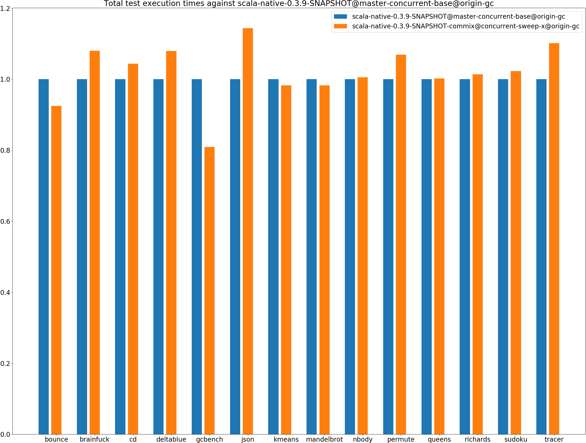
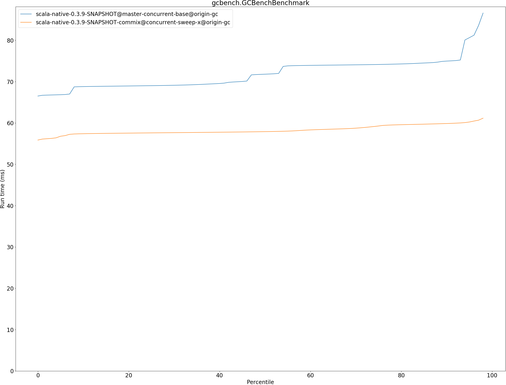
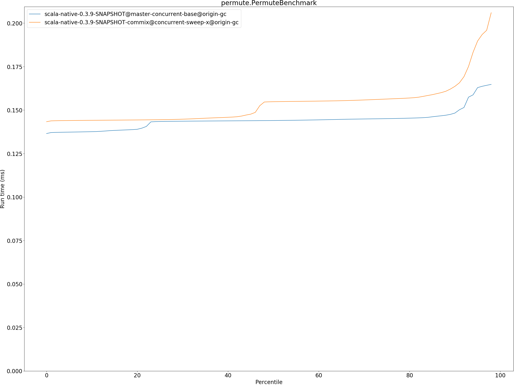
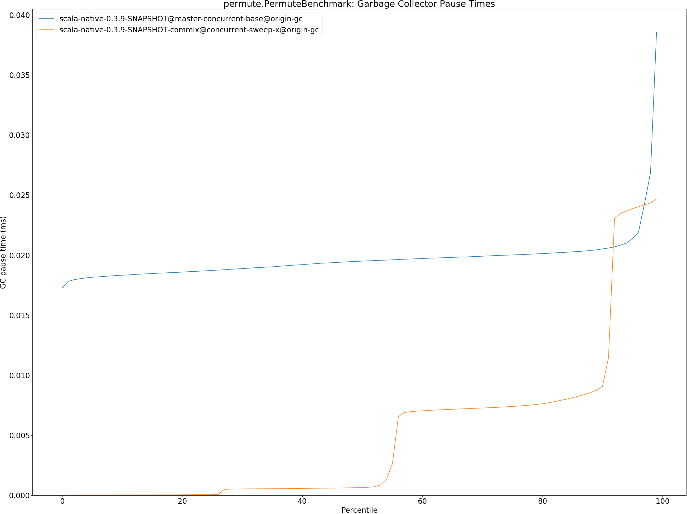

# Summary
## Benchmark run time (ms) at 50 percentile 

|name | scala-native-0.3.9-SNAPSHOT@master-concurrent-base@origin-gc | scala-native-0.3.9-SNAPSHOT-commix@concurrent-sweep-x@origin-gc | |
| -- | -- | -- | -- |
|[bounce.BounceBenchmark](#bouncebouncebenchmark)|0.0402|0.0382|__-4.80%__|
|[brainfuck.BrainfuckBenchmark](#brainfuckbrainfuckbenchmark)|2.3665|2.5791|+8.98%|
|[cd.CDBenchmark](#cdcdbenchmark)|16.7509|17.6924|+5.62%|
|[deltablue.DeltaBlueBenchmark](#deltabluedeltabluebenchmark)|0.1331|0.1404|+5.50%|
|[gcbench.GCBenchBenchmark](#gcbenchgcbenchbenchmark)|71.7975|57.8992|__-19.36%__|
|[json.JsonBenchmark](#jsonjsonbenchmark)|0.9828|1.0673|+8.60%|
|[kmeans.KmeansBenchmark](#kmeanskmeansbenchmark)|37.1132|36.5191|__-1.60%__|
|[mandelbrot.MandelbrotBenchmark](#mandelbrotmandelbrotbenchmark)|100.7291|100.7371|+0.01%|
|[nbody.NbodyBenchmark](#nbodynbodybenchmark)|25.6820|25.8040|+0.47%|
|[permute.PermuteBenchmark](#permutepermutebenchmark)|0.1440|0.1548|+7.51%|
|[queens.QueensBenchmark](#queensqueensbenchmark)|0.0478|0.0476|__-0.53%__|
|[richards.RichardsBenchmark](#richardsrichardsbenchmark)|0.0552|0.0551|__-0.33%__|
|[sudoku.SudokuBenchmark](#sudokusudokubenchmark)|1.6170|1.6102|__-0.42%__|
|[tracer.TracerBenchmark](#tracertracerbenchmark)|0.4745|0.5240|+10.43%|
| __Geometrical mean:__|| |+1.15%|
## Benchmark run time (ms) at 90 percentile 

|name | scala-native-0.3.9-SNAPSHOT@master-concurrent-base@origin-gc | scala-native-0.3.9-SNAPSHOT-commix@concurrent-sweep-x@origin-gc | |
| -- | -- | -- | -- |
|[bounce.BounceBenchmark](#bouncebouncebenchmark)|0.0471|0.0385|__-18.33%__|
|[brainfuck.BrainfuckBenchmark](#brainfuckbrainfuckbenchmark)|2.4800|2.6695|+7.64%|
|[cd.CDBenchmark](#cdcdbenchmark)|17.3845|18.2869|+5.19%|
|[deltablue.DeltaBlueBenchmark](#deltabluedeltabluebenchmark)|0.1490|0.1541|+3.43%|
|[gcbench.GCBenchBenchmark](#gcbenchgcbenchbenchmark)|74.9705|59.8625|__-20.15%__|
|[json.JsonBenchmark](#jsonjsonbenchmark)|0.9892|1.2001|+21.32%|
|[kmeans.KmeansBenchmark](#kmeanskmeansbenchmark)|38.8788|38.3950|__-1.24%__|
|[mandelbrot.MandelbrotBenchmark](#mandelbrotmandelbrotbenchmark)|100.8062|100.8154|+0.01%|
|[nbody.NbodyBenchmark](#nbodynbodybenchmark)|26.0527|26.1922|+0.54%|
|[permute.PermuteBenchmark](#permutepermutebenchmark)|0.1483|0.1637|+10.36%|
|[queens.QueensBenchmark](#queensqueensbenchmark)|0.0482|0.0512|+6.19%|
|[richards.RichardsBenchmark](#richardsrichardsbenchmark)|0.0568|0.0591|+4.21%|
|[sudoku.SudokuBenchmark](#sudokusudokubenchmark)|1.7692|2.0560|+16.21%|
|[tracer.TracerBenchmark](#tracertracerbenchmark)|0.4781|0.5448|+13.93%|
| __Geometrical mean:__|| |+2.88%|
## Benchmark run time (ms) at 99 percentile 

|name | scala-native-0.3.9-SNAPSHOT@master-concurrent-base@origin-gc | scala-native-0.3.9-SNAPSHOT-commix@concurrent-sweep-x@origin-gc | |
| -- | -- | -- | -- |
|[bounce.BounceBenchmark](#bouncebouncebenchmark)|0.0475|0.0413|__-12.97%__|
|[brainfuck.BrainfuckBenchmark](#brainfuckbrainfuckbenchmark)|3.0592|2.7775|__-9.21%__|
|[cd.CDBenchmark](#cdcdbenchmark)|22.5421|22.9865|+1.97%|
|[deltablue.DeltaBlueBenchmark](#deltabluedeltabluebenchmark)|0.1805|0.2142|+18.72%|
|[gcbench.GCBenchBenchmark](#gcbenchgcbenchbenchmark)|87.1983|66.5085|__-23.73%__|
|[json.JsonBenchmark](#jsonjsonbenchmark)|1.0034|1.2943|+28.99%|
|[kmeans.KmeansBenchmark](#kmeanskmeansbenchmark)|52.6890|39.4016|__-25.22%__|
|[mandelbrot.MandelbrotBenchmark](#mandelbrotmandelbrotbenchmark)|102.9398|101.1270|__-1.76%__|
|[nbody.NbodyBenchmark](#nbodynbodybenchmark)|27.1211|27.7267|+2.23%|
|[permute.PermuteBenchmark](#permutepermutebenchmark)|0.1656|0.2120|+28.05%|
|[queens.QueensBenchmark](#queensqueensbenchmark)|0.0584|0.0586|+0.36%|
|[richards.RichardsBenchmark](#richardsrichardsbenchmark)|0.0616|0.0691|+12.20%|
|[sudoku.SudokuBenchmark](#sudokusudokubenchmark)|1.9385|2.3717|+22.35%|
|[tracer.TracerBenchmark](#tracertracerbenchmark)|0.5700|0.6127|+7.50%|
| __Geometrical mean:__|| |+2.12%|
## Benchmark total run time (ms) 

|name | scala-native-0.3.9-SNAPSHOT@master-concurrent-base@origin-gc | scala-native-0.3.9-SNAPSHOT-commix@concurrent-sweep-x@origin-gc | |
| -- | -- | -- | -- |
|[bounce.BounceBenchmark](#bouncebouncebenchmark)|829.2763|766.7397|__-7.54%__|
|[brainfuck.BrainfuckBenchmark](#brainfuckbrainfuckbenchmark)|47844.5406|51673.5103|+8.00%|
|[cd.CDBenchmark](#cdcdbenchmark)|342914.6876|357864.7470|+4.36%|
|[deltablue.DeltaBlueBenchmark](#deltabluedeltabluebenchmark)|2719.7515|2935.2028|+7.92%|
|[gcbench.GCBenchBenchmark](#gcbenchgcbenchbenchmark)|1443261.6366|1168253.5061|__-19.05%__|
|[json.JsonBenchmark](#jsonjsonbenchmark)|19206.2405|21964.0325|+14.36%|
|[kmeans.KmeansBenchmark](#kmeanskmeansbenchmark)|754067.3902|740790.5970|__-1.76%__|
|[mandelbrot.MandelbrotBenchmark](#mandelbrotmandelbrotbenchmark)|2016368.4292|1980856.8911|__-1.76%__|
|[nbody.NbodyBenchmark](#nbodynbodybenchmark)|515581.4996|518189.4087|+0.51%|
|[permute.PermuteBenchmark](#permutepermutebenchmark)|2892.0101|3091.0441|+6.88%|
|[queens.QueensBenchmark](#queensqueensbenchmark)|967.0204|969.0515|+0.21%|
|[richards.RichardsBenchmark](#richardsrichardsbenchmark)|1113.4686|1128.6736|+1.37%|
|[sudoku.SudokuBenchmark](#sudokusudokubenchmark)|32831.3322|33573.6594|+2.26%|
|[tracer.TracerBenchmark](#tracertracerbenchmark)|9426.2013|10380.9983|+10.13%|
| __Geometrical mean:__|| |+1.52%|
## Total GC time on Application thread (ms) 

|name |  | scala-native-0.3.9-SNAPSHOT@master-concurrent-base@origin-gc | scala-native-0.3.9-SNAPSHOT-commix@concurrent-sweep-x@origin-gc | |
| -- | -- | -- | -- | -- |
|[bounce.BounceBenchmark](#bouncebouncebenchmark)|mark|1.0781|0.9728|__-9.77%__|
||sweep|1.1174|0.0713|__-93.62%__|
||total|2.1954|1.0441|__-52.44%__|
|[brainfuck.BrainfuckBenchmark](#brainfuckbrainfuckbenchmark)|mark|1670.9067|2496.3743|+49.40%|
||sweep|811.1083|424.2597|__-47.69%__|
||total|2482.0150|2920.6341|+17.67%|
|[cd.CDBenchmark](#cdcdbenchmark)|mark|11239.9246|11004.5318|__-2.09%__|
||sweep|12351.0699|650.7517|__-94.73%__|
||total|23590.9945|11655.2835|__-50.59%__|
|[deltablue.DeltaBlueBenchmark](#deltabluedeltabluebenchmark)|mark|62.9212|59.8075|__-4.95%__|
||sweep|32.5613|7.2465|__-77.74%__|
||total|95.4825|67.0540|__-29.77%__|
|[gcbench.GCBenchBenchmark](#gcbenchgcbenchbenchmark)|mark|724917.9586|80077.0398|__-88.95%__|
||sweep|94548.2655|3486.5817|__-96.31%__|
||total|819466.2240|83563.6216|__-89.80%__|
|[json.JsonBenchmark](#jsonjsonbenchmark)|mark|1019.9890|1033.7805|+1.35%|
||sweep|416.9891|575.9733|+38.13%|
||total|1436.9782|1609.7538|+12.02%|
|[kmeans.KmeansBenchmark](#kmeanskmeansbenchmark)|mark|43708.3975|43200.4237|__-1.16%__|
||sweep|8302.2476|754.9927|__-90.91%__|
||total|52010.6451|43955.4164|__-15.49%__|
|[mandelbrot.MandelbrotBenchmark](#mandelbrotmandelbrotbenchmark)|mark|0.0000|0.0000|N/A|
||sweep|0.0000|0.0000|N/A|
||total|0.0000|0.0000|N/A|
|[nbody.NbodyBenchmark](#nbodynbodybenchmark)|mark|635.4611|627.4168|__-1.27%__|
||sweep|1329.2192|66.2839|__-95.01%__|
||total|1964.6804|693.7008|__-64.69%__|
|[permute.PermuteBenchmark](#permutepermutebenchmark)|mark|31.8991|29.7774|__-6.65%__|
||sweep|46.4602|43.7224|__-5.89%__|
||total|78.3592|73.4997|__-6.20%__|
|[queens.QueensBenchmark](#queensqueensbenchmark)|mark|1.6571|1.7244|+4.06%|
||sweep|1.9254|0.2134|__-88.92%__|
||total|3.5825|1.9378|__-45.91%__|
|[richards.RichardsBenchmark](#richardsrichardsbenchmark)|mark|2.4036|2.5430|+5.80%|
||sweep|3.2549|0.1897|__-94.17%__|
||total|5.6585|2.7327|__-51.71%__|
|[sudoku.SudokuBenchmark](#sudokusudokubenchmark)|mark|543.5998|716.3265|+31.77%|
||sweep|334.8378|455.8213|+36.13%|
||total|878.4376|1172.1478|+33.44%|
|[tracer.TracerBenchmark](#tracertracerbenchmark)|mark|346.5425|349.4677|+0.84%|
||sweep|469.9087|243.4901|__-48.18%__|
||total|816.4512|592.9578|__-27.37%__|
|__Geometrical mean:__|mark|| |__-12.09%__|
||sweep|| |__-81.12%__|
||total|| |__-39.14%__|
## GC pause time (ms) at 50 percentile 

|name | scala-native-0.3.9-SNAPSHOT@master-concurrent-base@origin-gc | scala-native-0.3.9-SNAPSHOT-commix@concurrent-sweep-x@origin-gc | |
| -- | -- | -- | -- |
|[bounce.BounceBenchmark](#bouncebouncebenchmark)|0.0216|0.0006|__-97.06%__|
|[brainfuck.BrainfuckBenchmark](#brainfuckbrainfuckbenchmark)|0.0888|0.0007|__-99.17%__|
|[cd.CDBenchmark](#cdcdbenchmark)|0.0948|0.0008|__-99.11%__|
|[deltablue.DeltaBlueBenchmark](#deltabluedeltabluebenchmark)|0.0356|0.0007|__-98.16%__|
|[gcbench.GCBenchBenchmark](#gcbenchgcbenchbenchmark)|1.2965|0.0080|__-99.38%__|
|[json.JsonBenchmark](#jsonjsonbenchmark)|0.0477|0.0007|__-98.50%__|
|[kmeans.KmeansBenchmark](#kmeanskmeansbenchmark)|1.4812|0.0017|__-99.89%__|
|[mandelbrot.MandelbrotBenchmark](#mandelbrotmandelbrotbenchmark)|0.0000|0.0000|N/A|
|[nbody.NbodyBenchmark](#nbodynbodybenchmark)|0.0166|0.0005|__-96.98%__|
|[permute.PermuteBenchmark](#permutepermutebenchmark)|0.0195|0.0006|__-96.70%__|
|[queens.QueensBenchmark](#queensqueensbenchmark)|0.0190|0.0007|__-96.34%__|
|[richards.RichardsBenchmark](#richardsrichardsbenchmark)|0.0178|0.0006|__-96.71%__|
|[sudoku.SudokuBenchmark](#sudokusudokubenchmark)|0.1296|0.0083|__-93.57%__|
|[tracer.TracerBenchmark](#tracertracerbenchmark)|0.0195|0.0031|__-83.88%__|
| __Geometrical mean:__|| |__-98.07%__|
## GC pause time (ms) at 90 percentile 

|name | scala-native-0.3.9-SNAPSHOT@master-concurrent-base@origin-gc | scala-native-0.3.9-SNAPSHOT-commix@concurrent-sweep-x@origin-gc | |
| -- | -- | -- | -- |
|[bounce.BounceBenchmark](#bouncebouncebenchmark)|0.0254|0.0102|__-59.78%__|
|[brainfuck.BrainfuckBenchmark](#brainfuckbrainfuckbenchmark)|0.1019|0.0376|__-63.11%__|
|[cd.CDBenchmark](#cdcdbenchmark)|0.1321|0.0352|__-73.34%__|
|[deltablue.DeltaBlueBenchmark](#deltabluedeltabluebenchmark)|0.0453|0.0259|__-42.89%__|
|[gcbench.GCBenchBenchmark](#gcbenchgcbenchbenchmark)|2.2283|1.0845|__-51.33%__|
|[json.JsonBenchmark](#jsonjsonbenchmark)|0.0489|0.0522|+6.80%|
|[kmeans.KmeansBenchmark](#kmeanskmeansbenchmark)|2.7180|1.7594|__-35.27%__|
|[mandelbrot.MandelbrotBenchmark](#mandelbrotmandelbrotbenchmark)|0.0000|0.0000|N/A|
|[nbody.NbodyBenchmark](#nbodynbodybenchmark)|0.0177|0.0054|__-69.34%__|
|[permute.PermuteBenchmark](#permutepermutebenchmark)|0.0205|0.0091|__-55.82%__|
|[queens.QueensBenchmark](#queensqueensbenchmark)|0.0243|0.0095|__-60.64%__|
|[richards.RichardsBenchmark](#richardsrichardsbenchmark)|0.0209|0.0081|__-61.39%__|
|[sudoku.SudokuBenchmark](#sudokusudokubenchmark)|0.1348|0.0728|__-46.03%__|
|[tracer.TracerBenchmark](#tracertracerbenchmark)|0.0205|0.0099|__-51.44%__|
| __Geometrical mean:__|| |__-54.02%__|
## GC pause time (ms) at 99 percentile 

|name | scala-native-0.3.9-SNAPSHOT@master-concurrent-base@origin-gc | scala-native-0.3.9-SNAPSHOT-commix@concurrent-sweep-x@origin-gc | |
| -- | -- | -- | -- |
|[bounce.BounceBenchmark](#bouncebouncebenchmark)|0.0283|0.0138|__-51.13%__|
|[brainfuck.BrainfuckBenchmark](#brainfuckbrainfuckbenchmark)|0.1283|0.0681|__-46.94%__|
|[cd.CDBenchmark](#cdcdbenchmark)|0.1636|0.0701|__-57.13%__|
|[deltablue.DeltaBlueBenchmark](#deltabluedeltabluebenchmark)|0.0568|0.0372|__-34.55%__|
|[gcbench.GCBenchBenchmark](#gcbenchgcbenchbenchmark)|3.9907|1.8604|__-53.38%__|
|[json.JsonBenchmark](#jsonjsonbenchmark)|0.0511|0.0746|+45.96%|
|[kmeans.KmeansBenchmark](#kmeanskmeansbenchmark)|3.2944|2.7857|__-15.44%__|
|[mandelbrot.MandelbrotBenchmark](#mandelbrotmandelbrotbenchmark)|0.0000|0.0000|N/A|
|[nbody.NbodyBenchmark](#nbodynbodybenchmark)|0.0183|0.0057|__-68.53%__|
|[permute.PermuteBenchmark](#permutepermutebenchmark)|0.0386|0.0247|__-36.04%__|
|[queens.QueensBenchmark](#queensqueensbenchmark)|0.0267|0.0167|__-37.45%__|
|[richards.RichardsBenchmark](#richardsrichardsbenchmark)|0.0321|0.0180|__-43.91%__|
|[sudoku.SudokuBenchmark](#sudokusudokubenchmark)|0.1471|0.0854|__-41.96%__|
|[tracer.TracerBenchmark](#tracertracerbenchmark)|0.0230|0.0368|+60.30%|
| __Geometrical mean:__|| |__-36.46%__|
# Individual benchmarks
## bounce.BounceBenchmark

## brainfuck.BrainfuckBenchmark

## cd.CDBenchmark

## deltablue.DeltaBlueBenchmark

## gcbench.GCBenchBenchmark

## json.JsonBenchmark

## kmeans.KmeansBenchmark

## mandelbrot.MandelbrotBenchmark

## nbody.NbodyBenchmark

## permute.PermuteBenchmark

## queens.QueensBenchmark

## richards.RichardsBenchmark

## sudoku.SudokuBenchmark

## tracer.TracerBenchmark

