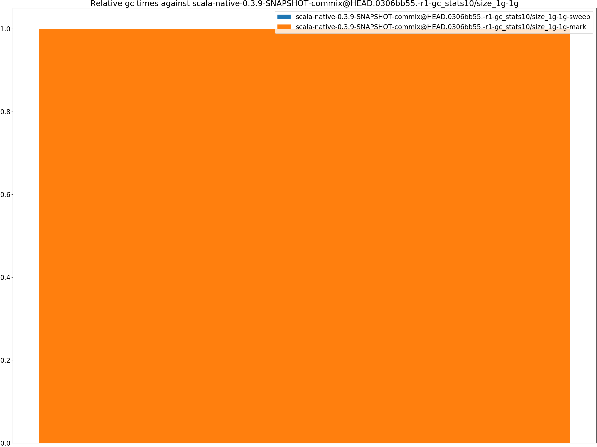
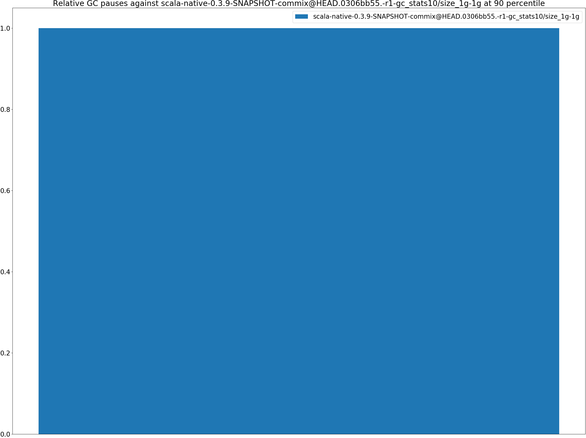
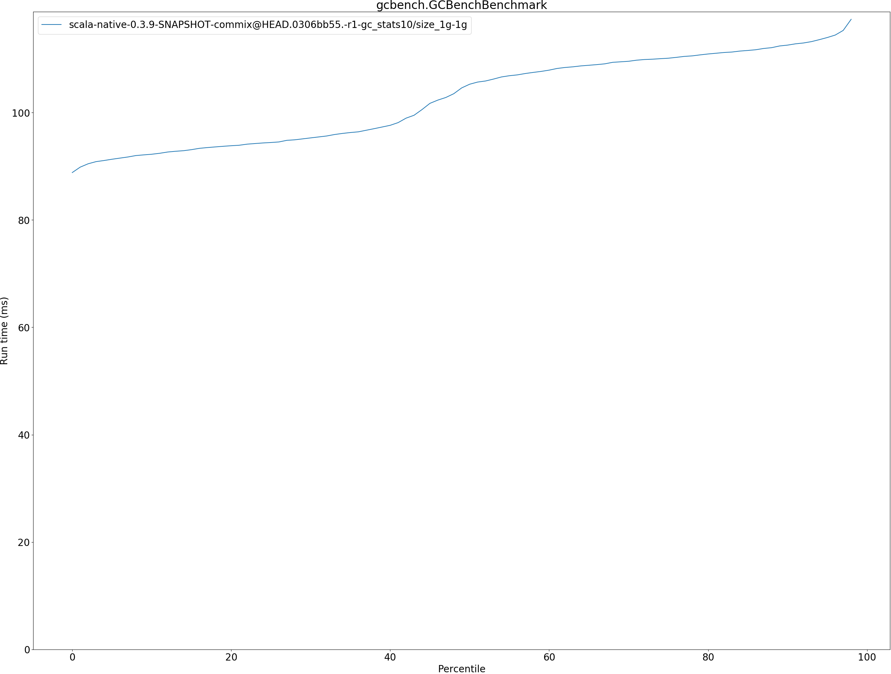
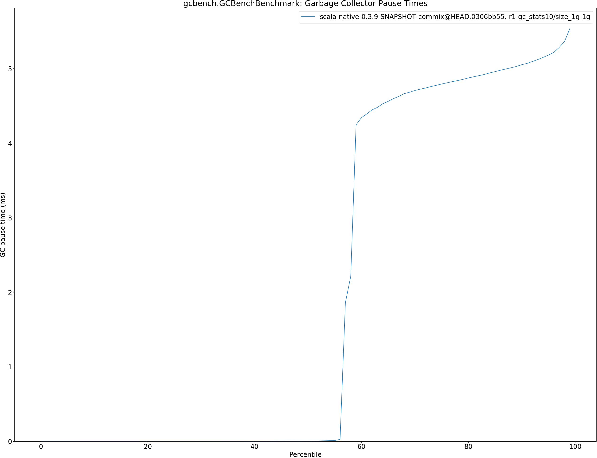
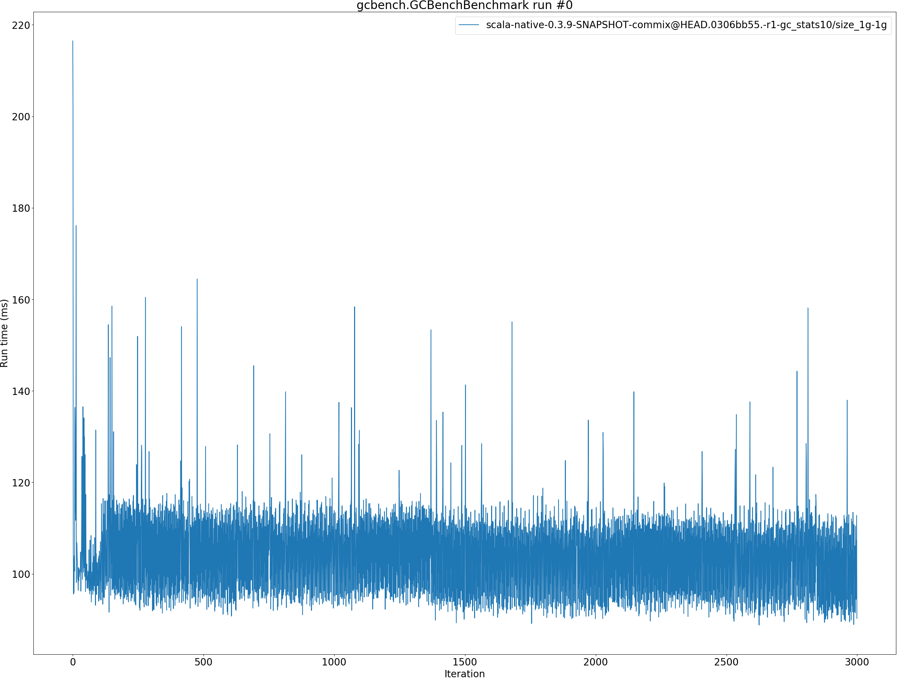
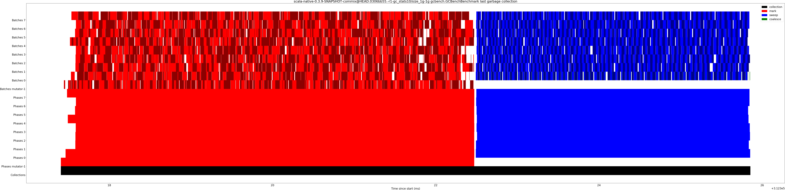
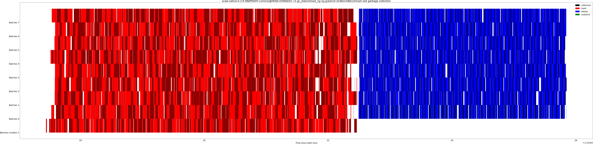

# Summary
## Benchmark run time (ms) at 50 percentile 

|name | scala-native-0.3.9-SNAPSHOT-commix@HEAD.0306bb55.-r1-gc_stats10/size_1g-1g|
| -- | -- |
|[gcbench.GCBenchBenchmark](#gcbenchgcbenchbenchmark)|105.2828|
| __Geometrical mean:__||
## Benchmark run time (ms) at 90 percentile 

|name | scala-native-0.3.9-SNAPSHOT-commix@HEAD.0306bb55.-r1-gc_stats10/size_1g-1g|
| -- | -- |
|[gcbench.GCBenchBenchmark](#gcbenchgcbenchbenchmark)|112.5680|
| __Geometrical mean:__||
## Benchmark run time (ms) at 99 percentile 

|name | scala-native-0.3.9-SNAPSHOT-commix@HEAD.0306bb55.-r1-gc_stats10/size_1g-1g|
| -- | -- |
|[gcbench.GCBenchBenchmark](#gcbenchgcbenchbenchmark)|126.7575|
| __Geometrical mean:__||
## Benchmark total run time (ms) 

|name | scala-native-0.3.9-SNAPSHOT-commix@HEAD.0306bb55.-r1-gc_stats10/size_1g-1g|
| -- | -- |
|[gcbench.GCBenchBenchmark](#gcbenchgcbenchbenchmark)|103077.6107|
| __Geometrical mean:__||
## Total GC time on Application thread (ms) 

|name |  | scala-native-0.3.9-SNAPSHOT-commix@HEAD.0306bb55.-r1-gc_stats10/size_1g-1g|
| -- | -- | -- |
|[gcbench.GCBenchBenchmark](#gcbenchgcbenchbenchmark)|mark|7191.7690|
||sweep|7.7931|
||total|7199.5621|
|__Geometrical mean:__|mark||
||sweep||
||total||
## GC pause time (ms) at 50 percentile 

|name | scala-native-0.3.9-SNAPSHOT-commix@HEAD.0306bb55.-r1-gc_stats10/size_1g-1g|
| -- | -- |
|[gcbench.GCBenchBenchmark](#gcbenchgcbenchbenchmark)|0.0038|
| __Geometrical mean:__||
## GC pause time (ms) at 90 percentile 

|name | scala-native-0.3.9-SNAPSHOT-commix@HEAD.0306bb55.-r1-gc_stats10/size_1g-1g|
| -- | -- |
|[gcbench.GCBenchBenchmark](#gcbenchgcbenchbenchmark)|5.0517|
| __Geometrical mean:__||
## GC pause time (ms) at 99 percentile 

|name | scala-native-0.3.9-SNAPSHOT-commix@HEAD.0306bb55.-r1-gc_stats10/size_1g-1g|
| -- | -- |
|[gcbench.GCBenchBenchmark](#gcbenchgcbenchbenchmark)|5.5363|
| __Geometrical mean:__||
# Individual benchmarks
## gcbench.GCBenchBenchmark

