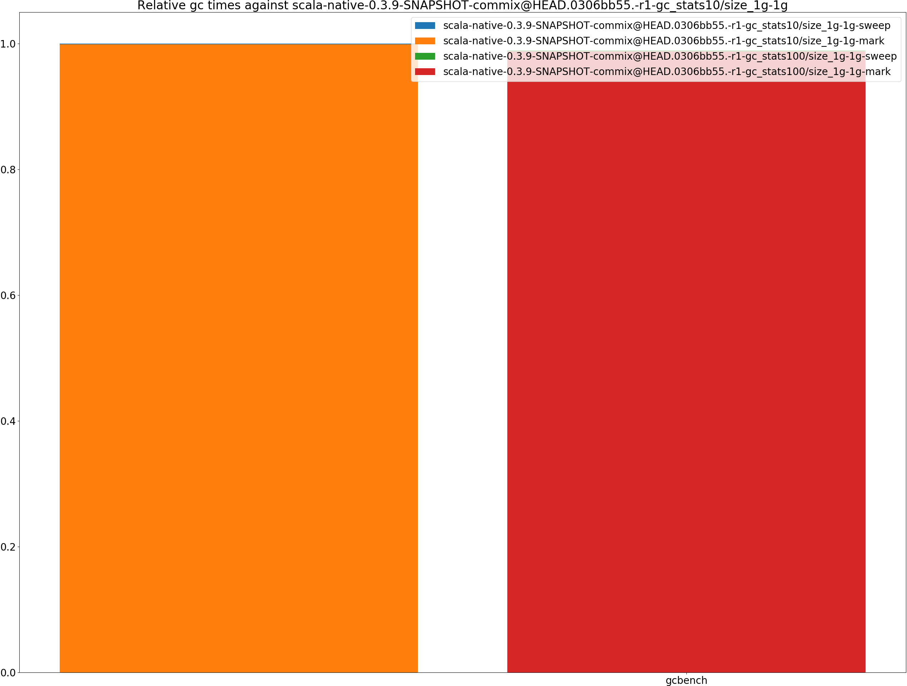
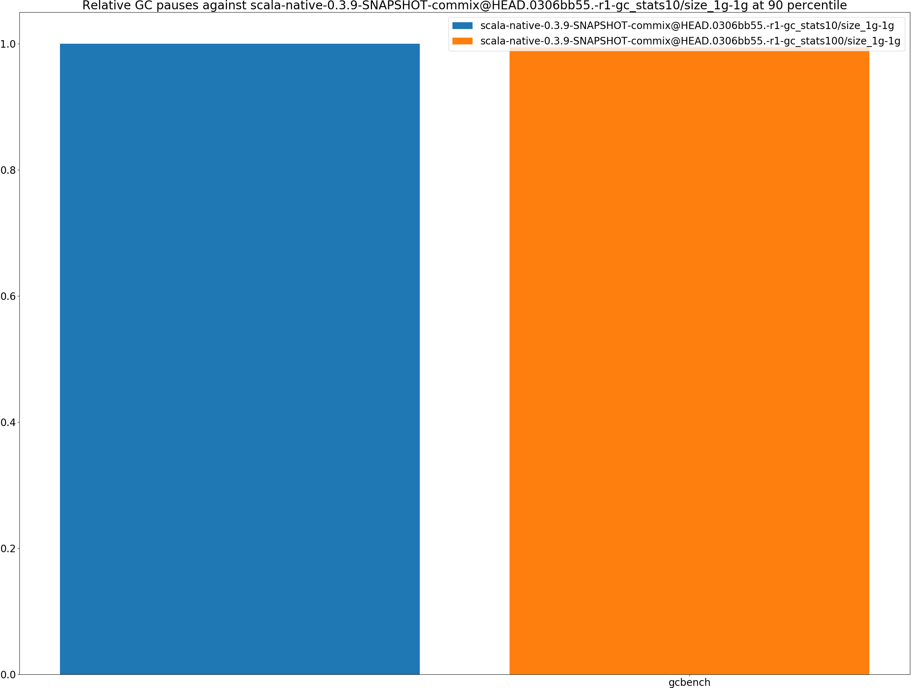

# Summary
## Benchmark run time (ms) at 50 percentile 

|name | scala-native-0.3.9-SNAPSHOT-commix@HEAD.0306bb55.-r1-gc_stats10/size_1g-1g | scala-native-0.3.9-SNAPSHOT-commix@HEAD.0306bb55.-r1-gc_stats100/size_1g-1g | |
| -- | -- | -- | -- |
|[gcbench.GCBenchBenchmark](#gcbenchgcbenchbenchmark)|105.2828|101.6748|__-3.43%__|
| __Geometrical mean:__|| |__-3.43%__|
## Benchmark run time (ms) at 90 percentile 

|name | scala-native-0.3.9-SNAPSHOT-commix@HEAD.0306bb55.-r1-gc_stats10/size_1g-1g | scala-native-0.3.9-SNAPSHOT-commix@HEAD.0306bb55.-r1-gc_stats100/size_1g-1g | |
| -- | -- | -- | -- |
|[gcbench.GCBenchBenchmark](#gcbenchgcbenchbenchmark)|112.5680|111.1199|__-1.29%__|
| __Geometrical mean:__|| |__-1.29%__|
## Benchmark run time (ms) at 99 percentile 

|name | scala-native-0.3.9-SNAPSHOT-commix@HEAD.0306bb55.-r1-gc_stats10/size_1g-1g | scala-native-0.3.9-SNAPSHOT-commix@HEAD.0306bb55.-r1-gc_stats100/size_1g-1g | |
| -- | -- | -- | -- |
|[gcbench.GCBenchBenchmark](#gcbenchgcbenchbenchmark)|126.7575|123.5860|__-2.50%__|
| __Geometrical mean:__|| |__-2.50%__|
## Benchmark total run time (ms) 

|name | scala-native-0.3.9-SNAPSHOT-commix@HEAD.0306bb55.-r1-gc_stats10/size_1g-1g | scala-native-0.3.9-SNAPSHOT-commix@HEAD.0306bb55.-r1-gc_stats100/size_1g-1g | |
| -- | -- | -- | -- |
|[gcbench.GCBenchBenchmark](#gcbenchgcbenchbenchmark)|103077.6107|100999.8095|__-2.02%__|
| __Geometrical mean:__|| |__-2.02%__|
## Total GC time on Application thread (ms) 

|name |  | scala-native-0.3.9-SNAPSHOT-commix@HEAD.0306bb55.-r1-gc_stats10/size_1g-1g | scala-native-0.3.9-SNAPSHOT-commix@HEAD.0306bb55.-r1-gc_stats100/size_1g-1g | |
| -- | -- | -- | -- | -- |
|[gcbench.GCBenchBenchmark](#gcbenchgcbenchbenchmark)|mark|7191.7690|7110.5429|__-1.13%__|
||sweep|7.7931|12.9522|+66.20%|
||total|7199.5621|7123.4950|__-1.06%__|
|__Geometrical mean:__|mark|| |__-1.13%__|
||sweep|| |+66.20%|
||total|| |__-1.06%__|
## GC pause time (ms) at 50 percentile 

|name | scala-native-0.3.9-SNAPSHOT-commix@HEAD.0306bb55.-r1-gc_stats10/size_1g-1g | scala-native-0.3.9-SNAPSHOT-commix@HEAD.0306bb55.-r1-gc_stats100/size_1g-1g | |
| -- | -- | -- | -- |
|[gcbench.GCBenchBenchmark](#gcbenchgcbenchbenchmark)|0.0038|0.0090|+137.68%|
| __Geometrical mean:__|| |+137.68%|
## GC pause time (ms) at 90 percentile 

|name | scala-native-0.3.9-SNAPSHOT-commix@HEAD.0306bb55.-r1-gc_stats10/size_1g-1g | scala-native-0.3.9-SNAPSHOT-commix@HEAD.0306bb55.-r1-gc_stats100/size_1g-1g | |
| -- | -- | -- | -- |
|[gcbench.GCBenchBenchmark](#gcbenchgcbenchbenchmark)|5.0517|5.0239|__-0.55%__|
| __Geometrical mean:__|| |__-0.55%__|
## GC pause time (ms) at 99 percentile 

|name | scala-native-0.3.9-SNAPSHOT-commix@HEAD.0306bb55.-r1-gc_stats10/size_1g-1g | scala-native-0.3.9-SNAPSHOT-commix@HEAD.0306bb55.-r1-gc_stats100/size_1g-1g | |
| -- | -- | -- | -- |
|[gcbench.GCBenchBenchmark](#gcbenchgcbenchbenchmark)|5.5363|5.6117|+1.36%|
| __Geometrical mean:__|| |+1.36%|
# Individual benchmarks
## gcbench.GCBenchBenchmark

