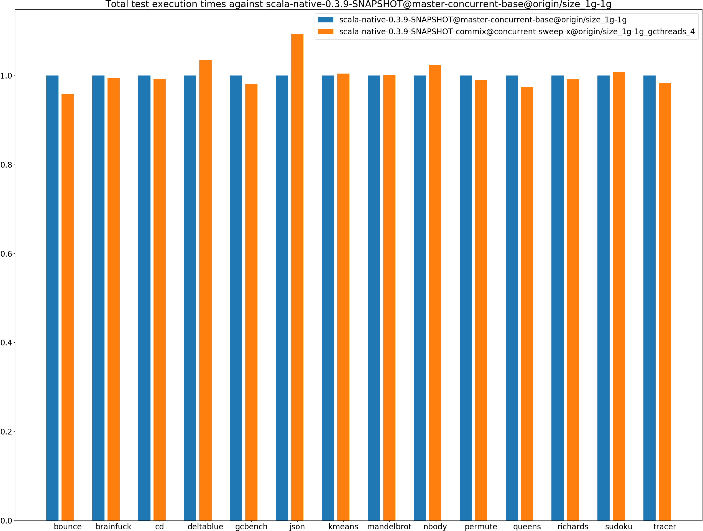
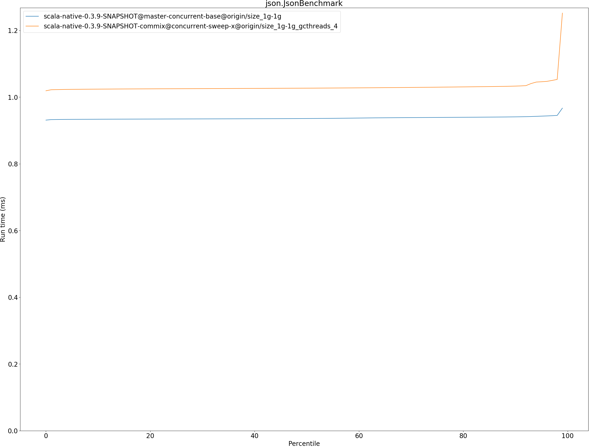

# Summary
## Benchmark run time (ms) at 50 percentile 

|name | scala-native-0.3.9-SNAPSHOT@master-concurrent-base@origin/size_1g-1g | scala-native-0.3.9-SNAPSHOT-commix@concurrent-sweep-x@origin/size_1g-1g_gcthreads_4 | |
| -- | -- | -- | -- |
|[bounce.BounceBenchmark](#bouncebouncebenchmark)|0.0410|0.0392|__-4.38%__|
|[brainfuck.BrainfuckBenchmark](#brainfuckbrainfuckbenchmark)|2.3728|2.3911|+0.77%|
|[cd.CDBenchmark](#cdcdbenchmark)|17.0053|16.9853|__-0.12%__|
|[deltablue.DeltaBlueBenchmark](#deltabluedeltabluebenchmark)|0.1814|0.1858|+2.40%|
|[gcbench.GCBenchBenchmark](#gcbenchgcbenchbenchmark)|66.1548|63.5747|__-3.90%__|
|[json.JsonBenchmark](#jsonjsonbenchmark)|0.9358|1.0268|+9.72%|
|[kmeans.KmeansBenchmark](#kmeanskmeansbenchmark)|36.0690|36.2090|+0.39%|
|[mandelbrot.MandelbrotBenchmark](#mandelbrotmandelbrotbenchmark)|100.7072|100.7274|+0.02%|
|[nbody.NbodyBenchmark](#nbodynbodybenchmark)|24.5717|25.5418|+3.95%|
|[permute.PermuteBenchmark](#permutepermutebenchmark)|0.2098|0.2084|__-0.63%__|
|[queens.QueensBenchmark](#queensqueensbenchmark)|0.0510|0.0503|__-1.42%__|
|[richards.RichardsBenchmark](#richardsrichardsbenchmark)|0.0603|0.0597|__-0.88%__|
|[sudoku.SudokuBenchmark](#sudokusudokubenchmark)|1.5931|1.6157|+1.42%|
|[tracer.TracerBenchmark](#tracertracerbenchmark)|0.4879|0.4923|+0.91%|
| __Geometrical mean:__|| |+0.54%|
## Benchmark run time (ms) at 90 percentile 

|name | scala-native-0.3.9-SNAPSHOT@master-concurrent-base@origin/size_1g-1g | scala-native-0.3.9-SNAPSHOT-commix@concurrent-sweep-x@origin/size_1g-1g_gcthreads_4 | |
| -- | -- | -- | -- |
|[bounce.BounceBenchmark](#bouncebouncebenchmark)|0.0423|0.0405|__-4.16%__|
|[brainfuck.BrainfuckBenchmark](#brainfuckbrainfuckbenchmark)|2.4765|2.4126|__-2.58%__|
|[cd.CDBenchmark](#cdcdbenchmark)|17.1122|17.1182|+0.04%|
|[deltablue.DeltaBlueBenchmark](#deltabluedeltabluebenchmark)|0.1852|0.1879|+1.46%|
|[gcbench.GCBenchBenchmark](#gcbenchgcbenchbenchmark)|66.8558|64.9418|__-2.86%__|
|[json.JsonBenchmark](#jsonjsonbenchmark)|0.9407|1.0330|+9.80%|
|[kmeans.KmeansBenchmark](#kmeanskmeansbenchmark)|36.6244|36.6749|+0.14%|
|[mandelbrot.MandelbrotBenchmark](#mandelbrotmandelbrotbenchmark)|100.7837|100.8041|+0.02%|
|[nbody.NbodyBenchmark](#nbodynbodybenchmark)|25.6886|25.9622|+1.07%|
|[permute.PermuteBenchmark](#permutepermutebenchmark)|0.2121|0.2109|__-0.53%__|
|[queens.QueensBenchmark](#queensqueensbenchmark)|0.0527|0.0516|__-2.10%__|
|[richards.RichardsBenchmark](#richardsrichardsbenchmark)|0.0627|0.0622|__-0.89%__|
|[sudoku.SudokuBenchmark](#sudokusudokubenchmark)|1.6082|1.6463|+2.37%|
|[tracer.TracerBenchmark](#tracertracerbenchmark)|0.4941|0.5008|+1.35%|
| __Geometrical mean:__|| |+0.17%|
## Benchmark run time (ms) at 99 percentile 

|name | scala-native-0.3.9-SNAPSHOT@master-concurrent-base@origin/size_1g-1g | scala-native-0.3.9-SNAPSHOT-commix@concurrent-sweep-x@origin/size_1g-1g_gcthreads_4 | |
| -- | -- | -- | -- |
|[bounce.BounceBenchmark](#bouncebouncebenchmark)|0.0441|0.0422|__-4.18%__|
|[brainfuck.BrainfuckBenchmark](#brainfuckbrainfuckbenchmark)|2.9974|2.5272|__-15.69%__|
|[cd.CDBenchmark](#cdcdbenchmark)|21.9642|22.1007|+0.62%|
|[deltablue.DeltaBlueBenchmark](#deltabluedeltabluebenchmark)|0.1883|0.1910|+1.43%|
|[gcbench.GCBenchBenchmark](#gcbenchgcbenchbenchmark)|77.4812|65.4994|__-15.46%__|
|[json.JsonBenchmark](#jsonjsonbenchmark)|0.9670|1.2519|+29.46%|
|[kmeans.KmeansBenchmark](#kmeanskmeansbenchmark)|49.0999|51.1159|+4.11%|
|[mandelbrot.MandelbrotBenchmark](#mandelbrotmandelbrotbenchmark)|104.3348|102.1539|__-2.09%__|
|[nbody.NbodyBenchmark](#nbodynbodybenchmark)|27.5265|27.4477|__-0.29%__|
|[permute.PermuteBenchmark](#permutepermutebenchmark)|0.2169|0.2147|__-0.99%__|
|[queens.QueensBenchmark](#queensqueensbenchmark)|0.0544|0.0540|__-0.64%__|
|[richards.RichardsBenchmark](#richardsrichardsbenchmark)|0.0658|0.0653|__-0.74%__|
|[sudoku.SudokuBenchmark](#sudokusudokubenchmark)|1.6337|1.7074|+4.51%|
|[tracer.TracerBenchmark](#tracertracerbenchmark)|0.5023|0.5589|+11.28%|
| __Geometrical mean:__|| |+0.29%|
## Benchmark total run time (ms) 

|name | scala-native-0.3.9-SNAPSHOT@master-concurrent-base@origin/size_1g-1g | scala-native-0.3.9-SNAPSHOT-commix@concurrent-sweep-x@origin/size_1g-1g_gcthreads_4 | |
| -- | -- | -- | -- |
|[bounce.BounceBenchmark](#bouncebouncebenchmark)|817.8376|784.0047|__-4.14%__|
|[brainfuck.BrainfuckBenchmark](#brainfuckbrainfuckbenchmark)|48384.6665|48073.1401|__-0.64%__|
|[cd.CDBenchmark](#cdcdbenchmark)|346446.6505|343764.5121|__-0.77%__|
|[deltablue.DeltaBlueBenchmark](#deltabluedeltabluebenchmark)|3597.3118|3719.3552|+3.39%|
|[gcbench.GCBenchBenchmark](#gcbenchgcbenchbenchmark)|1259126.9785|1235746.2753|__-1.86%__|
|[json.JsonBenchmark](#jsonjsonbenchmark)|18905.6686|20671.4512|+9.34%|
|[kmeans.KmeansBenchmark](#kmeanskmeansbenchmark)|720405.6537|723208.5946|+0.39%|
|[mandelbrot.MandelbrotBenchmark](#mandelbrotmandelbrotbenchmark)|2015996.6238|2016164.4001|+0.01%|
|[nbody.NbodyBenchmark](#nbodynbodybenchmark)|499501.7361|511515.1629|+2.41%|
|[permute.PermuteBenchmark](#permutepermutebenchmark)|4201.0063|4154.9772|__-1.10%__|
|[queens.QueensBenchmark](#queensqueensbenchmark)|1026.0478|999.2055|__-2.62%__|
|[richards.RichardsBenchmark](#richardsrichardsbenchmark)|1213.8292|1203.2073|__-0.88%__|
|[sudoku.SudokuBenchmark](#sudokusudokubenchmark)|31970.6633|32201.6308|+0.72%|
|[tracer.TracerBenchmark](#tracertracerbenchmark)|10002.6828|9833.7200|__-1.69%__|
| __Geometrical mean:__|| |+0.14%|
# Individual benchmarks
## bounce.BounceBenchmark

## brainfuck.BrainfuckBenchmark

## cd.CDBenchmark

## deltablue.DeltaBlueBenchmark

## gcbench.GCBenchBenchmark

## json.JsonBenchmark

## kmeans.KmeansBenchmark

## mandelbrot.MandelbrotBenchmark

## nbody.NbodyBenchmark

## permute.PermuteBenchmark

## queens.QueensBenchmark

## richards.RichardsBenchmark

## sudoku.SudokuBenchmark

## tracer.TracerBenchmark

