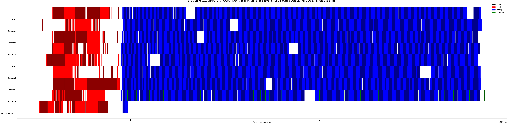

# Summary
## Benchmark run time (ms) at 50 percentile 

|name | scala-native-0.3.9-SNAPSHOT-commix@HEAD-r1-gc_abanddon_large_arrays/size_1g-1g|
| -- | -- |
|[cd.CDBenchmark](#cdcdbenchmark)|24.1681|
|[kmeans.KmeansBenchmark](#kmeanskmeansbenchmark)|53.2143|
|[gcbench.GCBenchBenchmark](#gcbenchgcbenchbenchmark)|105.6088|
| __Geometrical mean:__||
## Benchmark run time (ms) at 90 percentile 

|name | scala-native-0.3.9-SNAPSHOT-commix@HEAD-r1-gc_abanddon_large_arrays/size_1g-1g|
| -- | -- |
|[cd.CDBenchmark](#cdcdbenchmark)|25.2732|
|[kmeans.KmeansBenchmark](#kmeanskmeansbenchmark)|56.1963|
|[gcbench.GCBenchBenchmark](#gcbenchgcbenchbenchmark)|113.0101|
| __Geometrical mean:__||
## Benchmark run time (ms) at 99 percentile 

|name | scala-native-0.3.9-SNAPSHOT-commix@HEAD-r1-gc_abanddon_large_arrays/size_1g-1g|
| -- | -- |
|[cd.CDBenchmark](#cdcdbenchmark)|31.0364|
|[kmeans.KmeansBenchmark](#kmeanskmeansbenchmark)|58.9803|
|[gcbench.GCBenchBenchmark](#gcbenchgcbenchbenchmark)|131.2865|
| __Geometrical mean:__||
## Benchmark total run time (ms) 

|name | scala-native-0.3.9-SNAPSHOT-commix@HEAD-r1-gc_abanddon_large_arrays/size_1g-1g|
| -- | -- |
|[cd.CDBenchmark](#cdcdbenchmark)|24448.1380|
|[kmeans.KmeansBenchmark](#kmeanskmeansbenchmark)|53698.5817|
|[gcbench.GCBenchBenchmark](#gcbenchgcbenchbenchmark)|104575.8914|
| __Geometrical mean:__||
## Total GC time on Application thread (ms) 

|name |  | scala-native-0.3.9-SNAPSHOT-commix@HEAD-r1-gc_abanddon_large_arrays/size_1g-1g|
| -- | -- | -- |
|[cd.CDBenchmark](#cdcdbenchmark)|mark|33.4367|
||sweep|0.4617|
||total|33.8984|
|[kmeans.KmeansBenchmark](#kmeanskmeansbenchmark)|mark|88.7818|
||sweep|4.0074|
||total|92.7891|
|[gcbench.GCBenchBenchmark](#gcbenchgcbenchbenchmark)|mark|7282.0362|
||sweep|6.6922|
||total|7288.7284|
|__Geometrical mean:__|mark||
||sweep||
||total||
## GC pause time (ms) at 50 percentile 

|name | scala-native-0.3.9-SNAPSHOT-commix@HEAD-r1-gc_abanddon_large_arrays/size_1g-1g|
| -- | -- |
|[cd.CDBenchmark](#cdcdbenchmark)|0.0033|
|[kmeans.KmeansBenchmark](#kmeanskmeansbenchmark)|0.0677|
|[gcbench.GCBenchBenchmark](#gcbenchgcbenchbenchmark)|0.0097|
| __Geometrical mean:__||
## GC pause time (ms) at 90 percentile 

|name | scala-native-0.3.9-SNAPSHOT-commix@HEAD-r1-gc_abanddon_large_arrays/size_1g-1g|
| -- | -- |
|[cd.CDBenchmark](#cdcdbenchmark)|0.2136|
|[kmeans.KmeansBenchmark](#kmeanskmeansbenchmark)|1.0912|
|[gcbench.GCBenchBenchmark](#gcbenchgcbenchbenchmark)|5.1918|
| __Geometrical mean:__||
## GC pause time (ms) at 99 percentile 

|name | scala-native-0.3.9-SNAPSHOT-commix@HEAD-r1-gc_abanddon_large_arrays/size_1g-1g|
| -- | -- |
|[cd.CDBenchmark](#cdcdbenchmark)|0.3447|
|[kmeans.KmeansBenchmark](#kmeanskmeansbenchmark)|1.2758|
|[gcbench.GCBenchBenchmark](#gcbenchgcbenchbenchmark)|5.8243|
| __Geometrical mean:__||
# Individual benchmarks
## cd.CDBenchmark

## kmeans.KmeansBenchmark

## gcbench.GCBenchBenchmark

