# Summary
## Benchmark run time (ms) at 50 percentile 

|name | scala-native-0.3.9-SNAPSHOT-commix@HEAD-r1-gc_abanddon_large_arrays/size_1g-1g|
| -- | -- |
|[cd.CDBenchmark](#cdcdbenchmark)|24.4555|
|[kmeans.KmeansBenchmark](#kmeanskmeansbenchmark)|51.2591|
|[gcbench.GCBenchBenchmark](#gcbenchgcbenchbenchmark)|103.9135|
| __Geometrical mean:__||
## Benchmark run time (ms) at 90 percentile 

|name | scala-native-0.3.9-SNAPSHOT-commix@HEAD-r1-gc_abanddon_large_arrays/size_1g-1g|
| -- | -- |
|[cd.CDBenchmark](#cdcdbenchmark)|24.9566|
|[kmeans.KmeansBenchmark](#kmeanskmeansbenchmark)|52.0495|
|[gcbench.GCBenchBenchmark](#gcbenchgcbenchbenchmark)|112.2034|
| __Geometrical mean:__||
## Benchmark run time (ms) at 99 percentile 

|name | scala-native-0.3.9-SNAPSHOT-commix@HEAD-r1-gc_abanddon_large_arrays/size_1g-1g|
| -- | -- |
|[cd.CDBenchmark](#cdcdbenchmark)|34.9421|
|[kmeans.KmeansBenchmark](#kmeanskmeansbenchmark)|57.8748|
|[gcbench.GCBenchBenchmark](#gcbenchgcbenchbenchmark)|125.8758|
| __Geometrical mean:__||
## Benchmark total run time (ms) 

|name | scala-native-0.3.9-SNAPSHOT-commix@HEAD-r1-gc_abanddon_large_arrays/size_1g-1g|
| -- | -- |
|[cd.CDBenchmark](#cdcdbenchmark)|24877.8174|
|[kmeans.KmeansBenchmark](#kmeanskmeansbenchmark)|51269.0464|
|[gcbench.GCBenchBenchmark](#gcbenchgcbenchbenchmark)|102875.6599|
| __Geometrical mean:__||
## Total GC time on Application thread (ms) 
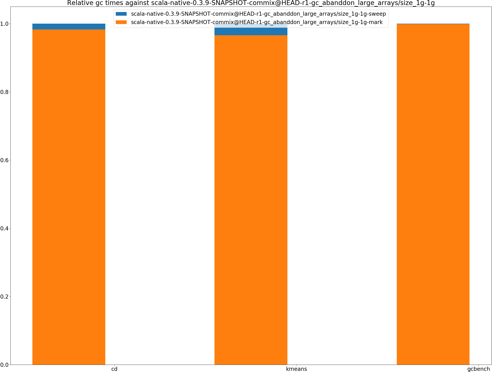

|name |  | scala-native-0.3.9-SNAPSHOT-commix@HEAD-r1-gc_abanddon_large_arrays/size_1g-1g|
| -- | -- | -- |
|[cd.CDBenchmark](#cdcdbenchmark)|mark|37.3750|
||sweep|0.6468|
||total|38.0218|
|[kmeans.KmeansBenchmark](#kmeanskmeansbenchmark)|mark|89.4214|
||sweep|3.1239|
||total|92.5453|
|[gcbench.GCBenchBenchmark](#gcbenchgcbenchbenchmark)|mark|6679.4086|
||sweep|7.3679|
||total|6686.7764|
|__Geometrical mean:__|mark||
||sweep||
||total||
## GC pause time (ms) at 50 percentile 
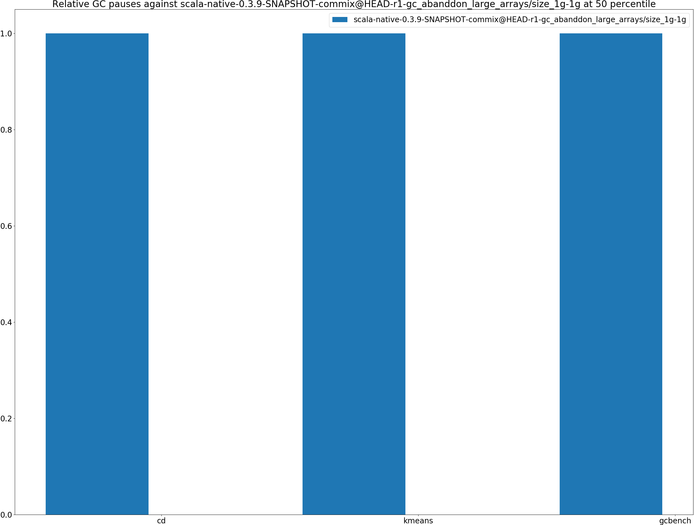

|name | scala-native-0.3.9-SNAPSHOT-commix@HEAD-r1-gc_abanddon_large_arrays/size_1g-1g|
| -- | -- |
|[cd.CDBenchmark](#cdcdbenchmark)|0.0046|
|[kmeans.KmeansBenchmark](#kmeanskmeansbenchmark)|0.0399|
|[gcbench.GCBenchBenchmark](#gcbenchgcbenchbenchmark)|0.0672|
| __Geometrical mean:__||
## GC pause time (ms) at 90 percentile 

|name | scala-native-0.3.9-SNAPSHOT-commix@HEAD-r1-gc_abanddon_large_arrays/size_1g-1g|
| -- | -- |
|[cd.CDBenchmark](#cdcdbenchmark)|0.2222|
|[kmeans.KmeansBenchmark](#kmeanskmeansbenchmark)|1.0749|
|[gcbench.GCBenchBenchmark](#gcbenchgcbenchbenchmark)|4.8298|
| __Geometrical mean:__||
## GC pause time (ms) at 99 percentile 

|name | scala-native-0.3.9-SNAPSHOT-commix@HEAD-r1-gc_abanddon_large_arrays/size_1g-1g|
| -- | -- |
|[cd.CDBenchmark](#cdcdbenchmark)|0.4241|
|[kmeans.KmeansBenchmark](#kmeanskmeansbenchmark)|1.4033|
|[gcbench.GCBenchBenchmark](#gcbenchgcbenchbenchmark)|5.4141|
| __Geometrical mean:__||
# Individual benchmarks
## cd.CDBenchmark
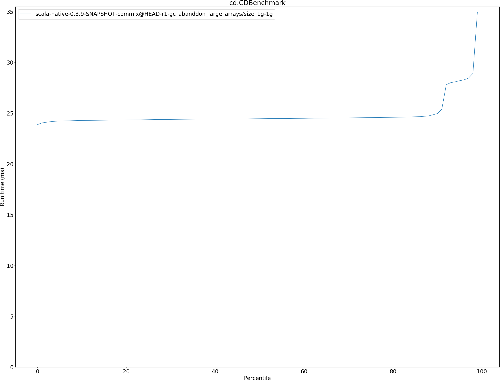

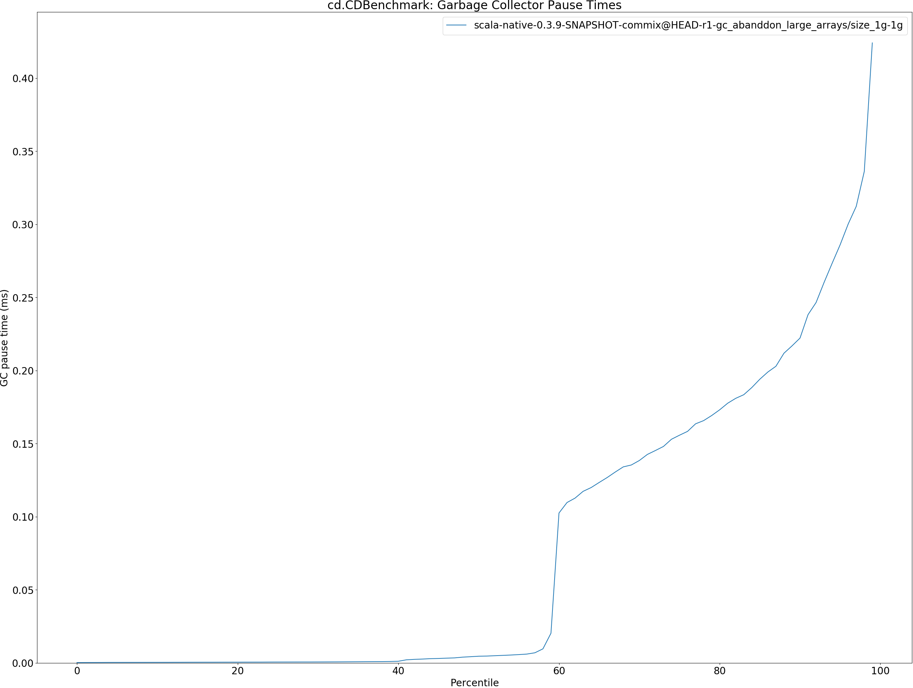

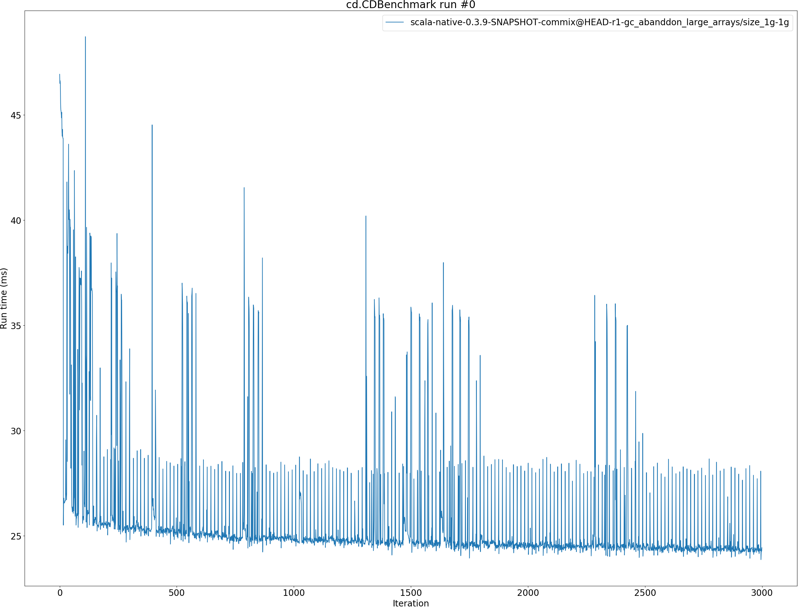

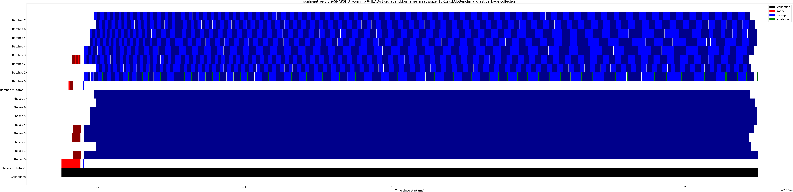

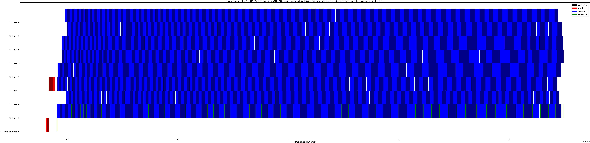

## kmeans.KmeansBenchmark
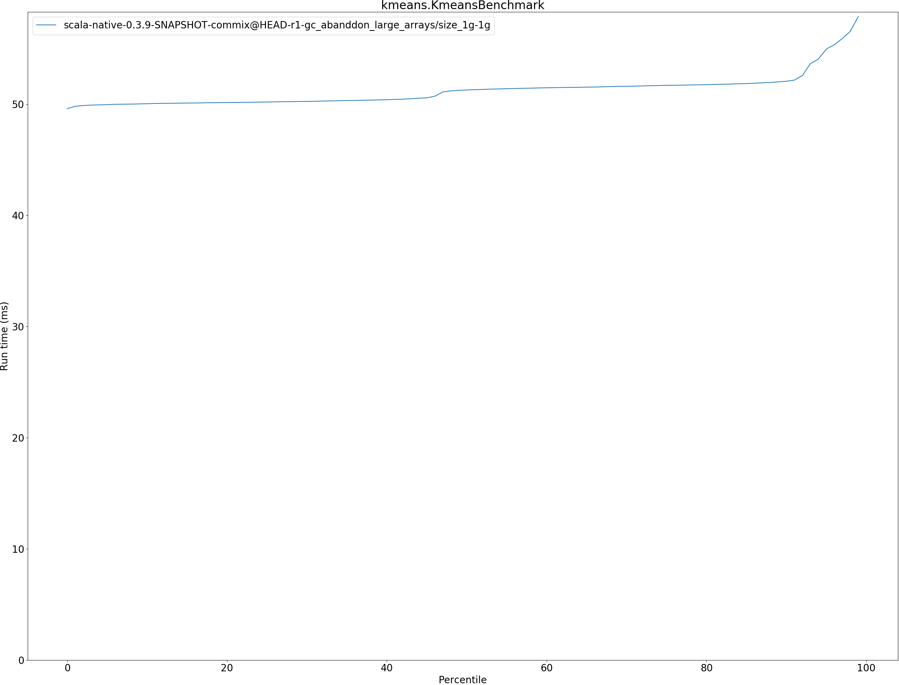

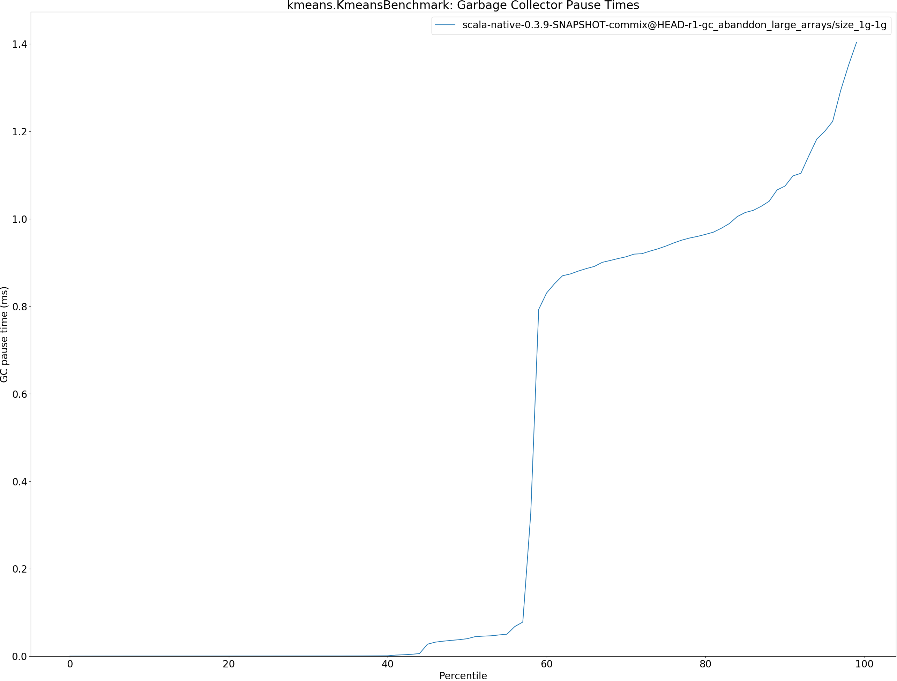

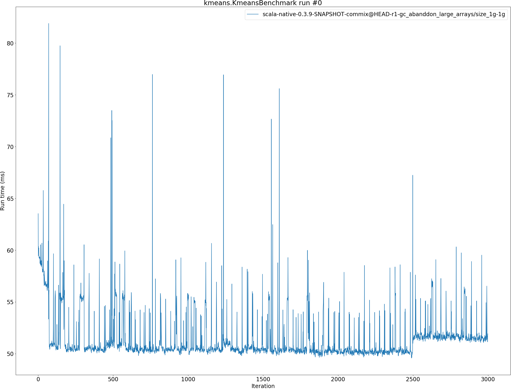

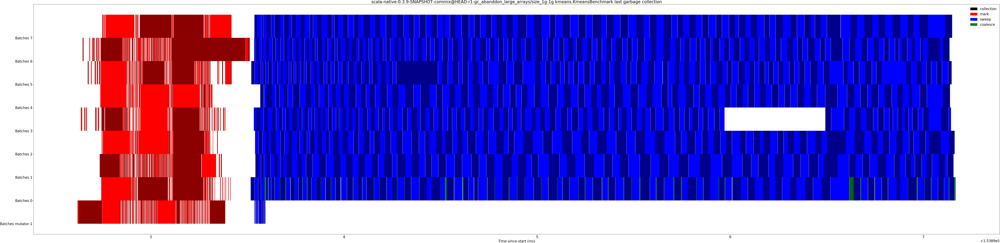

## gcbench.GCBenchBenchmark
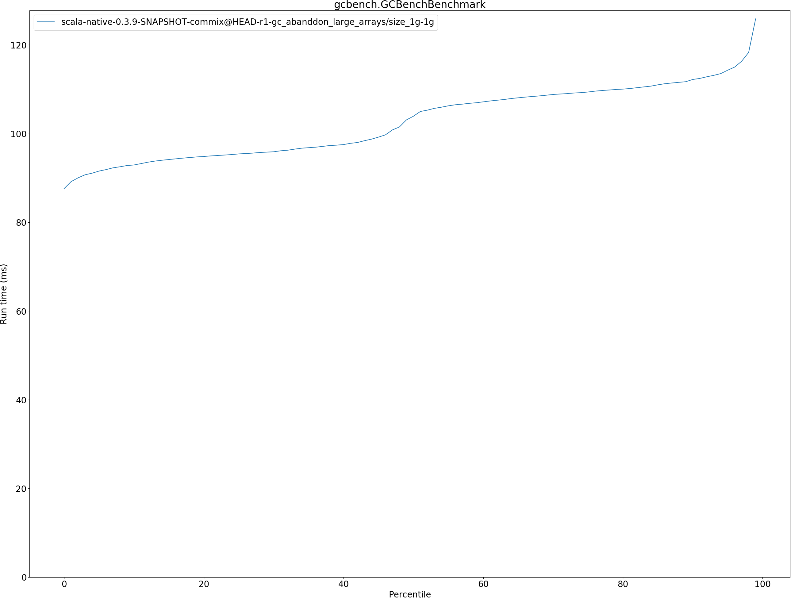

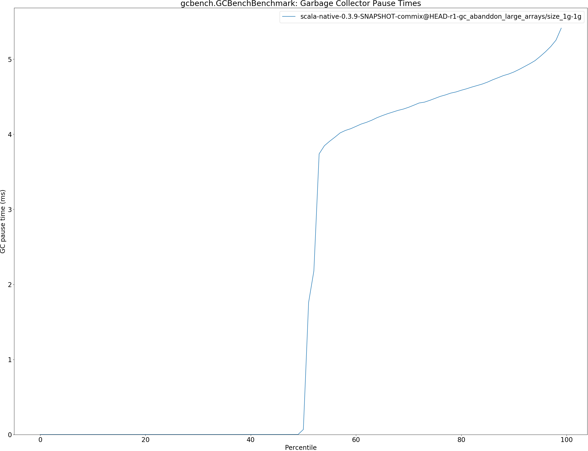

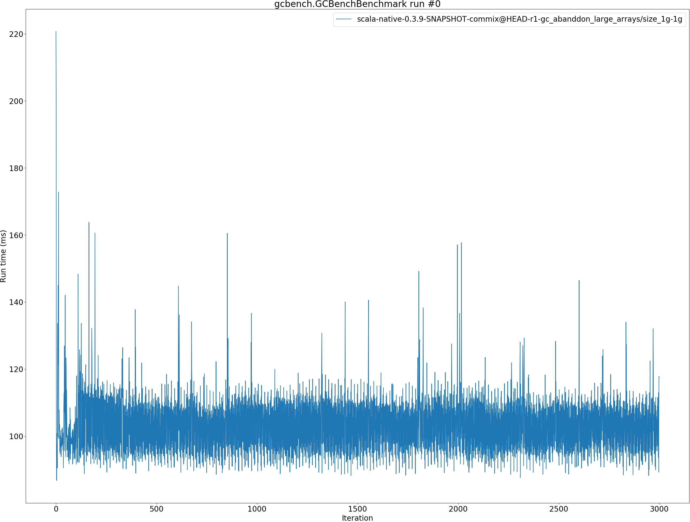

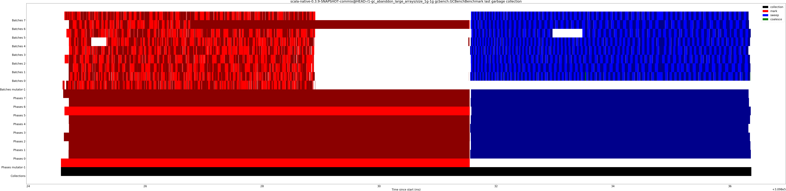

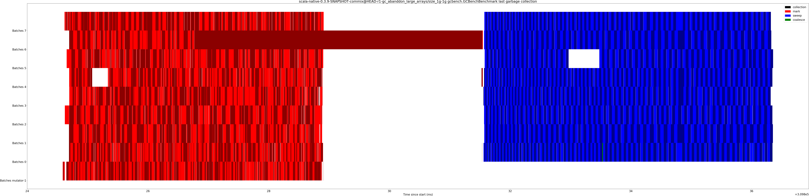

