# Summary
## Benchmark run time (ms) at 50 percentile 

|name | scala-native-0.3.9-SNAPSHOT-commix@HEAD-r1-gc_abanddon_large_arrays/size_1g-1g|
| -- | -- |
|[cd.CDBenchmark](#cdcdbenchmark)|24.9585|
|[kmeans.KmeansBenchmark](#kmeanskmeansbenchmark)|49.5692|
|[gcbench.GCBenchBenchmark](#gcbenchgcbenchbenchmark)|106.7932|
| __Geometrical mean:__||
## Benchmark run time (ms) at 90 percentile 

|name | scala-native-0.3.9-SNAPSHOT-commix@HEAD-r1-gc_abanddon_large_arrays/size_1g-1g|
| -- | -- |
|[cd.CDBenchmark](#cdcdbenchmark)|26.3547|
|[kmeans.KmeansBenchmark](#kmeanskmeansbenchmark)|50.2341|
|[gcbench.GCBenchBenchmark](#gcbenchgcbenchbenchmark)|113.2921|
| __Geometrical mean:__||
## Benchmark run time (ms) at 99 percentile 

|name | scala-native-0.3.9-SNAPSHOT-commix@HEAD-r1-gc_abanddon_large_arrays/size_1g-1g|
| -- | -- |
|[cd.CDBenchmark](#cdcdbenchmark)|35.5528|
|[kmeans.KmeansBenchmark](#kmeanskmeansbenchmark)|56.2122|
|[gcbench.GCBenchBenchmark](#gcbenchgcbenchbenchmark)|124.0357|
| __Geometrical mean:__||
## Benchmark total run time (ms) 
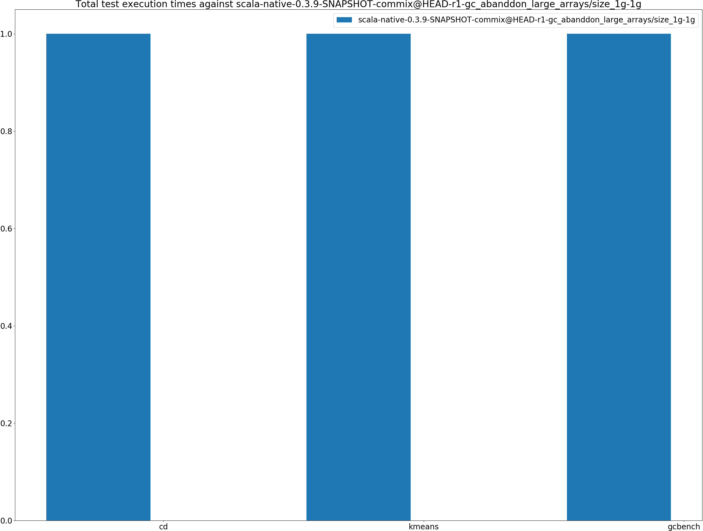

|name | scala-native-0.3.9-SNAPSHOT-commix@HEAD-r1-gc_abanddon_large_arrays/size_1g-1g|
| -- | -- |
|[cd.CDBenchmark](#cdcdbenchmark)|25497.3666|
|[kmeans.KmeansBenchmark](#kmeanskmeansbenchmark)|49905.2217|
|[gcbench.GCBenchBenchmark](#gcbenchgcbenchbenchmark)|104564.5278|
| __Geometrical mean:__||
## Total GC time on Application thread (ms) 
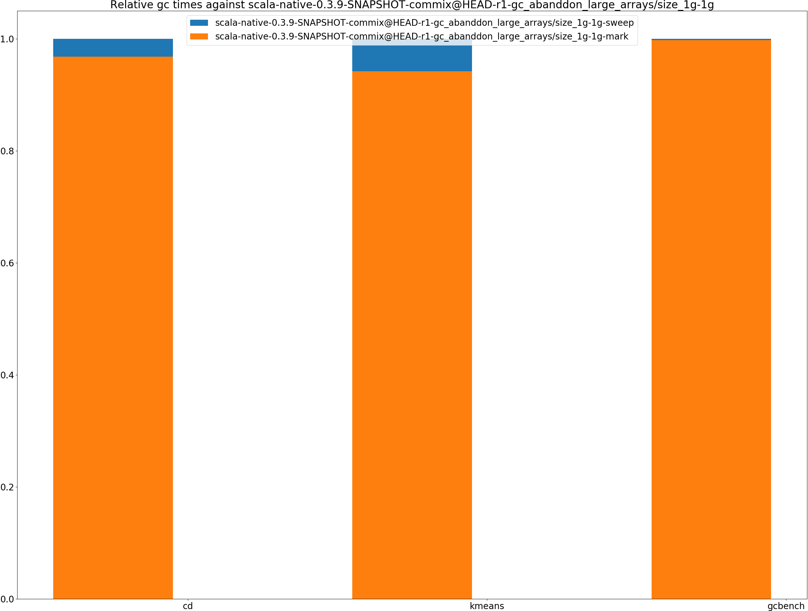

|name |  | scala-native-0.3.9-SNAPSHOT-commix@HEAD-r1-gc_abanddon_large_arrays/size_1g-1g|
| -- | -- | -- |
|[cd.CDBenchmark](#cdcdbenchmark)|mark|3352.2614|
||sweep|110.3179|
||total|3462.5792|
|[kmeans.KmeansBenchmark](#kmeanskmeansbenchmark)|mark|1142.6585|
||sweep|69.8752|
||total|1212.5336|
|[gcbench.GCBenchBenchmark](#gcbenchgcbenchbenchmark)|mark|45083.2937|
||sweep|90.7348|
||total|45174.0286|
|__Geometrical mean:__|mark||
||sweep||
||total||
## GC pause time (ms) at 50 percentile 

|name | scala-native-0.3.9-SNAPSHOT-commix@HEAD-r1-gc_abanddon_large_arrays/size_1g-1g|
| -- | -- |
|[cd.CDBenchmark](#cdcdbenchmark)|0.0051|
|[kmeans.KmeansBenchmark](#kmeanskmeansbenchmark)|0.0638|
|[gcbench.GCBenchBenchmark](#gcbenchgcbenchbenchmark)|1.8781|
| __Geometrical mean:__||
## GC pause time (ms) at 90 percentile 

|name | scala-native-0.3.9-SNAPSHOT-commix@HEAD-r1-gc_abanddon_large_arrays/size_1g-1g|
| -- | -- |
|[cd.CDBenchmark](#cdcdbenchmark)|0.2024|
|[kmeans.KmeansBenchmark](#kmeanskmeansbenchmark)|1.1505|
|[gcbench.GCBenchBenchmark](#gcbenchgcbenchbenchmark)|5.3294|
| __Geometrical mean:__||
## GC pause time (ms) at 99 percentile 

|name | scala-native-0.3.9-SNAPSHOT-commix@HEAD-r1-gc_abanddon_large_arrays/size_1g-1g|
| -- | -- |
|[cd.CDBenchmark](#cdcdbenchmark)|0.3359|
|[kmeans.KmeansBenchmark](#kmeanskmeansbenchmark)|1.7562|
|[gcbench.GCBenchBenchmark](#gcbenchgcbenchbenchmark)|6.1643|
| __Geometrical mean:__||
# Individual benchmarks
## cd.CDBenchmark
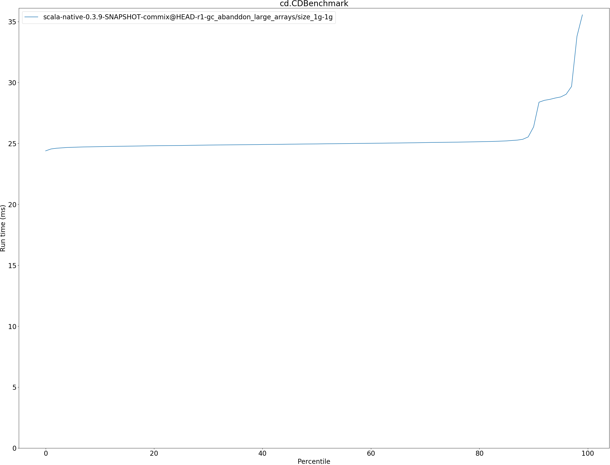

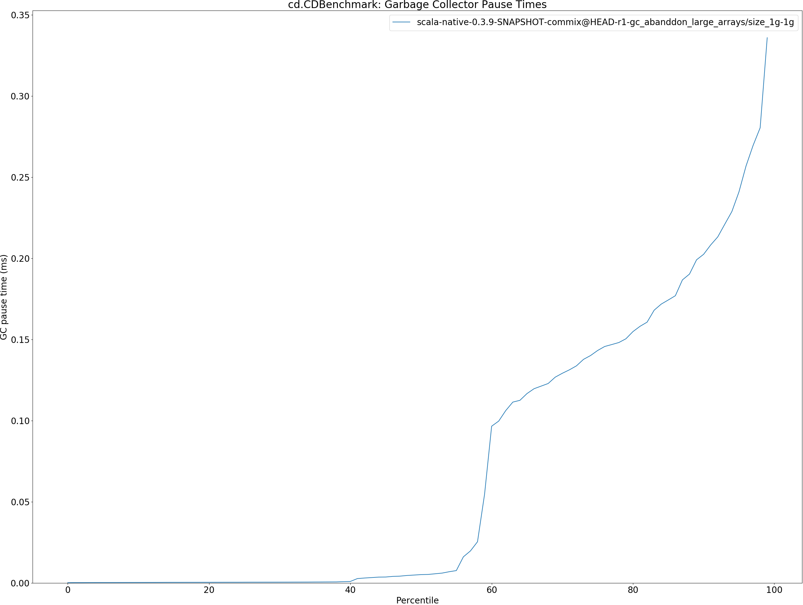

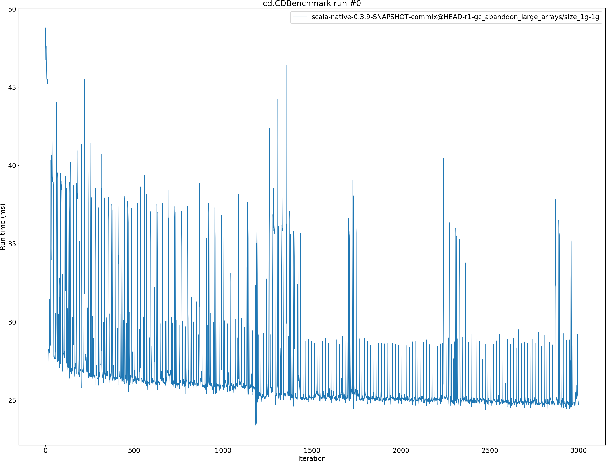

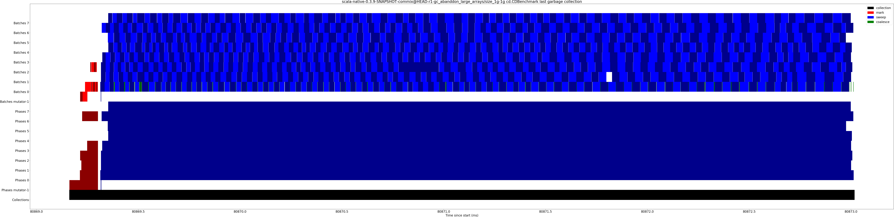

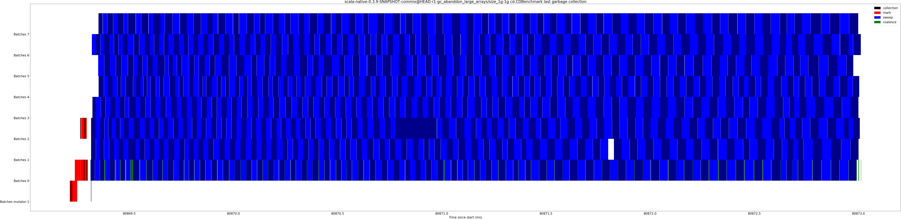

## kmeans.KmeansBenchmark
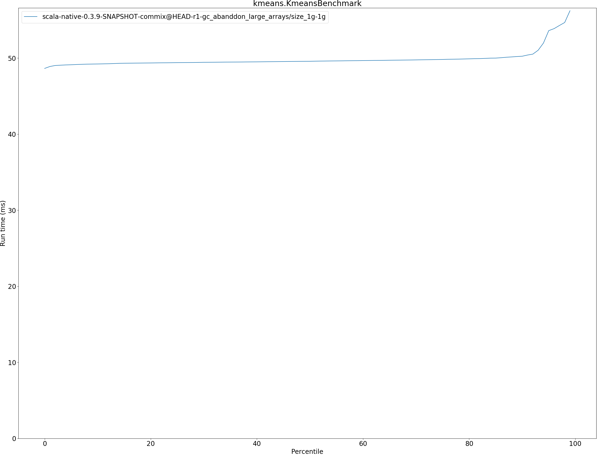

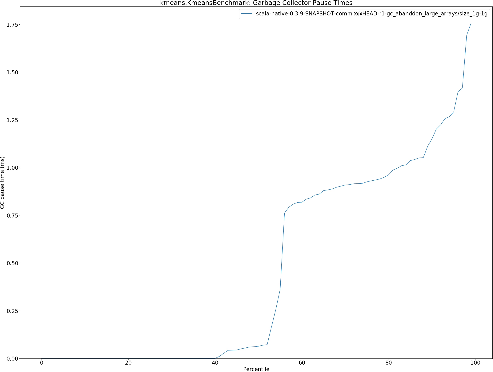

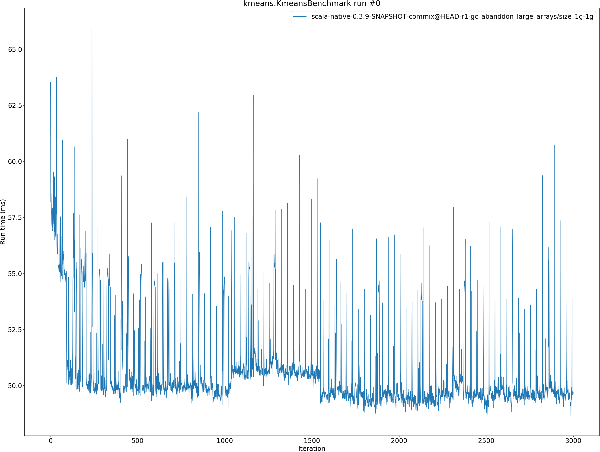

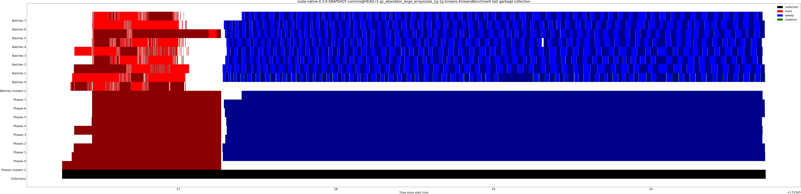

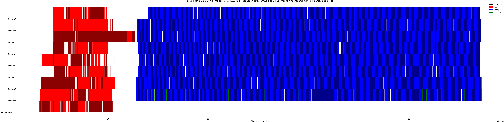

## gcbench.GCBenchBenchmark
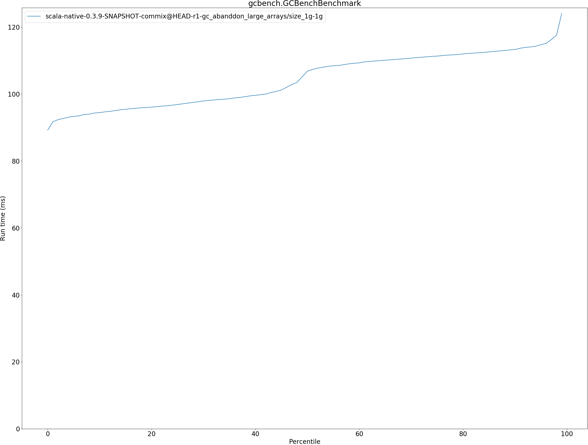

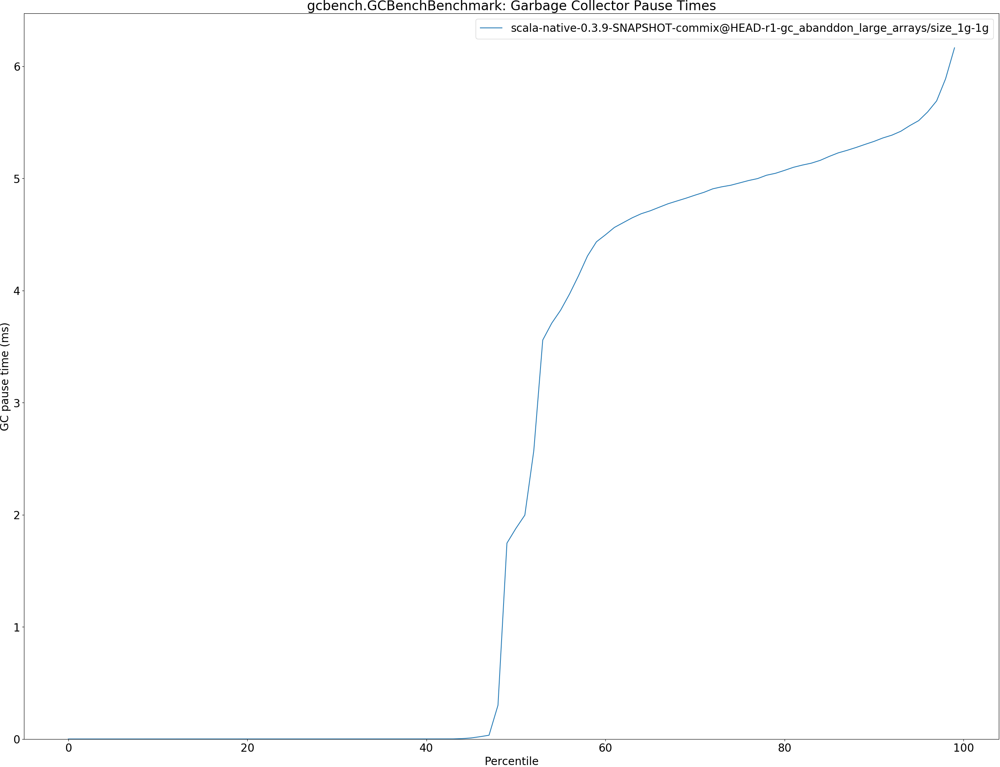

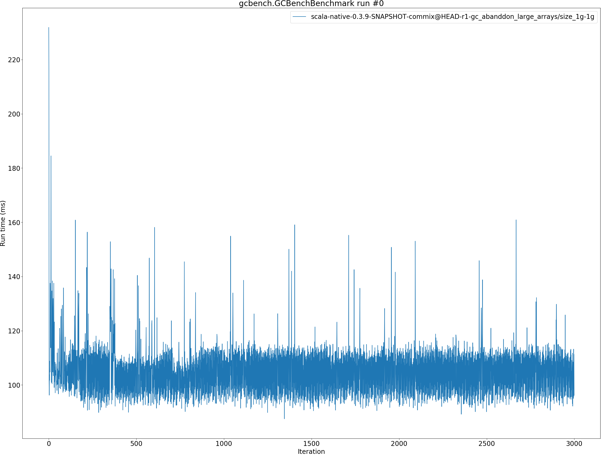

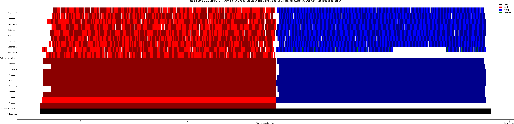

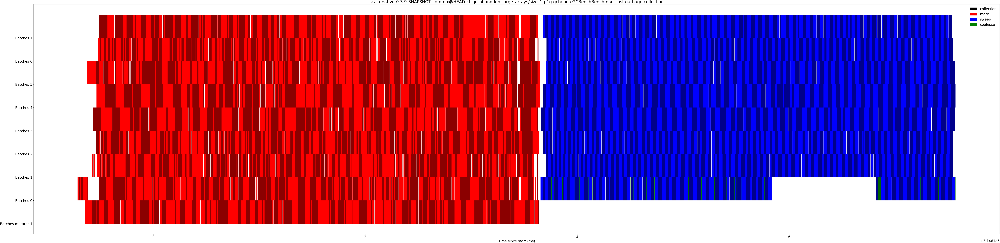

