# Summary
## Benchmark run time (ms) at 50 percentile 

|name | scala-native-0.3.9-SNAPSHOT-commix@HEAD-r1-gc_abanddon_large_arrays/size_1g-1g|
| -- | -- |
|[cd.CDBenchmark](#cdcdbenchmark)|22.9125|
|[kmeans.KmeansBenchmark](#kmeanskmeansbenchmark)|54.5514|
|[gcbench.GCBenchBenchmark](#gcbenchgcbenchbenchmark)|103.7750|
| __Geometrical mean:__||
## Benchmark run time (ms) at 90 percentile 

|name | scala-native-0.3.9-SNAPSHOT-commix@HEAD-r1-gc_abanddon_large_arrays/size_1g-1g|
| -- | -- |
|[cd.CDBenchmark](#cdcdbenchmark)|23.7502|
|[kmeans.KmeansBenchmark](#kmeanskmeansbenchmark)|57.7792|
|[gcbench.GCBenchBenchmark](#gcbenchgcbenchbenchmark)|111.3118|
| __Geometrical mean:__||
## Benchmark run time (ms) at 99 percentile 
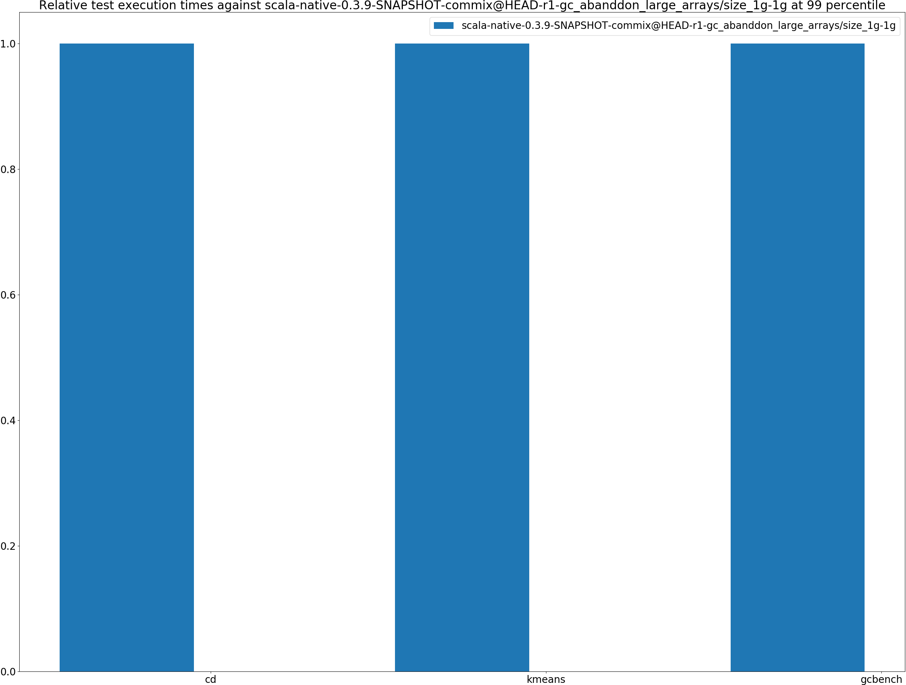

|name | scala-native-0.3.9-SNAPSHOT-commix@HEAD-r1-gc_abanddon_large_arrays/size_1g-1g|
| -- | -- |
|[cd.CDBenchmark](#cdcdbenchmark)|30.2879|
|[kmeans.KmeansBenchmark](#kmeanskmeansbenchmark)|61.8694|
|[gcbench.GCBenchBenchmark](#gcbenchgcbenchbenchmark)|119.5314|
| __Geometrical mean:__||
## Benchmark total run time (ms) 

|name | scala-native-0.3.9-SNAPSHOT-commix@HEAD-r1-gc_abanddon_large_arrays/size_1g-1g|
| -- | -- |
|[cd.CDBenchmark](#cdcdbenchmark)|23423.9603|
|[kmeans.KmeansBenchmark](#kmeanskmeansbenchmark)|55122.9512|
|[gcbench.GCBenchBenchmark](#gcbenchgcbenchbenchmark)|102698.2055|
| __Geometrical mean:__||
## Total GC time on Application thread (ms) 
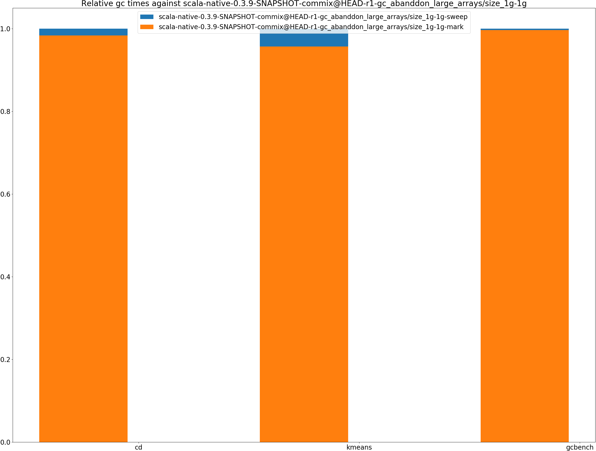

|name |  | scala-native-0.3.9-SNAPSHOT-commix@HEAD-r1-gc_abanddon_large_arrays/size_1g-1g|
| -- | -- | -- |
|[cd.CDBenchmark](#cdcdbenchmark)|mark|3205.7135|
||sweep|53.6514|
||total|3259.3649|
|[kmeans.KmeansBenchmark](#kmeanskmeansbenchmark)|mark|1284.8508|
||sweep|57.6575|
||total|1342.5083|
|[gcbench.GCBenchBenchmark](#gcbenchgcbenchbenchmark)|mark|38985.5127|
||sweep|128.0554|
||total|39113.5682|
|__Geometrical mean:__|mark||
||sweep||
||total||
## GC pause time (ms) at 50 percentile 

|name | scala-native-0.3.9-SNAPSHOT-commix@HEAD-r1-gc_abanddon_large_arrays/size_1g-1g|
| -- | -- |
|[cd.CDBenchmark](#cdcdbenchmark)|0.0043|
|[kmeans.KmeansBenchmark](#kmeanskmeansbenchmark)|0.0451|
|[gcbench.GCBenchBenchmark](#gcbenchgcbenchbenchmark)|2.1588|
| __Geometrical mean:__||
## GC pause time (ms) at 90 percentile 

|name | scala-native-0.3.9-SNAPSHOT-commix@HEAD-r1-gc_abanddon_large_arrays/size_1g-1g|
| -- | -- |
|[cd.CDBenchmark](#cdcdbenchmark)|0.2046|
|[kmeans.KmeansBenchmark](#kmeanskmeansbenchmark)|1.1458|
|[gcbench.GCBenchBenchmark](#gcbenchgcbenchbenchmark)|4.9650|
| __Geometrical mean:__||
## GC pause time (ms) at 99 percentile 

|name | scala-native-0.3.9-SNAPSHOT-commix@HEAD-r1-gc_abanddon_large_arrays/size_1g-1g|
| -- | -- |
|[cd.CDBenchmark](#cdcdbenchmark)|0.4689|
|[kmeans.KmeansBenchmark](#kmeanskmeansbenchmark)|1.6610|
|[gcbench.GCBenchBenchmark](#gcbenchgcbenchbenchmark)|5.7796|
| __Geometrical mean:__||
# Individual benchmarks
## cd.CDBenchmark
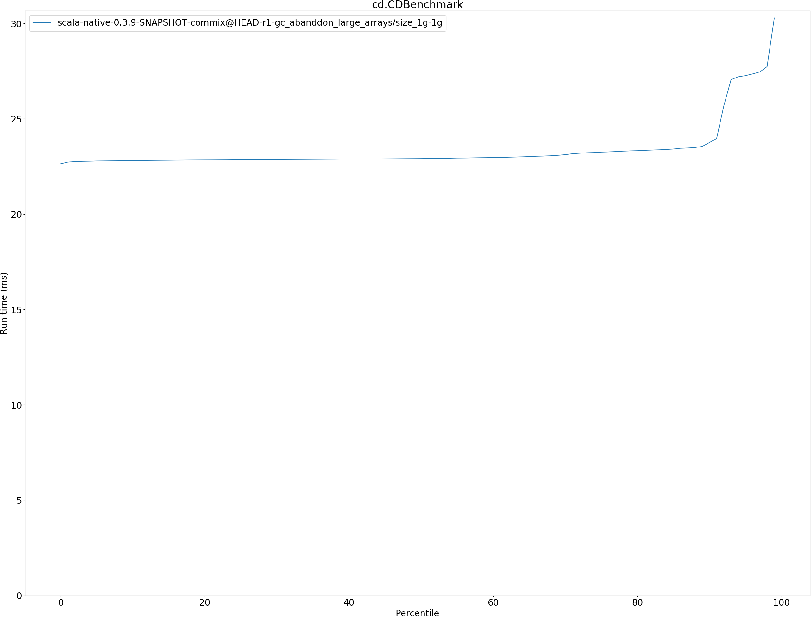

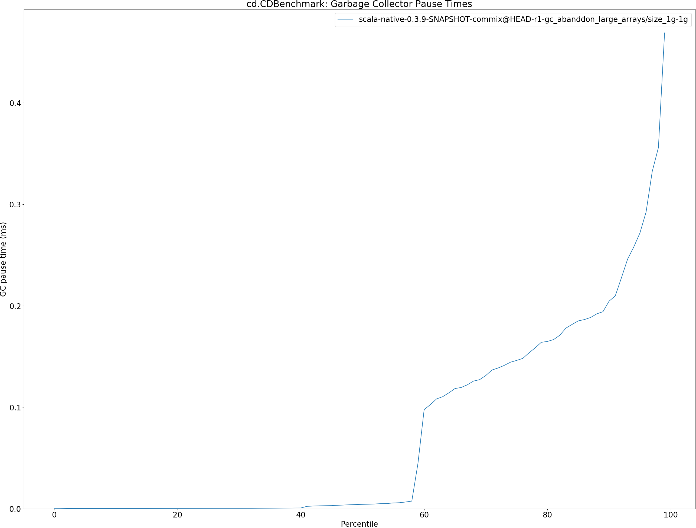

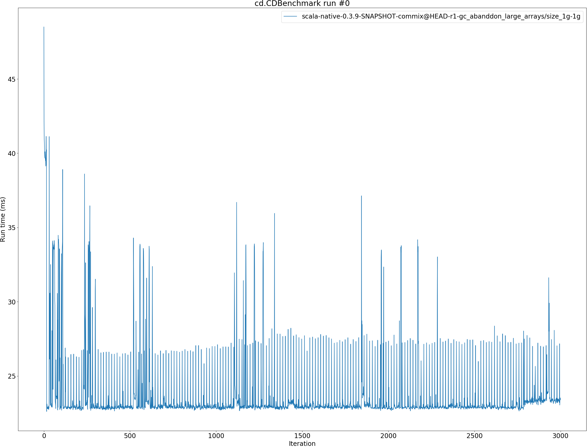

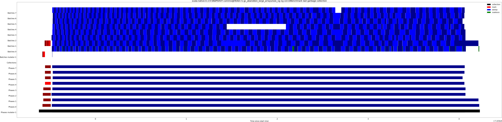

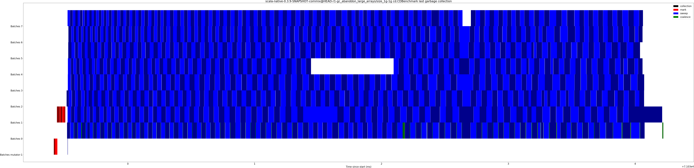

## kmeans.KmeansBenchmark
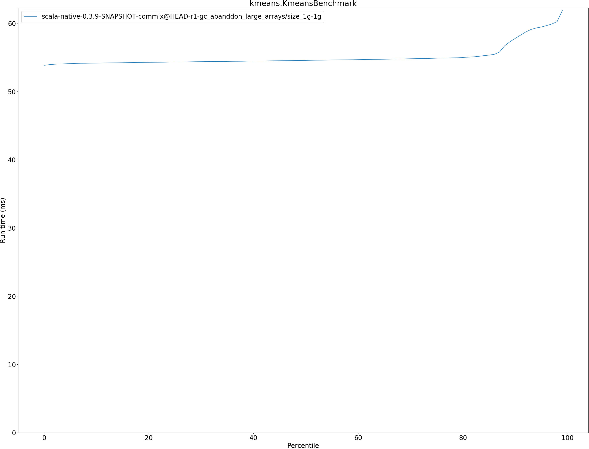

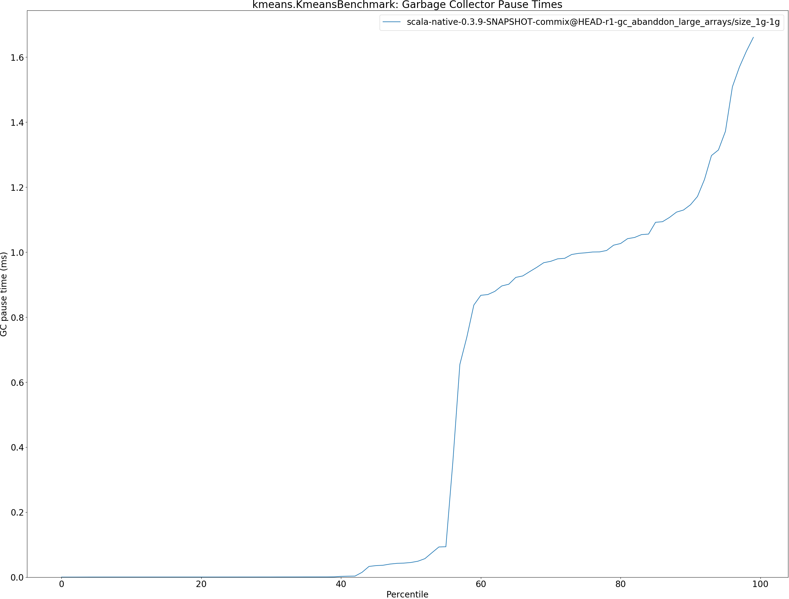

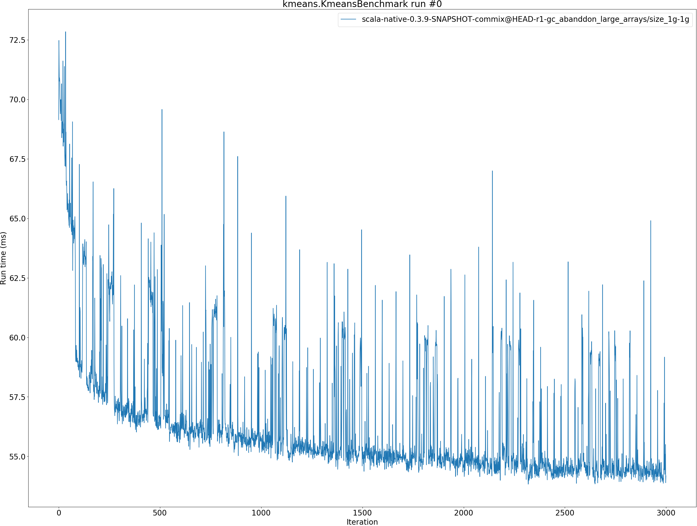

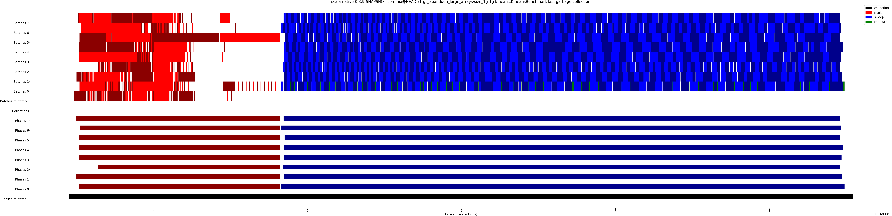

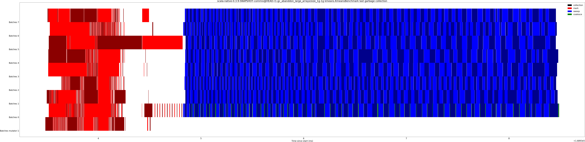

## gcbench.GCBenchBenchmark
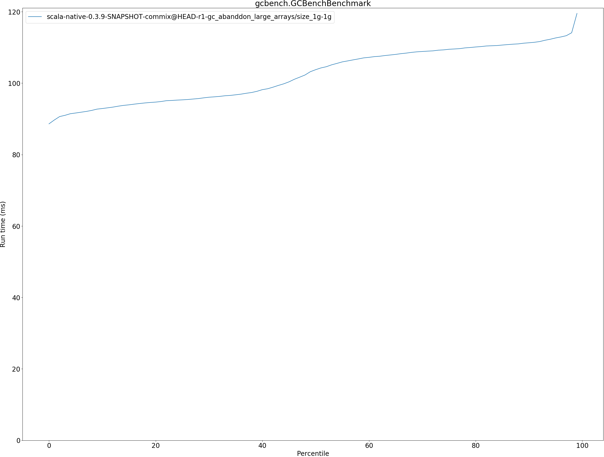

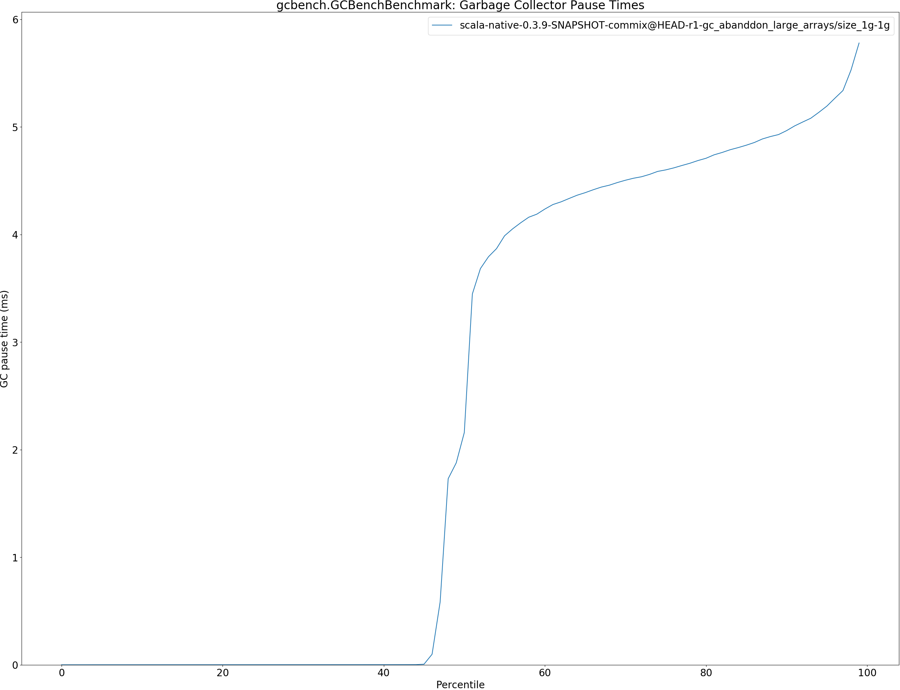

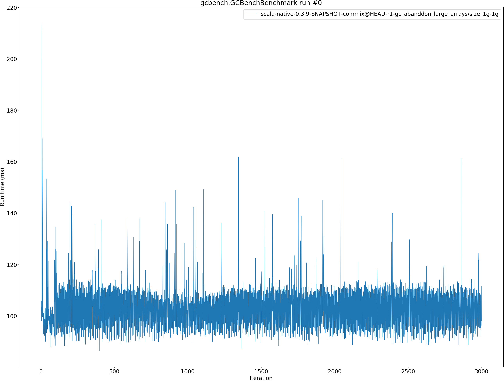

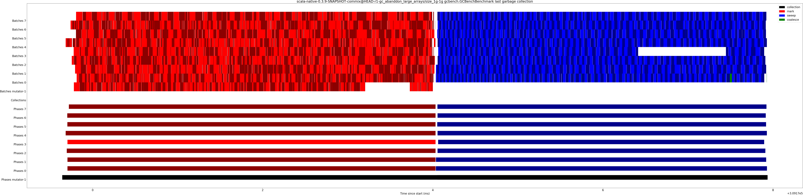

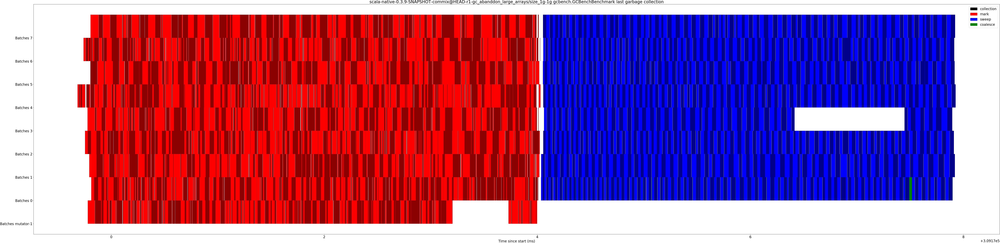

