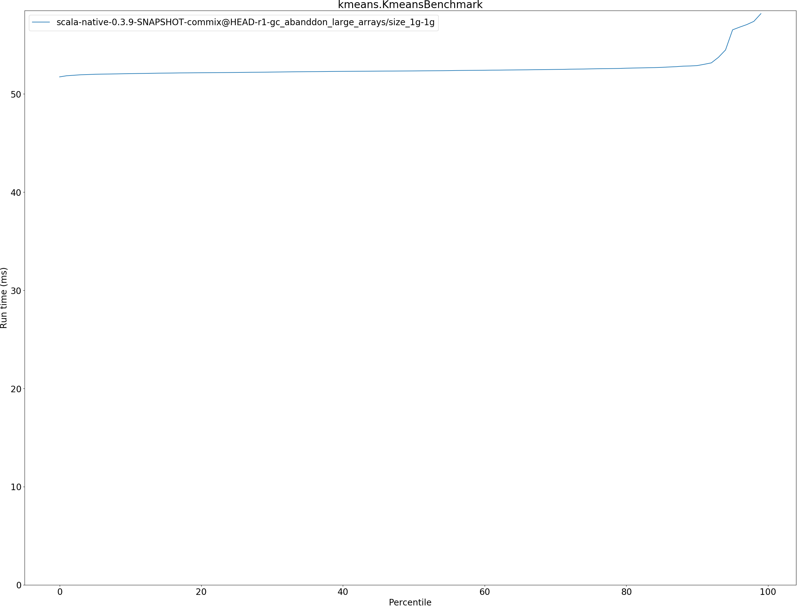

# Summary
## Benchmark run time (ms) at 50 percentile 

|name | scala-native-0.3.9-SNAPSHOT-commix@HEAD-r1-gc_abanddon_large_arrays/size_1g-1g|
| -- | -- |
|[cd.CDBenchmark](#cdcdbenchmark)|25.2414|
|[kmeans.KmeansBenchmark](#kmeanskmeansbenchmark)|52.3482|
|[gcbench.GCBenchBenchmark](#gcbenchgcbenchbenchmark)|115.0308|
| __Geometrical mean:__||
## Benchmark run time (ms) at 90 percentile 

|name | scala-native-0.3.9-SNAPSHOT-commix@HEAD-r1-gc_abanddon_large_arrays/size_1g-1g|
| -- | -- |
|[cd.CDBenchmark](#cdcdbenchmark)|29.6052|
|[kmeans.KmeansBenchmark](#kmeanskmeansbenchmark)|52.8925|
|[gcbench.GCBenchBenchmark](#gcbenchgcbenchbenchmark)|123.0096|
| __Geometrical mean:__||
## Benchmark run time (ms) at 99 percentile 

|name | scala-native-0.3.9-SNAPSHOT-commix@HEAD-r1-gc_abanddon_large_arrays/size_1g-1g|
| -- | -- |
|[cd.CDBenchmark](#cdcdbenchmark)|36.3412|
|[kmeans.KmeansBenchmark](#kmeanskmeansbenchmark)|58.1839|
|[gcbench.GCBenchBenchmark](#gcbenchgcbenchbenchmark)|151.8987|
| __Geometrical mean:__||
## Benchmark total run time (ms) 

|name | scala-native-0.3.9-SNAPSHOT-commix@HEAD-r1-gc_abanddon_large_arrays/size_1g-1g|
| -- | -- |
|[cd.CDBenchmark](#cdcdbenchmark)|26041.0654|
|[kmeans.KmeansBenchmark](#kmeanskmeansbenchmark)|52674.7102|
|[gcbench.GCBenchBenchmark](#gcbenchgcbenchbenchmark)|113425.0391|
| __Geometrical mean:__||
## Total GC time on Application thread (ms) 

|name |  | scala-native-0.3.9-SNAPSHOT-commix@HEAD-r1-gc_abanddon_large_arrays/size_1g-1g|
| -- | -- | -- |
|[cd.CDBenchmark](#cdcdbenchmark)|mark|235.2446|
||sweep|7.2876|
||total|242.5321|
|[kmeans.KmeansBenchmark](#kmeanskmeansbenchmark)|mark|319.6109|
||sweep|5.9671|
||total|325.5781|
|[gcbench.GCBenchBenchmark](#gcbenchgcbenchbenchmark)|mark|18243.1076|
||sweep|58.3470|
||total|18301.4546|
|__Geometrical mean:__|mark||
||sweep||
||total||
## GC pause time (ms) at 50 percentile 

|name | scala-native-0.3.9-SNAPSHOT-commix@HEAD-r1-gc_abanddon_large_arrays/size_1g-1g|
| -- | -- |
|[cd.CDBenchmark](#cdcdbenchmark)|0.0047|
|[kmeans.KmeansBenchmark](#kmeanskmeansbenchmark)|0.7056|
|[gcbench.GCBenchBenchmark](#gcbenchgcbenchbenchmark)|3.4577|
| __Geometrical mean:__||
## GC pause time (ms) at 90 percentile 

|name | scala-native-0.3.9-SNAPSHOT-commix@HEAD-r1-gc_abanddon_large_arrays/size_1g-1g|
| -- | -- |
|[cd.CDBenchmark](#cdcdbenchmark)|0.6729|
|[kmeans.KmeansBenchmark](#kmeanskmeansbenchmark)|2.0656|
|[gcbench.GCBenchBenchmark](#gcbenchgcbenchbenchmark)|6.5401|
| __Geometrical mean:__||
## GC pause time (ms) at 99 percentile 

|name | scala-native-0.3.9-SNAPSHOT-commix@HEAD-r1-gc_abanddon_large_arrays/size_1g-1g|
| -- | -- |
|[cd.CDBenchmark](#cdcdbenchmark)|0.9314|
|[kmeans.KmeansBenchmark](#kmeanskmeansbenchmark)|2.6786|
|[gcbench.GCBenchBenchmark](#gcbenchgcbenchbenchmark)|7.5502|
| __Geometrical mean:__||
# Individual benchmarks
## cd.CDBenchmark

## kmeans.KmeansBenchmark

## gcbench.GCBenchBenchmark

