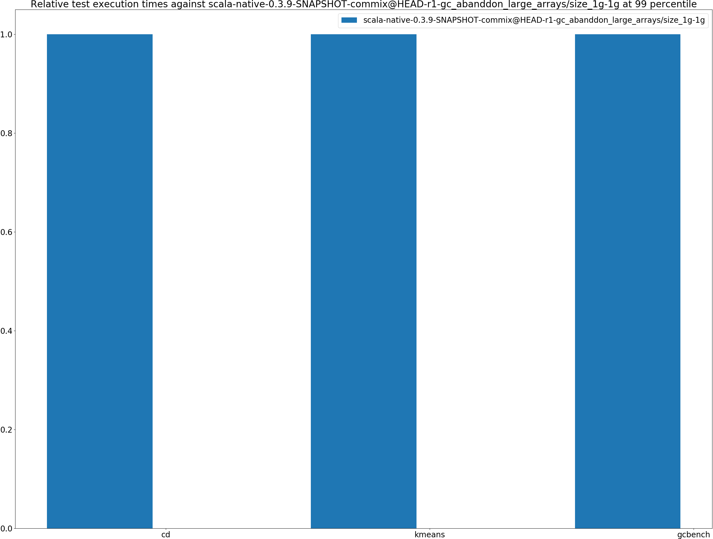

# Summary
## Benchmark run time (ms) at 50 percentile 

|name | scala-native-0.3.9-SNAPSHOT-commix@HEAD-r1-gc_abanddon_large_arrays/size_1g-1g|
| -- | -- |
|[cd.CDBenchmark](#cdcdbenchmark)|24.0852|
|[kmeans.KmeansBenchmark](#kmeanskmeansbenchmark)|54.0957|
|[gcbench.GCBenchBenchmark](#gcbenchgcbenchbenchmark)|105.3527|
| __Geometrical mean:__||
## Benchmark run time (ms) at 90 percentile 

|name | scala-native-0.3.9-SNAPSHOT-commix@HEAD-r1-gc_abanddon_large_arrays/size_1g-1g|
| -- | -- |
|[cd.CDBenchmark](#cdcdbenchmark)|24.6777|
|[kmeans.KmeansBenchmark](#kmeanskmeansbenchmark)|57.2271|
|[gcbench.GCBenchBenchmark](#gcbenchgcbenchbenchmark)|117.5936|
| __Geometrical mean:__||
## Benchmark run time (ms) at 99 percentile 

|name | scala-native-0.3.9-SNAPSHOT-commix@HEAD-r1-gc_abanddon_large_arrays/size_1g-1g|
| -- | -- |
|[cd.CDBenchmark](#cdcdbenchmark)|28.6815|
|[kmeans.KmeansBenchmark](#kmeanskmeansbenchmark)|60.1363|
|[gcbench.GCBenchBenchmark](#gcbenchgcbenchbenchmark)|132.6219|
| __Geometrical mean:__||
## Benchmark total run time (ms) 

|name | scala-native-0.3.9-SNAPSHOT-commix@HEAD-r1-gc_abanddon_large_arrays/size_1g-1g|
| -- | -- |
|[cd.CDBenchmark](#cdcdbenchmark)|24470.2936|
|[kmeans.KmeansBenchmark](#kmeanskmeansbenchmark)|54607.5615|
|[gcbench.GCBenchBenchmark](#gcbenchgcbenchbenchmark)|105391.7197|
| __Geometrical mean:__||
## Total GC time on Application thread (ms) 

|name |  | scala-native-0.3.9-SNAPSHOT-commix@HEAD-r1-gc_abanddon_large_arrays/size_1g-1g|
| -- | -- | -- |
|[cd.CDBenchmark](#cdcdbenchmark)|mark|1738.1245|
||sweep|24.2108|
||total|1762.3353|
|[kmeans.KmeansBenchmark](#kmeanskmeansbenchmark)|mark|560.3004|
||sweep|15.9596|
||total|576.2600|
|[gcbench.GCBenchBenchmark](#gcbenchgcbenchbenchmark)|mark|20112.8713|
||sweep|56.1347|
||total|20169.0060|
|__Geometrical mean:__|mark||
||sweep||
||total||
## GC pause time (ms) at 50 percentile 

|name | scala-native-0.3.9-SNAPSHOT-commix@HEAD-r1-gc_abanddon_large_arrays/size_1g-1g|
| -- | -- |
|[cd.CDBenchmark](#cdcdbenchmark)|0.0043|
|[kmeans.KmeansBenchmark](#kmeanskmeansbenchmark)|0.0517|
|[gcbench.GCBenchBenchmark](#gcbenchgcbenchbenchmark)|4.8690|
| __Geometrical mean:__||
## GC pause time (ms) at 90 percentile 

|name | scala-native-0.3.9-SNAPSHOT-commix@HEAD-r1-gc_abanddon_large_arrays/size_1g-1g|
| -- | -- |
|[cd.CDBenchmark](#cdcdbenchmark)|0.2481|
|[kmeans.KmeansBenchmark](#kmeanskmeansbenchmark)|1.7310|
|[gcbench.GCBenchBenchmark](#gcbenchgcbenchbenchmark)|5.7690|
| __Geometrical mean:__||
## GC pause time (ms) at 99 percentile 

|name | scala-native-0.3.9-SNAPSHOT-commix@HEAD-r1-gc_abanddon_large_arrays/size_1g-1g|
| -- | -- |
|[cd.CDBenchmark](#cdcdbenchmark)|0.3980|
|[kmeans.KmeansBenchmark](#kmeanskmeansbenchmark)|2.2849|
|[gcbench.GCBenchBenchmark](#gcbenchgcbenchbenchmark)|6.4177|
| __Geometrical mean:__||
# Individual benchmarks
## cd.CDBenchmark

## kmeans.KmeansBenchmark

## gcbench.GCBenchBenchmark

