# Summary
## Benchmark run time (ms) at 50 percentile 

|name | scala-native-0.3.9-SNAPSHOT-commix@HEAD-r1-gc_abanddon_large_arrays/size_1g-1g|
| -- | -- |
|[cd.CDBenchmark](#cdcdbenchmark)|25.3328|
|[kmeans.KmeansBenchmark](#kmeanskmeansbenchmark)|52.6656|
|[gcbench.GCBenchBenchmark](#gcbenchgcbenchbenchmark)|104.7698|
| __Geometrical mean:__||
## Benchmark run time (ms) at 90 percentile 

|name | scala-native-0.3.9-SNAPSHOT-commix@HEAD-r1-gc_abanddon_large_arrays/size_1g-1g|
| -- | -- |
|[cd.CDBenchmark](#cdcdbenchmark)|26.2894|
|[kmeans.KmeansBenchmark](#kmeanskmeansbenchmark)|54.8243|
|[gcbench.GCBenchBenchmark](#gcbenchgcbenchbenchmark)|113.9015|
| __Geometrical mean:__||
## Benchmark run time (ms) at 99 percentile 

|name | scala-native-0.3.9-SNAPSHOT-commix@HEAD-r1-gc_abanddon_large_arrays/size_1g-1g|
| -- | -- |
|[cd.CDBenchmark](#cdcdbenchmark)|35.9384|
|[kmeans.KmeansBenchmark](#kmeanskmeansbenchmark)|59.0441|
|[gcbench.GCBenchBenchmark](#gcbenchgcbenchbenchmark)|131.7823|
| __Geometrical mean:__||
## Benchmark total run time (ms) 

|name | scala-native-0.3.9-SNAPSHOT-commix@HEAD-r1-gc_abanddon_large_arrays/size_1g-1g|
| -- | -- |
|[cd.CDBenchmark](#cdcdbenchmark)|25898.2322|
|[kmeans.KmeansBenchmark](#kmeanskmeansbenchmark)|53102.0920|
|[gcbench.GCBenchBenchmark](#gcbenchgcbenchbenchmark)|104232.8829|
| __Geometrical mean:__||
## Total GC time on Application thread (ms) 
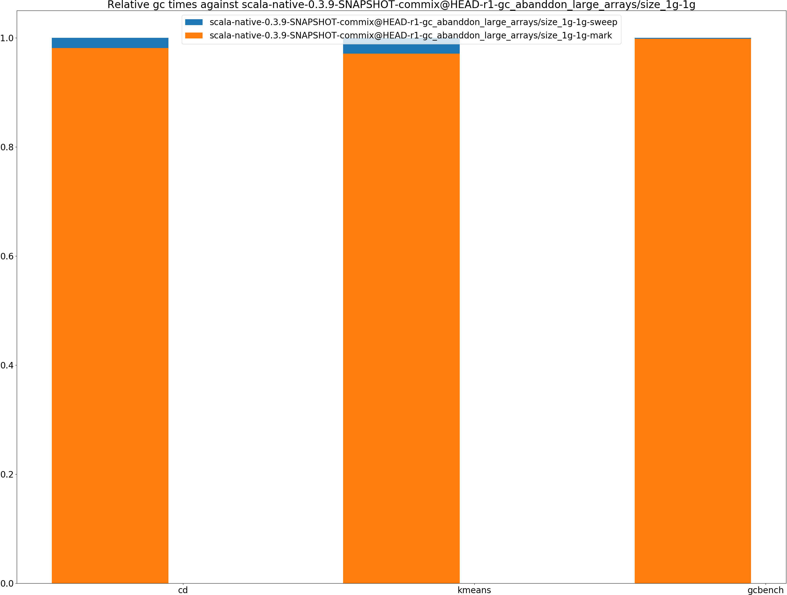

|name |  | scala-native-0.3.9-SNAPSHOT-commix@HEAD-r1-gc_abanddon_large_arrays/size_1g-1g|
| -- | -- | -- |
|[cd.CDBenchmark](#cdcdbenchmark)|mark|35.1011|
||sweep|0.6726|
||total|35.7737|
|[kmeans.KmeansBenchmark](#kmeanskmeansbenchmark)|mark|95.4622|
||sweep|2.8385|
||total|98.3007|
|[gcbench.GCBenchBenchmark](#gcbenchgcbenchbenchmark)|mark|7543.4127|
||sweep|12.9141|
||total|7556.3268|
|__Geometrical mean:__|mark||
||sweep||
||total||
## GC pause time (ms) at 50 percentile 
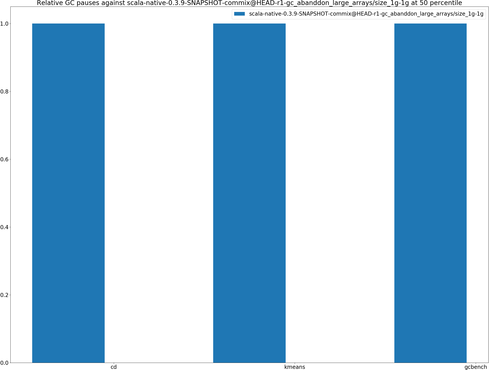

|name | scala-native-0.3.9-SNAPSHOT-commix@HEAD-r1-gc_abanddon_large_arrays/size_1g-1g|
| -- | -- |
|[cd.CDBenchmark](#cdcdbenchmark)|0.0043|
|[kmeans.KmeansBenchmark](#kmeanskmeansbenchmark)|0.0404|
|[gcbench.GCBenchBenchmark](#gcbenchgcbenchbenchmark)|0.0143|
| __Geometrical mean:__||
## GC pause time (ms) at 90 percentile 

|name | scala-native-0.3.9-SNAPSHOT-commix@HEAD-r1-gc_abanddon_large_arrays/size_1g-1g|
| -- | -- |
|[cd.CDBenchmark](#cdcdbenchmark)|0.2148|
|[kmeans.KmeansBenchmark](#kmeanskmeansbenchmark)|1.1429|
|[gcbench.GCBenchBenchmark](#gcbenchgcbenchbenchmark)|5.3261|
| __Geometrical mean:__||
## GC pause time (ms) at 99 percentile 

|name | scala-native-0.3.9-SNAPSHOT-commix@HEAD-r1-gc_abanddon_large_arrays/size_1g-1g|
| -- | -- |
|[cd.CDBenchmark](#cdcdbenchmark)|0.3253|
|[kmeans.KmeansBenchmark](#kmeanskmeansbenchmark)|1.3307|
|[gcbench.GCBenchBenchmark](#gcbenchgcbenchbenchmark)|5.8463|
| __Geometrical mean:__||
# Individual benchmarks
## cd.CDBenchmark
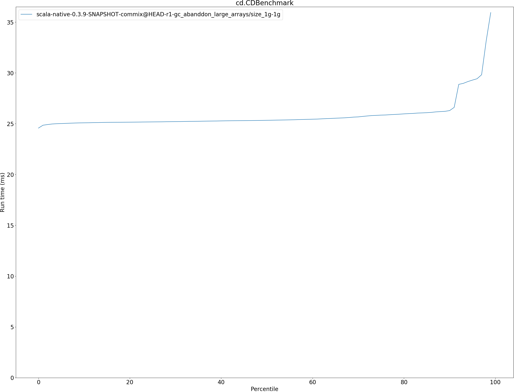

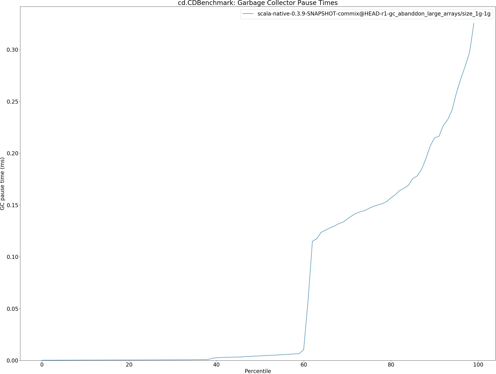

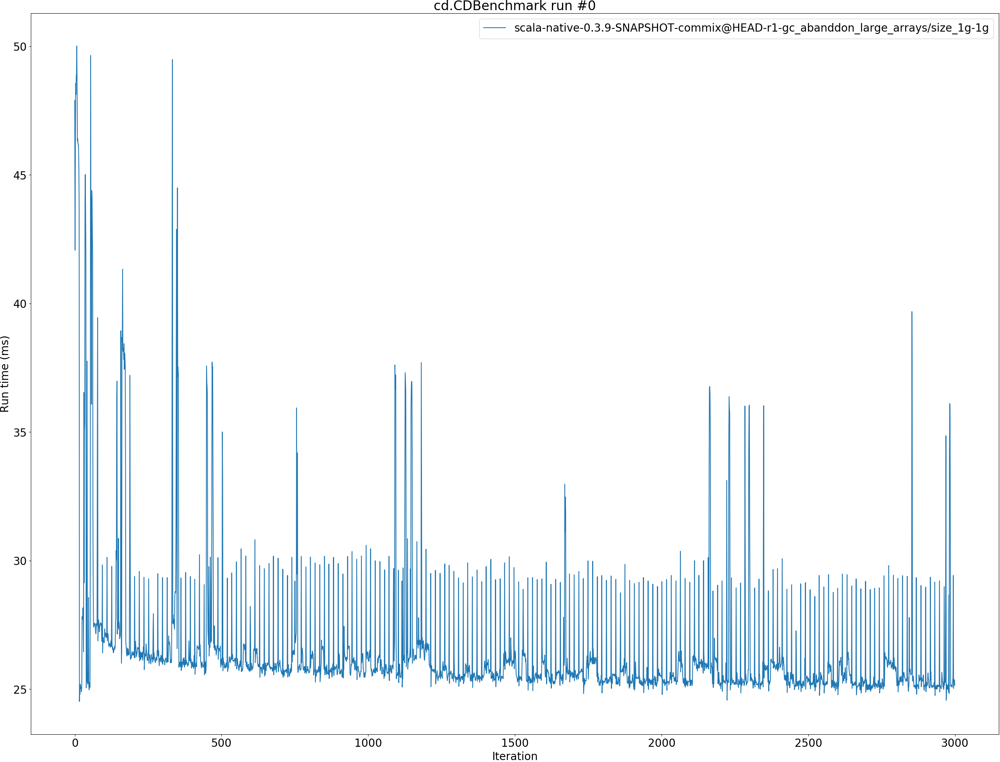

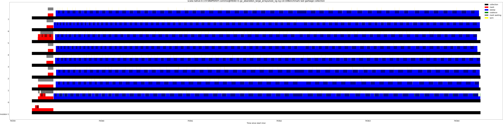

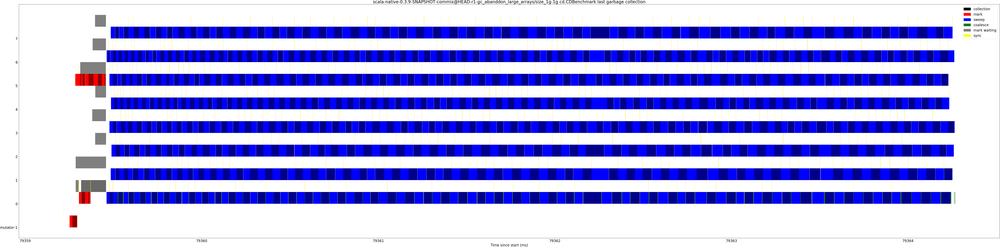

## kmeans.KmeansBenchmark
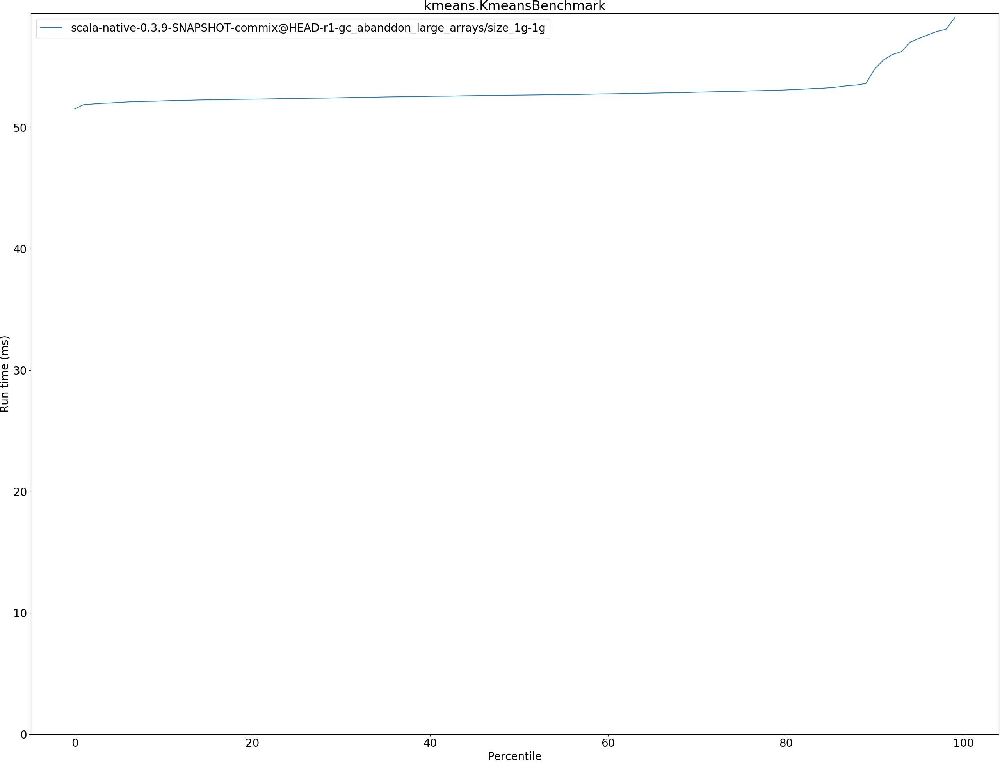

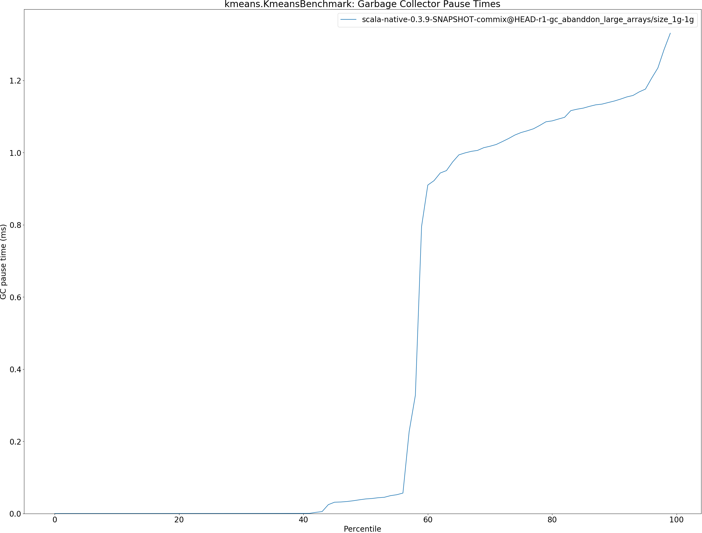

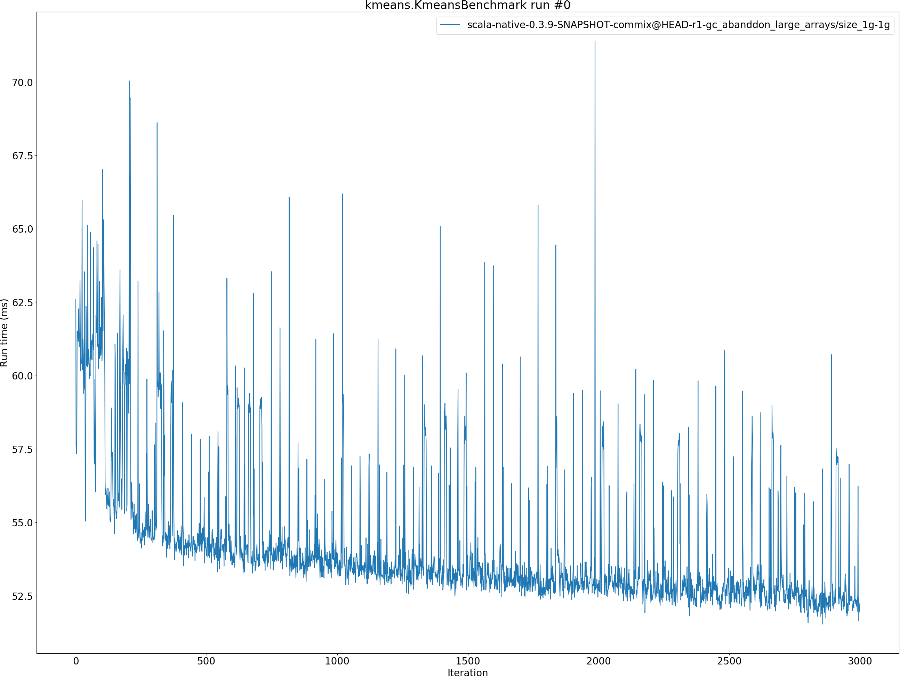

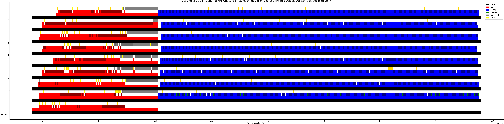

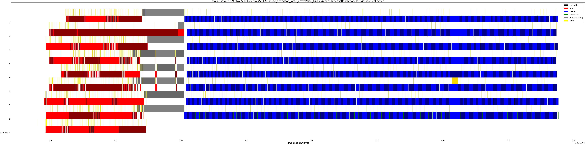

## gcbench.GCBenchBenchmark
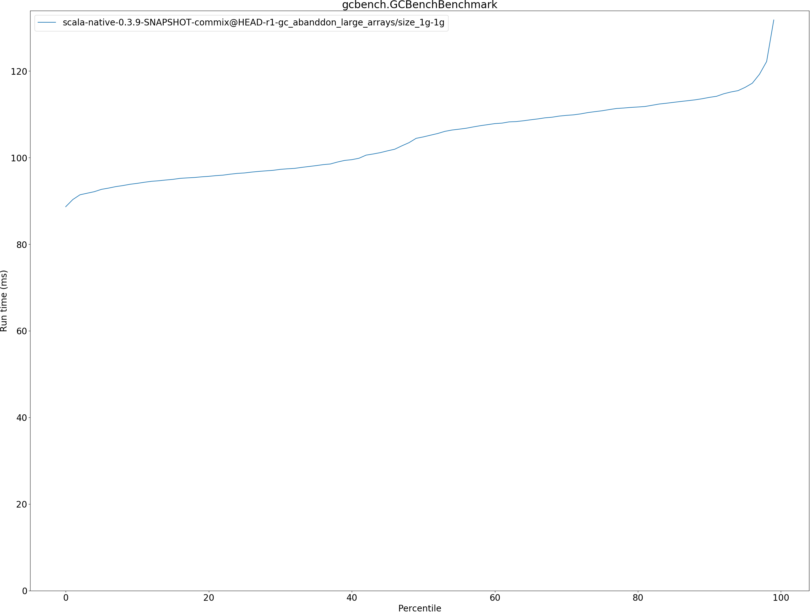

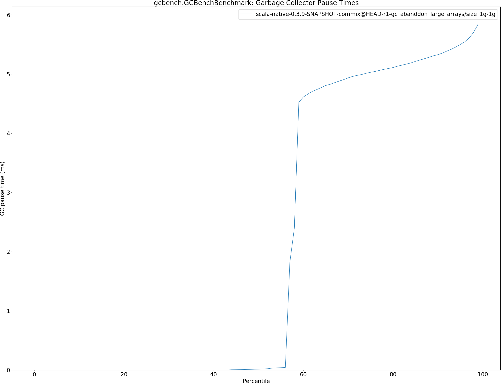

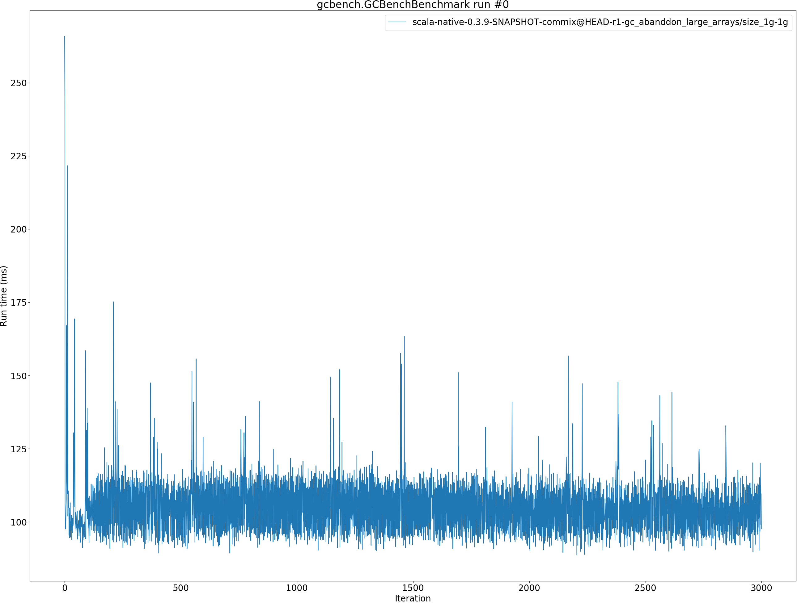

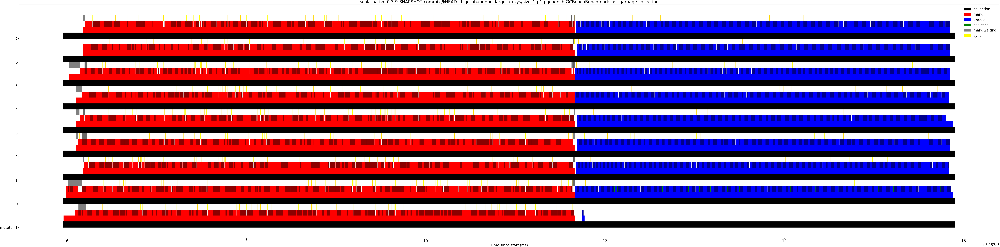

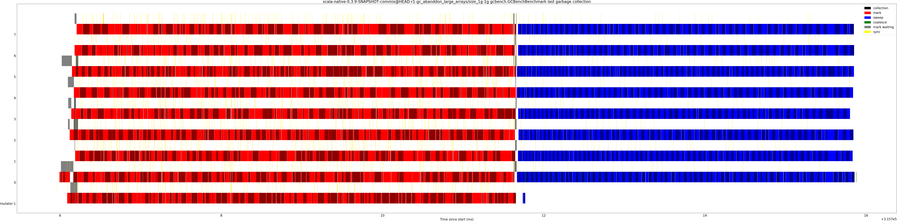

