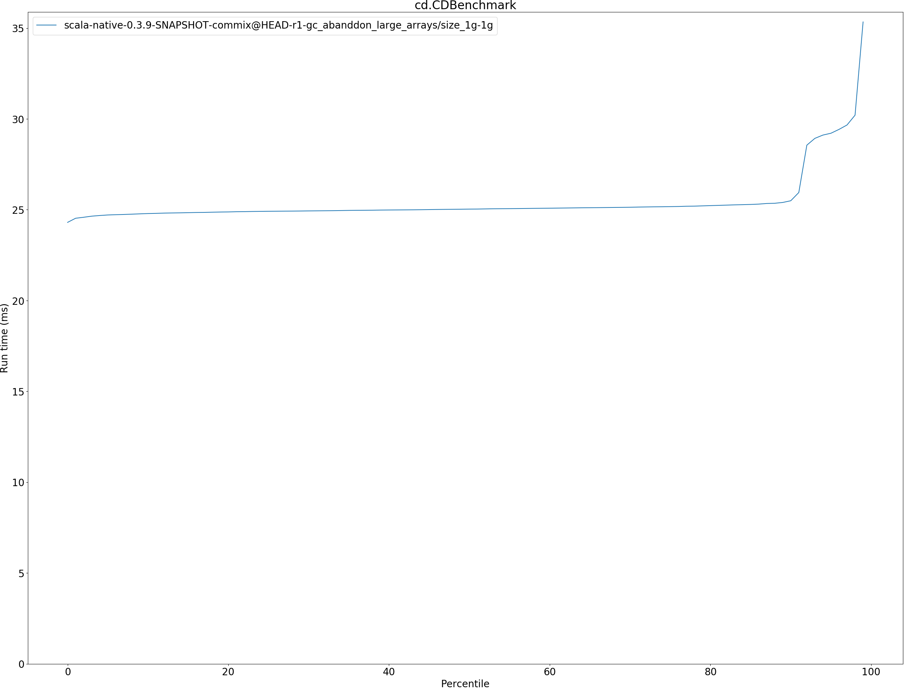
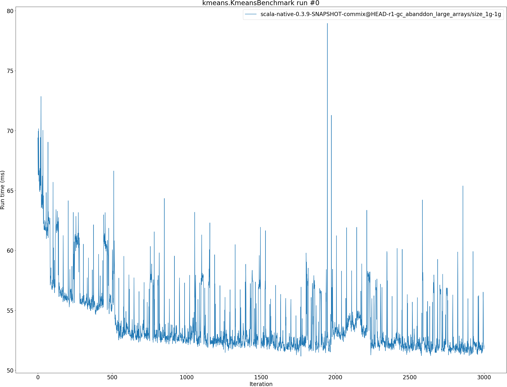
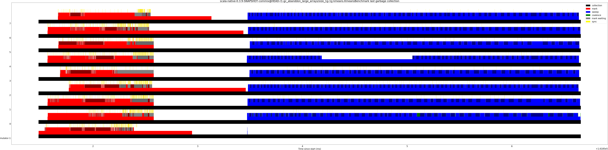

# Summary
## Benchmark run time (ms) at 50 percentile 

|name | scala-native-0.3.9-SNAPSHOT-commix@HEAD-r1-gc_abanddon_large_arrays/size_1g-1g|
| -- | -- |
|[cd.CDBenchmark](#cdcdbenchmark)|25.0343|
|[kmeans.KmeansBenchmark](#kmeanskmeansbenchmark)|52.2579|
|[gcbench.GCBenchBenchmark](#gcbenchgcbenchbenchmark)|105.1217|
| __Geometrical mean:__||
## Benchmark run time (ms) at 90 percentile 

|name | scala-native-0.3.9-SNAPSHOT-commix@HEAD-r1-gc_abanddon_large_arrays/size_1g-1g|
| -- | -- |
|[cd.CDBenchmark](#cdcdbenchmark)|25.4944|
|[kmeans.KmeansBenchmark](#kmeanskmeansbenchmark)|55.3244|
|[gcbench.GCBenchBenchmark](#gcbenchgcbenchbenchmark)|113.7943|
| __Geometrical mean:__||
## Benchmark run time (ms) at 99 percentile 

|name | scala-native-0.3.9-SNAPSHOT-commix@HEAD-r1-gc_abanddon_large_arrays/size_1g-1g|
| -- | -- |
|[cd.CDBenchmark](#cdcdbenchmark)|35.3393|
|[kmeans.KmeansBenchmark](#kmeanskmeansbenchmark)|59.8669|
|[gcbench.GCBenchBenchmark](#gcbenchgcbenchbenchmark)|129.7721|
| __Geometrical mean:__||
## Benchmark total run time (ms) 

|name | scala-native-0.3.9-SNAPSHOT-commix@HEAD-r1-gc_abanddon_large_arrays/size_1g-1g|
| -- | -- |
|[cd.CDBenchmark](#cdcdbenchmark)|25475.0743|
|[kmeans.KmeansBenchmark](#kmeanskmeansbenchmark)|52956.2221|
|[gcbench.GCBenchBenchmark](#gcbenchgcbenchbenchmark)|104119.1871|
| __Geometrical mean:__||
## Total GC time on Application thread (ms) 

|name |  | scala-native-0.3.9-SNAPSHOT-commix@HEAD-r1-gc_abanddon_large_arrays/size_1g-1g|
| -- | -- | -- |
|[cd.CDBenchmark](#cdcdbenchmark)|mark|60.9528|
||sweep|1.0537|
||total|62.0065|
|[kmeans.KmeansBenchmark](#kmeanskmeansbenchmark)|mark|118.2860|
||sweep|6.7990|
||total|125.0850|
|[gcbench.GCBenchBenchmark](#gcbenchgcbenchbenchmark)|mark|8000.5738|
||sweep|25.2571|
||total|8025.8309|
|__Geometrical mean:__|mark||
||sweep||
||total||
## GC pause time (ms) at 50 percentile 

|name | scala-native-0.3.9-SNAPSHOT-commix@HEAD-r1-gc_abanddon_large_arrays/size_1g-1g|
| -- | -- |
|[cd.CDBenchmark](#cdcdbenchmark)|0.0046|
|[kmeans.KmeansBenchmark](#kmeanskmeansbenchmark)|0.0448|
|[gcbench.GCBenchBenchmark](#gcbenchgcbenchbenchmark)|0.0039|
| __Geometrical mean:__||
## GC pause time (ms) at 90 percentile 

|name | scala-native-0.3.9-SNAPSHOT-commix@HEAD-r1-gc_abanddon_large_arrays/size_1g-1g|
| -- | -- |
|[cd.CDBenchmark](#cdcdbenchmark)|0.2860|
|[kmeans.KmeansBenchmark](#kmeanskmeansbenchmark)|1.4922|
|[gcbench.GCBenchBenchmark](#gcbenchgcbenchbenchmark)|5.7405|
| __Geometrical mean:__||
## GC pause time (ms) at 99 percentile 

|name | scala-native-0.3.9-SNAPSHOT-commix@HEAD-r1-gc_abanddon_large_arrays/size_1g-1g|
| -- | -- |
|[cd.CDBenchmark](#cdcdbenchmark)|0.7784|
|[kmeans.KmeansBenchmark](#kmeanskmeansbenchmark)|1.9110|
|[gcbench.GCBenchBenchmark](#gcbenchgcbenchbenchmark)|6.3793|
| __Geometrical mean:__||
# Individual benchmarks
## cd.CDBenchmark

## kmeans.KmeansBenchmark

## gcbench.GCBenchBenchmark

