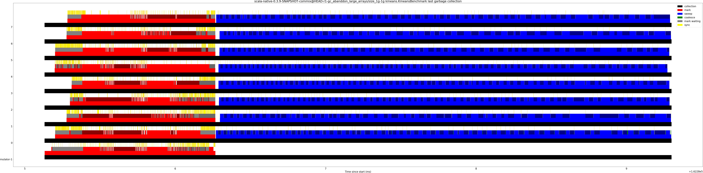

# Summary
## Benchmark run time (ms) at 50 percentile 

|name | scala-native-0.3.9-SNAPSHOT-commix@HEAD-r1-gc_abanddon_large_arrays/size_1g-1g|
| -- | -- |
|[cd.CDBenchmark](#cdcdbenchmark)|24.7228|
|[kmeans.KmeansBenchmark](#kmeanskmeansbenchmark)|52.5256|
|[gcbench.GCBenchBenchmark](#gcbenchgcbenchbenchmark)|104.7926|
| __Geometrical mean:__||
## Benchmark run time (ms) at 90 percentile 

|name | scala-native-0.3.9-SNAPSHOT-commix@HEAD-r1-gc_abanddon_large_arrays/size_1g-1g|
| -- | -- |
|[cd.CDBenchmark](#cdcdbenchmark)|25.2644|
|[kmeans.KmeansBenchmark](#kmeanskmeansbenchmark)|55.9351|
|[gcbench.GCBenchBenchmark](#gcbenchgcbenchbenchmark)|114.1036|
| __Geometrical mean:__||
## Benchmark run time (ms) at 99 percentile 

|name | scala-native-0.3.9-SNAPSHOT-commix@HEAD-r1-gc_abanddon_large_arrays/size_1g-1g|
| -- | -- |
|[cd.CDBenchmark](#cdcdbenchmark)|28.9094|
|[kmeans.KmeansBenchmark](#kmeanskmeansbenchmark)|59.2427|
|[gcbench.GCBenchBenchmark](#gcbenchgcbenchbenchmark)|125.1768|
| __Geometrical mean:__||
## Benchmark total run time (ms) 

|name | scala-native-0.3.9-SNAPSHOT-commix@HEAD-r1-gc_abanddon_large_arrays/size_1g-1g|
| -- | -- |
|[cd.CDBenchmark](#cdcdbenchmark)|25010.8517|
|[kmeans.KmeansBenchmark](#kmeanskmeansbenchmark)|53088.2373|
|[gcbench.GCBenchBenchmark](#gcbenchgcbenchbenchmark)|103613.7923|
| __Geometrical mean:__||
## Total GC time on Application thread (ms) 

|name |  | scala-native-0.3.9-SNAPSHOT-commix@HEAD-r1-gc_abanddon_large_arrays/size_1g-1g|
| -- | -- | -- |
|[cd.CDBenchmark](#cdcdbenchmark)|mark|38.2562|
||sweep|0.8791|
||total|39.1353|
|[kmeans.KmeansBenchmark](#kmeanskmeansbenchmark)|mark|94.1188|
||sweep|3.8360|
||total|97.9549|
|[gcbench.GCBenchBenchmark](#gcbenchgcbenchbenchmark)|mark|7741.9228|
||sweep|14.3608|
||total|7756.2836|
|__Geometrical mean:__|mark||
||sweep||
||total||
## GC pause time (ms) at 50 percentile 

|name | scala-native-0.3.9-SNAPSHOT-commix@HEAD-r1-gc_abanddon_large_arrays/size_1g-1g|
| -- | -- |
|[cd.CDBenchmark](#cdcdbenchmark)|0.0044|
|[kmeans.KmeansBenchmark](#kmeanskmeansbenchmark)|0.0406|
|[gcbench.GCBenchBenchmark](#gcbenchgcbenchbenchmark)|0.0169|
| __Geometrical mean:__||
## GC pause time (ms) at 90 percentile 

|name | scala-native-0.3.9-SNAPSHOT-commix@HEAD-r1-gc_abanddon_large_arrays/size_1g-1g|
| -- | -- |
|[cd.CDBenchmark](#cdcdbenchmark)|0.2212|
|[kmeans.KmeansBenchmark](#kmeanskmeansbenchmark)|1.1348|
|[gcbench.GCBenchBenchmark](#gcbenchgcbenchbenchmark)|5.4403|
| __Geometrical mean:__||
## GC pause time (ms) at 99 percentile 

|name | scala-native-0.3.9-SNAPSHOT-commix@HEAD-r1-gc_abanddon_large_arrays/size_1g-1g|
| -- | -- |
|[cd.CDBenchmark](#cdcdbenchmark)|0.3586|
|[kmeans.KmeansBenchmark](#kmeanskmeansbenchmark)|1.5698|
|[gcbench.GCBenchBenchmark](#gcbenchgcbenchbenchmark)|6.0377|
| __Geometrical mean:__||
# Individual benchmarks
## cd.CDBenchmark

## kmeans.KmeansBenchmark

## gcbench.GCBenchBenchmark

