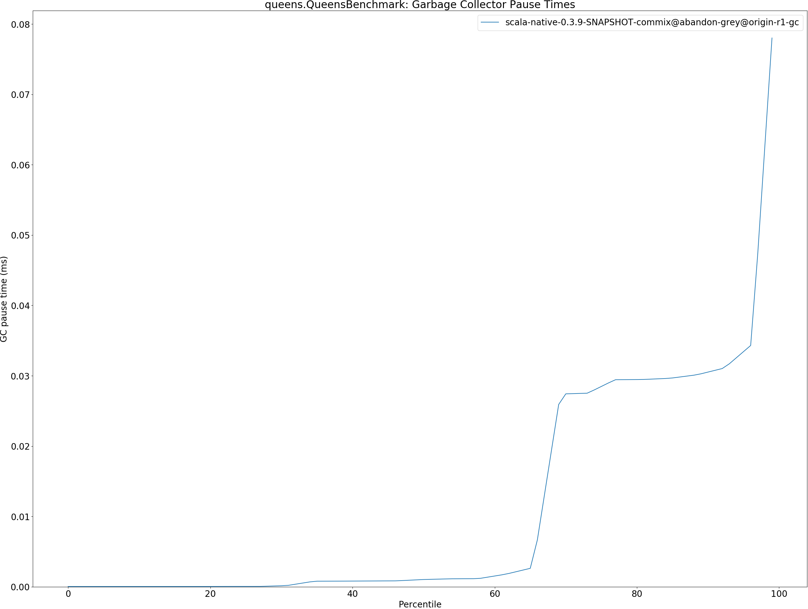
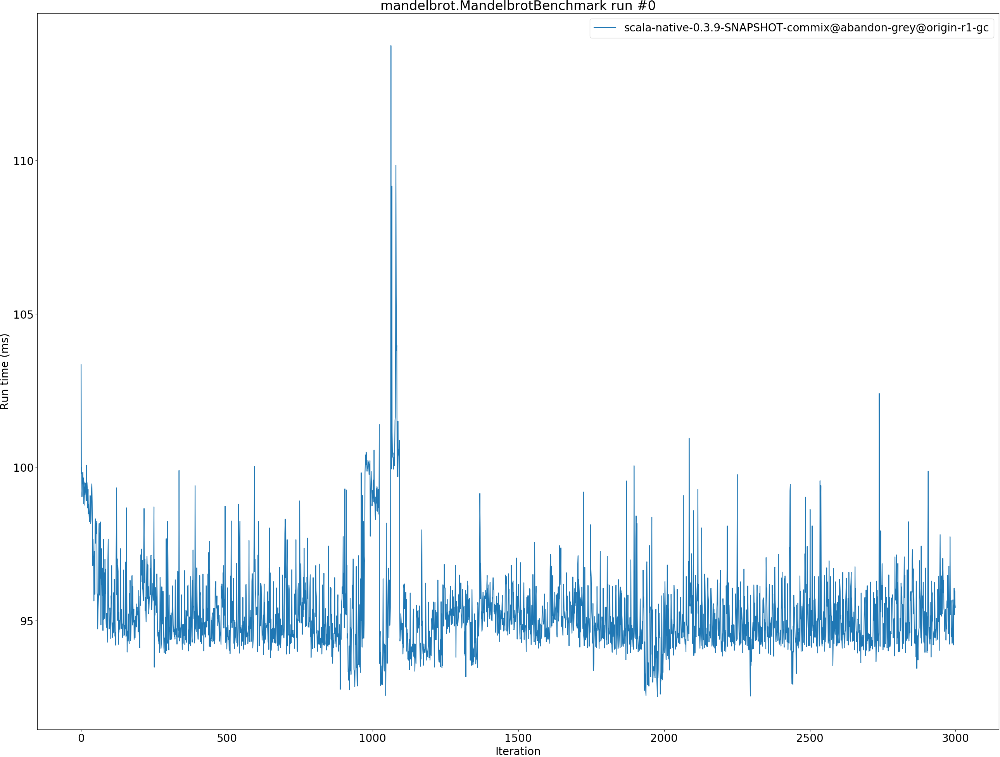
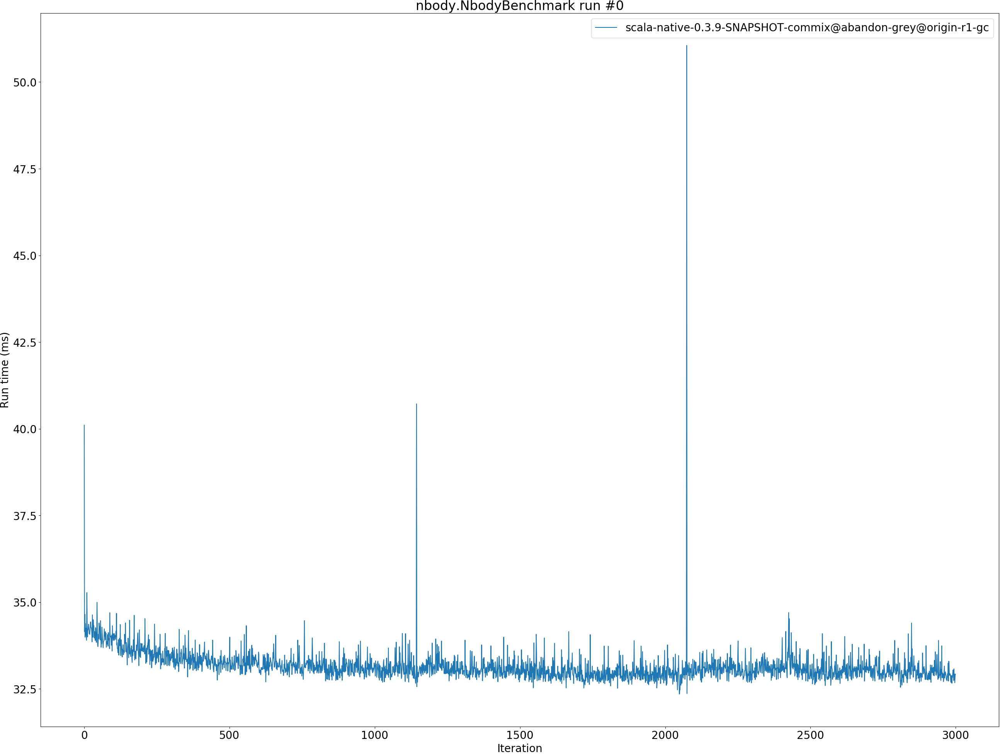

# Summary
## Benchmark run time (ms) at 50 percentile 

|name | scala-native-0.3.9-SNAPSHOT-commix@abandon-grey@origin-r1-gc|
| -- | -- |
|[bounce.BounceBenchmark](#bouncebouncebenchmark)|0.0531|
|[richards.RichardsBenchmark](#richardsrichardsbenchmark)|0.0686|
|[queens.QueensBenchmark](#queensqueensbenchmark)|0.0940|
|[permute.PermuteBenchmark](#permutepermutebenchmark)|0.2306|
|[deltablue.DeltaBlueBenchmark](#deltabluedeltabluebenchmark)|0.1910|
|[tracer.TracerBenchmark](#tracertracerbenchmark)|0.7887|
|[brainfuck.BrainfuckBenchmark](#brainfuckbrainfuckbenchmark)|4.5059|
|[json.JsonBenchmark](#jsonjsonbenchmark)|1.6007|
|[cd.CDBenchmark](#cdcdbenchmark)|25.0712|
|[kmeans.KmeansBenchmark](#kmeanskmeansbenchmark)|59.3603|
|[gcbench.GCBenchBenchmark](#gcbenchgcbenchbenchmark)|101.5882|
|[mandelbrot.MandelbrotBenchmark](#mandelbrotmandelbrotbenchmark)|94.7943|
|[nbody.NbodyBenchmark](#nbodynbodybenchmark)|33.0074|
|[sudoku.SudokuBenchmark](#sudokusudokubenchmark)|2.5581|
| __Geometrical mean:__||
## Benchmark run time (ms) at 90 percentile 

|name | scala-native-0.3.9-SNAPSHOT-commix@abandon-grey@origin-r1-gc|
| -- | -- |
|[bounce.BounceBenchmark](#bouncebouncebenchmark)|0.0536|
|[richards.RichardsBenchmark](#richardsrichardsbenchmark)|0.0692|
|[queens.QueensBenchmark](#queensqueensbenchmark)|0.0948|
|[permute.PermuteBenchmark](#permutepermutebenchmark)|0.2357|
|[deltablue.DeltaBlueBenchmark](#deltabluedeltabluebenchmark)|0.1955|
|[tracer.TracerBenchmark](#tracertracerbenchmark)|0.9526|
|[brainfuck.BrainfuckBenchmark](#brainfuckbrainfuckbenchmark)|4.7256|
|[json.JsonBenchmark](#jsonjsonbenchmark)|1.8115|
|[cd.CDBenchmark](#cdcdbenchmark)|25.3844|
|[kmeans.KmeansBenchmark](#kmeanskmeansbenchmark)|60.4356|
|[gcbench.GCBenchBenchmark](#gcbenchgcbenchbenchmark)|107.1838|
|[mandelbrot.MandelbrotBenchmark](#mandelbrotmandelbrotbenchmark)|96.2520|
|[nbody.NbodyBenchmark](#nbodynbodybenchmark)|33.3450|
|[sudoku.SudokuBenchmark](#sudokusudokubenchmark)|2.9807|
| __Geometrical mean:__||
## Benchmark run time (ms) at 99 percentile 

|name | scala-native-0.3.9-SNAPSHOT-commix@abandon-grey@origin-r1-gc|
| -- | -- |
|[bounce.BounceBenchmark](#bouncebouncebenchmark)|0.0565|
|[richards.RichardsBenchmark](#richardsrichardsbenchmark)|0.0764|
|[queens.QueensBenchmark](#queensqueensbenchmark)|0.1018|
|[permute.PermuteBenchmark](#permutepermutebenchmark)|0.3675|
|[deltablue.DeltaBlueBenchmark](#deltabluedeltabluebenchmark)|0.4942|
|[tracer.TracerBenchmark](#tracertracerbenchmark)|1.0233|
|[brainfuck.BrainfuckBenchmark](#brainfuckbrainfuckbenchmark)|4.8724|
|[json.JsonBenchmark](#jsonjsonbenchmark)|1.8953|
|[cd.CDBenchmark](#cdcdbenchmark)|25.8583|
|[kmeans.KmeansBenchmark](#kmeanskmeansbenchmark)|62.7617|
|[gcbench.GCBenchBenchmark](#gcbenchgcbenchbenchmark)|109.9583|
|[mandelbrot.MandelbrotBenchmark](#mandelbrotmandelbrotbenchmark)|99.0798|
|[nbody.NbodyBenchmark](#nbodynbodybenchmark)|33.8990|
|[sudoku.SudokuBenchmark](#sudokusudokubenchmark)|3.4789|
| __Geometrical mean:__||
## Benchmark total run time (ms) 

|name | scala-native-0.3.9-SNAPSHOT-commix@abandon-grey@origin-r1-gc|
| -- | -- |
|[bounce.BounceBenchmark](#bouncebouncebenchmark)|53.2767|
|[richards.RichardsBenchmark](#richardsrichardsbenchmark)|68.8812|
|[queens.QueensBenchmark](#queensqueensbenchmark)|94.4435|
|[permute.PermuteBenchmark](#permutepermutebenchmark)|235.1767|
|[deltablue.DeltaBlueBenchmark](#deltabluedeltabluebenchmark)|200.3942|
|[tracer.TracerBenchmark](#tracertracerbenchmark)|840.1781|
|[brainfuck.BrainfuckBenchmark](#brainfuckbrainfuckbenchmark)|4533.0015|
|[json.JsonBenchmark](#jsonjsonbenchmark)|1627.6166|
|[cd.CDBenchmark](#cdcdbenchmark)|25093.9091|
|[kmeans.KmeansBenchmark](#kmeanskmeansbenchmark)|59329.1076|
|[gcbench.GCBenchBenchmark](#gcbenchgcbenchbenchmark)|102124.2375|
|[mandelbrot.MandelbrotBenchmark](#mandelbrotmandelbrotbenchmark)|95071.3189|
|[nbody.NbodyBenchmark](#nbodynbodybenchmark)|33063.3782|
|[sudoku.SudokuBenchmark](#sudokusudokubenchmark)|2639.3395|
| __Geometrical mean:__||
## Total GC time on Application thread (ms) 

|name |  | scala-native-0.3.9-SNAPSHOT-commix@abandon-grey@origin-r1-gc|
| -- | -- | -- |
|[bounce.BounceBenchmark](#bouncebouncebenchmark)|mark|0.3412|
||sweep|0.0089|
||total|0.3501|
|[richards.RichardsBenchmark](#richardsrichardsbenchmark)|mark|0.6037|
||sweep|0.0199|
||total|0.6237|
|[queens.QueensBenchmark](#queensqueensbenchmark)|mark|0.3325|
||sweep|0.0116|
||total|0.3441|
|[permute.PermuteBenchmark](#permutepermutebenchmark)|mark|5.4508|
||sweep|0.3303|
||total|5.7812|
|[deltablue.DeltaBlueBenchmark](#deltabluedeltabluebenchmark)|mark|11.0281|
||sweep|0.2501|
||total|11.2781|
|[tracer.TracerBenchmark](#tracertracerbenchmark)|mark|59.0090|
||sweep|9.1644|
||total|68.1734|
|[brainfuck.BrainfuckBenchmark](#brainfuckbrainfuckbenchmark)|mark|69.0242|
||sweep|3.9366|
||total|72.9608|
|[json.JsonBenchmark](#jsonjsonbenchmark)|mark|30.8789|
||sweep|0.9824|
||total|31.8613|
|[cd.CDBenchmark](#cdcdbenchmark)|mark|592.5476|
||sweep|13.7519|
||total|606.2995|
|[kmeans.KmeansBenchmark](#kmeanskmeansbenchmark)|mark|2361.6862|
||sweep|3.3530|
||total|2365.0392|
|[gcbench.GCBenchBenchmark](#gcbenchgcbenchbenchmark)|mark|6005.0025|
||sweep|8.0517|
||total|6013.0542|
|[mandelbrot.MandelbrotBenchmark](#mandelbrotmandelbrotbenchmark)|mark|0.0000|
||sweep|0.0000|
||total|0.0000|
|[nbody.NbodyBenchmark](#nbodynbodybenchmark)|mark|158.8121|
||sweep|7.7430|
||total|166.5552|
|[sudoku.SudokuBenchmark](#sudokusudokubenchmark)|mark|73.5925|
||sweep|13.0488|
||total|86.6413|
|__Geometrical mean:__|mark||
||sweep||
||total||
## GC pause time (ms) at 50 percentile 

|name | scala-native-0.3.9-SNAPSHOT-commix@abandon-grey@origin-r1-gc|
| -- | -- |
|[bounce.BounceBenchmark](#bouncebouncebenchmark)|0.0015|
|[richards.RichardsBenchmark](#richardsrichardsbenchmark)|0.0009|
|[queens.QueensBenchmark](#queensqueensbenchmark)|0.0010|
|[permute.PermuteBenchmark](#permutepermutebenchmark)|0.0018|
|[deltablue.DeltaBlueBenchmark](#deltabluedeltabluebenchmark)|0.0022|
|[tracer.TracerBenchmark](#tracertracerbenchmark)|0.0026|
|[brainfuck.BrainfuckBenchmark](#brainfuckbrainfuckbenchmark)|0.0056|
|[json.JsonBenchmark](#jsonjsonbenchmark)|0.0025|
|[cd.CDBenchmark](#cdcdbenchmark)|0.0054|
|[kmeans.KmeansBenchmark](#kmeanskmeansbenchmark)|0.0037|
|[gcbench.GCBenchBenchmark](#gcbenchgcbenchbenchmark)|0.0064|
|[mandelbrot.MandelbrotBenchmark](#mandelbrotmandelbrotbenchmark)|0.0000|
|[nbody.NbodyBenchmark](#nbodynbodybenchmark)|0.0010|
|[sudoku.SudokuBenchmark](#sudokusudokubenchmark)|0.0135|
| __Geometrical mean:__||
## GC pause time (ms) at 90 percentile 

|name | scala-native-0.3.9-SNAPSHOT-commix@abandon-grey@origin-r1-gc|
| -- | -- |
|[bounce.BounceBenchmark](#bouncebouncebenchmark)|0.0340|
|[richards.RichardsBenchmark](#richardsrichardsbenchmark)|0.0294|
|[queens.QueensBenchmark](#queensqueensbenchmark)|0.0305|
|[permute.PermuteBenchmark](#permutepermutebenchmark)|0.0503|
|[deltablue.DeltaBlueBenchmark](#deltabluedeltabluebenchmark)|0.1380|
|[tracer.TracerBenchmark](#tracertracerbenchmark)|0.0564|
|[brainfuck.BrainfuckBenchmark](#brainfuckbrainfuckbenchmark)|0.1384|
|[json.JsonBenchmark](#jsonjsonbenchmark)|0.0780|
|[cd.CDBenchmark](#cdcdbenchmark)|0.2143|
|[kmeans.KmeansBenchmark](#kmeanskmeansbenchmark)|0.8372|
|[gcbench.GCBenchBenchmark](#gcbenchgcbenchbenchmark)|2.4950|
|[mandelbrot.MandelbrotBenchmark](#mandelbrotmandelbrotbenchmark)|0.0000|
|[nbody.NbodyBenchmark](#nbodynbodybenchmark)|0.0269|
|[sudoku.SudokuBenchmark](#sudokusudokubenchmark)|0.2445|
| __Geometrical mean:__||
## GC pause time (ms) at 99 percentile 

|name | scala-native-0.3.9-SNAPSHOT-commix@abandon-grey@origin-r1-gc|
| -- | -- |
|[bounce.BounceBenchmark](#bouncebouncebenchmark)|0.1903|
|[richards.RichardsBenchmark](#richardsrichardsbenchmark)|0.1289|
|[queens.QueensBenchmark](#queensqueensbenchmark)|0.0780|
|[permute.PermuteBenchmark](#permutepermutebenchmark)|0.0670|
|[deltablue.DeltaBlueBenchmark](#deltabluedeltabluebenchmark)|0.3062|
|[tracer.TracerBenchmark](#tracertracerbenchmark)|0.0726|
|[brainfuck.BrainfuckBenchmark](#brainfuckbrainfuckbenchmark)|0.2291|
|[json.JsonBenchmark](#jsonjsonbenchmark)|0.1837|
|[cd.CDBenchmark](#cdcdbenchmark)|0.3493|
|[kmeans.KmeansBenchmark](#kmeanskmeansbenchmark)|0.9266|
|[gcbench.GCBenchBenchmark](#gcbenchgcbenchbenchmark)|3.2203|
|[mandelbrot.MandelbrotBenchmark](#mandelbrotmandelbrotbenchmark)|0.0000|
|[nbody.NbodyBenchmark](#nbodynbodybenchmark)|0.0432|
|[sudoku.SudokuBenchmark](#sudokusudokubenchmark)|0.2962|
| __Geometrical mean:__||
# Individual benchmarks
## bounce.BounceBenchmark

## richards.RichardsBenchmark

## queens.QueensBenchmark

## permute.PermuteBenchmark

## deltablue.DeltaBlueBenchmark

## tracer.TracerBenchmark

## brainfuck.BrainfuckBenchmark

## json.JsonBenchmark

## cd.CDBenchmark

## kmeans.KmeansBenchmark

## gcbench.GCBenchBenchmark

## mandelbrot.MandelbrotBenchmark

## nbody.NbodyBenchmark

## sudoku.SudokuBenchmark

