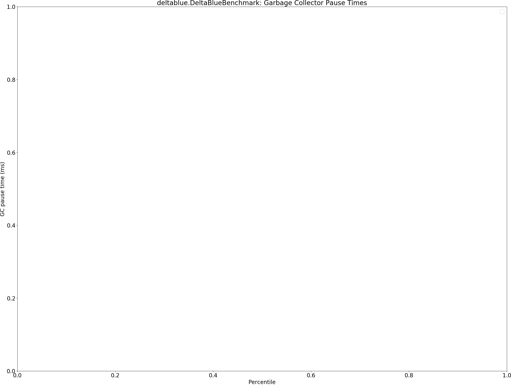
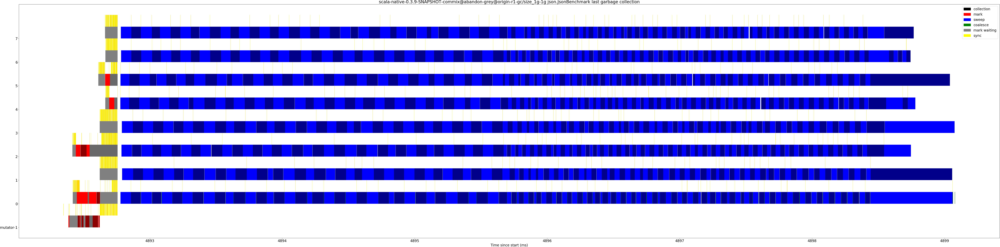

# Summary
## Benchmark run time (ms) at 50 percentile 

|name | scala-native-0.3.9-SNAPSHOT-commix@abandon-grey@origin-r1-gc/size_1g-1g|
| -- | -- |
|[bounce.BounceBenchmark](#bouncebouncebenchmark)|0.0583|
|[richards.RichardsBenchmark](#richardsrichardsbenchmark)|0.0809|
|[queens.QueensBenchmark](#queensqueensbenchmark)|0.0971|
|[permute.PermuteBenchmark](#permutepermutebenchmark)|0.3357|
|[deltablue.DeltaBlueBenchmark](#deltabluedeltabluebenchmark)|0.2656|
|[tracer.TracerBenchmark](#tracertracerbenchmark)|0.7798|
|[brainfuck.BrainfuckBenchmark](#brainfuckbrainfuckbenchmark)|4.2719|
|[json.JsonBenchmark](#jsonjsonbenchmark)|1.5722|
|[cd.CDBenchmark](#cdcdbenchmark)|25.6876|
|[kmeans.KmeansBenchmark](#kmeanskmeansbenchmark)|53.6023|
|[gcbench.GCBenchBenchmark](#gcbenchgcbenchbenchmark)|107.3411|
|[mandelbrot.MandelbrotBenchmark](#mandelbrotmandelbrotbenchmark)|95.7121|
|[nbody.NbodyBenchmark](#nbodynbodybenchmark)|33.7504|
|[sudoku.SudokuBenchmark](#sudokusudokubenchmark)|2.8449|
| __Geometrical mean:__||
## Benchmark run time (ms) at 90 percentile 

|name | scala-native-0.3.9-SNAPSHOT-commix@abandon-grey@origin-r1-gc/size_1g-1g|
| -- | -- |
|[bounce.BounceBenchmark](#bouncebouncebenchmark)|0.0602|
|[richards.RichardsBenchmark](#richardsrichardsbenchmark)|0.0830|
|[queens.QueensBenchmark](#queensqueensbenchmark)|0.1005|
|[permute.PermuteBenchmark](#permutepermutebenchmark)|0.3411|
|[deltablue.DeltaBlueBenchmark](#deltabluedeltabluebenchmark)|0.2698|
|[tracer.TracerBenchmark](#tracertracerbenchmark)|0.8041|
|[brainfuck.BrainfuckBenchmark](#brainfuckbrainfuckbenchmark)|4.3169|
|[json.JsonBenchmark](#jsonjsonbenchmark)|1.9290|
|[cd.CDBenchmark](#cdcdbenchmark)|26.8247|
|[kmeans.KmeansBenchmark](#kmeanskmeansbenchmark)|54.9612|
|[gcbench.GCBenchBenchmark](#gcbenchgcbenchbenchmark)|115.5955|
|[mandelbrot.MandelbrotBenchmark](#mandelbrotmandelbrotbenchmark)|96.5948|
|[nbody.NbodyBenchmark](#nbodynbodybenchmark)|35.5832|
|[sudoku.SudokuBenchmark](#sudokusudokubenchmark)|2.8867|
| __Geometrical mean:__||
## Benchmark run time (ms) at 99 percentile 

|name | scala-native-0.3.9-SNAPSHOT-commix@abandon-grey@origin-r1-gc/size_1g-1g|
| -- | -- |
|[bounce.BounceBenchmark](#bouncebouncebenchmark)|0.0659|
|[richards.RichardsBenchmark](#richardsrichardsbenchmark)|0.0882|
|[queens.QueensBenchmark](#queensqueensbenchmark)|0.1070|
|[permute.PermuteBenchmark](#permutepermutebenchmark)|0.3501|
|[deltablue.DeltaBlueBenchmark](#deltabluedeltabluebenchmark)|0.2800|
|[tracer.TracerBenchmark](#tracertracerbenchmark)|1.4370|
|[brainfuck.BrainfuckBenchmark](#brainfuckbrainfuckbenchmark)|4.4739|
|[json.JsonBenchmark](#jsonjsonbenchmark)|1.9844|
|[cd.CDBenchmark](#cdcdbenchmark)|36.2305|
|[kmeans.KmeansBenchmark](#kmeanskmeansbenchmark)|61.3961|
|[gcbench.GCBenchBenchmark](#gcbenchgcbenchbenchmark)|124.8713|
|[mandelbrot.MandelbrotBenchmark](#mandelbrotmandelbrotbenchmark)|97.9719|
|[nbody.NbodyBenchmark](#nbodynbodybenchmark)|36.5994|
|[sudoku.SudokuBenchmark](#sudokusudokubenchmark)|2.9421|
| __Geometrical mean:__||
## Benchmark total run time (ms) 

|name | scala-native-0.3.9-SNAPSHOT-commix@abandon-grey@origin-r1-gc/size_1g-1g|
| -- | -- |
|[bounce.BounceBenchmark](#bouncebouncebenchmark)|58.5983|
|[richards.RichardsBenchmark](#richardsrichardsbenchmark)|81.1077|
|[queens.QueensBenchmark](#queensqueensbenchmark)|97.7749|
|[permute.PermuteBenchmark](#permutepermutebenchmark)|338.5003|
|[deltablue.DeltaBlueBenchmark](#deltabluedeltabluebenchmark)|266.3251|
|[tracer.TracerBenchmark](#tracertracerbenchmark)|818.5420|
|[brainfuck.BrainfuckBenchmark](#brainfuckbrainfuckbenchmark)|4289.2077|
|[json.JsonBenchmark](#jsonjsonbenchmark)|1672.3984|
|[cd.CDBenchmark](#cdcdbenchmark)|26201.4541|
|[kmeans.KmeansBenchmark](#kmeanskmeansbenchmark)|54072.6974|
|[gcbench.GCBenchBenchmark](#gcbenchgcbenchbenchmark)|105872.2456|
|[mandelbrot.MandelbrotBenchmark](#mandelbrotmandelbrotbenchmark)|95727.1504|
|[nbody.NbodyBenchmark](#nbodynbodybenchmark)|34103.7638|
|[sudoku.SudokuBenchmark](#sudokusudokubenchmark)|2801.9578|
| __Geometrical mean:__||
## Total GC time on Application thread (ms) 

|name |  | scala-native-0.3.9-SNAPSHOT-commix@abandon-grey@origin-r1-gc/size_1g-1g|
| -- | -- | -- |
|[bounce.BounceBenchmark](#bouncebouncebenchmark)|mark|0.0000|
||sweep|0.0000|
||total|0.0000|
|[richards.RichardsBenchmark](#richardsrichardsbenchmark)|mark|0.0000|
||sweep|0.0000|
||total|0.0000|
|[queens.QueensBenchmark](#queensqueensbenchmark)|mark|0.0000|
||sweep|0.0000|
||total|0.0000|
|[permute.PermuteBenchmark](#permutepermutebenchmark)|mark|0.0000|
||sweep|0.0000|
||total|0.0000|
|[deltablue.DeltaBlueBenchmark](#deltabluedeltabluebenchmark)|mark|0.0000|
||sweep|0.0000|
||total|0.0000|
|[tracer.TracerBenchmark](#tracertracerbenchmark)|mark|0.7549|
||sweep|1.4228|
||total|2.1777|
|[brainfuck.BrainfuckBenchmark](#brainfuckbrainfuckbenchmark)|mark|2.0687|
||sweep|0.2982|
||total|2.3669|
|[json.JsonBenchmark](#jsonjsonbenchmark)|mark|1.4334|
||sweep|0.2787|
||total|1.7121|
|[cd.CDBenchmark](#cdcdbenchmark)|mark|37.7658|
||sweep|0.8175|
||total|38.5833|
|[kmeans.KmeansBenchmark](#kmeanskmeansbenchmark)|mark|98.8365|
||sweep|5.3350|
||total|104.1715|
|[gcbench.GCBenchBenchmark](#gcbenchgcbenchbenchmark)|mark|7495.7750|
||sweep|5.8647|
||total|7501.6398|
|[mandelbrot.MandelbrotBenchmark](#mandelbrotmandelbrotbenchmark)|mark|0.0000|
||sweep|0.0000|
||total|0.0000|
|[nbody.NbodyBenchmark](#nbodynbodybenchmark)|mark|1.6151|
||sweep|2.1599|
||total|3.7750|
|[sudoku.SudokuBenchmark](#sudokusudokubenchmark)|mark|1.3555|
||sweep|1.4948|
||total|2.8503|
|__Geometrical mean:__|mark||
||sweep||
||total||
## GC pause time (ms) at 50 percentile 

|name | scala-native-0.3.9-SNAPSHOT-commix@abandon-grey@origin-r1-gc/size_1g-1g|
| -- | -- |
|[bounce.BounceBenchmark](#bouncebouncebenchmark)|0.0000|
|[richards.RichardsBenchmark](#richardsrichardsbenchmark)|0.0000|
|[queens.QueensBenchmark](#queensqueensbenchmark)|0.0000|
|[permute.PermuteBenchmark](#permutepermutebenchmark)|0.0000|
|[deltablue.DeltaBlueBenchmark](#deltabluedeltabluebenchmark)|0.0000|
|[tracer.TracerBenchmark](#tracertracerbenchmark)|0.0036|
|[brainfuck.BrainfuckBenchmark](#brainfuckbrainfuckbenchmark)|0.0216|
|[json.JsonBenchmark](#jsonjsonbenchmark)|0.0331|
|[cd.CDBenchmark](#cdcdbenchmark)|0.0047|
|[kmeans.KmeansBenchmark](#kmeanskmeansbenchmark)|0.0505|
|[gcbench.GCBenchBenchmark](#gcbenchgcbenchbenchmark)|0.0204|
|[mandelbrot.MandelbrotBenchmark](#mandelbrotmandelbrotbenchmark)|0.0000|
|[nbody.NbodyBenchmark](#nbodynbodybenchmark)|0.0044|
|[sudoku.SudokuBenchmark](#sudokusudokubenchmark)|0.0600|
| __Geometrical mean:__||
## GC pause time (ms) at 90 percentile 

|name | scala-native-0.3.9-SNAPSHOT-commix@abandon-grey@origin-r1-gc/size_1g-1g|
| -- | -- |
|[bounce.BounceBenchmark](#bouncebouncebenchmark)|0.0000|
|[richards.RichardsBenchmark](#richardsrichardsbenchmark)|0.0000|
|[queens.QueensBenchmark](#queensqueensbenchmark)|0.0000|
|[permute.PermuteBenchmark](#permutepermutebenchmark)|0.0000|
|[deltablue.DeltaBlueBenchmark](#deltabluedeltabluebenchmark)|0.0000|
|[tracer.TracerBenchmark](#tracertracerbenchmark)|0.1082|
|[brainfuck.BrainfuckBenchmark](#brainfuckbrainfuckbenchmark)|0.2219|
|[json.JsonBenchmark](#jsonjsonbenchmark)|0.3318|
|[cd.CDBenchmark](#cdcdbenchmark)|0.2196|
|[kmeans.KmeansBenchmark](#kmeanskmeansbenchmark)|1.1793|
|[gcbench.GCBenchBenchmark](#gcbenchgcbenchbenchmark)|5.3486|
|[mandelbrot.MandelbrotBenchmark](#mandelbrotmandelbrotbenchmark)|0.0000|
|[nbody.NbodyBenchmark](#nbodynbodybenchmark)|0.0785|
|[sudoku.SudokuBenchmark](#sudokusudokubenchmark)|0.3799|
| __Geometrical mean:__||
## GC pause time (ms) at 99 percentile 

|name | scala-native-0.3.9-SNAPSHOT-commix@abandon-grey@origin-r1-gc/size_1g-1g|
| -- | -- |
|[bounce.BounceBenchmark](#bouncebouncebenchmark)|0.0000|
|[richards.RichardsBenchmark](#richardsrichardsbenchmark)|0.0000|
|[queens.QueensBenchmark](#queensqueensbenchmark)|0.0000|
|[permute.PermuteBenchmark](#permutepermutebenchmark)|0.0000|
|[deltablue.DeltaBlueBenchmark](#deltabluedeltabluebenchmark)|0.0000|
|[tracer.TracerBenchmark](#tracertracerbenchmark)|1.0125|
|[brainfuck.BrainfuckBenchmark](#brainfuckbrainfuckbenchmark)|0.2934|
|[json.JsonBenchmark](#jsonjsonbenchmark)|0.4010|
|[cd.CDBenchmark](#cdcdbenchmark)|0.3668|
|[kmeans.KmeansBenchmark](#kmeanskmeansbenchmark)|1.5574|
|[gcbench.GCBenchBenchmark](#gcbenchgcbenchbenchmark)|5.8249|
|[mandelbrot.MandelbrotBenchmark](#mandelbrotmandelbrotbenchmark)|0.0000|
|[nbody.NbodyBenchmark](#nbodynbodybenchmark)|0.7456|
|[sudoku.SudokuBenchmark](#sudokusudokubenchmark)|1.1621|
| __Geometrical mean:__||
# Individual benchmarks
## bounce.BounceBenchmark

## richards.RichardsBenchmark

## queens.QueensBenchmark

## permute.PermuteBenchmark

## deltablue.DeltaBlueBenchmark

## tracer.TracerBenchmark

## brainfuck.BrainfuckBenchmark

## json.JsonBenchmark

## cd.CDBenchmark

## kmeans.KmeansBenchmark

## gcbench.GCBenchBenchmark

## mandelbrot.MandelbrotBenchmark

## nbody.NbodyBenchmark

## sudoku.SudokuBenchmark

