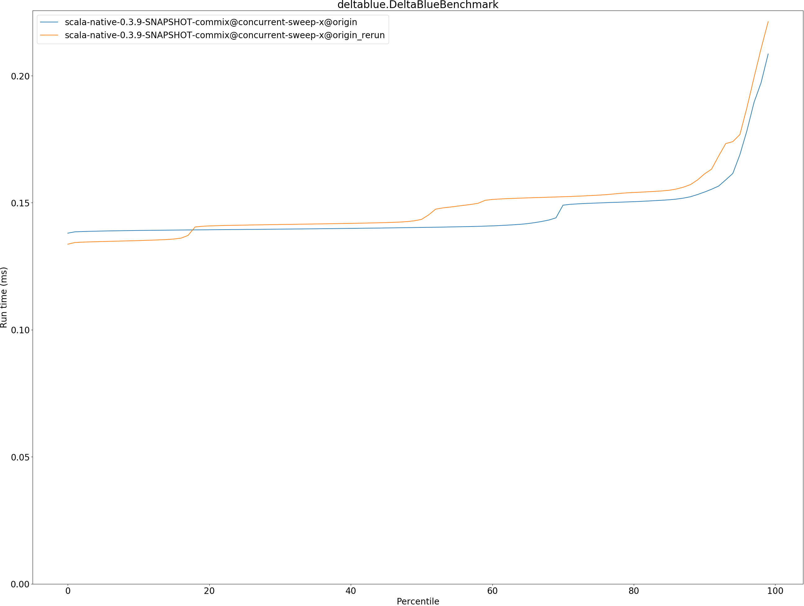
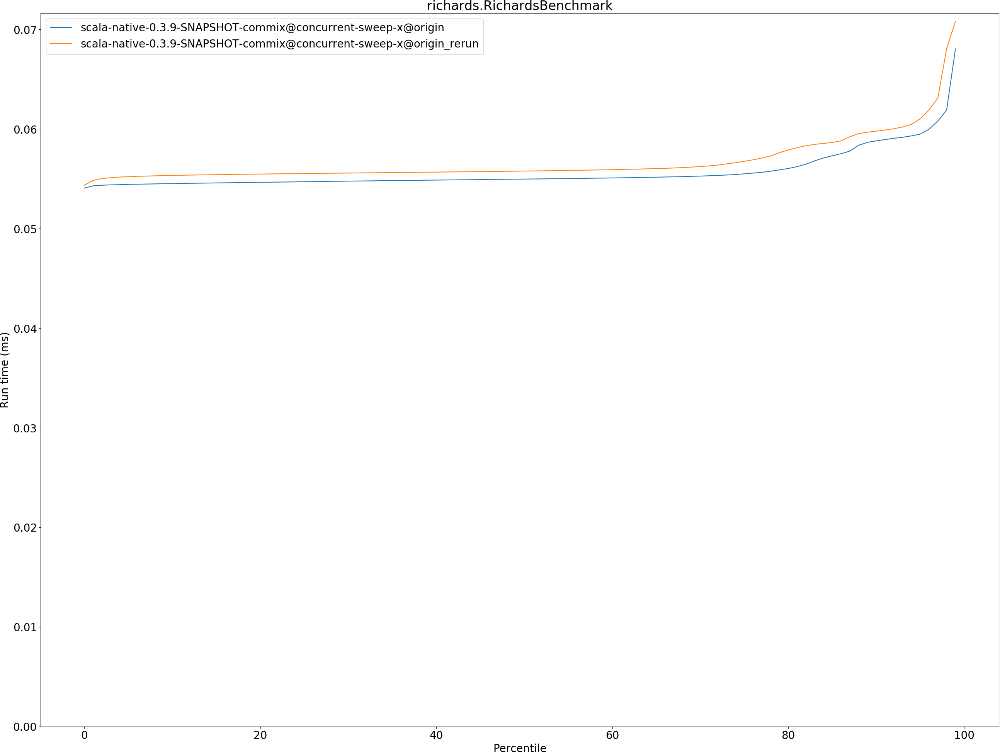
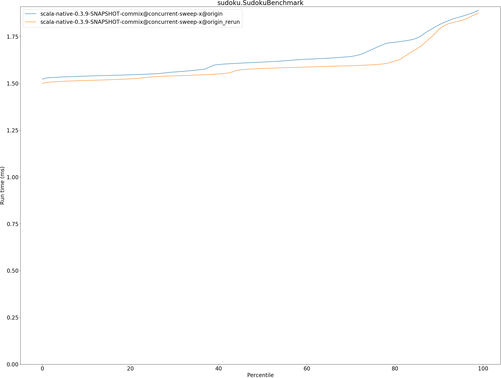
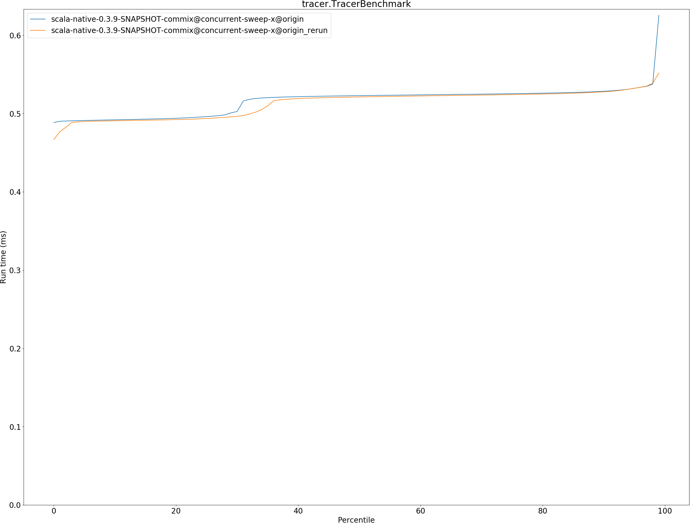

# Summary
## Benchmark run time (ms) at 50 percentile 

|name | scala-native-0.3.9-SNAPSHOT-commix@concurrent-sweep-x@origin | scala-native-0.3.9-SNAPSHOT-commix@concurrent-sweep-x@origin_rerun | |
| -- | -- | -- | -- |
|[bounce.BounceBenchmark](#bouncebouncebenchmark)|0.0383|0.0374|__-2.20%__|
|[brainfuck.BrainfuckBenchmark](#brainfuckbrainfuckbenchmark)|2.5552|2.5542|__-0.04%__|
|[cd.CDBenchmark](#cdcdbenchmark)|17.6193|17.5968|__-0.13%__|
|[deltablue.DeltaBlueBenchmark](#deltabluedeltabluebenchmark)|0.1403|0.1434|+2.26%|
|[gcbench.GCBenchBenchmark](#gcbenchgcbenchbenchmark)|59.5441|59.4905|__-0.09%__|
|[json.JsonBenchmark](#jsonjsonbenchmark)|1.0618|0.9918|__-6.59%__|
|[kmeans.KmeansBenchmark](#kmeanskmeansbenchmark)|36.6910|37.2204|+1.44%|
|[mandelbrot.MandelbrotBenchmark](#mandelbrotmandelbrotbenchmark)|100.7072|100.7295|+0.02%|
|[nbody.NbodyBenchmark](#nbodynbodybenchmark)|25.8005|25.8030|+0.01%|
|[permute.PermuteBenchmark](#permutepermutebenchmark)|0.1546|0.1465|__-5.20%__|
|[queens.QueensBenchmark](#queensqueensbenchmark)|0.0476|0.0489|+2.75%|
|[richards.RichardsBenchmark](#richardsrichardsbenchmark)|0.0550|0.0558|+1.47%|
|[sudoku.SudokuBenchmark](#sudokusudokubenchmark)|1.6130|1.5789|__-2.11%__|
|[tracer.TracerBenchmark](#tracertracerbenchmark)|0.5229|0.5212|__-0.31%__|
| __Geometrical mean:__|| |__-0.66%__|
## Benchmark run time (ms) at 90 percentile 

|name | scala-native-0.3.9-SNAPSHOT-commix@concurrent-sweep-x@origin | scala-native-0.3.9-SNAPSHOT-commix@concurrent-sweep-x@origin_rerun | |
| -- | -- | -- | -- |
|[bounce.BounceBenchmark](#bouncebouncebenchmark)|0.0386|0.0379|__-1.87%__|
|[brainfuck.BrainfuckBenchmark](#brainfuckbrainfuckbenchmark)|2.6256|2.6191|__-0.25%__|
|[cd.CDBenchmark](#cdcdbenchmark)|17.7378|17.7326|__-0.03%__|
|[deltablue.DeltaBlueBenchmark](#deltabluedeltabluebenchmark)|0.1542|0.1613|+4.63%|
|[gcbench.GCBenchBenchmark](#gcbenchgcbenchbenchmark)|61.2913|61.3914|+0.16%|
|[json.JsonBenchmark](#jsonjsonbenchmark)|1.1877|1.1216|__-5.56%__|
|[kmeans.KmeansBenchmark](#kmeanskmeansbenchmark)|38.5762|39.0576|+1.25%|
|[mandelbrot.MandelbrotBenchmark](#mandelbrotmandelbrotbenchmark)|100.7936|100.8085|+0.01%|
|[nbody.NbodyBenchmark](#nbodynbodybenchmark)|26.1570|26.3778|+0.84%|
|[permute.PermuteBenchmark](#permutepermutebenchmark)|0.1650|0.1611|__-2.37%__|
|[queens.QueensBenchmark](#queensqueensbenchmark)|0.0485|0.0568|+17.10%|
|[richards.RichardsBenchmark](#richardsrichardsbenchmark)|0.0588|0.0598|+1.65%|
|[sudoku.SudokuBenchmark](#sudokusudokubenchmark)|1.8121|1.7889|__-1.28%__|
|[tracer.TracerBenchmark](#tracertracerbenchmark)|0.5284|0.5278|__-0.13%__|
| __Geometrical mean:__|| |+0.90%|
## Benchmark run time (ms) at 99 percentile 

|name | scala-native-0.3.9-SNAPSHOT-commix@concurrent-sweep-x@origin | scala-native-0.3.9-SNAPSHOT-commix@concurrent-sweep-x@origin_rerun | |
| -- | -- | -- | -- |
|[bounce.BounceBenchmark](#bouncebouncebenchmark)|0.0415|0.0406|__-1.99%__|
|[brainfuck.BrainfuckBenchmark](#brainfuckbrainfuckbenchmark)|2.6946|2.8204|+4.67%|
|[cd.CDBenchmark](#cdcdbenchmark)|20.1733|22.5769|+11.91%|
|[deltablue.DeltaBlueBenchmark](#deltabluedeltabluebenchmark)|0.2086|0.2213|+6.10%|
|[gcbench.GCBenchBenchmark](#gcbenchgcbenchbenchmark)|62.6144|70.0328|+11.85%|
|[json.JsonBenchmark](#jsonjsonbenchmark)|1.2301|1.1621|__-5.52%__|
|[kmeans.KmeansBenchmark](#kmeanskmeansbenchmark)|39.5960|53.1276|+34.17%|
|[mandelbrot.MandelbrotBenchmark](#mandelbrotmandelbrotbenchmark)|101.0630|103.3763|+2.29%|
|[nbody.NbodyBenchmark](#nbodynbodybenchmark)|27.1543|27.3317|+0.65%|
|[permute.PermuteBenchmark](#permutepermutebenchmark)|0.2092|0.2085|__-0.36%__|
|[queens.QueensBenchmark](#queensqueensbenchmark)|0.0532|0.0641|+20.56%|
|[richards.RichardsBenchmark](#richardsrichardsbenchmark)|0.0680|0.0708|+4.07%|
|[sudoku.SudokuBenchmark](#sudokusudokubenchmark)|1.8900|1.8739|__-0.86%__|
|[tracer.TracerBenchmark](#tracertracerbenchmark)|0.6255|0.5517|__-11.81%__|
| __Geometrical mean:__|| |+4.86%|
## Benchmark total run time (ms) 

|name | scala-native-0.3.9-SNAPSHOT-commix@concurrent-sweep-x@origin | scala-native-0.3.9-SNAPSHOT-commix@concurrent-sweep-x@origin_rerun | |
| -- | -- | -- | -- |
|[bounce.BounceBenchmark](#bouncebouncebenchmark)|769.3479|742.2275|__-3.53%__|
|[brainfuck.BrainfuckBenchmark](#brainfuckbrainfuckbenchmark)|50392.7040|50376.7239|__-0.03%__|
|[cd.CDBenchmark](#cdcdbenchmark)|353450.9628|355256.2208|+0.51%|
|[deltablue.DeltaBlueBenchmark](#deltabluedeltabluebenchmark)|2916.0808|2986.9200|+2.43%|
|[gcbench.GCBenchBenchmark](#gcbenchgcbenchbenchmark)|1194656.7698|1197790.5648|+0.26%|
|[json.JsonBenchmark](#jsonjsonbenchmark)|21766.5232|20244.4048|__-6.99%__|
|[kmeans.KmeansBenchmark](#kmeanskmeansbenchmark)|744180.1280|758506.5537|+1.93%|
|[mandelbrot.MandelbrotBenchmark](#mandelbrotmandelbrotbenchmark)|1971194.6012|1985834.7759|+0.74%|
|[nbody.NbodyBenchmark](#nbodynbodybenchmark)|513766.4219|518912.2842|+1.00%|
|[permute.PermuteBenchmark](#permutepermutebenchmark)|3083.1518|3045.3776|__-1.23%__|
|[queens.QueensBenchmark](#queensqueensbenchmark)|961.7134|1035.7305|+7.70%|
|[richards.RichardsBenchmark](#richardsrichardsbenchmark)|1117.6358|1137.5370|+1.78%|
|[sudoku.SudokuBenchmark](#sudokusudokubenchmark)|32707.9555|31950.4362|__-2.32%__|
|[tracer.TracerBenchmark](#tracertracerbenchmark)|10334.8381|10269.9963|__-0.63%__|
| __Geometrical mean:__|| |+0.07%|
# Individual benchmarks
## bounce.BounceBenchmark

## brainfuck.BrainfuckBenchmark

## cd.CDBenchmark

## deltablue.DeltaBlueBenchmark

## gcbench.GCBenchBenchmark

## json.JsonBenchmark

## kmeans.KmeansBenchmark

## mandelbrot.MandelbrotBenchmark

## nbody.NbodyBenchmark

## permute.PermuteBenchmark

## queens.QueensBenchmark

## richards.RichardsBenchmark

## sudoku.SudokuBenchmark

## tracer.TracerBenchmark

