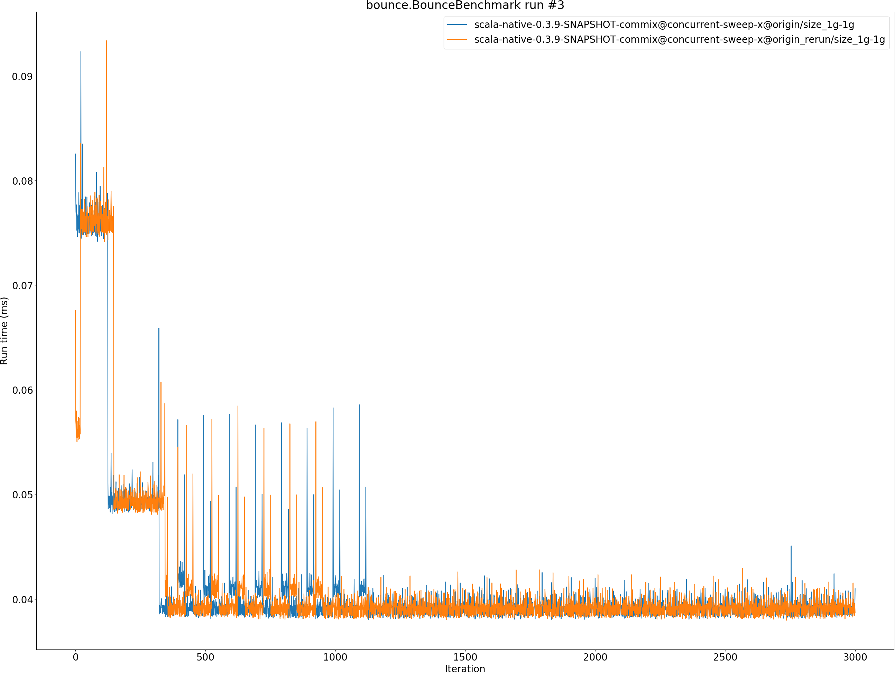
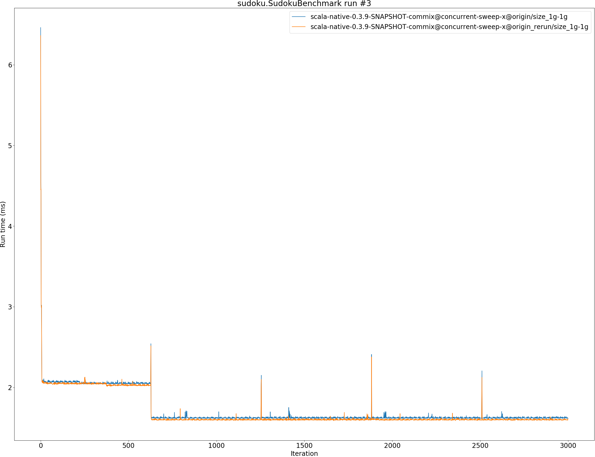

# Summary
## Benchmark run time (ms) at 50 percentile 

|name | scala-native-0.3.9-SNAPSHOT-commix@concurrent-sweep-x@origin/size_1g-1g | scala-native-0.3.9-SNAPSHOT-commix@concurrent-sweep-x@origin_rerun/size_1g-1g | |
| -- | -- | -- | -- |
|[bounce.BounceBenchmark](#bouncebouncebenchmark)|0.0393|0.0382|__-2.77%__|
|[brainfuck.BrainfuckBenchmark](#brainfuckbrainfuckbenchmark)|2.3922|2.3914|__-0.03%__|
|[cd.CDBenchmark](#cdcdbenchmark)|16.8469|16.9055|+0.35%|
|[deltablue.DeltaBlueBenchmark](#deltabluedeltabluebenchmark)|0.1860|0.1902|+2.25%|
|[gcbench.GCBenchBenchmark](#gcbenchgcbenchbenchmark)|60.9786|61.3853|+0.67%|
|[json.JsonBenchmark](#jsonjsonbenchmark)|0.9360|0.9366|+0.07%|
|[kmeans.KmeansBenchmark](#kmeanskmeansbenchmark)|36.2910|36.4963|+0.57%|
|[mandelbrot.MandelbrotBenchmark](#mandelbrotmandelbrotbenchmark)|100.7186|100.7443|+0.03%|
|[nbody.NbodyBenchmark](#nbodynbodybenchmark)|25.4996|25.5277|+0.11%|
|[permute.PermuteBenchmark](#permutepermutebenchmark)|0.2089|0.2101|+0.59%|
|[queens.QueensBenchmark](#queensqueensbenchmark)|0.0516|0.0516|+0.06%|
|[richards.RichardsBenchmark](#richardsrichardsbenchmark)|0.0606|0.0607|+0.31%|
|[sudoku.SudokuBenchmark](#sudokusudokubenchmark)|1.6194|1.5882|__-1.93%__|
|[tracer.TracerBenchmark](#tracertracerbenchmark)|0.4876|0.4884|+0.15%|
| __Geometrical mean:__|| |+0.02%|
## Benchmark run time (ms) at 90 percentile 

|name | scala-native-0.3.9-SNAPSHOT-commix@concurrent-sweep-x@origin/size_1g-1g | scala-native-0.3.9-SNAPSHOT-commix@concurrent-sweep-x@origin_rerun/size_1g-1g | |
| -- | -- | -- | -- |
|[bounce.BounceBenchmark](#bouncebouncebenchmark)|0.0468|0.0396|__-15.34%__|
|[brainfuck.BrainfuckBenchmark](#brainfuckbrainfuckbenchmark)|2.4146|2.4189|+0.18%|
|[cd.CDBenchmark](#cdcdbenchmark)|16.9279|16.9942|+0.39%|
|[deltablue.DeltaBlueBenchmark](#deltabluedeltabluebenchmark)|0.1898|0.1927|+1.49%|
|[gcbench.GCBenchBenchmark](#gcbenchgcbenchbenchmark)|63.7848|64.2896|+0.79%|
|[json.JsonBenchmark](#jsonjsonbenchmark)|0.9442|0.9431|__-0.12%__|
|[kmeans.KmeansBenchmark](#kmeanskmeansbenchmark)|36.7378|36.9980|+0.71%|
|[mandelbrot.MandelbrotBenchmark](#mandelbrotmandelbrotbenchmark)|100.7950|100.8216|+0.03%|
|[nbody.NbodyBenchmark](#nbodynbodybenchmark)|25.9257|25.9616|+0.14%|
|[permute.PermuteBenchmark](#permutepermutebenchmark)|0.2110|0.2134|+1.12%|
|[queens.QueensBenchmark](#queensqueensbenchmark)|0.0538|0.0538|+0.04%|
|[richards.RichardsBenchmark](#richardsrichardsbenchmark)|0.0630|0.0639|+1.36%|
|[sudoku.SudokuBenchmark](#sudokusudokubenchmark)|1.6503|1.6146|__-2.17%__|
|[tracer.TracerBenchmark](#tracertracerbenchmark)|0.4952|0.4956|+0.08%|
| __Geometrical mean:__|| |__-0.90%__|
## Benchmark run time (ms) at 99 percentile 

|name | scala-native-0.3.9-SNAPSHOT-commix@concurrent-sweep-x@origin/size_1g-1g | scala-native-0.3.9-SNAPSHOT-commix@concurrent-sweep-x@origin_rerun/size_1g-1g | |
| -- | -- | -- | -- |
|[bounce.BounceBenchmark](#bouncebouncebenchmark)|0.0484|0.0412|__-14.86%__|
|[brainfuck.BrainfuckBenchmark](#brainfuckbrainfuckbenchmark)|2.5363|2.5127|__-0.93%__|
|[cd.CDBenchmark](#cdcdbenchmark)|18.2884|18.3739|+0.47%|
|[deltablue.DeltaBlueBenchmark](#deltabluedeltabluebenchmark)|0.1930|0.1965|+1.79%|
|[gcbench.GCBenchBenchmark](#gcbenchgcbenchbenchmark)|64.6693|64.9725|+0.47%|
|[json.JsonBenchmark](#jsonjsonbenchmark)|1.1378|1.1701|+2.84%|
|[kmeans.KmeansBenchmark](#kmeanskmeansbenchmark)|50.9320|51.3332|+0.79%|
|[mandelbrot.MandelbrotBenchmark](#mandelbrotmandelbrotbenchmark)|101.0056|102.2018|+1.18%|
|[nbody.NbodyBenchmark](#nbodynbodybenchmark)|34.4883|26.9707|__-21.80%__|
|[permute.PermuteBenchmark](#permutepermutebenchmark)|0.2140|0.2181|+1.87%|
|[queens.QueensBenchmark](#queensqueensbenchmark)|0.0569|0.0611|+7.50%|
|[richards.RichardsBenchmark](#richardsrichardsbenchmark)|0.0660|0.0673|+1.95%|
|[sudoku.SudokuBenchmark](#sudokusudokubenchmark)|2.1905|1.6464|__-24.84%__|
|[tracer.TracerBenchmark](#tracertracerbenchmark)|0.5535|0.5526|__-0.16%__|
| __Geometrical mean:__|| |__-3.64%__|
## Benchmark total run time (ms) 

|name | scala-native-0.3.9-SNAPSHOT-commix@concurrent-sweep-x@origin/size_1g-1g | scala-native-0.3.9-SNAPSHOT-commix@concurrent-sweep-x@origin_rerun/size_1g-1g | |
| -- | -- | -- | -- |
|[bounce.BounceBenchmark](#bouncebouncebenchmark)|810.1092|765.0637|__-5.56%__|
|[brainfuck.BrainfuckBenchmark](#brainfuckbrainfuckbenchmark)|48065.0650|48059.1613|__-0.01%__|
|[cd.CDBenchmark](#cdcdbenchmark)|338868.5199|340338.4068|+0.43%|
|[deltablue.DeltaBlueBenchmark](#deltabluedeltabluebenchmark)|3696.8351|3807.4937|+2.99%|
|[gcbench.GCBenchBenchmark](#gcbenchgcbenchbenchmark)|1215993.6680|1217363.3132|+0.11%|
|[json.JsonBenchmark](#jsonjsonbenchmark)|18836.3385|18733.3479|__-0.55%__|
|[kmeans.KmeansBenchmark](#kmeanskmeansbenchmark)|728249.6977|726184.8295|__-0.28%__|
|[mandelbrot.MandelbrotBenchmark](#mandelbrotmandelbrotbenchmark)|1983953.5717|2011861.0096|+1.41%|
|[nbody.NbodyBenchmark](#nbodynbodybenchmark)|505635.9617|512765.3996|+1.41%|
|[permute.PermuteBenchmark](#permutepermutebenchmark)|4176.1006|4210.7649|+0.83%|
|[queens.QueensBenchmark](#queensqueensbenchmark)|1029.1077|1033.6490|+0.44%|
|[richards.RichardsBenchmark](#richardsrichardsbenchmark)|1219.2431|1227.1917|+0.65%|
|[sudoku.SudokuBenchmark](#sudokusudokubenchmark)|33035.9831|31617.9028|__-4.29%__|
|[tracer.TracerBenchmark](#tracertracerbenchmark)|9770.2256|9803.4163|+0.34%|
| __Geometrical mean:__|| |__-0.17%__|
# Individual benchmarks
## bounce.BounceBenchmark

## brainfuck.BrainfuckBenchmark

## cd.CDBenchmark

## deltablue.DeltaBlueBenchmark

## gcbench.GCBenchBenchmark

## json.JsonBenchmark

## kmeans.KmeansBenchmark

## mandelbrot.MandelbrotBenchmark

## nbody.NbodyBenchmark

## permute.PermuteBenchmark

## queens.QueensBenchmark

## richards.RichardsBenchmark

## sudoku.SudokuBenchmark

## tracer.TracerBenchmark

