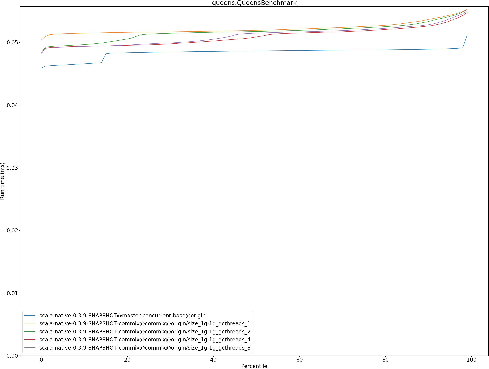
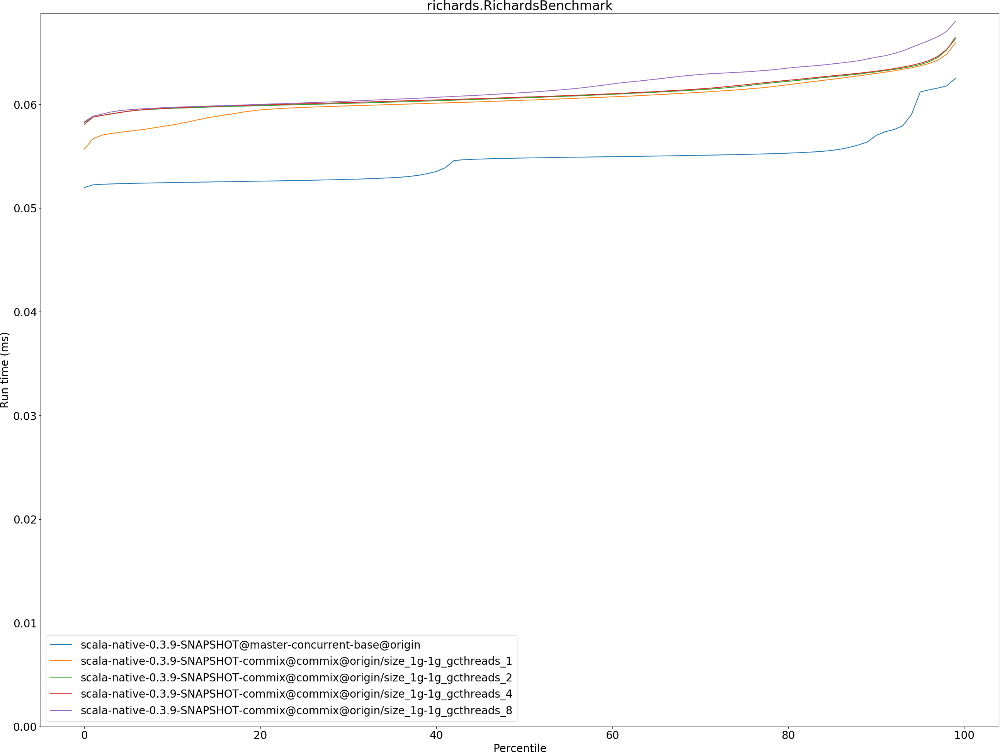
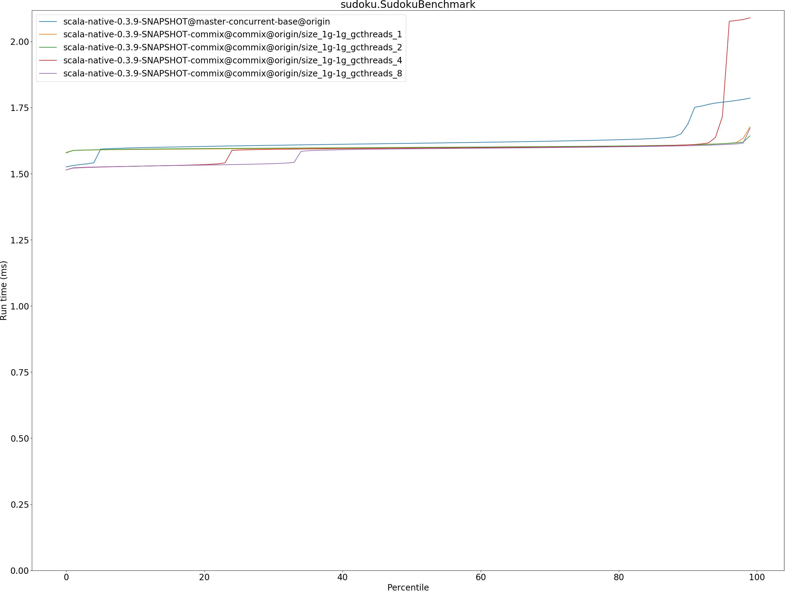

# Summary
## Benchmark run time (ms) at 50 percentile 

|name | scala-native-0.3.9-SNAPSHOT@master-concurrent-base@origin | scala-native-0.3.9-SNAPSHOT-commix@commix@origin/size_1g-1g_gcthreads_1 |  | scala-native-0.3.9-SNAPSHOT-commix@commix@origin/size_1g-1g_gcthreads_2 |  | scala-native-0.3.9-SNAPSHOT-commix@commix@origin/size_1g-1g_gcthreads_4 |  | scala-native-0.3.9-SNAPSHOT-commix@commix@origin/size_1g-1g_gcthreads_8 | |
| -- | -- | -- | -- | -- | -- | -- | -- | -- | -- |
|[bounce.BounceBenchmark](#bouncebouncebenchmark)|0.0412|0.0393|__-4.70%__|0.0385|__-6.62%__|0.0386|__-6.42%__|0.0392|__-4.97%__|
|[brainfuck.BrainfuckBenchmark](#brainfuckbrainfuckbenchmark)|2.3769|2.3898|+0.54%|2.3889|+0.51%|2.3903|+0.57%|2.3836|+0.28%|
|[cd.CDBenchmark](#cdcdbenchmark)|17.0257|16.8748|__-0.89%__|16.8682|__-0.92%__|16.8658|__-0.94%__|16.8665|__-0.93%__|
|[deltablue.DeltaBlueBenchmark](#deltabluedeltabluebenchmark)|0.1382|0.1891|+36.85%|0.1878|+35.92%|0.1888|+36.61%|0.1877|+35.83%|
|[gcbench.GCBenchBenchmark](#gcbenchgcbenchbenchmark)|71.5424|64.2953|__-10.13%__|64.1854|__-10.28%__|65.0829|__-9.03%__|61.2655|__-14.36%__|
|[json.JsonBenchmark](#jsonjsonbenchmark)|1.0340|0.9873|__-4.52%__|0.9497|__-8.15%__|0.9875|__-4.50%__|0.9867|__-4.58%__|
|[kmeans.KmeansBenchmark](#kmeanskmeansbenchmark)|36.6283|36.6623|+0.09%|36.3340|__-0.80%__|36.6502|+0.06%|35.5790|__-2.86%__|
|[mandelbrot.MandelbrotBenchmark](#mandelbrotmandelbrotbenchmark)|100.7056|100.7844|+0.08%|100.7611|+0.06%|100.7692|+0.06%|100.7974|+0.09%|
|[nbody.NbodyBenchmark](#nbodynbodybenchmark)|25.5941|25.5401|__-0.21%__|25.5205|__-0.29%__|25.5375|__-0.22%__|25.5337|__-0.24%__|
|[permute.PermuteBenchmark](#permutepermutebenchmark)|0.1438|0.2084|+44.92%|0.2091|+45.42%|0.2093|+45.58%|0.2033|+41.36%|
|[queens.QueensBenchmark](#queensqueensbenchmark)|0.0486|0.0519|+6.76%|0.0517|+6.39%|0.0509|+4.59%|0.0515|+5.83%|
|[richards.RichardsBenchmark](#richardsrichardsbenchmark)|0.0548|0.0604|+10.17%|0.0606|+10.59%|0.0607|+10.72%|0.0611|+11.52%|
|[sudoku.SudokuBenchmark](#sudokusudokubenchmark)|1.6148|1.5981|__-1.03%__|1.5994|__-0.96%__|1.5964|__-1.14%__|1.5939|__-1.30%__|
|[tracer.TracerBenchmark](#tracertracerbenchmark)|0.4750|0.4878|+2.70%|0.4870|+2.52%|0.4871|+2.55%|0.4894|+3.04%|
| __Geometrical mean:__|| |+4.81%| |+4.25%| |+4.65%| |+3.97%|
## Benchmark run time (ms) at 90 percentile 

|name | scala-native-0.3.9-SNAPSHOT@master-concurrent-base@origin | scala-native-0.3.9-SNAPSHOT-commix@commix@origin/size_1g-1g_gcthreads_1 |  | scala-native-0.3.9-SNAPSHOT-commix@commix@origin/size_1g-1g_gcthreads_2 |  | scala-native-0.3.9-SNAPSHOT-commix@commix@origin/size_1g-1g_gcthreads_4 |  | scala-native-0.3.9-SNAPSHOT-commix@commix@origin/size_1g-1g_gcthreads_8 | |
| -- | -- | -- | -- | -- | -- | -- | -- | -- | -- |
|[bounce.BounceBenchmark](#bouncebouncebenchmark)|0.0441|0.0403|__-8.61%__|0.0398|__-9.62%__|0.0399|__-9.50%__|0.0401|__-8.94%__|
|[brainfuck.BrainfuckBenchmark](#brainfuckbrainfuckbenchmark)|2.4827|2.4180|__-2.61%__|2.4151|__-2.72%__|2.4207|__-2.50%__|2.4047|__-3.14%__|
|[cd.CDBenchmark](#cdcdbenchmark)|17.1497|17.0070|__-0.83%__|17.6476|+2.90%|17.0185|__-0.76%__|17.4214|+1.58%|
|[deltablue.DeltaBlueBenchmark](#deltabluedeltabluebenchmark)|0.1587|0.1921|+21.08%|0.1919|+20.92%|0.1923|+21.17%|0.1923|+21.18%|
|[gcbench.GCBenchBenchmark](#gcbenchgcbenchbenchmark)|74.3233|67.4984|__-9.18%__|67.3244|__-9.42%__|66.2117|__-10.91%__|64.0446|__-13.83%__|
|[json.JsonBenchmark](#jsonjsonbenchmark)|1.0832|0.9926|__-8.36%__|0.9921|__-8.41%__|1.0333|__-4.60%__|0.9921|__-8.41%__|
|[kmeans.KmeansBenchmark](#kmeanskmeansbenchmark)|38.4228|38.4503|+0.07%|37.1259|__-3.38%__|37.3222|__-2.86%__|36.8575|__-4.07%__|
|[mandelbrot.MandelbrotBenchmark](#mandelbrotmandelbrotbenchmark)|100.7808|100.8692|+0.09%|100.8467|+0.07%|100.8544|+0.07%|100.8754|+0.09%|
|[nbody.NbodyBenchmark](#nbodynbodybenchmark)|25.9036|26.1154|+0.82%|25.8976|__-0.02%__|25.9858|+0.32%|25.9624|+0.23%|
|[permute.PermuteBenchmark](#permutepermutebenchmark)|0.1469|0.2113|+43.82%|0.2119|+44.18%|0.2117|+44.04%|0.2111|+43.64%|
|[queens.QueensBenchmark](#queensqueensbenchmark)|0.0489|0.0537|+9.71%|0.0533|+9.03%|0.0526|+7.57%|0.0528|+7.98%|
|[richards.RichardsBenchmark](#richardsrichardsbenchmark)|0.0570|0.0630|+10.49%|0.0631|+10.75%|0.0632|+10.87%|0.0645|+13.22%|
|[sudoku.SudokuBenchmark](#sudokusudokubenchmark)|1.6875|1.6090|__-4.66%__|1.6086|__-4.68%__|1.6088|__-4.67%__|1.6056|__-4.86%__|
|[tracer.TracerBenchmark](#tracertracerbenchmark)|0.4789|0.4952|+3.42%|0.4946|+3.29%|0.4947|+3.30%|0.5723|+19.50%|
| __Geometrical mean:__|| |+3.15%| |+2.96%| |+2.88%| |+3.63%|
## Benchmark run time (ms) at 99 percentile 

|name | scala-native-0.3.9-SNAPSHOT@master-concurrent-base@origin | scala-native-0.3.9-SNAPSHOT-commix@commix@origin/size_1g-1g_gcthreads_1 |  | scala-native-0.3.9-SNAPSHOT-commix@commix@origin/size_1g-1g_gcthreads_2 |  | scala-native-0.3.9-SNAPSHOT-commix@commix@origin/size_1g-1g_gcthreads_4 |  | scala-native-0.3.9-SNAPSHOT-commix@commix@origin/size_1g-1g_gcthreads_8 | |
| -- | -- | -- | -- | -- | -- | -- | -- | -- | -- |
|[bounce.BounceBenchmark](#bouncebouncebenchmark)|0.0445|0.0425|__-4.41%__|0.0412|__-7.35%__|0.0415|__-6.77%__|0.0415|__-6.62%__|
|[brainfuck.BrainfuckBenchmark](#brainfuckbrainfuckbenchmark)|2.5408|2.9230|+15.04%|2.5645|+0.93%|2.4898|__-2.00%__|2.5155|__-0.99%__|
|[cd.CDBenchmark](#cdcdbenchmark)|19.1031|19.1150|+0.06%|21.7199|+13.70%|21.6817|+13.50%|18.3626|__-3.88%__|
|[deltablue.DeltaBlueBenchmark](#deltabluedeltabluebenchmark)|0.1989|0.2109|+6.00%|0.1954|__-1.75%__|0.1951|__-1.92%__|0.1956|__-1.66%__|
|[gcbench.GCBenchBenchmark](#gcbenchgcbenchbenchmark)|76.8841|68.4884|__-10.92%__|69.3263|__-9.83%__|75.6201|__-1.64%__|64.5118|__-16.09%__|
|[json.JsonBenchmark](#jsonjsonbenchmark)|1.0881|1.2729|+16.98%|1.2307|+13.10%|1.2163|+11.78%|1.0251|__-5.79%__|
|[kmeans.KmeansBenchmark](#kmeanskmeansbenchmark)|40.9655|51.8480|+26.57%|39.3356|__-3.98%__|51.7361|+26.29%|38.8293|__-5.21%__|
|[mandelbrot.MandelbrotBenchmark](#mandelbrotmandelbrotbenchmark)|102.3627|104.3000|+1.89%|101.0766|__-1.26%__|101.0783|__-1.25%__|102.3013|__-0.06%__|
|[nbody.NbodyBenchmark](#nbodynbodybenchmark)|27.5296|36.1371|+31.27%|27.0345|__-1.80%__|30.0415|+9.12%|27.0423|__-1.77%__|
|[permute.PermuteBenchmark](#permutepermutebenchmark)|0.1648|0.2150|+30.46%|0.2173|+31.88%|0.2151|+30.56%|0.2148|+30.37%|
|[queens.QueensBenchmark](#queensqueensbenchmark)|0.0512|0.0553|+7.90%|0.0552|+7.84%|0.0548|+6.91%|0.0551|+7.52%|
|[richards.RichardsBenchmark](#richardsrichardsbenchmark)|0.0625|0.0659|+5.50%|0.0665|+6.35%|0.0663|+6.10%|0.0680|+8.80%|
|[sudoku.SudokuBenchmark](#sudokusudokubenchmark)|1.7857|1.6770|__-6.08%__|1.6432|__-7.98%__|2.0892|+17.00%|1.6715|__-6.39%__|
|[tracer.TracerBenchmark](#tracertracerbenchmark)|0.4835|0.6781|+40.25%|0.9082|+87.83%|0.5254|+8.67%|0.5862|+21.25%|
| __Geometrical mean:__|| |+10.46%| |+7.04%| |+7.81%| |+0.77%|
## Benchmark total run time (ms) 

|name | scala-native-0.3.9-SNAPSHOT@master-concurrent-base@origin | scala-native-0.3.9-SNAPSHOT-commix@commix@origin/size_1g-1g_gcthreads_1 |  | scala-native-0.3.9-SNAPSHOT-commix@commix@origin/size_1g-1g_gcthreads_2 |  | scala-native-0.3.9-SNAPSHOT-commix@commix@origin/size_1g-1g_gcthreads_4 |  | scala-native-0.3.9-SNAPSHOT-commix@commix@origin/size_1g-1g_gcthreads_8 | |
| -- | -- | -- | -- | -- | -- | -- | -- | -- | -- |
|[bounce.BounceBenchmark](#bouncebouncebenchmark)|824.5545|785.4416|__-4.74%__|769.8895|__-6.63%__|771.0307|__-6.49%__|780.4548|__-5.35%__|
|[brainfuck.BrainfuckBenchmark](#brainfuckbrainfuckbenchmark)|47543.4776|48095.1530|+1.16%|47790.6168|+0.52%|47629.3099|+0.18%|47086.9654|__-0.96%__|
|[cd.CDBenchmark](#cdcdbenchmark)|341662.7014|340504.0367|__-0.34%__|341964.0083|+0.09%|341713.7726|+0.01%|337189.2176|__-1.31%__|
|[deltablue.DeltaBlueBenchmark](#deltabluedeltabluebenchmark)|2888.5587|3796.1176|+31.42%|3740.5454|+29.50%|3753.5995|+29.95%|3731.5889|+29.19%|
|[gcbench.GCBenchBenchmark](#gcbenchgcbenchbenchmark)|1409214.8311|1256215.7903|__-10.86%__|1235731.4809|__-12.31%__|1247723.9467|__-11.46%__|1205059.0873|__-14.49%__|
|[json.JsonBenchmark](#jsonjsonbenchmark)|21053.7293|19734.8016|__-6.26%__|19531.8420|__-7.23%__|19990.8294|__-5.05%__|19735.4830|__-6.26%__|
|[kmeans.KmeansBenchmark](#kmeanskmeansbenchmark)|736730.4543|751785.7535|+2.04%|722638.8692|__-1.91%__|746124.8620|+1.28%|719549.5618|__-2.33%__|
|[mandelbrot.MandelbrotBenchmark](#mandelbrotmandelbrotbenchmark)|2015802.6077|1973310.5461|__-2.11%__|1972088.5650|__-2.17%__|1972506.2260|__-2.15%__|1995489.5983|__-1.01%__|
|[nbody.NbodyBenchmark](#nbodynbodybenchmark)|505068.3410|518909.8693|+2.74%|506404.2304|+0.26%|515184.7008|+2.00%|512205.0907|+1.41%|
|[permute.PermuteBenchmark](#permutepermutebenchmark)|2900.4835|4122.5731|+42.13%|4190.6077|+44.48%|4191.9894|+44.53%|4104.6341|+41.52%|
|[queens.QueensBenchmark](#queensqueensbenchmark)|968.5119|1044.8302|+7.88%|1034.2891|+6.79%|1018.7487|+5.19%|1022.7622|+5.60%|
|[richards.RichardsBenchmark](#richardsrichardsbenchmark)|1092.9586|1211.3754|+10.83%|1221.0477|+11.72%|1222.3039|+11.83%|1235.9350|+13.08%|
|[sudoku.SudokuBenchmark](#sudokusudokubenchmark)|32525.8770|32018.8049|__-1.56%__|32029.7982|__-1.53%__|32159.5558|__-1.13%__|31549.8373|__-3.00%__|
|[tracer.TracerBenchmark](#tracertracerbenchmark)|9397.0352|9868.8793|+5.02%|9835.3996|+4.66%|9816.1902|+4.46%|10041.8891|+6.86%|
| __Geometrical mean:__|| |+4.70%| |+3.83%| |+4.36%| |+3.62%|
# Individual benchmarks
## bounce.BounceBenchmark

## brainfuck.BrainfuckBenchmark

## cd.CDBenchmark

## deltablue.DeltaBlueBenchmark

## gcbench.GCBenchBenchmark

## json.JsonBenchmark

## kmeans.KmeansBenchmark

## mandelbrot.MandelbrotBenchmark

## nbody.NbodyBenchmark

## permute.PermuteBenchmark

## queens.QueensBenchmark

## richards.RichardsBenchmark

## sudoku.SudokuBenchmark

## tracer.TracerBenchmark

