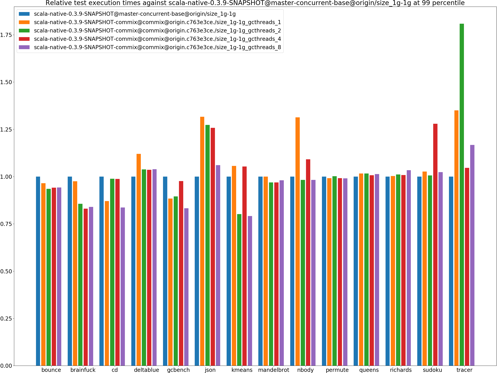
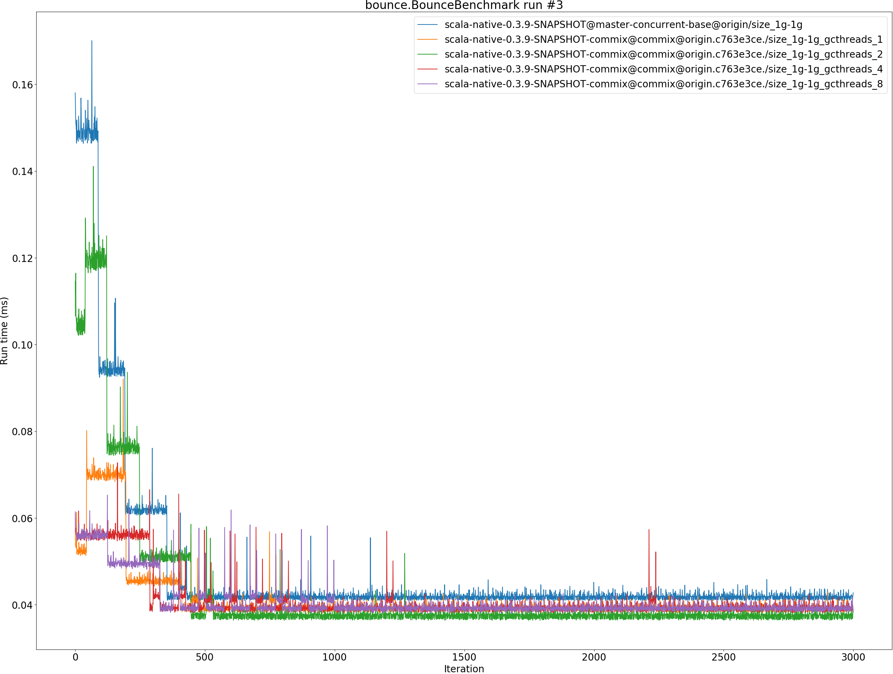
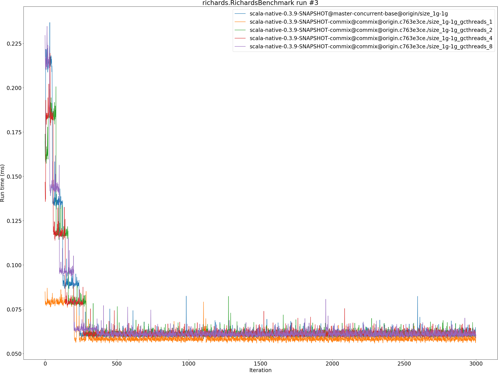

# Summary
## Benchmark run time (ms) at 50 percentile 

|name | scala-native-0.3.9-SNAPSHOT@master-concurrent-base@origin/size_1g-1g | scala-native-0.3.9-SNAPSHOT-commix@commix@origin.c763e3ce./size_1g-1g_gcthreads_1 |  | scala-native-0.3.9-SNAPSHOT-commix@commix@origin.c763e3ce./size_1g-1g_gcthreads_2 |  | scala-native-0.3.9-SNAPSHOT-commix@commix@origin.c763e3ce./size_1g-1g_gcthreads_4 |  | scala-native-0.3.9-SNAPSHOT-commix@commix@origin.c763e3ce./size_1g-1g_gcthreads_8 | |
| -- | -- | -- | -- | -- | -- | -- | -- | -- | -- |
|[bounce.BounceBenchmark](#bouncebouncebenchmark)|0.0410|0.0393|__-4.08%__|0.0385|__-6.01%__|0.0386|__-5.81%__|0.0392|__-4.34%__|
|[brainfuck.BrainfuckBenchmark](#brainfuckbrainfuckbenchmark)|2.3728|2.3898|+0.72%|2.3889|+0.68%|2.3903|+0.74%|2.3836|+0.46%|
|[cd.CDBenchmark](#cdcdbenchmark)|17.0053|16.8748|__-0.77%__|16.8682|__-0.81%__|16.8658|__-0.82%__|16.8665|__-0.82%__|
|[deltablue.DeltaBlueBenchmark](#deltabluedeltabluebenchmark)|0.1814|0.1891|+4.24%|0.1878|+3.53%|0.1888|+4.05%|0.1877|+3.46%|
|[gcbench.GCBenchBenchmark](#gcbenchgcbenchbenchmark)|66.1548|64.2953|__-2.81%__|64.1854|__-2.98%__|65.0829|__-1.62%__|61.2655|__-7.39%__|
|[json.JsonBenchmark](#jsonjsonbenchmark)|0.9358|0.9873|+5.50%|0.9497|+1.49%|0.9875|+5.52%|0.9867|+5.44%|
|[kmeans.KmeansBenchmark](#kmeanskmeansbenchmark)|36.0690|36.6623|+1.64%|36.3340|+0.73%|36.6502|+1.61%|35.5790|__-1.36%__|
|[mandelbrot.MandelbrotBenchmark](#mandelbrotmandelbrotbenchmark)|100.7072|100.7844|+0.08%|100.7611|+0.05%|100.7692|+0.06%|100.7974|+0.09%|
|[nbody.NbodyBenchmark](#nbodynbodybenchmark)|24.5717|25.5401|+3.94%|25.5205|+3.86%|25.5375|+3.93%|25.5337|+3.92%|
|[permute.PermuteBenchmark](#permutepermutebenchmark)|0.2098|0.2084|__-0.66%__|0.2091|__-0.32%__|0.2093|__-0.21%__|0.2033|__-3.10%__|
|[queens.QueensBenchmark](#queensqueensbenchmark)|0.0510|0.0519|+1.83%|0.0517|+1.48%|0.0509|__-0.23%__|0.0515|+0.94%|
|[richards.RichardsBenchmark](#richardsrichardsbenchmark)|0.0603|0.0604|+0.19%|0.0606|+0.58%|0.0607|+0.70%|0.0611|+1.42%|
|[sudoku.SudokuBenchmark](#sudokusudokubenchmark)|1.5931|1.5981|+0.32%|1.5994|+0.40%|1.5964|+0.21%|1.5939|+0.05%|
|[tracer.TracerBenchmark](#tracertracerbenchmark)|0.4879|0.4878|__-0.03%__|0.4870|__-0.19%__|0.4871|__-0.17%__|0.4894|+0.30%|
| __Geometrical mean:__|| |+0.69%| |+0.15%| |+0.53%| |__-0.12%__|
## Benchmark run time (ms) at 90 percentile 

|name | scala-native-0.3.9-SNAPSHOT@master-concurrent-base@origin/size_1g-1g | scala-native-0.3.9-SNAPSHOT-commix@commix@origin.c763e3ce./size_1g-1g_gcthreads_1 |  | scala-native-0.3.9-SNAPSHOT-commix@commix@origin.c763e3ce./size_1g-1g_gcthreads_2 |  | scala-native-0.3.9-SNAPSHOT-commix@commix@origin.c763e3ce./size_1g-1g_gcthreads_4 |  | scala-native-0.3.9-SNAPSHOT-commix@commix@origin.c763e3ce./size_1g-1g_gcthreads_8 | |
| -- | -- | -- | -- | -- | -- | -- | -- | -- | -- |
|[bounce.BounceBenchmark](#bouncebouncebenchmark)|0.0423|0.0403|__-4.76%__|0.0398|__-5.82%__|0.0399|__-5.69%__|0.0401|__-5.10%__|
|[brainfuck.BrainfuckBenchmark](#brainfuckbrainfuckbenchmark)|2.4765|2.4180|__-2.36%__|2.4151|__-2.48%__|2.4207|__-2.25%__|2.4047|__-2.90%__|
|[cd.CDBenchmark](#cdcdbenchmark)|17.1122|17.0070|__-0.61%__|17.6476|+3.13%|17.0185|__-0.55%__|17.4214|+1.81%|
|[deltablue.DeltaBlueBenchmark](#deltabluedeltabluebenchmark)|0.1852|0.1921|+3.76%|0.1919|+3.62%|0.1923|+3.83%|0.1923|+3.84%|
|[gcbench.GCBenchBenchmark](#gcbenchgcbenchbenchmark)|66.8558|67.4984|+0.96%|67.3244|+0.70%|66.2117|__-0.96%__|64.0446|__-4.20%__|
|[json.JsonBenchmark](#jsonjsonbenchmark)|0.9407|0.9926|+5.51%|0.9921|+5.46%|1.0333|+9.84%|0.9921|+5.46%|
|[kmeans.KmeansBenchmark](#kmeanskmeansbenchmark)|36.6244|38.4503|+4.99%|37.1259|+1.37%|37.3222|+1.91%|36.8575|+0.64%|
|[mandelbrot.MandelbrotBenchmark](#mandelbrotmandelbrotbenchmark)|100.7837|100.8692|+0.08%|100.8467|+0.06%|100.8544|+0.07%|100.8754|+0.09%|
|[nbody.NbodyBenchmark](#nbodynbodybenchmark)|25.6886|26.1154|+1.66%|25.8976|+0.81%|25.9858|+1.16%|25.9624|+1.07%|
|[permute.PermuteBenchmark](#permutepermutebenchmark)|0.2121|0.2113|__-0.33%__|0.2119|__-0.09%__|0.2117|__-0.18%__|0.2111|__-0.46%__|
|[queens.QueensBenchmark](#queensqueensbenchmark)|0.0527|0.0537|+1.73%|0.0533|+1.10%|0.0526|__-0.25%__|0.0528|+0.13%|
|[richards.RichardsBenchmark](#richardsrichardsbenchmark)|0.0627|0.0630|+0.43%|0.0631|+0.66%|0.0632|+0.78%|0.0645|+2.91%|
|[sudoku.SudokuBenchmark](#sudokusudokubenchmark)|1.6082|1.6090|+0.05%|1.6086|+0.02%|1.6088|+0.04%|1.6056|__-0.16%__|
|[tracer.TracerBenchmark](#tracertracerbenchmark)|0.4941|0.4952|+0.23%|0.4946|+0.10%|0.4947|+0.11%|0.5723|+15.82%|
| __Geometrical mean:__|| |+0.78%| |+0.59%| |+0.51%| |+1.24%|
## Benchmark run time (ms) at 99 percentile 

|name | scala-native-0.3.9-SNAPSHOT@master-concurrent-base@origin/size_1g-1g | scala-native-0.3.9-SNAPSHOT-commix@commix@origin.c763e3ce./size_1g-1g_gcthreads_1 |  | scala-native-0.3.9-SNAPSHOT-commix@commix@origin.c763e3ce./size_1g-1g_gcthreads_2 |  | scala-native-0.3.9-SNAPSHOT-commix@commix@origin.c763e3ce./size_1g-1g_gcthreads_4 |  | scala-native-0.3.9-SNAPSHOT-commix@commix@origin.c763e3ce./size_1g-1g_gcthreads_8 | |
| -- | -- | -- | -- | -- | -- | -- | -- | -- | -- |
|[bounce.BounceBenchmark](#bouncebouncebenchmark)|0.0441|0.0425|__-3.52%__|0.0412|__-6.48%__|0.0415|__-5.89%__|0.0415|__-5.75%__|
|[brainfuck.BrainfuckBenchmark](#brainfuckbrainfuckbenchmark)|2.9974|2.9230|__-2.48%__|2.5645|__-14.44%__|2.4898|__-16.93%__|2.5155|__-16.08%__|
|[cd.CDBenchmark](#cdcdbenchmark)|21.9642|19.1150|__-12.97%__|21.7199|__-1.11%__|21.6817|__-1.29%__|18.3626|__-16.40%__|
|[deltablue.DeltaBlueBenchmark](#deltabluedeltabluebenchmark)|0.1883|0.2109|+11.98%|0.1954|+3.79%|0.1951|+3.61%|0.1956|+3.88%|
|[gcbench.GCBenchBenchmark](#gcbenchgcbenchbenchmark)|77.4812|68.4884|__-11.61%__|69.3263|__-10.53%__|75.6201|__-2.40%__|64.5118|__-16.74%__|
|[json.JsonBenchmark](#jsonjsonbenchmark)|0.9670|1.2729|+31.64%|1.2307|+27.28%|1.2163|+25.79%|1.0251|+6.02%|
|[kmeans.KmeansBenchmark](#kmeanskmeansbenchmark)|49.0999|51.8480|+5.60%|39.3356|__-19.89%__|51.7361|+5.37%|38.8293|__-20.92%__|
|[mandelbrot.MandelbrotBenchmark](#mandelbrotmandelbrotbenchmark)|104.3348|104.3000|__-0.03%__|101.0766|__-3.12%__|101.0783|__-3.12%__|102.3013|__-1.95%__|
|[nbody.NbodyBenchmark](#nbodynbodybenchmark)|27.5265|36.1371|+31.28%|27.0345|__-1.79%__|30.0415|+9.14%|27.0423|__-1.76%__|
|[permute.PermuteBenchmark](#permutepermutebenchmark)|0.2169|0.2150|__-0.89%__|0.2173|+0.19%|0.2151|__-0.81%__|0.2148|__-0.96%__|
|[queens.QueensBenchmark](#queensqueensbenchmark)|0.0544|0.0553|+1.68%|0.0552|+1.63%|0.0548|+0.75%|0.0551|+1.32%|
|[richards.RichardsBenchmark](#richardsrichardsbenchmark)|0.0658|0.0659|+0.28%|0.0665|+1.09%|0.0663|+0.85%|0.0680|+3.42%|
|[sudoku.SudokuBenchmark](#sudokusudokubenchmark)|1.6337|1.6770|+2.65%|1.6432|+0.58%|2.0892|+27.88%|1.6715|+2.31%|
|[tracer.TracerBenchmark](#tracertracerbenchmark)|0.5023|0.6781|+35.00%|0.9082|+80.81%|0.5254|+4.60%|0.5862|+16.71%|
| __Geometrical mean:__|| |+5.34%| |+2.08%| |+2.81%| |__-3.91%__|
## Benchmark total run time (ms) 

|name | scala-native-0.3.9-SNAPSHOT@master-concurrent-base@origin/size_1g-1g | scala-native-0.3.9-SNAPSHOT-commix@commix@origin.c763e3ce./size_1g-1g_gcthreads_1 |  | scala-native-0.3.9-SNAPSHOT-commix@commix@origin.c763e3ce./size_1g-1g_gcthreads_2 |  | scala-native-0.3.9-SNAPSHOT-commix@commix@origin.c763e3ce./size_1g-1g_gcthreads_4 |  | scala-native-0.3.9-SNAPSHOT-commix@commix@origin.c763e3ce./size_1g-1g_gcthreads_8 | |
| -- | -- | -- | -- | -- | -- | -- | -- | -- | -- |
|[bounce.BounceBenchmark](#bouncebouncebenchmark)|817.8376|785.4416|__-3.96%__|769.8895|__-5.86%__|771.0307|__-5.72%__|780.4548|__-4.57%__|
|[brainfuck.BrainfuckBenchmark](#brainfuckbrainfuckbenchmark)|48384.6665|48095.1530|__-0.60%__|47790.6168|__-1.23%__|47629.3099|__-1.56%__|47086.9654|__-2.68%__|
|[cd.CDBenchmark](#cdcdbenchmark)|346446.6505|340504.0367|__-1.72%__|341964.0083|__-1.29%__|341713.7726|__-1.37%__|337189.2176|__-2.67%__|
|[deltablue.DeltaBlueBenchmark](#deltabluedeltabluebenchmark)|3597.3118|3796.1176|+5.53%|3740.5454|+3.98%|3753.5995|+4.34%|3731.5889|+3.73%|
|[gcbench.GCBenchBenchmark](#gcbenchgcbenchbenchmark)|1259126.9785|1256215.7903|__-0.23%__|1235731.4809|__-1.86%__|1247723.9467|__-0.91%__|1205059.0873|__-4.29%__|
|[json.JsonBenchmark](#jsonjsonbenchmark)|18905.6686|19734.8016|+4.39%|19531.8420|+3.31%|19990.8294|+5.74%|19735.4830|+4.39%|
|[kmeans.KmeansBenchmark](#kmeanskmeansbenchmark)|720405.6537|751785.7535|+4.36%|722638.8692|+0.31%|746124.8620|+3.57%|719549.5618|__-0.12%__|
|[mandelbrot.MandelbrotBenchmark](#mandelbrotmandelbrotbenchmark)|2015996.6238|1973310.5461|__-2.12%__|1972088.5650|__-2.18%__|1972506.2260|__-2.16%__|1995489.5983|__-1.02%__|
|[nbody.NbodyBenchmark](#nbodynbodybenchmark)|499501.7361|518909.8693|+3.89%|506404.2304|+1.38%|515184.7008|+3.14%|512205.0907|+2.54%|
|[permute.PermuteBenchmark](#permutepermutebenchmark)|4201.0063|4122.5731|__-1.87%__|4190.6077|__-0.25%__|4191.9894|__-0.21%__|4104.6341|__-2.29%__|
|[queens.QueensBenchmark](#queensqueensbenchmark)|1026.0478|1044.8302|+1.83%|1034.2891|+0.80%|1018.7487|__-0.71%__|1022.7622|__-0.32%__|
|[richards.RichardsBenchmark](#richardsrichardsbenchmark)|1213.8292|1211.3754|__-0.20%__|1221.0477|+0.59%|1222.3039|+0.70%|1235.9350|+1.82%|
|[sudoku.SudokuBenchmark](#sudokusudokubenchmark)|31970.6633|32018.8049|+0.15%|32029.7982|+0.18%|32159.5558|+0.59%|31549.8373|__-1.32%__|
|[tracer.TracerBenchmark](#tracertracerbenchmark)|10002.6828|9868.8793|__-1.34%__|9835.3996|__-1.67%__|9816.1902|__-1.86%__|10041.8891|+0.39%|
| __Geometrical mean:__|| |+0.54%| |__-0.30%__| |+0.21%| |__-0.49%__|
# Individual benchmarks
## bounce.BounceBenchmark

## brainfuck.BrainfuckBenchmark

## cd.CDBenchmark

## deltablue.DeltaBlueBenchmark

## gcbench.GCBenchBenchmark

## json.JsonBenchmark

## kmeans.KmeansBenchmark

## mandelbrot.MandelbrotBenchmark

## nbody.NbodyBenchmark

## permute.PermuteBenchmark

## queens.QueensBenchmark

## richards.RichardsBenchmark

## sudoku.SudokuBenchmark

## tracer.TracerBenchmark

