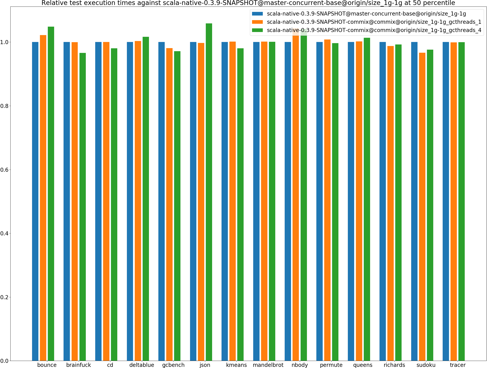
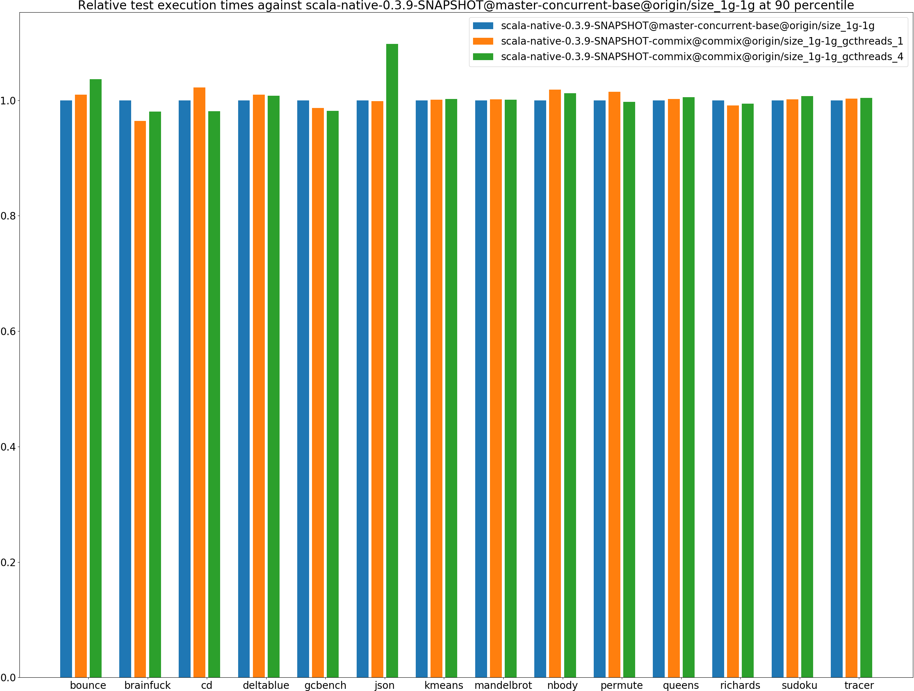
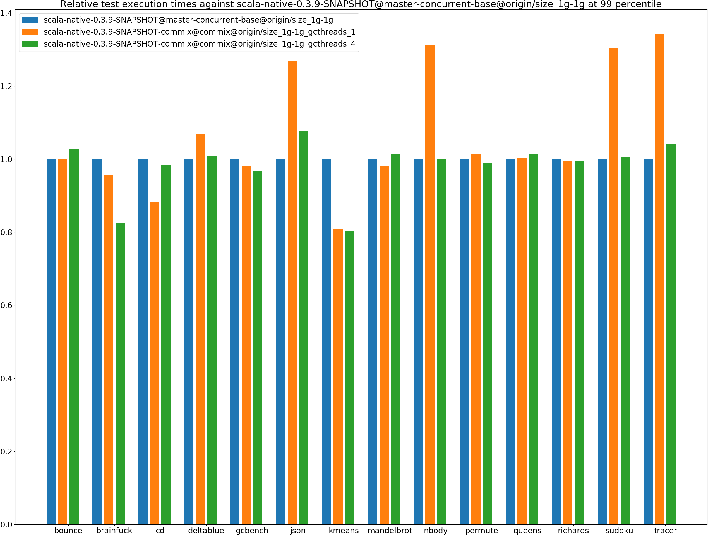
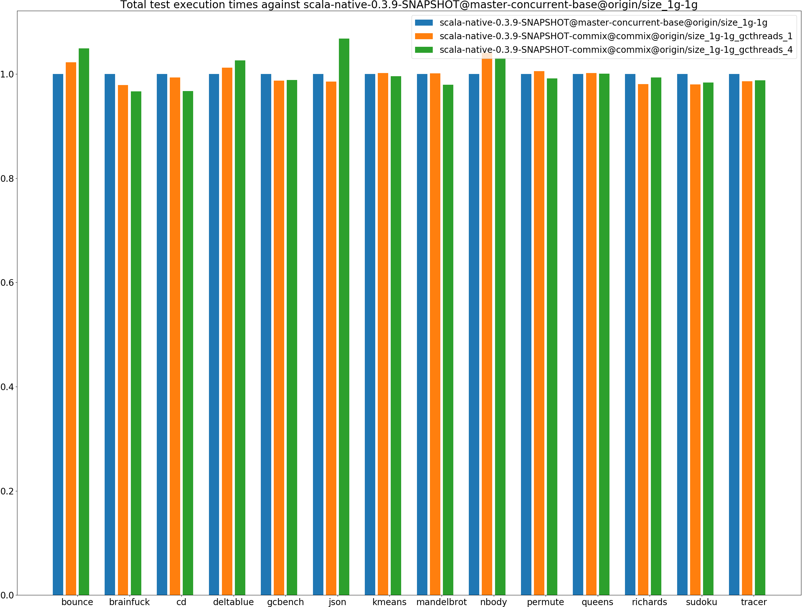
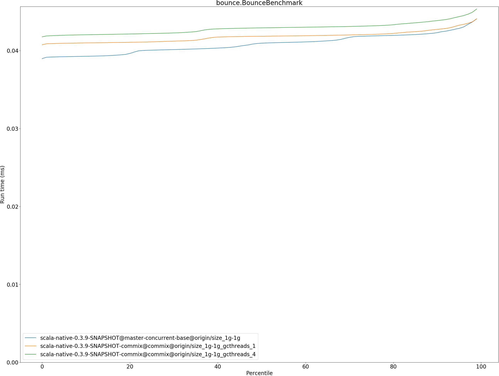

# Summary
## Benchmark run time (ms) at 50 percentile 

|name | scala-native-0.3.9-SNAPSHOT@master-concurrent-base@origin/size_1g-1g | scala-native-0.3.9-SNAPSHOT-commix@commix@origin/size_1g-1g_gcthreads_1 |  | scala-native-0.3.9-SNAPSHOT-commix@commix@origin/size_1g-1g_gcthreads_4 | |
| -- | -- | -- | -- | -- | -- |
|[bounce.BounceBenchmark](#bouncebouncebenchmark)|0.0410|0.0418|+2.17%|0.0429|+4.80%|
|[brainfuck.BrainfuckBenchmark](#brainfuckbrainfuckbenchmark)|2.3728|2.3724|__-0.02%__|2.2914|__-3.43%__|
|[cd.CDBenchmark](#cdcdbenchmark)|17.0053|17.0071|+0.01%|16.6753|__-1.94%__|
|[deltablue.DeltaBlueBenchmark](#deltabluedeltabluebenchmark)|0.1814|0.1820|+0.31%|0.1844|+1.63%|
|[gcbench.GCBenchBenchmark](#gcbenchgcbenchbenchmark)|66.1548|64.8802|__-1.93%__|64.2703|__-2.85%__|
|[json.JsonBenchmark](#jsonjsonbenchmark)|0.9358|0.9333|__-0.27%__|0.9904|+5.84%|
|[kmeans.KmeansBenchmark](#kmeanskmeansbenchmark)|36.0690|36.1285|+0.16%|35.3518|__-1.99%__|
|[mandelbrot.MandelbrotBenchmark](#mandelbrotmandelbrotbenchmark)|100.7072|100.8381|+0.13%|100.7997|+0.09%|
|[nbody.NbodyBenchmark](#nbodynbodybenchmark)|24.5717|25.6322|+4.32%|25.5814|+4.11%|
|[permute.PermuteBenchmark](#permutepermutebenchmark)|0.2098|0.2115|+0.83%|0.2091|__-0.34%__|
|[queens.QueensBenchmark](#queensqueensbenchmark)|0.0510|0.0511|+0.18%|0.0516|+1.32%|
|[richards.RichardsBenchmark](#richardsrichardsbenchmark)|0.0603|0.0595|__-1.24%__|0.0598|__-0.74%__|
|[sudoku.SudokuBenchmark](#sudokusudokubenchmark)|1.5931|1.5397|__-3.35%__|1.5549|__-2.40%__|
|[tracer.TracerBenchmark](#tracertracerbenchmark)|0.4879|0.4875|__-0.09%__|0.4878|__-0.02%__|
| __Geometrical mean:__|| |+0.07%| |+0.25%|
## Benchmark run time (ms) at 90 percentile 

|name | scala-native-0.3.9-SNAPSHOT@master-concurrent-base@origin/size_1g-1g | scala-native-0.3.9-SNAPSHOT-commix@commix@origin/size_1g-1g_gcthreads_1 |  | scala-native-0.3.9-SNAPSHOT-commix@commix@origin/size_1g-1g_gcthreads_4 | |
| -- | -- | -- | -- | -- | -- |
|[bounce.BounceBenchmark](#bouncebouncebenchmark)|0.0423|0.0427|+0.99%|0.0439|+3.65%|
|[brainfuck.BrainfuckBenchmark](#brainfuckbrainfuckbenchmark)|2.4765|2.3870|__-3.61%__|2.4275|__-1.98%__|
|[cd.CDBenchmark](#cdcdbenchmark)|17.1122|17.4891|+2.20%|16.7818|__-1.93%__|
|[deltablue.DeltaBlueBenchmark](#deltabluedeltabluebenchmark)|0.1852|0.1870|+0.99%|0.1866|+0.77%|
|[gcbench.GCBenchBenchmark](#gcbenchgcbenchbenchmark)|66.8558|65.9567|__-1.34%__|65.6075|__-1.87%__|
|[json.JsonBenchmark](#jsonjsonbenchmark)|0.9407|0.9393|__-0.15%__|1.0324|+9.74%|
|[kmeans.KmeansBenchmark](#kmeanskmeansbenchmark)|36.6244|36.6671|+0.12%|36.6981|+0.20%|
|[mandelbrot.MandelbrotBenchmark](#mandelbrotmandelbrotbenchmark)|100.7837|100.9142|+0.13%|100.8867|+0.10%|
|[nbody.NbodyBenchmark](#nbodynbodybenchmark)|25.6886|26.1570|+1.82%|26.0039|+1.23%|
|[permute.PermuteBenchmark](#permutepermutebenchmark)|0.2121|0.2151|+1.43%|0.2115|__-0.26%__|
|[queens.QueensBenchmark](#queensqueensbenchmark)|0.0527|0.0528|+0.19%|0.0530|+0.56%|
|[richards.RichardsBenchmark](#richardsrichardsbenchmark)|0.0627|0.0622|__-0.89%__|0.0623|__-0.62%__|
|[sudoku.SudokuBenchmark](#sudokusudokubenchmark)|1.6082|1.6104|+0.14%|1.6196|+0.71%|
|[tracer.TracerBenchmark](#tracertracerbenchmark)|0.4941|0.4953|+0.25%|0.4961|+0.41%|
| __Geometrical mean:__|| |+0.15%| |+0.73%|
## Benchmark run time (ms) at 99 percentile 

|name | scala-native-0.3.9-SNAPSHOT@master-concurrent-base@origin/size_1g-1g | scala-native-0.3.9-SNAPSHOT-commix@commix@origin/size_1g-1g_gcthreads_1 |  | scala-native-0.3.9-SNAPSHOT-commix@commix@origin/size_1g-1g_gcthreads_4 | |
| -- | -- | -- | -- | -- | -- |
|[bounce.BounceBenchmark](#bouncebouncebenchmark)|0.0441|0.0441|+0.03%|0.0453|+2.86%|
|[brainfuck.BrainfuckBenchmark](#brainfuckbrainfuckbenchmark)|2.9974|2.8674|__-4.34%__|2.4741|__-17.46%__|
|[cd.CDBenchmark](#cdcdbenchmark)|21.9642|19.3884|__-11.73%__|21.5965|__-1.67%__|
|[deltablue.DeltaBlueBenchmark](#deltabluedeltabluebenchmark)|0.1883|0.2013|+6.88%|0.1897|+0.72%|
|[gcbench.GCBenchBenchmark](#gcbenchgcbenchbenchmark)|77.4812|75.9566|__-1.97%__|74.9844|__-3.22%__|
|[json.JsonBenchmark](#jsonjsonbenchmark)|0.9670|1.2269|+26.88%|1.0409|+7.64%|
|[kmeans.KmeansBenchmark](#kmeanskmeansbenchmark)|49.0999|39.7278|__-19.09%__|39.3939|__-19.77%__|
|[mandelbrot.MandelbrotBenchmark](#mandelbrotmandelbrotbenchmark)|104.3348|102.3546|__-1.90%__|105.7409|+1.35%|
|[nbody.NbodyBenchmark](#nbodynbodybenchmark)|27.5265|36.0814|+31.08%|27.4948|__-0.12%__|
|[permute.PermuteBenchmark](#permutepermutebenchmark)|0.2169|0.2199|+1.38%|0.2143|__-1.17%__|
|[queens.QueensBenchmark](#queensqueensbenchmark)|0.0544|0.0545|+0.24%|0.0552|+1.52%|
|[richards.RichardsBenchmark](#richardsrichardsbenchmark)|0.0658|0.0653|__-0.62%__|0.0654|__-0.46%__|
|[sudoku.SudokuBenchmark](#sudokusudokubenchmark)|1.6337|2.1323|+30.52%|1.6413|+0.46%|
|[tracer.TracerBenchmark](#tracertracerbenchmark)|0.5023|0.6741|+34.21%|0.5225|+4.02%|
| __Geometrical mean:__|| |+5.32%| |__-2.10%__|
## Benchmark total run time (ms) 

|name | scala-native-0.3.9-SNAPSHOT@master-concurrent-base@origin/size_1g-1g | scala-native-0.3.9-SNAPSHOT-commix@commix@origin/size_1g-1g_gcthreads_1 |  | scala-native-0.3.9-SNAPSHOT-commix@commix@origin/size_1g-1g_gcthreads_4 | |
| -- | -- | -- | -- | -- | -- |
|[bounce.BounceBenchmark](#bouncebouncebenchmark)|817.8376|836.0578|+2.23%|857.9168|+4.90%|
|[brainfuck.BrainfuckBenchmark](#brainfuckbrainfuckbenchmark)|48384.6665|47347.3751|__-2.14%__|46775.8723|__-3.33%__|
|[cd.CDBenchmark](#cdcdbenchmark)|346446.6505|344175.7167|__-0.66%__|335139.7260|__-3.26%__|
|[deltablue.DeltaBlueBenchmark](#deltabluedeltabluebenchmark)|3597.3118|3640.4444|+1.20%|3691.0101|+2.60%|
|[gcbench.GCBenchBenchmark](#gcbenchgcbenchbenchmark)|1259126.9785|1242694.2099|__-1.31%__|1244280.9325|__-1.18%__|
|[json.JsonBenchmark](#jsonjsonbenchmark)|18905.6686|18632.7549|__-1.44%__|20186.1446|+6.77%|
|[kmeans.KmeansBenchmark](#kmeanskmeansbenchmark)|720405.6537|721534.1441|+0.16%|717353.5915|__-0.42%__|
|[mandelbrot.MandelbrotBenchmark](#mandelbrotmandelbrotbenchmark)|2015996.6238|2018397.3648|+0.12%|1974453.7733|__-2.06%__|
|[nbody.NbodyBenchmark](#nbodynbodybenchmark)|499501.7361|519878.8468|+4.08%|515000.4099|+3.10%|
|[permute.PermuteBenchmark](#permutepermutebenchmark)|4201.0063|4223.7274|+0.54%|4163.9833|__-0.88%__|
|[queens.QueensBenchmark](#queensqueensbenchmark)|1026.0478|1028.0642|+0.20%|1026.6663|+0.06%|
|[richards.RichardsBenchmark](#richardsrichardsbenchmark)|1213.8292|1190.1687|__-1.95%__|1205.3612|__-0.70%__|
|[sudoku.SudokuBenchmark](#sudokusudokubenchmark)|31970.6633|31334.5763|__-1.99%__|31442.0774|__-1.65%__|
|[tracer.TracerBenchmark](#tracertracerbenchmark)|10002.6828|9865.3858|__-1.37%__|9883.2461|__-1.19%__|
| __Geometrical mean:__|| |__-0.18%__| |+0.16%|
# Individual benchmarks
## bounce.BounceBenchmark

