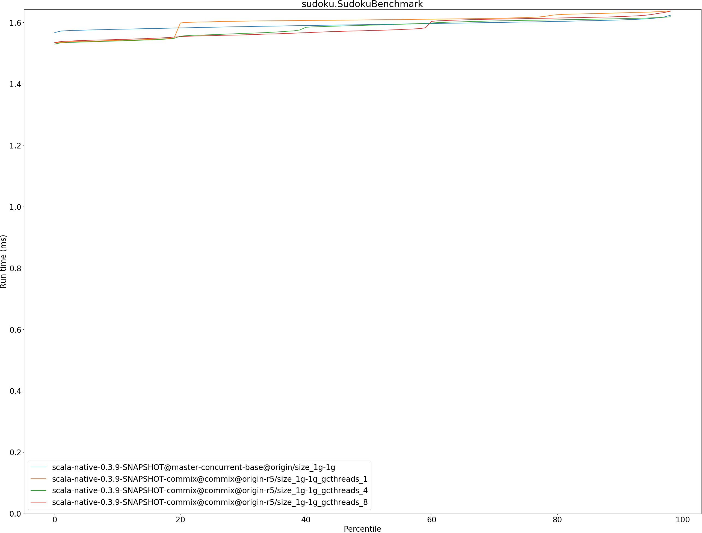

# Summary
## Benchmark run time (ms) at 50 percentile 

|name | scala-native-0.3.9-SNAPSHOT@master-concurrent-base@origin/size_1g-1g | scala-native-0.3.9-SNAPSHOT-commix@commix@origin-r5/size_1g-1g_gcthreads_1 |  | scala-native-0.3.9-SNAPSHOT-commix@commix@origin-r5/size_1g-1g_gcthreads_4 |  | scala-native-0.3.9-SNAPSHOT-commix@commix@origin-r5/size_1g-1g_gcthreads_8 | |
| -- | -- | -- | -- | -- | -- | -- | -- |
|[bounce.BounceBenchmark](#bouncebouncebenchmark)|0.0410|0.0430|+4.94%|0.0429|+4.87%|0.0430|+4.89%|
|[brainfuck.BrainfuckBenchmark](#brainfuckbrainfuckbenchmark)|2.3728|2.3896|+0.71%|2.3897|+0.71%|2.3868|+0.59%|
|[cd.CDBenchmark](#cdcdbenchmark)|17.0053|16.1316|__-5.14%__|16.7198|__-1.68%__|16.7421|__-1.55%__|
|[deltablue.DeltaBlueBenchmark](#deltabluedeltabluebenchmark)|0.1814|0.1840|+1.46%|0.1833|+1.06%|0.1846|+1.76%|
|[gcbench.GCBenchBenchmark](#gcbenchgcbenchbenchmark)|66.1548|65.2001|__-1.44%__|63.9072|__-3.40%__|60.9313|__-7.90%__|
|[json.JsonBenchmark](#jsonjsonbenchmark)|0.9358|1.0302|+10.09%|1.0283|+9.88%|1.0268|+9.73%|
|[kmeans.KmeansBenchmark](#kmeanskmeansbenchmark)|36.0690|36.4594|+1.08%|36.4281|+1.00%|36.5230|+1.26%|
|[mandelbrot.MandelbrotBenchmark](#mandelbrotmandelbrotbenchmark)|100.7072|100.8332|+0.13%|100.7627|+0.06%|100.8346|+0.13%|
|[nbody.NbodyBenchmark](#nbodynbodybenchmark)|24.5717|25.5898|+4.14%|25.5774|+4.09%|24.4432|__-0.52%__|
|[permute.PermuteBenchmark](#permutepermutebenchmark)|0.2098|0.2021|__-3.63%__|0.2089|__-0.39%__|0.2086|__-0.53%__|
|[queens.QueensBenchmark](#queensqueensbenchmark)|0.0510|0.0514|+0.92%|0.0519|+1.88%|0.0513|+0.72%|
|[richards.RichardsBenchmark](#richardsrichardsbenchmark)|0.0603|0.0594|__-1.53%__|0.0598|__-0.80%__|0.0592|__-1.71%__|
|[sudoku.SudokuBenchmark](#sudokusudokubenchmark)|1.5931|1.6085|+0.97%|1.5911|__-0.12%__|1.5735|__-1.23%__|
|[tracer.TracerBenchmark](#tracertracerbenchmark)|0.4879|0.4762|__-2.41%__|0.4857|__-0.44%__|0.4918|+0.79%|
| __Geometrical mean:__|| |+0.67%| |+1.15%| |+0.39%|
## Benchmark run time (ms) at 90 percentile 

|name | scala-native-0.3.9-SNAPSHOT@master-concurrent-base@origin/size_1g-1g | scala-native-0.3.9-SNAPSHOT-commix@commix@origin-r5/size_1g-1g_gcthreads_1 |  | scala-native-0.3.9-SNAPSHOT-commix@commix@origin-r5/size_1g-1g_gcthreads_4 |  | scala-native-0.3.9-SNAPSHOT-commix@commix@origin-r5/size_1g-1g_gcthreads_8 | |
| -- | -- | -- | -- | -- | -- | -- | -- |
|[bounce.BounceBenchmark](#bouncebouncebenchmark)|0.0423|0.0439|+3.85%|0.0439|+3.68%|0.0439|+3.74%|
|[brainfuck.BrainfuckBenchmark](#brainfuckbrainfuckbenchmark)|2.4765|2.4281|__-1.95%__|2.4250|__-2.08%__|2.4041|__-2.92%__|
|[cd.CDBenchmark](#cdcdbenchmark)|17.1122|17.7448|+3.70%|18.4677|+7.92%|17.1931|+0.47%|
|[deltablue.DeltaBlueBenchmark](#deltabluedeltabluebenchmark)|0.1852|0.1865|+0.73%|0.1876|+1.33%|0.1867|+0.82%|
|[gcbench.GCBenchBenchmark](#gcbenchgcbenchbenchmark)|66.8558|66.9690|+0.17%|65.8542|__-1.50%__|63.9449|__-4.35%__|
|[json.JsonBenchmark](#jsonjsonbenchmark)|0.9407|1.0350|+10.02%|1.0336|+9.87%|1.0326|+9.76%|
|[kmeans.KmeansBenchmark](#kmeanskmeansbenchmark)|36.6244|36.8284|+0.56%|36.8292|+0.56%|37.9131|+3.52%|
|[mandelbrot.MandelbrotBenchmark](#mandelbrotmandelbrotbenchmark)|100.7837|100.9095|+0.12%|100.8386|+0.05%|100.9110|+0.13%|
|[nbody.NbodyBenchmark](#nbodynbodybenchmark)|25.6886|26.0149|+1.27%|25.9980|+1.20%|24.8306|__-3.34%__|
|[permute.PermuteBenchmark](#permutepermutebenchmark)|0.2121|0.2101|__-0.91%__|0.2113|__-0.37%__|0.2109|__-0.53%__|
|[queens.QueensBenchmark](#queensqueensbenchmark)|0.0527|0.0530|+0.46%|0.0536|+1.65%|0.0528|+0.07%|
|[richards.RichardsBenchmark](#richardsrichardsbenchmark)|0.0627|0.0621|__-0.95%__|0.0623|__-0.58%__|0.0619|__-1.34%__|
|[sudoku.SudokuBenchmark](#sudokusudokubenchmark)|1.6082|1.6311|+1.43%|1.6123|+0.25%|1.6191|+0.68%|
|[tracer.TracerBenchmark](#tracertracerbenchmark)|0.4941|0.4950|+0.19%|0.4939|__-0.04%__|0.4982|+0.83%|
| __Geometrical mean:__|| |+1.30%| |+1.52%| |+0.48%|
## Benchmark run time (ms) at 99 percentile 

|name | scala-native-0.3.9-SNAPSHOT@master-concurrent-base@origin/size_1g-1g | scala-native-0.3.9-SNAPSHOT-commix@commix@origin-r5/size_1g-1g_gcthreads_1 |  | scala-native-0.3.9-SNAPSHOT-commix@commix@origin-r5/size_1g-1g_gcthreads_4 |  | scala-native-0.3.9-SNAPSHOT-commix@commix@origin-r5/size_1g-1g_gcthreads_8 | |
| -- | -- | -- | -- | -- | -- | -- | -- |
|[bounce.BounceBenchmark](#bouncebouncebenchmark)|0.0441|0.0455|+3.19%|0.0454|+2.91%|0.0454|+2.92%|
|[brainfuck.BrainfuckBenchmark](#brainfuckbrainfuckbenchmark)|2.9974|2.9157|__-2.73%__|2.4986|__-16.64%__|2.5690|__-14.29%__|
|[cd.CDBenchmark](#cdcdbenchmark)|21.9642|18.7624|__-14.58%__|21.6323|__-1.51%__|21.6087|__-1.62%__|
|[deltablue.DeltaBlueBenchmark](#deltabluedeltabluebenchmark)|0.1883|0.1892|+0.46%|0.1909|+1.38%|0.1892|+0.47%|
|[gcbench.GCBenchBenchmark](#gcbenchgcbenchbenchmark)|77.4812|69.7449|__-9.98%__|67.4704|__-12.92%__|64.5082|__-16.74%__|
|[json.JsonBenchmark](#jsonjsonbenchmark)|0.9670|1.2905|+33.46%|1.0680|+10.45%|1.0377|+7.31%|
|[kmeans.KmeansBenchmark](#kmeanskmeansbenchmark)|49.0999|39.7197|__-19.10%__|39.4160|__-19.72%__|52.0302|+5.97%|
|[mandelbrot.MandelbrotBenchmark](#mandelbrotmandelbrotbenchmark)|104.3348|102.2824|__-1.97%__|101.0585|__-3.14%__|101.8544|__-2.38%__|
|[nbody.NbodyBenchmark](#nbodynbodybenchmark)|27.5265|27.4624|__-0.23%__|36.0915|+31.12%|25.8402|__-6.13%__|
|[permute.PermuteBenchmark](#permutepermutebenchmark)|0.2169|0.2131|__-1.75%__|0.2148|__-0.98%__|0.2155|__-0.64%__|
|[queens.QueensBenchmark](#queensqueensbenchmark)|0.0544|0.0556|+2.32%|0.0553|+1.73%|0.0549|+1.08%|
|[richards.RichardsBenchmark](#richardsrichardsbenchmark)|0.0658|0.0658|+0.03%|0.0653|__-0.74%__|0.0649|__-1.24%__|
|[sudoku.SudokuBenchmark](#sudokusudokubenchmark)|1.6337|1.6553|+1.32%|1.6215|__-0.75%__|1.6535|+1.21%|
|[tracer.TracerBenchmark](#tracertracerbenchmark)|0.5023|0.6632|+32.04%|0.5224|+4.00%|0.5242|+4.36%|
| __Geometrical mean:__|| |+0.69%| |__-1.01%__| |__-1.65%__|
## Benchmark total run time (ms) 

|name | scala-native-0.3.9-SNAPSHOT@master-concurrent-base@origin/size_1g-1g | scala-native-0.3.9-SNAPSHOT-commix@commix@origin-r5/size_1g-1g_gcthreads_1 |  | scala-native-0.3.9-SNAPSHOT-commix@commix@origin-r5/size_1g-1g_gcthreads_4 |  | scala-native-0.3.9-SNAPSHOT-commix@commix@origin-r5/size_1g-1g_gcthreads_8 | |
| -- | -- | -- | -- | -- | -- | -- | -- |
|[bounce.BounceBenchmark](#bouncebouncebenchmark)|817.8376|214.6344|__-73.76%__|214.5430|__-73.77%__|214.5735|__-73.76%__|
|[brainfuck.BrainfuckBenchmark](#brainfuckbrainfuckbenchmark)|48384.6665|12033.0243|__-75.13%__|12033.6007|__-75.13%__|11807.7530|__-75.60%__|
|[cd.CDBenchmark](#cdcdbenchmark)|346446.6505|82605.4094|__-76.16%__|86212.3278|__-75.12%__|84974.6007|__-75.47%__|
|[deltablue.DeltaBlueBenchmark](#deltabluedeltabluebenchmark)|3597.3118|917.7659|__-74.49%__|912.0508|__-74.65%__|923.9063|__-74.32%__|
|[gcbench.GCBenchBenchmark](#gcbenchgcbenchbenchmark)|1259126.9785|314507.7223|__-75.02%__|310995.3326|__-75.30%__|300760.1560|__-76.11%__|
|[json.JsonBenchmark](#jsonjsonbenchmark)|18905.6686|5173.0277|__-72.64%__|5121.4817|__-72.91%__|5071.3151|__-73.18%__|
|[kmeans.KmeansBenchmark](#kmeanskmeansbenchmark)|720405.6537|183176.8882|__-74.57%__|183017.8910|__-74.60%__|187390.4229|__-73.99%__|
|[mandelbrot.MandelbrotBenchmark](#mandelbrotmandelbrotbenchmark)|2015996.6238|504410.9065|__-74.98%__|495263.4699|__-75.43%__|504663.8274|__-74.97%__|
|[nbody.NbodyBenchmark](#nbodynbodybenchmark)|499501.7361|128574.6434|__-74.26%__|129800.3827|__-74.01%__|122743.7776|__-75.43%__|
|[permute.PermuteBenchmark](#permutepermutebenchmark)|4201.0063|1020.9241|__-75.70%__|1045.8178|__-75.11%__|1044.6203|__-75.13%__|
|[queens.QueensBenchmark](#queensqueensbenchmark)|1026.0478|256.5599|__-75.00%__|260.8398|__-74.58%__|255.6150|__-75.09%__|
|[richards.RichardsBenchmark](#richardsrichardsbenchmark)|1213.8292|296.9584|__-75.54%__|301.2109|__-75.19%__|296.1560|__-75.60%__|
|[sudoku.SudokuBenchmark](#sudokusudokubenchmark)|31970.6633|8006.2136|__-74.96%__|7919.1751|__-75.23%__|7917.0834|__-75.24%__|
|[tracer.TracerBenchmark](#tracertracerbenchmark)|10002.6828|2427.8518|__-75.73%__|2442.7630|__-75.58%__|2481.4441|__-75.19%__|
| __Geometrical mean:__|| |__-74.87%__| |__-74.77%__| |__-74.95%__|
# Individual benchmarks
## bounce.BounceBenchmark

## brainfuck.BrainfuckBenchmark

## cd.CDBenchmark

## deltablue.DeltaBlueBenchmark

## gcbench.GCBenchBenchmark

## json.JsonBenchmark

## kmeans.KmeansBenchmark

## mandelbrot.MandelbrotBenchmark

## nbody.NbodyBenchmark

## permute.PermuteBenchmark

## queens.QueensBenchmark

## richards.RichardsBenchmark

## sudoku.SudokuBenchmark

## tracer.TracerBenchmark

