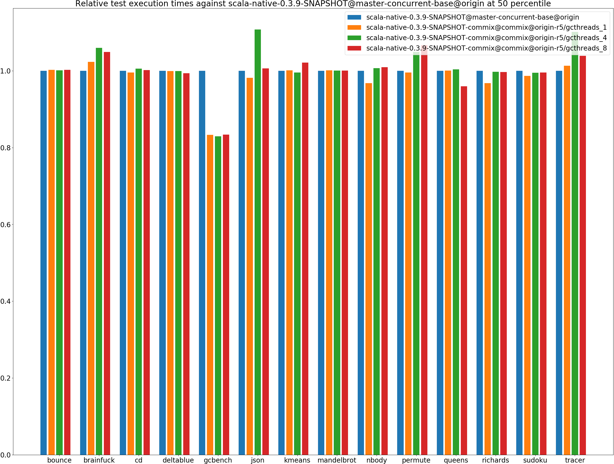
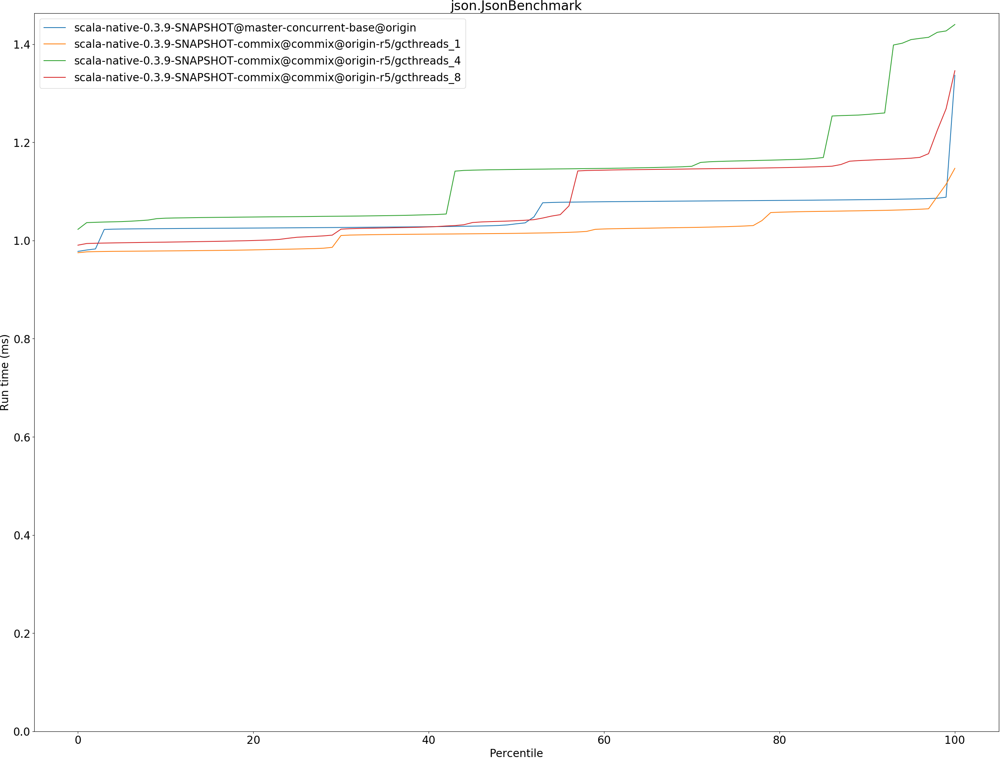
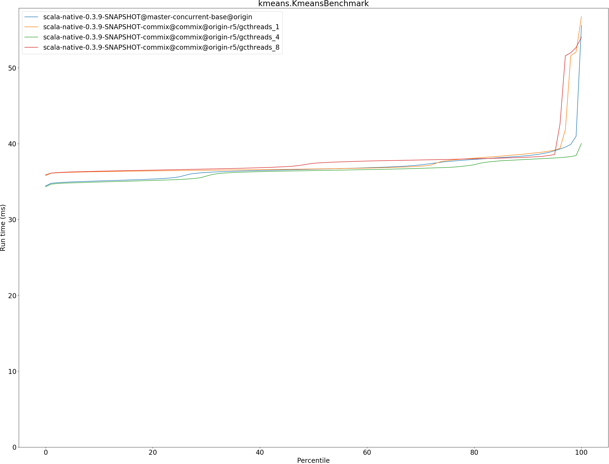

# Summary
## Benchmark run time (ms) at 50 percentile 

|name | scala-native-0.3.9-SNAPSHOT@master-concurrent-base@origin | scala-native-0.3.9-SNAPSHOT-commix@commix@origin-r5/gcthreads_1 |  | scala-native-0.3.9-SNAPSHOT-commix@commix@origin-r5/gcthreads_4 |  | scala-native-0.3.9-SNAPSHOT-commix@commix@origin-r5/gcthreads_8 | |
| -- | -- | -- | -- | -- | -- | -- | -- |
|[bounce.BounceBenchmark](#bouncebouncebenchmark)|0.0412|0.0413|+0.20%|0.0413|+0.12%|0.0413|+0.22%|
|[brainfuck.BrainfuckBenchmark](#brainfuckbrainfuckbenchmark)|2.3769|2.4314|+2.30%|2.5176|+5.92%|2.4924|+4.86%|
|[cd.CDBenchmark](#cdcdbenchmark)|17.0257|16.9459|__-0.47%__|17.1189|+0.55%|17.0572|+0.19%|
|[deltablue.DeltaBlueBenchmark](#deltabluedeltabluebenchmark)|0.1382|0.1380|__-0.09%__|0.1381|__-0.07%__|0.1372|__-0.69%__|
|[gcbench.GCBenchBenchmark](#gcbenchgcbenchbenchmark)|71.5424|59.6062|__-16.68%__|59.3461|__-17.05%__|59.6212|__-16.66%__|
|[json.JsonBenchmark](#jsonjsonbenchmark)|1.0340|1.0146|__-1.88%__|1.1448|+10.71%|1.0403|+0.61%|
|[kmeans.KmeansBenchmark](#kmeanskmeansbenchmark)|36.6283|36.6599|+0.09%|36.4470|__-0.49%__|37.4096|+2.13%|
|[mandelbrot.MandelbrotBenchmark](#mandelbrotmandelbrotbenchmark)|100.7056|100.8304|+0.12%|100.7679|+0.06%|100.7667|+0.06%|
|[nbody.NbodyBenchmark](#nbodynbodybenchmark)|25.5941|24.7642|__-3.24%__|25.7709|+0.69%|25.8266|+0.91%|
|[permute.PermuteBenchmark](#permutepermutebenchmark)|0.1438|0.1431|__-0.44%__|0.1508|+4.88%|0.1533|+6.61%|
|[queens.QueensBenchmark](#queensqueensbenchmark)|0.0486|0.0486|+0.06%|0.0488|+0.36%|0.0466|__-4.06%__|
|[richards.RichardsBenchmark](#richardsrichardsbenchmark)|0.0548|0.0530|__-3.24%__|0.0547|__-0.28%__|0.0546|__-0.32%__|
|[sudoku.SudokuBenchmark](#sudokusudokubenchmark)|1.6148|1.5930|__-1.35%__|1.6067|__-0.50%__|1.6074|__-0.46%__|
|[tracer.TracerBenchmark](#tracertracerbenchmark)|0.4750|0.4811|+1.28%|0.5229|+10.09%|0.4933|+3.87%|
| __Geometrical mean:__|| |__-1.78%__| |+0.86%| |__-0.34%__|
## Benchmark run time (ms) at 90 percentile 

|name | scala-native-0.3.9-SNAPSHOT@master-concurrent-base@origin | scala-native-0.3.9-SNAPSHOT-commix@commix@origin-r5/gcthreads_1 |  | scala-native-0.3.9-SNAPSHOT-commix@commix@origin-r5/gcthreads_4 |  | scala-native-0.3.9-SNAPSHOT-commix@commix@origin-r5/gcthreads_8 | |
| -- | -- | -- | -- | -- | -- | -- | -- |
|[bounce.BounceBenchmark](#bouncebouncebenchmark)|0.0441|0.0460|+4.25%|0.0415|__-5.82%__|0.0462|+4.90%|
|[brainfuck.BrainfuckBenchmark](#brainfuckbrainfuckbenchmark)|2.4827|2.5061|+0.94%|2.6448|+6.53%|2.6502|+6.74%|
|[cd.CDBenchmark](#cdcdbenchmark)|17.1497|17.1045|__-0.26%__|17.2531|+0.60%|17.1720|+0.13%|
|[deltablue.DeltaBlueBenchmark](#deltabluedeltabluebenchmark)|0.1587|0.1414|__-10.88%__|0.1524|__-3.94%__|0.1505|__-5.13%__|
|[gcbench.GCBenchBenchmark](#gcbenchgcbenchbenchmark)|74.3233|62.5121|__-15.89%__|62.1644|__-16.36%__|62.5827|__-15.80%__|
|[json.JsonBenchmark](#jsonjsonbenchmark)|1.0832|1.0608|__-2.07%__|1.2568|+16.02%|1.1635|+7.42%|
|[kmeans.KmeansBenchmark](#kmeanskmeansbenchmark)|38.4228|38.6770|+0.66%|37.9258|__-1.29%__|38.2152|__-0.54%__|
|[mandelbrot.MandelbrotBenchmark](#mandelbrotmandelbrotbenchmark)|100.7808|100.9064|+0.12%|100.8436|+0.06%|100.8436|+0.06%|
|[nbody.NbodyBenchmark](#nbodynbodybenchmark)|25.9036|25.6818|__-0.86%__|26.0340|+0.50%|26.2411|+1.30%|
|[permute.PermuteBenchmark](#permutepermutebenchmark)|0.1469|0.1500|+2.07%|0.1662|+13.10%|0.1625|+10.61%|
|[queens.QueensBenchmark](#queensqueensbenchmark)|0.0489|0.0496|+1.46%|0.0499|+1.99%|0.0488|__-0.30%__|
|[richards.RichardsBenchmark](#richardsrichardsbenchmark)|0.0570|0.0553|__-3.07%__|0.0586|+2.74%|0.0586|+2.72%|
|[sudoku.SudokuBenchmark](#sudokusudokubenchmark)|1.6875|1.6983|+0.63%|1.7887|+5.99%|1.7964|+6.45%|
|[tracer.TracerBenchmark](#tracertracerbenchmark)|0.4789|0.4857|+1.44%|0.5334|+11.38%|0.5448|+13.76%|
| __Geometrical mean:__|| |__-1.68%__| |+1.93%| |+2.06%|
## Benchmark run time (ms) at 99 percentile 

|name | scala-native-0.3.9-SNAPSHOT@master-concurrent-base@origin | scala-native-0.3.9-SNAPSHOT-commix@commix@origin-r5/gcthreads_1 |  | scala-native-0.3.9-SNAPSHOT-commix@commix@origin-r5/gcthreads_4 |  | scala-native-0.3.9-SNAPSHOT-commix@commix@origin-r5/gcthreads_8 | |
| -- | -- | -- | -- | -- | -- | -- | -- |
|[bounce.BounceBenchmark](#bouncebouncebenchmark)|0.0445|0.0464|+4.30%|0.0446|+0.22%|0.0495|+11.35%|
|[brainfuck.BrainfuckBenchmark](#brainfuckbrainfuckbenchmark)|2.5408|2.5778|+1.46%|2.7214|+7.11%|2.7134|+6.80%|
|[cd.CDBenchmark](#cdcdbenchmark)|19.1031|22.2316|+16.38%|22.1423|+15.91%|22.1260|+15.82%|
|[deltablue.DeltaBlueBenchmark](#deltabluedeltabluebenchmark)|0.1989|0.1819|__-8.55%__|0.2049|+3.01%|0.2125|+6.84%|
|[gcbench.GCBenchBenchmark](#gcbenchgcbenchbenchmark)|76.8841|69.3943|__-9.74%__|69.1714|__-10.03%__|68.8509|__-10.45%__|
|[json.JsonBenchmark](#jsonjsonbenchmark)|1.0881|1.1146|+2.43%|1.4269|+31.13%|1.2683|+16.56%|
|[kmeans.KmeansBenchmark](#kmeanskmeansbenchmark)|40.9655|52.0873|+27.15%|38.4230|__-6.21%__|52.6729|+28.58%|
|[mandelbrot.MandelbrotBenchmark](#mandelbrotmandelbrotbenchmark)|102.3627|101.6738|__-0.67%__|101.5170|__-0.83%__|105.6753|+3.24%|
|[nbody.NbodyBenchmark](#nbodynbodybenchmark)|27.5296|26.9940|__-1.95%__|26.9907|__-1.96%__|36.3659|+32.10%|
|[permute.PermuteBenchmark](#permutepermutebenchmark)|0.1648|0.1683|+2.13%|0.2032|+23.35%|0.2074|+25.87%|
|[queens.QueensBenchmark](#queensqueensbenchmark)|0.0512|0.0521|+1.68%|0.0558|+8.95%|0.0529|+3.29%|
|[richards.RichardsBenchmark](#richardsrichardsbenchmark)|0.0625|0.0605|__-3.20%__|0.0687|+9.89%|0.0680|+8.77%|
|[sudoku.SudokuBenchmark](#sudokusudokubenchmark)|1.7857|1.7702|__-0.86%__|1.9026|+6.55%|1.9092|+6.92%|
|[tracer.TracerBenchmark](#tracertracerbenchmark)|0.4835|0.5106|+5.61%|0.5572|+15.23%|0.5778|+19.51%|
| __Geometrical mean:__|| |+2.20%| |+6.77%| |+11.97%|
## Benchmark run time (ms) at 99.9 percentile 

|name | scala-native-0.3.9-SNAPSHOT@master-concurrent-base@origin | scala-native-0.3.9-SNAPSHOT-commix@commix@origin-r5/gcthreads_1 |  | scala-native-0.3.9-SNAPSHOT-commix@commix@origin-r5/gcthreads_4 |  | scala-native-0.3.9-SNAPSHOT-commix@commix@origin-r5/gcthreads_8 | |
| -- | -- | -- | -- | -- | -- | -- | -- |
|[bounce.BounceBenchmark](#bouncebouncebenchmark)|0.0587|0.0589|+0.37%|0.0732|+24.66%|0.0769|+30.98%|
|[brainfuck.BrainfuckBenchmark](#brainfuckbrainfuckbenchmark)|2.6256|2.6538|+1.08%|3.2518|+23.85%|2.7852|+6.08%|
|[cd.CDBenchmark](#cdcdbenchmark)|22.1963|22.3395|+0.65%|22.3020|+0.48%|22.2269|+0.14%|
|[deltablue.DeltaBlueBenchmark](#deltabluedeltabluebenchmark)|0.2161|0.2062|__-4.58%__|0.2145|__-0.73%__|0.2368|+9.60%|
|[gcbench.GCBenchBenchmark](#gcbenchgcbenchbenchmark)|87.1384|73.6423|__-15.49%__|72.5609|__-16.73%__|72.6156|__-16.67%__|
|[json.JsonBenchmark](#jsonjsonbenchmark)|1.3285|1.1249|__-15.33%__|1.4325|+7.83%|1.3115|__-1.28%__|
|[kmeans.KmeansBenchmark](#kmeanskmeansbenchmark)|53.7817|54.4281|+1.20%|38.7645|__-27.92%__|53.4988|__-0.53%__|
|[mandelbrot.MandelbrotBenchmark](#mandelbrotmandelbrotbenchmark)|108.2647|105.8016|__-2.28%__|105.7377|__-2.33%__|105.7926|__-2.28%__|
|[nbody.NbodyBenchmark](#nbodynbodybenchmark)|36.1370|36.1929|+0.15%|27.7532|__-23.20%__|37.3415|+3.33%|
|[permute.PermuteBenchmark](#permutepermutebenchmark)|0.1690|0.1833|+8.52%|0.2096|+24.04%|0.2120|+25.50%|
|[queens.QueensBenchmark](#queensqueensbenchmark)|0.0690|0.0620|__-10.15%__|0.0833|+20.69%|0.0859|+24.40%|
|[richards.RichardsBenchmark](#richardsrichardsbenchmark)|0.0741|0.0701|__-5.34%__|0.1028|+38.77%|0.0927|+25.13%|
|[sudoku.SudokuBenchmark](#sudokusudokubenchmark)|1.7969|1.9641|+9.31%|1.9220|+6.96%|1.9458|+8.29%|
|[tracer.TracerBenchmark](#tracertracerbenchmark)|0.5092|0.5227|+2.63%|0.7223|+41.84%|0.5901|+15.87%|
| __Geometrical mean:__|| |__-2.37%__| |+6.31%| |+8.39%|
## Benchmark total run time (ms) 

|name | scala-native-0.3.9-SNAPSHOT@master-concurrent-base@origin | scala-native-0.3.9-SNAPSHOT-commix@commix@origin-r5/gcthreads_1 |  | scala-native-0.3.9-SNAPSHOT-commix@commix@origin-r5/gcthreads_4 |  | scala-native-0.3.9-SNAPSHOT-commix@commix@origin-r5/gcthreads_8 | |
| -- | -- | -- | -- | -- | -- | -- | -- |
|[bounce.BounceBenchmark](#bouncebouncebenchmark)|824.5545|210.2666|__-74.50%__|207.7175|__-74.81%__|213.4818|__-74.11%__|
|[brainfuck.BrainfuckBenchmark](#brainfuckbrainfuckbenchmark)|47543.4776|12157.5841|__-74.43%__|12589.9192|__-73.52%__|12462.6033|__-73.79%__|
|[cd.CDBenchmark](#cdcdbenchmark)|341662.7014|85815.1292|__-74.88%__|85714.6373|__-74.91%__|85655.2601|__-74.93%__|
|[deltablue.DeltaBlueBenchmark](#deltabluedeltabluebenchmark)|2888.5587|701.0195|__-75.73%__|713.0721|__-75.31%__|707.9441|__-75.49%__|
|[gcbench.GCBenchBenchmark](#gcbenchgcbenchbenchmark)|1409214.8311|302220.3863|__-78.55%__|300133.6901|__-78.70%__|302722.9316|__-78.52%__|
|[json.JsonBenchmark](#jsonjsonbenchmark)|21053.7293|5088.1552|__-75.83%__|5669.3176|__-73.07%__|5388.2849|__-74.41%__|
|[kmeans.KmeansBenchmark](#kmeanskmeansbenchmark)|736730.4543|187349.1913|__-74.57%__|181797.7219|__-75.32%__|189147.3986|__-74.33%__|
|[mandelbrot.MandelbrotBenchmark](#mandelbrotmandelbrotbenchmark)|2015802.6077|499955.8403|__-75.20%__|504115.6810|__-74.99%__|504288.3036|__-74.98%__|
|[nbody.NbodyBenchmark](#nbodynbodybenchmark)|505068.3410|125423.6902|__-75.17%__|127623.3779|__-74.73%__|128939.6799|__-74.47%__|
|[permute.PermuteBenchmark](#permutepermutebenchmark)|2900.4835|726.0003|__-74.97%__|757.1114|__-73.90%__|764.1507|__-73.65%__|
|[queens.QueensBenchmark](#queensqueensbenchmark)|968.5119|242.6400|__-74.95%__|243.5491|__-74.85%__|239.0781|__-75.31%__|
|[richards.RichardsBenchmark](#richardsrichardsbenchmark)|1092.9586|268.4531|__-75.44%__|278.2042|__-74.55%__|277.8556|__-74.58%__|
|[sudoku.SudokuBenchmark](#sudokusudokubenchmark)|32525.8770|7970.6751|__-75.49%__|8153.3637|__-74.93%__|8144.7571|__-74.96%__|
|[tracer.TracerBenchmark](#tracertracerbenchmark)|9397.0352|2384.7095|__-74.62%__|2576.6127|__-72.58%__|2528.3935|__-73.09%__|
| __Geometrical mean:__|| |__-75.33%__| |__-74.77%__| |__-74.79%__|
# Individual benchmarks
## bounce.BounceBenchmark

## brainfuck.BrainfuckBenchmark

## cd.CDBenchmark

## deltablue.DeltaBlueBenchmark

## gcbench.GCBenchBenchmark

## json.JsonBenchmark

## kmeans.KmeansBenchmark

## mandelbrot.MandelbrotBenchmark

## nbody.NbodyBenchmark

## permute.PermuteBenchmark

## queens.QueensBenchmark

## richards.RichardsBenchmark

## sudoku.SudokuBenchmark

## tracer.TracerBenchmark

