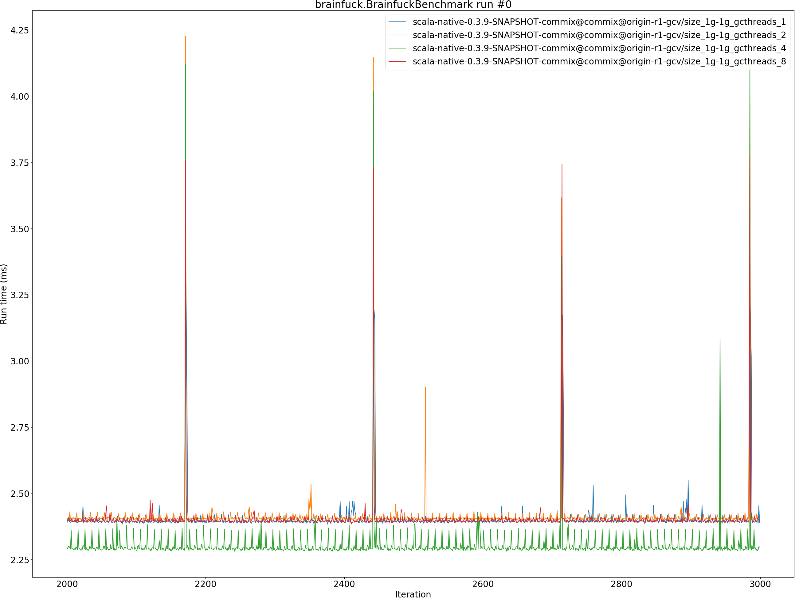
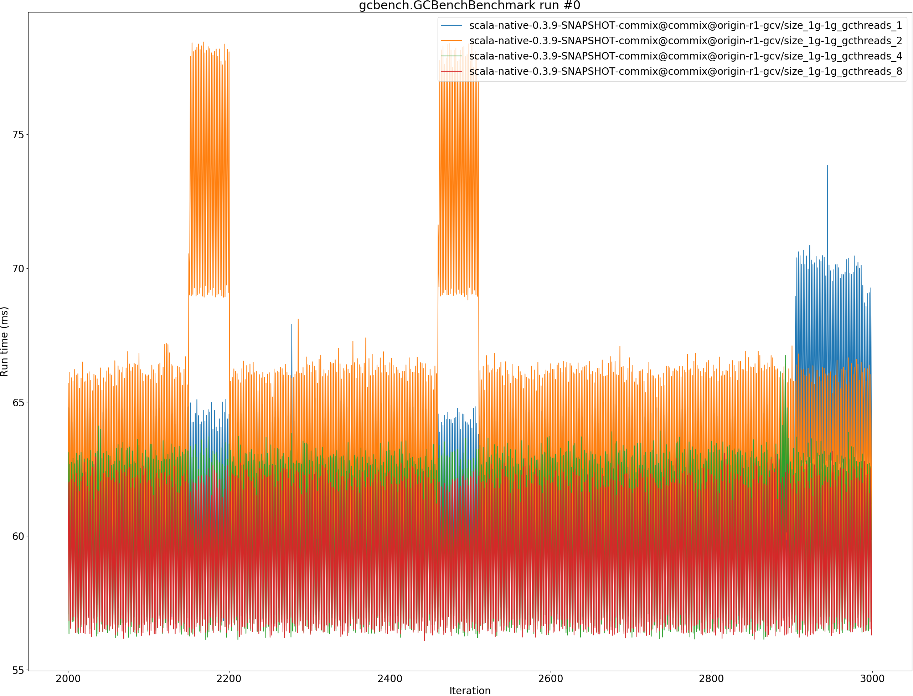
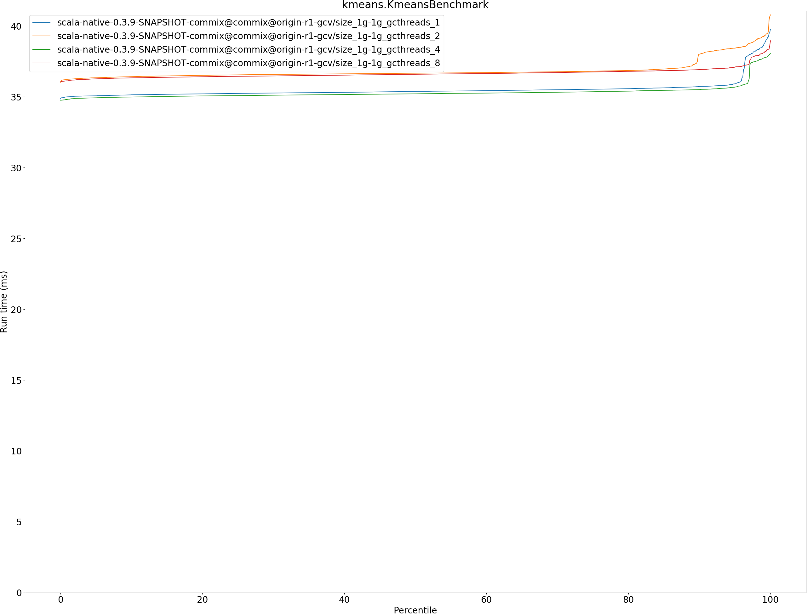
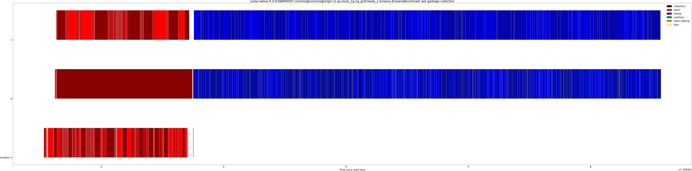
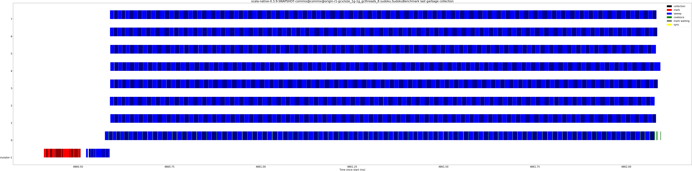
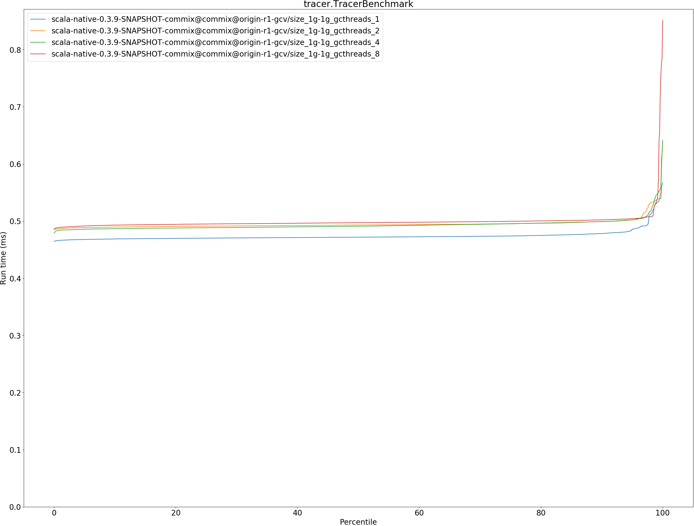
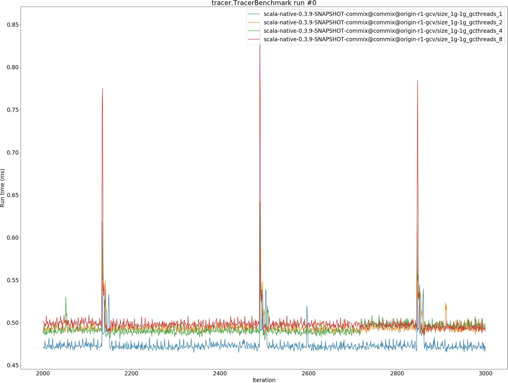
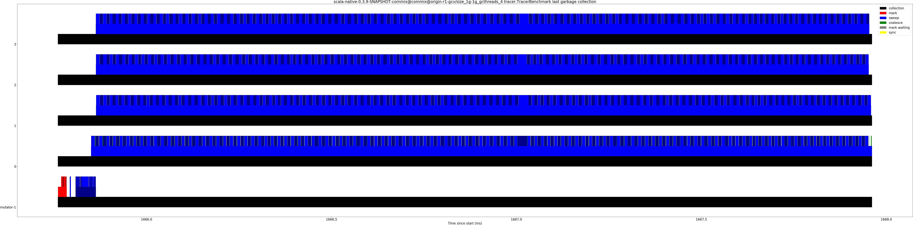

# Summary
## Benchmark run time (ms) at 50 percentile 

|name | scala-native-0.3.9-SNAPSHOT-commix@commix@origin-r1-gcv/size_1g-1g_gcthreads_1 | scala-native-0.3.9-SNAPSHOT-commix@commix@origin-r1-gcv/size_1g-1g_gcthreads_2 |  | scala-native-0.3.9-SNAPSHOT-commix@commix@origin-r1-gcv/size_1g-1g_gcthreads_4 |  | scala-native-0.3.9-SNAPSHOT-commix@commix@origin-r1-gcv/size_1g-1g_gcthreads_8 | |
| -- | -- | -- | -- | -- | -- | -- | -- |
|[bounce.BounceBenchmark](#bouncebouncebenchmark)|0.0400|0.0400|__-0.18%__|0.0383|__-4.39%__|0.0400|__-0.03%__|
|[brainfuck.BrainfuckBenchmark](#brainfuckbrainfuckbenchmark)|2.3941|2.4041|+0.42%|2.2906|__-4.32%__|2.3962|+0.09%|
|[cd.CDBenchmark](#cdcdbenchmark)|17.0046|16.9997|__-0.03%__|16.9694|__-0.21%__|16.9681|__-0.21%__|
|[deltablue.DeltaBlueBenchmark](#deltabluedeltabluebenchmark)|0.1786|0.1871|+4.75%|0.1868|+4.58%|0.1873|+4.87%|
|[gcbench.GCBenchBenchmark](#gcbenchgcbenchbenchmark)|63.4277|65.7837|+3.71%|61.1285|__-3.62%__|59.0956|__-6.83%__|
|[json.JsonBenchmark](#jsonjsonbenchmark)|0.8991|0.9361|+4.11%|0.9354|+4.03%|0.9349|+3.98%|
|[kmeans.KmeansBenchmark](#kmeanskmeansbenchmark)|35.3766|36.6632|+3.64%|35.2060|__-0.48%__|36.5861|+3.42%|
|[mandelbrot.MandelbrotBenchmark](#mandelbrotmandelbrotbenchmark)|100.7036|96.2451|__-4.43%__|100.7443|+0.04%|100.7449|+0.04%|
|[nbody.NbodyBenchmark](#nbodynbodybenchmark)|25.5341|25.5979|+0.25%|25.5291|__-0.02%__|24.4142|__-4.39%__|
|[permute.PermuteBenchmark](#permutepermutebenchmark)|0.2096|0.2100|+0.17%|0.2110|+0.65%|0.2097|+0.04%|
|[queens.QueensBenchmark](#queensqueensbenchmark)|0.0508|0.0506|__-0.35%__|0.0486|__-4.40%__|0.0485|__-4.51%__|
|[richards.RichardsBenchmark](#richardsrichardsbenchmark)|0.0598|0.0597|__-0.19%__|0.0572|__-4.37%__|0.0599|+0.13%|
|[sudoku.SudokuBenchmark](#sudokusudokubenchmark)|1.5385|1.6209|+5.36%|1.6100|+4.65%|1.6345|+6.24%|
|[tracer.TracerBenchmark](#tracertracerbenchmark)|0.4718|0.4930|+4.49%|0.4910|+4.07%|0.4972|+5.38%|
| __Geometrical mean:__|| |+1.52%| |__-0.33%__| |+0.52%|
## Benchmark run time (ms) at 90 percentile 

|name | scala-native-0.3.9-SNAPSHOT-commix@commix@origin-r1-gcv/size_1g-1g_gcthreads_1 | scala-native-0.3.9-SNAPSHOT-commix@commix@origin-r1-gcv/size_1g-1g_gcthreads_2 |  | scala-native-0.3.9-SNAPSHOT-commix@commix@origin-r1-gcv/size_1g-1g_gcthreads_4 |  | scala-native-0.3.9-SNAPSHOT-commix@commix@origin-r1-gcv/size_1g-1g_gcthreads_8 | |
| -- | -- | -- | -- | -- | -- | -- | -- |
|[bounce.BounceBenchmark](#bouncebouncebenchmark)|0.0410|0.0409|__-0.30%__|0.0392|__-4.45%__|0.0410|+0.02%|
|[brainfuck.BrainfuckBenchmark](#brainfuckbrainfuckbenchmark)|2.4128|2.4214|+0.36%|2.3606|__-2.16%__|2.4074|__-0.22%__|
|[cd.CDBenchmark](#cdcdbenchmark)|17.0813|17.0768|__-0.03%__|17.0603|__-0.12%__|17.0325|__-0.29%__|
|[deltablue.DeltaBlueBenchmark](#deltabluedeltabluebenchmark)|0.1808|0.1895|+4.81%|0.1890|+4.54%|0.1889|+4.52%|
|[gcbench.GCBenchBenchmark](#gcbenchgcbenchbenchmark)|64.7890|68.9160|+6.37%|63.2702|__-2.34%__|62.3718|__-3.73%__|
|[json.JsonBenchmark](#jsonjsonbenchmark)|0.9042|0.9416|+4.13%|0.9404|+3.99%|0.9398|+3.93%|
|[kmeans.KmeansBenchmark](#kmeanskmeansbenchmark)|35.7247|38.0063|+6.39%|35.5053|__-0.61%__|36.9204|+3.35%|
|[mandelbrot.MandelbrotBenchmark](#mandelbrotmandelbrotbenchmark)|100.7810|96.3623|__-4.38%__|100.8200|+0.04%|100.8210|+0.04%|
|[nbody.NbodyBenchmark](#nbodynbodybenchmark)|25.9948|25.9795|__-0.06%__|25.9267|__-0.26%__|24.8080|__-4.57%__|
|[permute.PermuteBenchmark](#permutepermutebenchmark)|0.2119|0.2122|+0.15%|0.2134|+0.74%|0.2118|__-0.05%__|
|[queens.QueensBenchmark](#queensqueensbenchmark)|0.0528|0.0526|__-0.20%__|0.0507|__-3.90%__|0.0507|__-3.80%__|
|[richards.RichardsBenchmark](#richardsrichardsbenchmark)|0.0614|0.0614|__-0.05%__|0.0590|__-3.91%__|0.0622|+1.31%|
|[sudoku.SudokuBenchmark](#sudokusudokubenchmark)|1.5596|1.6283|+4.40%|1.6305|+4.55%|2.1810|+39.84%|
|[tracer.TracerBenchmark](#tracertracerbenchmark)|0.4782|0.4992|+4.40%|0.4991|+4.39%|0.5022|+5.02%|
| __Geometrical mean:__|| |+1.81%| |__-0.01%__| |+2.79%|
## Benchmark run time (ms) at 99 percentile 

|name | scala-native-0.3.9-SNAPSHOT-commix@commix@origin-r1-gcv/size_1g-1g_gcthreads_1 | scala-native-0.3.9-SNAPSHOT-commix@commix@origin-r1-gcv/size_1g-1g_gcthreads_2 |  | scala-native-0.3.9-SNAPSHOT-commix@commix@origin-r1-gcv/size_1g-1g_gcthreads_4 |  | scala-native-0.3.9-SNAPSHOT-commix@commix@origin-r1-gcv/size_1g-1g_gcthreads_8 | |
| -- | -- | -- | -- | -- | -- | -- | -- |
|[bounce.BounceBenchmark](#bouncebouncebenchmark)|0.0432|0.0430|__-0.31%__|0.0413|__-4.24%__|0.0433|+0.24%|
|[brainfuck.BrainfuckBenchmark](#brainfuckbrainfuckbenchmark)|2.8918|2.4942|__-13.75%__|2.4075|__-16.75%__|2.4457|__-15.43%__|
|[cd.CDBenchmark](#cdcdbenchmark)|19.0830|19.1524|+0.36%|18.7439|__-1.78%__|18.3712|__-3.73%__|
|[deltablue.DeltaBlueBenchmark](#deltabluedeltabluebenchmark)|0.1964|0.2043|+4.04%|0.1992|+1.44%|0.1911|__-2.67%__|
|[gcbench.GCBenchBenchmark](#gcbenchgcbenchbenchmark)|70.3898|78.2932|+11.23%|63.8325|__-9.32%__|62.7800|__-10.81%__|
|[json.JsonBenchmark](#jsonjsonbenchmark)|1.1512|0.9867|__-14.28%__|0.9717|__-15.59%__|0.9735|__-15.43%__|
|[kmeans.KmeansBenchmark](#kmeanskmeansbenchmark)|38.5937|39.2499|+1.70%|37.7323|__-2.23%__|38.1013|__-1.28%__|
|[mandelbrot.MandelbrotBenchmark](#mandelbrotmandelbrotbenchmark)|102.2952|96.6228|__-5.55%__|101.0488|__-1.22%__|101.0851|__-1.18%__|
|[nbody.NbodyBenchmark](#nbodynbodybenchmark)|27.2978|27.0676|__-0.84%__|26.5899|__-2.59%__|26.8050|__-1.81%__|
|[permute.PermuteBenchmark](#permutepermutebenchmark)|0.2148|0.2176|+1.27%|0.2173|+1.15%|0.2143|__-0.24%__|
|[queens.QueensBenchmark](#queensqueensbenchmark)|0.0544|0.0540|__-0.71%__|0.0537|__-1.27%__|0.0532|__-2.20%__|
|[richards.RichardsBenchmark](#richardsrichardsbenchmark)|0.0648|0.0648|+0.01%|0.0624|__-3.63%__|0.0656|+1.18%|
|[sudoku.SudokuBenchmark](#sudokusudokubenchmark)|1.5819|1.6723|+5.71%|1.6760|+5.95%|2.1870|+38.25%|
|[tracer.TracerBenchmark](#tracertracerbenchmark)|0.5317|0.5367|+0.94%|0.5457|+2.63%|0.5361|+0.83%|
| __Geometrical mean:__|| |__-0.95%__| |__-3.60%__| |__-1.67%__|
## Benchmark run time (ms) at 99.9 percentile 

|name | scala-native-0.3.9-SNAPSHOT-commix@commix@origin-r1-gcv/size_1g-1g_gcthreads_1 | scala-native-0.3.9-SNAPSHOT-commix@commix@origin-r1-gcv/size_1g-1g_gcthreads_2 |  | scala-native-0.3.9-SNAPSHOT-commix@commix@origin-r1-gcv/size_1g-1g_gcthreads_4 |  | scala-native-0.3.9-SNAPSHOT-commix@commix@origin-r1-gcv/size_1g-1g_gcthreads_8 | |
| -- | -- | -- | -- | -- | -- | -- | -- |
|[bounce.BounceBenchmark](#bouncebouncebenchmark)|0.0444|0.0449|+1.20%|0.0419|__-5.72%__|0.0442|__-0.45%__|
|[brainfuck.BrainfuckBenchmark](#brainfuckbrainfuckbenchmark)|3.2520|4.1468|+27.52%|4.1189|+26.66%|3.7580|+15.56%|
|[cd.CDBenchmark](#cdcdbenchmark)|19.1628|19.1955|+0.17%|18.9692|__-1.01%__|18.4905|__-3.51%__|
|[deltablue.DeltaBlueBenchmark](#deltabluedeltabluebenchmark)|0.2068|0.2281|+10.32%|0.2184|+5.64%|0.1932|__-6.55%__|
|[gcbench.GCBenchBenchmark](#gcbenchgcbenchbenchmark)|70.8546|78.4262|+10.69%|66.1329|__-6.66%__|63.0913|__-10.96%__|
|[json.JsonBenchmark](#jsonjsonbenchmark)|1.2421|1.6532|+33.09%|2.2758|+83.22%|1.7256|+38.92%|
|[kmeans.KmeansBenchmark](#kmeanskmeansbenchmark)|39.5413|40.6659|+2.84%|38.0112|__-3.87%__|38.6267|__-2.31%__|
|[mandelbrot.MandelbrotBenchmark](#mandelbrotmandelbrotbenchmark)|106.3096|96.9945|__-8.76%__|101.4800|__-4.54%__|101.5614|__-4.47%__|
|[nbody.NbodyBenchmark](#nbodynbodybenchmark)|27.5589|27.1517|__-1.48%__|27.5299|__-0.11%__|27.2200|__-1.23%__|
|[permute.PermuteBenchmark](#permutepermutebenchmark)|0.2199|0.2258|+2.69%|0.2298|+4.50%|0.2160|__-1.74%__|
|[queens.QueensBenchmark](#queensqueensbenchmark)|0.0554|0.0548|__-1.03%__|0.0594|+7.20%|0.0605|+9.21%|
|[richards.RichardsBenchmark](#richardsrichardsbenchmark)|0.0669|0.0669|__-0.04%__|0.0652|__-2.58%__|0.0723|+8.03%|
|[sudoku.SudokuBenchmark](#sudokusudokubenchmark)|1.8048|1.9664|+8.96%|1.9075|+5.69%|2.2079|+22.34%|
|[tracer.TracerBenchmark](#tracertracerbenchmark)|0.5635|0.6175|+9.59%|0.6188|+9.81%|0.7844|+39.21%|
| __Geometrical mean:__|| |+6.31%| |+6.70%| |+6.25%|
## Benchmark total run time (ms) 

|name | scala-native-0.3.9-SNAPSHOT-commix@commix@origin-r1-gcv/size_1g-1g_gcthreads_1 | scala-native-0.3.9-SNAPSHOT-commix@commix@origin-r1-gcv/size_1g-1g_gcthreads_2 |  | scala-native-0.3.9-SNAPSHOT-commix@commix@origin-r1-gcv/size_1g-1g_gcthreads_4 |  | scala-native-0.3.9-SNAPSHOT-commix@commix@origin-r1-gcv/size_1g-1g_gcthreads_8 | |
| -- | -- | -- | -- | -- | -- | -- | -- |
|[bounce.BounceBenchmark](#bouncebouncebenchmark)|40.0029|39.9778|__-0.06%__|38.2217|__-4.45%__|39.9992|__-0.01%__|
|[brainfuck.BrainfuckBenchmark](#brainfuckbrainfuckbenchmark)|2406.1651|2415.2554|+0.38%|2307.4582|__-4.10%__|2403.4829|__-0.11%__|
|[cd.CDBenchmark](#cdcdbenchmark)|17133.5130|17135.5671|+0.01%|17097.4221|__-0.21%__|17058.0258|__-0.44%__|
|[deltablue.DeltaBlueBenchmark](#deltabluedeltabluebenchmark)|179.2551|187.7402|+4.73%|187.2218|+4.44%|187.3684|+4.53%|
|[gcbench.GCBenchBenchmark](#gcbenchgcbenchbenchmark)|61341.4903|63835.3811|+4.07%|59817.8334|__-2.48%__|59341.5523|__-3.26%__|
|[json.JsonBenchmark](#jsonjsonbenchmark)|904.2219|942.0043|+4.18%|940.1675|+3.98%|938.9672|+3.84%|
|[kmeans.KmeansBenchmark](#kmeanskmeansbenchmark)|35495.7295|36844.6102|+3.80%|35291.8997|__-0.57%__|36635.1130|+3.21%|
|[mandelbrot.MandelbrotBenchmark](#mandelbrotmandelbrotbenchmark)|100778.4133|96281.1423|__-4.46%__|100772.6114|__-0.01%__|100775.2326|__-0.00%__|
|[nbody.NbodyBenchmark](#nbodynbodybenchmark)|25642.2791|25688.5029|+0.18%|25619.3515|__-0.09%__|24537.0874|__-4.31%__|
|[permute.PermuteBenchmark](#permutepermutebenchmark)|209.8235|210.2367|+0.20%|211.2877|+0.70%|209.7456|__-0.04%__|
|[queens.QueensBenchmark](#queensqueensbenchmark)|51.2095|50.9988|__-0.41%__|49.0619|__-4.19%__|49.0046|__-4.31%__|
|[richards.RichardsBenchmark](#richardsrichardsbenchmark)|59.9965|59.9203|__-0.13%__|57.4383|__-4.26%__|60.2353|+0.40%|
|[sudoku.SudokuBenchmark](#sudokusudokubenchmark)|1543.1063|1622.8110|+5.17%|1615.3437|+4.68%|1786.0548|+15.74%|
|[tracer.TracerBenchmark](#tracertracerbenchmark)|473.9116|494.7920|+4.41%|493.2064|+4.07%|499.2470|+5.35%|
| __Geometrical mean:__|| |+1.54%| |__-0.23%__| |+1.36%|
## Total GC time on Application thread (ms) 

|name |  | scala-native-0.3.9-SNAPSHOT-commix@commix@origin-r1-gcv/size_1g-1g_gcthreads_1 | scala-native-0.3.9-SNAPSHOT-commix@commix@origin-r1-gcv/size_1g-1g_gcthreads_2 |  | scala-native-0.3.9-SNAPSHOT-commix@commix@origin-r1-gcv/size_1g-1g_gcthreads_4 |  | scala-native-0.3.9-SNAPSHOT-commix@commix@origin-r1-gcv/size_1g-1g_gcthreads_8 | |
| -- | -- | -- | -- | -- | -- | -- | -- | -- |
|[bounce.BounceBenchmark](#bouncebouncebenchmark)|mark|0.0000|0.0000|N/A|0.0000|N/A|0.0000|N/A|
||sweep|0.0000|0.0000|N/A|0.0000|N/A|0.0000|N/A|
||total|0.0000|0.0000|N/A|0.0000|N/A|0.0000|N/A|
|[brainfuck.BrainfuckBenchmark](#brainfuckbrainfuckbenchmark)|mark|1.1519|1.3110|+13.81%|1.1539|+0.18%|0.8797|__-23.63%__|
||sweep|0.0921|0.0721|__-21.73%__|0.2085|+126.24%|0.1872|+103.21%|
||total|1.2440|1.3831|+11.18%|1.3624|+9.52%|1.0669|__-14.23%__|
|[cd.CDBenchmark](#cdcdbenchmark)|mark|13.3145|13.2959|__-0.14%__|12.4502|__-6.49%__|13.1733|__-1.06%__|
||sweep|0.6073|0.6100|+0.45%|0.5959|__-1.88%__|0.6126|+0.87%|
||total|13.9218|13.9060|__-0.11%__|13.0461|__-6.29%__|13.7858|__-0.98%__|
|[deltablue.DeltaBlueBenchmark](#deltabluedeltabluebenchmark)|mark|0.0000|0.0000|N/A|0.0000|N/A|0.0000|N/A|
||sweep|0.0000|0.0000|N/A|0.0000|N/A|0.0000|N/A|
||total|0.0000|0.0000|N/A|0.0000|N/A|0.0000|N/A|
|[gcbench.GCBenchBenchmark](#gcbenchgcbenchbenchmark)|mark|10541.3725|10003.8363|__-5.10%__|8233.9878|__-21.89%__|6408.5296|__-39.21%__|
||sweep|7.5245|16.4096|+118.08%|16.8986|+124.58%|12.2360|+62.61%|
||total|10548.8970|10020.2459|__-5.01%__|8250.8864|__-21.78%__|6420.7655|__-39.13%__|
|[json.JsonBenchmark](#jsonjsonbenchmark)|mark|0.5511|0.5747|+4.27%|0.5670|+2.87%|0.5810|+5.41%|
||sweep|0.0141|0.0138|__-2.30%__|0.0130|__-8.05%__|0.0137|__-3.13%__|
||total|0.5653|0.5885|+4.11%|0.5800|+2.60%|0.5947|+5.20%|
|[kmeans.KmeansBenchmark](#kmeanskmeansbenchmark)|mark|140.2553|117.0217|__-16.57%__|98.2829|__-29.93%__|73.3903|__-47.67%__|
||sweep|0.5716|0.9656|+68.94%|1.3341|+133.41%|1.0227|+78.93%|
||total|140.8269|117.9873|__-16.22%__|99.6170|__-29.26%__|74.4130|__-47.16%__|
|[mandelbrot.MandelbrotBenchmark](#mandelbrotmandelbrotbenchmark)|mark|0.0000|0.0000|N/A|0.0000|N/A|0.0000|N/A|
||sweep|0.0000|0.0000|N/A|0.0000|N/A|0.0000|N/A|
||total|0.0000|0.0000|N/A|0.0000|N/A|0.0000|N/A|
|[nbody.NbodyBenchmark](#nbodynbodybenchmark)|mark|0.4970|0.4895|__-1.49%__|0.4882|__-1.76%__|0.5069|+2.01%|
||sweep|0.0629|0.0610|__-2.98%__|0.0618|__-1.82%__|0.0658|+4.60%|
||total|0.5599|0.5506|__-1.66%__|0.5499|__-1.77%__|0.5727|+2.30%|
|[permute.PermuteBenchmark](#permutepermutebenchmark)|mark|0.0000|0.0000|N/A|0.0000|N/A|0.0000|N/A|
||sweep|0.0000|0.0000|N/A|0.0000|N/A|0.0000|N/A|
||total|0.0000|0.0000|N/A|0.0000|N/A|0.0000|N/A|
|[queens.QueensBenchmark](#queensqueensbenchmark)|mark|0.0000|0.0000|N/A|0.0000|N/A|0.0000|N/A|
||sweep|0.0000|0.0000|N/A|0.0000|N/A|0.0000|N/A|
||total|0.0000|0.0000|N/A|0.0000|N/A|0.0000|N/A|
|[richards.RichardsBenchmark](#richardsrichardsbenchmark)|mark|0.0000|0.0000|N/A|0.0000|N/A|0.0000|N/A|
||sweep|0.0000|0.0000|N/A|0.0000|N/A|0.0000|N/A|
||total|0.0000|0.0000|N/A|0.0000|N/A|0.0000|N/A|
|[sudoku.SudokuBenchmark](#sudokusudokubenchmark)|mark|0.4872|0.4942|+1.43%|0.4946|+1.52%|0.5167|+6.04%|
||sweep|0.2166|0.2845|+31.35%|0.2262|+4.46%|0.1968|__-9.14%__|
||total|0.7038|0.7786|+10.64%|0.7208|+2.42%|0.7134|+1.37%|
|[tracer.TracerBenchmark](#tracertracerbenchmark)|mark|0.2091|0.2146|+2.62%|0.2121|+1.42%|0.2155|+3.06%|
||sweep|0.4015|0.4618|+15.02%|0.5252|+30.80%|0.4009|__-0.15%__|
||total|0.6106|0.6764|+10.78%|0.7372|+20.74%|0.6164|+0.95%|
|__Geometrical mean:__|mark|| |__-0.48%__| |__-7.55%__| |__-14.62%__|
||sweep|| |+19.46%| |+39.52%| |+23.70%|
||total|| |+1.30%| |__-4.23%__| |__-13.94%__|
## GC pause time (ms) at 50 percentile 

|name | scala-native-0.3.9-SNAPSHOT-commix@commix@origin-r1-gcv/size_1g-1g_gcthreads_1 | scala-native-0.3.9-SNAPSHOT-commix@commix@origin-r1-gcv/size_1g-1g_gcthreads_2 |  | scala-native-0.3.9-SNAPSHOT-commix@commix@origin-r1-gcv/size_1g-1g_gcthreads_4 |  | scala-native-0.3.9-SNAPSHOT-commix@commix@origin-r1-gcv/size_1g-1g_gcthreads_8 | |
| -- | -- | -- | -- | -- | -- | -- | -- |
|[bounce.BounceBenchmark](#bouncebouncebenchmark)|0.0000|0.0000|N/A|0.0000|N/A|0.0000|N/A|
|[brainfuck.BrainfuckBenchmark](#brainfuckbrainfuckbenchmark)|0.0030|0.0031|+4.54%|0.0030|__-0.25%__|0.0033|+10.76%|
|[cd.CDBenchmark](#cdcdbenchmark)|0.0031|0.0031|__-0.53%__|0.0030|__-1.80%__|0.0031|+1.05%|
|[deltablue.DeltaBlueBenchmark](#deltabluedeltabluebenchmark)|0.0000|0.0000|N/A|0.0000|N/A|0.0000|N/A|
|[gcbench.GCBenchBenchmark](#gcbenchgcbenchbenchmark)|0.0030|0.0074|+144.78%|0.0084|+177.71%|0.0035|+15.30%|
|[json.JsonBenchmark](#jsonjsonbenchmark)|0.0028|0.0027|__-2.23%__|0.0024|__-13.32%__|0.0026|__-5.76%__|
|[kmeans.KmeansBenchmark](#kmeanskmeansbenchmark)|0.0031|0.0089|+188.14%|0.0101|+226.98%|0.0072|+133.90%|
|[mandelbrot.MandelbrotBenchmark](#mandelbrotmandelbrotbenchmark)|0.0000|0.0000|N/A|0.0000|N/A|0.0000|N/A|
|[nbody.NbodyBenchmark](#nbodynbodybenchmark)|0.0026|0.0025|__-1.85%__|0.0026|__-1.20%__|0.0027|+5.44%|
|[permute.PermuteBenchmark](#permutepermutebenchmark)|0.0000|0.0000|N/A|0.0000|N/A|0.0000|N/A|
|[queens.QueensBenchmark](#queensqueensbenchmark)|0.0000|0.0000|N/A|0.0000|N/A|0.0000|N/A|
|[richards.RichardsBenchmark](#richardsrichardsbenchmark)|0.0000|0.0000|N/A|0.0000|N/A|0.0000|N/A|
|[sudoku.SudokuBenchmark](#sudokusudokubenchmark)|0.0155|0.0311|+99.99%|0.0101|__-35.01%__|0.0090|__-41.98%__|
|[tracer.TracerBenchmark](#tracertracerbenchmark)|0.0122|0.0049|__-59.55%__|0.0123|+1.00%|0.0123|+1.53%|
| __Geometrical mean:__|| |+24.29%| |+22.29%| |+7.38%|
## GC pause time (ms) at 90 percentile 

|name | scala-native-0.3.9-SNAPSHOT-commix@commix@origin-r1-gcv/size_1g-1g_gcthreads_1 | scala-native-0.3.9-SNAPSHOT-commix@commix@origin-r1-gcv/size_1g-1g_gcthreads_2 |  | scala-native-0.3.9-SNAPSHOT-commix@commix@origin-r1-gcv/size_1g-1g_gcthreads_4 |  | scala-native-0.3.9-SNAPSHOT-commix@commix@origin-r1-gcv/size_1g-1g_gcthreads_8 | |
| -- | -- | -- | -- | -- | -- | -- | -- |
|[bounce.BounceBenchmark](#bouncebouncebenchmark)|0.0000|0.0000|N/A|0.0000|N/A|0.0000|N/A|
|[brainfuck.BrainfuckBenchmark](#brainfuckbrainfuckbenchmark)|0.1002|0.1128|+12.49%|0.0948|__-5.43%__|0.0943|__-5.95%__|
|[cd.CDBenchmark](#cdcdbenchmark)|0.0687|0.0692|+0.73%|0.0666|__-3.09%__|0.0679|__-1.15%__|
|[deltablue.DeltaBlueBenchmark](#deltabluedeltabluebenchmark)|0.0000|0.0000|N/A|0.0000|N/A|0.0000|N/A|
|[gcbench.GCBenchBenchmark](#gcbenchgcbenchbenchmark)|7.2690|6.7151|__-7.62%__|5.7023|__-21.55%__|4.4209|__-39.18%__|
|[json.JsonBenchmark](#jsonjsonbenchmark)|0.1589|0.1688|+6.24%|0.1648|+3.76%|0.1667|+4.92%|
|[kmeans.KmeansBenchmark](#kmeanskmeansbenchmark)|1.6545|1.3804|__-16.57%__|1.1498|__-30.50%__|0.8764|__-47.03%__|
|[mandelbrot.MandelbrotBenchmark](#mandelbrotmandelbrotbenchmark)|0.0000|0.0000|N/A|0.0000|N/A|0.0000|N/A|
|[nbody.NbodyBenchmark](#nbodynbodybenchmark)|0.0223|0.0223|+0.04%|0.0226|+1.66%|0.0234|+5.11%|
|[permute.PermuteBenchmark](#permutepermutebenchmark)|0.0000|0.0000|N/A|0.0000|N/A|0.0000|N/A|
|[queens.QueensBenchmark](#queensqueensbenchmark)|0.0000|0.0000|N/A|0.0000|N/A|0.0000|N/A|
|[richards.RichardsBenchmark](#richardsrichardsbenchmark)|0.0000|0.0000|N/A|0.0000|N/A|0.0000|N/A|
|[sudoku.SudokuBenchmark](#sudokusudokubenchmark)|0.1212|0.1229|+1.45%|0.1242|+2.51%|0.1260|+4.00%|
|[tracer.TracerBenchmark](#tracertracerbenchmark)|0.0480|0.0587|+22.27%|0.0570|+18.73%|0.0463|__-3.43%__|
| __Geometrical mean:__|| |+1.78%| |__-5.40%__| |__-12.88%__|
## GC pause time (ms) at 99 percentile 

|name | scala-native-0.3.9-SNAPSHOT-commix@commix@origin-r1-gcv/size_1g-1g_gcthreads_1 | scala-native-0.3.9-SNAPSHOT-commix@commix@origin-r1-gcv/size_1g-1g_gcthreads_2 |  | scala-native-0.3.9-SNAPSHOT-commix@commix@origin-r1-gcv/size_1g-1g_gcthreads_4 |  | scala-native-0.3.9-SNAPSHOT-commix@commix@origin-r1-gcv/size_1g-1g_gcthreads_8 | |
| -- | -- | -- | -- | -- | -- | -- | -- |
|[bounce.BounceBenchmark](#bouncebouncebenchmark)|0.0000|0.0000|N/A|0.0000|N/A|0.0000|N/A|
|[brainfuck.BrainfuckBenchmark](#brainfuckbrainfuckbenchmark)|0.1766|0.1999|+13.19%|0.1693|__-4.13%__|0.1031|__-41.64%__|
|[cd.CDBenchmark](#cdcdbenchmark)|0.1424|0.1456|+2.26%|0.1288|__-9.56%__|0.1474|+3.56%|
|[deltablue.DeltaBlueBenchmark](#deltabluedeltabluebenchmark)|0.0000|0.0000|N/A|0.0000|N/A|0.0000|N/A|
|[gcbench.GCBenchBenchmark](#gcbenchgcbenchbenchmark)|7.5350|8.8088|+16.90%|6.1571|__-18.29%__|4.8029|__-36.26%__|
|[json.JsonBenchmark](#jsonjsonbenchmark)|0.1779|0.1842|+3.52%|0.1810|+1.75%|0.1901|+6.84%|
|[kmeans.KmeansBenchmark](#kmeanskmeansbenchmark)|2.2185|1.6509|__-25.59%__|1.4149|__-36.22%__|1.1606|__-47.69%__|
|[mandelbrot.MandelbrotBenchmark](#mandelbrotmandelbrotbenchmark)|0.0000|0.0000|N/A|0.0000|N/A|0.0000|N/A|
|[nbody.NbodyBenchmark](#nbodynbodybenchmark)|0.0268|0.0282|+5.15%|0.0273|+1.98%|0.0275|+2.58%|
|[permute.PermuteBenchmark](#permutepermutebenchmark)|0.0000|0.0000|N/A|0.0000|N/A|0.0000|N/A|
|[queens.QueensBenchmark](#queensqueensbenchmark)|0.0000|0.0000|N/A|0.0000|N/A|0.0000|N/A|
|[richards.RichardsBenchmark](#richardsrichardsbenchmark)|0.0000|0.0000|N/A|0.0000|N/A|0.0000|N/A|
|[sudoku.SudokuBenchmark](#sudokusudokubenchmark)|0.1296|0.1318|+1.69%|0.1283|__-1.02%__|0.1523|+17.52%|
|[tracer.TracerBenchmark](#tracertracerbenchmark)|0.0502|0.0734|+46.36%|0.0749|+49.26%|0.0585|+16.64%|
| __Geometrical mean:__|| |+6.31%| |__-4.49%__| |__-13.87%__|
## GC pause time (ms) at 99.9 percentile 

|name | scala-native-0.3.9-SNAPSHOT-commix@commix@origin-r1-gcv/size_1g-1g_gcthreads_1 | scala-native-0.3.9-SNAPSHOT-commix@commix@origin-r1-gcv/size_1g-1g_gcthreads_2 |  | scala-native-0.3.9-SNAPSHOT-commix@commix@origin-r1-gcv/size_1g-1g_gcthreads_4 |  | scala-native-0.3.9-SNAPSHOT-commix@commix@origin-r1-gcv/size_1g-1g_gcthreads_8 | |
| -- | -- | -- | -- | -- | -- | -- | -- |
|[bounce.BounceBenchmark](#bouncebouncebenchmark)|0.0000|0.0000|N/A|0.0000|N/A|0.0000|N/A|
|[brainfuck.BrainfuckBenchmark](#brainfuckbrainfuckbenchmark)|0.1933|0.2074|+7.30%|0.1869|__-3.30%__|0.1040|__-46.21%__|
|[cd.CDBenchmark](#cdcdbenchmark)|0.2448|0.2494|+1.90%|0.1558|__-36.36%__|0.2486|+1.56%|
|[deltablue.DeltaBlueBenchmark](#deltabluedeltabluebenchmark)|0.0000|0.0000|N/A|0.0000|N/A|0.0000|N/A|
|[gcbench.GCBenchBenchmark](#gcbenchgcbenchbenchmark)|10.3474|9.1273|__-11.79%__|6.3751|__-38.39%__|5.1907|__-49.84%__|
|[json.JsonBenchmark](#jsonjsonbenchmark)|0.1806|0.1859|+2.92%|0.1832|+1.40%|0.1931|+6.89%|
|[kmeans.KmeansBenchmark](#kmeanskmeansbenchmark)|7.6352|2.6921|__-64.74%__|1.6548|__-78.33%__|1.3437|__-82.40%__|
|[mandelbrot.MandelbrotBenchmark](#mandelbrotmandelbrotbenchmark)|0.0000|0.0000|N/A|0.0000|N/A|0.0000|N/A|
|[nbody.NbodyBenchmark](#nbodynbodybenchmark)|0.0320|0.0301|__-6.16%__|0.0316|__-1.33%__|0.0298|__-7.06%__|
|[permute.PermuteBenchmark](#permutepermutebenchmark)|0.0000|0.0000|N/A|0.0000|N/A|0.0000|N/A|
|[queens.QueensBenchmark](#queensqueensbenchmark)|0.0000|0.0000|N/A|0.0000|N/A|0.0000|N/A|
|[richards.RichardsBenchmark](#richardsrichardsbenchmark)|0.0000|0.0000|N/A|0.0000|N/A|0.0000|N/A|
|[sudoku.SudokuBenchmark](#sudokusudokubenchmark)|0.1304|0.1327|+1.81%|0.1286|__-1.33%__|0.1555|+19.24%|
|[tracer.TracerBenchmark](#tracertracerbenchmark)|0.0507|0.0749|+47.75%|0.0750|+47.87%|0.0630|+24.30%|
| __Geometrical mean:__|| |__-8.44%__| |__-23.29%__| |__-28.15%__|
# Individual benchmarks
## bounce.BounceBenchmark

## brainfuck.BrainfuckBenchmark

## cd.CDBenchmark

## deltablue.DeltaBlueBenchmark

## gcbench.GCBenchBenchmark

## json.JsonBenchmark

## kmeans.KmeansBenchmark

## mandelbrot.MandelbrotBenchmark

## nbody.NbodyBenchmark

## permute.PermuteBenchmark

## queens.QueensBenchmark

## richards.RichardsBenchmark

## sudoku.SudokuBenchmark

## tracer.TracerBenchmark

