# Summary
## Benchmark run time (ms) at 50 percentile 

|name | scala-native-0.3.9-SNAPSHOT-commix@abandon2@origin-r1-gcv-a2500/size_1g-1g_gcthreads_1 | scala-native-0.3.9-SNAPSHOT-commix@abandon2@origin-r1-gcv-a2500/size_1g-1g_gcthreads_2 |  | scala-native-0.3.9-SNAPSHOT-commix@abandon2@origin-r1-gcv-a2500/size_1g-1g_gcthreads_4 |  | scala-native-0.3.9-SNAPSHOT-commix@abandon2@origin-r1-gcv-a2500/size_1g-1g_gcthreads_8 |  | scala-native-0.3.9-SNAPSHOT-commix@abandon2@origin-r1-gcv-a5000/size_1g-1g_gcthreads_1 |  | scala-native-0.3.9-SNAPSHOT-commix@abandon2@origin-r1-gcv-a5000/size_1g-1g_gcthreads_2 |  | scala-native-0.3.9-SNAPSHOT-commix@abandon2@origin-r1-gcv-a5000/size_1g-1g_gcthreads_4 |  | scala-native-0.3.9-SNAPSHOT-commix@abandon2@origin-r1-gcv-a5000/size_1g-1g_gcthreads_8 |  | scala-native-0.3.9-SNAPSHOT-commix@abandon2@origin-r1-gcv-a10000/size_1g-1g_gcthreads_1 |  | scala-native-0.3.9-SNAPSHOT-commix@abandon2@origin-r1-gcv-a10000/size_1g-1g_gcthreads_2 |  | scala-native-0.3.9-SNAPSHOT-commix@abandon2@origin-r1-gcv-a10000/size_1g-1g_gcthreads_4 |  | scala-native-0.3.9-SNAPSHOT-commix@abandon2@origin-r1-gcv-a10000/size_1g-1g_gcthreads_8 |  | scala-native-0.3.9-SNAPSHOT-commix@abandon2@origin-r1-gcv-a20000/size_1g-1g_gcthreads_1 |  | scala-native-0.3.9-SNAPSHOT-commix@abandon2@origin-r1-gcv-a20000/size_1g-1g_gcthreads_2 |  | scala-native-0.3.9-SNAPSHOT-commix@abandon2@origin-r1-gcv-a20000/size_1g-1g_gcthreads_4 |  | scala-native-0.3.9-SNAPSHOT-commix@abandon2@origin-r1-gcv-a20000/size_1g-1g_gcthreads_8 | |
| -- | -- | -- | -- | -- | -- | -- | -- | -- | -- | -- | -- | -- | -- | -- | -- | -- | -- | -- | -- | -- | -- | -- | -- | -- | -- | -- | -- | -- | -- | -- | -- |
|[brainfuck.BrainfuckBenchmark](#brainfuckbrainfuckbenchmark)|2.3929|2.2932|__-4.17%__|2.3952|+0.10%|2.3922|__-0.03%__|2.3912|__-0.07%__|2.3916|__-0.06%__|2.3938|+0.04%|2.3195|__-3.07%__|2.4493|+2.35%|2.3952|+0.09%|2.3926|__-0.01%__|2.3958|+0.12%|2.3990|+0.25%|2.4156|+0.95%|2.3939|+0.04%|2.3909|__-0.09%__|
|[cd.CDBenchmark](#cdcdbenchmark)|16.9374|16.9917|+0.32%|16.9051|__-0.19%__|16.9157|__-0.13%__|16.9232|__-0.08%__|16.9556|+0.11%|16.9786|+0.24%|16.2315|__-4.17%__|16.9145|__-0.13%__|16.9762|+0.23%|16.9448|+0.04%|17.0761|+0.82%|16.9364|__-0.01%__|16.9738|+0.22%|16.9241|__-0.08%__|17.0058|+0.40%|
|[gcbench.GCBenchBenchmark](#gcbenchgcbenchbenchmark)|62.0663|62.0614|__-0.01%__|63.7516|+2.72%|63.2174|+1.85%|61.3922|__-1.09%__|63.6891|+2.61%|63.8732|+2.91%|60.7554|__-2.11%__|65.2596|+5.14%|62.7011|+1.02%|62.0648|__-0.00%__|61.8185|__-0.40%__|63.5557|+2.40%|61.6130|__-0.73%__|62.1133|+0.08%|62.4152|+0.56%|
|[json.JsonBenchmark](#jsonjsonbenchmark)|0.9129|0.9778|+7.11%|0.9372|+2.66%|0.9431|+3.31%|0.9352|+2.44%|0.9393|+2.90%|0.9406|+3.04%|0.9359|+2.53%|0.9496|+4.03%|0.8974|__-1.70%__|0.9362|+2.55%|0.8953|__-1.93%__|0.9341|+2.33%|0.9351|+2.44%|1.0029|+9.86%|0.9336|+2.27%|
|[kmeans.KmeansBenchmark](#kmeanskmeansbenchmark)|36.3052|36.2794|__-0.07%__|36.3108|+0.02%|36.5051|+0.55%|36.3166|+0.03%|34.9256|__-3.80%__|36.3893|+0.23%|36.3310|+0.07%|36.5673|+0.72%|34.8637|__-3.97%__|36.3216|+0.05%|36.4027|+0.27%|36.5156|+0.58%|36.2922|__-0.04%__|36.2856|__-0.05%__|34.8473|__-4.02%__|
|[nbody.NbodyBenchmark](#nbodynbodybenchmark)|25.5365|25.5511|+0.06%|24.4046|__-4.43%__|25.5346|__-0.01%__|25.5372|+0.00%|25.5927|+0.22%|25.5390|+0.01%|24.4020|__-4.44%__|24.4033|__-4.44%__|25.6113|+0.29%|25.5384|+0.01%|25.5343|__-0.01%__|25.5384|+0.01%|25.5989|+0.24%|25.5510|+0.06%|25.6084|+0.28%|
|[sudoku.SudokuBenchmark](#sudokusudokubenchmark)|1.5346|1.6222|+5.71%|1.6056|+4.63%|1.6295|+6.19%|1.5900|+3.61%|1.5354|+0.05%|1.6045|+4.55%|1.5973|+4.09%|1.6238|+5.82%|1.6072|+4.73%|1.5994|+4.22%|1.5326|__-0.13%__|1.6014|+4.36%|1.6081|+4.79%|1.6087|+4.83%|1.6095|+4.89%|
|[tracer.TracerBenchmark](#tracertracerbenchmark)|0.4884|0.5092|+4.25%|0.4905|+0.42%|0.4928|+0.90%|0.4746|__-2.83%__|0.4896|+0.25%|0.4937|+1.08%|0.4907|+0.45%|0.5091|+4.24%|0.5096|+4.33%|0.4920|+0.74%|0.4900|+0.32%|0.4919|+0.71%|0.4855|__-0.61%__|0.4873|__-0.24%__|0.5048|+3.35%|
| __Geometrical mean:__|| |+1.59%| |+0.71%| |+1.56%| |+0.24%| |+0.27%| |+1.50%| |__-0.87%__| |+2.17%| |+0.59%| |+0.94%| |__-0.12%__| |+1.32%| |+0.89%| |+1.76%| |+0.93%|
## Benchmark run time (ms) at 90 percentile 

|name | scala-native-0.3.9-SNAPSHOT-commix@abandon2@origin-r1-gcv-a2500/size_1g-1g_gcthreads_1 | scala-native-0.3.9-SNAPSHOT-commix@abandon2@origin-r1-gcv-a2500/size_1g-1g_gcthreads_2 |  | scala-native-0.3.9-SNAPSHOT-commix@abandon2@origin-r1-gcv-a2500/size_1g-1g_gcthreads_4 |  | scala-native-0.3.9-SNAPSHOT-commix@abandon2@origin-r1-gcv-a2500/size_1g-1g_gcthreads_8 |  | scala-native-0.3.9-SNAPSHOT-commix@abandon2@origin-r1-gcv-a5000/size_1g-1g_gcthreads_1 |  | scala-native-0.3.9-SNAPSHOT-commix@abandon2@origin-r1-gcv-a5000/size_1g-1g_gcthreads_2 |  | scala-native-0.3.9-SNAPSHOT-commix@abandon2@origin-r1-gcv-a5000/size_1g-1g_gcthreads_4 |  | scala-native-0.3.9-SNAPSHOT-commix@abandon2@origin-r1-gcv-a5000/size_1g-1g_gcthreads_8 |  | scala-native-0.3.9-SNAPSHOT-commix@abandon2@origin-r1-gcv-a10000/size_1g-1g_gcthreads_1 |  | scala-native-0.3.9-SNAPSHOT-commix@abandon2@origin-r1-gcv-a10000/size_1g-1g_gcthreads_2 |  | scala-native-0.3.9-SNAPSHOT-commix@abandon2@origin-r1-gcv-a10000/size_1g-1g_gcthreads_4 |  | scala-native-0.3.9-SNAPSHOT-commix@abandon2@origin-r1-gcv-a10000/size_1g-1g_gcthreads_8 |  | scala-native-0.3.9-SNAPSHOT-commix@abandon2@origin-r1-gcv-a20000/size_1g-1g_gcthreads_1 |  | scala-native-0.3.9-SNAPSHOT-commix@abandon2@origin-r1-gcv-a20000/size_1g-1g_gcthreads_2 |  | scala-native-0.3.9-SNAPSHOT-commix@abandon2@origin-r1-gcv-a20000/size_1g-1g_gcthreads_4 |  | scala-native-0.3.9-SNAPSHOT-commix@abandon2@origin-r1-gcv-a20000/size_1g-1g_gcthreads_8 | |
| -- | -- | -- | -- | -- | -- | -- | -- | -- | -- | -- | -- | -- | -- | -- | -- | -- | -- | -- | -- | -- | -- | -- | -- | -- | -- | -- | -- | -- | -- | -- | -- |
|[brainfuck.BrainfuckBenchmark](#brainfuckbrainfuckbenchmark)|2.4025|2.3202|__-3.42%__|2.4105|+0.33%|2.3973|__-0.22%__|2.4192|+0.70%|2.5182|+4.82%|2.4347|+1.34%|2.5375|+5.62%|2.4583|+2.32%|2.4013|__-0.05%__|2.4182|+0.65%|2.4014|__-0.05%__|2.4551|+2.19%|2.5372|+5.61%|2.4289|+1.10%|2.3957|__-0.28%__|
|[cd.CDBenchmark](#cdcdbenchmark)|17.1743|22.1430|+28.93%|17.0300|__-0.84%__|17.6608|+2.83%|17.2677|+0.54%|17.1017|__-0.42%__|17.1137|__-0.35%__|16.4764|__-4.06%__|17.1769|+0.02%|17.1023|__-0.42%__|17.7022|+3.07%|17.8552|+3.96%|17.2170|+0.25%|22.1343|+28.88%|17.6679|+2.87%|17.7376|+3.28%|
|[gcbench.GCBenchBenchmark](#gcbenchgcbenchbenchmark)|63.8144|65.6627|+2.90%|64.7670|+1.49%|68.2442|+6.94%|64.0042|+0.30%|66.6153|+4.39%|64.7178|+1.42%|61.8851|__-3.02%__|67.8349|+6.30%|65.3013|+2.33%|64.3510|+0.84%|63.6316|__-0.29%__|66.6437|+4.43%|63.5878|__-0.35%__|64.3755|+0.88%|63.8183|+0.01%|
|[json.JsonBenchmark](#jsonjsonbenchmark)|0.9188|0.9834|+7.03%|0.9424|+2.56%|0.9869|+7.40%|0.9405|+2.36%|0.9453|+2.89%|0.9849|+7.19%|0.9803|+6.69%|0.9549|+3.92%|0.9026|__-1.77%__|0.9418|+2.50%|0.9008|__-1.96%__|0.9392|+2.22%|0.9804|+6.70%|1.0090|+9.81%|0.9386|+2.15%|
|[kmeans.KmeansBenchmark](#kmeanskmeansbenchmark)|36.9180|36.7390|__-0.48%__|36.7831|__-0.37%__|37.8276|+2.46%|36.7826|__-0.37%__|35.3378|__-4.28%__|51.1233|+38.48%|36.7426|__-0.47%__|51.2677|+38.87%|35.2019|__-4.65%__|51.0839|+38.37%|37.2305|+0.85%|36.8651|__-0.14%__|36.7293|__-0.51%__|36.6612|__-0.70%__|35.5014|__-3.84%__|
|[nbody.NbodyBenchmark](#nbodynbodybenchmark)|26.0458|25.9590|__-0.33%__|25.2670|__-2.99%__|25.9463|__-0.38%__|25.9908|__-0.21%__|25.9837|__-0.24%__|26.0705|+0.09%|24.8349|__-4.65%__|24.9368|__-4.26%__|26.0705|+0.10%|25.9806|__-0.25%__|25.9391|__-0.41%__|26.0137|__-0.12%__|25.9860|__-0.23%__|25.9544|__-0.35%__|26.1046|+0.23%|
|[sudoku.SudokuBenchmark](#sudokusudokubenchmark)|1.5564|1.6471|+5.82%|1.6287|+4.64%|1.6506|+6.05%|1.6063|+3.20%|1.5560|__-0.03%__|1.6251|+4.41%|1.6114|+3.53%|1.6928|+8.76%|1.6310|+4.79%|1.6220|+4.21%|1.5537|__-0.18%__|1.6267|+4.51%|1.6194|+4.05%|1.6176|+3.93%|1.6179|+3.95%|
|[tracer.TracerBenchmark](#tracertracerbenchmark)|0.4971|0.5188|+4.38%|0.4958|__-0.26%__|0.5121|+3.03%|0.4812|__-3.19%__|0.5049|+1.58%|0.5126|+3.13%|0.5079|+2.18%|0.5158|+3.77%|0.5157|+3.76%|0.5126|+3.13%|0.4971|+0.00%|0.5001|+0.61%|0.4919|__-1.04%__|0.4930|__-0.82%__|0.5144|+3.49%|
| __Geometrical mean:__|| |+5.22%| |+0.55%| |+3.48%| |+0.40%| |+1.05%| |+6.37%| |+0.64%| |+6.83%| |+0.47%| |+5.97%| |+0.23%| |+1.73%| |+5.01%| |+2.04%| |+1.09%|
## Benchmark run time (ms) at 99 percentile 

|name | scala-native-0.3.9-SNAPSHOT-commix@abandon2@origin-r1-gcv-a2500/size_1g-1g_gcthreads_1 | scala-native-0.3.9-SNAPSHOT-commix@abandon2@origin-r1-gcv-a2500/size_1g-1g_gcthreads_2 |  | scala-native-0.3.9-SNAPSHOT-commix@abandon2@origin-r1-gcv-a2500/size_1g-1g_gcthreads_4 |  | scala-native-0.3.9-SNAPSHOT-commix@abandon2@origin-r1-gcv-a2500/size_1g-1g_gcthreads_8 |  | scala-native-0.3.9-SNAPSHOT-commix@abandon2@origin-r1-gcv-a5000/size_1g-1g_gcthreads_1 |  | scala-native-0.3.9-SNAPSHOT-commix@abandon2@origin-r1-gcv-a5000/size_1g-1g_gcthreads_2 |  | scala-native-0.3.9-SNAPSHOT-commix@abandon2@origin-r1-gcv-a5000/size_1g-1g_gcthreads_4 |  | scala-native-0.3.9-SNAPSHOT-commix@abandon2@origin-r1-gcv-a5000/size_1g-1g_gcthreads_8 |  | scala-native-0.3.9-SNAPSHOT-commix@abandon2@origin-r1-gcv-a10000/size_1g-1g_gcthreads_1 |  | scala-native-0.3.9-SNAPSHOT-commix@abandon2@origin-r1-gcv-a10000/size_1g-1g_gcthreads_2 |  | scala-native-0.3.9-SNAPSHOT-commix@abandon2@origin-r1-gcv-a10000/size_1g-1g_gcthreads_4 |  | scala-native-0.3.9-SNAPSHOT-commix@abandon2@origin-r1-gcv-a10000/size_1g-1g_gcthreads_8 |  | scala-native-0.3.9-SNAPSHOT-commix@abandon2@origin-r1-gcv-a20000/size_1g-1g_gcthreads_1 |  | scala-native-0.3.9-SNAPSHOT-commix@abandon2@origin-r1-gcv-a20000/size_1g-1g_gcthreads_2 |  | scala-native-0.3.9-SNAPSHOT-commix@abandon2@origin-r1-gcv-a20000/size_1g-1g_gcthreads_4 |  | scala-native-0.3.9-SNAPSHOT-commix@abandon2@origin-r1-gcv-a20000/size_1g-1g_gcthreads_8 | |
| -- | -- | -- | -- | -- | -- | -- | -- | -- | -- | -- | -- | -- | -- | -- | -- | -- | -- | -- | -- | -- | -- | -- | -- | -- | -- | -- | -- | -- | -- | -- | -- |
|[brainfuck.BrainfuckBenchmark](#brainfuckbrainfuckbenchmark)|2.9019|2.5380|__-12.54%__|2.5118|__-13.44%__|2.4715|__-14.83%__|2.8317|__-2.42%__|2.5655|__-11.59%__|2.5015|__-13.80%__|2.5962|__-10.53%__|2.9548|+1.82%|2.4782|__-14.60%__|2.4947|__-14.03%__|2.4783|__-14.60%__|2.9106|+0.30%|2.6176|__-9.80%__|2.4853|__-14.36%__|2.4706|__-14.86%__|
|[cd.CDBenchmark](#cdcdbenchmark)|19.0224|24.2356|+27.41%|18.8055|__-1.14%__|18.4554|__-2.98%__|19.0524|+0.16%|19.1107|+0.46%|18.8325|__-1.00%__|17.7734|__-6.57%__|19.1233|+0.53%|19.0316|+0.05%|18.8348|__-0.99%__|19.1257|+0.54%|19.1900|+0.88%|23.5697|+23.90%|18.7918|__-1.21%__|18.5777|__-2.34%__|
|[gcbench.GCBenchBenchmark](#gcbenchgcbenchbenchmark)|67.8294|66.1361|__-2.50%__|74.2388|+9.45%|74.2754|+9.50%|66.4199|__-2.08%__|67.1514|__-1.00%__|66.7261|__-1.63%__|65.7373|__-3.08%__|76.9063|+13.38%|67.3093|__-0.77%__|66.3150|__-2.23%__|67.0514|__-1.15%__|67.2183|__-0.90%__|64.4895|__-4.92%__|66.3313|__-2.21%__|65.9632|__-2.75%__|
|[json.JsonBenchmark](#jsonjsonbenchmark)|1.3007|1.0104|__-22.32%__|0.9930|__-23.65%__|1.0057|__-22.68%__|1.2479|__-4.05%__|0.9993|__-23.17%__|1.0085|__-22.46%__|0.9916|__-23.76%__|1.2533|__-3.64%__|0.9840|__-24.35%__|1.0216|__-21.46%__|0.9843|__-24.32%__|1.2066|__-7.23%__|1.0205|__-21.54%__|1.0125|__-22.16%__|0.9754|__-25.01%__|
|[kmeans.KmeansBenchmark](#kmeanskmeansbenchmark)|39.1202|38.7618|__-0.92%__|38.2241|__-2.29%__|38.7979|__-0.82%__|39.3199|+0.51%|37.8603|__-3.22%__|51.8304|+32.49%|38.2229|__-2.29%__|52.2522|+33.57%|37.6239|__-3.82%__|52.9659|+35.39%|51.1345|+30.71%|39.4465|+0.83%|38.9101|__-0.54%__|38.2943|__-2.11%__|38.0987|__-2.61%__|
|[nbody.NbodyBenchmark](#nbodynbodybenchmark)|27.3058|27.0424|__-0.96%__|26.8730|__-1.58%__|26.6579|__-2.37%__|27.4491|+0.52%|27.1193|__-0.68%__|26.8778|__-1.57%__|25.6825|__-5.95%__|26.2837|__-3.74%__|27.1404|__-0.61%__|27.1698|__-0.50%__|27.0373|__-0.98%__|27.5010|+0.71%|27.5917|+1.05%|26.7899|__-1.89%__|27.5208|+0.79%|
|[sudoku.SudokuBenchmark](#sudokusudokubenchmark)|1.6910|1.7148|+1.41%|1.6820|__-0.54%__|1.6997|+0.51%|1.6680|__-1.36%__|1.6107|__-4.75%__|1.6835|__-0.44%__|1.6513|__-2.35%__|2.1899|+29.50%|1.6749|__-0.96%__|1.6496|__-2.45%__|1.5959|__-5.62%__|1.6778|__-0.78%__|1.7195|+1.69%|1.6877|__-0.20%__|1.6863|__-0.28%__|
|[tracer.TracerBenchmark](#tracertracerbenchmark)|0.5330|0.5390|+1.12%|0.5480|+2.80%|0.5439|+2.03%|0.5082|__-4.66%__|0.5347|+0.31%|0.5464|+2.50%|0.5377|+0.87%|0.5310|__-0.39%__|0.5441|+2.08%|0.5461|+2.45%|0.5459|+2.41%|0.5363|+0.60%|0.5321|__-0.19%__|0.5503|+3.24%|0.5388|+1.07%|
| __Geometrical mean:__|| |__-2.02%__| |__-4.31%__| |__-4.45%__| |__-1.69%__| |__-5.79%__| |__-1.78%__| |__-7.01%__| |+8.03%| |__-5.80%__| |__-1.58%__| |__-2.70%__| |__-0.73%__| |__-2.00%__| |__-5.48%__| |__-6.19%__|
## Benchmark run time (ms) at 99.9 percentile 

|name | scala-native-0.3.9-SNAPSHOT-commix@abandon2@origin-r1-gcv-a2500/size_1g-1g_gcthreads_1 | scala-native-0.3.9-SNAPSHOT-commix@abandon2@origin-r1-gcv-a2500/size_1g-1g_gcthreads_2 |  | scala-native-0.3.9-SNAPSHOT-commix@abandon2@origin-r1-gcv-a2500/size_1g-1g_gcthreads_4 |  | scala-native-0.3.9-SNAPSHOT-commix@abandon2@origin-r1-gcv-a2500/size_1g-1g_gcthreads_8 |  | scala-native-0.3.9-SNAPSHOT-commix@abandon2@origin-r1-gcv-a5000/size_1g-1g_gcthreads_1 |  | scala-native-0.3.9-SNAPSHOT-commix@abandon2@origin-r1-gcv-a5000/size_1g-1g_gcthreads_2 |  | scala-native-0.3.9-SNAPSHOT-commix@abandon2@origin-r1-gcv-a5000/size_1g-1g_gcthreads_4 |  | scala-native-0.3.9-SNAPSHOT-commix@abandon2@origin-r1-gcv-a5000/size_1g-1g_gcthreads_8 |  | scala-native-0.3.9-SNAPSHOT-commix@abandon2@origin-r1-gcv-a10000/size_1g-1g_gcthreads_1 |  | scala-native-0.3.9-SNAPSHOT-commix@abandon2@origin-r1-gcv-a10000/size_1g-1g_gcthreads_2 |  | scala-native-0.3.9-SNAPSHOT-commix@abandon2@origin-r1-gcv-a10000/size_1g-1g_gcthreads_4 |  | scala-native-0.3.9-SNAPSHOT-commix@abandon2@origin-r1-gcv-a10000/size_1g-1g_gcthreads_8 |  | scala-native-0.3.9-SNAPSHOT-commix@abandon2@origin-r1-gcv-a20000/size_1g-1g_gcthreads_1 |  | scala-native-0.3.9-SNAPSHOT-commix@abandon2@origin-r1-gcv-a20000/size_1g-1g_gcthreads_2 |  | scala-native-0.3.9-SNAPSHOT-commix@abandon2@origin-r1-gcv-a20000/size_1g-1g_gcthreads_4 |  | scala-native-0.3.9-SNAPSHOT-commix@abandon2@origin-r1-gcv-a20000/size_1g-1g_gcthreads_8 | |
| -- | -- | -- | -- | -- | -- | -- | -- | -- | -- | -- | -- | -- | -- | -- | -- | -- | -- | -- | -- | -- | -- | -- | -- | -- | -- | -- | -- | -- | -- | -- | -- |
|[brainfuck.BrainfuckBenchmark](#brainfuckbrainfuckbenchmark)|3.3028|4.2064|+27.36%|4.1178|+24.68%|3.7668|+14.05%|3.1758|__-3.84%__|4.1807|+26.58%|4.1117|+24.49%|3.8219|+15.72%|3.3825|+2.42%|4.2099|+27.47%|4.1248|+24.89%|3.7490|+13.51%|3.3133|+0.32%|4.2571|+28.89%|4.1816|+26.61%|3.8115|+15.40%|
|[cd.CDBenchmark](#cdcdbenchmark)|19.2123|24.4239|+27.13%|19.0324|__-0.94%__|18.9807|__-1.21%__|19.2807|+0.36%|19.4101|+1.03%|19.1135|__-0.51%__|17.8973|__-6.84%__|19.2501|+0.20%|19.2129|+0.00%|19.5731|+1.88%|19.1848|__-0.14%__|19.3169|+0.54%|24.4080|+27.04%|19.3253|+0.59%|19.1512|__-0.32%__|
|[gcbench.GCBenchBenchmark](#gcbenchgcbenchbenchmark)|68.3523|66.3698|__-2.90%__|74.7743|+9.40%|76.2855|+11.61%|66.7606|__-2.33%__|68.2441|__-0.16%__|68.1414|__-0.31%__|65.9854|__-3.46%__|77.3019|+13.09%|67.9237|__-0.63%__|66.6858|__-2.44%__|67.4182|__-1.37%__|67.5205|__-1.22%__|68.1069|__-0.36%__|66.5694|__-2.61%__|66.3303|__-2.96%__|
|[json.JsonBenchmark](#jsonjsonbenchmark)|1.3176|1.6974|+28.82%|2.3258|+76.52%|1.9493|+47.94%|1.2873|__-2.30%__|1.7231|+30.77%|2.3749|+80.24%|1.9689|+49.43%|1.3167|__-0.07%__|1.6584|+25.86%|2.3738|+80.16%|1.9610|+48.83%|1.2701|__-3.61%__|1.6866|+28.00%|2.3145|+75.65%|1.9883|+50.90%|
|[kmeans.KmeansBenchmark](#kmeanskmeansbenchmark)|39.6209|39.1731|__-1.13%__|39.1601|__-1.16%__|40.3213|+1.77%|41.2226|+4.04%|38.2784|__-3.39%__|54.1966|+36.79%|38.5860|__-2.61%__|54.0365|+36.38%|38.2503|__-3.46%__|53.8292|+35.86%|51.7004|+30.49%|40.2624|+1.62%|39.5269|__-0.24%__|38.8672|__-1.90%__|38.5189|__-2.78%__|
|[nbody.NbodyBenchmark](#nbodynbodybenchmark)|28.2413|28.0673|__-0.62%__|27.8819|__-1.27%__|27.0427|__-4.24%__|28.5046|+0.93%|27.5896|__-2.31%__|27.5733|__-2.37%__|26.0098|__-7.90%__|27.1182|__-3.98%__|27.6807|__-1.99%__|27.5058|__-2.60%__|36.1317|+27.94%|28.6811|+1.56%|36.1385|+27.96%|27.0964|__-4.05%__|28.0206|__-0.78%__|
|[sudoku.SudokuBenchmark](#sudokusudokubenchmark)|1.8193|1.9405|+6.66%|2.0347|+11.84%|1.9182|+5.44%|1.7954|__-1.32%__|1.9147|+5.24%|2.0135|+10.68%|1.9039|+4.65%|2.1946|+20.63%|1.9481|+7.08%|1.9994|+9.90%|1.9581|+7.63%|1.8205|+0.07%|1.9048|+4.70%|2.0069|+10.31%|2.7416|+50.69%|
|[tracer.TracerBenchmark](#tracertracerbenchmark)|0.5727|0.5735|+0.14%|0.5841|+1.98%|0.7706|+34.54%|0.5297|__-7.52%__|0.5743|+0.28%|0.5933|+3.58%|0.7639|+33.38%|0.5647|__-1.41%__|0.5762|+0.60%|0.5939|+3.70%|0.7709|+34.60%|0.5715|__-0.22%__|0.5677|__-0.88%__|0.5781|+0.93%|0.7723|+34.85%|
| __Geometrical mean:__|| |+9.88%| |+12.98%| |+12.53%| |__-1.55%__| |+6.57%| |+16.56%| |+8.68%| |+7.67%| |+6.26%| |+16.41%| |+19.01%| |__-0.13%__| |+13.57%| |+10.87%| |+16.10%|
## Benchmark total run time (ms) 

|name | scala-native-0.3.9-SNAPSHOT-commix@abandon2@origin-r1-gcv-a2500/size_1g-1g_gcthreads_1 | scala-native-0.3.9-SNAPSHOT-commix@abandon2@origin-r1-gcv-a2500/size_1g-1g_gcthreads_2 |  | scala-native-0.3.9-SNAPSHOT-commix@abandon2@origin-r1-gcv-a2500/size_1g-1g_gcthreads_4 |  | scala-native-0.3.9-SNAPSHOT-commix@abandon2@origin-r1-gcv-a2500/size_1g-1g_gcthreads_8 |  | scala-native-0.3.9-SNAPSHOT-commix@abandon2@origin-r1-gcv-a5000/size_1g-1g_gcthreads_1 |  | scala-native-0.3.9-SNAPSHOT-commix@abandon2@origin-r1-gcv-a5000/size_1g-1g_gcthreads_2 |  | scala-native-0.3.9-SNAPSHOT-commix@abandon2@origin-r1-gcv-a5000/size_1g-1g_gcthreads_4 |  | scala-native-0.3.9-SNAPSHOT-commix@abandon2@origin-r1-gcv-a5000/size_1g-1g_gcthreads_8 |  | scala-native-0.3.9-SNAPSHOT-commix@abandon2@origin-r1-gcv-a10000/size_1g-1g_gcthreads_1 |  | scala-native-0.3.9-SNAPSHOT-commix@abandon2@origin-r1-gcv-a10000/size_1g-1g_gcthreads_2 |  | scala-native-0.3.9-SNAPSHOT-commix@abandon2@origin-r1-gcv-a10000/size_1g-1g_gcthreads_4 |  | scala-native-0.3.9-SNAPSHOT-commix@abandon2@origin-r1-gcv-a10000/size_1g-1g_gcthreads_8 |  | scala-native-0.3.9-SNAPSHOT-commix@abandon2@origin-r1-gcv-a20000/size_1g-1g_gcthreads_1 |  | scala-native-0.3.9-SNAPSHOT-commix@abandon2@origin-r1-gcv-a20000/size_1g-1g_gcthreads_2 |  | scala-native-0.3.9-SNAPSHOT-commix@abandon2@origin-r1-gcv-a20000/size_1g-1g_gcthreads_4 |  | scala-native-0.3.9-SNAPSHOT-commix@abandon2@origin-r1-gcv-a20000/size_1g-1g_gcthreads_8 | |
| -- | -- | -- | -- | -- | -- | -- | -- | -- | -- | -- | -- | -- | -- | -- | -- | -- | -- | -- | -- | -- | -- | -- | -- | -- | -- | -- | -- | -- | -- | -- | -- |
|[brainfuck.BrainfuckBenchmark](#brainfuckbrainfuckbenchmark)|2407.7475|2310.4148|__-4.04%__|2406.8061|__-0.04%__|2399.3417|__-0.35%__|2403.8189|__-0.16%__|2416.3468|+0.36%|2406.7092|__-0.04%__|2359.3979|__-2.01%__|2462.7098|+2.28%|2405.1987|__-0.11%__|2405.2838|__-0.10%__|2403.3954|__-0.18%__|2415.4510|+0.32%|2438.7259|+1.29%|2409.2006|+0.06%|2400.0015|__-0.32%__|
|[cd.CDBenchmark](#cdcdbenchmark)|17072.2662|17987.0911|+5.36%|17031.6886|__-0.24%__|17063.1900|__-0.05%__|17073.7350|+0.01%|17098.4635|+0.15%|17103.5479|+0.18%|16345.9290|__-4.25%__|17061.5917|__-0.06%__|17113.1647|+0.24%|17125.3631|+0.31%|17378.7568|+1.80%|17082.7662|+0.06%|17975.1242|+5.29%|17096.0592|+0.14%|17147.5203|+0.44%|
|[gcbench.GCBenchBenchmark](#gcbenchgcbenchbenchmark)|60128.9234|62084.5038|+3.25%|61913.1815|+2.97%|62470.9489|+3.90%|60303.5574|+0.29%|63024.3605|+4.82%|61632.8094|+2.50%|59199.5446|__-1.55%__|63123.3605|+4.98%|61819.7382|+2.81%|61234.3667|+1.84%|60543.2330|+0.69%|62865.4154|+4.55%|60033.0777|__-0.16%__|61274.7091|+1.91%|61043.0199|+1.52%|
|[json.JsonBenchmark](#jsonjsonbenchmark)|922.9823|952.6684|+3.22%|942.7146|+2.14%|961.8938|+4.22%|942.2048|+2.08%|946.7355|+2.57%|959.3144|+3.94%|951.9821|+3.14%|956.2796|+3.61%|903.7327|__-2.09%__|944.3853|+2.32%|901.5477|__-2.32%__|939.9560|+1.84%|953.6850|+3.33%|958.4710|+3.84%|937.9225|+1.62%|
|[kmeans.KmeansBenchmark](#kmeanskmeansbenchmark)|36475.0125|36406.2552|__-0.19%__|36408.0019|__-0.18%__|36725.0080|+0.69%|36452.4303|__-0.06%__|35028.2363|__-3.97%__|38565.3914|+5.73%|36414.5319|__-0.17%__|38758.1493|+6.26%|34954.7480|__-4.17%__|38523.3080|+5.62%|36765.7660|+0.80%|36599.7303|+0.34%|36397.0673|__-0.21%__|36354.5464|__-0.33%__|35028.3808|__-3.97%__|
|[nbody.NbodyBenchmark](#nbodynbodybenchmark)|25683.5092|25652.7038|__-0.12%__|24652.4636|__-4.01%__|25640.3688|__-0.17%__|25659.6837|__-0.09%__|25702.2315|+0.07%|25678.3634|__-0.02%__|24512.7126|__-4.56%__|24547.1710|__-4.42%__|25727.6370|+0.17%|25670.3877|__-0.05%__|25659.3502|__-0.09%__|25691.6403|+0.03%|25778.1219|+0.37%|25648.3338|__-0.14%__|25760.0652|+0.30%|
|[sudoku.SudokuBenchmark](#sudokusudokubenchmark)|1541.7677|1628.4762|+5.62%|1611.4738|+4.52%|1634.6217|+6.02%|1594.2455|+3.40%|1540.7403|__-0.07%__|1609.2733|+4.38%|1600.2982|+3.80%|1648.4749|+6.92%|1613.9512|+4.68%|1605.2820|+4.12%|1538.6103|__-0.20%__|1607.7359|+4.28%|1613.7458|+4.67%|1612.8640|+4.61%|1615.4952|+4.78%|
|[tracer.TracerBenchmark](#tracertracerbenchmark)|490.8555|505.1915|+2.92%|491.6619|+0.16%|496.8253|+1.22%|475.7485|__-3.08%__|492.2012|+0.27%|498.5559|+1.57%|494.9533|+0.83%|510.0212|+3.90%|510.7931|+4.06%|497.8270|+1.42%|492.9930|+0.44%|494.0576|+0.65%|487.1339|__-0.76%__|488.6707|__-0.45%__|493.6041|+0.56%|
| __Geometrical mean:__|| |+1.96%| |+0.64%| |+1.91%| |+0.28%| |+0.50%| |+2.26%| |__-0.64%__| |+2.87%| |+0.66%| |+1.92%| |+0.11%| |+1.49%| |+1.70%| |+1.19%| |+0.59%|
## Total GC time on Application thread (ms) 

|name |  | scala-native-0.3.9-SNAPSHOT-commix@abandon2@origin-r1-gcv-a2500/size_1g-1g_gcthreads_1 | scala-native-0.3.9-SNAPSHOT-commix@abandon2@origin-r1-gcv-a2500/size_1g-1g_gcthreads_2 |  | scala-native-0.3.9-SNAPSHOT-commix@abandon2@origin-r1-gcv-a2500/size_1g-1g_gcthreads_4 |  | scala-native-0.3.9-SNAPSHOT-commix@abandon2@origin-r1-gcv-a2500/size_1g-1g_gcthreads_8 |  | scala-native-0.3.9-SNAPSHOT-commix@abandon2@origin-r1-gcv-a5000/size_1g-1g_gcthreads_1 |  | scala-native-0.3.9-SNAPSHOT-commix@abandon2@origin-r1-gcv-a5000/size_1g-1g_gcthreads_2 |  | scala-native-0.3.9-SNAPSHOT-commix@abandon2@origin-r1-gcv-a5000/size_1g-1g_gcthreads_4 |  | scala-native-0.3.9-SNAPSHOT-commix@abandon2@origin-r1-gcv-a5000/size_1g-1g_gcthreads_8 |  | scala-native-0.3.9-SNAPSHOT-commix@abandon2@origin-r1-gcv-a10000/size_1g-1g_gcthreads_1 |  | scala-native-0.3.9-SNAPSHOT-commix@abandon2@origin-r1-gcv-a10000/size_1g-1g_gcthreads_2 |  | scala-native-0.3.9-SNAPSHOT-commix@abandon2@origin-r1-gcv-a10000/size_1g-1g_gcthreads_4 |  | scala-native-0.3.9-SNAPSHOT-commix@abandon2@origin-r1-gcv-a10000/size_1g-1g_gcthreads_8 |  | scala-native-0.3.9-SNAPSHOT-commix@abandon2@origin-r1-gcv-a20000/size_1g-1g_gcthreads_1 |  | scala-native-0.3.9-SNAPSHOT-commix@abandon2@origin-r1-gcv-a20000/size_1g-1g_gcthreads_2 |  | scala-native-0.3.9-SNAPSHOT-commix@abandon2@origin-r1-gcv-a20000/size_1g-1g_gcthreads_4 |  | scala-native-0.3.9-SNAPSHOT-commix@abandon2@origin-r1-gcv-a20000/size_1g-1g_gcthreads_8 | |
| -- | -- | -- | -- | -- | -- | -- | -- | -- | -- | -- | -- | -- | -- | -- | -- | -- | -- | -- | -- | -- | -- | -- | -- | -- | -- | -- | -- | -- | -- | -- | -- | -- |
|[brainfuck.BrainfuckBenchmark](#brainfuckbrainfuckbenchmark)|mark|1.4623|1.3924|__-4.78%__|1.3333|__-8.82%__|1.4036|__-4.01%__|1.5146|+3.57%|1.4383|__-1.64%__|1.5330|+4.83%|1.3404|__-8.34%__|1.3282|__-9.17%__|1.4325|__-2.04%__|1.3698|__-6.32%__|1.3431|__-8.15%__|1.4638|+0.10%|1.3293|__-9.10%__|1.5114|+3.36%|1.3063|__-10.67%__|
||sweep|0.0000|0.0000|N/A|0.0000|N/A|0.0000|N/A|0.0000|N/A|0.0000|N/A|0.0000|N/A|0.0000|N/A|0.0000|N/A|0.0000|N/A|0.0000|N/A|0.0000|N/A|0.0000|N/A|0.0000|N/A|0.0000|N/A|0.0000|N/A|
||total|1.4623|1.3924|__-4.78%__|1.3333|__-8.82%__|1.4036|__-4.01%__|1.5146|+3.57%|1.4383|__-1.64%__|1.5330|+4.83%|1.3404|__-8.34%__|1.3282|__-9.17%__|1.4325|__-2.04%__|1.3698|__-6.32%__|1.3431|__-8.15%__|1.4638|+0.10%|1.3293|__-9.10%__|1.5114|+3.36%|1.3063|__-10.67%__|
|[cd.CDBenchmark](#cdcdbenchmark)|mark|16.9798|15.8066|__-6.91%__|15.8136|__-6.87%__|18.1583|+6.94%|15.3825|__-9.41%__|14.5986|__-14.02%__|15.5746|__-8.28%__|15.4401|__-9.07%__|16.9955|+0.09%|21.3753|+25.89%|16.8455|__-0.79%__|17.9538|+5.74%|16.0358|__-5.56%__|16.4855|__-2.91%__|15.6356|__-7.92%__|15.5841|__-8.22%__|
||sweep|0.0000|0.0000|N/A|0.0000|N/A|0.0000|N/A|0.0033|N/A|0.0031|N/A|0.0000|N/A|0.0000|N/A|0.0031|N/A|0.0033|N/A|0.0000|N/A|0.0000|N/A|0.0061|N/A|0.0000|N/A|0.0000|N/A|0.0000|N/A|
||total|16.9798|15.8066|__-6.91%__|15.8136|__-6.87%__|18.1583|+6.94%|15.3858|__-9.39%__|14.6017|__-14.01%__|15.5746|__-8.28%__|15.4401|__-9.07%__|16.9986|+0.11%|21.3786|+25.91%|16.8455|__-0.79%__|17.9538|+5.74%|16.0419|__-5.52%__|16.4855|__-2.91%__|15.6356|__-7.92%__|15.5841|__-8.22%__|
|[gcbench.GCBenchBenchmark](#gcbenchgcbenchbenchmark)|mark|10565.8684|9697.2988|__-8.22%__|8153.2559|__-22.83%__|6414.9369|__-39.29%__|10660.4759|+0.90%|9748.6932|__-7.73%__|8053.7399|__-23.78%__|6383.5735|__-39.58%__|10853.1675|+2.72%|9739.9377|__-7.82%__|8040.1394|__-23.90%__|6436.6756|__-39.08%__|10680.5393|+1.09%|9790.0488|__-7.34%__|7999.6286|__-24.29%__|6396.1383|__-39.46%__|
||sweep|0.0243|0.0052|__-78.78%__|0.0000|__-100.00%__|0.0118|__-51.30%__|0.0191|__-21.33%__|0.0050|__-79.46%__|0.0000|__-100.00%__|0.0147|__-39.45%__|0.0000|__-100.00%__|0.0000|__-100.00%__|0.0000|__-100.00%__|0.1553|+538.46%|0.0086|__-64.44%__|0.0000|__-100.00%__|0.0000|__-100.00%__|0.0159|__-34.49%__|
||total|10565.8927|9697.3039|__-8.22%__|8153.2559|__-22.83%__|6414.9488|__-39.29%__|10660.4950|+0.90%|9748.6982|__-7.73%__|8053.7399|__-23.78%__|6383.5883|__-39.58%__|10853.1675|+2.72%|9739.9377|__-7.82%__|8040.1394|__-23.90%__|6436.8308|__-39.08%__|10680.5479|+1.09%|9790.0488|__-7.34%__|7999.6286|__-24.29%__|6396.1543|__-39.46%__|
|[json.JsonBenchmark](#jsonjsonbenchmark)|mark|0.7077|0.7560|+6.83%|0.7761|+9.67%|0.7862|+11.09%|0.7583|+7.15%|0.7092|+0.21%|0.6951|__-1.78%__|0.7017|__-0.85%__|0.7166|+1.26%|0.7464|+5.47%|0.7842|+10.81%|0.8033|+13.51%|0.7462|+5.45%|0.7478|+5.67%|0.7557|+6.79%|0.7683|+8.57%|
||sweep|0.0000|0.0000|N/A|0.0000|N/A|0.0000|N/A|0.0000|N/A|0.0000|N/A|0.0000|N/A|0.0000|N/A|0.0000|N/A|0.0000|N/A|0.0000|N/A|0.0000|N/A|0.0000|N/A|0.0000|N/A|0.0000|N/A|0.0000|N/A|
||total|0.7077|0.7560|+6.83%|0.7761|+9.67%|0.7862|+11.09%|0.7583|+7.15%|0.7092|+0.21%|0.6951|__-1.78%__|0.7017|__-0.85%__|0.7166|+1.26%|0.7464|+5.47%|0.7842|+10.81%|0.8033|+13.51%|0.7462|+5.45%|0.7478|+5.67%|0.7557|+6.79%|0.7683|+8.57%|
|[kmeans.KmeansBenchmark](#kmeanskmeansbenchmark)|mark|147.7450|123.8194|__-16.19%__|95.6865|__-35.24%__|82.3660|__-44.25%__|145.4103|__-1.58%__|125.9204|__-14.77%__|103.6152|__-29.87%__|80.1110|__-45.78%__|145.8384|__-1.29%__|128.2383|__-13.20%__|100.0833|__-32.26%__|82.1129|__-44.42%__|138.8979|__-5.99%__|129.9952|__-12.01%__|96.0701|__-34.98%__|79.9484|__-45.89%__|
||sweep|0.0708|0.0000|__-100.00%__|0.2204|+211.09%|0.0317|__-55.20%__|0.0936|+32.11%|0.0532|__-24.89%__|0.0337|__-52.43%__|0.0000|__-100.00%__|0.0000|__-100.00%__|0.0000|__-100.00%__|0.0664|__-6.26%__|0.1333|+88.16%|0.0194|__-72.67%__|0.0606|__-14.50%__|0.0201|__-71.60%__|0.0000|__-100.00%__|
||total|147.8158|123.8194|__-16.23%__|95.9069|__-35.12%__|82.3978|__-44.26%__|145.5039|__-1.56%__|125.9736|__-14.78%__|103.6489|__-29.88%__|80.1110|__-45.80%__|145.8384|__-1.34%__|128.2383|__-13.24%__|100.1497|__-32.25%__|82.2462|__-44.36%__|138.9173|__-6.02%__|130.0558|__-12.01%__|96.0902|__-34.99%__|79.9484|__-45.91%__|
|[nbody.NbodyBenchmark](#nbodynbodybenchmark)|mark|0.5772|0.6005|+4.04%|0.5985|+3.69%|0.5845|+1.27%|0.5783|+0.19%|0.5831|+1.02%|0.5969|+3.41%|0.5978|+3.57%|0.5834|+1.07%|0.6116|+5.96%|0.5690|__-1.43%__|0.6296|+9.08%|0.5844|+1.24%|0.6704|+16.15%|0.5968|+3.39%|0.5845|+1.27%|
||sweep|0.0000|0.0000|N/A|0.0000|N/A|0.0000|N/A|0.0000|N/A|0.0000|N/A|0.0000|N/A|0.0000|N/A|0.0000|N/A|0.0000|N/A|0.0000|N/A|0.0000|N/A|0.0000|N/A|0.0000|N/A|0.0000|N/A|0.0000|N/A|
||total|0.5772|0.6005|+4.04%|0.5985|+3.69%|0.5845|+1.27%|0.5783|+0.19%|0.5831|+1.02%|0.5969|+3.41%|0.5978|+3.57%|0.5834|+1.07%|0.6116|+5.96%|0.5690|__-1.43%__|0.6296|+9.08%|0.5844|+1.24%|0.6704|+16.15%|0.5968|+3.39%|0.5845|+1.27%|
|[sudoku.SudokuBenchmark](#sudokusudokubenchmark)|mark|0.6584|0.6497|__-1.32%__|0.6752|+2.55%|0.6562|__-0.34%__|0.6119|__-7.07%__|0.6344|__-3.64%__|0.6163|__-6.39%__|0.6519|__-0.99%__|0.6808|+3.40%|0.6326|__-3.91%__|0.7179|+9.03%|0.6653|+1.05%|0.6565|__-0.29%__|0.7099|+7.82%|0.6311|__-4.15%__|0.6949|+5.54%|
||sweep|0.0000|0.0000|N/A|0.0000|N/A|0.0000|N/A|0.0000|N/A|0.0000|N/A|0.0000|N/A|0.0000|N/A|0.0000|N/A|0.0000|N/A|0.0000|N/A|0.0000|N/A|0.0000|N/A|0.0000|N/A|0.0000|N/A|0.0000|N/A|
||total|0.6584|0.6497|__-1.32%__|0.6752|+2.55%|0.6562|__-0.34%__|0.6119|__-7.07%__|0.6344|__-3.64%__|0.6163|__-6.39%__|0.6519|__-0.99%__|0.6808|+3.40%|0.6326|__-3.91%__|0.7179|+9.03%|0.6653|+1.05%|0.6565|__-0.29%__|0.7099|+7.82%|0.6311|__-4.15%__|0.6949|+5.54%|
|[tracer.TracerBenchmark](#tracertracerbenchmark)|mark|0.2579|0.2425|__-6.00%__|0.2377|__-7.85%__|0.2420|__-6.17%__|0.2764|+7.17%|0.2846|+10.34%|0.2876|+11.49%|0.2816|+9.16%|0.2532|__-1.83%__|0.2467|__-4.37%__|0.2453|__-4.90%__|0.2829|+9.69%|0.2298|__-10.92%__|0.2603|+0.90%|0.2387|__-7.47%__|0.2424|__-6.02%__|
||sweep|0.0466|0.0224|__-51.84%__|0.0351|__-24.67%__|0.0419|__-9.98%__|0.0584|+25.46%|0.0242|__-48.00%__|0.0032|__-93.22%__|0.0353|__-24.15%__|0.0457|__-1.83%__|0.0548|+17.72%|0.0562|+20.71%|0.0209|__-55.21%__|0.0645|+38.41%|0.0414|__-11.16%__|0.0137|__-70.64%__|0.0406|__-12.90%__|
||total|0.3045|0.2649|__-13.01%__|0.2728|__-10.43%__|0.2839|__-6.75%__|0.3349|+9.96%|0.3088|+1.42%|0.2907|__-4.52%__|0.3169|+4.07%|0.2989|__-1.83%__|0.3015|__-0.99%__|0.3015|__-0.99%__|0.3038|__-0.23%__|0.2942|__-3.38%__|0.3016|__-0.94%__|0.2524|__-17.13%__|0.2830|__-7.08%__|
|__Geometrical mean:__|mark|| |__-4.31%__| |__-9.35%__| |__-11.82%__| |__-0.05%__| |__-4.09%__| |__-7.31%__| |__-13.86%__| |__-0.54%__| |+0.17%| |__-7.36%__| |__-9.47%__| |__-1.98%__| |__-0.50%__| |__-9.28%__| |__-14.23%__|
||sweep|| |__-68.03%__| |+53.09%| |__-41.87%__| |+9.25%| |__-56.87%__| |__-82.04%__| |__-32.23%__| |__-1.83%__| |+17.72%| |+6.37%| |+75.24%| |__-48.76%__| |__-12.85%__| |__-71.12%__| |__-24.47%__|
||total|| |__-5.24%__| |__-9.65%__| |__-11.89%__| |+0.28%| |__-5.10%__| |__-9.09%__| |__-14.38%__| |__-0.54%__| |+0.60%| |__-6.89%__| |__-10.52%__| |__-0.98%__| |__-0.73%__| |__-10.52%__| |__-14.36%__|
## GC pause time (ms) at 50 percentile 

|name | scala-native-0.3.9-SNAPSHOT-commix@abandon2@origin-r1-gcv-a2500/size_1g-1g_gcthreads_1 | scala-native-0.3.9-SNAPSHOT-commix@abandon2@origin-r1-gcv-a2500/size_1g-1g_gcthreads_2 |  | scala-native-0.3.9-SNAPSHOT-commix@abandon2@origin-r1-gcv-a2500/size_1g-1g_gcthreads_4 |  | scala-native-0.3.9-SNAPSHOT-commix@abandon2@origin-r1-gcv-a2500/size_1g-1g_gcthreads_8 |  | scala-native-0.3.9-SNAPSHOT-commix@abandon2@origin-r1-gcv-a5000/size_1g-1g_gcthreads_1 |  | scala-native-0.3.9-SNAPSHOT-commix@abandon2@origin-r1-gcv-a5000/size_1g-1g_gcthreads_2 |  | scala-native-0.3.9-SNAPSHOT-commix@abandon2@origin-r1-gcv-a5000/size_1g-1g_gcthreads_4 |  | scala-native-0.3.9-SNAPSHOT-commix@abandon2@origin-r1-gcv-a5000/size_1g-1g_gcthreads_8 |  | scala-native-0.3.9-SNAPSHOT-commix@abandon2@origin-r1-gcv-a10000/size_1g-1g_gcthreads_1 |  | scala-native-0.3.9-SNAPSHOT-commix@abandon2@origin-r1-gcv-a10000/size_1g-1g_gcthreads_2 |  | scala-native-0.3.9-SNAPSHOT-commix@abandon2@origin-r1-gcv-a10000/size_1g-1g_gcthreads_4 |  | scala-native-0.3.9-SNAPSHOT-commix@abandon2@origin-r1-gcv-a10000/size_1g-1g_gcthreads_8 |  | scala-native-0.3.9-SNAPSHOT-commix@abandon2@origin-r1-gcv-a20000/size_1g-1g_gcthreads_1 |  | scala-native-0.3.9-SNAPSHOT-commix@abandon2@origin-r1-gcv-a20000/size_1g-1g_gcthreads_2 |  | scala-native-0.3.9-SNAPSHOT-commix@abandon2@origin-r1-gcv-a20000/size_1g-1g_gcthreads_4 |  | scala-native-0.3.9-SNAPSHOT-commix@abandon2@origin-r1-gcv-a20000/size_1g-1g_gcthreads_8 | |
| -- | -- | -- | -- | -- | -- | -- | -- | -- | -- | -- | -- | -- | -- | -- | -- | -- | -- | -- | -- | -- | -- | -- | -- | -- | -- | -- | -- | -- | -- | -- | -- |
|[brainfuck.BrainfuckBenchmark](#brainfuckbrainfuckbenchmark)|0.0000|0.0000|N/A|0.0000|N/A|0.0000|N/A|0.0000|N/A|0.0000|N/A|0.0000|N/A|0.0000|N/A|0.0000|N/A|0.0000|N/A|0.0000|N/A|0.0000|N/A|0.0000|N/A|0.0000|N/A|0.0000|N/A|0.0000|N/A|
|[cd.CDBenchmark](#cdcdbenchmark)|0.0000|0.0000|N/A|0.0000|N/A|0.0000|N/A|0.0663|N/A|0.0654|N/A|0.0000|N/A|0.0000|N/A|0.0701|N/A|0.0663|N/A|0.0000|N/A|0.0000|N/A|0.0682|N/A|0.0000|N/A|0.0000|N/A|0.0000|N/A|
|[gcbench.GCBenchBenchmark](#gcbenchgcbenchbenchmark)|7.2131|6.6222|__-8.19%__|0.0000|__-100.00%__|4.3166|__-40.16%__|7.2795|+0.92%|6.6648|__-7.60%__|0.0000|__-100.00%__|4.2884|__-40.55%__|0.0000|__-100.00%__|0.0000|__-100.00%__|0.0000|__-100.00%__|4.3122|__-40.22%__|7.2543|+0.57%|0.0000|__-100.00%__|0.0000|__-100.00%__|4.2941|__-40.47%__|
|[json.JsonBenchmark](#jsonjsonbenchmark)|0.0000|0.0000|N/A|0.0000|N/A|0.0000|N/A|0.0000|N/A|0.0000|N/A|0.0000|N/A|0.0000|N/A|0.0000|N/A|0.0000|N/A|0.0000|N/A|0.0000|N/A|0.0000|N/A|0.0000|N/A|0.0000|N/A|0.0000|N/A|
|[kmeans.KmeansBenchmark](#kmeanskmeansbenchmark)|1.6507|0.0000|__-100.00%__|1.0432|__-36.80%__|0.8998|__-45.49%__|1.5777|__-4.43%__|1.3996|__-15.21%__|1.1279|__-31.67%__|0.0000|__-100.00%__|0.0000|__-100.00%__|0.0000|__-100.00%__|1.0966|__-33.57%__|0.8910|__-46.02%__|1.5376|__-6.85%__|1.4567|__-11.75%__|1.0608|__-35.74%__|0.0000|__-100.00%__|
|[nbody.NbodyBenchmark](#nbodynbodybenchmark)|0.0000|0.0000|N/A|0.0000|N/A|0.0000|N/A|0.0000|N/A|0.0000|N/A|0.0000|N/A|0.0000|N/A|0.0000|N/A|0.0000|N/A|0.0000|N/A|0.0000|N/A|0.0000|N/A|0.0000|N/A|0.0000|N/A|0.0000|N/A|
|[sudoku.SudokuBenchmark](#sudokusudokubenchmark)|0.0000|0.0000|N/A|0.0000|N/A|0.0000|N/A|0.0000|N/A|0.0000|N/A|0.0000|N/A|0.0000|N/A|0.0000|N/A|0.0000|N/A|0.0000|N/A|0.0000|N/A|0.0000|N/A|0.0000|N/A|0.0000|N/A|0.0000|N/A|
|[tracer.TracerBenchmark](#tracertracerbenchmark)|0.0087|0.0251|+189.54%|0.0244|+180.58%|0.0272|+213.23%|0.0100|+15.72%|0.0255|+194.02%|0.0273|+214.85%|0.0265|+205.25%|0.0060|__-30.90%__|0.0261|+201.19%|0.0254|+192.51%|0.0299|+244.40%|0.0088|+1.26%|0.0164|+89.32%|0.0244|+180.56%|0.0258|+196.65%|
| __Geometrical mean:__|| |+63.04%| |+33.16%| |+0.72%| |+3.73%| |+32.07%| |+46.67%| |+34.71%| |__-30.90%__| |+201.19%| |+39.40%| |+3.58%| |__-1.74%__| |+29.26%| |+34.27%| |+32.89%|
## GC pause time (ms) at 90 percentile 

|name | scala-native-0.3.9-SNAPSHOT-commix@abandon2@origin-r1-gcv-a2500/size_1g-1g_gcthreads_1 | scala-native-0.3.9-SNAPSHOT-commix@abandon2@origin-r1-gcv-a2500/size_1g-1g_gcthreads_2 |  | scala-native-0.3.9-SNAPSHOT-commix@abandon2@origin-r1-gcv-a2500/size_1g-1g_gcthreads_4 |  | scala-native-0.3.9-SNAPSHOT-commix@abandon2@origin-r1-gcv-a2500/size_1g-1g_gcthreads_8 |  | scala-native-0.3.9-SNAPSHOT-commix@abandon2@origin-r1-gcv-a5000/size_1g-1g_gcthreads_1 |  | scala-native-0.3.9-SNAPSHOT-commix@abandon2@origin-r1-gcv-a5000/size_1g-1g_gcthreads_2 |  | scala-native-0.3.9-SNAPSHOT-commix@abandon2@origin-r1-gcv-a5000/size_1g-1g_gcthreads_4 |  | scala-native-0.3.9-SNAPSHOT-commix@abandon2@origin-r1-gcv-a5000/size_1g-1g_gcthreads_8 |  | scala-native-0.3.9-SNAPSHOT-commix@abandon2@origin-r1-gcv-a10000/size_1g-1g_gcthreads_1 |  | scala-native-0.3.9-SNAPSHOT-commix@abandon2@origin-r1-gcv-a10000/size_1g-1g_gcthreads_2 |  | scala-native-0.3.9-SNAPSHOT-commix@abandon2@origin-r1-gcv-a10000/size_1g-1g_gcthreads_4 |  | scala-native-0.3.9-SNAPSHOT-commix@abandon2@origin-r1-gcv-a10000/size_1g-1g_gcthreads_8 |  | scala-native-0.3.9-SNAPSHOT-commix@abandon2@origin-r1-gcv-a20000/size_1g-1g_gcthreads_1 |  | scala-native-0.3.9-SNAPSHOT-commix@abandon2@origin-r1-gcv-a20000/size_1g-1g_gcthreads_2 |  | scala-native-0.3.9-SNAPSHOT-commix@abandon2@origin-r1-gcv-a20000/size_1g-1g_gcthreads_4 |  | scala-native-0.3.9-SNAPSHOT-commix@abandon2@origin-r1-gcv-a20000/size_1g-1g_gcthreads_8 | |
| -- | -- | -- | -- | -- | -- | -- | -- | -- | -- | -- | -- | -- | -- | -- | -- | -- | -- | -- | -- | -- | -- | -- | -- | -- | -- | -- | -- | -- | -- | -- | -- |
|[brainfuck.BrainfuckBenchmark](#brainfuckbrainfuckbenchmark)|0.0000|0.0000|N/A|0.0000|N/A|0.0000|N/A|0.0000|N/A|0.0000|N/A|0.0000|N/A|0.0000|N/A|0.0000|N/A|0.0000|N/A|0.0000|N/A|0.0000|N/A|0.0000|N/A|0.0000|N/A|0.0000|N/A|0.0000|N/A|
|[cd.CDBenchmark](#cdcdbenchmark)|0.0000|0.0000|N/A|0.0000|N/A|0.0000|N/A|0.1452|N/A|0.1440|N/A|0.0000|N/A|0.0000|N/A|0.1606|N/A|0.1313|N/A|0.0000|N/A|0.0000|N/A|0.1503|N/A|0.0000|N/A|0.0000|N/A|0.0000|N/A|
|[gcbench.GCBenchBenchmark](#gcbenchgcbenchbenchmark)|7.4720|6.8665|__-8.10%__|0.0000|__-100.00%__|4.7015|__-37.08%__|7.5398|+0.91%|6.8919|__-7.76%__|0.0000|__-100.00%__|4.6744|__-37.44%__|0.0000|__-100.00%__|0.0000|__-100.00%__|0.0000|__-100.00%__|4.7447|__-36.50%__|7.5479|+1.02%|0.0000|__-100.00%__|0.0000|__-100.00%__|4.6992|__-37.11%__|
|[json.JsonBenchmark](#jsonjsonbenchmark)|0.0000|0.0000|N/A|0.0000|N/A|0.0000|N/A|0.0000|N/A|0.0000|N/A|0.0000|N/A|0.0000|N/A|0.0000|N/A|0.0000|N/A|0.0000|N/A|0.0000|N/A|0.0000|N/A|0.0000|N/A|0.0000|N/A|0.0000|N/A|
|[kmeans.KmeansBenchmark](#kmeanskmeansbenchmark)|2.0352|0.0000|__-100.00%__|1.4202|__-30.22%__|1.1612|__-42.94%__|2.1416|+5.23%|1.6475|__-19.05%__|1.4046|__-30.98%__|0.0000|__-100.00%__|0.0000|__-100.00%__|0.0000|__-100.00%__|1.3814|__-32.12%__|1.1766|__-42.19%__|2.0155|__-0.97%__|1.7565|__-13.69%__|1.3889|__-31.75%__|0.0000|__-100.00%__|
|[nbody.NbodyBenchmark](#nbodynbodybenchmark)|0.0000|0.0000|N/A|0.0000|N/A|0.0000|N/A|0.0000|N/A|0.0000|N/A|0.0000|N/A|0.0000|N/A|0.0000|N/A|0.0000|N/A|0.0000|N/A|0.0000|N/A|0.0000|N/A|0.0000|N/A|0.0000|N/A|0.0000|N/A|
|[sudoku.SudokuBenchmark](#sudokusudokubenchmark)|0.0000|0.0000|N/A|0.0000|N/A|0.0000|N/A|0.0000|N/A|0.0000|N/A|0.0000|N/A|0.0000|N/A|0.0000|N/A|0.0000|N/A|0.0000|N/A|0.0000|N/A|0.0000|N/A|0.0000|N/A|0.0000|N/A|0.0000|N/A|
|[tracer.TracerBenchmark](#tracertracerbenchmark)|0.0308|0.0323|+4.86%|0.0306|__-0.62%__|0.0334|+8.24%|0.0390|+26.57%|0.0455|+47.52%|0.0509|+65.25%|0.0459|+48.95%|0.0324|+5.14%|0.0326|+5.64%|0.0346|+12.22%|0.0477|+54.79%|0.0292|__-5.35%__|0.0370|+20.00%|0.0317|+2.83%|0.0340|+10.23%|
| __Geometrical mean:__|| |__-1.83%__| |__-16.72%__| |__-27.03%__| |+10.36%| |+3.27%| |+6.80%| |__-3.47%__| |+5.14%| |+5.64%| |__-12.73%__| |__-17.17%__| |__-1.80%__| |+1.77%| |__-16.23%__| |__-16.74%__|
## GC pause time (ms) at 99 percentile 

|name | scala-native-0.3.9-SNAPSHOT-commix@abandon2@origin-r1-gcv-a2500/size_1g-1g_gcthreads_1 | scala-native-0.3.9-SNAPSHOT-commix@abandon2@origin-r1-gcv-a2500/size_1g-1g_gcthreads_2 |  | scala-native-0.3.9-SNAPSHOT-commix@abandon2@origin-r1-gcv-a2500/size_1g-1g_gcthreads_4 |  | scala-native-0.3.9-SNAPSHOT-commix@abandon2@origin-r1-gcv-a2500/size_1g-1g_gcthreads_8 |  | scala-native-0.3.9-SNAPSHOT-commix@abandon2@origin-r1-gcv-a5000/size_1g-1g_gcthreads_1 |  | scala-native-0.3.9-SNAPSHOT-commix@abandon2@origin-r1-gcv-a5000/size_1g-1g_gcthreads_2 |  | scala-native-0.3.9-SNAPSHOT-commix@abandon2@origin-r1-gcv-a5000/size_1g-1g_gcthreads_4 |  | scala-native-0.3.9-SNAPSHOT-commix@abandon2@origin-r1-gcv-a5000/size_1g-1g_gcthreads_8 |  | scala-native-0.3.9-SNAPSHOT-commix@abandon2@origin-r1-gcv-a10000/size_1g-1g_gcthreads_1 |  | scala-native-0.3.9-SNAPSHOT-commix@abandon2@origin-r1-gcv-a10000/size_1g-1g_gcthreads_2 |  | scala-native-0.3.9-SNAPSHOT-commix@abandon2@origin-r1-gcv-a10000/size_1g-1g_gcthreads_4 |  | scala-native-0.3.9-SNAPSHOT-commix@abandon2@origin-r1-gcv-a10000/size_1g-1g_gcthreads_8 |  | scala-native-0.3.9-SNAPSHOT-commix@abandon2@origin-r1-gcv-a20000/size_1g-1g_gcthreads_1 |  | scala-native-0.3.9-SNAPSHOT-commix@abandon2@origin-r1-gcv-a20000/size_1g-1g_gcthreads_2 |  | scala-native-0.3.9-SNAPSHOT-commix@abandon2@origin-r1-gcv-a20000/size_1g-1g_gcthreads_4 |  | scala-native-0.3.9-SNAPSHOT-commix@abandon2@origin-r1-gcv-a20000/size_1g-1g_gcthreads_8 | |
| -- | -- | -- | -- | -- | -- | -- | -- | -- | -- | -- | -- | -- | -- | -- | -- | -- | -- | -- | -- | -- | -- | -- | -- | -- | -- | -- | -- | -- | -- | -- | -- |
|[brainfuck.BrainfuckBenchmark](#brainfuckbrainfuckbenchmark)|0.0000|0.0000|N/A|0.0000|N/A|0.0000|N/A|0.0000|N/A|0.0000|N/A|0.0000|N/A|0.0000|N/A|0.0000|N/A|0.0000|N/A|0.0000|N/A|0.0000|N/A|0.0000|N/A|0.0000|N/A|0.0000|N/A|0.0000|N/A|
|[cd.CDBenchmark](#cdcdbenchmark)|0.0000|0.0000|N/A|0.0000|N/A|0.0000|N/A|0.2085|N/A|0.2125|N/A|0.0000|N/A|0.0000|N/A|0.2447|N/A|0.2147|N/A|0.0000|N/A|0.0000|N/A|0.2139|N/A|0.0000|N/A|0.0000|N/A|0.0000|N/A|
|[gcbench.GCBenchBenchmark](#gcbenchgcbenchbenchmark)|7.6722|7.0486|__-8.13%__|0.0000|__-100.00%__|5.0828|__-33.75%__|7.7296|+0.75%|7.0785|__-7.74%__|0.0000|__-100.00%__|5.0703|__-33.91%__|0.0000|__-100.00%__|0.0000|__-100.00%__|0.0000|__-100.00%__|5.1555|__-32.80%__|8.8779|+15.71%|0.0000|__-100.00%__|0.0000|__-100.00%__|5.0882|__-33.68%__|
|[json.JsonBenchmark](#jsonjsonbenchmark)|0.0000|0.0000|N/A|0.0000|N/A|0.0000|N/A|0.0000|N/A|0.0000|N/A|0.0000|N/A|0.0000|N/A|0.0000|N/A|0.0000|N/A|0.0000|N/A|0.0000|N/A|0.0000|N/A|0.0000|N/A|0.0000|N/A|0.0000|N/A|
|[kmeans.KmeansBenchmark](#kmeanskmeansbenchmark)|2.9432|0.0000|__-100.00%__|1.8990|__-35.48%__|1.3915|__-52.72%__|3.2763|+11.32%|1.9819|__-32.66%__|2.0786|__-29.38%__|0.0000|__-100.00%__|0.0000|__-100.00%__|0.0000|__-100.00%__|1.6262|__-44.75%__|1.3291|__-54.84%__|3.3274|+13.05%|2.1766|__-26.05%__|1.6386|__-44.33%__|0.0000|__-100.00%__|
|[nbody.NbodyBenchmark](#nbodynbodybenchmark)|0.0000|0.0000|N/A|0.0000|N/A|0.0000|N/A|0.0000|N/A|0.0000|N/A|0.0000|N/A|0.0000|N/A|0.0000|N/A|0.0000|N/A|0.0000|N/A|0.0000|N/A|0.0000|N/A|0.0000|N/A|0.0000|N/A|0.0000|N/A|
|[sudoku.SudokuBenchmark](#sudokusudokubenchmark)|0.0000|0.0000|N/A|0.0000|N/A|0.0000|N/A|0.0000|N/A|0.0000|N/A|0.0000|N/A|0.0000|N/A|0.0000|N/A|0.0000|N/A|0.0000|N/A|0.0000|N/A|0.0000|N/A|0.0000|N/A|0.0000|N/A|0.0000|N/A|
|[tracer.TracerBenchmark](#tracertracerbenchmark)|0.0572|0.0452|__-21.01%__|0.0447|__-21.86%__|0.0437|__-23.55%__|0.0554|__-3.14%__|0.0467|__-18.36%__|0.0616|+7.64%|0.0518|__-9.46%__|0.0450|__-21.42%__|0.0416|__-27.28%__|0.0451|__-21.11%__|0.0477|__-16.53%__|0.0432|__-24.44%__|0.0463|__-19.11%__|0.0422|__-26.22%__|0.0453|__-20.82%__|
| __Geometrical mean:__|| |__-14.81%__| |__-29.00%__| |__-37.90%__| |+2.80%| |__-20.25%__| |__-12.81%__| |__-22.65%__| |__-21.42%__| |__-27.28%__| |__-33.98%__| |__-36.73%__| |__-0.39%__| |__-22.66%__| |__-35.91%__| |__-27.53%__|
## GC pause time (ms) at 99.9 percentile 

|name | scala-native-0.3.9-SNAPSHOT-commix@abandon2@origin-r1-gcv-a2500/size_1g-1g_gcthreads_1 | scala-native-0.3.9-SNAPSHOT-commix@abandon2@origin-r1-gcv-a2500/size_1g-1g_gcthreads_2 |  | scala-native-0.3.9-SNAPSHOT-commix@abandon2@origin-r1-gcv-a2500/size_1g-1g_gcthreads_4 |  | scala-native-0.3.9-SNAPSHOT-commix@abandon2@origin-r1-gcv-a2500/size_1g-1g_gcthreads_8 |  | scala-native-0.3.9-SNAPSHOT-commix@abandon2@origin-r1-gcv-a5000/size_1g-1g_gcthreads_1 |  | scala-native-0.3.9-SNAPSHOT-commix@abandon2@origin-r1-gcv-a5000/size_1g-1g_gcthreads_2 |  | scala-native-0.3.9-SNAPSHOT-commix@abandon2@origin-r1-gcv-a5000/size_1g-1g_gcthreads_4 |  | scala-native-0.3.9-SNAPSHOT-commix@abandon2@origin-r1-gcv-a5000/size_1g-1g_gcthreads_8 |  | scala-native-0.3.9-SNAPSHOT-commix@abandon2@origin-r1-gcv-a10000/size_1g-1g_gcthreads_1 |  | scala-native-0.3.9-SNAPSHOT-commix@abandon2@origin-r1-gcv-a10000/size_1g-1g_gcthreads_2 |  | scala-native-0.3.9-SNAPSHOT-commix@abandon2@origin-r1-gcv-a10000/size_1g-1g_gcthreads_4 |  | scala-native-0.3.9-SNAPSHOT-commix@abandon2@origin-r1-gcv-a10000/size_1g-1g_gcthreads_8 |  | scala-native-0.3.9-SNAPSHOT-commix@abandon2@origin-r1-gcv-a20000/size_1g-1g_gcthreads_1 |  | scala-native-0.3.9-SNAPSHOT-commix@abandon2@origin-r1-gcv-a20000/size_1g-1g_gcthreads_2 |  | scala-native-0.3.9-SNAPSHOT-commix@abandon2@origin-r1-gcv-a20000/size_1g-1g_gcthreads_4 |  | scala-native-0.3.9-SNAPSHOT-commix@abandon2@origin-r1-gcv-a20000/size_1g-1g_gcthreads_8 | |
| -- | -- | -- | -- | -- | -- | -- | -- | -- | -- | -- | -- | -- | -- | -- | -- | -- | -- | -- | -- | -- | -- | -- | -- | -- | -- | -- | -- | -- | -- | -- | -- |
|[brainfuck.BrainfuckBenchmark](#brainfuckbrainfuckbenchmark)|0.0000|0.0000|N/A|0.0000|N/A|0.0000|N/A|0.0000|N/A|0.0000|N/A|0.0000|N/A|0.0000|N/A|0.0000|N/A|0.0000|N/A|0.0000|N/A|0.0000|N/A|0.0000|N/A|0.0000|N/A|0.0000|N/A|0.0000|N/A|
|[cd.CDBenchmark](#cdcdbenchmark)|0.0000|0.0000|N/A|0.0000|N/A|0.0000|N/A|0.4371|N/A|0.3465|N/A|0.0000|N/A|0.0000|N/A|0.3411|N/A|5.3262|N/A|0.0000|N/A|0.0000|N/A|0.4103|N/A|0.0000|N/A|0.0000|N/A|0.0000|N/A|
|[gcbench.GCBenchBenchmark](#gcbenchgcbenchbenchmark)|8.6385|7.1895|__-16.77%__|0.0000|__-100.00%__|5.4248|__-37.20%__|10.9162|+26.37%|7.2188|__-16.43%__|0.0000|__-100.00%__|5.3891|__-37.62%__|0.0000|__-100.00%__|0.0000|__-100.00%__|0.0000|__-100.00%__|5.5167|__-36.14%__|10.4737|+21.24%|0.0000|__-100.00%__|0.0000|__-100.00%__|5.2928|__-38.73%__|
|[json.JsonBenchmark](#jsonjsonbenchmark)|0.0000|0.0000|N/A|0.0000|N/A|0.0000|N/A|0.0000|N/A|0.0000|N/A|0.0000|N/A|0.0000|N/A|0.0000|N/A|0.0000|N/A|0.0000|N/A|0.0000|N/A|0.0000|N/A|0.0000|N/A|0.0000|N/A|0.0000|N/A|
|[kmeans.KmeansBenchmark](#kmeanskmeansbenchmark)|4.5271|0.0000|__-100.00%__|1.9563|__-56.79%__|1.4372|__-68.25%__|3.5721|__-21.10%__|2.3303|__-48.53%__|2.7955|__-38.25%__|0.0000|__-100.00%__|0.0000|__-100.00%__|0.0000|__-100.00%__|1.6309|__-63.98%__|1.4578|__-67.80%__|3.3797|__-25.35%__|2.6638|__-41.16%__|1.8544|__-59.04%__|0.0000|__-100.00%__|
|[nbody.NbodyBenchmark](#nbodynbodybenchmark)|0.0000|0.0000|N/A|0.0000|N/A|0.0000|N/A|0.0000|N/A|0.0000|N/A|0.0000|N/A|0.0000|N/A|0.0000|N/A|0.0000|N/A|0.0000|N/A|0.0000|N/A|0.0000|N/A|0.0000|N/A|0.0000|N/A|0.0000|N/A|
|[sudoku.SudokuBenchmark](#sudokusudokubenchmark)|0.0000|0.0000|N/A|0.0000|N/A|0.0000|N/A|0.0000|N/A|0.0000|N/A|0.0000|N/A|0.0000|N/A|0.0000|N/A|0.0000|N/A|0.0000|N/A|0.0000|N/A|0.0000|N/A|0.0000|N/A|0.0000|N/A|0.0000|N/A|
|[tracer.TracerBenchmark](#tracertracerbenchmark)|0.0615|0.0467|__-24.06%__|0.0467|__-24.05%__|0.0448|__-27.21%__|0.0582|__-5.35%__|0.0468|__-23.97%__|0.0626|+1.85%|0.0524|__-14.75%__|0.0473|__-23.04%__|0.0428|__-30.44%__|0.0463|__-24.66%__|0.0478|__-22.36%__|0.0455|__-26.07%__|0.0466|__-24.17%__|0.0435|__-29.27%__|0.0465|__-24.41%__|
| __Geometrical mean:__|| |__-20.50%__| |__-42.71%__| |__-47.45%__| |__-1.91%__| |__-31.10%__| |__-20.70%__| |__-27.08%__| |__-23.04%__| |__-30.44%__| |__-47.90%__| |__-45.75%__| |__-12.53%__| |__-33.20%__| |__-46.18%__| |__-31.94%__|
# Individual benchmarks
## brainfuck.BrainfuckBenchmark

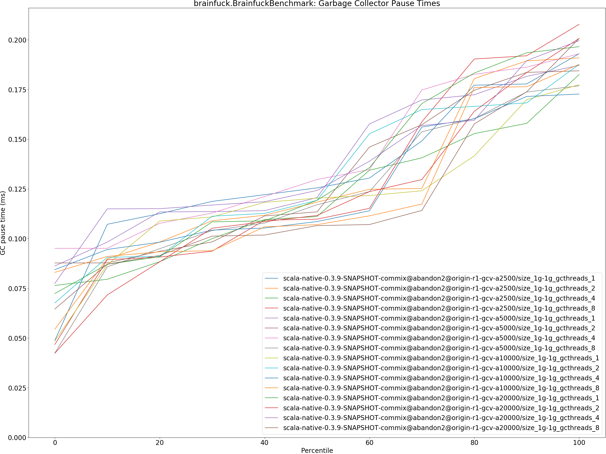

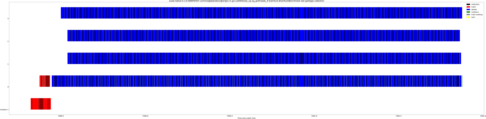

## cd.CDBenchmark

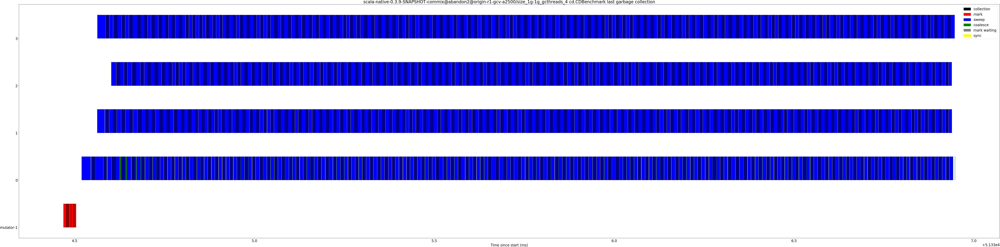

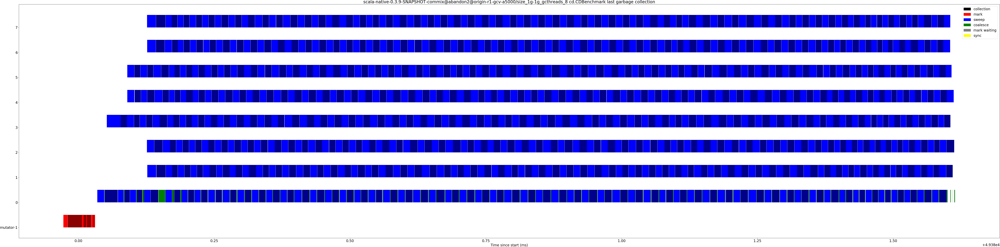

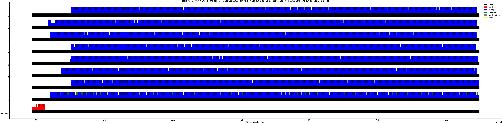

## gcbench.GCBenchBenchmark

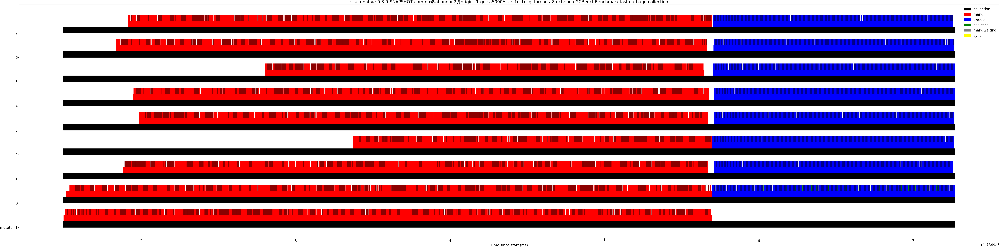

## json.JsonBenchmark

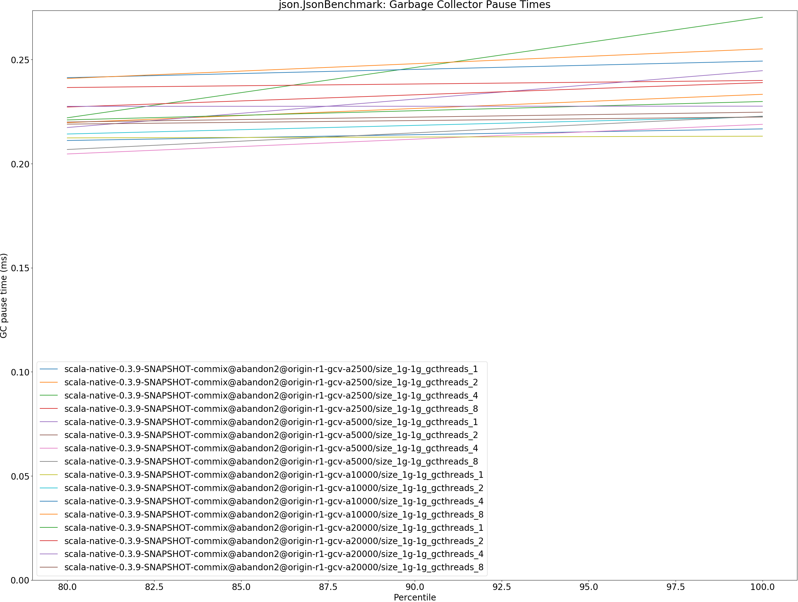

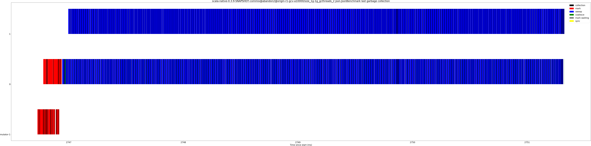

## kmeans.KmeansBenchmark

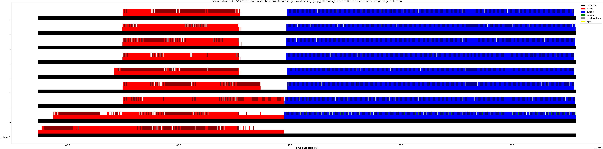

## nbody.NbodyBenchmark

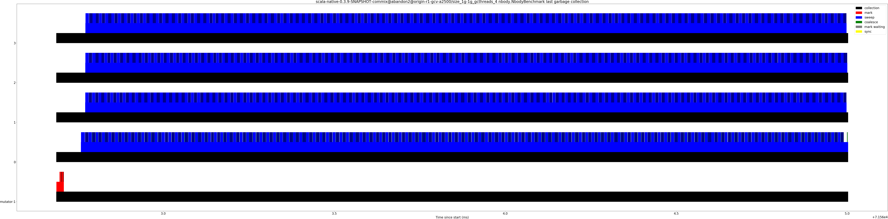

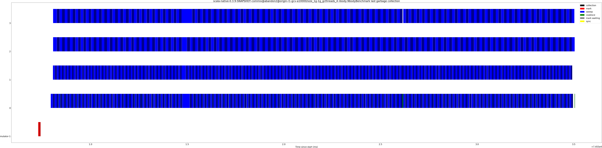

## sudoku.SudokuBenchmark

## tracer.TracerBenchmark

