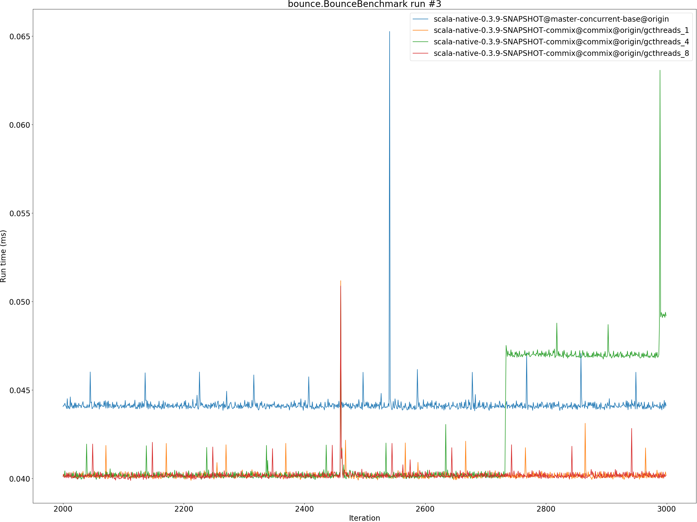
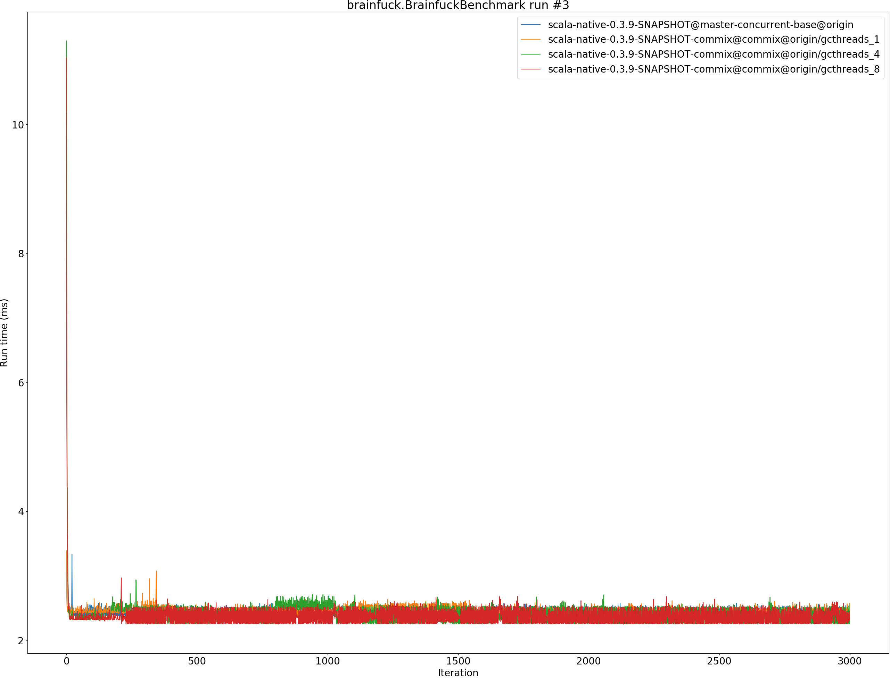

# Summary
## Benchmark run time (ms) at 50 percentile 

|name | scala-native-0.3.9-SNAPSHOT@master-concurrent-base@origin | scala-native-0.3.9-SNAPSHOT-commix@commix@origin/gcthreads_1 |  | scala-native-0.3.9-SNAPSHOT-commix@commix@origin/gcthreads_4 |  | scala-native-0.3.9-SNAPSHOT-commix@commix@origin/gcthreads_8 | |
| -- | -- | -- | -- | -- | -- | -- | -- |
|[bounce.BounceBenchmark](#bouncebouncebenchmark)|0.0412|0.0400|__-3.04%__|0.0401|__-2.64%__|0.0386|__-6.38%__|
|[brainfuck.BrainfuckBenchmark](#brainfuckbrainfuckbenchmark)|2.3769|2.4293|+2.21%|2.4478|+2.98%|2.4443|+2.84%|
|[cd.CDBenchmark](#cdcdbenchmark)|17.0257|17.1046|+0.46%|17.0728|+0.28%|17.4881|+2.72%|
|[deltablue.DeltaBlueBenchmark](#deltabluedeltabluebenchmark)|0.1382|0.1364|__-1.32%__|0.1360|__-1.60%__|0.1349|__-2.34%__|
|[gcbench.GCBenchBenchmark](#gcbenchgcbenchbenchmark)|71.5424|59.2761|__-17.15%__|60.7697|__-15.06%__|59.2316|__-17.21%__|
|[json.JsonBenchmark](#jsonjsonbenchmark)|1.0340|0.9718|__-6.01%__|0.9845|__-4.79%__|0.9835|__-4.88%__|
|[kmeans.KmeansBenchmark](#kmeanskmeansbenchmark)|36.6283|36.2171|__-1.12%__|36.5670|__-0.17%__|37.0421|+1.13%|
|[mandelbrot.MandelbrotBenchmark](#mandelbrotmandelbrotbenchmark)|100.7056|100.7594|+0.05%|100.8363|+0.13%|100.8053|+0.10%|
|[nbody.NbodyBenchmark](#nbodynbodybenchmark)|25.5941|25.6345|+0.16%|25.6657|+0.28%|25.3770|__-0.85%__|
|[permute.PermuteBenchmark](#permutepermutebenchmark)|0.1438|0.1505|+4.64%|0.1451|+0.93%|0.1437|__-0.09%__|
|[queens.QueensBenchmark](#queensqueensbenchmark)|0.0486|0.0472|__-3.00%__|0.0473|__-2.72%__|0.0471|__-3.15%__|
|[richards.RichardsBenchmark](#richardsrichardsbenchmark)|0.0548|0.0549|+0.19%|0.0548|+0.03%|0.0551|+0.58%|
|[sudoku.SudokuBenchmark](#sudokusudokubenchmark)|1.6148|1.5802|__-2.14%__|1.5776|__-2.30%__|1.5891|__-1.59%__|
|[tracer.TracerBenchmark](#tracertracerbenchmark)|0.4750|0.4826|+1.60%|0.4840|+1.91%|0.4833|+1.74%|
| __Geometrical mean:__|| |__-1.88%__| |__-1.72%__| |__-2.09%__|
## Benchmark run time (ms) at 90 percentile 

|name | scala-native-0.3.9-SNAPSHOT@master-concurrent-base@origin | scala-native-0.3.9-SNAPSHOT-commix@commix@origin/gcthreads_1 |  | scala-native-0.3.9-SNAPSHOT-commix@commix@origin/gcthreads_4 |  | scala-native-0.3.9-SNAPSHOT-commix@commix@origin/gcthreads_8 | |
| -- | -- | -- | -- | -- | -- | -- | -- |
|[bounce.BounceBenchmark](#bouncebouncebenchmark)|0.0441|0.0403|__-8.61%__|0.0469|+6.31%|0.0403|__-8.60%__|
|[brainfuck.BrainfuckBenchmark](#brainfuckbrainfuckbenchmark)|2.4827|2.5358|+2.14%|2.5658|+3.35%|2.5732|+3.64%|
|[cd.CDBenchmark](#cdcdbenchmark)|17.1497|17.3731|+1.30%|17.5655|+2.42%|17.6768|+3.07%|
|[deltablue.DeltaBlueBenchmark](#deltabluedeltabluebenchmark)|0.1587|0.1465|__-7.66%__|0.1514|__-4.57%__|0.1426|__-10.10%__|
|[gcbench.GCBenchBenchmark](#gcbenchgcbenchbenchmark)|74.3233|62.4347|__-16.00%__|62.6242|__-15.74%__|62.0049|__-16.57%__|
|[json.JsonBenchmark](#jsonjsonbenchmark)|1.0832|1.0355|__-4.40%__|1.0421|__-3.80%__|1.0444|__-3.58%__|
|[kmeans.KmeansBenchmark](#kmeanskmeansbenchmark)|38.4228|37.9959|__-1.11%__|37.9706|__-1.18%__|37.9765|__-1.16%__|
|[mandelbrot.MandelbrotBenchmark](#mandelbrotmandelbrotbenchmark)|100.7808|101.0413|+0.26%|101.1852|+0.40%|100.8927|+0.11%|
|[nbody.NbodyBenchmark](#nbodynbodybenchmark)|25.9036|25.9187|+0.06%|26.0824|+0.69%|25.8540|__-0.19%__|
|[permute.PermuteBenchmark](#permutepermutebenchmark)|0.1469|0.1884|+28.18%|0.1559|+6.12%|0.1521|+3.50%|
|[queens.QueensBenchmark](#queensqueensbenchmark)|0.0489|0.0497|+1.60%|0.0479|__-1.97%__|0.0480|__-1.93%__|
|[richards.RichardsBenchmark](#richardsrichardsbenchmark)|0.0570|0.0580|+1.71%|0.0574|+0.74%|0.0579|+1.54%|
|[sudoku.SudokuBenchmark](#sudokusudokubenchmark)|1.6875|1.7014|+0.82%|1.7418|+3.22%|1.7525|+3.85%|
|[tracer.TracerBenchmark](#tracertracerbenchmark)|0.4789|0.5093|+6.35%|0.5102|+6.55%|0.4989|+4.18%|
| __Geometrical mean:__|| |__-0.09%__| |+0.02%| |__-1.78%__|
## Benchmark run time (ms) at 99 percentile 

|name | scala-native-0.3.9-SNAPSHOT@master-concurrent-base@origin | scala-native-0.3.9-SNAPSHOT-commix@commix@origin/gcthreads_1 |  | scala-native-0.3.9-SNAPSHOT-commix@commix@origin/gcthreads_4 |  | scala-native-0.3.9-SNAPSHOT-commix@commix@origin/gcthreads_8 | |
| -- | -- | -- | -- | -- | -- | -- | -- |
|[bounce.BounceBenchmark](#bouncebouncebenchmark)|0.0445|0.0420|__-5.49%__|0.0472|+6.17%|0.0422|__-5.17%__|
|[brainfuck.BrainfuckBenchmark](#brainfuckbrainfuckbenchmark)|2.5408|2.6228|+3.23%|2.6629|+4.81%|3.1429|+23.70%|
|[cd.CDBenchmark](#cdcdbenchmark)|19.1031|18.1318|__-5.08%__|18.2426|__-4.50%__|22.5280|+17.93%|
|[deltablue.DeltaBlueBenchmark](#deltabluedeltabluebenchmark)|0.1989|0.1911|__-3.93%__|0.1856|__-6.68%__|0.1780|__-10.51%__|
|[gcbench.GCBenchBenchmark](#gcbenchgcbenchbenchmark)|76.8841|71.3124|__-7.25%__|65.3985|__-14.94%__|66.0361|__-14.11%__|
|[json.JsonBenchmark](#jsonjsonbenchmark)|1.0881|1.0488|__-3.62%__|1.3067|+20.09%|1.1353|+4.33%|
|[kmeans.KmeansBenchmark](#kmeanskmeansbenchmark)|40.9655|39.4781|__-3.63%__|39.3711|__-3.89%__|51.3607|+25.38%|
|[mandelbrot.MandelbrotBenchmark](#mandelbrotmandelbrotbenchmark)|102.3627|105.6732|+3.23%|105.7545|+3.31%|102.3456|__-0.02%__|
|[nbody.NbodyBenchmark](#nbodynbodybenchmark)|27.5296|26.9926|__-1.95%__|27.1281|__-1.46%__|26.6769|__-3.10%__|
|[permute.PermuteBenchmark](#permutepermutebenchmark)|0.1648|0.2008|+21.85%|0.1840|+11.67%|0.1678|+1.87%|
|[queens.QueensBenchmark](#queensqueensbenchmark)|0.0512|0.0521|+1.66%|0.0504|__-1.59%__|0.0508|__-0.82%__|
|[richards.RichardsBenchmark](#richardsrichardsbenchmark)|0.0625|0.0626|+0.16%|0.0616|__-1.44%__|0.0712|+13.87%|
|[sudoku.SudokuBenchmark](#sudokusudokubenchmark)|1.7857|1.7967|+0.62%|1.8505|+3.63%|1.8673|+4.57%|
|[tracer.TracerBenchmark](#tracertracerbenchmark)|0.4835|0.5820|+20.38%|0.5816|+20.30%|0.5151|+6.53%|
| __Geometrical mean:__|| |+1.10%| |+2.10%| |+3.98%|
## Benchmark run time (ms) at 99.9 percentile 

|name | scala-native-0.3.9-SNAPSHOT@master-concurrent-base@origin | scala-native-0.3.9-SNAPSHOT-commix@commix@origin/gcthreads_1 |  | scala-native-0.3.9-SNAPSHOT-commix@commix@origin/gcthreads_4 |  | scala-native-0.3.9-SNAPSHOT-commix@commix@origin/gcthreads_8 | |
| -- | -- | -- | -- | -- | -- | -- | -- |
|[bounce.BounceBenchmark](#bouncebouncebenchmark)|0.0587|0.0506|__-13.83%__|0.0510|__-13.07%__|0.0519|__-11.61%__|
|[brainfuck.BrainfuckBenchmark](#brainfuckbrainfuckbenchmark)|2.6256|2.6964|+2.70%|2.7105|+3.23%|3.2498|+23.77%|
|[cd.CDBenchmark](#cdcdbenchmark)|22.1963|22.5487|+1.59%|22.6647|+2.11%|22.7203|+2.36%|
|[deltablue.DeltaBlueBenchmark](#deltabluedeltabluebenchmark)|0.2161|0.2096|__-3.01%__|0.2167|+0.28%|0.2051|__-5.06%__|
|[gcbench.GCBenchBenchmark](#gcbenchgcbenchbenchmark)|87.1384|74.2235|__-14.82%__|71.4854|__-17.96%__|71.8075|__-17.59%__|
|[json.JsonBenchmark](#jsonjsonbenchmark)|1.3285|1.1677|__-12.11%__|1.3151|__-1.01%__|1.1585|__-12.80%__|
|[kmeans.KmeansBenchmark](#kmeanskmeansbenchmark)|53.7817|42.1388|__-21.65%__|41.0818|__-23.61%__|53.5291|__-0.47%__|
|[mandelbrot.MandelbrotBenchmark](#mandelbrotmandelbrotbenchmark)|108.2647|108.3205|+0.05%|108.3977|+0.12%|108.3799|+0.11%|
|[nbody.NbodyBenchmark](#nbodynbodybenchmark)|36.1370|27.6349|__-23.53%__|36.1120|__-0.07%__|27.6100|__-23.60%__|
|[permute.PermuteBenchmark](#permutepermutebenchmark)|0.1690|0.2151|+27.34%|0.1883|+11.45%|0.2173|+28.60%|
|[queens.QueensBenchmark](#queensqueensbenchmark)|0.0690|0.0751|+8.84%|0.0647|__-6.21%__|0.0610|__-11.68%__|
|[richards.RichardsBenchmark](#richardsrichardsbenchmark)|0.0741|0.0797|+7.58%|0.0759|+2.47%|0.0825|+11.30%|
|[sudoku.SudokuBenchmark](#sudokusudokubenchmark)|1.7969|1.8320|+1.95%|1.9098|+6.29%|1.9153|+6.59%|
|[tracer.TracerBenchmark](#tracertracerbenchmark)|0.5092|0.6131|+20.39%|0.6091|+19.61%|0.5340|+4.87%|
| __Geometrical mean:__|| |__-2.36%__| |__-1.79%__| |__-1.39%__|
## Benchmark total run time (ms) 

|name | scala-native-0.3.9-SNAPSHOT@master-concurrent-base@origin | scala-native-0.3.9-SNAPSHOT-commix@commix@origin/gcthreads_1 |  | scala-native-0.3.9-SNAPSHOT-commix@commix@origin/gcthreads_4 |  | scala-native-0.3.9-SNAPSHOT-commix@commix@origin/gcthreads_8 | |
| -- | -- | -- | -- | -- | -- | -- | -- |
|[bounce.BounceBenchmark](#bouncebouncebenchmark)|824.5545|786.7031|__-4.59%__|816.6409|__-0.96%__|786.1115|__-4.66%__|
|[brainfuck.BrainfuckBenchmark](#brainfuckbrainfuckbenchmark)|47543.4776|48674.4314|+2.38%|48479.1406|+1.97%|48886.7078|+2.83%|
|[cd.CDBenchmark](#cdcdbenchmark)|341662.7014|340181.1094|__-0.43%__|344430.6178|+0.81%|351578.7975|+2.90%|
|[deltablue.DeltaBlueBenchmark](#deltabluedeltabluebenchmark)|2888.5587|2789.2548|__-3.44%__|2797.9966|__-3.14%__|2714.3827|__-6.03%__|
|[gcbench.GCBenchBenchmark](#gcbenchgcbenchbenchmark)|1409214.8311|1193391.3563|__-15.32%__|1213894.3401|__-13.86%__|1189385.6430|__-15.60%__|
|[json.JsonBenchmark](#jsonjsonbenchmark)|21053.7293|19356.8341|__-8.06%__|20110.9220|__-4.48%__|19869.4390|__-5.63%__|
|[kmeans.KmeansBenchmark](#kmeanskmeansbenchmark)|736730.4543|728077.7135|__-1.17%__|736112.6098|__-0.08%__|742926.1385|+0.84%|
|[mandelbrot.MandelbrotBenchmark](#mandelbrotmandelbrotbenchmark)|2015802.6077|2018343.4558|+0.13%|2020267.9270|+0.22%|1979251.7923|__-1.81%__|
|[nbody.NbodyBenchmark](#nbodynbodybenchmark)|505068.3410|505363.3290|+0.06%|516076.4211|+2.18%|504056.7024|__-0.20%__|
|[permute.PermuteBenchmark](#permutepermutebenchmark)|2900.4835|3073.5623|+5.97%|2972.4970|+2.48%|2880.2572|__-0.70%__|
|[queens.QueensBenchmark](#queensqueensbenchmark)|968.5119|942.2483|__-2.71%__|945.0598|__-2.42%__|934.2572|__-3.54%__|
|[richards.RichardsBenchmark](#richardsrichardsbenchmark)|1092.9586|1099.7145|+0.62%|1092.7669|__-0.02%__|1119.0593|+2.39%|
|[sudoku.SudokuBenchmark](#sudokusudokubenchmark)|32525.8770|32207.9934|__-0.98%__|32075.3178|__-1.39%__|32514.7790|__-0.03%__|
|[tracer.TracerBenchmark](#tracertracerbenchmark)|9397.0352|9624.4380|+2.42%|9728.2545|+3.52%|9613.6941|+2.31%|
| __Geometrical mean:__|| |__-1.93%__| |__-1.18%__| |__-2.05%__|
# Individual benchmarks
## bounce.BounceBenchmark

## brainfuck.BrainfuckBenchmark

## cd.CDBenchmark

## deltablue.DeltaBlueBenchmark

## gcbench.GCBenchBenchmark

## json.JsonBenchmark

## kmeans.KmeansBenchmark

## mandelbrot.MandelbrotBenchmark

## nbody.NbodyBenchmark

## permute.PermuteBenchmark

## queens.QueensBenchmark

## richards.RichardsBenchmark

## sudoku.SudokuBenchmark

## tracer.TracerBenchmark

