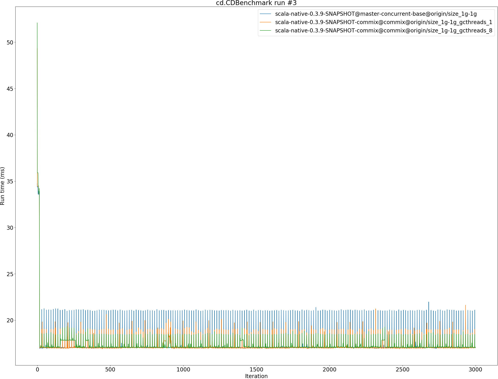

# Summary
## Benchmark run time (ms) at 50 percentile 

|name | scala-native-0.3.9-SNAPSHOT@master-concurrent-base@origin/size_1g-1g | scala-native-0.3.9-SNAPSHOT-commix@commix@origin/size_1g-1g_gcthreads_1 |  | scala-native-0.3.9-SNAPSHOT-commix@commix@origin/size_1g-1g_gcthreads_8 | |
| -- | -- | -- | -- | -- | -- |
|[bounce.BounceBenchmark](#bouncebouncebenchmark)|0.0410|0.0419|+2.28%|0.0419|+2.19%|
|[brainfuck.BrainfuckBenchmark](#brainfuckbrainfuckbenchmark)|2.3728|2.3729|+0.01%|2.2748|__-4.13%__|
|[cd.CDBenchmark](#cdcdbenchmark)|17.0053|17.0577|+0.31%|17.0180|+0.07%|
|[deltablue.DeltaBlueBenchmark](#deltabluedeltabluebenchmark)|0.1814|0.1854|+2.21%|0.1821|+0.36%|
|[gcbench.GCBenchBenchmark](#gcbenchgcbenchbenchmark)|66.1548|64.6511|__-2.27%__|62.6351|__-5.32%__|
|[json.JsonBenchmark](#jsonjsonbenchmark)|0.9358|0.9322|__-0.38%__|0.9315|__-0.46%__|
|[kmeans.KmeansBenchmark](#kmeanskmeansbenchmark)|36.0690|36.0938|+0.07%|36.0762|+0.02%|
|[mandelbrot.MandelbrotBenchmark](#mandelbrotmandelbrotbenchmark)|100.7072|100.7615|+0.05%|100.7627|+0.06%|
|[nbody.NbodyBenchmark](#nbodynbodybenchmark)|24.5717|25.6299|+4.31%|25.6266|+4.29%|
|[permute.PermuteBenchmark](#permutepermutebenchmark)|0.2098|0.2109|+0.54%|0.2112|+0.67%|
|[queens.QueensBenchmark](#queensqueensbenchmark)|0.0510|0.0511|+0.29%|0.0501|__-1.80%__|
|[richards.RichardsBenchmark](#richardsrichardsbenchmark)|0.0603|0.0602|__-0.10%__|0.0601|__-0.25%__|
|[sudoku.SudokuBenchmark](#sudokusudokubenchmark)|1.5931|1.5829|__-0.64%__|1.5764|__-1.05%__|
|[tracer.TracerBenchmark](#tracertracerbenchmark)|0.4879|0.4858|__-0.44%__|0.4821|__-1.20%__|
| __Geometrical mean:__|| |+0.43%| |__-0.49%__|
## Benchmark run time (ms) at 90 percentile 

|name | scala-native-0.3.9-SNAPSHOT@master-concurrent-base@origin/size_1g-1g | scala-native-0.3.9-SNAPSHOT-commix@commix@origin/size_1g-1g_gcthreads_1 |  | scala-native-0.3.9-SNAPSHOT-commix@commix@origin/size_1g-1g_gcthreads_8 | |
| -- | -- | -- | -- | -- | -- |
|[bounce.BounceBenchmark](#bouncebouncebenchmark)|0.0423|0.0435|+2.85%|0.0428|+1.22%|
|[brainfuck.BrainfuckBenchmark](#brainfuckbrainfuckbenchmark)|2.4765|2.3991|__-3.12%__|2.3974|__-3.19%__|
|[cd.CDBenchmark](#cdcdbenchmark)|17.1122|17.4952|+2.24%|17.7710|+3.85%|
|[deltablue.DeltaBlueBenchmark](#deltabluedeltabluebenchmark)|0.1852|0.1893|+2.22%|0.1919|+3.61%|
|[gcbench.GCBenchBenchmark](#gcbenchgcbenchbenchmark)|66.8558|65.8589|__-1.49%__|64.2446|__-3.91%__|
|[json.JsonBenchmark](#jsonjsonbenchmark)|0.9407|0.9392|__-0.17%__|0.9768|+3.84%|
|[kmeans.KmeansBenchmark](#kmeanskmeansbenchmark)|36.6244|36.7067|+0.22%|37.0506|+1.16%|
|[mandelbrot.MandelbrotBenchmark](#mandelbrotmandelbrotbenchmark)|100.7837|100.8485|+0.06%|100.8489|+0.06%|
|[nbody.NbodyBenchmark](#nbodynbodybenchmark)|25.6886|26.0795|+1.52%|26.1337|+1.73%|
|[permute.PermuteBenchmark](#permutepermutebenchmark)|0.2121|0.2196|+3.54%|0.2192|+3.38%|
|[queens.QueensBenchmark](#queensqueensbenchmark)|0.0527|0.0536|+1.58%|0.0528|+0.08%|
|[richards.RichardsBenchmark](#richardsrichardsbenchmark)|0.0627|0.0630|+0.45%|0.0627|+0.01%|
|[sudoku.SudokuBenchmark](#sudokusudokubenchmark)|1.6082|1.6083|+0.01%|1.6044|__-0.24%__|
|[tracer.TracerBenchmark](#tracertracerbenchmark)|0.4941|0.5123|+3.69%|0.5041|+2.02%|
| __Geometrical mean:__|| |+0.95%| |+0.95%|
## Benchmark run time (ms) at 99 percentile 

|name | scala-native-0.3.9-SNAPSHOT@master-concurrent-base@origin/size_1g-1g | scala-native-0.3.9-SNAPSHOT-commix@commix@origin/size_1g-1g_gcthreads_1 |  | scala-native-0.3.9-SNAPSHOT-commix@commix@origin/size_1g-1g_gcthreads_8 | |
| -- | -- | -- | -- | -- | -- |
|[bounce.BounceBenchmark](#bouncebouncebenchmark)|0.0441|0.0451|+2.43%|0.0448|+1.53%|
|[brainfuck.BrainfuckBenchmark](#brainfuckbrainfuckbenchmark)|2.9974|2.8907|__-3.56%__|2.5203|__-15.92%__|
|[cd.CDBenchmark](#cdcdbenchmark)|21.9642|22.0508|+0.39%|18.5352|__-15.61%__|
|[deltablue.DeltaBlueBenchmark](#deltabluedeltabluebenchmark)|0.1883|0.1971|+4.65%|0.2107|+11.87%|
|[gcbench.GCBenchBenchmark](#gcbenchgcbenchbenchmark)|77.4812|68.2359|__-11.93%__|69.1612|__-10.74%__|
|[json.JsonBenchmark](#jsonjsonbenchmark)|0.9670|1.2135|+25.50%|1.0034|+3.77%|
|[kmeans.KmeansBenchmark](#kmeanskmeansbenchmark)|49.0999|41.6445|__-15.18%__|38.8512|__-20.87%__|
|[mandelbrot.MandelbrotBenchmark](#mandelbrotmandelbrotbenchmark)|104.3348|103.4378|__-0.86%__|102.5594|__-1.70%__|
|[nbody.NbodyBenchmark](#nbodynbodybenchmark)|27.5265|27.4778|__-0.18%__|27.7632|+0.86%|
|[permute.PermuteBenchmark](#permutepermutebenchmark)|0.2169|0.2264|+4.39%|0.2257|+4.05%|
|[queens.QueensBenchmark](#queensqueensbenchmark)|0.0544|0.0562|+3.40%|0.0558|+2.73%|
|[richards.RichardsBenchmark](#richardsrichardsbenchmark)|0.0658|0.0665|+1.12%|0.0660|+0.31%|
|[sudoku.SudokuBenchmark](#sudokusudokubenchmark)|1.6337|2.1234|+29.97%|1.6875|+3.29%|
|[tracer.TracerBenchmark](#tracertracerbenchmark)|0.5023|0.6879|+36.96%|0.6008|+19.62%|
| __Geometrical mean:__|| |+4.57%| |__-1.80%__|
## Benchmark run time (ms) at 99.9 percentile 

|name | scala-native-0.3.9-SNAPSHOT@master-concurrent-base@origin/size_1g-1g | scala-native-0.3.9-SNAPSHOT-commix@commix@origin/size_1g-1g_gcthreads_1 |  | scala-native-0.3.9-SNAPSHOT-commix@commix@origin/size_1g-1g_gcthreads_8 | |
| -- | -- | -- | -- | -- | -- |
|[bounce.BounceBenchmark](#bouncebouncebenchmark)|0.0462|0.0529|+14.52%|0.0622|+34.53%|
|[brainfuck.BrainfuckBenchmark](#brainfuckbrainfuckbenchmark)|6.5612|3.2797|__-50.01%__|3.7595|__-42.70%__|
|[cd.CDBenchmark](#cdcdbenchmark)|22.2065|22.5522|+1.56%|19.2293|__-13.41%__|
|[deltablue.DeltaBlueBenchmark](#deltabluedeltabluebenchmark)|0.1980|0.2127|+7.43%|0.2654|+34.05%|
|[gcbench.GCBenchBenchmark](#gcbenchgcbenchbenchmark)|79.0555|76.7860|__-2.87%__|76.9217|__-2.70%__|
|[json.JsonBenchmark](#jsonjsonbenchmark)|4.9613|1.3088|__-73.62%__|1.9873|__-59.94%__|
|[kmeans.KmeansBenchmark](#kmeanskmeansbenchmark)|52.1409|51.7058|__-0.83%__|49.0058|__-6.01%__|
|[mandelbrot.MandelbrotBenchmark](#mandelbrotmandelbrotbenchmark)|108.2594|108.3329|+0.07%|106.7723|__-1.37%__|
|[nbody.NbodyBenchmark](#nbodynbodybenchmark)|29.5974|36.0907|+21.94%|36.6627|+23.87%|
|[permute.PermuteBenchmark](#permutepermutebenchmark)|0.2301|0.2360|+2.56%|0.2381|+3.47%|
|[queens.QueensBenchmark](#queensqueensbenchmark)|0.0560|0.0860|+53.53%|0.0646|+15.34%|
|[richards.RichardsBenchmark](#richardsrichardsbenchmark)|0.0692|0.0778|+12.47%|0.0774|+11.90%|
|[sudoku.SudokuBenchmark](#sudokusudokubenchmark)|3.5571|2.2331|__-37.22%__|2.1146|__-40.55%__|
|[tracer.TracerBenchmark](#tracertracerbenchmark)|4.4471|0.7102|__-84.03%__|1.7631|__-60.35%__|
| __Geometrical mean:__|| |__-21.39%__| |__-13.75%__|
## Benchmark total run time (ms) 

|name | scala-native-0.3.9-SNAPSHOT@master-concurrent-base@origin/size_1g-1g | scala-native-0.3.9-SNAPSHOT-commix@commix@origin/size_1g-1g_gcthreads_1 |  | scala-native-0.3.9-SNAPSHOT-commix@commix@origin/size_1g-1g_gcthreads_8 | |
| -- | -- | -- | -- | -- | -- |
|[bounce.BounceBenchmark](#bouncebouncebenchmark)|817.8376|839.3294|+2.63%|838.4275|+2.52%|
|[brainfuck.BrainfuckBenchmark](#brainfuckbrainfuckbenchmark)|48384.6665|47588.5594|__-1.65%__|46521.7762|__-3.85%__|
|[cd.CDBenchmark](#cdcdbenchmark)|346446.6505|345455.9641|__-0.29%__|337669.2867|__-2.53%__|
|[deltablue.DeltaBlueBenchmark](#deltabluedeltabluebenchmark)|3597.3118|3720.1683|+3.42%|3669.9906|+2.02%|
|[gcbench.GCBenchBenchmark](#gcbenchgcbenchbenchmark)|1259126.9785|1242706.4355|__-1.30%__|1224011.9261|__-2.79%__|
|[json.JsonBenchmark](#jsonjsonbenchmark)|18905.6686|18667.4251|__-1.26%__|18545.5460|__-1.90%__|
|[kmeans.KmeansBenchmark](#kmeanskmeansbenchmark)|720405.6537|723811.3482|+0.47%|718247.1298|__-0.30%__|
|[mandelbrot.MandelbrotBenchmark](#mandelbrotmandelbrotbenchmark)|2015996.6238|1982768.0989|__-1.65%__|1982518.9142|__-1.66%__|
|[nbody.NbodyBenchmark](#nbodynbodybenchmark)|499501.7361|515895.8542|+3.28%|513879.8205|+2.88%|
|[permute.PermuteBenchmark](#permutepermutebenchmark)|4201.0063|4221.1396|+0.48%|4246.3733|+1.08%|
|[queens.QueensBenchmark](#queensqueensbenchmark)|1026.0478|1032.8011|+0.66%|1002.7913|__-2.27%__|
|[richards.RichardsBenchmark](#richardsrichardsbenchmark)|1213.8292|1215.1569|+0.11%|1212.1509|__-0.14%__|
|[sudoku.SudokuBenchmark](#sudokusudokubenchmark)|31970.6633|31644.5898|__-1.02%__|31345.9043|__-1.95%__|
|[tracer.TracerBenchmark](#tracertracerbenchmark)|10002.6828|9854.7821|__-1.48%__|9740.1518|__-2.62%__|
| __Geometrical mean:__|| |+0.16%| |__-0.85%__|
# Individual benchmarks
## bounce.BounceBenchmark

## brainfuck.BrainfuckBenchmark

## cd.CDBenchmark

## deltablue.DeltaBlueBenchmark

## gcbench.GCBenchBenchmark

## json.JsonBenchmark

## kmeans.KmeansBenchmark

## mandelbrot.MandelbrotBenchmark

## nbody.NbodyBenchmark

## permute.PermuteBenchmark

## queens.QueensBenchmark

## richards.RichardsBenchmark

## sudoku.SudokuBenchmark

## tracer.TracerBenchmark

