# Summary
## Benchmark run time (ms) at 50 percentile 

|name | scala-native-0.3.9-SNAPSHOT-commix@work-pacing@origin-r1-gcv-a2500/size_1g-1g_gcthreads_1 | scala-native-0.3.9-SNAPSHOT-commix@work-pacing@origin-r1-gcv-a2500/size_1g-1g_gcthreads_2 |  | scala-native-0.3.9-SNAPSHOT-commix@work-pacing@origin-r1-gcv-a2500/size_1g-1g_gcthreads_4 |  | scala-native-0.3.9-SNAPSHOT-commix@work-pacing@origin-r1-gcv-a2500/size_1g-1g_gcthreads_8 |  | scala-native-0.3.9-SNAPSHOT-commix@work-pacing@origin-r1-gcv-a5000/size_1g-1g_gcthreads_1 |  | scala-native-0.3.9-SNAPSHOT-commix@work-pacing@origin-r1-gcv-a5000/size_1g-1g_gcthreads_2 |  | scala-native-0.3.9-SNAPSHOT-commix@work-pacing@origin-r1-gcv-a5000/size_1g-1g_gcthreads_4 |  | scala-native-0.3.9-SNAPSHOT-commix@work-pacing@origin-r1-gcv-a5000/size_1g-1g_gcthreads_8 |  | scala-native-0.3.9-SNAPSHOT-commix@work-pacing@origin-r1-gcv-a10000/size_1g-1g_gcthreads_1 |  | scala-native-0.3.9-SNAPSHOT-commix@work-pacing@origin-r1-gcv-a10000/size_1g-1g_gcthreads_2 |  | scala-native-0.3.9-SNAPSHOT-commix@work-pacing@origin-r1-gcv-a10000/size_1g-1g_gcthreads_4 |  | scala-native-0.3.9-SNAPSHOT-commix@work-pacing@origin-r1-gcv-a10000/size_1g-1g_gcthreads_8 |  | scala-native-0.3.9-SNAPSHOT-commix@work-pacing@origin-r1-gcv-a20000/size_1g-1g_gcthreads_1 |  | scala-native-0.3.9-SNAPSHOT-commix@work-pacing@origin-r1-gcv-a20000/size_1g-1g_gcthreads_2 |  | scala-native-0.3.9-SNAPSHOT-commix@work-pacing@origin-r1-gcv-a20000/size_1g-1g_gcthreads_4 |  | scala-native-0.3.9-SNAPSHOT-commix@work-pacing@origin-r1-gcv-a20000/size_1g-1g_gcthreads_8 |  | scala-native-0.3.9-SNAPSHOT-commix@work-pacing@origin-r1-gcv-a40000/size_1g-1g_gcthreads_1 |  | scala-native-0.3.9-SNAPSHOT-commix@work-pacing@origin-r1-gcv-a40000/size_1g-1g_gcthreads_2 |  | scala-native-0.3.9-SNAPSHOT-commix@work-pacing@origin-r1-gcv-a40000/size_1g-1g_gcthreads_4 |  | scala-native-0.3.9-SNAPSHOT-commix@work-pacing@origin-r1-gcv-a40000/size_1g-1g_gcthreads_8 | |
| -- | -- | -- | -- | -- | -- | -- | -- | -- | -- | -- | -- | -- | -- | -- | -- | -- | -- | -- | -- | -- | -- | -- | -- | -- | -- | -- | -- | -- | -- | -- | -- | -- | -- | -- | -- | -- | -- | -- | -- |
|[brainfuck.BrainfuckBenchmark](#brainfuckbrainfuckbenchmark)|2.3014|2.4045|+4.48%|2.3043|+0.13%|2.3079|+0.28%|2.4104|+4.74%|2.4064|+4.56%|2.3000|__-0.06%__|2.4208|+5.19%|2.4069|+4.58%|2.4043|+4.47%|2.4059|+4.54%|2.4064|+4.56%|2.4090|+4.68%|2.4248|+5.36%|2.4087|+4.66%|2.3080|+0.29%|2.4102|+4.73%|2.3136|+0.53%|2.4046|+4.48%|2.4040|+4.46%|
|[cd.CDBenchmark](#cdcdbenchmark)|16.8543|16.1938|__-3.92%__|16.2450|__-3.62%__|16.2000|__-3.88%__|16.8790|+0.15%|16.8659|+0.07%|16.8537|__-0.00%__|16.8673|+0.08%|16.8303|__-0.14%__|16.9581|+0.62%|16.8829|+0.17%|16.2067|__-3.84%__|16.2588|__-3.53%__|16.9244|+0.42%|16.8583|+0.02%|16.8551|+0.00%|16.8524|__-0.01%__|16.8559|+0.01%|16.8692|+0.09%|16.2067|__-3.84%__|
|[gcbench.GCBenchBenchmark](#gcbenchgcbenchbenchmark)|60.7699|62.9179|+3.53%|61.5661|+1.31%|64.0405|+5.38%|60.1927|__-0.95%__|65.0676|+7.07%|61.8431|+1.77%|61.2429|+0.78%|65.0243|+7.00%|64.5673|+6.25%|61.3256|+0.91%|63.3626|+4.27%|63.2244|+4.04%|61.8707|+1.81%|61.9435|+1.93%|62.7688|+3.29%|62.2123|+2.37%|64.0870|+5.46%|59.6568|__-1.83%__|63.1598|+3.93%|
|[json.JsonBenchmark](#jsonjsonbenchmark)|0.9833|0.9823|__-0.10%__|0.9402|__-4.39%__|0.9821|__-0.12%__|0.9826|__-0.07%__|0.9387|__-4.54%__|0.9407|__-4.34%__|0.9824|__-0.10%__|0.9414|__-4.26%__|0.9825|__-0.09%__|0.9824|__-0.10%__|0.9832|__-0.02%__|0.9813|__-0.20%__|0.9811|__-0.23%__|0.9811|__-0.23%__|0.9822|__-0.11%__|0.9826|__-0.07%__|0.9820|__-0.14%__|0.9827|__-0.06%__|0.9820|__-0.13%__|
|[kmeans.KmeansBenchmark](#kmeanskmeansbenchmark)|36.4280|34.9009|__-4.19%__|36.4006|__-0.08%__|36.2998|__-0.35%__|34.8800|__-4.25%__|36.3402|__-0.24%__|36.8406|+1.13%|36.4324|+0.01%|36.3520|__-0.21%__|36.3765|__-0.14%__|36.5115|+0.23%|36.3674|__-0.17%__|36.4511|+0.06%|36.3732|__-0.15%__|36.3395|__-0.24%__|36.5586|+0.36%|34.9310|__-4.11%__|36.3477|__-0.22%__|36.4370|+0.02%|36.3173|__-0.30%__|
|[nbody.NbodyBenchmark](#nbodynbodybenchmark)|24.4078|25.5288|+4.59%|25.5403|+4.64%|24.4539|+0.19%|25.5254|+4.58%|25.5414|+4.64%|25.5263|+4.58%|25.6258|+4.99%|25.5267|+4.58%|24.3928|__-0.06%__|25.5266|+4.58%|24.4288|+0.09%|25.5512|+4.68%|25.5246|+4.58%|25.5387|+4.63%|25.5280|+4.59%|25.5239|+4.57%|24.3934|__-0.06%__|25.5281|+4.59%|25.6250|+4.99%|
|[sudoku.SudokuBenchmark](#sudokusudokubenchmark)|1.5404|1.6268|+5.61%|1.6196|+5.14%|1.6070|+4.32%|1.5258|__-0.95%__|1.5933|+3.43%|1.6034|+4.09%|1.5478|+0.48%|1.6180|+5.04%|1.6076|+4.36%|1.6049|+4.19%|1.5380|__-0.16%__|1.6125|+4.68%|1.6054|+4.22%|1.5992|+3.82%|1.5979|+3.73%|1.6057|+4.24%|1.6000|+3.87%|1.6078|+4.37%|1.5928|+3.40%|
|[tracer.TracerBenchmark](#tracertracerbenchmark)|0.4925|0.4721|__-4.14%__|0.4890|__-0.73%__|0.4917|__-0.18%__|0.4914|__-0.23%__|0.4912|__-0.28%__|0.4890|__-0.71%__|0.4910|__-0.32%__|0.4933|+0.15%|0.4906|__-0.40%__|0.4889|__-0.74%__|0.5206|+5.70%|0.4887|__-0.79%__|0.4903|__-0.46%__|0.4888|__-0.76%__|0.4880|__-0.92%__|0.4935|+0.20%|0.4888|__-0.77%__|0.4909|__-0.33%__|0.4865|__-1.22%__|
| __Geometrical mean:__|| |+0.65%| |+0.25%| |+0.67%| |+0.34%| |+1.78%| |+0.77%| |+1.37%| |+2.03%| |+1.85%| |+1.70%| |+1.26%| |+1.66%| |+1.92%| |+1.71%| |+1.39%| |+1.45%| |+1.06%| |+1.39%| |+1.36%|
## Benchmark run time (ms) at 90 percentile 

|name | scala-native-0.3.9-SNAPSHOT-commix@work-pacing@origin-r1-gcv-a2500/size_1g-1g_gcthreads_1 | scala-native-0.3.9-SNAPSHOT-commix@work-pacing@origin-r1-gcv-a2500/size_1g-1g_gcthreads_2 |  | scala-native-0.3.9-SNAPSHOT-commix@work-pacing@origin-r1-gcv-a2500/size_1g-1g_gcthreads_4 |  | scala-native-0.3.9-SNAPSHOT-commix@work-pacing@origin-r1-gcv-a2500/size_1g-1g_gcthreads_8 |  | scala-native-0.3.9-SNAPSHOT-commix@work-pacing@origin-r1-gcv-a5000/size_1g-1g_gcthreads_1 |  | scala-native-0.3.9-SNAPSHOT-commix@work-pacing@origin-r1-gcv-a5000/size_1g-1g_gcthreads_2 |  | scala-native-0.3.9-SNAPSHOT-commix@work-pacing@origin-r1-gcv-a5000/size_1g-1g_gcthreads_4 |  | scala-native-0.3.9-SNAPSHOT-commix@work-pacing@origin-r1-gcv-a5000/size_1g-1g_gcthreads_8 |  | scala-native-0.3.9-SNAPSHOT-commix@work-pacing@origin-r1-gcv-a10000/size_1g-1g_gcthreads_1 |  | scala-native-0.3.9-SNAPSHOT-commix@work-pacing@origin-r1-gcv-a10000/size_1g-1g_gcthreads_2 |  | scala-native-0.3.9-SNAPSHOT-commix@work-pacing@origin-r1-gcv-a10000/size_1g-1g_gcthreads_4 |  | scala-native-0.3.9-SNAPSHOT-commix@work-pacing@origin-r1-gcv-a10000/size_1g-1g_gcthreads_8 |  | scala-native-0.3.9-SNAPSHOT-commix@work-pacing@origin-r1-gcv-a20000/size_1g-1g_gcthreads_1 |  | scala-native-0.3.9-SNAPSHOT-commix@work-pacing@origin-r1-gcv-a20000/size_1g-1g_gcthreads_2 |  | scala-native-0.3.9-SNAPSHOT-commix@work-pacing@origin-r1-gcv-a20000/size_1g-1g_gcthreads_4 |  | scala-native-0.3.9-SNAPSHOT-commix@work-pacing@origin-r1-gcv-a20000/size_1g-1g_gcthreads_8 |  | scala-native-0.3.9-SNAPSHOT-commix@work-pacing@origin-r1-gcv-a40000/size_1g-1g_gcthreads_1 |  | scala-native-0.3.9-SNAPSHOT-commix@work-pacing@origin-r1-gcv-a40000/size_1g-1g_gcthreads_2 |  | scala-native-0.3.9-SNAPSHOT-commix@work-pacing@origin-r1-gcv-a40000/size_1g-1g_gcthreads_4 |  | scala-native-0.3.9-SNAPSHOT-commix@work-pacing@origin-r1-gcv-a40000/size_1g-1g_gcthreads_8 | |
| -- | -- | -- | -- | -- | -- | -- | -- | -- | -- | -- | -- | -- | -- | -- | -- | -- | -- | -- | -- | -- | -- | -- | -- | -- | -- | -- | -- | -- | -- | -- | -- | -- | -- | -- | -- | -- | -- | -- | -- |
|[brainfuck.BrainfuckBenchmark](#brainfuckbrainfuckbenchmark)|2.3064|2.4093|+4.46%|2.3109|+0.19%|2.3353|+1.25%|2.4165|+4.77%|2.4121|+4.58%|2.3207|+0.62%|2.5355|+9.93%|2.4254|+5.16%|2.4090|+4.45%|2.4182|+4.85%|2.4316|+5.43%|2.4312|+5.41%|2.4584|+6.59%|2.4167|+4.78%|2.3123|+0.26%|2.4346|+5.56%|2.3453|+1.69%|2.4097|+4.48%|2.4091|+4.45%|
|[cd.CDBenchmark](#cdcdbenchmark)|21.6522|16.3064|__-24.69%__|16.9425|__-21.75%__|16.3214|__-24.62%__|16.9773|__-21.59%__|16.9339|__-21.79%__|18.7665|__-13.33%__|16.9562|__-21.69%__|16.9420|__-21.75%__|17.7231|__-18.15%__|16.9476|__-21.73%__|16.3181|__-24.64%__|16.3852|__-24.33%__|17.0117|__-21.43%__|16.9253|__-21.83%__|16.9202|__-21.85%__|16.9547|__-21.70%__|16.9247|__-21.83%__|17.0263|__-21.36%__|16.3250|__-24.60%__|
|[gcbench.GCBenchBenchmark](#gcbenchgcbenchbenchmark)|64.3153|64.2862|__-0.05%__|63.1145|__-1.87%__|69.7941|+8.52%|64.2213|__-0.15%__|66.0517|+2.70%|63.0005|__-2.04%__|62.4538|__-2.89%__|66.6116|+3.57%|65.8537|+2.39%|64.8112|+0.77%|67.8308|+5.47%|66.2279|+2.97%|65.8416|+2.37%|63.3589|__-1.49%__|64.1799|__-0.21%__|66.2909|+3.07%|65.6919|+2.14%|63.0220|__-2.01%__|64.1834|__-0.20%__|
|[json.JsonBenchmark](#jsonjsonbenchmark)|0.9883|0.9874|__-0.09%__|0.9450|__-4.38%__|0.9872|__-0.10%__|0.9881|__-0.02%__|0.9440|__-4.48%__|0.9457|__-4.31%__|0.9877|__-0.06%__|0.9466|__-4.21%__|0.9875|__-0.08%__|0.9873|__-0.09%__|0.9880|__-0.02%__|0.9862|__-0.20%__|0.9861|__-0.22%__|0.9862|__-0.20%__|0.9869|__-0.13%__|0.9878|__-0.04%__|0.9873|__-0.10%__|0.9873|__-0.10%__|0.9869|__-0.14%__|
|[kmeans.KmeansBenchmark](#kmeanskmeansbenchmark)|36.9093|35.2532|__-4.49%__|36.7534|__-0.42%__|36.6381|__-0.73%__|35.3329|__-4.27%__|36.8229|__-0.23%__|37.3793|+1.27%|37.3996|+1.33%|51.2003|+38.72%|36.7070|__-0.55%__|38.4971|+4.30%|36.6973|__-0.57%__|36.7878|__-0.33%__|36.8691|__-0.11%__|36.6845|__-0.61%__|36.9768|+0.18%|35.2958|__-4.37%__|36.6706|__-0.65%__|36.8919|__-0.05%__|36.6916|__-0.59%__|
|[nbody.NbodyBenchmark](#nbodynbodybenchmark)|26.7669|25.9904|__-2.90%__|25.9803|__-2.94%__|24.8670|__-7.10%__|25.9229|__-3.15%__|25.9987|__-2.87%__|25.9407|__-3.09%__|25.9962|__-2.88%__|25.9325|__-3.12%__|24.9124|__-6.93%__|26.0012|__-2.86%__|24.7863|__-7.40%__|36.0699|+34.76%|26.0101|__-2.83%__|26.0901|__-2.53%__|25.9928|__-2.89%__|25.9873|__-2.91%__|24.7666|__-7.47%__|26.5421|__-0.84%__|25.9895|__-2.90%__|
|[sudoku.SudokuBenchmark](#sudokusudokubenchmark)|1.5622|1.6515|+5.72%|1.6269|+4.14%|1.6306|+4.38%|1.5396|__-1.45%__|1.6030|+2.61%|1.6278|+4.20%|1.5533|__-0.56%__|1.6276|+4.19%|1.6320|+4.47%|1.6294|+4.30%|1.5620|__-0.01%__|1.6375|+4.82%|1.6140|+3.32%|1.6233|+3.92%|1.6082|+2.94%|1.6294|+4.30%|1.6176|+3.55%|1.6320|+4.47%|1.6019|+2.54%|
|[tracer.TracerBenchmark](#tracertracerbenchmark)|0.4988|0.4792|__-3.93%__|0.4947|__-0.82%__|0.4983|__-0.11%__|0.4979|__-0.19%__|0.4968|__-0.40%__|0.4965|__-0.46%__|0.4972|__-0.33%__|0.5000|+0.25%|0.4969|__-0.39%__|0.4952|__-0.72%__|0.5284|+5.92%|0.4946|__-0.84%__|0.4964|__-0.49%__|0.4947|__-0.82%__|0.4933|__-1.11%__|0.5015|+0.53%|0.4967|__-0.43%__|0.4966|__-0.45%__|0.4937|__-1.03%__|
| __Geometrical mean:__|| |__-3.69%__| |__-3.78%__| |__-2.82%__| |__-3.56%__| |__-2.83%__| |__-2.27%__| |__-2.53%__| |+1.72%| |__-2.12%__| |__-1.77%__| |__-2.50%__| |+1.70%| |__-1.96%__| |__-2.69%__| |__-3.16%__| |__-2.32%__| |__-3.23%__| |__-2.32%__| |__-3.23%__|
## Benchmark run time (ms) at 99 percentile 

|name | scala-native-0.3.9-SNAPSHOT-commix@work-pacing@origin-r1-gcv-a2500/size_1g-1g_gcthreads_1 | scala-native-0.3.9-SNAPSHOT-commix@work-pacing@origin-r1-gcv-a2500/size_1g-1g_gcthreads_2 |  | scala-native-0.3.9-SNAPSHOT-commix@work-pacing@origin-r1-gcv-a2500/size_1g-1g_gcthreads_4 |  | scala-native-0.3.9-SNAPSHOT-commix@work-pacing@origin-r1-gcv-a2500/size_1g-1g_gcthreads_8 |  | scala-native-0.3.9-SNAPSHOT-commix@work-pacing@origin-r1-gcv-a5000/size_1g-1g_gcthreads_1 |  | scala-native-0.3.9-SNAPSHOT-commix@work-pacing@origin-r1-gcv-a5000/size_1g-1g_gcthreads_2 |  | scala-native-0.3.9-SNAPSHOT-commix@work-pacing@origin-r1-gcv-a5000/size_1g-1g_gcthreads_4 |  | scala-native-0.3.9-SNAPSHOT-commix@work-pacing@origin-r1-gcv-a5000/size_1g-1g_gcthreads_8 |  | scala-native-0.3.9-SNAPSHOT-commix@work-pacing@origin-r1-gcv-a10000/size_1g-1g_gcthreads_1 |  | scala-native-0.3.9-SNAPSHOT-commix@work-pacing@origin-r1-gcv-a10000/size_1g-1g_gcthreads_2 |  | scala-native-0.3.9-SNAPSHOT-commix@work-pacing@origin-r1-gcv-a10000/size_1g-1g_gcthreads_4 |  | scala-native-0.3.9-SNAPSHOT-commix@work-pacing@origin-r1-gcv-a10000/size_1g-1g_gcthreads_8 |  | scala-native-0.3.9-SNAPSHOT-commix@work-pacing@origin-r1-gcv-a20000/size_1g-1g_gcthreads_1 |  | scala-native-0.3.9-SNAPSHOT-commix@work-pacing@origin-r1-gcv-a20000/size_1g-1g_gcthreads_2 |  | scala-native-0.3.9-SNAPSHOT-commix@work-pacing@origin-r1-gcv-a20000/size_1g-1g_gcthreads_4 |  | scala-native-0.3.9-SNAPSHOT-commix@work-pacing@origin-r1-gcv-a20000/size_1g-1g_gcthreads_8 |  | scala-native-0.3.9-SNAPSHOT-commix@work-pacing@origin-r1-gcv-a40000/size_1g-1g_gcthreads_1 |  | scala-native-0.3.9-SNAPSHOT-commix@work-pacing@origin-r1-gcv-a40000/size_1g-1g_gcthreads_2 |  | scala-native-0.3.9-SNAPSHOT-commix@work-pacing@origin-r1-gcv-a40000/size_1g-1g_gcthreads_4 |  | scala-native-0.3.9-SNAPSHOT-commix@work-pacing@origin-r1-gcv-a40000/size_1g-1g_gcthreads_8 | |
| -- | -- | -- | -- | -- | -- | -- | -- | -- | -- | -- | -- | -- | -- | -- | -- | -- | -- | -- | -- | -- | -- | -- | -- | -- | -- | -- | -- | -- | -- | -- | -- | -- | -- | -- | -- | -- | -- | -- | -- |
|[brainfuck.BrainfuckBenchmark](#brainfuckbrainfuckbenchmark)|2.8776|2.5187|__-12.47%__|2.4184|__-15.96%__|2.3940|__-16.81%__|2.7974|__-2.79%__|2.4860|__-13.61%__|2.4157|__-16.05%__|2.5459|__-11.53%__|2.9065|+1.00%|2.4775|__-13.90%__|2.4811|__-13.78%__|2.4837|__-13.69%__|2.8911|+0.47%|2.4981|__-13.19%__|2.4801|__-13.81%__|2.4117|__-16.19%__|2.7953|__-2.86%__|2.4371|__-15.31%__|2.4800|__-13.82%__|2.4800|__-13.82%__|
|[cd.CDBenchmark](#cdcdbenchmark)|23.2402|18.5629|__-20.13%__|21.0350|__-9.49%__|17.7118|__-23.79%__|19.0047|__-18.23%__|19.1010|__-17.81%__|21.6693|__-6.76%__|18.3395|__-21.09%__|18.8802|__-18.76%__|19.1565|__-17.57%__|18.7592|__-19.28%__|17.7521|__-23.61%__|18.4204|__-20.74%__|19.1908|__-17.42%__|18.6712|__-19.66%__|18.3212|__-21.17%__|18.9077|__-18.64%__|19.0313|__-18.11%__|21.7028|__-6.62%__|17.7263|__-23.73%__|
|[gcbench.GCBenchBenchmark](#gcbenchgcbenchbenchmark)|64.7093|68.4478|+5.78%|66.6573|+3.01%|75.5936|+16.82%|64.5207|__-0.29%__|77.0781|+19.11%|64.8968|+0.29%|62.9223|__-2.76%__|77.2799|+19.43%|66.2519|+2.38%|65.1726|+0.72%|74.2950|+14.81%|68.8103|+6.34%|66.2027|+2.31%|63.6507|__-1.64%__|64.8425|+0.21%|66.6687|+3.03%|66.0357|+2.05%|63.3361|__-2.12%__|73.9272|+14.25%|
|[json.JsonBenchmark](#jsonjsonbenchmark)|1.2487|1.0388|__-16.82%__|0.9523|__-23.74%__|1.0144|__-18.77%__|1.2511|+0.19%|1.0234|__-18.05%__|0.9523|__-23.74%__|1.0088|__-19.22%__|1.2229|__-2.07%__|1.0481|__-16.07%__|0.9922|__-20.54%__|0.9916|__-20.59%__|1.2329|__-1.27%__|1.0322|__-17.34%__|0.9937|__-20.42%__|0.9914|__-20.61%__|1.2588|+0.81%|1.0225|__-18.12%__|0.9904|__-20.69%__|0.9895|__-20.76%__|
|[kmeans.KmeansBenchmark](#kmeanskmeansbenchmark)|39.2706|37.6051|__-4.24%__|51.0075|+29.89%|38.2336|__-2.64%__|37.2494|__-5.15%__|51.4324|+30.97%|39.0791|__-0.49%__|51.5253|+31.21%|51.6895|+31.62%|39.1127|__-0.40%__|51.7984|+31.90%|38.5818|__-1.75%__|39.3567|+0.22%|51.2183|+30.42%|38.3091|__-2.45%__|38.3598|__-2.32%__|38.1883|__-2.76%__|38.8682|__-1.02%__|39.8003|+1.35%|38.6110|__-1.68%__|
|[nbody.NbodyBenchmark](#nbodynbodybenchmark)|27.2229|27.4873|+0.97%|27.0362|__-0.69%__|25.8704|__-4.97%__|27.0701|__-0.56%__|27.0013|__-0.81%__|27.3443|+0.45%|26.7425|__-1.76%__|27.2475|+0.09%|26.1424|__-3.97%__|27.0436|__-0.66%__|25.6430|__-5.80%__|36.7815|+35.11%|27.5110|+1.06%|27.4489|+0.83%|26.9217|__-1.11%__|27.4108|+0.69%|25.8278|__-5.12%__|36.6752|+34.72%|26.6442|__-2.13%__|
|[sudoku.SudokuBenchmark](#sudokusudokubenchmark)|1.6184|1.6775|+3.65%|1.6337|+0.94%|1.6449|+1.64%|1.6050|__-0.83%__|1.6246|+0.38%|1.6502|+1.97%|1.5598|__-3.62%__|2.1729|+34.26%|1.6542|+2.21%|1.6438|+1.57%|1.6083|__-0.62%__|1.6676|+3.04%|1.6239|+0.34%|1.6456|+1.68%|1.6301|+0.72%|1.6624|+2.72%|1.6468|+1.76%|1.6567|+2.36%|1.6202|+0.11%|
|[tracer.TracerBenchmark](#tracertracerbenchmark)|0.5360|0.5334|__-0.50%__|0.5441|+1.50%|0.5457|+1.80%|0.5323|__-0.70%__|0.5336|__-0.45%__|0.5491|+2.43%|0.5443|+1.54%|0.5354|__-0.12%__|0.5338|__-0.41%__|0.5461|+1.88%|0.5390|+0.55%|0.5317|__-0.81%__|0.5334|__-0.49%__|0.5475|+2.14%|0.5468|+2.00%|0.5358|__-0.04%__|0.5327|__-0.61%__|0.5467|+1.98%|0.5402|+0.78%|
| __Geometrical mean:__|| |__-5.93%__| |__-2.91%__| |__-6.66%__| |__-3.73%__| |__-1.31%__| |__-5.71%__| |__-4.50%__| |+6.82%| |__-6.31%__| |__-3.45%__| |__-7.08%__| |+1.84%| |__-2.78%__| |__-7.12%__| |__-7.81%__| |__-2.37%__| |__-7.19%__| |__-1.44%__| |__-6.63%__|
## Benchmark run time (ms) at 99.9 percentile 

|name | scala-native-0.3.9-SNAPSHOT-commix@work-pacing@origin-r1-gcv-a2500/size_1g-1g_gcthreads_1 | scala-native-0.3.9-SNAPSHOT-commix@work-pacing@origin-r1-gcv-a2500/size_1g-1g_gcthreads_2 |  | scala-native-0.3.9-SNAPSHOT-commix@work-pacing@origin-r1-gcv-a2500/size_1g-1g_gcthreads_4 |  | scala-native-0.3.9-SNAPSHOT-commix@work-pacing@origin-r1-gcv-a2500/size_1g-1g_gcthreads_8 |  | scala-native-0.3.9-SNAPSHOT-commix@work-pacing@origin-r1-gcv-a5000/size_1g-1g_gcthreads_1 |  | scala-native-0.3.9-SNAPSHOT-commix@work-pacing@origin-r1-gcv-a5000/size_1g-1g_gcthreads_2 |  | scala-native-0.3.9-SNAPSHOT-commix@work-pacing@origin-r1-gcv-a5000/size_1g-1g_gcthreads_4 |  | scala-native-0.3.9-SNAPSHOT-commix@work-pacing@origin-r1-gcv-a5000/size_1g-1g_gcthreads_8 |  | scala-native-0.3.9-SNAPSHOT-commix@work-pacing@origin-r1-gcv-a10000/size_1g-1g_gcthreads_1 |  | scala-native-0.3.9-SNAPSHOT-commix@work-pacing@origin-r1-gcv-a10000/size_1g-1g_gcthreads_2 |  | scala-native-0.3.9-SNAPSHOT-commix@work-pacing@origin-r1-gcv-a10000/size_1g-1g_gcthreads_4 |  | scala-native-0.3.9-SNAPSHOT-commix@work-pacing@origin-r1-gcv-a10000/size_1g-1g_gcthreads_8 |  | scala-native-0.3.9-SNAPSHOT-commix@work-pacing@origin-r1-gcv-a20000/size_1g-1g_gcthreads_1 |  | scala-native-0.3.9-SNAPSHOT-commix@work-pacing@origin-r1-gcv-a20000/size_1g-1g_gcthreads_2 |  | scala-native-0.3.9-SNAPSHOT-commix@work-pacing@origin-r1-gcv-a20000/size_1g-1g_gcthreads_4 |  | scala-native-0.3.9-SNAPSHOT-commix@work-pacing@origin-r1-gcv-a20000/size_1g-1g_gcthreads_8 |  | scala-native-0.3.9-SNAPSHOT-commix@work-pacing@origin-r1-gcv-a40000/size_1g-1g_gcthreads_1 |  | scala-native-0.3.9-SNAPSHOT-commix@work-pacing@origin-r1-gcv-a40000/size_1g-1g_gcthreads_2 |  | scala-native-0.3.9-SNAPSHOT-commix@work-pacing@origin-r1-gcv-a40000/size_1g-1g_gcthreads_4 |  | scala-native-0.3.9-SNAPSHOT-commix@work-pacing@origin-r1-gcv-a40000/size_1g-1g_gcthreads_8 | |
| -- | -- | -- | -- | -- | -- | -- | -- | -- | -- | -- | -- | -- | -- | -- | -- | -- | -- | -- | -- | -- | -- | -- | -- | -- | -- | -- | -- | -- | -- | -- | -- | -- | -- | -- | -- | -- | -- | -- | -- |
|[brainfuck.BrainfuckBenchmark](#brainfuckbrainfuckbenchmark)|3.0402|4.2214|+38.85%|4.1338|+35.97%|3.7658|+23.87%|3.2234|+6.03%|4.0958|+34.72%|4.1196|+35.50%|3.7987|+24.95%|3.2451|+6.74%|4.1132|+35.29%|4.1992|+38.12%|3.7914|+24.71%|3.1710|+4.30%|4.1693|+37.14%|4.2526|+39.88%|3.7275|+22.61%|3.3299|+9.53%|4.2946|+41.26%|4.2079|+38.41%|3.7737|+24.13%|
|[cd.CDBenchmark](#cdcdbenchmark)|24.2077|18.6627|__-22.91%__|22.1673|__-8.43%__|17.8246|__-26.37%__|19.1382|__-20.94%__|19.2069|__-20.66%__|23.6717|__-2.21%__|18.4209|__-23.90%__|19.0352|__-21.37%__|19.7047|__-18.60%__|18.8494|__-22.13%__|17.8645|__-26.20%__|18.5648|__-23.31%__|19.3109|__-20.23%__|18.7533|__-22.53%__|18.4065|__-23.96%__|18.9934|__-21.54%__|19.1158|__-21.03%__|22.0743|__-8.81%__|17.8268|__-26.36%__|
|[gcbench.GCBenchBenchmark](#gcbenchgcbenchbenchmark)|65.0489|69.1621|+6.32%|67.3297|+3.51%|75.9142|+16.70%|64.7523|__-0.46%__|77.4879|+19.12%|69.9809|+7.58%|66.3908|+2.06%|78.1016|+20.07%|69.2231|+6.42%|65.4409|+0.60%|74.9076|+15.16%|69.0609|+6.17%|66.4966|+2.23%|67.2405|+3.37%|67.5455|+3.84%|66.9723|+2.96%|67.5182|+3.80%|63.6134|__-2.21%__|74.4124|+14.39%|
|[json.JsonBenchmark](#jsonjsonbenchmark)|1.2616|1.7594|+39.46%|2.3652|+87.47%|1.9843|+57.28%|1.3116|+3.96%|1.7116|+35.66%|2.3342|+85.01%|1.9823|+57.12%|1.2402|__-1.70%__|1.7261|+36.81%|2.4028|+90.45%|1.9880|+57.57%|1.3075|+3.63%|1.6618|+31.72%|2.4154|+91.45%|1.9804|+56.97%|1.3115|+3.95%|1.6669|+32.12%|2.4165|+91.54%|1.9812|+57.03%|
|[kmeans.KmeansBenchmark](#kmeanskmeansbenchmark)|40.3608|38.7637|__-3.96%__|52.2061|+29.35%|38.6662|__-4.20%__|37.7633|__-6.44%__|51.8714|+28.52%|39.3322|__-2.55%__|53.3768|+32.25%|54.7639|+35.69%|39.9469|__-1.03%__|53.6318|+32.88%|38.9092|__-3.60%__|39.9611|__-0.99%__|51.5692|+27.77%|38.8589|__-3.72%__|38.8318|__-3.79%__|40.9395|+1.43%|39.7604|__-1.49%__|51.6093|+27.87%|38.9613|__-3.47%__|
|[nbody.NbodyBenchmark](#nbodynbodybenchmark)|27.9130|27.7818|__-0.47%__|27.5241|__-1.39%__|28.7920|+3.15%|27.5421|__-1.33%__|27.5017|__-1.47%__|27.8312|__-0.29%__|27.1072|__-2.89%__|36.1035|+29.34%|26.4310|__-5.31%__|27.6484|__-0.95%__|25.9932|__-6.88%__|37.4040|+34.00%|36.2210|+29.76%|27.8449|__-0.24%__|27.5543|__-1.28%__|27.5417|__-1.33%__|26.1673|__-6.25%__|37.4980|+34.34%|27.1251|__-2.82%__|
|[sudoku.SudokuBenchmark](#sudokusudokubenchmark)|1.7748|1.9297|+8.73%|2.0569|+15.90%|1.9045|+7.31%|1.7727|__-0.12%__|1.9390|+9.25%|2.0171|+13.65%|1.9091|+7.57%|2.2072|+24.37%|1.9413|+9.38%|2.0265|+14.18%|1.9095|+7.59%|1.7902|+0.87%|1.9209|+8.23%|2.0238|+14.03%|1.8934|+6.68%|1.7908|+0.90%|1.9032|+7.23%|2.0097|+13.24%|1.8823|+6.06%|
|[tracer.TracerBenchmark](#tracertracerbenchmark)|0.5489|0.5787|+5.43%|0.5735|+4.47%|0.7622|+38.86%|0.5447|__-0.77%__|0.5749|+4.73%|0.5841|+6.41%|0.7679|+39.88%|0.5771|+5.13%|0.5793|+5.54%|0.5781|+5.31%|0.7497|+36.57%|0.5483|__-0.12%__|0.5771|+5.12%|0.5852|+6.61%|0.7673|+39.79%|0.5454|__-0.65%__|0.5816|+5.96%|0.5904|+7.55%|0.7591|+38.29%|
| __Geometrical mean:__|| |+7.16%| |+17.89%| |+11.94%| |__-2.85%__| |+12.15%| |+15.19%| |+14.46%| |+10.81%| |+7.13%| |+15.92%| |+10.38%| |+2.05%| |+13.63%| |+12.16%| |+10.06%| |__-1.00%__| |+6.09%| |+22.12%| |+10.72%|
## Benchmark total run time (ms) 

|name | scala-native-0.3.9-SNAPSHOT-commix@work-pacing@origin-r1-gcv-a2500/size_1g-1g_gcthreads_1 | scala-native-0.3.9-SNAPSHOT-commix@work-pacing@origin-r1-gcv-a2500/size_1g-1g_gcthreads_2 |  | scala-native-0.3.9-SNAPSHOT-commix@work-pacing@origin-r1-gcv-a2500/size_1g-1g_gcthreads_4 |  | scala-native-0.3.9-SNAPSHOT-commix@work-pacing@origin-r1-gcv-a2500/size_1g-1g_gcthreads_8 |  | scala-native-0.3.9-SNAPSHOT-commix@work-pacing@origin-r1-gcv-a5000/size_1g-1g_gcthreads_1 |  | scala-native-0.3.9-SNAPSHOT-commix@work-pacing@origin-r1-gcv-a5000/size_1g-1g_gcthreads_2 |  | scala-native-0.3.9-SNAPSHOT-commix@work-pacing@origin-r1-gcv-a5000/size_1g-1g_gcthreads_4 |  | scala-native-0.3.9-SNAPSHOT-commix@work-pacing@origin-r1-gcv-a5000/size_1g-1g_gcthreads_8 |  | scala-native-0.3.9-SNAPSHOT-commix@work-pacing@origin-r1-gcv-a10000/size_1g-1g_gcthreads_1 |  | scala-native-0.3.9-SNAPSHOT-commix@work-pacing@origin-r1-gcv-a10000/size_1g-1g_gcthreads_2 |  | scala-native-0.3.9-SNAPSHOT-commix@work-pacing@origin-r1-gcv-a10000/size_1g-1g_gcthreads_4 |  | scala-native-0.3.9-SNAPSHOT-commix@work-pacing@origin-r1-gcv-a10000/size_1g-1g_gcthreads_8 |  | scala-native-0.3.9-SNAPSHOT-commix@work-pacing@origin-r1-gcv-a20000/size_1g-1g_gcthreads_1 |  | scala-native-0.3.9-SNAPSHOT-commix@work-pacing@origin-r1-gcv-a20000/size_1g-1g_gcthreads_2 |  | scala-native-0.3.9-SNAPSHOT-commix@work-pacing@origin-r1-gcv-a20000/size_1g-1g_gcthreads_4 |  | scala-native-0.3.9-SNAPSHOT-commix@work-pacing@origin-r1-gcv-a20000/size_1g-1g_gcthreads_8 |  | scala-native-0.3.9-SNAPSHOT-commix@work-pacing@origin-r1-gcv-a40000/size_1g-1g_gcthreads_1 |  | scala-native-0.3.9-SNAPSHOT-commix@work-pacing@origin-r1-gcv-a40000/size_1g-1g_gcthreads_2 |  | scala-native-0.3.9-SNAPSHOT-commix@work-pacing@origin-r1-gcv-a40000/size_1g-1g_gcthreads_4 |  | scala-native-0.3.9-SNAPSHOT-commix@work-pacing@origin-r1-gcv-a40000/size_1g-1g_gcthreads_8 | |
| -- | -- | -- | -- | -- | -- | -- | -- | -- | -- | -- | -- | -- | -- | -- | -- | -- | -- | -- | -- | -- | -- | -- | -- | -- | -- | -- | -- | -- | -- | -- | -- | -- | -- | -- | -- | -- | -- | -- | -- |
|[brainfuck.BrainfuckBenchmark](#brainfuckbrainfuckbenchmark)|2310.4120|2413.9187|+4.48%|2313.4469|+0.13%|2319.4944|+0.39%|2420.0123|+4.74%|2415.4605|+4.55%|2310.5434|+0.01%|2447.4339|+5.93%|2419.4980|+4.72%|2413.0860|+4.44%|2416.1237|+4.58%|2417.5229|+4.64%|2421.6252|+4.81%|2438.3220|+5.54%|2417.4248|+4.63%|2314.5391|+0.18%|2423.8854|+4.91%|2328.3151|+0.77%|2412.8530|+4.43%|2410.4981|+4.33%|
|[cd.CDBenchmark](#cdcdbenchmark)|17856.5487|16348.6245|__-8.44%__|16485.5500|__-7.68%__|16302.1386|__-8.70%__|17013.0924|__-4.72%__|17008.1355|__-4.75%__|17404.8455|__-2.53%__|16962.5376|__-5.01%__|16961.5377|__-5.01%__|17130.0482|__-4.07%__|17000.8487|__-4.79%__|16306.6590|__-8.68%__|16399.9200|__-8.16%__|17069.5591|__-4.41%__|16972.8398|__-4.95%__|16950.4926|__-5.07%__|16983.4741|__-4.89%__|16994.5997|__-4.83%__|17129.6843|__-4.07%__|16308.2105|__-8.67%__|
|[gcbench.GCBenchBenchmark](#gcbenchgcbenchbenchmark)|60435.8274|60780.9279|+0.57%|59863.6843|__-0.95%__|63267.0503|+4.68%|60332.6875|__-0.17%__|62769.2471|+3.86%|59683.5441|__-1.24%__|59413.3218|__-1.69%__|63060.3669|+4.34%|62106.2308|+2.76%|61462.3273|+1.70%|62116.5634|+2.78%|62420.9669|+3.28%|62049.8889|+2.67%|59978.7412|__-0.76%__|61148.3502|+1.18%|62338.4093|+3.15%|61969.7811|+2.54%|59645.0080|__-1.31%__|61471.3868|+1.71%|
|[json.JsonBenchmark](#jsonjsonbenchmark)|988.1423|988.0690|__-0.01%__|944.9072|__-4.38%__|986.0220|__-0.21%__|987.8166|__-0.03%__|944.8155|__-4.38%__|945.3222|__-4.33%__|986.2445|__-0.19%__|946.8928|__-4.17%__|988.5487|+0.04%|986.8990|__-0.13%__|986.8624|__-0.13%__|986.3079|__-0.19%__|986.1520|__-0.20%__|985.7445|__-0.24%__|985.8325|__-0.23%__|988.2699|+0.01%|986.9630|__-0.12%__|986.9864|__-0.12%__|985.6004|__-0.26%__|
|[kmeans.KmeansBenchmark](#kmeanskmeansbenchmark)|36525.7691|34995.0908|__-4.19%__|36655.6582|+0.36%|36358.6964|__-0.46%__|34979.6369|__-4.23%__|36968.9624|+1.21%|36971.0542|+1.22%|37528.3703|+2.74%|38554.8032|+5.56%|36457.2601|__-0.19%__|37735.1959|+3.31%|36431.8568|__-0.26%__|36538.0722|+0.03%|36683.2600|+0.43%|36390.9523|__-0.37%__|36637.0524|+0.30%|35087.0177|__-3.94%__|36429.3715|__-0.26%__|36675.4384|+0.41%|36385.0127|__-0.39%__|
|[nbody.NbodyBenchmark](#nbodynbodybenchmark)|24886.7307|25658.8101|+3.10%|25660.0503|+3.11%|24543.6781|__-1.38%__|25621.7086|+2.95%|25650.7051|+3.07%|25652.1634|+3.08%|25698.9310|+3.26%|25680.1581|+3.19%|24498.4603|__-1.56%__|25638.0131|+3.02%|24512.4743|__-1.50%__|26740.8745|+7.45%|25724.6269|+3.37%|25678.4874|+3.18%|25670.4230|+3.15%|25637.3950|+3.02%|24472.0132|__-1.67%__|26536.6392|+6.63%|25667.8221|+3.14%|
|[sudoku.SudokuBenchmark](#sudokusudokubenchmark)|1545.6546|1631.9623|+5.58%|1621.1223|+4.88%|1611.5698|+4.26%|1529.2853|__-1.06%__|1595.7240|+3.24%|1608.0266|+4.04%|1549.1697|+0.23%|1646.6442|+6.53%|1612.9616|+4.35%|1610.0152|+4.16%|1543.3914|__-0.15%__|1617.0755|+4.62%|1607.1317|+3.98%|1604.0558|+3.78%|1600.6960|+3.56%|1611.4654|+4.26%|1604.2133|+3.79%|1612.9698|+4.36%|1594.8301|+3.18%|
|[tracer.TracerBenchmark](#tracertracerbenchmark)|493.9609|474.4326|__-3.95%__|490.1905|__-0.76%__|493.7794|__-0.04%__|492.7616|__-0.24%__|492.4816|__-0.30%__|490.7322|__-0.65%__|493.1433|__-0.17%__|494.4735|+0.10%|492.1412|__-0.37%__|490.2103|__-0.76%__|522.6651|+5.81%|490.1171|__-0.78%__|491.7390|__-0.45%__|490.3958|__-0.72%__|489.9845|__-0.80%__|495.0653|+0.22%|490.4139|__-0.72%__|492.2045|__-0.36%__|489.1224|__-0.98%__|
| __Geometrical mean:__|| |__-0.46%__| |__-0.73%__| |__-0.26%__| |__-0.39%__| |+0.75%| |__-0.09%__| |+0.59%| |+1.82%| |+0.64%| |+1.34%| |+0.22%| |+1.28%| |+1.32%| |+0.53%| |+0.25%| |+0.78%| |__-0.09%__| |+1.19%| |+0.18%|
## Total GC time on Application thread (ms) 

|name |  | scala-native-0.3.9-SNAPSHOT-commix@work-pacing@origin-r1-gcv-a2500/size_1g-1g_gcthreads_1 | scala-native-0.3.9-SNAPSHOT-commix@work-pacing@origin-r1-gcv-a2500/size_1g-1g_gcthreads_2 |  | scala-native-0.3.9-SNAPSHOT-commix@work-pacing@origin-r1-gcv-a2500/size_1g-1g_gcthreads_4 |  | scala-native-0.3.9-SNAPSHOT-commix@work-pacing@origin-r1-gcv-a2500/size_1g-1g_gcthreads_8 |  | scala-native-0.3.9-SNAPSHOT-commix@work-pacing@origin-r1-gcv-a5000/size_1g-1g_gcthreads_1 |  | scala-native-0.3.9-SNAPSHOT-commix@work-pacing@origin-r1-gcv-a5000/size_1g-1g_gcthreads_2 |  | scala-native-0.3.9-SNAPSHOT-commix@work-pacing@origin-r1-gcv-a5000/size_1g-1g_gcthreads_4 |  | scala-native-0.3.9-SNAPSHOT-commix@work-pacing@origin-r1-gcv-a5000/size_1g-1g_gcthreads_8 |  | scala-native-0.3.9-SNAPSHOT-commix@work-pacing@origin-r1-gcv-a10000/size_1g-1g_gcthreads_1 |  | scala-native-0.3.9-SNAPSHOT-commix@work-pacing@origin-r1-gcv-a10000/size_1g-1g_gcthreads_2 |  | scala-native-0.3.9-SNAPSHOT-commix@work-pacing@origin-r1-gcv-a10000/size_1g-1g_gcthreads_4 |  | scala-native-0.3.9-SNAPSHOT-commix@work-pacing@origin-r1-gcv-a10000/size_1g-1g_gcthreads_8 |  | scala-native-0.3.9-SNAPSHOT-commix@work-pacing@origin-r1-gcv-a20000/size_1g-1g_gcthreads_1 |  | scala-native-0.3.9-SNAPSHOT-commix@work-pacing@origin-r1-gcv-a20000/size_1g-1g_gcthreads_2 |  | scala-native-0.3.9-SNAPSHOT-commix@work-pacing@origin-r1-gcv-a20000/size_1g-1g_gcthreads_4 |  | scala-native-0.3.9-SNAPSHOT-commix@work-pacing@origin-r1-gcv-a20000/size_1g-1g_gcthreads_8 |  | scala-native-0.3.9-SNAPSHOT-commix@work-pacing@origin-r1-gcv-a40000/size_1g-1g_gcthreads_1 |  | scala-native-0.3.9-SNAPSHOT-commix@work-pacing@origin-r1-gcv-a40000/size_1g-1g_gcthreads_2 |  | scala-native-0.3.9-SNAPSHOT-commix@work-pacing@origin-r1-gcv-a40000/size_1g-1g_gcthreads_4 |  | scala-native-0.3.9-SNAPSHOT-commix@work-pacing@origin-r1-gcv-a40000/size_1g-1g_gcthreads_8 | |
| -- | -- | -- | -- | -- | -- | -- | -- | -- | -- | -- | -- | -- | -- | -- | -- | -- | -- | -- | -- | -- | -- | -- | -- | -- | -- | -- | -- | -- | -- | -- | -- | -- | -- | -- | -- | -- | -- | -- | -- | -- |
|[brainfuck.BrainfuckBenchmark](#brainfuckbrainfuckbenchmark)|mark|1.2932|1.5414|+19.20%|1.4597|+12.88%|1.2669|__-2.03%__|1.3957|+7.92%|1.3838|+7.01%|1.4131|+9.27%|1.3098|+1.28%|1.4597|+12.87%|1.3945|+7.83%|1.3755|+6.37%|1.2274|__-5.09%__|1.2947|+0.12%|1.4108|+9.10%|1.3349|+3.23%|1.3395|+3.58%|1.4277|+10.40%|1.2446|__-3.76%__|1.3616|+5.29%|1.2720|__-1.64%__|
||sweep|0.0000|0.0000|N/A|0.0000|N/A|0.0000|N/A|0.0000|N/A|0.0000|N/A|0.0000|N/A|0.0000|N/A|0.0000|N/A|0.0000|N/A|0.0000|N/A|0.0000|N/A|0.0000|N/A|0.0000|N/A|0.0000|N/A|0.0000|N/A|0.0000|N/A|0.0000|N/A|0.0000|N/A|0.0000|N/A|
||total|1.2932|1.5414|+19.20%|1.4597|+12.88%|1.2669|__-2.03%__|1.3957|+7.92%|1.3838|+7.01%|1.4131|+9.27%|1.3098|+1.28%|1.4597|+12.87%|1.3945|+7.83%|1.3755|+6.37%|1.2274|__-5.09%__|1.2947|+0.12%|1.4108|+9.10%|1.3349|+3.23%|1.3395|+3.58%|1.4277|+10.40%|1.2446|__-3.76%__|1.3616|+5.29%|1.2720|__-1.64%__|
|[cd.CDBenchmark](#cdcdbenchmark)|mark|16.9978|15.5524|__-8.50%__|15.9300|__-6.28%__|14.1126|__-16.97%__|15.1099|__-11.11%__|15.3615|__-9.63%__|16.7865|__-1.24%__|15.0239|__-11.61%__|15.8520|__-6.74%__|16.5264|__-2.77%__|16.0554|__-5.54%__|14.9812|__-11.86%__|14.4853|__-14.78%__|15.1507|__-10.87%__|15.2932|__-10.03%__|15.7158|__-7.54%__|15.7678|__-7.24%__|14.8593|__-12.58%__|16.4600|__-3.16%__|15.7601|__-7.28%__|
||sweep|0.0000|0.0000|N/A|0.0000|N/A|0.0000|N/A|0.0028|N/A|0.0000|N/A|0.0000|N/A|0.0000|N/A|0.0000|N/A|0.0000|N/A|0.0000|N/A|0.0000|N/A|0.0089|N/A|0.0000|N/A|0.0000|N/A|0.0000|N/A|0.0000|N/A|0.0000|N/A|0.0000|N/A|0.0000|N/A|
||total|16.9978|15.5524|__-8.50%__|15.9300|__-6.28%__|14.1126|__-16.97%__|15.1127|__-11.09%__|15.3615|__-9.63%__|16.7865|__-1.24%__|15.0239|__-11.61%__|15.8520|__-6.74%__|16.5264|__-2.77%__|16.0554|__-5.54%__|14.9812|__-11.86%__|14.4942|__-14.73%__|15.1507|__-10.87%__|15.2932|__-10.03%__|15.7158|__-7.54%__|15.7678|__-7.24%__|14.8593|__-12.58%__|16.4600|__-3.16%__|15.7601|__-7.28%__|
|[gcbench.GCBenchBenchmark](#gcbenchgcbenchbenchmark)|mark|10595.0433|9659.2434|__-8.83%__|7980.7340|__-24.67%__|6409.5054|__-39.50%__|10540.4117|__-0.52%__|9683.9578|__-8.60%__|8006.9427|__-24.43%__|6381.1359|__-39.77%__|10552.7941|__-0.40%__|9740.3241|__-8.07%__|8034.4177|__-24.17%__|6411.5037|__-39.49%__|10571.3877|__-0.22%__|9748.8395|__-7.99%__|8037.8851|__-24.14%__|6401.4242|__-39.58%__|10624.6072|+0.28%|9644.5011|__-8.97%__|8009.3321|__-24.40%__|6382.0723|__-39.76%__|
||sweep|0.0135|0.0000|__-100.00%__|0.0000|__-100.00%__|0.0000|__-100.00%__|0.0031|__-76.83%__|0.0000|__-100.00%__|0.0000|__-100.00%__|0.0254|+88.45%|0.0000|__-100.00%__|0.0145|+7.96%|0.0000|__-100.00%__|0.2690|+1899.57%|0.0250|+85.97%|0.0000|__-100.00%__|0.0000|__-100.00%__|0.0354|+163.10%|0.0030|__-77.80%__|0.0000|__-100.00%__|0.0000|__-100.00%__|0.0433|+221.74%|
||total|10595.0567|9659.2434|__-8.83%__|7980.7340|__-24.67%__|6409.5054|__-39.50%__|10540.4148|__-0.52%__|9683.9578|__-8.60%__|8006.9427|__-24.43%__|6381.1613|__-39.77%__|10552.7941|__-0.40%__|9740.3387|__-8.07%__|8034.4177|__-24.17%__|6411.7727|__-39.48%__|10571.4127|__-0.22%__|9748.8395|__-7.99%__|8037.8851|__-24.14%__|6401.4596|__-39.58%__|10624.6102|+0.28%|9644.5011|__-8.97%__|8009.3321|__-24.41%__|6382.1156|__-39.76%__|
|[json.JsonBenchmark](#jsonjsonbenchmark)|mark|0.6956|0.6958|+0.03%|0.6972|+0.23%|0.7071|+1.65%|0.7127|+2.45%|0.7033|+1.10%|0.7123|+2.40%|0.7355|+5.74%|0.6955|__-0.01%__|0.7167|+3.03%|0.7025|+0.99%|0.7123|+2.40%|0.6551|__-5.83%__|0.7101|+2.09%|0.7146|+2.73%|0.6640|__-4.54%__|0.6913|__-0.63%__|0.7376|+6.04%|0.7000|+0.63%|0.7791|+12.01%|
||sweep|0.0000|0.0000|N/A|0.0000|N/A|0.0000|N/A|0.0000|N/A|0.0000|N/A|0.0000|N/A|0.0000|N/A|0.0000|N/A|0.0000|N/A|0.0000|N/A|0.0000|N/A|0.0000|N/A|0.0000|N/A|0.0000|N/A|0.0000|N/A|0.0000|N/A|0.0000|N/A|0.0000|N/A|0.0000|N/A|
||total|0.6956|0.6958|+0.03%|0.6972|+0.23%|0.7071|+1.65%|0.7127|+2.45%|0.7033|+1.10%|0.7123|+2.40%|0.7355|+5.74%|0.6955|__-0.01%__|0.7167|+3.03%|0.7025|+0.99%|0.7123|+2.40%|0.6551|__-5.83%__|0.7101|+2.09%|0.7146|+2.73%|0.6640|__-4.54%__|0.6913|__-0.63%__|0.7376|+6.04%|0.7000|+0.63%|0.7791|+12.01%|
|[kmeans.KmeansBenchmark](#kmeanskmeansbenchmark)|mark|137.8241|125.9752|__-8.60%__|102.0807|__-25.93%__|76.3005|__-44.64%__|151.3546|+9.82%|130.1895|__-5.54%__|100.6839|__-26.95%__|80.9792|__-41.24%__|158.6704|+15.13%|124.2139|__-9.88%__|104.8117|__-23.95%__|77.7437|__-43.59%__|144.4942|+4.84%|122.5563|__-11.08%__|102.8838|__-25.35%__|80.4173|__-41.65%__|135.9022|__-1.39%__|128.9077|__-6.47%__|103.5465|__-24.87%__|82.6349|__-40.04%__|
||sweep|0.0000|0.1382|N/A|0.0713|N/A|0.0625|N/A|0.0000|N/A|0.0000|N/A|0.0231|N/A|0.0716|N/A|0.0683|N/A|0.0000|N/A|0.0542|N/A|0.0000|N/A|0.0464|N/A|0.0000|N/A|0.0000|N/A|0.0212|N/A|0.0000|N/A|0.0000|N/A|0.0535|N/A|0.0159|N/A|
||total|137.8241|126.1134|__-8.50%__|102.1520|__-25.88%__|76.3629|__-44.59%__|151.3546|+9.82%|130.1895|__-5.54%__|100.7069|__-26.93%__|81.0508|__-41.19%__|158.7387|+15.17%|124.2139|__-9.88%__|104.8659|__-23.91%__|77.7437|__-43.59%__|144.5405|+4.87%|122.5563|__-11.08%__|102.8838|__-25.35%__|80.4385|__-41.64%__|135.9022|__-1.39%__|128.9077|__-6.47%__|103.6000|__-24.83%__|82.6508|__-40.03%__|
|[nbody.NbodyBenchmark](#nbodynbodybenchmark)|mark|0.5886|0.5491|__-6.70%__|0.5461|__-7.22%__|0.5628|__-4.37%__|0.5850|__-0.60%__|0.5831|__-0.93%__|0.5650|__-4.01%__|0.5570|__-5.36%__|0.5748|__-2.34%__|0.5776|__-1.86%__|0.5403|__-8.21%__|0.5274|__-10.40%__|0.5755|__-2.22%__|0.5732|__-2.61%__|0.5393|__-8.37%__|0.5458|__-7.27%__|0.5588|__-5.05%__|0.5646|__-4.08%__|0.5757|__-2.18%__|0.5758|__-2.18%__|
||sweep|0.0000|0.0000|N/A|0.0000|N/A|0.0000|N/A|0.0000|N/A|0.0000|N/A|0.0000|N/A|0.0000|N/A|0.0000|N/A|0.0000|N/A|0.0000|N/A|0.0000|N/A|0.0000|N/A|0.0000|N/A|0.0000|N/A|0.0000|N/A|0.0000|N/A|0.0000|N/A|0.0000|N/A|0.0000|N/A|
||total|0.5886|0.5491|__-6.70%__|0.5461|__-7.22%__|0.5628|__-4.37%__|0.5850|__-0.60%__|0.5831|__-0.93%__|0.5650|__-4.01%__|0.5570|__-5.36%__|0.5748|__-2.34%__|0.5776|__-1.86%__|0.5403|__-8.21%__|0.5274|__-10.40%__|0.5755|__-2.22%__|0.5732|__-2.61%__|0.5393|__-8.37%__|0.5458|__-7.27%__|0.5588|__-5.05%__|0.5646|__-4.08%__|0.5757|__-2.18%__|0.5758|__-2.18%__|
|[sudoku.SudokuBenchmark](#sudokusudokubenchmark)|mark|0.6163|0.6228|+1.05%|0.6134|__-0.47%__|0.6306|+2.32%|0.6013|__-2.43%__|0.6291|+2.08%|0.6151|__-0.20%__|0.6277|+1.84%|0.7282|+18.15%|0.6298|+2.20%|0.6336|+2.80%|0.6164|+0.01%|0.6185|+0.36%|0.6175|+0.19%|0.5759|__-6.55%__|0.6768|+9.82%|0.6221|+0.94%|0.5884|__-4.53%__|0.6202|+0.62%|0.5984|__-2.91%__|
||sweep|0.0000|0.0000|N/A|0.0000|N/A|0.0000|N/A|0.0000|N/A|0.0000|N/A|0.0000|N/A|0.0000|N/A|0.0000|N/A|0.0000|N/A|0.0000|N/A|0.0000|N/A|0.0000|N/A|0.0000|N/A|0.0000|N/A|0.0000|N/A|0.0000|N/A|0.0000|N/A|0.0000|N/A|0.0000|N/A|
||total|0.6163|0.6228|+1.05%|0.6134|__-0.47%__|0.6306|+2.32%|0.6013|__-2.43%__|0.6291|+2.08%|0.6151|__-0.20%__|0.6277|+1.84%|0.7282|+18.15%|0.6298|+2.20%|0.6336|+2.80%|0.6164|+0.01%|0.6185|+0.36%|0.6175|+0.19%|0.5759|__-6.55%__|0.6768|+9.82%|0.6221|+0.94%|0.5884|__-4.53%__|0.6202|+0.62%|0.5984|__-2.91%__|
|[tracer.TracerBenchmark](#tracertracerbenchmark)|mark|0.2393|0.2338|__-2.31%__|0.2399|+0.22%|0.2439|+1.89%|0.2354|__-1.64%__|0.2418|+1.05%|0.2347|__-1.94%__|0.2413|+0.81%|0.2471|+3.23%|0.2449|+2.31%|0.2412|+0.79%|0.2523|+5.43%|0.2289|__-4.35%__|0.2407|+0.56%|0.2358|__-1.47%__|0.2435|+1.75%|0.2388|__-0.24%__|0.2414|+0.88%|0.2352|__-1.74%__|0.2375|__-0.78%__|
||sweep|0.0645|0.0490|__-23.93%__|0.0391|__-39.27%__|0.0826|+28.10%|0.0697|+8.15%|0.0705|+9.45%|0.0254|__-60.64%__|0.1086|+68.49%|0.0618|__-4.19%__|0.0596|__-7.58%__|0.0279|__-56.73%__|0.0000|__-100.00%__|0.0695|+7.91%|0.0883|+36.94%|0.0337|__-47.75%__|0.0752|+16.63%|0.0611|__-5.25%__|0.0819|+27.03%|0.0332|__-48.55%__|0.0634|__-1.60%__|
||total|0.3038|0.2828|__-6.89%__|0.2790|__-8.16%__|0.3264|+7.45%|0.3051|+0.43%|0.3124|+2.83%|0.2600|__-14.40%__|0.3499|+15.17%|0.3088|+1.66%|0.3044|+0.21%|0.2691|__-11.41%__|0.2523|__-16.94%__|0.2985|__-1.75%__|0.3289|+8.28%|0.2695|__-11.29%__|0.3187|+4.91%|0.2998|__-1.30%__|0.3233|+6.43%|0.2683|__-11.67%__|0.3009|__-0.96%__|
|__Geometrical mean:__|mark|| |__-2.20%__| |__-7.25%__| |__-14.86%__| |+0.30%| |__-1.83%__| |__-6.72%__| |__-13.09%__| |+4.64%| |__-1.06%__| |__-7.06%__| |__-14.85%__| |__-2.92%__| |__-2.80%__| |__-9.35%__| |__-12.81%__| |__-0.48%__| |__-4.33%__| |__-6.92%__| |__-12.37%__|
||sweep|| |__-23.93%__| |__-39.27%__| |+28.10%| |__-49.94%__| |+9.45%| |__-60.64%__| |+78.19%| |__-4.19%__| |__-0.11%__| |__-56.73%__| |+1899.57%| |+41.66%| |+36.94%| |__-47.75%__| |+75.17%| |__-54.14%__| |+27.03%| |__-48.55%__| |+77.93%|
||total|| |__-2.77%__| |__-8.25%__| |__-14.29%__| |+0.56%| |__-1.61%__| |__-8.29%__| |__-11.62%__| |+4.45%| |__-1.32%__| |__-8.54%__| |__-17.35%__| |__-2.58%__| |__-1.89%__| |__-10.53%__| |__-12.47%__| |__-0.61%__| |__-3.69%__| |__-8.14%__| |__-12.39%__|
## GC pause time (ms) at 50 percentile 

|name | scala-native-0.3.9-SNAPSHOT-commix@work-pacing@origin-r1-gcv-a2500/size_1g-1g_gcthreads_1 | scala-native-0.3.9-SNAPSHOT-commix@work-pacing@origin-r1-gcv-a2500/size_1g-1g_gcthreads_2 |  | scala-native-0.3.9-SNAPSHOT-commix@work-pacing@origin-r1-gcv-a2500/size_1g-1g_gcthreads_4 |  | scala-native-0.3.9-SNAPSHOT-commix@work-pacing@origin-r1-gcv-a2500/size_1g-1g_gcthreads_8 |  | scala-native-0.3.9-SNAPSHOT-commix@work-pacing@origin-r1-gcv-a5000/size_1g-1g_gcthreads_1 |  | scala-native-0.3.9-SNAPSHOT-commix@work-pacing@origin-r1-gcv-a5000/size_1g-1g_gcthreads_2 |  | scala-native-0.3.9-SNAPSHOT-commix@work-pacing@origin-r1-gcv-a5000/size_1g-1g_gcthreads_4 |  | scala-native-0.3.9-SNAPSHOT-commix@work-pacing@origin-r1-gcv-a5000/size_1g-1g_gcthreads_8 |  | scala-native-0.3.9-SNAPSHOT-commix@work-pacing@origin-r1-gcv-a10000/size_1g-1g_gcthreads_1 |  | scala-native-0.3.9-SNAPSHOT-commix@work-pacing@origin-r1-gcv-a10000/size_1g-1g_gcthreads_2 |  | scala-native-0.3.9-SNAPSHOT-commix@work-pacing@origin-r1-gcv-a10000/size_1g-1g_gcthreads_4 |  | scala-native-0.3.9-SNAPSHOT-commix@work-pacing@origin-r1-gcv-a10000/size_1g-1g_gcthreads_8 |  | scala-native-0.3.9-SNAPSHOT-commix@work-pacing@origin-r1-gcv-a20000/size_1g-1g_gcthreads_1 |  | scala-native-0.3.9-SNAPSHOT-commix@work-pacing@origin-r1-gcv-a20000/size_1g-1g_gcthreads_2 |  | scala-native-0.3.9-SNAPSHOT-commix@work-pacing@origin-r1-gcv-a20000/size_1g-1g_gcthreads_4 |  | scala-native-0.3.9-SNAPSHOT-commix@work-pacing@origin-r1-gcv-a20000/size_1g-1g_gcthreads_8 |  | scala-native-0.3.9-SNAPSHOT-commix@work-pacing@origin-r1-gcv-a40000/size_1g-1g_gcthreads_1 |  | scala-native-0.3.9-SNAPSHOT-commix@work-pacing@origin-r1-gcv-a40000/size_1g-1g_gcthreads_2 |  | scala-native-0.3.9-SNAPSHOT-commix@work-pacing@origin-r1-gcv-a40000/size_1g-1g_gcthreads_4 |  | scala-native-0.3.9-SNAPSHOT-commix@work-pacing@origin-r1-gcv-a40000/size_1g-1g_gcthreads_8 | |
| -- | -- | -- | -- | -- | -- | -- | -- | -- | -- | -- | -- | -- | -- | -- | -- | -- | -- | -- | -- | -- | -- | -- | -- | -- | -- | -- | -- | -- | -- | -- | -- | -- | -- | -- | -- | -- | -- | -- | -- |
|[brainfuck.BrainfuckBenchmark](#brainfuckbrainfuckbenchmark)|0.0000|0.0000|N/A|0.0000|N/A|0.0000|N/A|0.0000|N/A|0.0000|N/A|0.0000|N/A|0.0000|N/A|0.0000|N/A|0.0000|N/A|0.0000|N/A|0.0000|N/A|0.0000|N/A|0.0000|N/A|0.0000|N/A|0.0000|N/A|0.0000|N/A|0.0000|N/A|0.0000|N/A|0.0000|N/A|
|[cd.CDBenchmark](#cdcdbenchmark)|0.0000|0.0000|N/A|0.0000|N/A|0.0000|N/A|0.0658|N/A|0.0000|N/A|0.0000|N/A|0.0000|N/A|0.0000|N/A|0.0000|N/A|0.0000|N/A|0.0000|N/A|0.0644|N/A|0.0000|N/A|0.0000|N/A|0.0000|N/A|0.0000|N/A|0.0000|N/A|0.0000|N/A|0.0000|N/A|
|[gcbench.GCBenchBenchmark](#gcbenchgcbenchbenchmark)|7.2282|0.0000|__-100.00%__|0.0000|__-100.00%__|0.0000|__-100.00%__|7.2212|__-0.10%__|0.0000|__-100.00%__|0.0000|__-100.00%__|4.2855|__-40.71%__|0.0000|__-100.00%__|6.6686|__-7.74%__|0.0000|__-100.00%__|4.3020|__-40.48%__|7.2303|+0.03%|0.0000|__-100.00%__|0.0000|__-100.00%__|4.2912|__-40.63%__|7.2607|+0.45%|0.0000|__-100.00%__|0.0000|__-100.00%__|4.2961|__-40.56%__|
|[json.JsonBenchmark](#jsonjsonbenchmark)|0.0000|0.0000|N/A|0.0000|N/A|0.0000|N/A|0.0000|N/A|0.0000|N/A|0.0000|N/A|0.0000|N/A|0.0000|N/A|0.0000|N/A|0.0000|N/A|0.0000|N/A|0.0000|N/A|0.0000|N/A|0.0000|N/A|0.0000|N/A|0.0000|N/A|0.0000|N/A|0.0000|N/A|0.0000|N/A|
|[kmeans.KmeansBenchmark](#kmeanskmeansbenchmark)|0.0000|1.3800|N/A|1.1111|N/A|0.8373|N/A|0.0000|N/A|0.0000|N/A|1.1036|N/A|0.8726|N/A|1.6567|N/A|0.0000|N/A|1.1755|N/A|0.0000|N/A|1.6171|N/A|0.0000|N/A|0.0000|N/A|0.8936|N/A|0.0000|N/A|0.0000|N/A|1.1408|N/A|0.9036|N/A|
|[nbody.NbodyBenchmark](#nbodynbodybenchmark)|0.0000|0.0000|N/A|0.0000|N/A|0.0000|N/A|0.0000|N/A|0.0000|N/A|0.0000|N/A|0.0000|N/A|0.0000|N/A|0.0000|N/A|0.0000|N/A|0.0000|N/A|0.0000|N/A|0.0000|N/A|0.0000|N/A|0.0000|N/A|0.0000|N/A|0.0000|N/A|0.0000|N/A|0.0000|N/A|
|[sudoku.SudokuBenchmark](#sudokusudokubenchmark)|0.0000|0.0000|N/A|0.0000|N/A|0.0000|N/A|0.0000|N/A|0.0000|N/A|0.0000|N/A|0.0000|N/A|0.0000|N/A|0.0000|N/A|0.0000|N/A|0.0000|N/A|0.0000|N/A|0.0000|N/A|0.0000|N/A|0.0000|N/A|0.0000|N/A|0.0000|N/A|0.0000|N/A|0.0000|N/A|
|[tracer.TracerBenchmark](#tracertracerbenchmark)|0.0066|0.0192|+189.52%|0.0252|+278.81%|0.0255|+283.31%|0.0066|__-0.92%__|0.0149|+124.97%|0.0237|+256.29%|0.0250|+276.01%|0.0065|__-2.30%__|0.0173|+160.86%|0.0241|+262.35%|0.0000|__-100.00%__|0.0074|+11.43%|0.0218|+228.68%|0.0234|+252.15%|0.0259|+289.98%|0.0066|__-0.76%__|0.0210|+216.23%|0.0238|+258.66%|0.0247|+272.32%|
| __Geometrical mean:__|| |+189.52%| |+278.81%| |+283.31%| |__-0.51%__| |+124.97%| |+256.29%| |+49.31%| |__-2.30%__| |+55.13%| |+262.35%| |__-40.48%__| |+5.58%| |+228.68%| |+252.15%| |+52.16%| |__-0.16%__| |+216.23%| |+258.66%| |+48.76%|
## GC pause time (ms) at 90 percentile 

|name | scala-native-0.3.9-SNAPSHOT-commix@work-pacing@origin-r1-gcv-a2500/size_1g-1g_gcthreads_1 | scala-native-0.3.9-SNAPSHOT-commix@work-pacing@origin-r1-gcv-a2500/size_1g-1g_gcthreads_2 |  | scala-native-0.3.9-SNAPSHOT-commix@work-pacing@origin-r1-gcv-a2500/size_1g-1g_gcthreads_4 |  | scala-native-0.3.9-SNAPSHOT-commix@work-pacing@origin-r1-gcv-a2500/size_1g-1g_gcthreads_8 |  | scala-native-0.3.9-SNAPSHOT-commix@work-pacing@origin-r1-gcv-a5000/size_1g-1g_gcthreads_1 |  | scala-native-0.3.9-SNAPSHOT-commix@work-pacing@origin-r1-gcv-a5000/size_1g-1g_gcthreads_2 |  | scala-native-0.3.9-SNAPSHOT-commix@work-pacing@origin-r1-gcv-a5000/size_1g-1g_gcthreads_4 |  | scala-native-0.3.9-SNAPSHOT-commix@work-pacing@origin-r1-gcv-a5000/size_1g-1g_gcthreads_8 |  | scala-native-0.3.9-SNAPSHOT-commix@work-pacing@origin-r1-gcv-a10000/size_1g-1g_gcthreads_1 |  | scala-native-0.3.9-SNAPSHOT-commix@work-pacing@origin-r1-gcv-a10000/size_1g-1g_gcthreads_2 |  | scala-native-0.3.9-SNAPSHOT-commix@work-pacing@origin-r1-gcv-a10000/size_1g-1g_gcthreads_4 |  | scala-native-0.3.9-SNAPSHOT-commix@work-pacing@origin-r1-gcv-a10000/size_1g-1g_gcthreads_8 |  | scala-native-0.3.9-SNAPSHOT-commix@work-pacing@origin-r1-gcv-a20000/size_1g-1g_gcthreads_1 |  | scala-native-0.3.9-SNAPSHOT-commix@work-pacing@origin-r1-gcv-a20000/size_1g-1g_gcthreads_2 |  | scala-native-0.3.9-SNAPSHOT-commix@work-pacing@origin-r1-gcv-a20000/size_1g-1g_gcthreads_4 |  | scala-native-0.3.9-SNAPSHOT-commix@work-pacing@origin-r1-gcv-a20000/size_1g-1g_gcthreads_8 |  | scala-native-0.3.9-SNAPSHOT-commix@work-pacing@origin-r1-gcv-a40000/size_1g-1g_gcthreads_1 |  | scala-native-0.3.9-SNAPSHOT-commix@work-pacing@origin-r1-gcv-a40000/size_1g-1g_gcthreads_2 |  | scala-native-0.3.9-SNAPSHOT-commix@work-pacing@origin-r1-gcv-a40000/size_1g-1g_gcthreads_4 |  | scala-native-0.3.9-SNAPSHOT-commix@work-pacing@origin-r1-gcv-a40000/size_1g-1g_gcthreads_8 | |
| -- | -- | -- | -- | -- | -- | -- | -- | -- | -- | -- | -- | -- | -- | -- | -- | -- | -- | -- | -- | -- | -- | -- | -- | -- | -- | -- | -- | -- | -- | -- | -- | -- | -- | -- | -- | -- | -- | -- | -- |
|[brainfuck.BrainfuckBenchmark](#brainfuckbrainfuckbenchmark)|0.0000|0.0000|N/A|0.0000|N/A|0.0000|N/A|0.0000|N/A|0.0000|N/A|0.0000|N/A|0.0000|N/A|0.0000|N/A|0.0000|N/A|0.0000|N/A|0.0000|N/A|0.0000|N/A|0.0000|N/A|0.0000|N/A|0.0000|N/A|0.0000|N/A|0.0000|N/A|0.0000|N/A|0.0000|N/A|
|[cd.CDBenchmark](#cdcdbenchmark)|0.0000|0.0000|N/A|0.0000|N/A|0.0000|N/A|0.1412|N/A|0.0000|N/A|0.0000|N/A|0.0000|N/A|0.0000|N/A|0.0000|N/A|0.0000|N/A|0.0000|N/A|0.1330|N/A|0.0000|N/A|0.0000|N/A|0.0000|N/A|0.0000|N/A|0.0000|N/A|0.0000|N/A|0.0000|N/A|
|[gcbench.GCBenchBenchmark](#gcbenchgcbenchbenchmark)|7.4914|0.0000|__-100.00%__|0.0000|__-100.00%__|0.0000|__-100.00%__|7.4468|__-0.60%__|0.0000|__-100.00%__|0.0000|__-100.00%__|4.6709|__-37.65%__|0.0000|__-100.00%__|6.8884|__-8.05%__|0.0000|__-100.00%__|4.7164|__-37.04%__|7.4923|+0.01%|0.0000|__-100.00%__|0.0000|__-100.00%__|4.7033|__-37.22%__|7.5333|+0.56%|0.0000|__-100.00%__|0.0000|__-100.00%__|4.6467|__-37.97%__|
|[json.JsonBenchmark](#jsonjsonbenchmark)|0.0000|0.0000|N/A|0.0000|N/A|0.0000|N/A|0.0000|N/A|0.0000|N/A|0.0000|N/A|0.0000|N/A|0.0000|N/A|0.0000|N/A|0.0000|N/A|0.0000|N/A|0.0000|N/A|0.0000|N/A|0.0000|N/A|0.0000|N/A|0.0000|N/A|0.0000|N/A|0.0000|N/A|0.0000|N/A|
|[kmeans.KmeansBenchmark](#kmeanskmeansbenchmark)|0.0000|1.7889|N/A|1.4254|N/A|1.0945|N/A|0.0000|N/A|0.0000|N/A|1.4216|N/A|1.1039|N/A|2.2681|N/A|0.0000|N/A|1.4368|N/A|0.0000|N/A|1.9949|N/A|0.0000|N/A|0.0000|N/A|1.1490|N/A|0.0000|N/A|0.0000|N/A|1.4234|N/A|1.1790|N/A|
|[nbody.NbodyBenchmark](#nbodynbodybenchmark)|0.0000|0.0000|N/A|0.0000|N/A|0.0000|N/A|0.0000|N/A|0.0000|N/A|0.0000|N/A|0.0000|N/A|0.0000|N/A|0.0000|N/A|0.0000|N/A|0.0000|N/A|0.0000|N/A|0.0000|N/A|0.0000|N/A|0.0000|N/A|0.0000|N/A|0.0000|N/A|0.0000|N/A|0.0000|N/A|
|[sudoku.SudokuBenchmark](#sudokusudokubenchmark)|0.0000|0.0000|N/A|0.0000|N/A|0.0000|N/A|0.0000|N/A|0.0000|N/A|0.0000|N/A|0.0000|N/A|0.0000|N/A|0.0000|N/A|0.0000|N/A|0.0000|N/A|0.0000|N/A|0.0000|N/A|0.0000|N/A|0.0000|N/A|0.0000|N/A|0.0000|N/A|0.0000|N/A|0.0000|N/A|
|[tracer.TracerBenchmark](#tracertracerbenchmark)|0.0306|0.0305|__-0.17%__|0.0315|+2.98%|0.0334|+9.18%|0.0306|+0.12%|0.0295|__-3.54%__|0.0307|+0.27%|0.0306|+0.07%|0.0305|__-0.34%__|0.0322|+5.30%|0.0316|+3.46%|0.0000|__-100.00%__|0.0277|__-9.50%__|0.0314|+2.84%|0.0314|+2.69%|0.0310|+1.46%|0.0317|+3.65%|0.0309|+0.96%|0.0299|__-2.32%__|0.0299|__-2.24%__|
| __Geometrical mean:__|| |__-0.17%__| |+2.98%| |+9.18%| |__-0.24%__| |__-3.54%__| |+0.27%| |__-21.01%__| |__-0.34%__| |__-1.60%__| |+3.46%| |__-37.04%__| |__-4.86%__| |+2.84%| |+2.69%| |__-20.19%__| |+2.09%| |+0.96%| |__-2.32%__| |__-22.13%__|
## GC pause time (ms) at 99 percentile 

|name | scala-native-0.3.9-SNAPSHOT-commix@work-pacing@origin-r1-gcv-a2500/size_1g-1g_gcthreads_1 | scala-native-0.3.9-SNAPSHOT-commix@work-pacing@origin-r1-gcv-a2500/size_1g-1g_gcthreads_2 |  | scala-native-0.3.9-SNAPSHOT-commix@work-pacing@origin-r1-gcv-a2500/size_1g-1g_gcthreads_4 |  | scala-native-0.3.9-SNAPSHOT-commix@work-pacing@origin-r1-gcv-a2500/size_1g-1g_gcthreads_8 |  | scala-native-0.3.9-SNAPSHOT-commix@work-pacing@origin-r1-gcv-a5000/size_1g-1g_gcthreads_1 |  | scala-native-0.3.9-SNAPSHOT-commix@work-pacing@origin-r1-gcv-a5000/size_1g-1g_gcthreads_2 |  | scala-native-0.3.9-SNAPSHOT-commix@work-pacing@origin-r1-gcv-a5000/size_1g-1g_gcthreads_4 |  | scala-native-0.3.9-SNAPSHOT-commix@work-pacing@origin-r1-gcv-a5000/size_1g-1g_gcthreads_8 |  | scala-native-0.3.9-SNAPSHOT-commix@work-pacing@origin-r1-gcv-a10000/size_1g-1g_gcthreads_1 |  | scala-native-0.3.9-SNAPSHOT-commix@work-pacing@origin-r1-gcv-a10000/size_1g-1g_gcthreads_2 |  | scala-native-0.3.9-SNAPSHOT-commix@work-pacing@origin-r1-gcv-a10000/size_1g-1g_gcthreads_4 |  | scala-native-0.3.9-SNAPSHOT-commix@work-pacing@origin-r1-gcv-a10000/size_1g-1g_gcthreads_8 |  | scala-native-0.3.9-SNAPSHOT-commix@work-pacing@origin-r1-gcv-a20000/size_1g-1g_gcthreads_1 |  | scala-native-0.3.9-SNAPSHOT-commix@work-pacing@origin-r1-gcv-a20000/size_1g-1g_gcthreads_2 |  | scala-native-0.3.9-SNAPSHOT-commix@work-pacing@origin-r1-gcv-a20000/size_1g-1g_gcthreads_4 |  | scala-native-0.3.9-SNAPSHOT-commix@work-pacing@origin-r1-gcv-a20000/size_1g-1g_gcthreads_8 |  | scala-native-0.3.9-SNAPSHOT-commix@work-pacing@origin-r1-gcv-a40000/size_1g-1g_gcthreads_1 |  | scala-native-0.3.9-SNAPSHOT-commix@work-pacing@origin-r1-gcv-a40000/size_1g-1g_gcthreads_2 |  | scala-native-0.3.9-SNAPSHOT-commix@work-pacing@origin-r1-gcv-a40000/size_1g-1g_gcthreads_4 |  | scala-native-0.3.9-SNAPSHOT-commix@work-pacing@origin-r1-gcv-a40000/size_1g-1g_gcthreads_8 | |
| -- | -- | -- | -- | -- | -- | -- | -- | -- | -- | -- | -- | -- | -- | -- | -- | -- | -- | -- | -- | -- | -- | -- | -- | -- | -- | -- | -- | -- | -- | -- | -- | -- | -- | -- | -- | -- | -- | -- | -- |
|[brainfuck.BrainfuckBenchmark](#brainfuckbrainfuckbenchmark)|0.0000|0.0000|N/A|0.0000|N/A|0.0000|N/A|0.0000|N/A|0.0000|N/A|0.0000|N/A|0.0000|N/A|0.0000|N/A|0.0000|N/A|0.0000|N/A|0.0000|N/A|0.0000|N/A|0.0000|N/A|0.0000|N/A|0.0000|N/A|0.0000|N/A|0.0000|N/A|0.0000|N/A|0.0000|N/A|
|[cd.CDBenchmark](#cdcdbenchmark)|0.0000|0.0000|N/A|0.0000|N/A|0.0000|N/A|0.2691|N/A|0.0000|N/A|0.0000|N/A|0.0000|N/A|0.0000|N/A|0.0000|N/A|0.0000|N/A|0.0000|N/A|0.2000|N/A|0.0000|N/A|0.0000|N/A|0.0000|N/A|0.0000|N/A|0.0000|N/A|0.0000|N/A|0.0000|N/A|
|[gcbench.GCBenchBenchmark](#gcbenchgcbenchbenchmark)|7.6616|0.0000|__-100.00%__|0.0000|__-100.00%__|0.0000|__-100.00%__|7.5974|__-0.84%__|0.0000|__-100.00%__|0.0000|__-100.00%__|5.0941|__-33.51%__|0.0000|__-100.00%__|7.1144|__-7.14%__|0.0000|__-100.00%__|5.1112|__-33.29%__|7.6393|__-0.29%__|0.0000|__-100.00%__|0.0000|__-100.00%__|5.1478|__-32.81%__|7.6905|+0.38%|0.0000|__-100.00%__|0.0000|__-100.00%__|5.1207|__-33.16%__|
|[json.JsonBenchmark](#jsonjsonbenchmark)|0.0000|0.0000|N/A|0.0000|N/A|0.0000|N/A|0.0000|N/A|0.0000|N/A|0.0000|N/A|0.0000|N/A|0.0000|N/A|0.0000|N/A|0.0000|N/A|0.0000|N/A|0.0000|N/A|0.0000|N/A|0.0000|N/A|0.0000|N/A|0.0000|N/A|0.0000|N/A|0.0000|N/A|0.0000|N/A|
|[kmeans.KmeansBenchmark](#kmeanskmeansbenchmark)|0.0000|2.7409|N/A|1.7817|N/A|1.1748|N/A|0.0000|N/A|0.0000|N/A|1.5195|N/A|1.3264|N/A|4.3407|N/A|0.0000|N/A|1.7394|N/A|0.0000|N/A|2.5148|N/A|0.0000|N/A|0.0000|N/A|1.4272|N/A|0.0000|N/A|0.0000|N/A|1.7927|N/A|1.3373|N/A|
|[nbody.NbodyBenchmark](#nbodynbodybenchmark)|0.0000|0.0000|N/A|0.0000|N/A|0.0000|N/A|0.0000|N/A|0.0000|N/A|0.0000|N/A|0.0000|N/A|0.0000|N/A|0.0000|N/A|0.0000|N/A|0.0000|N/A|0.0000|N/A|0.0000|N/A|0.0000|N/A|0.0000|N/A|0.0000|N/A|0.0000|N/A|0.0000|N/A|0.0000|N/A|
|[sudoku.SudokuBenchmark](#sudokusudokubenchmark)|0.0000|0.0000|N/A|0.0000|N/A|0.0000|N/A|0.0000|N/A|0.0000|N/A|0.0000|N/A|0.0000|N/A|0.0000|N/A|0.0000|N/A|0.0000|N/A|0.0000|N/A|0.0000|N/A|0.0000|N/A|0.0000|N/A|0.0000|N/A|0.0000|N/A|0.0000|N/A|0.0000|N/A|0.0000|N/A|
|[tracer.TracerBenchmark](#tracertracerbenchmark)|0.0438|0.0417|__-4.85%__|0.0447|+2.10%|0.0472|+7.87%|0.0420|__-4.17%__|0.0434|__-0.85%__|0.0445|+1.51%|0.0436|__-0.37%__|0.0446|+1.92%|0.0427|__-2.40%__|0.0434|__-0.83%__|0.0000|__-100.00%__|0.0416|__-4.97%__|0.0417|__-4.67%__|0.0445|+1.57%|0.0417|__-4.85%__|0.0441|+0.60%|0.0433|__-1.08%__|0.0461|+5.17%|0.0443|+1.08%|
| __Geometrical mean:__|| |__-4.85%__| |+2.10%| |+7.87%| |__-2.52%__| |__-0.85%__| |+1.51%| |__-18.61%__| |+1.92%| |__-4.80%__| |__-0.83%__| |__-33.29%__| |__-2.66%__| |__-4.67%__| |+1.57%| |__-20.04%__| |+0.49%| |__-1.08%__| |+5.17%| |__-17.81%__|
## GC pause time (ms) at 99.9 percentile 
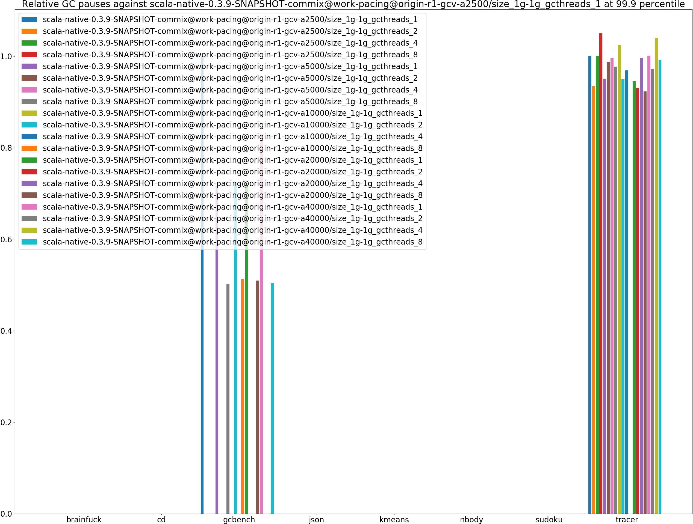

|name | scala-native-0.3.9-SNAPSHOT-commix@work-pacing@origin-r1-gcv-a2500/size_1g-1g_gcthreads_1 | scala-native-0.3.9-SNAPSHOT-commix@work-pacing@origin-r1-gcv-a2500/size_1g-1g_gcthreads_2 |  | scala-native-0.3.9-SNAPSHOT-commix@work-pacing@origin-r1-gcv-a2500/size_1g-1g_gcthreads_4 |  | scala-native-0.3.9-SNAPSHOT-commix@work-pacing@origin-r1-gcv-a2500/size_1g-1g_gcthreads_8 |  | scala-native-0.3.9-SNAPSHOT-commix@work-pacing@origin-r1-gcv-a5000/size_1g-1g_gcthreads_1 |  | scala-native-0.3.9-SNAPSHOT-commix@work-pacing@origin-r1-gcv-a5000/size_1g-1g_gcthreads_2 |  | scala-native-0.3.9-SNAPSHOT-commix@work-pacing@origin-r1-gcv-a5000/size_1g-1g_gcthreads_4 |  | scala-native-0.3.9-SNAPSHOT-commix@work-pacing@origin-r1-gcv-a5000/size_1g-1g_gcthreads_8 |  | scala-native-0.3.9-SNAPSHOT-commix@work-pacing@origin-r1-gcv-a10000/size_1g-1g_gcthreads_1 |  | scala-native-0.3.9-SNAPSHOT-commix@work-pacing@origin-r1-gcv-a10000/size_1g-1g_gcthreads_2 |  | scala-native-0.3.9-SNAPSHOT-commix@work-pacing@origin-r1-gcv-a10000/size_1g-1g_gcthreads_4 |  | scala-native-0.3.9-SNAPSHOT-commix@work-pacing@origin-r1-gcv-a10000/size_1g-1g_gcthreads_8 |  | scala-native-0.3.9-SNAPSHOT-commix@work-pacing@origin-r1-gcv-a20000/size_1g-1g_gcthreads_1 |  | scala-native-0.3.9-SNAPSHOT-commix@work-pacing@origin-r1-gcv-a20000/size_1g-1g_gcthreads_2 |  | scala-native-0.3.9-SNAPSHOT-commix@work-pacing@origin-r1-gcv-a20000/size_1g-1g_gcthreads_4 |  | scala-native-0.3.9-SNAPSHOT-commix@work-pacing@origin-r1-gcv-a20000/size_1g-1g_gcthreads_8 |  | scala-native-0.3.9-SNAPSHOT-commix@work-pacing@origin-r1-gcv-a40000/size_1g-1g_gcthreads_1 |  | scala-native-0.3.9-SNAPSHOT-commix@work-pacing@origin-r1-gcv-a40000/size_1g-1g_gcthreads_2 |  | scala-native-0.3.9-SNAPSHOT-commix@work-pacing@origin-r1-gcv-a40000/size_1g-1g_gcthreads_4 |  | scala-native-0.3.9-SNAPSHOT-commix@work-pacing@origin-r1-gcv-a40000/size_1g-1g_gcthreads_8 | |
| -- | -- | -- | -- | -- | -- | -- | -- | -- | -- | -- | -- | -- | -- | -- | -- | -- | -- | -- | -- | -- | -- | -- | -- | -- | -- | -- | -- | -- | -- | -- | -- | -- | -- | -- | -- | -- | -- | -- | -- |
|[brainfuck.BrainfuckBenchmark](#brainfuckbrainfuckbenchmark)|0.0000|0.0000|N/A|0.0000|N/A|0.0000|N/A|0.0000|N/A|0.0000|N/A|0.0000|N/A|0.0000|N/A|0.0000|N/A|0.0000|N/A|0.0000|N/A|0.0000|N/A|0.0000|N/A|0.0000|N/A|0.0000|N/A|0.0000|N/A|0.0000|N/A|0.0000|N/A|0.0000|N/A|0.0000|N/A|
|[cd.CDBenchmark](#cdcdbenchmark)|0.0000|0.0000|N/A|0.0000|N/A|0.0000|N/A|0.4068|N/A|0.0000|N/A|0.0000|N/A|0.0000|N/A|0.0000|N/A|0.0000|N/A|0.0000|N/A|0.0000|N/A|0.3813|N/A|0.0000|N/A|0.0000|N/A|0.0000|N/A|0.0000|N/A|0.0000|N/A|0.0000|N/A|0.0000|N/A|
|[gcbench.GCBenchBenchmark](#gcbenchgcbenchbenchmark)|10.7232|0.0000|__-100.00%__|0.0000|__-100.00%__|0.0000|__-100.00%__|7.6772|__-28.41%__|0.0000|__-100.00%__|0.0000|__-100.00%__|5.3853|__-49.78%__|0.0000|__-100.00%__|7.7579|__-27.65%__|0.0000|__-100.00%__|5.5048|__-48.66%__|7.7388|__-27.83%__|0.0000|__-100.00%__|0.0000|__-100.00%__|5.4635|__-49.05%__|8.9022|__-16.98%__|0.0000|__-100.00%__|0.0000|__-100.00%__|5.3989|__-49.65%__|
|[json.JsonBenchmark](#jsonjsonbenchmark)|0.0000|0.0000|N/A|0.0000|N/A|0.0000|N/A|0.0000|N/A|0.0000|N/A|0.0000|N/A|0.0000|N/A|0.0000|N/A|0.0000|N/A|0.0000|N/A|0.0000|N/A|0.0000|N/A|0.0000|N/A|0.0000|N/A|0.0000|N/A|0.0000|N/A|0.0000|N/A|0.0000|N/A|0.0000|N/A|
|[kmeans.KmeansBenchmark](#kmeanskmeansbenchmark)|0.0000|2.8930|N/A|1.9562|N/A|1.3210|N/A|0.0000|N/A|0.0000|N/A|1.6656|N/A|1.4636|N/A|6.1995|N/A|0.0000|N/A|1.8578|N/A|0.0000|N/A|3.0944|N/A|0.0000|N/A|0.0000|N/A|1.5527|N/A|0.0000|N/A|0.0000|N/A|1.8722|N/A|1.3764|N/A|
|[nbody.NbodyBenchmark](#nbodynbodybenchmark)|0.0000|0.0000|N/A|0.0000|N/A|0.0000|N/A|0.0000|N/A|0.0000|N/A|0.0000|N/A|0.0000|N/A|0.0000|N/A|0.0000|N/A|0.0000|N/A|0.0000|N/A|0.0000|N/A|0.0000|N/A|0.0000|N/A|0.0000|N/A|0.0000|N/A|0.0000|N/A|0.0000|N/A|0.0000|N/A|
|[sudoku.SudokuBenchmark](#sudokusudokubenchmark)|0.0000|0.0000|N/A|0.0000|N/A|0.0000|N/A|0.0000|N/A|0.0000|N/A|0.0000|N/A|0.0000|N/A|0.0000|N/A|0.0000|N/A|0.0000|N/A|0.0000|N/A|0.0000|N/A|0.0000|N/A|0.0000|N/A|0.0000|N/A|0.0000|N/A|0.0000|N/A|0.0000|N/A|0.0000|N/A|
|[tracer.TracerBenchmark](#tracertracerbenchmark)|0.0466|0.0435|__-6.54%__|0.0466|+0.05%|0.0489|+4.99%|0.0443|__-4.92%__|0.0460|__-1.26%__|0.0464|__-0.40%__|0.0455|__-2.27%__|0.0477|+2.45%|0.0442|__-4.99%__|0.0451|__-3.13%__|0.0000|__-100.00%__|0.0440|__-5.51%__|0.0433|__-6.92%__|0.0464|__-0.42%__|0.0430|__-7.70%__|0.0466|+0.14%|0.0453|__-2.72%__|0.0484|+3.96%|0.0462|__-0.80%__|
| __Geometrical mean:__|| |__-6.54%__| |+0.05%| |+4.99%| |__-17.49%__| |__-1.26%__| |__-0.40%__| |__-29.94%__| |+2.45%| |__-17.09%__| |__-3.13%__| |__-48.66%__| |__-17.42%__| |__-6.92%__| |__-0.42%__| |__-31.42%__| |__-8.82%__| |__-2.72%__| |+3.96%| |__-29.33%__|
# Individual benchmarks
## brainfuck.BrainfuckBenchmark
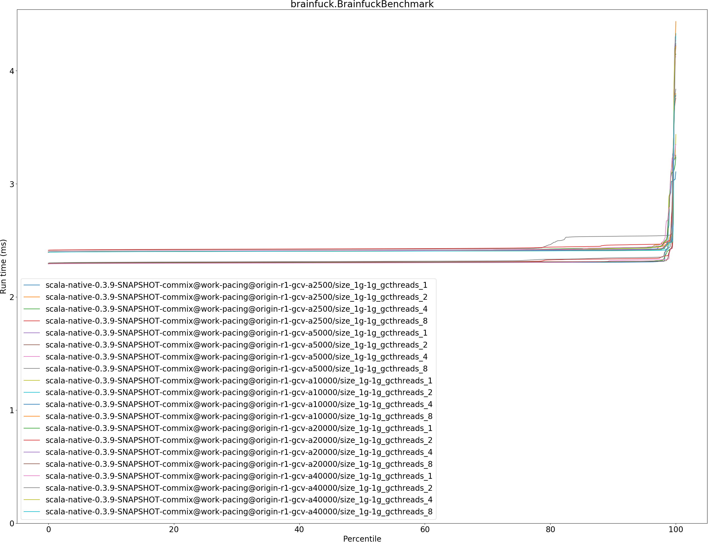

## cd.CDBenchmark

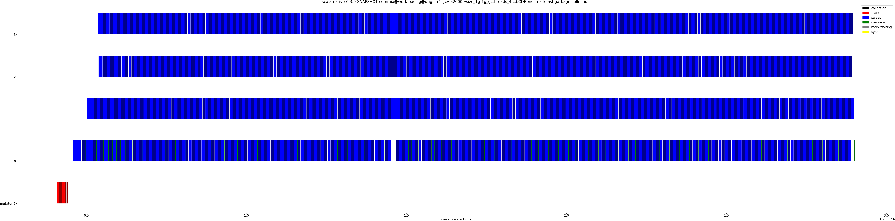

## gcbench.GCBenchBenchmark

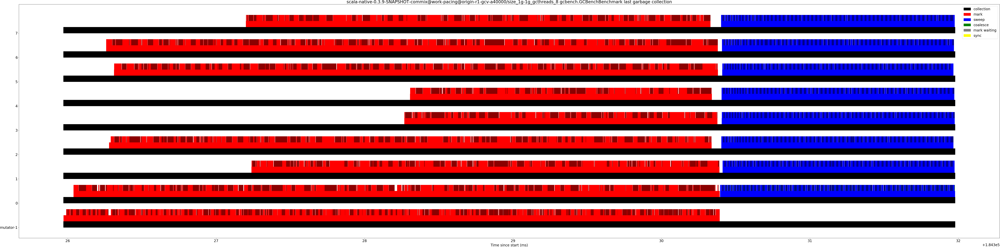

## json.JsonBenchmark

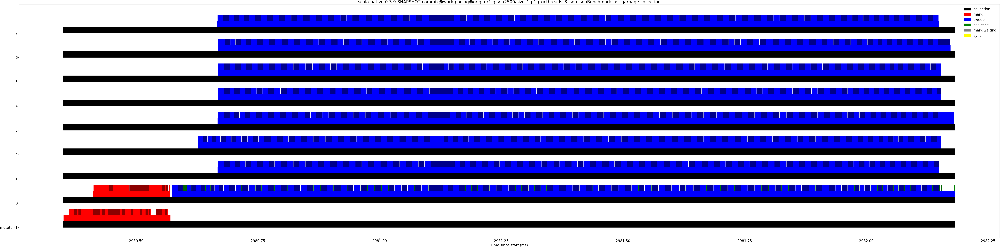

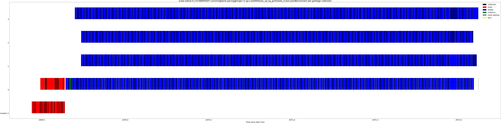

## kmeans.KmeansBenchmark

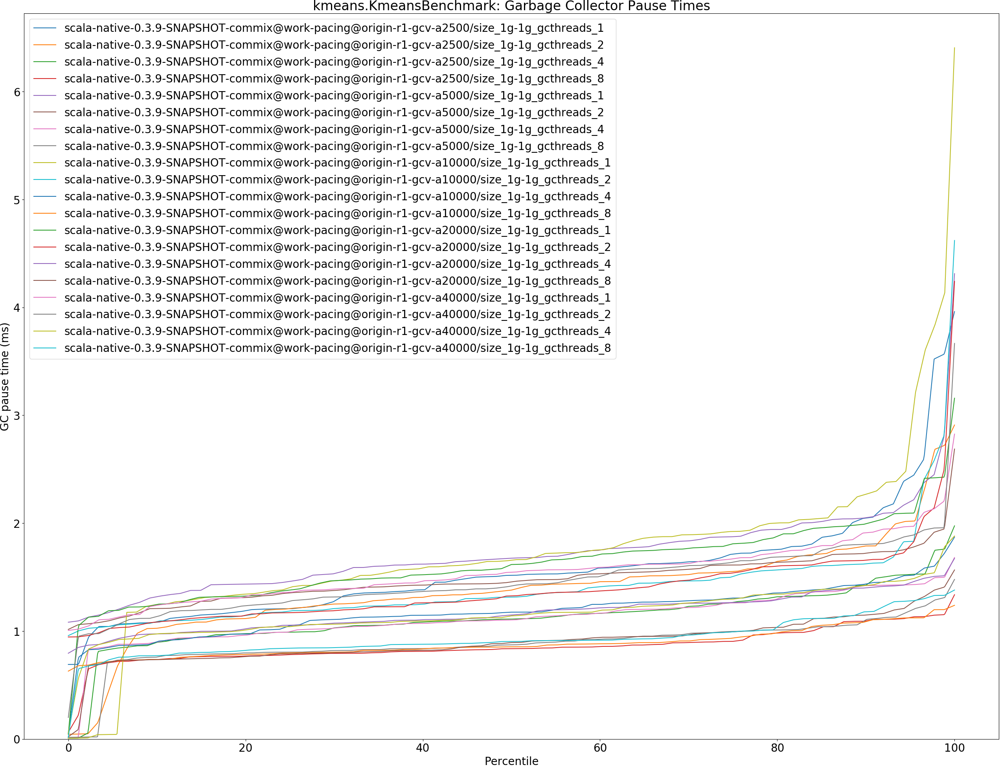

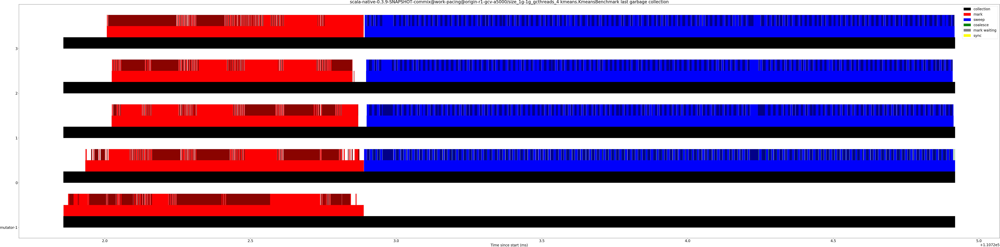

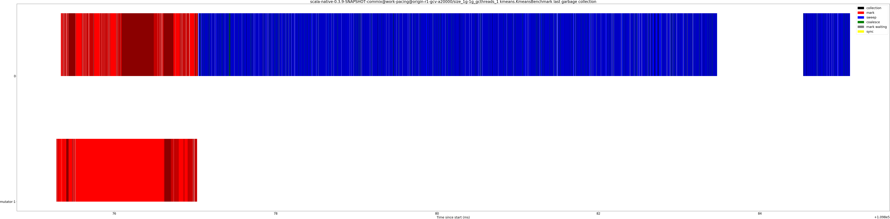

## nbody.NbodyBenchmark

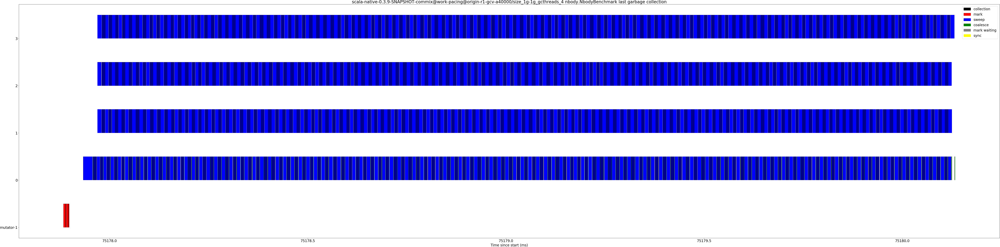

## sudoku.SudokuBenchmark

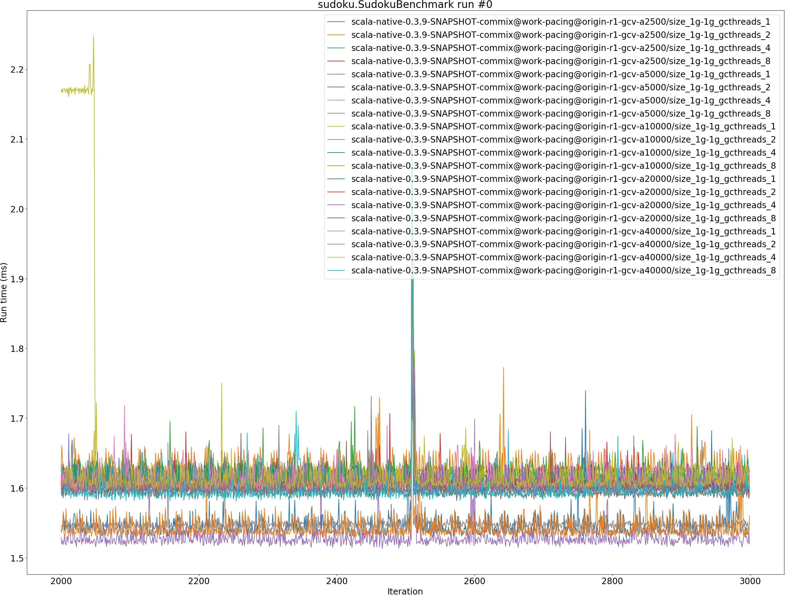

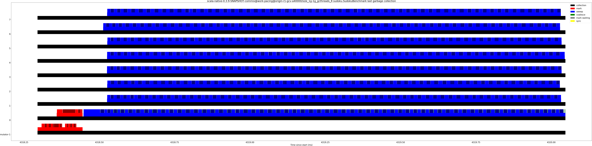

## tracer.TracerBenchmark
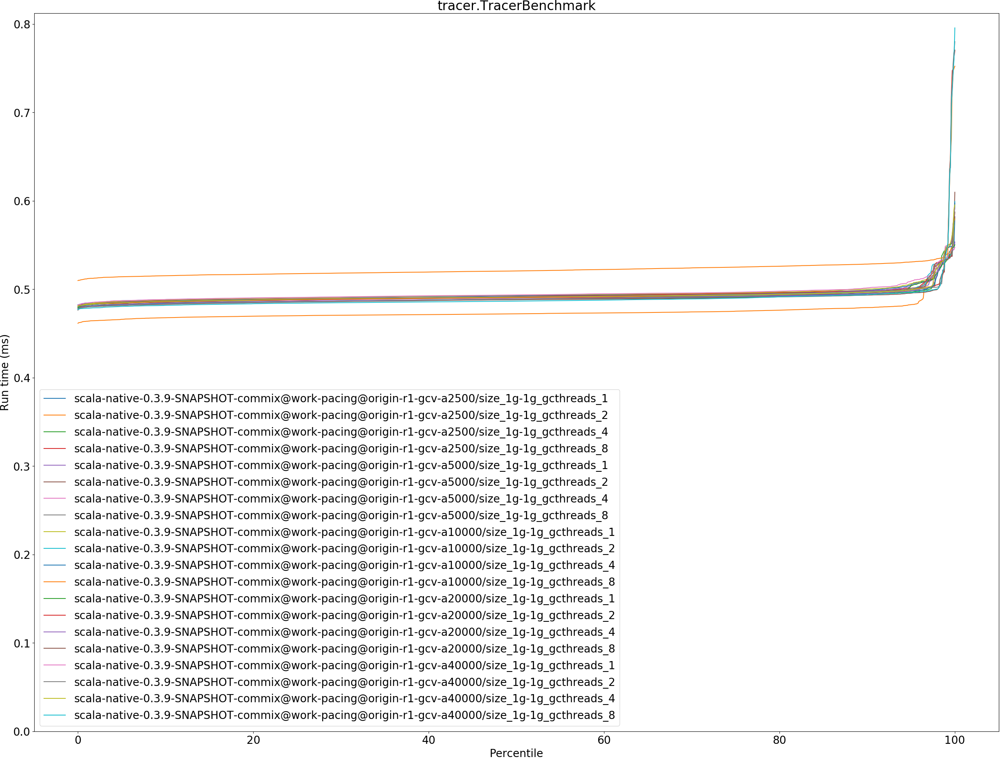

