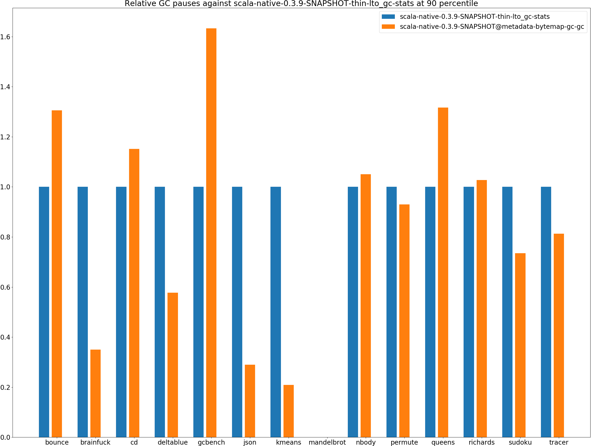
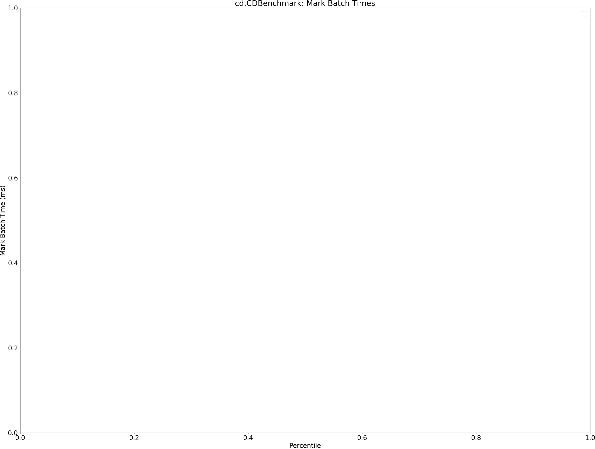
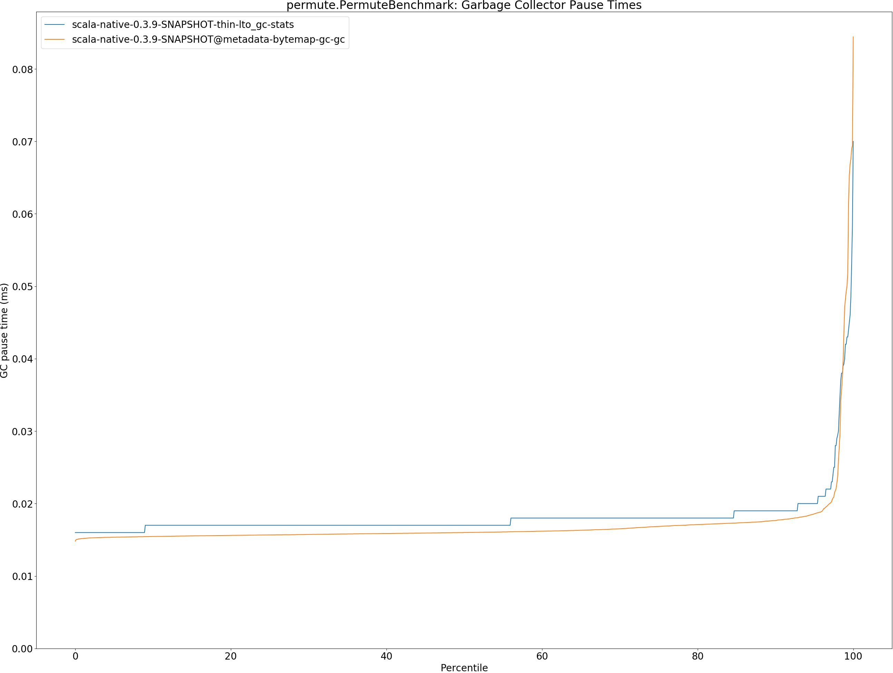
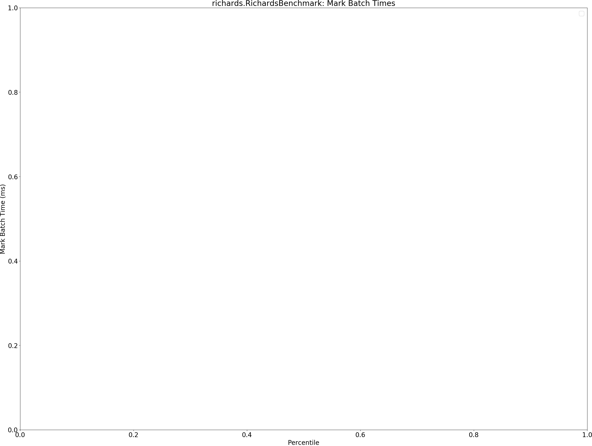
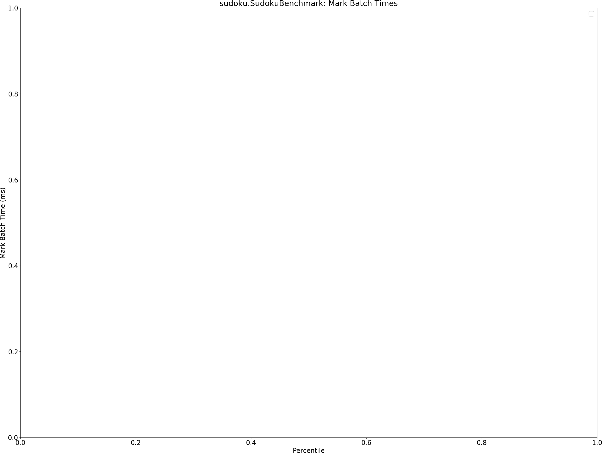

# Summary
## Benchmark run time (ms) at 50 percentile 

|name | scala-native-0.3.9-SNAPSHOT-thin-lto_gc-stats | scala-native-0.3.9-SNAPSHOT@metadata-bytemap-gc-gc | |
| -- | -- | -- | -- |
|[bounce.BounceBenchmark](#bouncebouncebenchmark)|0.0477|0.0468|__-1.90%__|
|[brainfuck.BrainfuckBenchmark](#brainfuckbrainfuckbenchmark)|3.5770|3.3905|__-5.21%__|
|[cd.CDBenchmark](#cdcdbenchmark)|25.4158|21.8937|__-13.86%__|
|[deltablue.DeltaBlueBenchmark](#deltabluedeltabluebenchmark)|0.2007|0.1741|__-13.26%__|
|[gcbench.GCBenchBenchmark](#gcbenchgcbenchbenchmark)|92.9670|102.1571|+9.89%|
|[json.JsonBenchmark](#jsonjsonbenchmark)|2.6490|2.4518|__-7.44%__|
|[kmeans.KmeansBenchmark](#kmeanskmeansbenchmark)|61.0161|47.8529|__-21.57%__|
|[mandelbrot.MandelbrotBenchmark](#mandelbrotmandelbrotbenchmark)|90.8127|90.5561|__-0.28%__|
|[nbody.NbodyBenchmark](#nbodynbodybenchmark)|29.1364|28.7122|__-1.46%__|
|[permute.PermuteBenchmark](#permutepermutebenchmark)|0.2158|0.1982|__-8.16%__|
|[queens.QueensBenchmark](#queensqueensbenchmark)|0.0894|0.0871|__-2.60%__|
|[richards.RichardsBenchmark](#richardsrichardsbenchmark)|0.0659|0.0625|__-5.15%__|
|[sudoku.SudokuBenchmark](#sudokusudokubenchmark)|2.5772|2.5579|__-0.75%__|
|[tracer.TracerBenchmark](#tracertracerbenchmark)|0.6811|0.5844|__-14.20%__|
| __Geometrical mean:__|| |__-6.45%__|
## Benchmark run time (ms) at 90 percentile 

|name | scala-native-0.3.9-SNAPSHOT-thin-lto_gc-stats | scala-native-0.3.9-SNAPSHOT@metadata-bytemap-gc-gc | |
| -- | -- | -- | -- |
|[bounce.BounceBenchmark](#bouncebouncebenchmark)|0.0488|0.0510|+4.55%|
|[brainfuck.BrainfuckBenchmark](#brainfuckbrainfuckbenchmark)|3.7685|3.4929|__-7.31%__|
|[cd.CDBenchmark](#cdcdbenchmark)|25.9378|22.3246|__-13.93%__|
|[deltablue.DeltaBlueBenchmark](#deltabluedeltabluebenchmark)|0.2185|0.1890|__-13.51%__|
|[gcbench.GCBenchBenchmark](#gcbenchgcbenchbenchmark)|96.7885|105.9204|+9.43%|
|[json.JsonBenchmark](#jsonjsonbenchmark)|2.8830|2.5063|__-13.07%__|
|[kmeans.KmeansBenchmark](#kmeanskmeansbenchmark)|66.0959|48.8747|__-26.05%__|
|[mandelbrot.MandelbrotBenchmark](#mandelbrotmandelbrotbenchmark)|92.0342|91.9315|__-0.11%__|
|[nbody.NbodyBenchmark](#nbodynbodybenchmark)|29.7822|29.2673|__-1.73%__|
|[permute.PermuteBenchmark](#permutepermutebenchmark)|0.2341|0.2146|__-8.32%__|
|[queens.QueensBenchmark](#queensqueensbenchmark)|0.0953|0.0903|__-5.32%__|
|[richards.RichardsBenchmark](#richardsrichardsbenchmark)|0.0691|0.0642|__-7.11%__|
|[sudoku.SudokuBenchmark](#sudokusudokubenchmark)|2.7898|2.7105|__-2.85%__|
|[tracer.TracerBenchmark](#tracertracerbenchmark)|0.7101|0.6211|__-12.53%__|
| __Geometrical mean:__|| |__-7.39%__|
## Benchmark run time (ms) at 99 percentile 

|name | scala-native-0.3.9-SNAPSHOT-thin-lto_gc-stats | scala-native-0.3.9-SNAPSHOT@metadata-bytemap-gc-gc | |
| -- | -- | -- | -- |
|[bounce.BounceBenchmark](#bouncebouncebenchmark)|0.0592|0.0512|__-13.39%__|
|[brainfuck.BrainfuckBenchmark](#brainfuckbrainfuckbenchmark)|4.0052|3.7001|__-7.62%__|
|[cd.CDBenchmark](#cdcdbenchmark)|27.9152|23.8348|__-14.62%__|
|[deltablue.DeltaBlueBenchmark](#deltabluedeltabluebenchmark)|0.2684|0.2238|__-16.62%__|
|[gcbench.GCBenchBenchmark](#gcbenchgcbenchbenchmark)|100.3226|109.4152|+9.06%|
|[json.JsonBenchmark](#jsonjsonbenchmark)|3.1342|2.6697|__-14.82%__|
|[kmeans.KmeansBenchmark](#kmeanskmeansbenchmark)|69.4771|50.6572|__-27.09%__|
|[mandelbrot.MandelbrotBenchmark](#mandelbrotmandelbrotbenchmark)|99.9049|98.8699|__-1.04%__|
|[nbody.NbodyBenchmark](#nbodynbodybenchmark)|31.8774|31.0626|__-2.56%__|
|[permute.PermuteBenchmark](#permutepermutebenchmark)|0.2519|0.2314|__-8.13%__|
|[queens.QueensBenchmark](#queensqueensbenchmark)|0.1066|0.0958|__-10.15%__|
|[richards.RichardsBenchmark](#richardsrichardsbenchmark)|0.1312|0.0692|__-47.28%__|
|[sudoku.SudokuBenchmark](#sudokusudokubenchmark)|3.0161|2.8869|__-4.28%__|
|[tracer.TracerBenchmark](#tracertracerbenchmark)|0.7538|0.6447|__-14.47%__|
| __Geometrical mean:__|| |__-13.44%__|
## Benchmark run time (ms) at 99.9 percentile 

|name | scala-native-0.3.9-SNAPSHOT-thin-lto_gc-stats | scala-native-0.3.9-SNAPSHOT@metadata-bytemap-gc-gc | |
| -- | -- | -- | -- |
|[bounce.BounceBenchmark](#bouncebouncebenchmark)|0.0708|0.0622|__-12.17%__|
|[brainfuck.BrainfuckBenchmark](#brainfuckbrainfuckbenchmark)|4.2298|4.6689|+10.38%|
|[cd.CDBenchmark](#cdcdbenchmark)|28.2402|25.3714|__-10.16%__|
|[deltablue.DeltaBlueBenchmark](#deltabluedeltabluebenchmark)|0.3411|0.3290|__-3.55%__|
|[gcbench.GCBenchBenchmark](#gcbenchgcbenchbenchmark)|102.9347|112.7307|+9.52%|
|[json.JsonBenchmark](#jsonjsonbenchmark)|3.2616|3.2162|__-1.39%__|
|[kmeans.KmeansBenchmark](#kmeanskmeansbenchmark)|84.2871|52.7897|__-37.37%__|
|[mandelbrot.MandelbrotBenchmark](#mandelbrotmandelbrotbenchmark)|100.7041|100.3879|__-0.31%__|
|[nbody.NbodyBenchmark](#nbodynbodybenchmark)|32.2545|33.0820|+2.57%|
|[permute.PermuteBenchmark](#permutepermutebenchmark)|0.3083|0.2729|__-11.49%__|
|[queens.QueensBenchmark](#queensqueensbenchmark)|0.1160|0.1368|+17.89%|
|[richards.RichardsBenchmark](#richardsrichardsbenchmark)|0.1399|0.0813|__-41.87%__|
|[sudoku.SudokuBenchmark](#sudokusudokubenchmark)|3.1714|3.7274|+17.53%|
|[tracer.TracerBenchmark](#tracertracerbenchmark)|0.7744|0.7313|__-5.56%__|
| __Geometrical mean:__|| |__-6.49%__|
## Benchmark total run time (ms) 

|name | scala-native-0.3.9-SNAPSHOT-thin-lto_gc-stats | scala-native-0.3.9-SNAPSHOT@metadata-bytemap-gc-gc | |
| -- | -- | -- | -- |
|[bounce.BounceBenchmark](#bouncebouncebenchmark)|962.5831|954.6960|__-0.82%__|
|[brainfuck.BrainfuckBenchmark](#brainfuckbrainfuckbenchmark)|72005.5933|68233.3871|__-5.24%__|
|[cd.CDBenchmark](#cdcdbenchmark)|511161.3810|439922.1340|__-13.94%__|
|[deltablue.DeltaBlueBenchmark](#deltabluedeltabluebenchmark)|4108.4862|3550.1624|__-13.59%__|
|[gcbench.GCBenchBenchmark](#gcbenchgcbenchbenchmark)|1863027.5644|2038007.8823|+9.39%|
|[json.JsonBenchmark](#jsonjsonbenchmark)|54384.9262|48903.2054|__-10.08%__|
|[kmeans.KmeansBenchmark](#kmeanskmeansbenchmark)|1240168.2262|960966.5845|__-22.51%__|
|[mandelbrot.MandelbrotBenchmark](#mandelbrotmandelbrotbenchmark)|1817747.5206|1808430.8530|__-0.51%__|
|[nbody.NbodyBenchmark](#nbodynbodybenchmark)|585539.7076|577102.5261|__-1.44%__|
|[permute.PermuteBenchmark](#permutepermutebenchmark)|4394.2237|4026.7683|__-8.36%__|
|[queens.QueensBenchmark](#queensqueensbenchmark)|1812.6352|1753.4422|__-3.27%__|
|[richards.RichardsBenchmark](#richardsrichardsbenchmark)|1363.0095|1253.4165|__-8.04%__|
|[sudoku.SudokuBenchmark](#sudokusudokubenchmark)|52535.0830|51665.0665|__-1.66%__|
|[tracer.TracerBenchmark](#tracertracerbenchmark)|13698.9000|11787.9758|__-13.95%__|
| __Geometrical mean:__|| |__-7.03%__|
## Total GC time on Application thread (ms) 

|name |  | scala-native-0.3.9-SNAPSHOT-thin-lto_gc-stats | scala-native-0.3.9-SNAPSHOT@metadata-bytemap-gc-gc | |
| -- | -- | -- | -- | -- |
|[bounce.BounceBenchmark](#bouncebouncebenchmark)|mark|1.4500|1.6332|+12.63%|
||sweep|0.9790|1.0007|+2.22%|
||total|2.4290|2.6339|+8.44%|
|[brainfuck.BrainfuckBenchmark](#brainfuckbrainfuckbenchmark)|mark|2495.8530|2430.9644|__-2.60%__|
||sweep|2761.8930|680.4708|__-75.36%__|
||total|5257.7460|3111.4352|__-40.82%__|
|[cd.CDBenchmark](#cdcdbenchmark)|mark|4654.2990|147573952574418.7188|+3170702023436.06%|
||sweep|5208.1520|129127208512957.9844|+2479328723657.64%|
||total|9862.4510|276701161087376.7500|+2805602391104.55%|
|[deltablue.DeltaBlueBenchmark](#deltabluedeltabluebenchmark)|mark|85.3570|59.9590|__-29.76%__|
||sweep|53.3410|22.2613|__-58.27%__|
||total|138.6980|82.2203|__-40.72%__|
|[gcbench.GCBenchBenchmark](#gcbenchgcbenchbenchmark)|mark|103033.0140|4408771833573094.0000|+4278989483380.60%|
||sweep|64091.3700|1162144876658472.7500|+1813262653917.96%|
||total|167124.3840|5570916710231566.0000|+3333395508619.76%|
|[json.JsonBenchmark](#jsonjsonbenchmark)|mark|2509.0300|1553.8171|__-38.07%__|
||sweep|2353.2510|348.4634|__-85.19%__|
||total|4862.2810|1902.2805|__-60.88%__|
|[kmeans.KmeansBenchmark](#kmeanskmeansbenchmark)|mark|227589.7470|424275113670088.1875|+186421013703.44%|
||sweep|138701.0200|92233720366314.7188|+66498227790.69%|
||total|366290.7670|516508834036402.8125|+141010606928.60%|
|[mandelbrot.MandelbrotBenchmark](#mandelbrotmandelbrotbenchmark)|mark|0.0000|0.0000|N/A|
||sweep|0.0000|0.0000|N/A|
||total|0.0000|0.0000|N/A|
|[nbody.NbodyBenchmark](#nbodynbodybenchmark)|mark|476.7250|930.9216|+95.27%|
||sweep|442.5160|18446744070293.3633|+4168604992780.11%|
||total|919.2410|18446744071224.2852|+2006736434765.75%|
|[permute.PermuteBenchmark](#permutepermutebenchmark)|mark|45.0490|36.4853|__-19.01%__|
||sweep|36.0240|30.0292|__-16.64%__|
||total|81.0730|66.5145|__-17.96%__|
|[queens.QueensBenchmark](#queensqueensbenchmark)|mark|2.6950|2.6566|__-1.42%__|
||sweep|1.7030|1.8376|+7.90%|
||total|4.3980|4.4942|+2.19%|
|[richards.RichardsBenchmark](#richardsrichardsbenchmark)|mark|3.4180|3.3125|__-3.09%__|
||sweep|2.5280|2.5745|+1.84%|
||total|5.9460|5.8871|__-0.99%__|
|[sudoku.SudokuBenchmark](#sudokusudokubenchmark)|mark|1146.6490|1174.6879|+2.45%|
||sweep|1286.8670|443.9718|__-65.50%__|
||total|2433.5160|1618.6597|__-33.48%__|
|[tracer.TracerBenchmark](#tracertracerbenchmark)|mark|597.6010|398.0547|__-33.39%__|
||sweep|430.6030|326.9159|__-24.08%__|
||total|1028.2040|724.9706|__-29.49%__|
|__Geometrical mean:__|mark|| |+20553.77%|
||sweep|| |+78881.06%|
||total|| |+103242.20%|
## GC pause time (ms) at 50 percentile 

|name | scala-native-0.3.9-SNAPSHOT-thin-lto_gc-stats | scala-native-0.3.9-SNAPSHOT@metadata-bytemap-gc-gc | |
| -- | -- | -- | -- |
|[bounce.BounceBenchmark](#bouncebouncebenchmark)|0.0210|0.0198|__-5.68%__|
|[brainfuck.BrainfuckBenchmark](#brainfuckbrainfuckbenchmark)|0.1100|0.0497|__-54.81%__|
|[cd.CDBenchmark](#cdcdbenchmark)|0.1600|0.1893|+18.30%|
|[deltablue.DeltaBlueBenchmark](#deltabluedeltabluebenchmark)|0.0470|0.0286|__-39.15%__|
|[gcbench.GCBenchBenchmark](#gcbenchgcbenchbenchmark)|2.3660|2.1170|__-10.53%__|
|[json.JsonBenchmark](#jsonjsonbenchmark)|0.1570|0.0623|__-60.29%__|
|[kmeans.KmeansBenchmark](#kmeanskmeansbenchmark)|4.8630|1.5348|__-68.44%__|
|[mandelbrot.MandelbrotBenchmark](#mandelbrotmandelbrotbenchmark)|0.0000|0.0000|N/A|
|[nbody.NbodyBenchmark](#nbodynbodybenchmark)|0.0150|0.0147|__-2.08%__|
|[permute.PermuteBenchmark](#permutepermutebenchmark)|0.0170|0.0160|__-5.82%__|
|[queens.QueensBenchmark](#queensqueensbenchmark)|0.0210|0.0183|__-13.02%__|
|[richards.RichardsBenchmark](#richardsrichardsbenchmark)|0.0180|0.0168|__-6.43%__|
|[sudoku.SudokuBenchmark](#sudokusudokubenchmark)|0.1720|0.1238|__-28.00%__|
|[tracer.TracerBenchmark](#tracertracerbenchmark)|0.0210|0.0172|__-18.13%__|
| __Geometrical mean:__|| |__-27.53%__|
## GC pause time (ms) at 90 percentile 

|name | scala-native-0.3.9-SNAPSHOT-thin-lto_gc-stats | scala-native-0.3.9-SNAPSHOT@metadata-bytemap-gc-gc | |
| -- | -- | -- | -- |
|[bounce.BounceBenchmark](#bouncebouncebenchmark)|0.0380|0.0496|+30.52%|
|[brainfuck.BrainfuckBenchmark](#brainfuckbrainfuckbenchmark)|0.2180|0.0762|__-65.03%__|
|[cd.CDBenchmark](#cdcdbenchmark)|0.1910|0.2199|+15.12%|
|[deltablue.DeltaBlueBenchmark](#deltabluedeltabluebenchmark)|0.0730|0.0422|__-42.23%__|
|[gcbench.GCBenchBenchmark](#gcbenchgcbenchbenchmark)|3.2130|5.2463|+63.28%|
|[json.JsonBenchmark](#jsonjsonbenchmark)|0.2210|0.0641|__-70.99%__|
|[kmeans.KmeansBenchmark](#kmeanskmeansbenchmark)|7.5140|1.5692|__-79.12%__|
|[mandelbrot.MandelbrotBenchmark](#mandelbrotmandelbrotbenchmark)|0.0000|0.0000|N/A|
|[nbody.NbodyBenchmark](#nbodynbodybenchmark)|0.0160|0.0168|+5.01%|
|[permute.PermuteBenchmark](#permutepermutebenchmark)|0.0190|0.0177|__-7.03%__|
|[queens.QueensBenchmark](#queensqueensbenchmark)|0.0410|0.0540|+31.70%|
|[richards.RichardsBenchmark](#richardsrichardsbenchmark)|0.0230|0.0236|+2.76%|
|[sudoku.SudokuBenchmark](#sudokusudokubenchmark)|0.1850|0.1360|__-26.51%__|
|[tracer.TracerBenchmark](#tracertracerbenchmark)|0.0230|0.0187|__-18.71%__|
| __Geometrical mean:__|| |__-25.02%__|
## GC pause time (ms) at 99 percentile 

|name | scala-native-0.3.9-SNAPSHOT-thin-lto_gc-stats | scala-native-0.3.9-SNAPSHOT@metadata-bytemap-gc-gc | |
| -- | -- | -- | -- |
|[bounce.BounceBenchmark](#bouncebouncebenchmark)|0.0431|0.0566|+31.36%|
|[brainfuck.BrainfuckBenchmark](#brainfuckbrainfuckbenchmark)|0.3240|0.0864|__-73.32%__|
|[cd.CDBenchmark](#cdcdbenchmark)|0.3140|0.3240|+3.17%|
|[deltablue.DeltaBlueBenchmark](#deltabluedeltabluebenchmark)|0.0980|0.0799|__-18.52%__|
|[gcbench.GCBenchBenchmark](#gcbenchgcbenchbenchmark)|6.8190|5.5759|__-18.23%__|
|[json.JsonBenchmark](#jsonjsonbenchmark)|0.2440|0.1031|__-57.73%__|
|[kmeans.KmeansBenchmark](#kmeanskmeansbenchmark)|8.7280|1.7096|__-80.41%__|
|[mandelbrot.MandelbrotBenchmark](#mandelbrotmandelbrotbenchmark)|0.0000|0.0000|N/A|
|[nbody.NbodyBenchmark](#nbodynbodybenchmark)|0.0320|0.0319|__-0.34%__|
|[permute.PermuteBenchmark](#permutepermutebenchmark)|0.0420|0.0482|+14.81%|
|[queens.QueensBenchmark](#queensqueensbenchmark)|0.0588|0.0708|+20.30%|
|[richards.RichardsBenchmark](#richardsrichardsbenchmark)|0.0420|0.0544|+29.35%|
|[sudoku.SudokuBenchmark](#sudokusudokubenchmark)|0.2310|0.2102|__-8.99%__|
|[tracer.TracerBenchmark](#tracertracerbenchmark)|0.0310|0.0248|__-20.04%__|
| __Geometrical mean:__|| |__-24.51%__|
## GC pause time (ms) at 99.9 percentile 

|name | scala-native-0.3.9-SNAPSHOT-thin-lto_gc-stats | scala-native-0.3.9-SNAPSHOT@metadata-bytemap-gc-gc | |
| -- | -- | -- | -- |
|[bounce.BounceBenchmark](#bouncebouncebenchmark)|0.0502|0.0570|+13.46%|
|[brainfuck.BrainfuckBenchmark](#brainfuckbrainfuckbenchmark)|0.4190|0.1952|__-53.42%__|
|[cd.CDBenchmark](#cdcdbenchmark)|0.3500|0.3544|+1.25%|
|[deltablue.DeltaBlueBenchmark](#deltabluedeltabluebenchmark)|0.1225|0.1202|__-1.91%__|
|[gcbench.GCBenchBenchmark](#gcbenchgcbenchbenchmark)|7.8010|6.9104|__-11.42%__|
|[json.JsonBenchmark](#jsonjsonbenchmark)|0.3310|0.1390|__-58.02%__|
|[kmeans.KmeansBenchmark](#kmeanskmeansbenchmark)|11.9424|3.7976|__-68.20%__|
|[mandelbrot.MandelbrotBenchmark](#mandelbrotmandelbrotbenchmark)|0.0000|0.0000|N/A|
|[nbody.NbodyBenchmark](#nbodynbodybenchmark)|0.0490|0.0673|+37.39%|
|[permute.PermuteBenchmark](#permutepermutebenchmark)|0.0585|0.0695|+18.68%|
|[queens.QueensBenchmark](#queensqueensbenchmark)|0.1014|0.0802|__-20.95%__|
|[richards.RichardsBenchmark](#richardsrichardsbenchmark)|0.0551|0.0604|+9.65%|
|[sudoku.SudokuBenchmark](#sudokusudokubenchmark)|0.3054|0.3071|+0.57%|
|[tracer.TracerBenchmark](#tracertracerbenchmark)|0.0492|0.0495|+0.57%|
| __Geometrical mean:__|| |__-17.00%__|
# Individual benchmarks
## bounce.BounceBenchmark

## brainfuck.BrainfuckBenchmark

## cd.CDBenchmark

## deltablue.DeltaBlueBenchmark

## gcbench.GCBenchBenchmark

## json.JsonBenchmark

## kmeans.KmeansBenchmark

## mandelbrot.MandelbrotBenchmark

## nbody.NbodyBenchmark

## permute.PermuteBenchmark

## queens.QueensBenchmark

## richards.RichardsBenchmark

## sudoku.SudokuBenchmark

## tracer.TracerBenchmark

