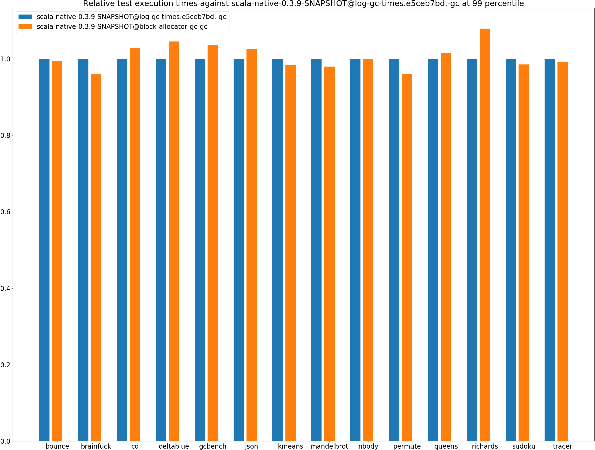
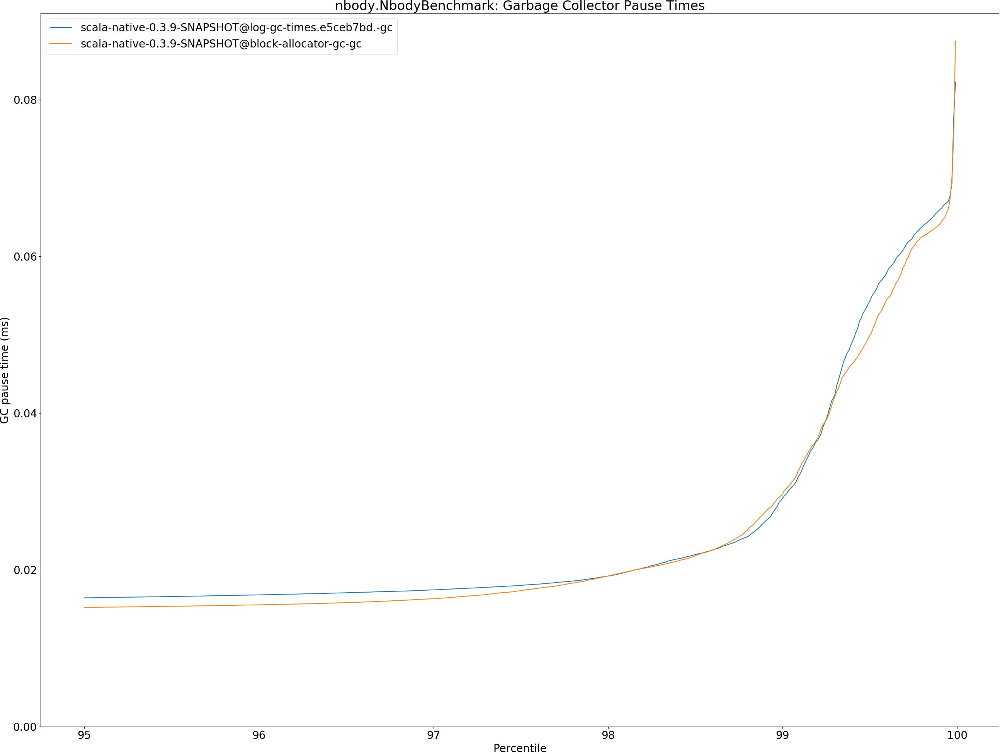
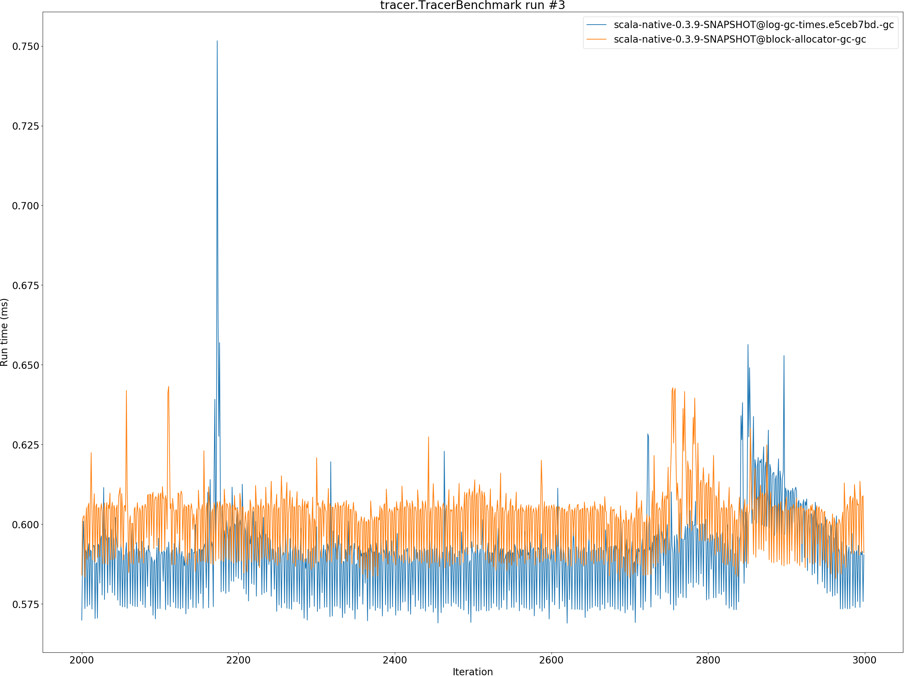

# Summary
## Benchmark run time (ms) at 50 percentile 

|name | scala-native-0.3.9-SNAPSHOT@log-gc-times.e5ceb7bd.-gc | scala-native-0.3.9-SNAPSHOT@block-allocator-gc-gc | |
| -- | -- | -- | -- |
|[bounce.BounceBenchmark](#bouncebouncebenchmark)|0.0467|0.0468|+0.06%|
|[brainfuck.BrainfuckBenchmark](#brainfuckbrainfuckbenchmark)|3.4073|3.3172|__-2.64%__|
|[cd.CDBenchmark](#cdcdbenchmark)|21.9186|22.6527|+3.35%|
|[deltablue.DeltaBlueBenchmark](#deltabluedeltabluebenchmark)|0.1756|0.1820|+3.69%|
|[gcbench.GCBenchBenchmark](#gcbenchgcbenchbenchmark)|104.4325|104.5417|+0.10%|
|[json.JsonBenchmark](#jsonjsonbenchmark)|1.3358|1.3756|+2.98%|
|[kmeans.KmeansBenchmark](#kmeanskmeansbenchmark)|48.4345|47.3242|__-2.29%__|
|[mandelbrot.MandelbrotBenchmark](#mandelbrotmandelbrotbenchmark)|91.1676|90.6533|__-0.56%__|
|[nbody.NbodyBenchmark](#nbodynbodybenchmark)|28.7866|28.6745|__-0.39%__|
|[permute.PermuteBenchmark](#permutepermutebenchmark)|0.2014|0.1907|__-5.27%__|
|[queens.QueensBenchmark](#queensqueensbenchmark)|0.0865|0.0868|+0.41%|
|[richards.RichardsBenchmark](#richardsrichardsbenchmark)|0.0624|0.0637|+2.15%|
|[sudoku.SudokuBenchmark](#sudokusudokubenchmark)|2.3391|2.2943|__-1.91%__|
|[tracer.TracerBenchmark](#tracertracerbenchmark)|0.5909|0.5884|__-0.43%__|
| __Geometrical mean:__|| |__-0.08%__|
## Benchmark run time (ms) at 90 percentile 

|name | scala-native-0.3.9-SNAPSHOT@log-gc-times.e5ceb7bd.-gc | scala-native-0.3.9-SNAPSHOT@block-allocator-gc-gc | |
| -- | -- | -- | -- |
|[bounce.BounceBenchmark](#bouncebouncebenchmark)|0.0504|0.0508|+0.90%|
|[brainfuck.BrainfuckBenchmark](#brainfuckbrainfuckbenchmark)|3.6021|3.4635|__-3.85%__|
|[cd.CDBenchmark](#cdcdbenchmark)|22.6967|23.1863|+2.16%|
|[deltablue.DeltaBlueBenchmark](#deltabluedeltabluebenchmark)|0.1879|0.1962|+4.40%|
|[gcbench.GCBenchBenchmark](#gcbenchgcbenchbenchmark)|108.4186|110.5789|+1.99%|
|[json.JsonBenchmark](#jsonjsonbenchmark)|1.3863|1.4215|+2.54%|
|[kmeans.KmeansBenchmark](#kmeanskmeansbenchmark)|49.6069|48.6426|__-1.94%__|
|[mandelbrot.MandelbrotBenchmark](#mandelbrotmandelbrotbenchmark)|92.8670|92.0227|__-0.91%__|
|[nbody.NbodyBenchmark](#nbodynbodybenchmark)|29.5384|29.3661|__-0.58%__|
|[permute.PermuteBenchmark](#permutepermutebenchmark)|0.2166|0.2049|__-5.40%__|
|[queens.QueensBenchmark](#queensqueensbenchmark)|0.0885|0.0916|+3.47%|
|[richards.RichardsBenchmark](#richardsrichardsbenchmark)|0.0642|0.0684|+6.67%|
|[sudoku.SudokuBenchmark](#sudokusudokubenchmark)|2.5018|2.4540|__-1.91%__|
|[tracer.TracerBenchmark](#tracertracerbenchmark)|0.6272|0.6053|__-3.48%__|
| __Geometrical mean:__|| |+0.23%|
## Benchmark run time (ms) at 99 percentile 

|name | scala-native-0.3.9-SNAPSHOT@log-gc-times.e5ceb7bd.-gc | scala-native-0.3.9-SNAPSHOT@block-allocator-gc-gc | |
| -- | -- | -- | -- |
|[bounce.BounceBenchmark](#bouncebouncebenchmark)|0.0515|0.0512|__-0.49%__|
|[brainfuck.BrainfuckBenchmark](#brainfuckbrainfuckbenchmark)|3.7820|3.6335|__-3.93%__|
|[cd.CDBenchmark](#cdcdbenchmark)|24.0180|24.6910|+2.80%|
|[deltablue.DeltaBlueBenchmark](#deltabluedeltabluebenchmark)|0.2207|0.2307|+4.52%|
|[gcbench.GCBenchBenchmark](#gcbenchgcbenchbenchmark)|112.7124|116.8553|+3.68%|
|[json.JsonBenchmark](#jsonjsonbenchmark)|1.4808|1.5195|+2.62%|
|[kmeans.KmeansBenchmark](#kmeanskmeansbenchmark)|52.7281|51.8576|__-1.65%__|
|[mandelbrot.MandelbrotBenchmark](#mandelbrotmandelbrotbenchmark)|100.3280|98.2608|__-2.06%__|
|[nbody.NbodyBenchmark](#nbodynbodybenchmark)|31.6836|31.6599|__-0.07%__|
|[permute.PermuteBenchmark](#permutepermutebenchmark)|0.2267|0.2176|__-4.00%__|
|[queens.QueensBenchmark](#queensqueensbenchmark)|0.0946|0.0960|+1.49%|
|[richards.RichardsBenchmark](#richardsrichardsbenchmark)|0.0687|0.0741|+7.87%|
|[sudoku.SudokuBenchmark](#sudokusudokubenchmark)|2.6446|2.6052|__-1.49%__|
|[tracer.TracerBenchmark](#tracertracerbenchmark)|0.6488|0.6440|__-0.73%__|
| __Geometrical mean:__|| |+0.56%|
## Benchmark run time (ms) at 99.9 percentile 

|name | scala-native-0.3.9-SNAPSHOT@log-gc-times.e5ceb7bd.-gc | scala-native-0.3.9-SNAPSHOT@block-allocator-gc-gc | |
| -- | -- | -- | -- |
|[bounce.BounceBenchmark](#bouncebouncebenchmark)|0.0741|0.0796|+7.42%|
|[brainfuck.BrainfuckBenchmark](#brainfuckbrainfuckbenchmark)|4.0777|4.6329|+13.62%|
|[cd.CDBenchmark](#cdcdbenchmark)|25.0211|25.4159|+1.58%|
|[deltablue.DeltaBlueBenchmark](#deltabluedeltabluebenchmark)|0.2672|0.2911|+8.93%|
|[gcbench.GCBenchBenchmark](#gcbenchgcbenchbenchmark)|116.3302|119.6873|+2.89%|
|[json.JsonBenchmark](#jsonjsonbenchmark)|1.7065|1.5469|__-9.35%__|
|[kmeans.KmeansBenchmark](#kmeanskmeansbenchmark)|53.6285|53.1344|__-0.92%__|
|[mandelbrot.MandelbrotBenchmark](#mandelbrotmandelbrotbenchmark)|100.9871|100.3419|__-0.64%__|
|[nbody.NbodyBenchmark](#nbodynbodybenchmark)|31.9787|32.1296|+0.47%|
|[permute.PermuteBenchmark](#permutepermutebenchmark)|0.2412|0.2448|+1.51%|
|[queens.QueensBenchmark](#queensqueensbenchmark)|0.1069|0.1077|+0.74%|
|[richards.RichardsBenchmark](#richardsrichardsbenchmark)|0.0817|0.0968|+18.39%|
|[sudoku.SudokuBenchmark](#sudokusudokubenchmark)|3.3390|2.7227|__-18.46%__|
|[tracer.TracerBenchmark](#tracertracerbenchmark)|0.7657|0.8643|+12.88%|
| __Geometrical mean:__|| |+2.37%|
## Benchmark total run time (ms) 

|name | scala-native-0.3.9-SNAPSHOT@log-gc-times.e5ceb7bd.-gc | scala-native-0.3.9-SNAPSHOT@block-allocator-gc-gc | |
| -- | -- | -- | -- |
|[bounce.BounceBenchmark](#bouncebouncebenchmark)|948.2402|948.0126|__-0.02%__|
|[brainfuck.BrainfuckBenchmark](#brainfuckbrainfuckbenchmark)|68762.0705|66864.8610|__-2.76%__|
|[cd.CDBenchmark](#cdcdbenchmark)|441661.8789|454619.3891|+2.93%|
|[deltablue.DeltaBlueBenchmark](#deltabluedeltabluebenchmark)|3572.1584|3712.8221|+3.94%|
|[gcbench.GCBenchBenchmark](#gcbenchgcbenchbenchmark)|2091570.0969|2089973.9544|__-0.08%__|
|[json.JsonBenchmark](#jsonjsonbenchmark)|26560.5123|27485.3553|+3.48%|
|[kmeans.KmeansBenchmark](#kmeanskmeansbenchmark)|974311.2903|945403.2750|__-2.97%__|
|[mandelbrot.MandelbrotBenchmark](#mandelbrotmandelbrotbenchmark)|1832270.8030|1818247.7622|__-0.77%__|
|[nbody.NbodyBenchmark](#nbodynbodybenchmark)|579807.4082|577575.3808|__-0.38%__|
|[permute.PermuteBenchmark](#permutepermutebenchmark)|4073.0634|3854.7400|__-5.36%__|
|[queens.QueensBenchmark](#queensqueensbenchmark)|1738.6374|1747.1655|+0.49%|
|[richards.RichardsBenchmark](#richardsrichardsbenchmark)|1254.5864|1295.3204|+3.25%|
|[sudoku.SudokuBenchmark](#sudokusudokubenchmark)|47584.9430|46645.1134|__-1.98%__|
|[tracer.TracerBenchmark](#tracertracerbenchmark)|11901.4151|11805.9728|__-0.80%__|
| __Geometrical mean:__|| |__-0.11%__|
## Total GC time on Application thread (ms) 

|name |  | scala-native-0.3.9-SNAPSHOT@log-gc-times.e5ceb7bd.-gc | scala-native-0.3.9-SNAPSHOT@block-allocator-gc-gc | |
| -- | -- | -- | -- | -- |
|[bounce.BounceBenchmark](#bouncebouncebenchmark)|mark|1.6166|1.5613|__-3.42%__|
||sweep|1.0588|1.0786|+1.87%|
||total|2.6754|2.6400|__-1.32%__|
|[brainfuck.BrainfuckBenchmark](#brainfuckbrainfuckbenchmark)|mark|2436.2659|2866.6171|+17.66%|
||sweep|675.4397|18446744070102.1406|+2731071896370.65%|
||total|3111.7056|18446744072968.7656|+592817782474.89%|
|[cd.CDBenchmark](#cdcdbenchmark)|mark|55340232227294.4141|110680464442110.9062|+100.00%|
||sweep|55340232235315.7344|55340232221066.2109|__-0.00%__|
||total|110680464462610.1562|166020696663177.1875|+50.00%|
|[deltablue.DeltaBlueBenchmark](#deltabluedeltabluebenchmark)|mark|65.0989|75.7290|+16.33%|
||sweep|23.0948|22.1601|__-4.05%__|
||total|88.1937|97.8891|+10.99%|
|[gcbench.GCBenchBenchmark](#gcbenchgcbenchbenchmark)|mark|3855369511507393.5000|3504881374074594.5000|__-9.09%__|
||sweep|1199038364803591.2500|1051464412228828.1250|__-12.31%__|
||total|5054407876310986.0000|4556345786303421.0000|__-9.85%__|
|[json.JsonBenchmark](#jsonjsonbenchmark)|mark|18446744070978.2617|1136.1670|__-100.00%__|
||sweep|372.2453|304.1441|__-18.29%__|
||total|18446744071350.5000|1440.3111|__-100.00%__|
|[kmeans.KmeansBenchmark](#kmeanskmeansbenchmark)|mark|332041393324973.6875|73786976312371.5312|__-77.78%__|
||sweep|73786976297072.6719|55340232222443.1250|__-25.00%__|
||total|405828369622046.2500|129127208534814.6562|__-68.18%__|
|[mandelbrot.MandelbrotBenchmark](#mandelbrotmandelbrotbenchmark)|mark|0.0000|0.0000|N/A|
||sweep|0.0000|0.0000|N/A|
||total|0.0000|0.0000|N/A|
|[nbody.NbodyBenchmark](#nbodynbodybenchmark)|mark|871.6579|18446744070240.3242|+2116282585689.34%|
||sweep|884.3130|844.7273|__-4.48%__|
||total|1755.9709|18446744071085.0508|+1050515341179.26%|
|[permute.PermuteBenchmark](#permutepermutebenchmark)|mark|38.0354|36.6048|__-3.76%__|
||sweep|30.6664|29.7545|__-2.97%__|
||total|68.7019|66.3593|__-3.41%__|
|[queens.QueensBenchmark](#queensqueensbenchmark)|mark|2.7481|2.3691|__-13.79%__|
||sweep|1.9487|1.6957|__-12.98%__|
||total|4.6968|4.0648|__-13.45%__|
|[richards.RichardsBenchmark](#richardsrichardsbenchmark)|mark|3.2305|3.4187|+5.82%|
||sweep|2.5679|2.5842|+0.64%|
||total|5.7984|6.0029|+3.53%|
|[sudoku.SudokuBenchmark](#sudokusudokubenchmark)|mark|1204.2281|1188.7805|__-1.28%__|
||sweep|464.4347|448.1863|__-3.50%__|
||total|1668.6628|1636.9668|__-1.90%__|
|[tracer.TracerBenchmark](#tracertracerbenchmark)|mark|386.5796|363.8392|__-5.88%__|
||sweep|333.5291|309.1421|__-7.31%__|
||total|720.1086|672.9813|__-6.54%__|
|__Geometrical mean:__|mark|| |__-4.26%__|
||sweep|| |+489.64%|
||total|| |+415.56%|
## GC pause time (ms) at 50 percentile 

|name | scala-native-0.3.9-SNAPSHOT@log-gc-times.e5ceb7bd.-gc | scala-native-0.3.9-SNAPSHOT@block-allocator-gc-gc | |
| -- | -- | -- | -- |
|[bounce.BounceBenchmark](#bouncebouncebenchmark)|0.0207|0.0182|__-11.89%__|
|[brainfuck.BrainfuckBenchmark](#brainfuckbrainfuckbenchmark)|0.0493|0.0457|__-7.39%__|
|[cd.CDBenchmark](#cdcdbenchmark)|0.1907|0.0776|__-59.28%__|
|[deltablue.DeltaBlueBenchmark](#deltabluedeltabluebenchmark)|0.0329|0.0364|+10.42%|
|[gcbench.GCBenchBenchmark](#gcbenchgcbenchbenchmark)|2.0995|2.0023|__-4.63%__|
|[json.JsonBenchmark](#jsonjsonbenchmark)|0.0639|0.0475|__-25.64%__|
|[kmeans.KmeansBenchmark](#kmeanskmeansbenchmark)|1.5266|1.4567|__-4.57%__|
|[mandelbrot.MandelbrotBenchmark](#mandelbrotmandelbrotbenchmark)|0.0000|0.0000|N/A|
|[nbody.NbodyBenchmark](#nbodynbodybenchmark)|0.0144|0.0136|__-5.65%__|
|[permute.PermuteBenchmark](#permutepermutebenchmark)|0.0164|0.0157|__-4.45%__|
|[queens.QueensBenchmark](#queensqueensbenchmark)|0.0189|0.0173|__-8.60%__|
|[richards.RichardsBenchmark](#richardsrichardsbenchmark)|0.0160|0.0168|+4.75%|
|[sudoku.SudokuBenchmark](#sudokusudokubenchmark)|0.1269|0.1243|__-2.03%__|
|[tracer.TracerBenchmark](#tracertracerbenchmark)|0.0170|0.0159|__-6.61%__|
| __Geometrical mean:__|| |__-11.78%__|
## GC pause time (ms) at 90 percentile 

|name | scala-native-0.3.9-SNAPSHOT@log-gc-times.e5ceb7bd.-gc | scala-native-0.3.9-SNAPSHOT@block-allocator-gc-gc | |
| -- | -- | -- | -- |
|[bounce.BounceBenchmark](#bouncebouncebenchmark)|0.0506|0.0481|__-4.93%__|
|[brainfuck.BrainfuckBenchmark](#brainfuckbrainfuckbenchmark)|0.0766|0.0744|__-2.85%__|
|[cd.CDBenchmark](#cdcdbenchmark)|0.2148|0.0960|__-55.30%__|
|[deltablue.DeltaBlueBenchmark](#deltabluedeltabluebenchmark)|0.0445|0.0460|+3.22%|
|[gcbench.GCBenchBenchmark](#gcbenchgcbenchbenchmark)|5.7625|2.7015|__-53.12%__|
|[json.JsonBenchmark](#jsonjsonbenchmark)|0.0665|0.0492|__-26.05%__|
|[kmeans.KmeansBenchmark](#kmeanskmeansbenchmark)|1.5750|1.9627|+24.62%|
|[mandelbrot.MandelbrotBenchmark](#mandelbrotmandelbrotbenchmark)|0.0000|0.0000|N/A|
|[nbody.NbodyBenchmark](#nbodynbodybenchmark)|0.0157|0.0146|__-7.15%__|
|[permute.PermuteBenchmark](#permutepermutebenchmark)|0.0187|0.0182|__-2.74%__|
|[queens.QueensBenchmark](#queensqueensbenchmark)|0.0521|0.0489|__-6.26%__|
|[richards.RichardsBenchmark](#richardsrichardsbenchmark)|0.0228|0.0263|+15.13%|
|[sudoku.SudokuBenchmark](#sudokusudokubenchmark)|0.1393|0.1357|__-2.58%__|
|[tracer.TracerBenchmark](#tracertracerbenchmark)|0.0187|0.0170|__-9.30%__|
| __Geometrical mean:__|| |__-13.21%__|
## GC pause time (ms) at 99 percentile 

|name | scala-native-0.3.9-SNAPSHOT@log-gc-times.e5ceb7bd.-gc | scala-native-0.3.9-SNAPSHOT@block-allocator-gc-gc | |
| -- | -- | -- | -- |
|[bounce.BounceBenchmark](#bouncebouncebenchmark)|0.0593|0.0630|+6.15%|
|[brainfuck.BrainfuckBenchmark](#brainfuckbrainfuckbenchmark)|0.0848|0.0826|__-2.64%__|
|[cd.CDBenchmark](#cdcdbenchmark)|0.3228|0.1374|__-57.43%__|
|[deltablue.DeltaBlueBenchmark](#deltabluedeltabluebenchmark)|0.0797|0.0791|__-0.76%__|
|[gcbench.GCBenchBenchmark](#gcbenchgcbenchbenchmark)|5.9504|4.8968|__-17.71%__|
|[json.JsonBenchmark](#jsonjsonbenchmark)|0.0720|0.0558|__-22.43%__|
|[kmeans.KmeansBenchmark](#kmeanskmeansbenchmark)|2.8618|3.1941|+11.61%|
|[mandelbrot.MandelbrotBenchmark](#mandelbrotmandelbrotbenchmark)|0.0000|0.0000|N/A|
|[nbody.NbodyBenchmark](#nbodynbodybenchmark)|0.0291|0.0297|+1.84%|
|[permute.PermuteBenchmark](#permutepermutebenchmark)|0.0488|0.0433|__-11.44%__|
|[queens.QueensBenchmark](#queensqueensbenchmark)|0.0746|0.0673|__-9.81%__|
|[richards.RichardsBenchmark](#richardsrichardsbenchmark)|0.0573|0.0528|__-7.87%__|
|[sudoku.SudokuBenchmark](#sudokusudokubenchmark)|0.1988|0.1907|__-4.09%__|
|[tracer.TracerBenchmark](#tracertracerbenchmark)|0.0231|0.0217|__-6.04%__|
| __Geometrical mean:__|| |__-11.31%__|
## GC pause time (ms) at 99.9 percentile 

|name | scala-native-0.3.9-SNAPSHOT@log-gc-times.e5ceb7bd.-gc | scala-native-0.3.9-SNAPSHOT@block-allocator-gc-gc | |
| -- | -- | -- | -- |
|[bounce.BounceBenchmark](#bouncebouncebenchmark)|0.0659|0.0678|+2.94%|
|[brainfuck.BrainfuckBenchmark](#brainfuckbrainfuckbenchmark)|0.1576|0.2002|+27.08%|
|[cd.CDBenchmark](#cdcdbenchmark)|0.3534|0.1651|__-53.28%__|
|[deltablue.DeltaBlueBenchmark](#deltabluedeltabluebenchmark)|0.1055|0.0979|__-7.19%__|
|[gcbench.GCBenchBenchmark](#gcbenchgcbenchbenchmark)|6.3697|5.2604|__-17.42%__|
|[json.JsonBenchmark](#jsonjsonbenchmark)|0.1436|0.0957|__-33.36%__|
|[kmeans.KmeansBenchmark](#kmeanskmeansbenchmark)|3.8186|4.7719|+24.96%|
|[mandelbrot.MandelbrotBenchmark](#mandelbrotmandelbrotbenchmark)|0.0000|0.0000|N/A|
|[nbody.NbodyBenchmark](#nbodynbodybenchmark)|0.0659|0.0641|__-2.80%__|
|[permute.PermuteBenchmark](#permutepermutebenchmark)|0.0693|0.0762|+9.89%|
|[queens.QueensBenchmark](#queensqueensbenchmark)|0.0765|0.0706|__-7.70%__|
|[richards.RichardsBenchmark](#richardsrichardsbenchmark)|0.0653|0.0750|+14.84%|
|[sudoku.SudokuBenchmark](#sudokusudokubenchmark)|0.2435|0.2278|__-6.44%__|
|[tracer.TracerBenchmark](#tracertracerbenchmark)|0.0587|0.0488|__-16.81%__|
| __Geometrical mean:__|| |__-7.88%__|
# Individual benchmarks
## bounce.BounceBenchmark

## brainfuck.BrainfuckBenchmark

## cd.CDBenchmark

## deltablue.DeltaBlueBenchmark

## gcbench.GCBenchBenchmark

## json.JsonBenchmark

## kmeans.KmeansBenchmark

## mandelbrot.MandelbrotBenchmark

## nbody.NbodyBenchmark

## permute.PermuteBenchmark

## queens.QueensBenchmark

## richards.RichardsBenchmark

## sudoku.SudokuBenchmark

## tracer.TracerBenchmark

