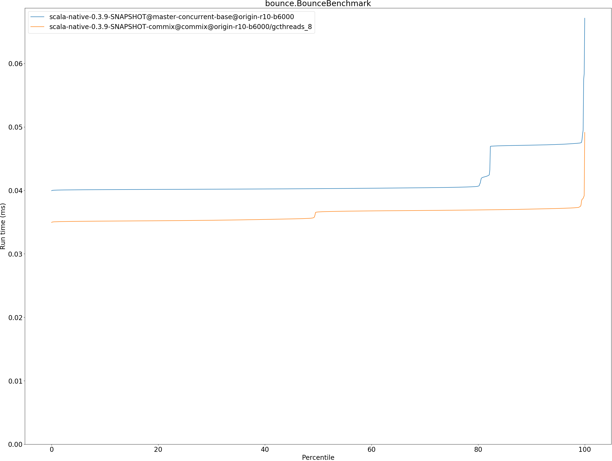
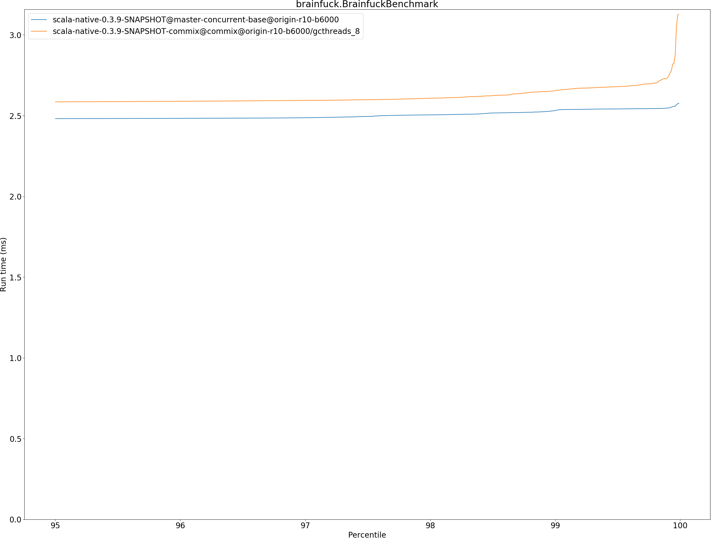
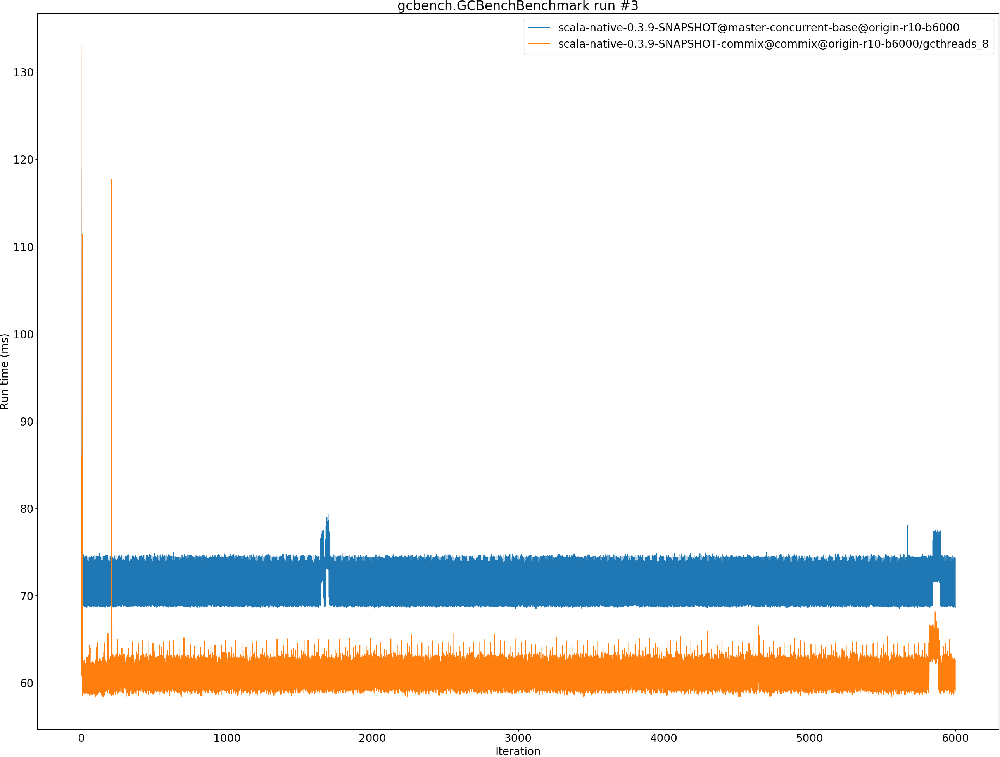
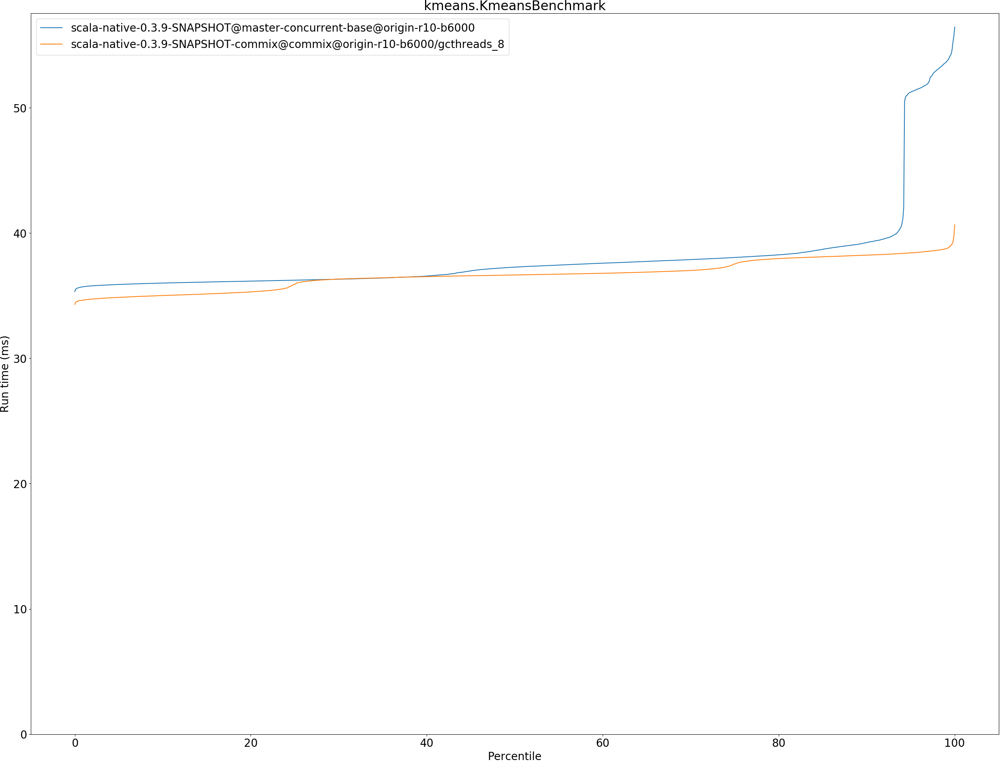
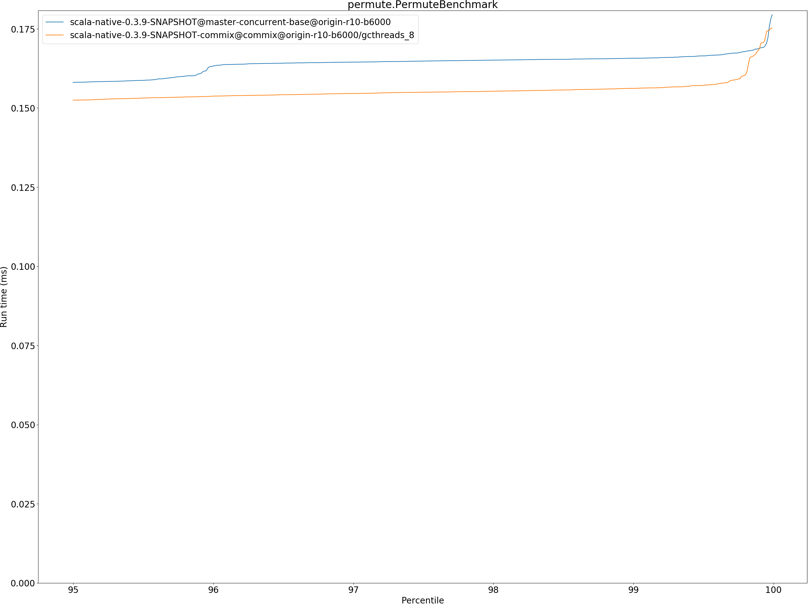
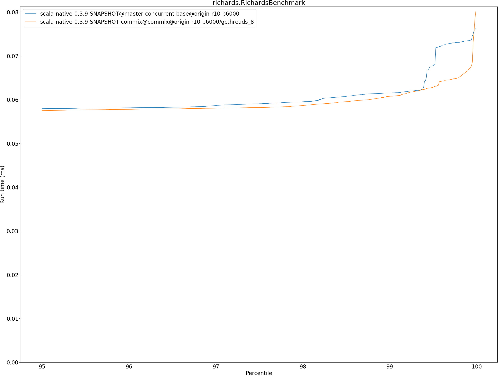

# Summary
## Benchmark run time (ms) at 50 percentile 

|name | scala-native-0.3.9-SNAPSHOT@master-concurrent-base@origin-r10-b6000 | scala-native-0.3.9-SNAPSHOT-commix@commix@origin-r10-b6000/gcthreads_8 | |
| -- | -- | -- | -- |
|[bounce.BounceBenchmark](#bouncebouncebenchmark)|0.0403|0.0366|__-9.11%__|
|[brainfuck.BrainfuckBenchmark](#brainfuckbrainfuckbenchmark)|2.4376|2.5012|+2.61%|
|[cd.CDBenchmark](#cdcdbenchmark)|17.3664|16.8943|__-2.72%__|
|[deltablue.DeltaBlueBenchmark](#deltabluedeltabluebenchmark)|0.1350|0.1399|+3.60%|
|[gcbench.GCBenchBenchmark](#gcbenchgcbenchbenchmark)|73.4489|60.0789|__-18.20%__|
|[json.JsonBenchmark](#jsonjsonbenchmark)|0.9422|0.9790|+3.90%|
|[kmeans.KmeansBenchmark](#kmeanskmeansbenchmark)|37.2689|36.6439|__-1.68%__|
|[mandelbrot.MandelbrotBenchmark](#mandelbrotmandelbrotbenchmark)|100.7234|100.8254|+0.10%|
|[nbody.NbodyBenchmark](#nbodynbodybenchmark)|25.6578|25.6667|+0.03%|
|[permute.PermuteBenchmark](#permutepermutebenchmark)|0.1438|0.1416|__-1.56%__|
|[queens.QueensBenchmark](#queensqueensbenchmark)|0.0478|0.0478|__-0.10%__|
|[richards.RichardsBenchmark](#richardsrichardsbenchmark)|0.0553|0.0548|__-0.75%__|
|[sudoku.SudokuBenchmark](#sudokusudokubenchmark)|1.5894|1.6244|+2.20%|
|[tracer.TracerBenchmark](#tracertracerbenchmark)|0.4758|0.4867|+2.29%|
| __Geometrical mean:__|| |__-1.56%__|
## Benchmark run time (ms) at 90 percentile 

|name | scala-native-0.3.9-SNAPSHOT@master-concurrent-base@origin-r10-b6000 | scala-native-0.3.9-SNAPSHOT-commix@commix@origin-r10-b6000/gcthreads_8 | |
| -- | -- | -- | -- |
|[bounce.BounceBenchmark](#bouncebouncebenchmark)|0.0471|0.0370|__-21.38%__|
|[brainfuck.BrainfuckBenchmark](#brainfuckbrainfuckbenchmark)|2.4734|2.5759|+4.14%|
|[cd.CDBenchmark](#cdcdbenchmark)|17.4813|17.0126|__-2.68%__|
|[deltablue.DeltaBlueBenchmark](#deltabluedeltabluebenchmark)|0.1377|0.1440|+4.54%|
|[gcbench.GCBenchBenchmark](#gcbenchgcbenchbenchmark)|74.8655|63.4875|__-15.20%__|
|[json.JsonBenchmark](#jsonjsonbenchmark)|0.9880|0.9859|__-0.22%__|
|[kmeans.KmeansBenchmark](#kmeanskmeansbenchmark)|39.2353|38.2303|__-2.56%__|
|[mandelbrot.MandelbrotBenchmark](#mandelbrotmandelbrotbenchmark)|100.8016|100.9021|+0.10%|
|[nbody.NbodyBenchmark](#nbodynbodybenchmark)|26.0372|26.0680|+0.12%|
|[permute.PermuteBenchmark](#permutepermutebenchmark)|0.1471|0.1464|__-0.49%__|
|[queens.QueensBenchmark](#queensqueensbenchmark)|0.0482|0.0481|__-0.12%__|
|[richards.RichardsBenchmark](#richardsrichardsbenchmark)|0.0569|0.0560|__-1.43%__|
|[sudoku.SudokuBenchmark](#sudokusudokubenchmark)|1.6993|1.8132|+6.70%|
|[tracer.TracerBenchmark](#tracertracerbenchmark)|0.4805|0.5332|+10.98%|
| __Geometrical mean:__|| |__-1.59%__|
## Benchmark run time (ms) at 99 percentile 

|name | scala-native-0.3.9-SNAPSHOT@master-concurrent-base@origin-r10-b6000 | scala-native-0.3.9-SNAPSHOT-commix@commix@origin-r10-b6000/gcthreads_8 | |
| -- | -- | -- | -- |
|[bounce.BounceBenchmark](#bouncebouncebenchmark)|0.0475|0.0374|__-21.21%__|
|[brainfuck.BrainfuckBenchmark](#brainfuckbrainfuckbenchmark)|2.5319|2.6549|+4.86%|
|[cd.CDBenchmark](#cdcdbenchmark)|18.6893|17.8495|__-4.49%__|
|[deltablue.DeltaBlueBenchmark](#deltabluedeltabluebenchmark)|0.1815|0.1813|__-0.08%__|
|[gcbench.GCBenchBenchmark](#gcbenchgcbenchbenchmark)|87.1856|64.8829|__-25.58%__|
|[json.JsonBenchmark](#jsonjsonbenchmark)|1.1873|1.0378|__-12.59%__|
|[kmeans.KmeansBenchmark](#kmeanskmeansbenchmark)|53.6077|38.7417|__-27.73%__|
|[mandelbrot.MandelbrotBenchmark](#mandelbrotmandelbrotbenchmark)|105.6436|101.1344|__-4.27%__|
|[nbody.NbodyBenchmark](#nbodynbodybenchmark)|27.1326|27.1178|__-0.05%__|
|[permute.PermuteBenchmark](#permutepermutebenchmark)|0.1657|0.1562|__-5.74%__|
|[queens.QueensBenchmark](#queensqueensbenchmark)|0.0504|0.0503|__-0.14%__|
|[richards.RichardsBenchmark](#richardsrichardsbenchmark)|0.0615|0.0608|__-1.27%__|
|[sudoku.SudokuBenchmark](#sudokusudokubenchmark)|1.7154|2.1484|+25.24%|
|[tracer.TracerBenchmark](#tracertracerbenchmark)|0.4842|0.5905|+21.94%|
| __Geometrical mean:__|| |__-4.79%__|
## Benchmark run time (ms) at 99.9 percentile 

|name | scala-native-0.3.9-SNAPSHOT@master-concurrent-base@origin-r10-b6000 | scala-native-0.3.9-SNAPSHOT-commix@commix@origin-r10-b6000/gcthreads_8 | |
| -- | -- | -- | -- |
|[bounce.BounceBenchmark](#bouncebouncebenchmark)|0.0584|0.0392|__-32.90%__|
|[brainfuck.BrainfuckBenchmark](#brainfuckbrainfuckbenchmark)|2.5472|2.7359|+7.41%|
|[cd.CDBenchmark](#cdcdbenchmark)|22.7406|18.0732|__-20.52%__|
|[deltablue.DeltaBlueBenchmark](#deltabluedeltabluebenchmark)|0.1911|0.1971|+3.14%|
|[gcbench.GCBenchBenchmark](#gcbenchgcbenchbenchmark)|88.7142|66.4954|__-25.05%__|
|[json.JsonBenchmark](#jsonjsonbenchmark)|1.1968|1.0720|__-10.43%__|
|[kmeans.KmeansBenchmark](#kmeanskmeansbenchmark)|55.7271|39.7190|__-28.73%__|
|[mandelbrot.MandelbrotBenchmark](#mandelbrotmandelbrotbenchmark)|108.2877|101.3081|__-6.45%__|
|[nbody.NbodyBenchmark](#nbodynbodybenchmark)|32.8011|36.0943|+10.04%|
|[permute.PermuteBenchmark](#permutepermutebenchmark)|0.1689|0.1688|__-0.03%__|
|[queens.QueensBenchmark](#queensqueensbenchmark)|0.0677|0.0588|__-13.12%__|
|[richards.RichardsBenchmark](#richardsrichardsbenchmark)|0.0735|0.0667|__-9.26%__|
|[sudoku.SudokuBenchmark](#sudokusudokubenchmark)|1.7321|2.4259|+40.05%|
|[tracer.TracerBenchmark](#tracertracerbenchmark)|0.5124|0.6175|+20.51%|
| __Geometrical mean:__|| |__-6.55%__|
## Benchmark total run time (ms) 

|name | scala-native-0.3.9-SNAPSHOT@master-concurrent-base@origin-r10-b6000 | scala-native-0.3.9-SNAPSHOT-commix@commix@origin-r10-b6000/gcthreads_8 | |
| -- | -- | -- | -- |
|[bounce.BounceBenchmark](#bouncebouncebenchmark)|415.4945|361.1412|__-13.08%__|
|[brainfuck.BrainfuckBenchmark](#brainfuckbrainfuckbenchmark)|24144.9188|24431.4710|+1.19%|
|[cd.CDBenchmark](#cdcdbenchmark)|174244.8210|168671.5379|__-3.20%__|
|[deltablue.DeltaBlueBenchmark](#deltabluedeltabluebenchmark)|1354.4729|1420.0258|+4.84%|
|[gcbench.GCBenchBenchmark](#gcbenchgcbenchbenchmark)|721843.2451|610711.4480|__-15.40%__|
|[json.JsonBenchmark](#jsonjsonbenchmark)|9498.9164|9601.5627|+1.08%|
|[kmeans.KmeansBenchmark](#kmeanskmeansbenchmark)|380496.6427|366479.0764|__-3.68%__|
|[mandelbrot.MandelbrotBenchmark](#mandelbrotmandelbrotbenchmark)|1008824.3488|990748.1153|__-1.79%__|
|[nbody.NbodyBenchmark](#nbodynbodybenchmark)|257494.2868|257884.3853|+0.15%|
|[permute.PermuteBenchmark](#permutepermutebenchmark)|1435.3463|1428.9386|__-0.45%__|
|[queens.QueensBenchmark](#queensqueensbenchmark)|479.2776|478.4728|__-0.17%__|
|[richards.RichardsBenchmark](#richardsrichardsbenchmark)|556.9631|544.2502|__-2.28%__|
|[sudoku.SudokuBenchmark](#sudokusudokubenchmark)|16100.3200|16620.4691|+3.23%|
|[tracer.TracerBenchmark](#tracertracerbenchmark)|4674.9020|4957.2525|+6.04%|
| __Geometrical mean:__|| |__-1.86%__|
# Individual benchmarks
## bounce.BounceBenchmark

## brainfuck.BrainfuckBenchmark

## cd.CDBenchmark

## deltablue.DeltaBlueBenchmark

## gcbench.GCBenchBenchmark

## json.JsonBenchmark

## kmeans.KmeansBenchmark

## mandelbrot.MandelbrotBenchmark

## nbody.NbodyBenchmark

## permute.PermuteBenchmark

## queens.QueensBenchmark

## richards.RichardsBenchmark

## sudoku.SudokuBenchmark

## tracer.TracerBenchmark

